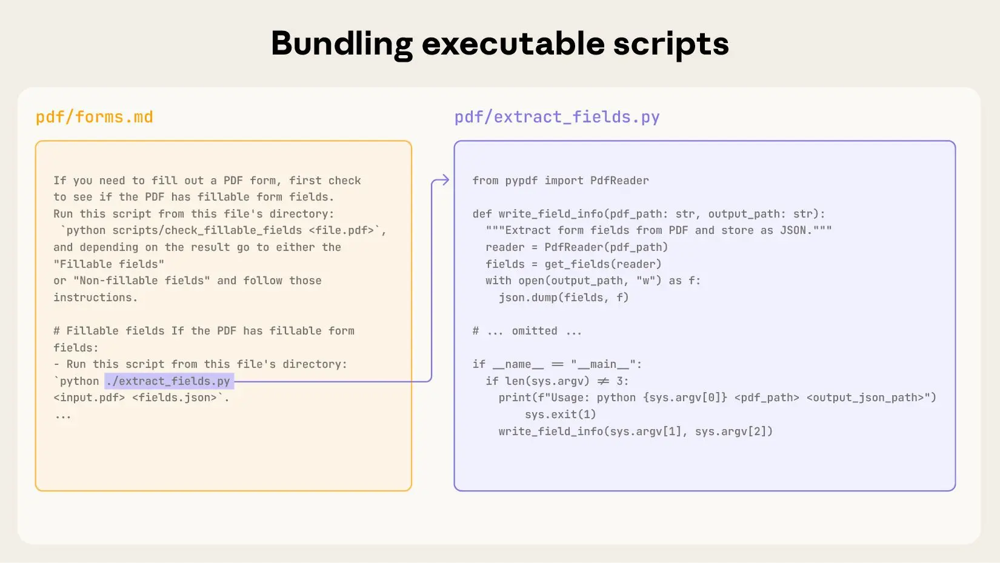
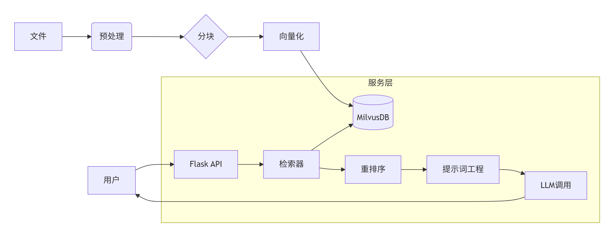
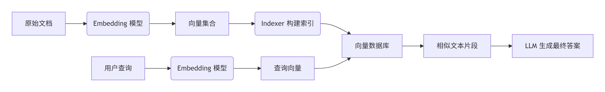
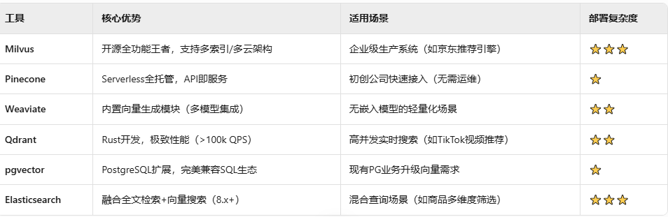

# **DK百科不全书-AI应用**

本文档主要针对AI应用, Aagent一类, 模型/算法不在此详细讨论

## **模型**

{width="5.770833333333333in" height="5.833333333333333in"}

{width="5.770833333333333in" height="1.3958333333333333in"}

## **Agent**

### **Agent模式介绍**

+------------------+---------------------------------------------------------------------+----------+----------+----------+-----------------------------------------------------------------+
| 模式名称         | 一句话介绍                                                          | 成本指数 | 速度指数 | 准确指数 | 适用场景                                                        |
+------------------+---------------------------------------------------------------------+----------+----------+----------+-----------------------------------------------------------------+
| ReWOO            | Reasoning WithOut Observation,减少ReAct的重复计算, 一次生成执行计划 | 1(最低)  | 1(最快)  | 5(最差)  | 批量数据处理,定期报表生成                                       |
+------------------+---------------------------------------------------------------------+----------+----------+----------+-----------------------------------------------------------------+
| ReAct            | Reasoning and Acting                                                | 3        | 2        | 4        | 简单信息查询,多跳问答,数据分析,代码调试智能客服,交互任务/机器人 |
|                  |                                                                     |          |          |          |                                                                 |
|                  | 重复思考-行动-观察的迭代模式                                        |          |          |          |                                                                 |
+------------------+---------------------------------------------------------------------+----------+----------+----------+-----------------------------------------------------------------+
| Reflection       | 生成-批判-优化迭代输出结果, 和ReAct形式相似                         | 4        | 4        | 1        | 技术文档写作,代码生成                                           |
+------------------+---------------------------------------------------------------------+----------+----------+----------+-----------------------------------------------------------------+
| Multi-Agent      | 多agent协作, 小模型专家合体首选                                     | 4        | 3        | 2        | 跨领域复杂任务,综合工作流                                       |
+------------------+---------------------------------------------------------------------+----------+----------+----------+-----------------------------------------------------------------+
| Plan-and-Execute | 整体输出规划,局部分开执行;ReWOO加强版                               | 2        | 3        | 3        | 软件工程整体项目设计,研究报告撰写                               |
+------------------+---------------------------------------------------------------------+----------+----------+----------+-----------------------------------------------------------------+
| Tree of Thoughts | 多条推理路径,尝试多重不同的解决方案                                 | 5(最高)  | 5(最慢)  | 1(最准)  | 创意内容生成,数学问题求解,复杂决策分析                          |
+------------------+---------------------------------------------------------------------+----------+----------+----------+-----------------------------------------------------------------+

其他探索中的模式:

1.  LATS, Language Agent Tree Search; 适用于复杂推理

2.  Self-RAG, 通过迭代答案, 自思考是否需要RAG知识, 会涉及到动态prompt,能力调用等

3.  CodeAct, 模型推理-\>编程-\>执行-\>获取结果-\>循环; 像当前cc等编程工具的工作模式

### **Agent输出方式**

{width="5.770833333333333in" height="1.1875in"}

### **AI应用各层级职责/工具**

  ----------------------- ----------------------- -------------------------------------------------------------------------------------
  prompt                  应用级                  AI应用框架中, chat template,作为chat model的前置

  Agent                                           AI应用主要开发对象, 串联起tool,chatmodel的功能, 同时利用编排能力进行agent的能力限制

  function call                                   在AI应用框架中, 作为tool的实现, tool calling

  RAG                                             知识库相关的,需要向量化(indexer)处理数据, 同时需要向量化数据库的支持;步骤下面详述

  fine tune               模型级                  不是应用框架可以处理的, 和蒸馏相似, 是对模型进行调整, 需要transfomer,pytorch等
  ----------------------- ----------------------- -------------------------------------------------------------------------------------

~~MCP是理解到需求内容后, MCP client发出通用协议请求到MCP server; MCP server有本地或者远程; 本地即server运行在agent运行环境本地, 可以操作本地文件等; 远程则可以做搜索引擎或其他查询相关;~~

~~tool calling是在应用框架内代码编写的逻辑,可以做远程调用或本地操作(功能上是类似的, 不过MCP是统一协议更方便server的复用, 而client也只要做一次兼容就行)~~

**~~AI Agent~~**

~~传统AI Agent中(笑死agent都能说是传统了)~~

~~llm模型是不感知到tool和MCP的~~

~~tool calling是agent编排中workflow定义的调用~~

~~MCP client可以在LLM前或后理解内容调用~~

**~~ReAct Agent~~**

~~有点像弱化的agentic~~

**~~Agentic AI~~**

~~感知AI-\>决策AI-\>控制AI, AI判断是否做tool calling 或者是 通过MCP client进行能力调用, 在这里是不冲突的~~

## Skills

关联资料

"渐进式披露"机制: <https://www.anthropic.com/engineering/equipping-agents-for-the-real-world-with-agent-skills>

上下文工程(Effective context engineering for AI agents https://www.anthropic.com/engineering/effective-context-engineering-for-ai-agents)

即时加载(Just-in-time loading)策略

### 概括

{width="4.166666666666667in" height="2.34375in"}

1.  元数据层: 将skills的名称和描述注入系统prompt, 类似冷启动, 不加载全部数据, lazy按需加载;

2.  指令层: 模型语义判断与某个skill的元数据匹配时, [主动调用对应skill.md](主动调用对应skill.md), 重新组织context, 将详情内容注入;

3.  资源层: skill详情内关联的脚本or其他文档; 执行环境

  ------------------------------------------------------------------------------------------ -------------------------------------------------------------------------------------------
  {width="2.6939916885389326in" height="1.744359142607174in"}   {width="3.0782294400699914in" height="1.7315037182852144in"}

  ------------------------------------------------------------------------------------------ -------------------------------------------------------------------------------------------

顺序:

\[元数据\] \--默认prompt\--\> \[模型\] \--需要技能\--\> \[指令层\] \--技能prompt\--\> \[模型\] \--能力执行\--\> \[资源层/MCP调用 \| 沙箱虚拟环境\]

索引, 匹配索引, 具体;

### 关键点

-   动态context

-   沙箱虚拟环境

## 沙箱运行

-   安全隔离: 隔离AI模型的幻觉误操作或者是恶意插件/MCP/Skills等攻击行为

    -   系统破坏

    -   恶意代码执行

    -   隐私泄露

-   环境的一致性

-   资源限制

-   状态重置和多任务并发

每次执行完一个任务, 沙箱会销毁, 状态直接重置; 也有持久型, 长期存在

-   跨平台能力

云端沙箱的特点

**趋势重点:** 极速启动, 跨工具集成(可以直接MCP协议接入调用)

### 主流使用

-   E2B (Excited to Build)

-   InstaVM

-   AIO Sandbox

-   Modal

-   腾讯云Agent沙箱服务

-   无影AgentBay

### 分类

#### 部署位置

-   云端

-   本地

-   混合都支持

#### 底层技术架构

-   微虚拟机

-   WASM型

-   容器型

#### 生命周期

-   瞬时型: 任务执行完立刻销毁

-   持久型: 长期运行, 保存状态

## **RAG**

### **RAG的indexer, retriever工作环节**

{width="5.770833333333333in" height="2.2291666666666665in"}

{width="5.770833333333333in" height="0.875in"}

向量存储

{width="5.770833333333333in" height="1.875in"}

### **indexer阶段进行增量更新:**

本质通过**哈希指纹**和**记录管理**实现变化感知

{width="5.770833333333333in" height="6.84375in"}

## **书-RAG实战**

### **基础**

Retrieval Augmented Generation，检索增强生成

RAG(或者说上下文工程)和微调

{width="5.770833333333333in" height="1.5833333333333333in"}

#### **RAG工作流程**

{width="5.770833333333333in" height="3.3645833333333335in"}

1.  数据准备: 文件/数据分块, embedding, 存入向量数据库/图数据库

2.  数据召回: retrieve过程, 对答案处理, embedding, 搜索数据库, 结果排序/召回

3.  答案生成: 根据召回结果, 结合prompt, 生成LLM答案

#### **RAG优缺点**

**优点**

1.  高质量答案生成, 减少幻觉

2.  可扩展性

3.  模型可解释性

4.  成本效益

**缺点**

1.  依赖检索模块: 搜索的结果好坏决定了模型输出的结果

2.  依赖现有知识库: 当前的知识库如果过时答案就会不准确

3.  推理耗时: 整体调用链路增加了

4.  上下文窗口限制: 上下文窗口限制了检索结果的展示

{width="5.770833333333333in" height="1.78125in"}

伸缩法则是什么?

**伸缩法则是指随着模型的大小、数据集的大小以及用于训练的计算量的增加，模型的性能会提升**

且是三点同时增加

{width="5.770833333333333in" height="4.447916666666667in"}

复杂的推理任务时, RAG召回结果是最匹配的, 但不是推理过程最理想的;

这种情况是否可以引入知识谱图相关的图索引?

#### **语言模型基础**

{width="5.770833333333333in" height="7.052083333333333in"}

编码器是理解过程? 解码器是生成过程?

{width="5.479166666666667in" height="4.739583333333333in"}

embedding除了**单词编码**还有**位置编码**(毕竟要表示语义)

三种**静态embedding**方式:

-   神经网络编码

基于NNLM, 由一个词嵌入层(生成词embedding表示); 若干个隐藏层(生成词embedding的非线性关系), 一个激活层(生成整个词汇表每个单词的概率分布)

{width="5.770833333333333in" height="4.15625in"}

-   词向量

word2vector, 有两种模式: 词袋模型(bag of words) 和 跳跃(skip gram)模型

又称CBOW模型

{width="5.770833333333333in" height="4.78125in"}

-   全局词向量

GloVe, 基于全局信息来获取词向量的方法

说实话, 完全没懂, 补充一下三种的优劣

位置编码也再看下吧\...

编码器的多头注意力..这个要看下注意力机制和transformer的原理了

**动态embedding**

**自动编码器**

注意一下**ELMo**, 对比前面静态的embedding, 这个是动态的

但是ELMo是基于传统的LSTM的

{width="5.770833333333333in" height="2.8333333333333335in"}

谷歌的BERT(之前我们的也是用了一个变种的BERT)

BERT还是Transformer架构, 使用的是编码器部分; **适合语言理解,推理等**

后续还有很多BERT变种

**自回归模型**

**GPT**

GPT是根据transformer工作原理改进的, 只保留了解码层; 适合**文本生成**

{width="5.770833333333333in" height="4.958333333333333in"}

**LLaMA**

llama还是transformer的解码器架构

这几个之间是什么样的关系, 是处理什么问题的?

##### **LSTM和Transformer的区别**

{width="5.770833333333333in" height="2.0104166666666665in"}

LSTM在2017年注意力机制之前是统治地位, 在2017年之后大多偏向于注意力机制和后续发展出的Transformer架构

#### **文本召回模型**

文本向量检索模型(向量化模型); 进行文本转向量(按我理解是通过embedding等手段实现)

两个环节

-   文本片段向量化(这是知识库的构建?)

-   用户查询向量化(这里是用户每次查询内容去和知识库匹配时要做的)

目前大致分两类模型:

-   基于BERT,GPT的稠密向量检索模型

适合提取文中语义信息; 适合推理任务

-   以TF-IDF,BM25为代表的稀疏向量检索模型

适合提取关键词信息; 适合简单的扩充

大部分都是将文本转化到向量空间进行比对; (BM25比较特殊, 是直接比对文本相似度)

良好的文本向量空间有以下两个特点:

-   对齐性: 相似语义的文本在向量空间有接近的距离

-   均匀性: 向量是均分分布在整个空间中, 而不是全部聚集在某处的

文本相似度 **约等于** 文本向量空间的距离

向量距离度量方式:

-   余弦相似度

-   欧氏距离

{width="5.770833333333333in" height="2.5in"}

好像目前大部分都是使用稠密向量检索

{width="5.770833333333333in" height="4.822916666666667in"}

#### **稠密向量检索模型**

1.  SimCSE

2.  SBERT

3.  CoSENT

4.  WhiteBERT

5.  SGPT

前面四种都是BERT的变种改造的, 最后一个是解码器结构的

#### **稀疏向量检索模型**

1.  朴素词袋模型

2.  TF-IDF

3.  BM25

langchain有集成这些朴素的retriever

#### **重排序模型**

召回流程

{width="5.770833333333333in" height="2.34375in"}

交叉编码器是什么?

### **原理**

#### **核心技术和优化方法**

##### **提示词工程**

但是注意, 目前的发展提示词工程(prompt engineering)和RAG都向上下文工程 Context Engineering发展了

所有的AI应用(Agent)都会引入上下文的管理

文中有说\"**prompt工程本质上是LLM不成熟的副产品**\"

prompt能做的事

1.  描述答案的标注: 让回答更详细/更简短等

2.  设置兜底回答: 在无法有准确的回答时, 返回设置的兜底; 减少幻觉

3.  输入中提供回答示例: 给模型提供示例辅助推理?

4.  识别出prompt中不同类型的内容: 比如假指令, 类似防注入那样

5.  设定输出格式: 限定输出的文本格式

6.  指定大模型身份: 在system prompt中很常见的, 你是一个XXX

7.  使用思维链: 指定推理过程

RAG场景下, 我们同时召回了多个有关问题的文本段, 一般情况下, 会按相似度最高的顺序放入LLM的输入中

{width="5.770833333333333in" height="4.979166666666667in"}

##### **文本切块 chunk**

**切块过长**

向量化损失更多信息; 对比查找时准确率降低

**切块过短**

容易丢失段落, 文档层面的主题信息, 跨段落的上下文信息

方法

1.  固定大小文本切块

最简单, 实际应用时会有边界的重叠文本; 比如: 1234567, \[1234\] \[4567\]边界会有重复, 防止上下文丢失; 但总体还是很生硬

1.  基于NLTK的文本切块

```{=html}
<!-- -->
```
1.  特殊格式文本切块

2.  基于深度学习模型的文本切块

除了文中的还有文章结构分块, 段落分块, 句子分块, 递归分块

{width="5.770833333333333in" height="2.9375in"}

##### **向量数据库**

这就多了去了, 可以详细去看看[DK百科全书-向量数据库](https://docs.qq.com/doc/DUEdJSGZmcHBETGJm?no_promotion=1)

列一下书里介绍的

1.  Faiss

2.  Milvus

3.  Weaviate

4.  Chrome

5.  Qdrant

部分索引算法介绍:

1.  精确检索

暴力遍历检索, 将所有向量逐个匹配

1.  倒排索引

向量检索场景下倒排索引和文本的全文检索不一样; 先对所有向量进行聚类, 每次检索只对聚类中心向量计算相似度, 找到最相似的几个聚类; 然后在这些聚类内进行精确检索;

{width="5.770833333333333in" height="6.375in"}

1.  乘积量化

将聚类和向量切片思想相结合的方法; 可以在小内存实现快速检索, 但会降低准确率;

这个方法将所有向量分成M段切片, 然后对每段切片进行聚类, 聚类数量固定(256); 每个类别ID用一个字节表示; 同时保存每段向量切片的聚类中心向量;

查询时:1) 对查询向量进行切片;2)计算每个查询向量的切片刀256个聚类中心的距离; 3)通过聚类中心ID,查询每个向量到查询向量的相似度;

**问题**: 如何分切片? 依据是什么?

{width="5.770833333333333in" height="2.7604166666666665in"}

1.  分层可导航小世界(HNSW)

维护一个有向的小世界图结构, 每个向量代表一个图节点, 有边连接的两个节点通常表示在向量空间中距离较近,少部分会有距离较远的;根据边的跨度对图进行分层, 每次检索, 查询向量从最上层的图查找最近似的, 然后根据该节点逐层往下查找最近距离的节点; 精度可**接近于精确检索**, 但方法的**建图过程慢, 占用较多的内存**;

{width="5.697916666666667in" height="7.1875in"}

1.  局部敏感哈希

LSH, 近似快速检索技术, 概率算法

##### **召回环节优化**

**短文本全局信息增强**

embedding的过程是一种压缩过程, 会有语义的丢失; 避免这种情况的恶化, 将长文本切分成若干短文本段, 分别进行向量化

最可能包含全局信息的三种:

1.  长文本的前三句话

2.  长文本的标题

3.  长文本的关键词

**召回内容上下文扩充**

召回内容是向量化后的数据? 所以会有信息损失? 不会再根据向量检索到原始文本的吗?

**解释:** 这里应该说的是召回过程中都是向量的匹配的, 最后得到召回结果后, 生成LLM的输入文本时才获取原始文本; 而召回过程期间, 都是进行向量的检索计算, 重排序等;

因为上有上面的问题存在,所以需要对信息损失的内容进行扩充, \"父文本检索\"将原始文本进行扩充;

文本生成补充向量的方法:

1.  文本切块

2.  文档的摘要

3.  假设性问题: 预设可能的关联问题; \"用问题召回问题\"比\"用问题召回答案\"简单

**文本多向量表示**

构建向量数据库时, 使用多个向量来表示一个文本

不仅对完整文本A生成向量, 还对他的子集, 总结/概要等生成向量; 作为补充向量, 补充向量命中时, 返回文本A的内容

**查询内容优化**

针对口语化,语义模糊,无关内容过多的原始文本; 对其进行改写

文本对称检索和非对称检索

问题容易匹配出问题近义的向量, 但会缺少对关键词的解释的

对关键词提取, 展开问题检索

看看HyDE方法(假设文档嵌入)

**召回文本重排序**

RAG场景下默认使用向量召回(这样吗?)

改进方法:

在向量召回的基础上, 使用消耗更多计算资源但效果更好的重排序模型; 从召回的候选文本中精选出和用户查询最相关的文本;

就是查询更多候选结果, 然后进行排序, 召回; \"多级排序\"

**多检索器融合**

多个检索融合, 一般现在构成都是生成TOP K结果, 再进行排序

**结合元数据召回**

结合元信息, 标签等, 但需要在构建知识库时进行标注

##### **效果评估**

**召回环节评估 (检索阶段)**

命中率

平均倒数排名

**模型回答评估 (生成阶段)**

选择题评估法

竞技场评估法

传统NLP指标评估法

向量化模型评估法

LLM评估法

**RAG专用评估框架: RAGAS**

关注3个方面

-   忠实度

-   答案相关性

-   上下文相关性

##### **LLM能力优化**

**LLM微调**

比喻为\"0\~1%参数再训练\"

{width="5.770833333333333in" height="1.1354166666666667in"}

目前知道, 最常见的是用LoRA

书中还有提到Prompt Tuning、P-Tuning、P-Tuning v2、Prefix Tuning;

{width="5.770833333333333in" height="4.166666666666667in"}

**FLARE**(Forward-Looking Active REtrieval augmented generation)

算是一种多次召回的策略

常用的多次召回策略有以下3种:

-   每生成固定的n个token就召回一次

-   每生成一个完整的句子就召回一次

-   将用户问题一步步分解为子问题, 需要解答当前子问题时, 就召回一次

**Self-RAG**

这就是自我决定是否要进行召回文本的操作;

会有两个模型: 判别模型和生成模型;

那么在现在注重context engineering的背景下, 更多的会在整个流程的前置中过一个Agentic AI, 让模型决定是否要进行RAG或者是上下文补充, 并且查询可用能力调用外部能力(比如MCP, 或者直接的functiong call); 甚至后续决定使用哪些专用的LLM, 还有后续进行react思考;

#### **RAG范式演变**

##### **基础RAG**

{width="5.770833333333333in" height="2.75in"}

存在的问题

1.  检索问题

难以检索到合适的上下文

1.  语义歧义

2.  向量大小与方向

3.  粒度不匹配

4.  全局与局部相似性

5.  稀疏检索挑战

6.  增强问题

用策略将检索结果变得更加可用;

1.  上下文整合

2.  冗余与重复

3.  排序和优先级

4.  风格或预期的匹配

5.  过度依赖检索内容

6.  生成问题

7.  生成文本的连贯性和一致性

8.  冗长或冗余的输出

9.  过度概括

10. 缺乏深度或洞察力

11. 检索中的错误传播

12. 风格不一致

13. 未能解决矛盾

14. 忽略上下文

##### **先进RAG**

-   数据清理

文本清理, 规范化文本格式输入

消除歧义, 名词保持一致

删除重复文本, 减少重复冗余的可能

文档分割, 就是chunk

特定领域注释, 对特定领域文本向量做标签化处理

数据增强, 同义词, 其他语言等丰富语料库

层次结构和关系, 要有文档间的关系, 这个会比较倾向知识谱图

用户反馈+实时更新: 语料库保持最新状态

-   微调嵌入(fine tuning embedding)

基础微调: 用文档对模型进行微调

动态嵌入: embedding方式强化

刷新嵌入: 定期更新语料库的embedding

-   增强检索

切割更小的文本块

增加\"摘要嵌入\", 和文档一起向量化, 或者直接替换文档

重新排序, 结果的相似性排序

混合检索, 多重检索方式, 结合结果

递归检索+查询引擎

-   构建提示词

prompt template

prompt补充回答提示

##### **大模型主导的RAG**

更加Agentic AI

分开 动作Agent, 计划和执行Agent

##### **多模态RAG**

除了文档, 扩充到多媒体(图片,音频,视频等)

#### **RAG系统训练**

##### **难点**

通常有两个模型

向量embedding模型

生成模型

{width="5.770833333333333in" height="2.9583333333333335in"}

计算资源/成本不在话下

另外知识库的向量数据库存储, 在模型更新后如何快速更新索引

在知识库更新时如何快速增量更新

##### **训练方法**

这些可能不太接触

-   半联合训练

-   异步更新索引训练

-   批近似

###### **独立训练**

不太懂

###### **序贯训练**

冻结召回模块

冻结生成模块

###### **联合训练**

异步更新索引

批近似

### **实战**

基于langchain
