# **DK百科不全书-AI应用**

本文档主要针对AI应用, Aagent一类, 模型/算法不在此详细讨论

## **模型**

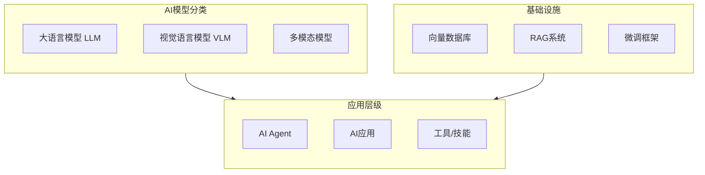

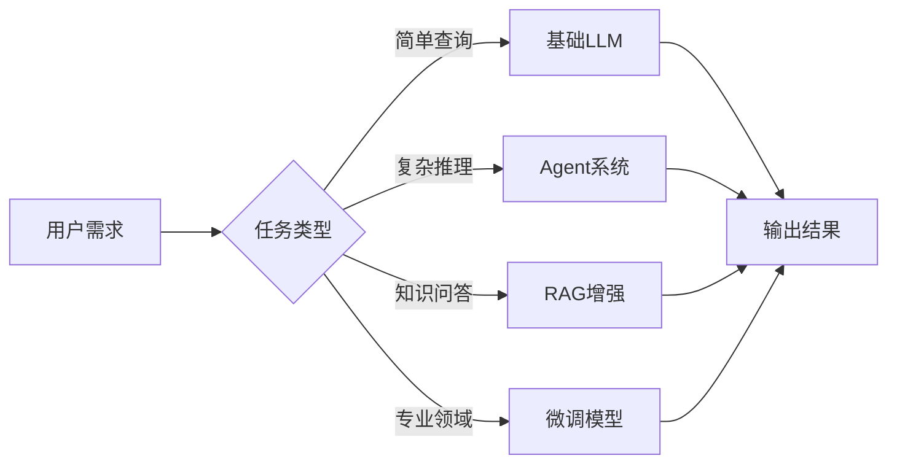

## **Agent**

### **Agent模式介绍**

+------------------+---------------------------------------------------------------------+----------+----------+----------+-----------------------------------------------------------------+
| 模式名称         | 一句话介绍                                                          | 成本指数 | 速度指数 | 准确指数 | 适用场景                                                        |
+------------------+---------------------------------------------------------------------+----------+----------+----------+-----------------------------------------------------------------+
| ReWOO            | Reasoning WithOut Observation,减少ReAct的重复计算, 一次生成执行计划 | 1(最低)  | 1(最快)  | 5(最差)  | 批量数据处理,定期报表生成                                       |
+------------------+---------------------------------------------------------------------+----------+----------+----------+-----------------------------------------------------------------+
| ReAct            | Reasoning and Acting                                                | 3        | 2        | 4        | 简单信息查询,多跳问答,数据分析,代码调试智能客服,交互任务/机器人 |
|                  |                                                                     |          |          |          |                                                                 |
|                  | 重复思考-行动-观察的迭代模式                                        |          |          |          |                                                                 |
+------------------+---------------------------------------------------------------------+----------+----------+----------+-----------------------------------------------------------------+
| Reflection       | 生成-批判-优化迭代输出结果, 和ReAct形式相似                         | 4        | 4        | 1        | 技术文档写作,代码生成                                           |
+------------------+---------------------------------------------------------------------+----------+----------+----------+-----------------------------------------------------------------+
| Multi-Agent      | 多agent协作, 小模型专家合体首选                                     | 4        | 3        | 2        | 跨领域复杂任务,综合工作流                                       |
+------------------+---------------------------------------------------------------------+----------+----------+----------+-----------------------------------------------------------------+
| Plan-and-Execute | 整体输出规划,局部分开执行;ReWOO加强版                               | 2        | 3        | 3        | 软件工程整体项目设计,研究报告撰写                               |
+------------------+---------------------------------------------------------------------+----------+----------+----------+-----------------------------------------------------------------+
| Tree of Thoughts | 多条推理路径,尝试多重不同的解决方案                                 | 5(最高)  | 5(最慢)  | 1(最准)  | 创意内容生成,数学问题求解,复杂决策分析                          |
+------------------+---------------------------------------------------------------------+----------+----------+----------+-----------------------------------------------------------------+

其他探索中的模式:

1.  LATS, Language Agent Tree Search; 适用于复杂推理

2.  Self-RAG, 通过迭代答案, 自思考是否需要RAG知识, 会涉及到动态prompt,能力调用等

3.  CodeAct, 模型推理-\>编程-\>执行-\>获取结果-\>循环; 像当前cc等编程工具的工作模式

### **Agent输出方式**

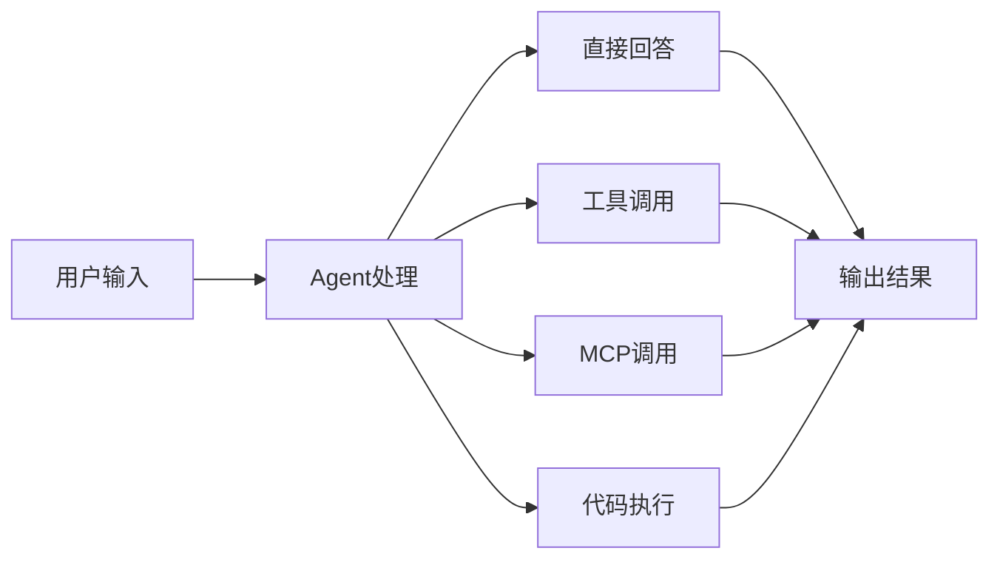

### **AI应用各层级职责/工具**

  ----------------------- ----------------------- -------------------------------------------------------------------------------------
  prompt                  应用级                  AI应用框架中, chat template,作为chat model的前置

  Agent                                           AI应用主要开发对象, 串联起tool,chatmodel的功能, 同时利用编排能力进行agent的能力限制

  function call                                   在AI应用框架中, 作为tool的实现, tool calling

  RAG                                             知识库相关的,需要向量化(indexer)处理数据, 同时需要向量化数据库的支持;步骤下面详述

  fine tune               模型级                  不是应用框架可以处理的, 和蒸馏相似, 是对模型进行调整, 需要transfomer,pytorch等
  ----------------------- ----------------------- -------------------------------------------------------------------------------------

MCP是理解到需求内容后, MCP client发出通用协议请求到MCP server; MCP server有本地或者远程; 本地即server运行在agent运行环境本地, 可以操作本地文件等; 远程则可以做搜索引擎或其他查询相关;

tool calling是在应用框架内代码编写的逻辑,可以做远程调用或本地操作(功能上是类似的, 不过MCP是统一协议更方便server的复用, 而client也只要做一次兼容就行)

**AI Agent**

传统AI Agent中(笑死agent都能说是传统了)

llm模型是不感知到tool和MCP的

tool calling是agent编排中workflow定义的调用

MCP client可以在LLM前或后理解内容调用

**ReAct Agent**

有点像弱化的agentic

**Agentic AI**

感知AI-\>决策AI-\>控制AI, AI判断是否做tool calling 或者是 通过MCP client进行能力调用, 在这里是不冲突的

## Skills

关联资料

"渐进式披露"机制: <https://www.anthropic.com/engineering/equipping-agents-for-the-real-world-with-agent-skills>

上下文工程(Effective context engineering for AI agents https://www.anthropic.com/engineering/effective-context-engineering-for-ai-agents)

即时加载(Just-in-time loading)策略

### 概括

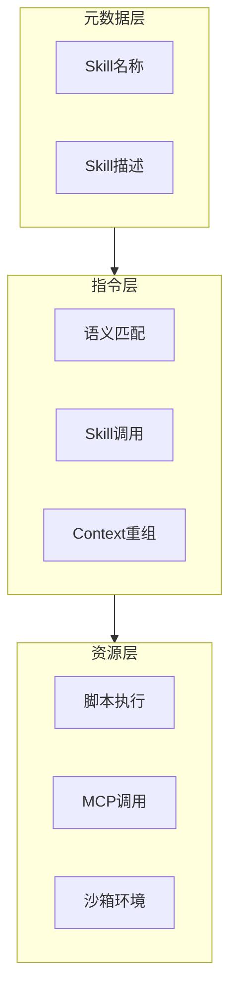

1.  元数据层: 将skills的名称和描述注入系统prompt, 类似冷启动, 不加载全部数据, lazy按需加载;

2.  指令层: 模型语义判断与某个skill的元数据匹配时, [主动调用对应skill.md](主动调用对应skill.md), 重新组织context, 将详情内容注入;

3.  资源层: skill详情内关联的脚本or其他文档; 执行环境

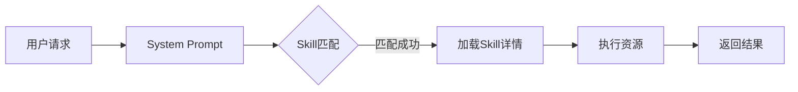

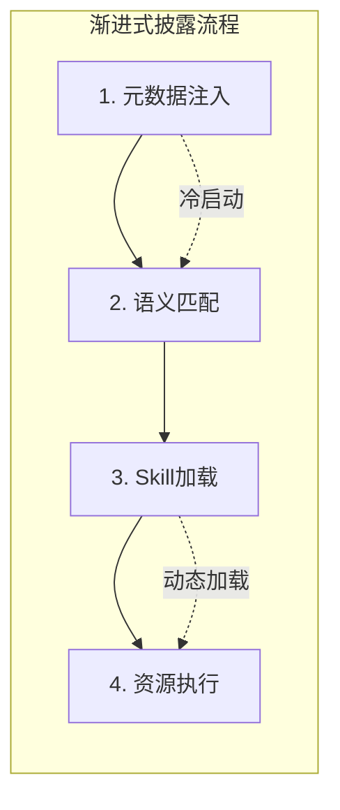

顺序:

\[元数据\] \--默认prompt\--\> \[模型\] \--需要技能\--\> \[指令层\] \--技能prompt\--\> \[模型\] \--能力执行\--\> \[资源层/MCP调用 \| 沙箱虚拟环境\]

索引, 匹配索引, 具体;

### 关键点

-   动态context

-   沙箱虚拟环境

## 沙箱运行

-   安全隔离: 隔离AI模型的幻觉误操作或者是恶意插件/MCP/Skills等攻击行为

    -   系统破坏

    -   恶意代码执行

    -   隐私泄露

-   环境的一致性

-   资源限制

-   状态重置和多任务并发

每次执行完一个任务, 沙箱会销毁, 状态直接重置; 也有持久型, 长期存在

-   跨平台能力

云端沙箱的特点

**趋势重点:** 极速启动, 跨工具集成(可以直接MCP协议接入调用)

### 主流使用

-   E2B (Excited to Build)

-   InstaVM

-   AIO Sandbox

-   Modal

-   腾讯云Agent沙箱服务

-   无影AgentBay

### 分类

#### 部署位置

-   云端

-   本地

-   混合都支持

#### 底层技术架构

-   微虚拟机

-   WASM型

-   容器型

#### 生命周期

-   瞬时型: 任务执行完立刻销毁

-   持久型: 长期运行, 保存状态

## **RAG**

### **RAG的indexer, retriever工作环节**

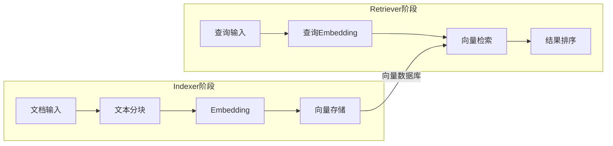

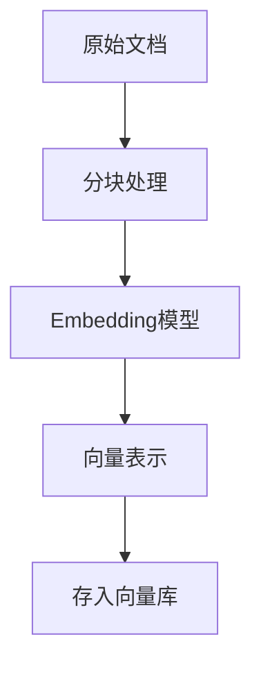

向量存储

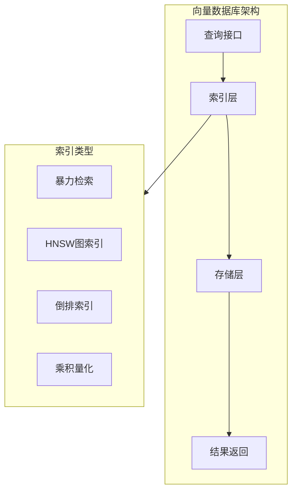

### **indexer阶段进行增量更新:**

本质通过**哈希指纹**和**记录管理**实现变化感知

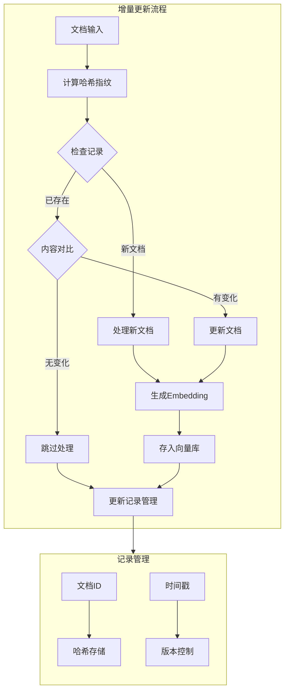

## **书-RAG实战**

### **基础**

Retrieval Augmented Generation，检索增强生成

RAG(或者说上下文工程)和微调

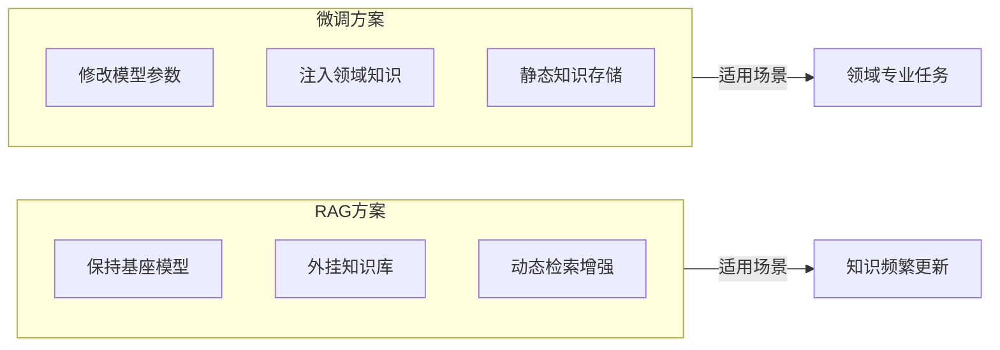

#### **RAG工作流程**

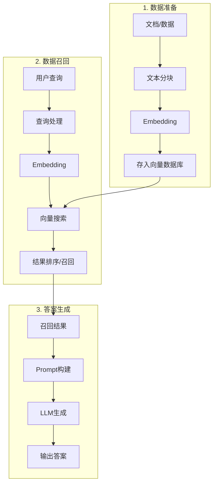

1.  数据准备: 文件/数据分块, embedding, 存入向量数据库/图数据库

2.  数据召回: retrieve过程, 对答案处理, embedding, 搜索数据库, 结果排序/召回

3.  答案生成: 根据召回结果, 结合prompt, 生成LLM答案

#### **RAG优缺点**

**优点**

1.  高质量答案生成, 减少幻觉

2.  可扩展性

3.  模型可解释性

4.  成本效益

**缺点**

1.  依赖检索模块: 搜索的结果好坏决定了模型输出的结果

2.  依赖现有知识库: 当前的知识库如果过时答案就会不准确

3.  推理耗时: 整体调用链路增加了

4.  上下文窗口限制: 上下文窗口限制了检索结果的展示

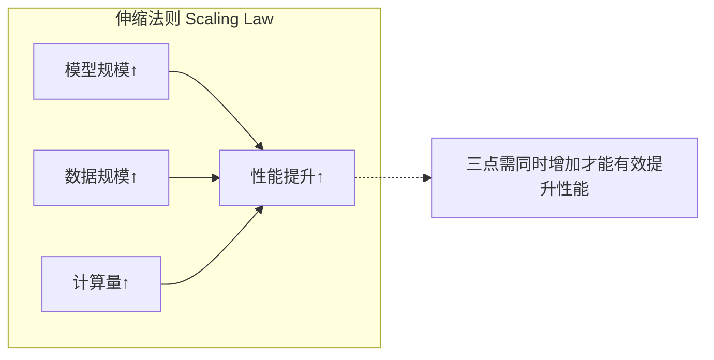

伸缩法则是什么?

**伸缩法则是指随着模型的大小、数据集的大小以及用于训练的计算量的增加，模型的性能会提升**

且是三点同时增加

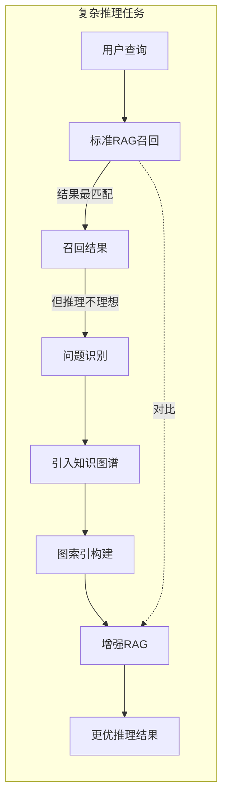

复杂的推理任务时, RAG召回结果是最匹配的, 但不是推理过程最理想的;

这种情况是否可以引入知识谱图相关的图索引?

### **语言模型基础**

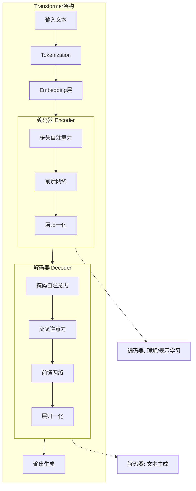

编码器是理解过程? 解码器是生成过程?

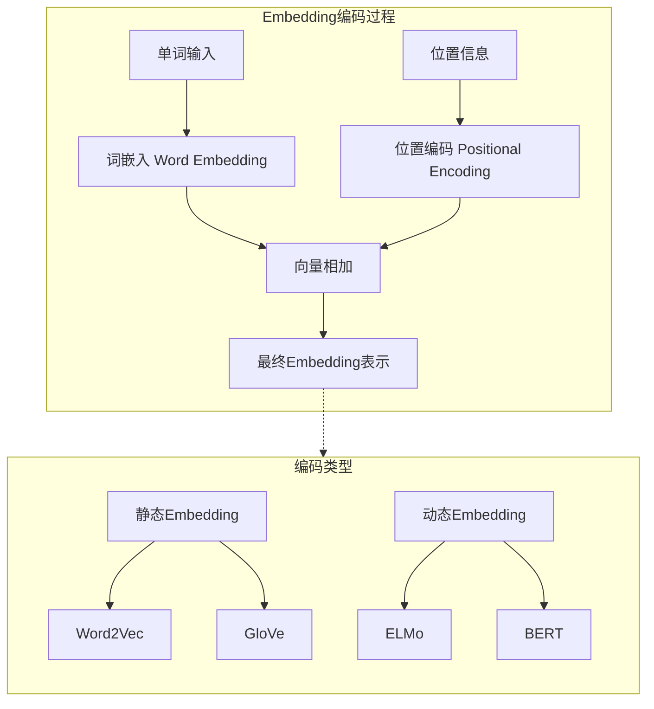

embedding除了**单词编码**还有**位置编码**(毕竟要表示语义)

三种**静态embedding**方式:

-   神经网络编码

基于NNLM, 由一个词嵌入层(生成词embedding表示); 若干个隐藏层(生成词embedding的非线性关系), 一个激活层(生成整个词汇表每个单词的概率分布)

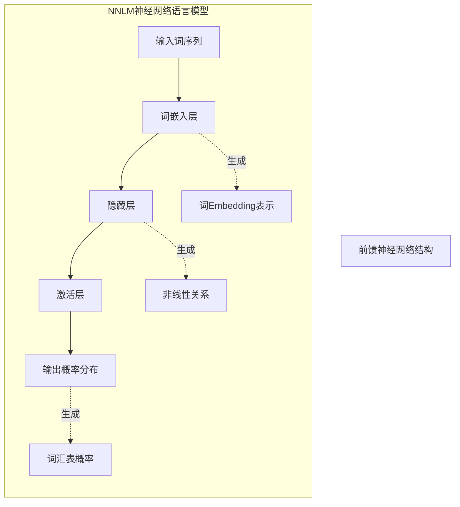

-   词向量

word2vector, 有两种模式: 词袋模型(bag of words) 和 跳跃(skip gram)模型

又称CBOW模型

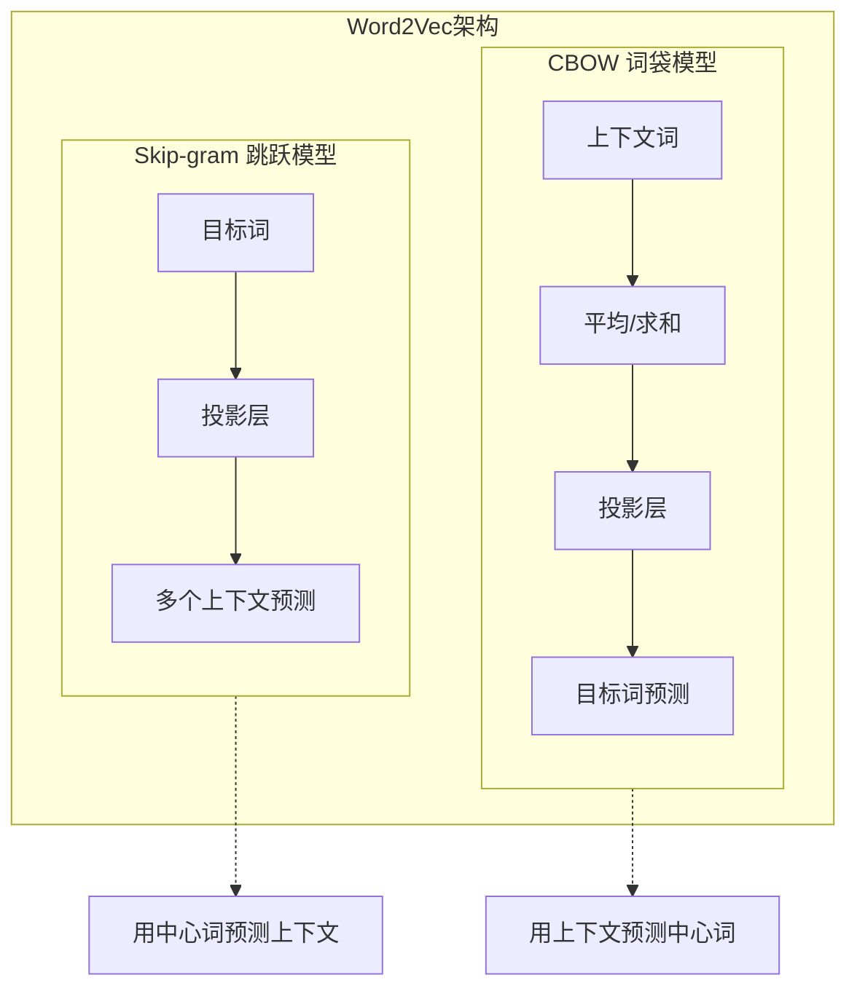

-   全局词向量

GloVe, 基于全局信息来获取词向量的方法

说实话, 完全没懂, 补充一下三种的优劣

位置编码也再看下吧\...

编码器的多头注意力..这个要看下注意力机制和transformer的原理了

**动态embedding**

**自动编码器**

注意一下**ELMo**, 对比前面静态的embedding, 这个是动态的

但是ELMo是基于传统的LSTM的

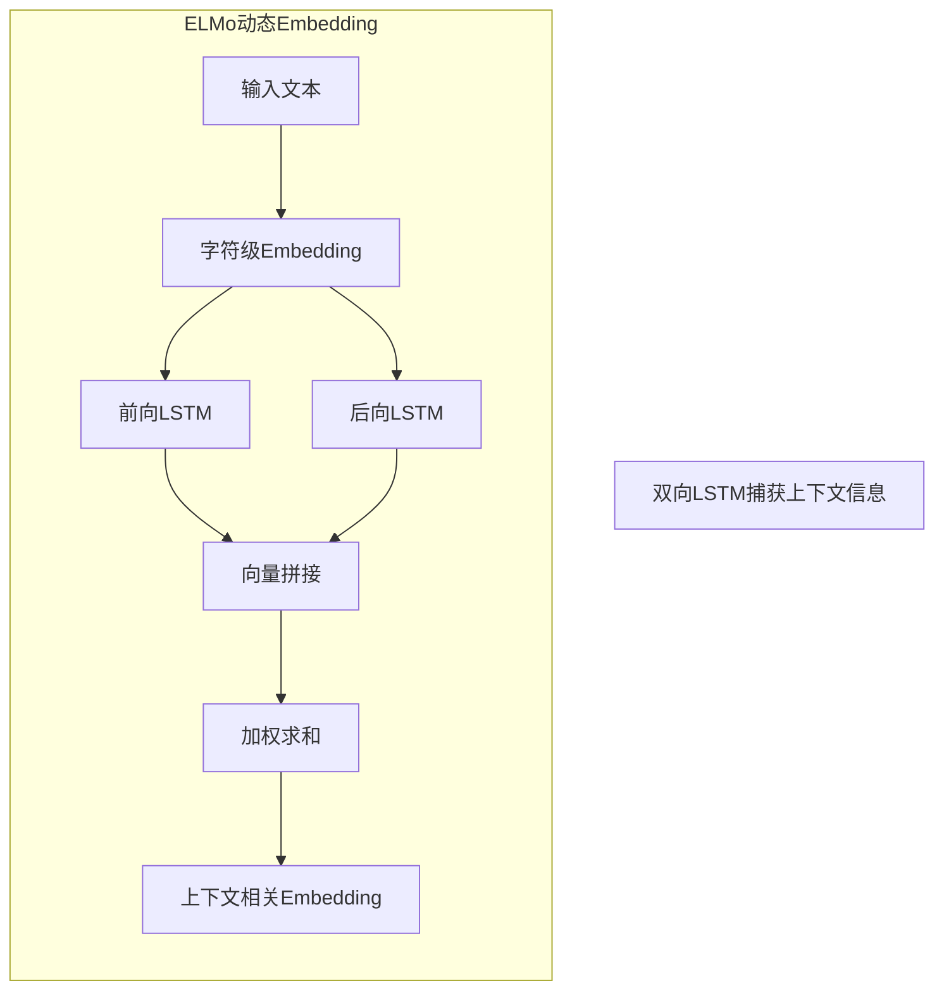

谷歌的BERT(之前我们的也是用了一个变种的BERT)

BERT还是Transformer架构, 使用的是编码器部分; **适合语言理解,推理等**

后续还有很多BERT变种

**自回归模型**

**GPT**

GPT是根据transformer工作原理改进的, 只保留了解码层; 适合**文本生成**

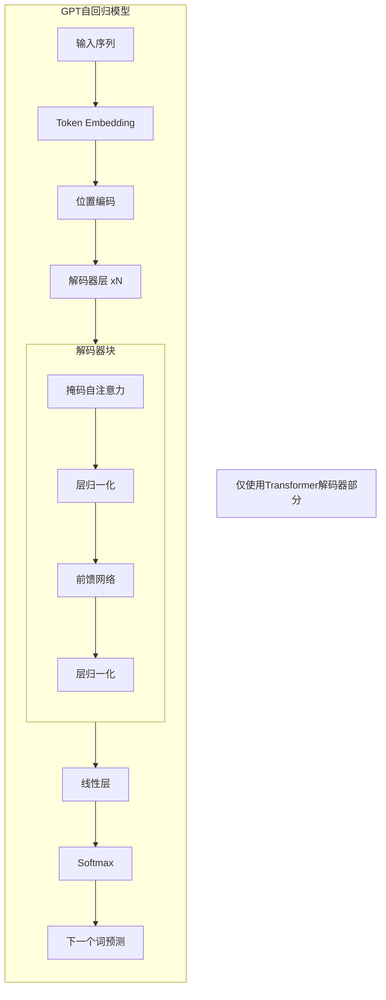

**LLaMA**

llama还是transformer的解码器架构

这几个之间是什么样的关系, 是处理什么问题的?

#### **LSTM和Transformer的区别**

```mermaid
flowchart LR
    subgraph LSTM["LSTM架构"]
        direction TB
        L1[序列输入] --> L2[门控机制]
        L2 --> L3[细胞状态]
        L3 --> L4[顺序处理]
        L4 --> L5[输出]
    end

    subgraph Transformer["Transformer架构"]
        direction TB
        T1[并行输入] --> T2[自注意力]
        T2 --> T3[并行处理]
        T3 --> T4[输出]
    end

    L5 -->|2017年前统治地位| Evolution[架构演进]
    T4 -->|2017年后主流| Evolution

    NoteL["顺序处理,长距离依赖困难"]
    NoteT["并行处理,全局注意力机制"]
    LSTM -.-> NoteL
    Transformer -.-> NoteT
```

LSTM在2017年注意力机制之前是统治地位, 在2017年之后大多偏向于注意力机制和后续发展出的Transformer架构

#### **文本召回模型**

文本向量检索模型(向量化模型); 进行文本转向量(按我理解是通过embedding等手段实现)

两个环节

-   文本片段向量化(这是知识库的构建?)

-   用户查询向量化(这里是用户每次查询内容去和知识库匹配时要做的)

目前大致分两类模型:

-   基于BERT,GPT的稠密向量检索模型

适合提取文中语义信息; 适合推理任务

-   以TF-IDF,BM25为代表的稀疏向量检索模型

适合提取关键词信息; 适合简单的扩充

大部分都是将文本转化到向量空间进行比对; (BM25比较特殊, 是直接比对文本相似度)

良好的文本向量空间有以下两个特点:

-   对齐性: 相似语义的文本在向量空间有接近的距离

-   均匀性: 向量是均分分布在整个空间中, 而不是全部聚集在某处的

文本相似度 **约等于** 文本向量空间的距离

向量距离度量方式:

-   余弦相似度

-   欧氏距离

```mermaid
flowchart TD
    subgraph DistanceMetrics["向量距离度量"]
        direction TB

        subgraph Cosine["余弦相似度 Cosine"]
            direction TB
            C1[向量A] --> C3[计算夹角]
            C2[向量B] --> C3
            C3 --> C4[相似度 = cos(θ)]
            C4 --> C5[范围: -1 到 1]
        end

        subgraph Euclidean["欧氏距离 Euclidean"]
            direction TB
            E1[向量A] --> E3[计算直线距离]
            E2[向量B] --> E3
            E3 --> E4[d = √(Σ(ai-bi)²)]
            E4 --> E5[范围: 0 到 +∞]
        end
    end

    NoteC["关注方向相似性"]
    NoteE["关注绝对距离"]
    Cosine -.-> NoteC
    Euclidean -.-> NoteE
```

好像目前大部分都是使用稠密向量检索

```mermaid
flowchart TD
    subgraph DenseRetrieval["稠密向量检索模型"]
        direction TB

        subgraph BERTVariants["BERT变体"]
            SimCSE[SimCSE]
            SBERT[SBERT]
            CoSENT[CoSENT]
            WhiteBERT[WhiteBERT]
        end

        subgraph DecoderVariants["解码器变体"]
            SGPT[SGPT]
        end

        Input[输入文本] --> Embed[Embedding层]
        Embed --> Dense[稠密向量]
        Dense --> BERTVariants
        Dense --> DecoderVariants
        BERTVariants --> Similarity[相似度计算]
        DecoderVariants --> Similarity
        Similarity --> Results[检索结果]
    end

    Note["基于语义理解,适合推理任务"]
    Dense -.-> Note
```

#### **稠密向量检索模型**

1.  SimCSE

2.  SBERT

3.  CoSENT

4.  WhiteBERT

5.  SGPT

前面四种都是BERT的变种改造的, 最后一个是解码器结构的

#### **稀疏向量检索模型**

1.  朴素词袋模型

2.  TF-IDF

3.  BM25

langchain有集成这些朴素的retriever

#### **重排序模型**

召回流程

```mermaid
flowchart TD
    subgraph RetrievalFlow["召回流程"]
        direction TB
        Query[用户查询] --> Stage1[第一阶段: 向量召回]
        Stage1 --> Candidates[候选结果 Top-K]
        Candidates --> Stage2[第二阶段: 重排序]

        subgraph Reranker["重排序模型"]
            direction TB
            CrossEncoder[交叉编码器] --> Score[相关性评分]
            Score --> Sort[结果排序]
        end

        Stage2 --> Reranker
        Sort --> Final[最终结果 Top-N]
    end

    Note1["双塔模型: 快速召回"]
    Note2["交叉编码器: 精排优化"]
    Stage1 -.-> Note1
    CrossEncoder -.-> Note2
```

交叉编码器是什么?

### **原理**

### **核心技术和优化方法**

#### **提示词工程**

但是注意, 目前的发展提示词工程(prompt engineering)和RAG都向上下文工程 Context Engineering发展了

所有的AI应用(Agent)都会引入上下文的管理

文中有说\"**prompt工程本质上是LLM不成熟的副产品**\"

prompt能做的事

1.  描述答案的标注: 让回答更详细/更简短等

2.  设置兜底回答: 在无法有准确的回答时, 返回设置的兜底; 减少幻觉

3.  输入中提供回答示例: 给模型提供示例辅助推理?

4.  识别出prompt中不同类型的内容: 比如假指令, 类似防注入那样

5.  设定输出格式: 限定输出的文本格式

6.  指定大模型身份: 在system prompt中很常见的, 你是一个XXX

7.  使用思维链: 指定推理过程

RAG场景下, 我们同时召回了多个有关问题的文本段, 一般情况下, 会按相似度最高的顺序放入LLM的输入中

```mermaid
flowchart TD
    subgraph RAGPrompt["RAG场景Prompt构建"]
        direction TB

        subgraph System["System Prompt"]
            S1[角色设定]
            S2[回答规则]
        end

        subgraph Context["检索上下文"]
            C1[文本段1 相似度:0.95]
            C2[文本段2 相似度:0.87]
            C3[文本段3 相似度:0.82]
            C4[...]
        end

        subgraph User["User Query"]
            U1[用户原始问题]
        end

        System --> Prompt[组合Prompt]
        Context --> Prompt
        User --> Prompt
        Prompt --> LLM[LLM生成]
        LLM --> Answer[最终答案]
    end

    Note["按相似度排序组织上下文"]
    Context -.-> Note
```

#### **文本切块 chunk**

**切块过长**

向量化损失更多信息; 对比查找时准确率降低

**切块过短**

容易丢失段落, 文档层面的主题信息, 跨段落的上下文信息

方法

1.  固定大小文本切块

最简单, 实际应用时会有边界的重叠文本; 比如: 1234567, \[1234\] \[4567\]边界会有重复, 防止上下文丢失; 但总体还是很生硬

2.  基于NLTK的文本切块

3.  特殊格式文本切块

4.  基于深度学习模型的文本切块

除了文中的还有文章结构分块, 段落分块, 句子分块, 递归分块

```mermaid
flowchart TD
    subgraph ChunkingMethods["文本切块方法"]
        direction TB

        subgraph Fixed["固定大小分块"]
            F1[固定字符数] --> F2[边界重叠]
            F2 --> F3[简单直接]
        end

        subgraph Semantic["语义分块"]
            S1[NLTK分句] --> S2[段落边界]
            S2 --> S3[语义完整性]
        end

        subgraph Structure["结构分块"]
            St1[Markdown标题]
            St2[HTML标签]
            St3[代码块]
        end

        subgraph Recursive["递归分块"]
            R1[大段落] --> R2[细分为句子]
            R2 --> R3[层次结构]
        end

        Input[原始文档] --> Fixed
        Input --> Semantic
        Input --> Structure
        Input --> Recursive

        Fixed --> Output[文本块]
        Semantic --> Output
        Structure --> Output
        Recursive --> Output
    end

    Note["选择合适的分块策略很重要"]
```

#### **向量数据库**

这就多了去了, 可以详细去看看[DK百科全书-向量数据库](https://docs.qq.com/doc/DUEdJSGZmcHBETGJm?no_promotion=1)

列一下书里介绍的

1.  Faiss

2.  Milvus

3.  Weaviate

4.  Chrome

5.  Qdrant

部分索引算法介绍:

1.  精确检索

暴力遍历检索, 将所有向量逐个匹配

2.  倒排索引

向量检索场景下倒排索引和文本的全文检索不一样; 先对所有向量进行聚类, 每次检索只对聚类中心向量计算相似度, 找到最相似的几个聚类; 然后在这些聚类内进行精确检索;

```mermaid
flowchart TD
    subgraph InvertedIndexVec["倒排索引 IVF"]
        direction TB

        subgraph Clustering["聚类阶段"]
            C1[所有向量] --> C2[K-means聚类]
            C2 --> C3[生成N个聚类中心]
            C3 --> C4[每个向量分配到最近中心]
        end

        subgraph IndexStructure["索引结构"]
            I1[聚类中心列表]
            I2[倒排列表: 中心ID -> 向量列表]
        end

        subgraph Search["检索过程"]
            S1[查询向量] --> S2[计算与聚类中心距离]
            S2 --> S3[选择Top-n最近中心]
            S3 --> S4[在这些聚类内精确检索]
            S4 --> S5[返回最终结果]
        end

        C4 --> IndexStructure
        IndexStructure --> Search
    end

    Note1["减少计算量: 只需比较聚类中心"]
    Note2["平衡速度和精度"]
    Search -.-> Note1
    Search -.-> Note2
```

1.  乘积量化

将聚类和向量切片思想相结合的方法; 可以在小内存实现快速检索, 但会降低准确率;

这个方法将所有向量分成M段切片, 然后对每段切片进行聚类, 聚类数量固定(256); 每个类别ID用一个字节表示; 同时保存每段向量切片的聚类中心向量;

查询时:1) 对查询向量进行切片;2)计算每个查询向量的切片刀256个聚类中心的距离; 3)通过聚类中心ID,查询每个向量到查询向量的相似度;

**问题**: 如何分切片? 依据是什么?

```mermaid
flowchart TD
    subgraph ProductQuantization["乘积量化 PQ"]
        direction TB

        subgraph Split["向量切分"]
            S1[D维向量] --> S2[分成M段]
            S2 --> S3[每段D/M维]
        end

        subgraph Quantize["分段量化"]
            Q1[每段独立聚类]
            Q1 --> Q2[K=256个中心]
            Q2 --> Q3[用1字节表示类别ID]
        end

        subgraph Compression["压缩存储"]
            C1[原始: D x 4字节]
            C2[压缩后: M x 1字节]
            C3[压缩比: 4D/M]
        end

        subgraph SearchPQ["查询过程"]
            SQ1[查询向量切分] --> SQ2[计算到各中心距离]
            SQ2 --> SQ3[查表获取近似距离]
            SQ3 --> SQ4[排序返回结果]
        end

        Split --> Quantize
        Quantize --> Compression
        Compression --> SearchPQ
    end

    Note["内存友好,适合大规模数据"]
```

1.  分层可导航小世界(HNSW)

维护一个有向的小世界图结构, 每个向量代表一个图节点, 有边连接的两个节点通常表示在向量空间中距离较近,少部分会有距离较远的;根据边的跨度对图进行分层, 每次检索, 查询向量从最上层的图查找最近似的, 然后根据该节点逐层往下查找最近距离的节点; 精度可**接近于精确检索**, 但方法的**建图过程慢, 占用较多的内存**;

```mermaid
flowchart TD
    subgraph HNSW["HNSW 分层可导航小世界"]
        direction TB

        subgraph Layer0["Layer 0 底层"]
            direction LR
            L0N1((节点1)) --- L0N2((节点2))
            L0N2 --- L0N3((节点3))
            L0N3 --- L0N4((节点4))
            L0N1 --- L0N4
        end

        subgraph Layer1["Layer 1 中间层"]
            direction LR
            L1N1((节点1)) --- L1N3((节点3))
            L1N3 --- L1N5((节点5))
        end

        subgraph Layer2["Layer 2 顶层"]
            direction LR
            L2N1((节点1)) --- L2N5((节点5))
        end

        subgraph Search["检索过程"]
            S1[查询向量] --> S2[从顶层开始]
            S2 --> S3[贪心查找最近节点]
            S3 --> S4[下沉到下一层]
            S4 --> S5[在当前层继续查找]
            S5 --> S6[到达底层返回结果]
        end

        Layer2 --> Layer1
        Layer1 --> Layer0
    end

    Note1["高层: 长距离连接,快速定位"]
    Note2["低层: 短距离连接,精确查找"]
    Layer2 -.-> Note1
    Layer0 -.-> Note2
```

1.  局部敏感哈希

LSH, 近似快速检索技术, 概率算法

#### **召回环节优化**

**短文本全局信息增强**

embedding的过程是一种压缩过程, 会有语义的丢失; 避免这种情况的恶化, 将长文本切分成若干短文本段, 分别进行向量化

最可能包含全局信息的三种:

1.  长文本的前三句话

2.  长文本的标题

3.  长文本的关键词

**召回内容上下文扩充**

召回内容是向量化后的数据? 所以会有信息损失? 不会再根据向量检索到原始文本的吗?

**解释:** 这里应该说的是召回过程中都是向量的匹配的, 最后得到召回结果后, 生成LLM的输入文本时才获取原始文本; 而召回过程期间, 都是进行向量的检索计算, 重排序等;

因为上有上面的问题存在,所以需要对信息损失的内容进行扩充, \"父文本检索\"将原始文本进行扩充;

文本生成补充向量的方法:

1.  文本切块

2.  文档的摘要

3.  假设性问题: 预设可能的关联问题; \"用问题召回问题\"比\"用问题召回答案\"简单

**文本多向量表示**

构建向量数据库时, 使用多个向量来表示一个文本

不仅对完整文本A生成向量, 还对他的子集, 总结/概要等生成向量; 作为补充向量, 补充向量命中时, 返回文本A的内容

**查询内容优化**

针对口语化,语义模糊,无关内容过多的原始文本; 对其进行改写

文本对称检索和非对称检索

问题容易匹配出问题近义的向量, 但会缺少对关键词的解释的

对关键词提取, 展开问题检索

看看HyDE方法(假设文档嵌入)

**召回文本重排序**

RAG场景下默认使用向量召回(这样吗?)

改进方法:

在向量召回的基础上, 使用消耗更多计算资源但效果更好的重排序模型; 从召回的候选文本中精选出和用户查询最相关的文本;

就是查询更多候选结果, 然后进行排序, 召回; \"多级排序\"

**多检索器融合**

多个检索融合, 一般现在构成都是生成TOP K结果, 再进行排序

**结合元数据召回**

结合元信息, 标签等, 但需要在构建知识库时进行标注

#### **效果评估**

**召回环节评估 (检索阶段)**

命中率

平均倒数排名

**模型回答评估 (生成阶段)**

选择题评估法

竞技场评估法

传统NLP指标评估法

向量化模型评估法

LLM评估法

**RAG专用评估框架: RAGAS**

关注3个方面

-   忠实度

-   答案相关性

-   上下文相关性

#### **LLM能力优化**

**LLM微调**

比喻为\"0\~1%参数再训练\"

```mermaid
flowchart LR
    subgraph FineTune["微调方法对比"]
        direction TB
        Full[全参数微调] -->|100%参数| Cost1[计算成本高]
        LoRA[LoRA] -->|0.1%-1%参数| Cost2[计算成本低]
        Prompt[Prompt Tuning] -->|仅优化Prompt| Cost3[最低成本]
        Adapter[Adapter] -->|添加小网络| Cost4[中等成本]
    end

    Note["LoRA: 低秩适配,最常见"]
    LoRA -.-> Note
```

目前知道, 最常见的是用LoRA

书中还有提到Prompt Tuning、P-Tuning、P-Tuning v2、Prefix Tuning;

```mermaid
flowchart TD
    subgraph FineTuneMethods["微调方法演进"]
        direction TB

        subgraph FullFT["全参数微调"]
            F1[更新所有参数]
            F2[需要大量显存]
            F3[效果最佳]
        end

        subgraph PETuning["参数高效微调"]
            direction TB
            PT[Prompt Tuning] --> PTV2[P-Tuning v2]
            Prefix[Prefix Tuning] --> LoRA[LoRA]
            LoRA --> QLoRA[QLoRA]
        end

        BaseModel[预训练模型] --> FullFT
        BaseModel --> PETuning

        FullFT --> Task[下游任务]
        PETuning --> Task
    end

    Note1["全参数: 资源消耗大"]
    Note2["PEFT: 资源友好,效果接近"]
    FullFT -.-> Note1
    PETuning -.-> Note2
```

**FLARE**(Forward-Looking Active REtrieval augmented generation)

算是一种多次召回的策略

常用的多次召回策略有以下3种:

-   每生成固定的n个token就召回一次

-   每生成一个完整的句子就召回一次

-   将用户问题一步步分解为子问题, 需要解答当前子问题时, 就召回一次

**Self-RAG**

这就是自我决定是否要进行召回文本的操作;

会有两个模型: 判别模型和生成模型;

那么在现在注重context engineering的背景下, 更多的会在整个流程的前置中过一个Agentic AI, 让模型决定是否要进行RAG或者是上下文补充, 并且查询可用能力调用外部能力(比如MCP, 或者直接的functiong call); 甚至后续决定使用哪些专用的LLM, 还有后续进行react思考;

### **RAG范式演变**

#### **基础RAG**

```mermaid
flowchart TD
    subgraph BasicRAG["基础RAG架构"]
        direction TB

        subgraph Indexing["索引阶段"]
            I1[原始文档] --> I2[文本分块]
            I2 --> I3[Embedding]
            I3 --> I4[向量数据库]
        end

        subgraph Retrieval["检索阶段"]
            R1[用户查询] --> R2[查询Embedding]
            R2 --> R3[向量检索]
            I4 --> R3
            R3 --> R4[召回相关文档]
        end

        subgraph Generation["生成阶段"]
            G1[Prompt构建] --> G2[LLM生成]
            R4 --> G1
            G2 --> G3[输出答案]
        end
    end

    Note["基础RAG: 索引-检索-生成三阶段"]
```

存在的问题

1.  检索问题

    难以检索到合适的上下文

    -   语义歧义
    -   向量大小与方向
    -   粒度不匹配
    -   全局与局部相似性
    -   稀疏检索挑战

2.  增强问题

    用策略将检索结果变得更加可用;

    -   上下文整合
    -   冗余与重复
    -   排序和优先级
    -   风格或预期的匹配
    -   过度依赖检索内容

3.  生成问题

    -   生成文本的连贯性和一致性
    -   冗长或冗余的输出
    -   过度概括
    -   缺乏深度或洞察力
    -   检索中的错误传播
    -   风格不一致
    -   未能解决矛盾
    -   忽略上下文

#### **先进RAG**

-   数据清理

文本清理, 规范化文本格式输入

消除歧义, 名词保持一致

删除重复文本, 减少重复冗余的可能

文档分割, 就是chunk

特定领域注释, 对特定领域文本向量做标签化处理

数据增强, 同义词, 其他语言等丰富语料库

层次结构和关系, 要有文档间的关系, 这个会比较倾向知识谱图

用户反馈+实时更新: 语料库保持最新状态

-   微调嵌入(fine tuning embedding)

基础微调: 用文档对模型进行微调

动态嵌入: embedding方式强化

刷新嵌入: 定期更新语料库的embedding

-   增强检索

切割更小的文本块

增加\"摘要嵌入\", 和文档一起向量化, 或者直接替换文档

重新排序, 结果的相似性排序

混合检索, 多重检索方式, 结合结果

递归检索+查询引擎

-   构建提示词

prompt template

prompt补充回答提示

#### **大模型主导的RAG**

更加Agentic AI

分开 动作Agent, 计划和执行Agent

#### **多模态RAG**

除了文档, 扩充到多媒体(图片,音频,视频等)

### **RAG系统训练**

#### **难点**

通常有两个模型

向量embedding模型

生成模型

```mermaid
flowchart TD
    subgraph RAGTraining["RAG系统训练难点"]
        direction TB

        subgraph Models["两个核心模型"]
            M1[Embedding模型]
            M2[生成模型]
        end

        subgraph Challenges["训练挑战"]
            C1[计算资源需求高]
            C2[向量索引更新困难]
            C3[增量更新复杂]
            C4[端到端优化难]
        end

        subgraph Solutions["解决方向"]
            S1[半联合训练]
            S2[异步更新索引]
            S3[批近似训练]
            S4[独立/序贯/联合训练]
        end

        Models --> Challenges
        Challenges --> Solutions
    end

    Note1["Embedding模型: 负责语义编码"]
    Note2["生成模型: 负责答案生成"]
    M1 -.-> Note1
    M2 -.-> Note2
```

计算资源/成本不在话下

另外知识库的向量数据库存储, 在模型更新后如何快速更新索引

在知识库更新时如何快速增量更新

#### **训练方法**

这些可能不太接触

-   半联合训练

-   异步更新索引训练

-   批近似

#### **独立训练**

不太懂

#### **序贯训练**

冻结召回模块

冻结生成模块

#### **联合训练**

异步更新索引

批近似

### **实战**

基于langchain
