# DK百科不全书-K8S

CRD之间的概念<https://blog.csdn.net/woshihlf/article/details/145691733>

## 基础

### 构成组件

master:

kube api server: 集群的api接口

kube controller manager: 资源控制器/管理集群状态/自动化控制

kube scheduler: 资源调度器, 分配pod到对应的node

etcd: 保存集群的所有状态,

node:

kubelet: 管理pod生命周期, 控制容器的运行

kube proxy: 负责网络通信, 提供service的负载均衡和网络代理

容器runtime: 看具体使用的容器

#### kubelet核心功能

1.  节点管理: 定期向master汇报资源使用情况

2.  pod管理: 根据master scheduler的命令调用容器运行时接口

3.  健康检查: 定期检查容器的健康状态, 通过探针决定是否重启

4.  资源监控: 通过metrics server监控node和pod资源使用情况

#### kubelet的metrics endpoint 和metrics server

**metrics endpoint**

是kubelet的内部功能(可以理解为同进程的内部组件), 监控节点/pod/容器的资源状态, 是数据生产者

访问方式:

kubelet的HTTPS服务

/metrics/resource: Resource Metrics API格式的核心指标

/metrics/cadvisor: cAdvisor收集的指标

**metrics server**

他不是kubelet的组件, 而是一个独立pod, 消费kubelet的生产数据, 做数据中间加工提供资源指标视图

部署方式: 通常为一个Deployment

会注册监控api到kube API Server, controller manager的部分组件(HPA,)会使用到这些数据, 不直接调用, 通过api server获取

#### kube-controller-manager 

理解声明式编程, 需要将实际各类状态修改到等价于用户的配置

**核心工作负载控制器(workload相关)**

1.  ReplicaSet Controller

2.  Deployment Controller

3.  StatefulSet Controller

4.  DaemonSet Controller

5.  Job Controller

6.  CronJob Controller

**服务发现/负载均衡控制器**

1.  Endpoint Controller: 监听service和pod的变化, 维护service和pod的映射关系

2.  Service Controller: 监听service对象的变化

**节点/生命周期控制器**

1.  Node Controller: 管理Node对象的生命周期和状态

2.  TTL Controller: 清除已完成Job和Pod

**存储控制器**

1.  Persistent Volume Controller: 监听PersistentVolumeClaim和PersistentVolume 的变化,实现两者的**动态绑定**和**静态绑定**; 处理**绑定**和**回收**

2.  Persistent Volume-Binder Controller: 是处理绑定的, 作为PV的一部分

3.  Attach Detach Controller: 处理**挂载**和**卸载**的操作

4.  PV-Protection Controller: 防止PVC使用的资源被删除

5.  PVC-Protection Controller: 防止被pod使用的PVC被删除

**命名空间控制器**

1.  Namespace Controller: 管理namespace的生命周期

**认证/授权/配额控制器**

1.  Service Account Controller: 确保每个命名空间都存在一个名为default的service account对象, 每一个namspace都有一个service account

2.  Token Controller: 监听 ServiceAccount 的创建, 为其创建对应的token

3.  Resource Quota Controller: 监听 ResourceQuota 对象的创建, 计算并监控指定命名空间内的资源对象

**垃圾收集控制器**

1.  Garbage Collector Controller: 实现k8s的级联删除功能, 监听所有删除事件, 当有对象被删除时, 检查这个对象是否其他被依赖关系, 并删除所有依赖他的对象(删除deployment是会删除所有replicaset,然后replicaset删除后, 删除所有pod)

#### Service Account / RBAC

#### endpoint controller如何工作

k8s控制器的设计模式: 声明式API + 事件驱动 + 控制循环

1.  启动+初始化:

> 作为kube-controller-manager的组件启动
>
> 创建两个关键Informer:

1)  Service Informer: 监听所有service的变化

2)  Pod Informer: 监听所有Pod的变化

Informer和api server建立watch连接, 内存中会有个缓存(indexer), 通过watch连接和api server的etcd状态保持同步; 对于每种变更事件注册对应的处理函数,触发后放入工作队列

2.  事件触发

```{=html}
<!-- -->
```
1)  service变更(创建/更新/删除)

2)  pod变更

变更对象-\>api server写入etcd-\>informer watch变更-\>informer更新缓存-\>获取对应函数-\>service key(定位具体的service)打包放入工作队列

3.  协调循环

EndpointSlice Controller的事件循环线程从工作队列取出service key,执行syncService 或 reconcile 函数

4.  syncService 函数的核心逻辑

```{=html}
<!-- -->
```
1)  获取service对象

2)  检查selector: 如果spec.selector没有设置不会做对应管理操作

3)  查找匹配的pod: 查找对应namespace内所有状态匹配的pod

4)  构建endpoint列表: 遍历完成后, 构建列表

5)  处理endpoint slice: 比较&更新, 通过api server操作

```{=html}
<!-- -->
```
5.  结果

> etcd更新对应存储
>
> kube-proxy监听对应endpoint slice的变动, 更新node上的网络规则

### 基础概念

Master：集群的控制节点，负责管理所有工作节点的调度和资源分配。

Node（Worker）：运行实际容器的节点，是 Kubernetes 中 Pod 的宿主机。

Pod：Kubernetes 中最小的部署单位，可以包含一个或多个容器。

Label：给对象贴标签，用于资源的筛选和调度。

Service：定义了 Pod 的逻辑组以及访问策略，是服务的抽象。

Namespace：用于实现资源隔离，帮助管理集群中的多租户环境。

### 资源定义方式 (yaml配置文件)

每种资源一个yaml文件独立保存(虽然可以通过\-\--分隔写在一个yaml内\[少\])

关系到**声明式编程**, 根据配置文件声明状态的变更和当前状态的对比, 作出对应操作使当前状态符合配置声明

CRD也是通过yaml文件定义, 但不是创建具体资源, 而是创建元资源, 通过CRD(元资源)创建CR(具体资源)

#### 创建/管理的流程

1.  提交yaml文件: 通过api server接口上报, 根据kind描述了资源对象, spec描述了**期望状态**(副本数,selector,容器镜像等)

2.  api server处理: 唯一入口/鉴权/授权/准入控制/数据校验(schema)等

3.  etcd的kv存储: 数据存储, key格式

-   /registry/pods/\<namespace\>/\<pod-name\>：存储 Pod 对象。

-   /registry/deployments/\<namespace\>/\<deploy-name\>：存储 Deployment 对象。

-   /registry/crds/\<group\>/\<crd-name\>：存储 CRD 对象本身。

-   /registry/\<group\>/\<resource\>/\<namespace\>/\<name\>：存储自定义资源 (CR) 对象。

4.  控制器/控制循环: informer监听变化, 创建事件进入eventloop处理

#### Namespace

逻辑隔离单元,提供资源命名隔离、访问控制作用域、网络策略作用域和资源配额边界

作为一个集群状态资源, 存储在etcd中

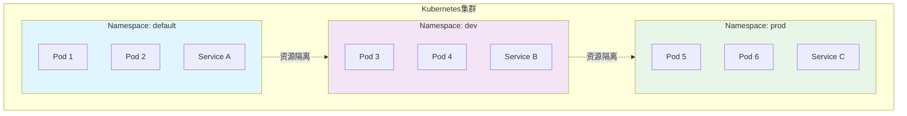

#### 工作负载 workload

-   无状态服务：Deployment + Service

-   有状态服务：StatefulSet + Headless Service + PVC

-   节点级服务：DaemonSet

-   批处理任务：Job

-   定时任务：CronJob

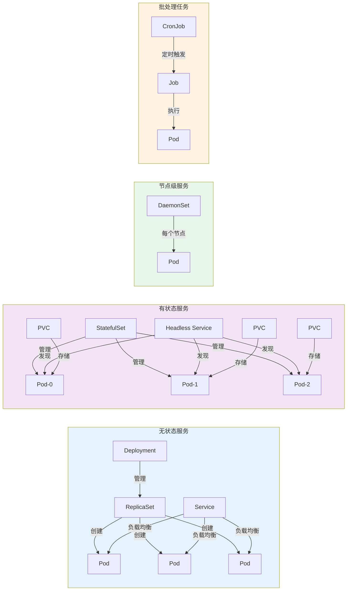

Daemon Set一般用来做日志收集/节点监控等, 就是和守护进程的supervisor功能类似

### Pod

生命周期状态

-   Pending: API server 已创建 pod，但尚有一个或多个容器镜像未创建或正在下载；

-   Running: pod 内的所有容器已经创建，至少有一个容器处于运行状态或正在重启；

-   Succeeded: pod 内所有容器已退出且不会再重启；

-   Failed: pod 内所有容器已退出，且至少有一个容器退出失败；

-   Unknown: apiserver 无法获取 pod 状态，可能由于网络问题导致。

如果pod一直是pending, 考虑1) 资源紧张2) PVC等创建失败

#### Pod删除

pod的优雅退出时间

endpoint监听删除关联操作

kubelet内部prestop等操作

容器进程收到SIGTERM信号

超过优雅推出时间会再发送SIGKILL

#### Pod重启策略

-   Always: 容器退出后总是重启，默认策略；

-   OnFailure: 容器异常退出时才重启；

-   Never: 容器终止后不重启。

#### 初始化容器的具体逻辑

只执行一次, 执行完就会结束

#### Service

一个工作负载workload由多个pod组成, pod是动态变动的, 可能改变pod的数量, 也可能更新容器版本时, 有pod被删除后重建.

每个pod ip是临时的(也可以配置静态持久化)

service作为workload的一个稳定网络入口, 可以作为服务发现, 负载均衡, 入口的抽象

每个workload创建可以创建多个Service资源对象, yaml中进行配置

#### Endpoint / EndpointSlice

endpoint是传统模式, 新的使用endpointslice

是存储Service实际网络端点信息(维护映射关系), controller根据pod的变更维护更新

数据是存储在etcd的

会收到namespace命名空间的约束

kube-proxy会监听endpointslice的状态数据. 为本node内的关联的pod调整网络规则

#### template

template 是 Deployment 规范 (spec) 中的一个字段, 定义了pod的模版规范(pod的元信息)

不直接定义pod, 而是用template来规范

1.  抽象层级的分离, 定义pod的元信息而不是具体定义pod; deployment作为控制器, 通过元信息模板, \"生产\"出具体的pod

2.  动态创建机制

3.  版本控制/滚动更新

4.  标签选择器关联

5.  资源复用和组合: 不同的workload使用相同的pod定义

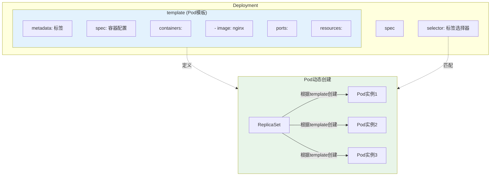

#### selector 标签匹配(可能有其他名称scalexxx)

selector（选择器）是Kubernetes中用于标识和选择一组资源的机制.它通过标签（Labels）进行匹配，允许您声明式地指定\"哪些资源属于这个集合\".

关键元素:

-   标签 Labels: 键值对（key=value）形式的元数据，附加在资源对象上（如 Pod）

-   选择器Selector:定义匹配标签的条件规则

-   关系: selector 查询带有特定 labels 的资源

#### 探针

三类探针

-   livenessProbe（存活探针）：检测容器是否正常运行，不健康时会重启容器；

-   readinessProbe（就绪探针）：判断容器是否可以接收流量，不健康时Pod会被移出Service；

-   startupProbe（启动探针）：用于避免业务启动缓慢导致的探针失败。

## 书-Kubernetes网络权威指南

### 网络虚拟化

#### network namespace

linux的namespace名字空间作用是隔离内核资源

将文件系统挂载点, 主机名, POSIX进程间通信消息队列, 进程PID数字空间, IP地址, user ID数字空间

分别有Mount namespace,UTS namespace,IPC namespace,PID namespace,network namespace,user namespace

后面都是对network namespace的运用

都是在ip命令里的

netns 后各种操作

虚拟网络设备/物理设备等等的区别

#### veth pair

**题外话**

veth pair的通信和lo的对比

两者都会完整走完协议栈, 在协议栈后, vp会继续到网络设备层, 驱动层(veth驱动)

而后者协议栈后, 判断是lo设备不会到网络设备层, 直接再回到协议栈处理

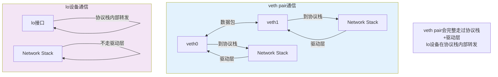

容器经典组网模型: veth pair+brige

如何查看veth pair的连接关系

iflink, ifindex文件

ip link查看

ethtool看设备

#### brige 网桥

ip 创建等等 type bridge

brctl

都是相关命令

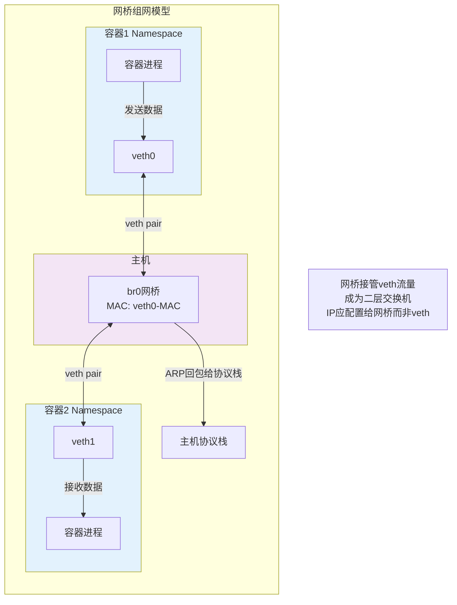

为什么网桥会拦截veth-\>协议栈的通信

原因是网桥是作为二层交换机的作用, 接管了连接设备的流量

后续由网桥传到协议栈

bridge和veth相连后

-   br0-veth0是双向通道

-   协议栈-veth0变为单通道, 只有协议栈可以发数据给veth0

-   br0的MAC地址变成veth0的MAC地址

veth在去pingveth pair的另一端会失败

因为ARP返回包, 没法会给协议栈, 完全让网桥接管了

所以得把ip配置给网桥而不是和网桥连接的veth

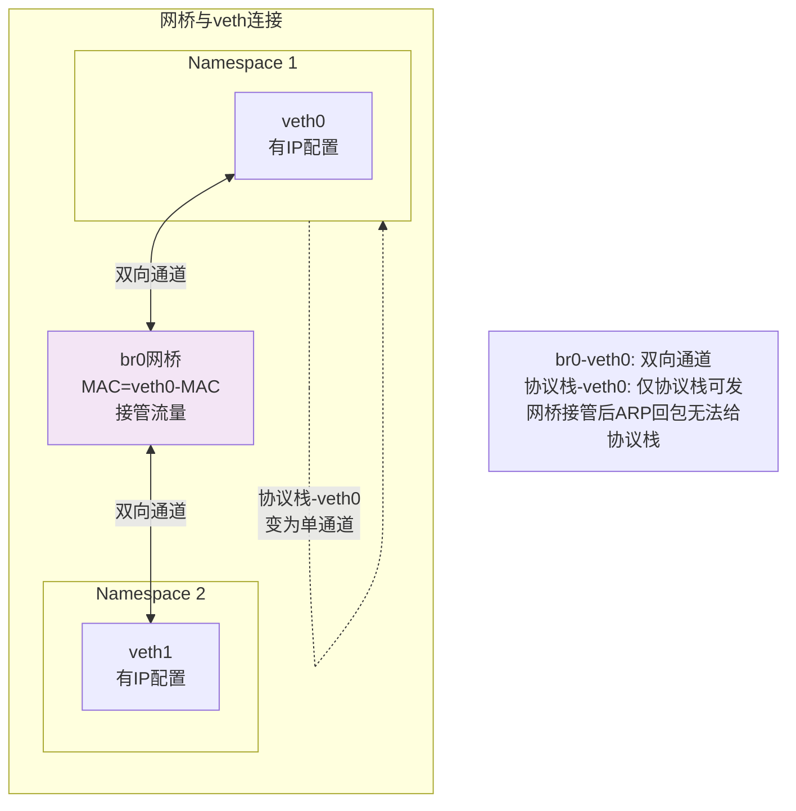

通过 br0去ping veth1是OK的, 因为ARP回包会被网桥送给协议栈

为了连接外部网关, 文中将物理网卡(eth0)加到网桥(br0)中

这导致网关\--\[eth0\]\--br0\--\[veth0\]\--veth1

\[\]中的这两变成类似网线的存在了

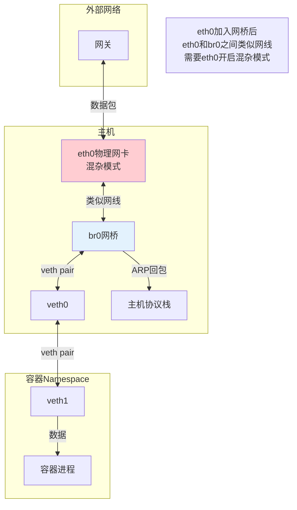

这需要eth0是混杂模式, 这太危险了

实际应用

虚拟机, 通过tun/tap(tunnel 通道吗?)和网桥连接

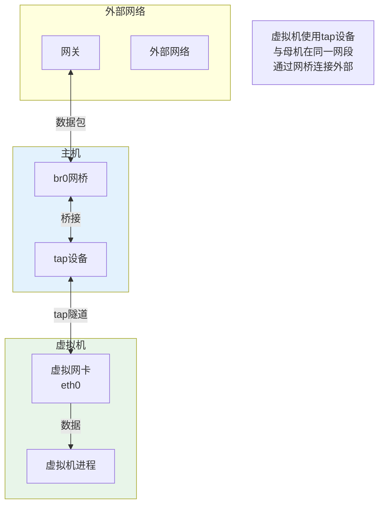

容器, 只使用veth pair

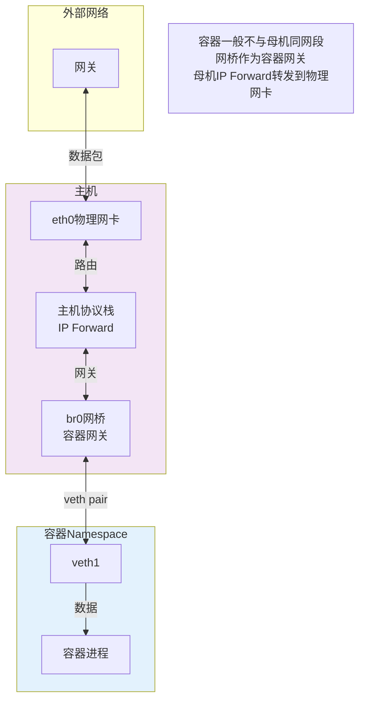

虚拟机中和母机是在同一网段的

但容器一般不会和母机在同一网段

网桥作为容器的网关, 然后母机IP forward功能在通过物理网卡发送出去(eth0)

混杂模式, 监听模式, 之前ARP中间人攻击的时候就用到, 所以开启这个模式的尽量需要可信

网络设备加入网桥后会自动变成混杂模式(promiscuous), 移除后的话会变回来

#### tun/tap

是理解flannel的基础, 这是k8s的一个网络插件

从linux文件系统角度看, 这是用户可以用fd来操作的字符设备

从网络虚拟化角度看, 这是虚拟网卡, 一端连着网络协议栈, 另一端是用户态的程序

反正大概是用户态程序可以直接操作的设备

```mermaid
flowchart TB
    subgraph TunTap["tun/tap设备"]
        direction TB
        
        subgraph UserSpace["用户态"]
            APP[应用程序]
            FD[文件描述符 fd]
        end
        
        subgraph Kernel["内核态"]
            direction TB
            TUNDEV[/dev/tunX<br/>字符设备]
            NETSTACK[网络协议栈]
        end
        
        APP <-->|读写| FD
        FD <-->|操作| TUNDEV
        TUNDEV <-->|数据包| NETSTACK
    end
    
    Note["tun/tap是虚拟网卡<br/>一端连协议栈, 一端连用户态<br/>用户可用fd直接操作"]
    
    style UserSpace fill:#e3f2fd
    style Kernel fill:#f3e5f5
```

tun设备的使用

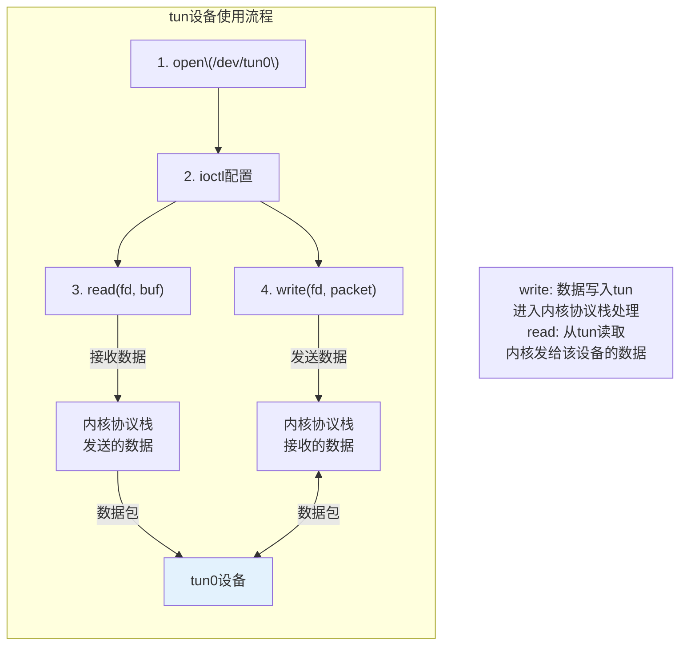

/dev/tunX这个文件, 就是可以通过用户态操作fd来写数据的, 写入的数据都会发给内核的网络协议栈

tap设备和tun基本相同

区别:

-   tun设备的文件收发是IP包, 只能工作在L3, 无法和物理网卡桥接, 可以通过三层交互(ip_forward)连通

-   tap的/dev/tapX文件是链路层数据包, L2层, 可以直接与物理网卡桥接

tunnel经常用于VPN, 做数据压缩, 加密等

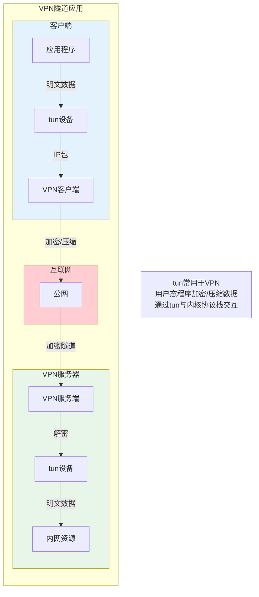

#### iptables

哼, 我可是做过iptables的编程, 虽然都忘了

iptables底层是netfilter实现

ip层的5个hook

PREROUTING,POSTROUTING,INPUT,OUTPUT,FORWARD

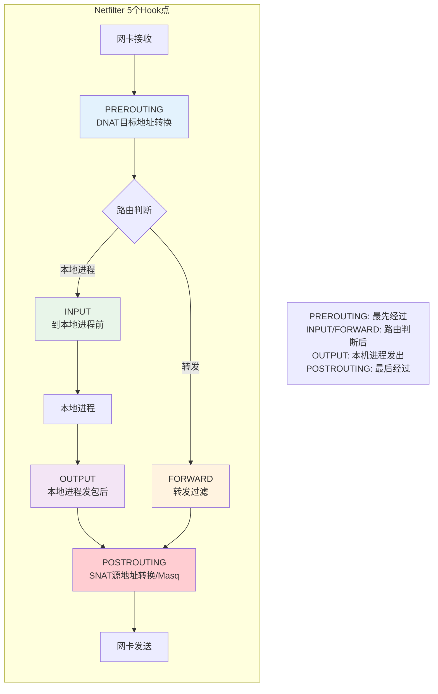

-   PREROUTING: 网卡收到包, 最先经过的. 可以对包进行DNAT目标地址转换

内核查本地路由表决定是做转发还是给到本地机器

-   FORWARD: 本地当做路由器, 处理转发时, 做包过滤, reject等

-   INPUT: 到本地进程前的

-   OUTPUT: 本地进程发包后进入的, 可以进行路由转发

-   POSTROUTING: 即将离开协议栈, 发送到网络设备, 可以进行SNAT源地址转换,Masq源地址伪装

netfilter

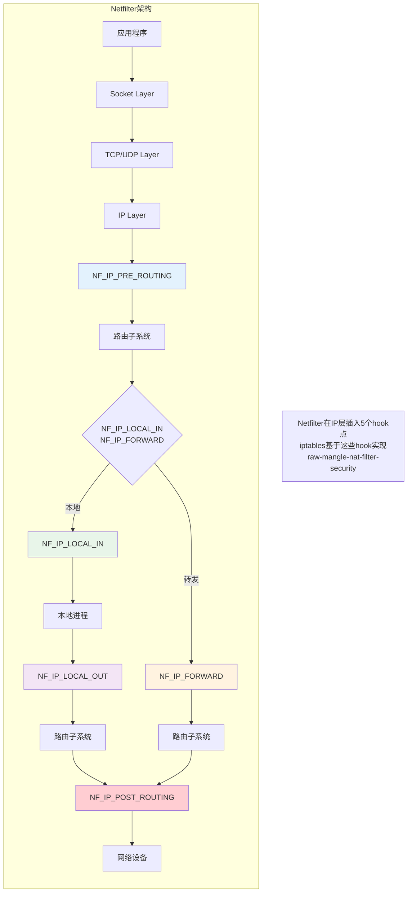

三板斧: table, chain, rule

5张表, 5条链

链对应上面的5个hook

5张表

-   filter表, 过滤放行, 丢弃, 拒绝

-   NAT表, 修改包的DNAT, SNAT

-   mangle表, 修改数据包的IP头

-   raw表, iptables对数据包有连接跟踪机制, raw是用来去除追踪的.(不是很清楚)

-   security表, 新加的, 之前4个表, 包使用SELinux

优先级: raw, mangle, nat, filter, security

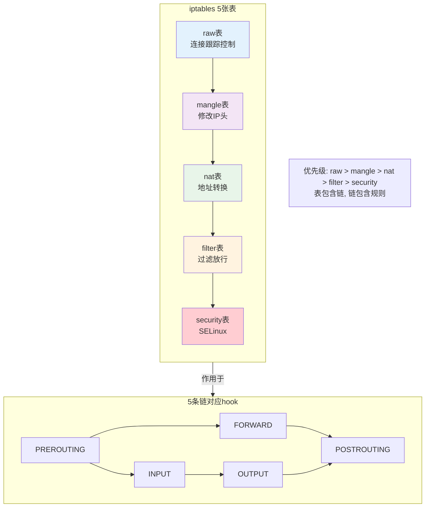

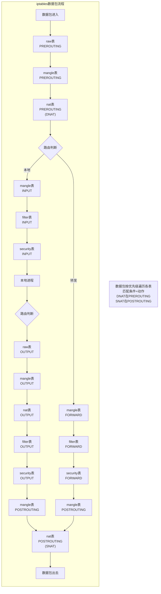

一般来说要用户写的都是匹配条件+动作

#### 隧道 ipip

前面tun设备也称点对点设备, 因为常用来做隧道通信

ip tunnel help可看到ip隧道相关的

-   ipip: IPv4 in IPv4, 用ip报文封装ip报文

-   GRE: 通用路由封装

-   sit: 和ipip类似, 是ipv4封装ipv6

-   ISATAP: 站内自动隧道寻址协议, Intra-Site Automatic Tunnel Addressing Protocol

-   VTI: 虚拟隧道接口 Virtual Tunnel Interface, IPSec隧道技术

Linux L3隧道底层实现都是基于tun设备的

#### 隧道网络代表 VXLAN

Virtual eXtensible LAN 虚拟可扩展的局域网

虚拟化隧道通信, overlay(覆盖网络)技术

通过三层网络单间虚拟的二层网络, what? ip层模拟mac层?

详见RFC7348

3.7内核协议栈原生支持VXLAN

VLAN是在2层中实现的

VXLAN是在3层模拟的(实际是到4层了, 有用到UDP, VXLAN header类似应用层)

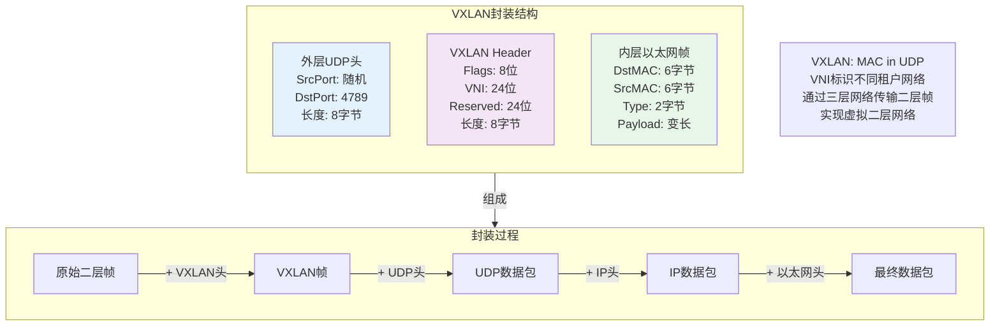

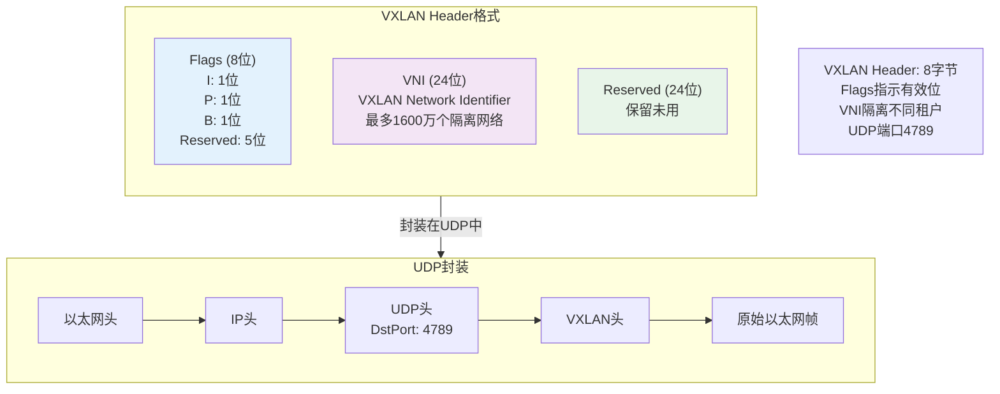

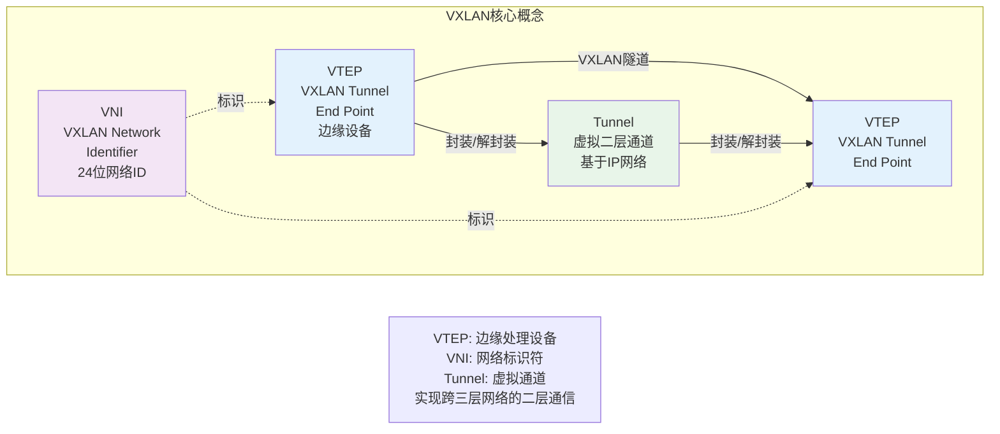

重要概念

-   VTEP: 网络边缘设备, 进行VXLAN报文处理

-   VNI: VXLAN的标识, 就他的id

-   tunnel: 实际是个虚拟的通道, ip网络可达就能模拟

也是在iproute2工具

ip link add/delete type VXLAN

#### Macvlan

组网定义的时候, 和NAT, Linux Bridge, Open vSwitch都作为工具

macvlan性能相对更好

用来创建虚拟网络接口

5种模式

-   bridge: 类似网桥, 共享父接口

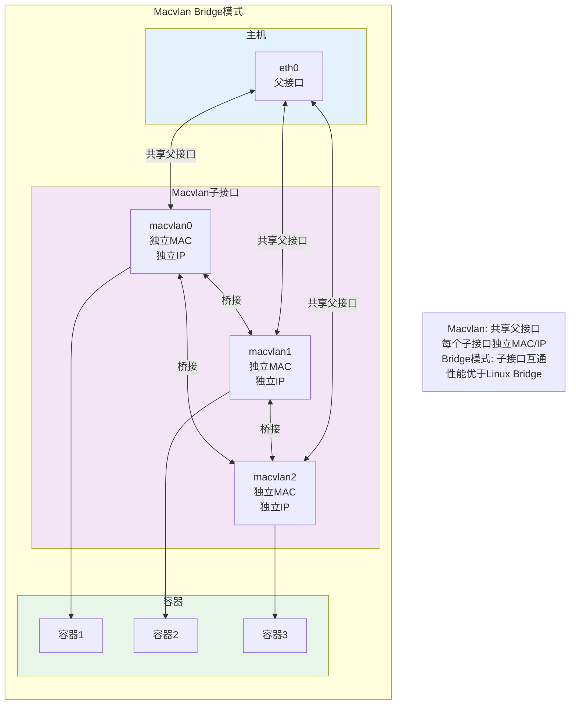

-   VEPA: 默认模式, 虚拟以太网端口聚合

-   Private:

-   Passthru: 只有一个的直通模式

-   Source: 寄生于物理设备, 指定的mac地址上

macvlan和overlay的对比

overlay是全局作用范围的虚拟二层, macvlan只适用本地的虚拟mac处理

IEEE802.11(无线网) 对一个客户端多个MAC地址的情况支持有问题, 子接口无法在无线网卡上通信

引入下一章IPvlan

#### IPvlan

```mermaid
flowchart TB
    subgraph IPvlan["IPvlan模式对比"]
        direction LR
        
        subgraph Macvlan["Macvlan"]
            ETH1[eth0<br/>父接口] --> MAC1[macvlan0<br/>MAC1<br/>IP1]
            ETH1 --> MAC2[macvlan1<br/>MAC2<br/>IP2]
            MAC1 -.->|"多个MAC地址"| MAC2
        end
        
        subgraph IPvlanL2["IPvlan L2模式"]
            ETH2[eth0<br/>父接口] --> IP1[ipvlan0<br/>共享MAC<br/>IP1]
            ETH2 --> IP2[ipvlan1<br/>共享MAC<br/>IP2]
            IP1 -.->|"共享MAC地址"| IP2
        end
        
        subgraph IPvlanL3["IPvlan L3模式"]
            direction TB
            ETH3[eth0<br/>父接口] --> ROUTER[路由转发]
            ROUTER --> IP3[ipvlan0<br/>IP1]
            ROUTER --> IP4[ipvlan1<br/>IP2]
        end
    end
    
    Note["Macvlan: 每个子接口独立MAC<br/>IPvlan: 共享父接口MAC<br/>L2模式类似Macvlan Bridge<br/>L3模式类似路由器"]
    
    style Macvlan fill:#e3f2fd
    style IPvlanL2 fill:#f3e5f5
    style IPvlanL3 fill:#e8f5e9
```

共享mac地址的原因, DHCP的分配ip场景要注意下

两种模式

-   L2: 类似macvlan的bridge

-   L3: 类似路由器一样, 通过ip分发

### Docker网络模型简介

### 四大网络模式

#### bridge

通过\--network=bridge指定

也是默认的网络模式

docker安装后会创建docker0的linux网桥

当创建一个容器后, 使用的是网桥模式, 容器的netns的网卡会连接到网桥上

容器网卡以veth pair到母机, 然后另一个的veth连接到br

#### host

共享Docker host的网络栈

和母机的网络完全一样, 不会独立netns

```mermaid
flowchart TB
    subgraph HostNetwork["Docker Host网络模式"]
        direction TB
        
        subgraph Host["主机网络栈"]
            direction TB
            NS[Network<br/>Namespace]
            ETH[eth0<br/>物理网卡]
            LO[lo<br/>回环]
            TCP[TCP/UDP<br/>协议栈]
        end
        
        subgraph Container["容器"]
            C1[容器进程1<br/>直接使用主机网络]
            C2[容器进程2<br/>直接使用主机网络]
        end
        
        C1 -->|"共享"| NS
        C2 -->|"共享"| NS
        NS --> ETH
        NS --> LO
        NS --> TCP
    end
    
    Note["Host模式: 共享主机网络栈<br/>无独立netns<br/>无网络隔离<br/>性能最好但安全性差"]
    
    style Host fill:#e3f2fd
    style Container fill:#ffcdd2
```

很简单直接, 但是没有隔离, 生产环境不可能使用

#### container

指定某个容器网络, 和他共享netns

#### none

除了lo回路设备, 没有其他网络设备

#### 常用Docker网络技巧

**查看容器IP**

容器外通过docker inspect查看文件

容器内正常使用命令

**端口映射**

-P 不指定映射关系

-p hostport:containerport指定映射关系

**访问外网\
**一般需要两个因素

ip_forward

SNAT/MASQUERADE

**DNS和主机名**

/etc/resolv.conf, /etc/hosts, /etc/hostname

三个文件里面搞

**自定义网络**

基本就是围绕创建的docker0网桥来

#### 容器网络第一个标准CNM

还有必要看吗? 这不都 让CNI给干没了

#### 容器组网挑战

提到了swarm, mesos, k8s

这\....

#### 容器组网方案

-   隧道方案; overlay方案

weave, open vSwitch, flannel

-   路由方案

Calico, Macvlan, Metaswitch

### K8S网络原理与实践

#### K8S网络

网络模型

```mermaid
flowchart TB
    subgraph K8SNetwork["K8S网络模型"]
        direction TB
        
        subgraph PodNetwork["Pod网络"]
            P1[Pod 1<br/>独立IP]
            P2[Pod 2<br/>独立IP]
            P3[Pod 3<br/>独立IP]
        end
        
        subgraph ServiceNetwork["Service网络"]
            SVC1[Service A<br/>ClusterIP]
            SVC2[Service B<br/>ClusterIP]
        end
        
        subgraph ExternalAccess["外部访问"]
            INGRESS[Ingress<br/>HTTP路由]
            LB[LoadBalancer<br/>外部负载均衡]
            NODEPORT[NodePort<br/>节点端口]
        end
        
        P1 <-->|"直接通信"| P2
        P2 <-->|"直接通信"| P3
        
        SVC1 -->|"负载均衡"| P1
        SVC1 -->|"负载均衡"| P2
        SVC2 -->|"负载均衡"| P3
        
        INGRESS --> SVC1
        LB --> SVC2
        NODEPORT --> SVC1
    end
    
    Note["单Pod单IP模型<br/>Pod间直接通信<br/>Service提供稳定入口<br/>多种外部访问方式"]
    
    style PodNetwork fill:#e3f2fd
    style ServiceNetwork fill:#f3e5f5
    style ExternalAccess fill:#e8f5e9
```

嗯?啥意思, 这啥模型了

CNI

pod网络配置的标准接口

Service

Ingress

DNS

**k8s网络基础概念**

IP地址分配

Pod出站流量

pod到pod, pod到service, pod到集群外

**k8s网络架构**

```mermaid
flowchart TB
    subgraph K8SArch["K8S网络架构"]
        direction TB
        
        subgraph ControlPlane["控制平面"]
            API[API Server]
            CM[Controller Manager]
            SCHED[Scheduler]
            ETCD[etcd]
        end
        
        subgraph Node1["Node 1"]
            KUBELET1[kubelet]
            PROXY1[kube-proxy]
            CNI1[CNI插件]
            POD1[Pod 1]
            POD2[Pod 2]
        end
        
        subgraph Node2["Node 2"]
            KUBELET2[kubelet]
            PROXY2[kube-proxy]
            CNI2[CNI插件]
            POD3[Pod 3]
            POD4[Pod 4]
        end
        
        API --> KUBELET1
        API --> KUBELET2
        CM --> PROXY1
        CM --> PROXY2
        
        KUBELET1 --> CNI1
        CNI1 --> POD1
        CNI1 --> POD2
        
        KUBELET2 --> CNI2
        CNI2 --> POD3
        CNI2 --> POD4
        
        POD1 <-->|"跨节点通信"| POD3
    end
    
    Note["CNI: 容器网络接口标准<br/>kube-proxy: Service实现<br/>CNI插件: 实际网络实现"]
    
    style ControlPlane fill:#f3e5f5
    style Node1 fill:#e3f2fd
    style Node2 fill:#e8f5e9
```

网络架构? 网络模型?

著名的\"单pod单ip\"

每个pod都有独立的ip

pod内所有容器共享netns

**k8s主机内组网模型**

veth pair + bridge

和之前docker容器的bridge一样

```mermaid
flowchart TB
    subgraph IntraNode["K8S主机内组网模型"]
        direction TB
        
        subgraph Node["Node节点"]
            direction TB
            
            subgraph Pod1["Pod 1 Namespace"]
                C1[容器1]
                VETH1[veth0<br/>Pod IP]
            end
            
            subgraph Pod2["Pod 2 Namespace"]
                C2[容器2]
                VETH2[veth0<br/>Pod IP]
            end
            
            subgraph Pod3["Pod 3 Namespace"]
                C3[容器3]
                VETH3[veth0<br/>Pod IP]
            end
            
            BR[cni0网桥<br/>Gateway]
        end
        
        C1 <-->|eth0| VETH1
        VETH1 <-->|veth pair| BR
        
        C2 <-->|eth0| VETH2
        VETH2 <-->|veth pair| BR
        
        C3 <-->|eth0| VETH3
        VETH3 <-->|veth pair| BR
        
        BR <-->|"Pod间通信"| BR
    end
    
    Note["veth pair + bridge<br/>每个Pod独立netns<br/>cni0作为网桥<br/>Pod在同一二层网络"]
    
    style Pod1 fill:#e3f2fd
    style Pod2 fill:#f3e5f5
    style Pod3 fill:#e8f5e9
    style BR fill:#fff3e0
```

**跨主机组网模型**

```mermaid
flowchart TB
    subgraph InterNode["K8S跨主机组网模型"]
        direction TB
        
        subgraph Node1["Node 1"]
            direction TB
            POD1[Pod 1A]
            POD2[Pod 1B]
            BR1[cni0网桥]
            VTEP1[VTEP<br/>VXLAN设备]
            ETH1[eth0]
        end
        
        subgraph Network["三层网络"]
            direction LR
            NET[IP网络]
        end
        
        subgraph Node2["Node 2"]
            direction TB
            POD3[Pod 2A]
            POD4[Pod 2B]
            BR2[cni0网桥]
            VTEP2[VTEP<br/>VXLAN设备]
            ETH2[eth0]
        end
        
        POD1 <-->|veth| BR1
        POD2 <-->|veth| BR1
        BR1 <-->|"Node内"| BR1
        BR1 --> VTEP1
        VTEP1 -->|"VXLAN隧道"| NET
        
        NET -->|"VXLAN隧道"| VTEP2
        VTEP2 --> BR2
        BR2 <-->|veth| POD3
        BR2 <-->|veth| POD4
        
        ETH1 --> NET
        ETH2 --> NET
    end
    
    Note["Node内: bridge<br/>Node间: overlay(VXLAN)<br/>VTEP封装/解封装<br/>跨三层实现二层通信"]
    
    style Node1 fill:#e3f2fd
    style Node2 fill:#f3e5f5
    style Network fill:#e8f5e9
```

不同的node之间是bridge+overlay

node/母机内是bridge

node间是overlay

pod容器内的host文件, 和hostname

需要在各自的netns下修改

#### pod的核心: pause容器

集群的node里docker ps会看到pause容器

```mermaid
flowchart TB
    subgraph PauseContainer["Pod核心: Pause容器"]
        direction TB
        
        subgraph Pod["Pod"]
            direction TB
            
            PAUSE[pause容器<br/>PID 1<br/>Infra容器<br/>共享netns]
            
            subgraph Containers["业务容器"]
                C1[容器1<br/>nginx]
                C2[容器2<br/>app]
            end
            
            PAUSE <-->|"共享Network Namespace"| C1
            PAUSE <-->|"共享Network Namespace"| C2
            C1 <-->|"共享IPC/UTS"| C2
        end
        
        PAUSE -.->|"生命周期管理<br/>僵尸进程回收"| PAUSE
    end
    
    Note["pause容器: Pod基础设施<br/>PID 1进程<br/>共享netns给业务容器<br/>负责僵尸进程回收"]
    
    style PAUSE fill:#f3e5f5
    style C1 fill:#e3f2fd
    style C2 fill:#e8f5e9
```

生命周期=pod生命周期

pod所有容器共享netns

pause作为pod的pid1进程, 回收僵尸进程

主要逻辑除了ns的维护, 就是死循环的pause调用

#### CNI k8s网络

kubenet大部分情况已经不使用了

被Calico, Flannel, Cilium等网络插件取代

\--network-plugin=xxxx

kubenet在bridge插件上拓展的功能

-   使用CNI的host-local IP地址管理, 给pod分配IP, 定期释放已分配未使用的ip

-   为pod的IP配置SNAT规则(MASQUERADE), 对外请求固定一个对外的IP, 访问外网

-   开启网桥的hairpin(回环)和Promisc(混杂)模式; 前者可以让容器通过外部IP访问自己, 后者则是网桥接收所有的包, 可能有后续虚拟设备的地址

-   HostPort的端口映射管理

-   带宽控制

CNI作为网络标准化, 所有底层网络实现都通过CNI的接口组合配置

```mermaid
flowchart TB
    subgraph CNIArch["CNI插件架构"]
        direction TB
        
        subgraph Kubelet["kubelet"]
            GC[垃圾回收]
            PLEG[Pod生命周期事件生成器]
            SYNC[SyncPod]
        end
        
        subgraph Dockershim["dockershim"]
            DM[DockerManager]
            NS[网络设置]
        end
        
        subgraph CRI["CRI"]
            CRI_IMPL[CRI实现]
        end
        
        subgraph CNI["CNI插件"]
            direction LR
            BRIDGE[bridge]
            HOSTLOCAL[host-local]
            LOOPBACK[loopback]
        end
        
        Kubelet --> CRI
        CRI -->|"调用"| CNI
        
        NS -->|"配置网络"| CNI
    end
    
    Note["CNI: 容器网络接口<br/>kubelet通过CRI调用<br/>CNI插件配置网络<br/>包括IPAM和网桥"]
    
    style Kubelet fill:#e3f2fd
    style CRI fill:#f3e5f5
    style CNI fill:#e8f5e9
```

```mermaid
flowchart TB
    subgraph CNIConfig["CNI配置流程"]
        direction TB
        
        ADD["CNI ADD<br/>创建Pod网络"] --> IPAM["IPAM<br/>分配IP"]
        IPAM --> BR["创建veth pair<br/>连接网桥"]
        BR --> ROUTE["配置路由"]
        ROUTE --> DNS["配置DNS"]
        
        DEL["CNI DEL<br/>删除Pod网络"] --> IPAM_DEL["IPAM<br/>释放IP"]
        IPAM_DEL --> CLEAN["清理网络设备"]
    end
    
    Note["CNI ADD: 创建网络<br/>IPAM分配IP地址<br/>veth连接网桥<br/>CNI DEL: 清理回收"]
    
    style ADD fill:#e3f2fd
    style DEL fill:#ffcdd2
```

这些可能有些都旧了

```mermaid
flowchart LR
    subgraph CNIPlugins["CNI插件对比"]
        direction LR
        
        subgraph Overlay["Overlay方案"]
            FLANNEL[Flannel<br/>VXLAN/UDP]
            WEAVE[Weave Net<br/>加密Overlay]
            CALICO[Calico<br/>IPIP/VXLAN]
        end
        
        subgraph Routing["路由方案"]
            CALICO_BGP[Calico BGP<br/>纯三层路由]
            CILIUM[Cilium<br/>BPF加速]
        end
        
        subgraph Features["特性对比"]
            direction TB
            PERF[性能]
            SEC[安全策略]
            OBS[可观测性]
        end
        
        Overlay -->|"封装开销"| Features
        Routing -->|"高性能"| Features
    end
    
    Note["Overlay: 跨网段部署<br/>Routing: 同网段高性能<br/>Calico支持两种模式<br/>Cilium基于BPF"]
    
    style Overlay fill:#e3f2fd
    style Routing fill:#e8f5e9
    style Features fill:#f3e5f5
```

头三个真是经久不衰

```mermaid
flowchart TB
    subgraph CNIWorkflow["CNI工作流程"]
        direction TB
        
        subgraph Init["初始化"]
            CONF[CNI配置文件<br/>/etc/cni/net.d/]
            BIN[CNI可执行文件<br/>/opt/cni/bin/]
        end
        
        subgraph Runtime["容器运行时"]
            CREATE[创建容器netns] --> CALL["调用CNI ADD"]
            CALL --> ENV["设置环境变量<br/>CNI_COMMAND<br/>CNI_NETNS<br/>CNI_IFNAME等"]
            ENV --> EXEC[执行CNI插件]
        end
        
        subgraph Plugin["CNI插件执行"]
            IPAM[IPAM分配IP] --> VETH[创建veth pair]
            VETH --> BR[连接网桥]
            BR --> ROUTE[配置路由]
            ROUTE --> DNS[配置DNS]
            DNS --> RESULT[返回结果JSON]
        end
        
        CONF --> Runtime
        BIN --> Runtime
        Runtime --> Plugin
    end
    
    Note["CNI配置: JSON文件<br/>6个环境变量<br/>ADD/DEL命令<br/>返回JSON结果"]
    
    style Init fill:#e3f2fd
    style Runtime fill:#f3e5f5
    style Plugin fill:#e8f5e9
```

```mermaid
flowchart TB
    subgraph CNIConfigFile["CNI配置示例"]
        direction TB
        
        subgraph Config["10-bridge.conf"]
            JSON["```json
{
  \"cniVersion\": \"0.3.1\",
  \"name\": \"mynet\",
  \"type\": \"bridge\",
  \"bridge\": \"cni0\",
  \"isGateway\": true,
  \"ipMasq\": true,
  \"ipam\": {
    \"type\": \"host-local\",
    \"subnet\": \"10.244.0.0/16\",
    \"routes\": [
      {\"dst\": \"0.0.0.0/0\"}
    ]
  }
}
```"]
        end
        
        subgraph Explanation["配置说明"]
            direction LR
            TYPE[type: 插件类型]
            BR[bridge: 网桥名]
            IPAM[ipam: IP管理]
            SUBNET[subnet: 子网]
        end
        
        Config --> Explanation
    end
    
    Note["CNI配置: JSON格式<br/>name: 网络名称<br/>type: 插件类型<br/>ipam: IP地址管理"]
    
    style Config fill:#e3f2fd
    style Explanation fill:#f3e5f5
```

可以, 很清晰

#### 集群内访问服务 Service

就是为了各种负载均衡, 会话亲和, ip管理等等, 在pod前置抽象出了service层

利用labels selector的匹配进行实现绑定

```mermaid
flowchart TB
    subgraph ServiceConcept["Service概念"]
        direction TB
        
        subgraph Client["客户端"]
            C1[Client Pod]
        end
        
        subgraph ServiceLayer["Service层"]
            SVC[Service<br/>ClusterIP<br/>稳定网络入口]
            EP[Endpoints<br/>后端Pod列表]
        end
        
        subgraph Backend["后端Pod"]
            direction LR
            P1[Pod 1<br/>IP: 10.244.1.2]
            P2[Pod 2<br/>IP: 10.244.1.3]
            P3[Pod 3<br/>IP: 10.244.2.2]
        end
        
        C1 -->|"访问: my-svc:80"| SVC
        SVC -->|"负载均衡"| EP
        EP -->|"转发"| P1
        EP -->|"转发"| P2
        EP -->|"转发"| P3
        
        P1 -.->|"动态变化"| P2
    end
    
    Note["Service: 稳定入口<br/>ClusterIP: 虚拟IP<br/>Endpoints: 后端列表<br/>Label Selector匹配Pod"]
    
    style Client fill:#e3f2fd
    style ServiceLayer fill:#f3e5f5
    style Backend fill:#e8f5e9
```

```mermaid
flowchart TB
    subgraph ServicePorts["Service端口类型"]
        direction TB
        
        subgraph PortTypes["端口定义"]
            direction LR
            PORT["port<br/>Service对外端口<br/>客户端访问端口"]
            TARGET["targetPort<br/>容器内监听端口<br/>实际服务端口"]
            NODE["nodePort<br/>节点端口<br/>外部访问入口"]
        end
        
        subgraph Flow["流量流向"]
            direction TB
            CLIENT[客户端] -->|"访问port"| SVC[Service]
            SVC -->|"转发到targetPort"| POD[Pod]
            EXT[外部客户端] -->|"访问nodePort"| NODE_IP[NodeIP:nodePort]
            NODE_IP --> SVC
        end
        
        PortTypes --> Flow
    end
    
    Note["port: Service端口<br/>targetPort: 容器端口<br/>nodePort: 节点端口(30000-32767)<br/>LoadBalancer: 云厂商LB"]
    
    style PortTypes fill:#e3f2fd
    style Flow fill:#f3e5f5
```

port: 对外暴露的端口, 外面client访问时访问的端口

targetPort: 实际容器内监听的端口, 从前置过来的数据, 通过kube-proxy到pod的这个端口进入容器

NodePort: k8s提供集群外部访问Service入口的方式(?, 非本k8s内的服务访问吗?)可以通过NodeIP:nodePort来访问Service的入口

Service的类型

-   Cluster IP: 默认类型, 自动分配集群内部可以访问的虚IP

-   Load Balancer: 集群内有kube-proxy管理流量, 但是集群外的无法通过cluster ip进行访问, 外部流量可以访问LB类型service, 可以通过loadbalancesourceranges字段限制可访问网段

-   NodePort: 丐版load balancer, 也可以外部访问, 在每个node上都配置一个真实端口nodeport

**Service服务发现**

启动查API增加依赖, 不好

最早是通过环境变量种进去, 不好

最理想是应用能直接使用服务的名字, 不关系实际的IP地址

headless Service, 无头服务

没有selector

#### 集群外访问服务 Ingress

```mermaid
flowchart TB
    subgraph IngressFlow["Ingress流量入口"]
        direction TB
        
        subgraph External["外部流量"]
            USER[用户/客户端]
        end
        
        subgraph IngressLayer["Ingress层"]
            INGRESS[Ingress<br/>HTTP路由规则]
            ING_CTRL[Ingress Controller<br/>Nginx/Traefik]
        end
        
        subgraph ServiceLayer["Service层"]
            SVC1[Service A]
            SVC2[Service B]
        end
        
        subgraph Pods["后端Pod"]
            P1A[Pod 1A]
            P1B[Pod 1B]
            P2A[Pod 2A]
            P2B[Pod 2B]
        end
        
        USER -->|"访问: example.com/api"| INGRESS
        INGRESS -->|"路由规则"| ING_CTRL
        ING_CTRL -->|"/api -> SVC A"| SVC1
        ING_CTRL -->|"/web -> SVC B"| SVC2
        SVC1 -->|"负载均衡"| P1A
        SVC1 -->|"负载均衡"| P1B
        SVC2 -->|"负载均衡"| P2A
        SVC2 -->|"负载均衡"| P2B
    end
    
    Note["Ingress: 7层HTTP路由<br/>Ingress Controller: 实际代理<br/>支持域名/路径路由<br/>SSL终止"]
    
    style External fill:#e3f2fd
    style IngressLayer fill:#f3e5f5
    style ServiceLayer fill:#e8f5e9
    style Pods fill:#fff3e0
```

```mermaid
flowchart TB
    subgraph DIYIngress["自定义Ingress Controller架构"]
        direction TB
        
        subgraph Components["需要准备的组件"]
            direction LR
            COMP1[反向代理负载均衡器<br/>Nginx/HAProxy/Envoy]
            COMP2[Ingress Controller<br/>控制循环组件]
            COMP3[Ingress API<br/>Kubernetes API监听]
        end
        
        subgraph Workflow["工作流程"]
            direction TB
            API[监听Ingress资源] -->|获取规则| PARSE[解析路由配置]
            PARSE -->|生成| CONFIG[代理配置文件]
            CONFIG -->|热加载| PROXY[反向代理]
        end
        
        subgraph ExternalAccess["外部访问"]
            USER[外部用户] -->|HTTP/HTTPS| PROXY
        end
        
    end
    
    NOTE_DIY_INGRESS["自定义Ingress Controller需要:\n1. 监听K8s API的Ingress资源\n2. 动态更新代理配置\n3. 支持域名/路径路由\n4. 可选: SSL证书管理"]
    NOTE_DIY_INGRESS -.-> DIYIngress
    
    style Components fill:#e3f2fd
    style Workflow fill:#f3e5f5
    style ExternalAccess fill:#e8f5e9
```

要自己实现Ingress Controller?

简单的非http服务, 直接用nodeport/lb也可以

http的就用ingress

#### 域名访问服务 (DNS?

k8s DNS服务

基本框架: kube-dns, CoreDNS; 非必需的, 通常是插件形式

\--cluster-dns=\<\>

DNS啥的不太会

#### K8S网络策略

默认情况底层网络是全连通的

```mermaid
flowchart TB
    subgraph NetworkPolicy["K8s网络策略 NetworkPolicy"]
        direction TB
        
        subgraph Default["默认状态: 全连通"]
            direction LR
            POD1[Pod A] <-->|允许通信| POD2[Pod B]
            POD1 <-->|允许通信| POD3[Pod C]
            POD2 <-->|允许通信| POD3
        end
        
        subgraph WithPolicy["配置NetworkPolicy后"]
            direction TB
            
            subgraph Policy["NetworkPolicy规则"]
                PS[podSelector<br/>选择目标Pod]
                PT[policyTypes<br/>Ingress/Egress]
                ING[ingress规则<br/>入站白名单]
                EG[egress规则<br/>出站白名单]
            end
            
            subgraph Traffic["流量控制"]
                ALLOWED[允许的流量] 
                DENIED[拒绝的流量]
            end
            
            PS --> PT
            PT --> ING
            PT --> EG
            ING -->|匹配标签| ALLOWED
            EG -->|匹配标签| ALLOWED
        end
        
        Default -.->|应用策略| WithPolicy
    end
    
    NOTE_NET_POLICY["NetworkPolicy通过标签选择器控制Pod间通信\n默认拒绝未明确允许的所有流量\n需要网络插件支持(Calico/Cilium等)"]
    NOTE_NET_POLICY -.-> NetworkPolicy
    
    style Default fill:#e8f5e9
    style WithPolicy fill:#fff3e0
    style Policy fill:#e3f2fd
```

配置网络策略限制访问, 也是通过selector来实现

kind=NetworkPolicy

egress是出站流量

ingress是入站

podSelector是selector指定网络策略生效的pod

policyTypes: 策略类型, 默认是入站

#### 网络故障定位

**IP转发和桥接**

如果tcpdump显示大量重复的syn包, 但是没有ACK

查看ip_forward

sysctl net.ipv4.ip_forward; 0是没开启

通过bridge-netfilter配置iptables应用在linux网桥上, 需要对母机和容器之间的数据包地址做转换, SNAT之类的

查看bridge netfilter是否开启

sysctl net.bridge.bridge-nf-call-ipatbles

如果没有开启, 则

sysctl -w net.bridge.bridge-nf-call-iptables=1

并且持久化到/etc/sysconf.d/10-bridge-nf-call-iptables.conf

**PodCIDR冲突** (Classless Inter-Domain Routing 无类别域间路由)

如果网络插件是使用overlay的可能会出现

子网和母机网络冲突

kubectl get podds -o wide

对比母机的ip范围, 是否有同网段ip冲突

hairpin(自己访问自己)

不是promisc混杂模式的情况

查看Pod ip地址(这里不是故障)

外部可以看yaml定义

docker命令可以使用 inspect

容器里就直接ipp addr

为什么不推荐用SNAT

SNAT导致linux内核丢包的原因在于conntrack的实现, 代码会在postrouting链上被调用两次, 在端口分配和插入conntrack表之间有个时延, 如果有冲突的话会导致丢包

需要在masquerade规则中参数调整解决

### K8S网络实现机制

#### Service实现原理

```mermaid
flowchart TB
    subgraph ServiceImpl["Service实现原理"]
        direction TB
        
        subgraph ControlPlane["控制平面"]
            APISERVER[API Server]
            CTRL[Controller Manager]
            ETCD[(etcd)]
        end
        
        subgraph DataPlane["数据平面"]
            direction TB
            
            subgraph KubeProxy["Kube-Proxy组件"]
                WATCH[监听Service/Endpoint变化]
                LB[Load Balancer模块]
            end
            
            subgraph Node["每个Node上"]
                IPTABLES[iptables规则]
                IPVS[IPVS规则]
                USERSPACE[userspace模式]
            end
        end
        
        subgraph TrafficFlow["流量流向"]
            CLIENT[客户端] -->|访问Service IP| NODE1[Node1]
            NODE1 -->|DNAT转换| POD1[Pod1]
            NODE1 -->|DNAT转换| POD2[Pod2]
        end
        
        APISERVER --> CTRL
        CTRL --> ETCD
        CTRL -->|创建Endpoint| KubeProxy
        WATCH --> LB
        LB -->|配置| IPTABLES
        LB -->|配置| IPVS
        LB -->|配置| USERSPACE
    end
    
    NOTE_SVC_IMPL["Service实现涉及:\n1. Controller Manager: 维护Endpoint对象\n2. Kube-Proxy: 在每个Node上配置负载均衡规则\n3. 三种模式: userspace/iptables/IPVS"]
    NOTE_SVC_IMPL -.-> ServiceImpl
    
    style ControlPlane fill:#e3f2fd
    style DataPlane fill:#f3e5f5
    style TrafficFlow fill:#e8f5e9
```

涉及组件有Controller Manager, Kube-Proxy

controller的声明式就不用说了

kube-proxy的load balancer模块实现有三种

-   userspace

1.0之前的默认模式, 在用户态转发, 效率不高, 容易丢包; 约等于废弃

```mermaid
flowchart TB
    subgraph UserspaceMode["Userspace模式 (已废弃)"]
        direction TB
        
        subgraph Flow["流量路径"]
            CLIENT[客户端] -->|访问Service IP| IPTABLES[iptables规则]
            IPTABLES -->|重定向| KPROXY[kube-proxy进程]
            KPROXY -->|用户态转发| POD1[Pod1]
            KPROXY -->|用户态转发| POD2[Pod2]
        end
        
        subgraph Problem["问题"]
            direction LR
            P1[内核态→用户态切换<br/>上下文切换开销]
            P2[数据包多次拷贝<br/>性能损耗]
            P3[单进程转发<br/>容易丢包/瓶颈]
        end
        
        Flow -->|导致| Problem
    end
    
    NOTE_USERSPACE["Userspace模式问题:\n1. 数据包从内核态→用户态→内核态\n2. 多次上下文切换和数据拷贝\n3. kube-proxy成为单点瓶颈\n4. 1.1版本后被iptables模式取代"]
    NOTE_USERSPACE -.-> UserspaceMode
    
    style Flow fill:#ffebee
    style Problem fill:#fff3e0
```

因为会先进iptables再到用户态空间, 所以带来损耗

需要建立iptables规则, 是因为kube-proxy只监听一个端口, 这个既不是服务的访问端口, 也不是nodeport, 所以需要进行重定向

所以利用iptables的规则进行重定向

-   iptables

1.1加入, 1.2默认替换为iptables; 目前还是

```mermaid
flowchart TB
    subgraph IptablesMode["iptables模式"]
        direction TB
        
        subgraph Control["控制平面"]
            KPROXY[kube-proxy] -->|监听API| API[API Server]
            KPROXY -->|配置| IPTABLES[iptables规则]
        end
        
        subgraph DataPlane["数据平面 (内核态)"]
            direction TB
            CLIENT[客户端] -->|访问Service IP<br/>10.96.0.1:80| PREROUTING[PREROUTING链]
            PREROUTING -->|DNAT转换| POD1[Pod1<br/>10.244.1.2:8080]
            PREROUTING -->|DNAT转换| POD2[Pod2<br/>10.244.1.3:8080]
        end
        
        subgraph Advantage["优势"]
            direction LR
            A1[纯内核态转发<br/>无用户态切换]
            A2[利用DNAT模块<br/>直接转发到Pod]
            A3[kube-proxy只负责<br/>规则配置]
        end
        
        IPTABLES --> DataPlane
        DataPlane -->|实现| Advantage
    end
    
    NOTE_IPTABLES["iptables模式:\n1. kube-proxy只负责配置iptables规则\n2. 流量完全在内核态转发\n3. 使用DNAT进行目标地址转换\n4. 无需经过kube-proxy进程"]
    NOTE_IPTABLES -.-> IptablesMode
    
    style Control fill:#e3f2fd
    style DataPlane fill:#e8f5e9
    style Advantage fill:#f3e5f5
```

这里就是iptables直接转发到容器内了, 不再经过kube-proxy

利用iptables的DNAT模块进行转换

kube-proxy只是个控制的

-   IPVS

是LVS的负载均衡模块, 也是基于netfilter(iptables也是)但是比iptables性能更强, 更好的扩展

正是因为集群规模的增长, 导致需要更高的性能和扩展性; 毕竟iptables一开始只是为了防火墙设计的, 底层路由表实现是链表结构, 操作耗时很高

```mermaid
flowchart TB
    subgraph IPVSMode["IPVS模式架构"]
        direction TB
        
        subgraph Architecture["整体架构"]
            direction LR
            KPROXY[kube-proxy] -->|配置| IPVS[IPVS虚拟服务器]
            IPVS -->|负载均衡| RS1[Real Server 1]
            IPVS -->|负载均衡| RS2[Real Server 2]
            IPVS -->|负载均衡| RS3[Real Server 3]
        end
        
        subgraph Comparison["与iptables对比"]
            direction TB
            
            subgraph IPVSFeature["IPVS特性"]
                F1[基于哈希表查找<br/>O(1)时间复杂度]
                F2[支持多种负载均衡算法<br/>rr/wrr/lc/lc/sh...]
                F3[专为负载均衡设计<br/>高性能高扩展]
            end
            
            subgraph IptablesLimit["iptables局限"]
                L1[基于链表遍历<br/>O(n)时间复杂度]
                L2[专为防火墙设计<br/>每条规则匹配判断]
                L3[大规模集群性能下降<br/>规则增多耗时增加]
            end
        end
        
        Architecture --> Comparison
    end
    
    NOTE_IPVS["IPVS (IP Virtual Server):\n1. Linux内核的L4负载均衡模块\n2. 基于netfilter框架\n3. 哈希表实现,查找效率O(1)\n4. 支持10种+负载均衡算法\n5. 适合大规模K8s集群"]
    NOTE_IPVS -.-> IPVSMode
    
    style Architecture fill:#e3f2fd
    style IPVSFeature fill:#e8f5e9
    style IptablesLimit fill:#ffebee
```

```mermaid
flowchart TB
    subgraph IPVSWorkflow["IPVS工作流程"]
        direction TB
        
        subgraph ClientReq["客户端请求"]
            C[Client] -->|访问VIP:Port| INPUT[INPUT链]
        end
        
        subgraph IPVSProcess["IPVS处理"]
            INPUT -->|匹配IPVS服务| HOOK[IPVS HOOK]
            HOOK -->|选择后端| SCHEDULER[调度算法]
            SCHEDULER -->|DNAT| RS1[Real Server 1]
            SCHEDULER -->|DNAT| RS2[Real Server 2]
        end
        
        subgraph ReturnPath["返回路径"]
            RS1 -->|直接返回| C
            RS2 -->|直接返回| C
        end
        
        subgraph LBAlgorithms["负载均衡算法"]
            direction LR
            RR[rr<br/>轮询]
            WRR[wrr<br/>加权轮询]
            LC[lc<br/>最少连接]
            WLC[wlc<br/>加权最少连接]
            SH[sh<br/>源地址哈希]
            DH[dh<br/>目标地址哈希]
        end
        
        SCHEDULER -.-> LBAlgorithms
    end
    
    NOTE_IPVS_ALG["IPVS负载均衡算法:\n- rr: 轮询,均匀分配\n- wrr: 加权轮询\n- lc: 最少连接\n- wlc: 加权最少连接\n- sh: 源地址哈希(会话保持)\n- dh: 目标地址哈希"]
    NOTE_IPVS_ALG -.-> IPVSWorkflow
    
    style ClientReq fill:#e3f2fd
    style IPVSProcess fill:#f3e5f5
    style ReturnPath fill:#e8f5e9
```

工作原理其实和iptables差不多, 只是实现针对优化了

iptables因为专注于防火墙, 所以每条规则都会进行匹配判断, 命中后再执行

但只是用于转发的话, 那么只要查找是否有可转发的端口就行了, 进行hash后判断, 这样是对于这个场景做了专门优化

iptables的工作流

```mermaid
flowchart TB
    subgraph IptablesWorkflow["iptables数据包处理流程"]
        direction TB
        
        subgraph Incoming["入站数据包"]
            IN[数据包进入] --> PREROUTING[PREROUTING链]
            PREROUTING --> ROUTING{路由决策}
        end
        
        subgraph Forward["转发路径"]
            ROUTING -->|转发| FORWARD[FORWARD链]
            FORWARD --> POSTROUTING[POSTROUTING链]
        end
        
        subgraph Local["本地处理"]
            ROUTING -->|本地| INPUT[INPUT链]
            INPUT --> LOCAL_PROC[本地进程]
            LOCAL_PROC --> OUTPUT[OUTPUT链]
            OUTPUT --> POSTROUTING
        end
        
        subgraph NatTables["NAT表处理"]
            direction TB
            DNAT[DNAT<br/>目标地址转换] --> SNAT[SNAT<br/>源地址转换]
            MASQ[MASQUERADE<br/>动态SNAT]
        end
        
        PREROUTING -.->|DNAT| DNAT
        POSTROUTING -.->|SNAT| SNAT
        POSTROUTING -.->|MASQUERADE| MASQ
    end
    
    NOTE_IPTABLES_CHAIN["iptables五链四表:\n链: PREROUTING/INPUT/FORWARD/OUTPUT/POSTROUTING\n表: raw/mangle/nat/filter/security\nNAT表: PREROUTING(DNAT), POSTROUTING(SNAT)"]
    NOTE_IPTABLES_CHAIN -.-> IptablesWorkflow
    
    style Incoming fill:#e3f2fd
    style Forward fill:#fff3e0
    style Local fill:#e8f5e9
    style NatTables fill:#f3e5f5
```

```mermaid
flowchart LR
    subgraph IptablesVsIPVS["iptables vs IPVS 对比"]
        direction TB
        
        subgraph IptablesImpl["iptables实现"]
            direction TB
            PACKET1[数据包] -->|遍历规则| RULE1[规则1<br/>匹配?]
            RULE1 -->|否| RULE2[规则2<br/>匹配?]
            RULE2 -->|否| RULE3[规则3<br/>匹配?]
            RULE3 -->|...| RULEN[规则N]
            RULEN -->|命中| TARGET[目标动作]
            
            NOTE1["时间复杂度: O(n)\n链表结构遍历\n每条规则逐一匹配"]
        end
        
        subgraph IPVSImpl["IPVS实现"]
            direction TB
            PACKET2[数据包] -->|哈希计算| HASH[哈希表查找]
            HASH -->|O(1)| SERVICE[找到Service]
            SERVICE -->|调度算法| RS[Real Server]
            
            NOTE2["时间复杂度: O(1)\n哈希表结构\n直接定位服务"]
        end
        
        subgraph Performance["性能对比"]
            direction LR
            P1[规则数少: 性能相近]
            P2[规则数多: IPVS优势明显]
            P3[1000+规则: IPVS快10倍+]
        end
    end
    
    NOTE_PERF_DIFF["性能差异原因:\niptables: 链表遍历,规则越多越慢\nIPVS: 哈希表+专为LB优化\n大规模集群(1000+服务)推荐IPVS"]
    NOTE_PERF_DIFF -.-> IptablesVsIPVS
    
    style IptablesImpl fill:#ffebee
    style IPVSImpl fill:#e8f5e9
```

IPVS三种负载均衡模式:

-   DR Direct Routing: 使用最广泛, 工作在L2层, 通过MAC地址做LB

```mermaid
flowchart TB
    subgraph DRMode["DR模式 (Direct Routing)"]
        direction TB
        
        subgraph Request["请求路径 (L2转发)"]
            direction LR
            C[Client] -->|请求VIP| DIR[Director<br/>负载均衡器]
            DIR -->|修改目标MAC| RS1[Real Server 1]
            DIR -->|修改目标MAC| RS2[Real Server 2]
        end
        
        subgraph Response["响应路径 (直接返回)"]
            direction LR
            RS1 -->|直接返回| C
            RS2 -->|直接返回| C
        end
        
        subgraph KeyPoints["关键点"]
            direction TB
            K1[Director只修改<br/>目标MAC地址]
            K2[源IP仍是VIP<br/>目标IP仍是VIP]
            K3[RS配置VIP在lo接口<br/>不响应ARP]
            K4[响应直接返回客户端<br/>不经过Director]
        end
        
        Request --> KeyPoints
        KeyPoints --> Response
    end
    
    NOTE_DR["DR模式特点:\n1. 工作在L2层,修改MAC地址\n2. 请求经过Director,响应直接返回\n3. 性能最好,Director不成瓶颈\n4. 要求RS和Director在同一物理网络\n5. RS需要抑制ARP响应"]
    NOTE_DR -.-> DRMode
    
    style Request fill:#e3f2fd
    style Response fill:#e8f5e9
    style KeyPoints fill:#fff3e0
```

-   tunneling ipip模式: 用ip包封装ip包的隧道模式, 所以是ipip

```mermaid
flowchart TB
    subgraph TunnelMode["Tunnel模式 (IPIP封装)"]
        direction TB
        
        subgraph Encap["请求路径 (IP封装)"]
            direction LR
            C[Client] -->|请求VIP| DIR[Director]
            DIR -->|IPIP封装| TUN1[Tunnel<br/>原始IP包]
            TUN1 -->|外层IP: DIR→RS| RS1[Real Server 1]
            TUN1 -->|外层IP: DIR→RS| RS2[Real Server 2]
        end
        
        subgraph Decap["解封装"]
            direction TB
            RS1 -->|解封装| INNER1[获取原始IP包]
            RS2 -->|解封装| INNER2[获取原始IP包]
            INNER1 -->|处理请求| PROC1[处理]
            INNER2 -->|处理请求| PROC2[处理]
        end
        
        subgraph Response["响应路径"]
            direction LR
            PROC1 -->|直接返回| C
            PROC2 -->|直接返回| C
        end
        
        Encap --> Decap
        Decap --> Response
    end
    
    subgraph PacketFormat["IPIP封装格式"]
        direction TB
        OUTER[外层IP头<br/>Src: Director IP<br/>Dst: RS IP] 
        INNER[内层IP头<br/>Src: Client IP<br/>Dst: VIP]
        PAYLOAD[原始数据]
        
        OUTER --> INNER
        INNER --> PAYLOAD
    end
    
    NOTE_TUNNEL["Tunnel模式特点:\n1. IP in IP封装,跨越L3网络\n2. Director和RS可跨网段\n3. RS需要支持IPIP协议\n4. 有额外的封装开销\n5. 响应可直接返回客户端"]
    NOTE_TUNNEL -.-> TunnelMode
    
    style Encap fill:#e3f2fd
    style Decap fill:#f3e5f5
    style Response fill:#e8f5e9
    style PacketFormat fill:#fff3e0
```

-   NAT Masq模式

```mermaid
flowchart TB
    subgraph NATMode["NAT/Masq模式"]
        direction TB
        
        subgraph RequestPath["请求路径 (SNAT+DNAT)"]
            direction LR
            C[Client<br/>CIP:CPORT] -->|请求VIP| DIR[Director]
            DIR -->|SNAT+DNAT| RS1[Real Server 1]
            DIR -->|SNAT+DNAT| RS2[Real Server 2]
        end
        
        subgraph AddressTranslation["地址转换"]
            direction TB
            ORIG[原始包<br/>Src: CIP<br/>Dst: VIP]
            TRANS[转换后<br/>Src: DIP<br/>Dst: RIP]
            
            ORIG -->|Director转换| TRANS
        end
        
        subgraph ResponsePath["响应路径 (必须经Director)"]
            direction LR
            RS1 -->|返回Director| DIR
            RS2 -->|返回Director| DIR
            DIR -->|DNAT+SNAT| C
        end
        
        RequestPath --> AddressTranslation
        AddressTranslation --> ResponsePath
    end
    
    subgraph Comparison["三种模式对比"]
        direction LR
        DR["DR模式<br/>性能最好<br/>同网段要求"]
        TUN["Tunnel模式<br/>跨网段<br/>IPIP开销"]
        NAT["NAT模式<br/>最灵活<br/>Director瓶颈"]
    end
    
    NOTE_NAT["NAT/Masq模式特点:\n1. Director进行SNAT和DNAT\n2. 请求和响应都经过Director\n3. Director可能成为性能瓶颈\n4. 最灵活,不要求同网段\n5. RS网关需指向Director"]
    NOTE_NAT -.-> NATMode
    
    style RequestPath fill:#e3f2fd
    style AddressTranslation fill:#f3e5f5
    style ResponsePath fill:#fff3e0
```

linux内核原生版本IPVS只有DNAT, 没有SNAT; 所以有的公司会自己维护一个fullNAT支持两者的版本

两者性能对比

```mermaid
flowchart LR
    subgraph PerformanceCompare["iptables vs IPVS 性能对比"]
        direction LR
        
        subgraph IptablesPerf["iptables性能"]
            direction TB
            I1[规则数: 100<br/>性能: 优秀]
            I2[规则数: 1000<br/>性能: 下降]
            I3[规则数: 5000+<br/>性能: 明显瓶颈]
            
            I1 --> I2 --> I3
        end
        
        subgraph IPVSPerf["IPVS性能"]
            direction TB
            P1[规则数: 100<br/>性能: 优秀]
            P2[规则数: 1000<br/>性能: 优秀]
            P3[规则数: 10000+<br/>性能: 良好]
            
            P1 --> P2 --> P3
        end
        
        subgraph Reason["性能差异原因"]
            R1[iptables: O(n)链表遍历]
            R2[IPVS: O(1)哈希查找]
        end
    end
    
    NOTE_PERF_COMP["性能对比结论:\n- 小规模集群(<100服务): 两者性能相近\n- 中规模集群(100-1000): IPVS开始显现优势\n- 大规模集群(1000+): IPVS性能明显优于iptables\n- 超大规模: 必须使用IPVS"]
    NOTE_PERF_COMP -.-> PerformanceCompare
    
    style IptablesPerf fill:#fff3e0
    style IPVSPerf fill:#e8f5e9
```

```mermaid
flowchart TB
    subgraph Scenarios["不同场景推荐"]
        direction TB
        
        subgraph Small["小规模集群<br/>< 50节点"]
            S1[userspace: 不推荐]
            S2[iptables: 推荐]
            S3[IPVS: 可用]
        end
        
        subgraph Medium["中规模集群<br/>50-500节点"]
            M1[iptables: 可用]
            M2[IPVS: 推荐]
        end
        
        subgraph Large["大规模集群<br/>> 500节点"]
            L1[IPVS: 强烈推荐]
            L2[考虑: Cilium BPF]
        end
        
        Small --> Medium --> Large
    end
    
    subgraph Metrics["性能指标对比"]
        direction LR
        CONN[连接数/秒]
        LAT[延迟]
        CPU[CPU占用]
        
        CONN -->|IPVS更优| LAT -->|IPVS更优| CPU
    end
    
    NOTE_SCENARIO["选择建议:\n1. 测试环境/小集群: iptables足够\n2. 生产环境: 推荐IPVS\n3. 大规模/微服务: 考虑Cilium BPF\n4. 云环境: 结合云厂商LB方案"]
    NOTE_SCENARIO -.-> Scenarios
    
    style Small fill:#e3f2fd
    style Medium fill:#f3e5f5
    style Large fill:#e8f5e9
```

```mermaid
flowchart TB
    subgraph Benchmark["性能测试数据示意"]
        direction TB
        
        subgraph Test1["1000个Service"]
            direction LR
            T1_I[iptables<br/>QPS: 10000<br/>Latency: 5ms]
            T1_P[IPVS<br/>QPS: 50000<br/>Latency: 1ms]
            
            T1_I ---|5x差距| T1_P
        end
        
        subgraph Test2["5000个Service"]
            direction LR
            T2_I[iptables<br/>QPS: 2000<br/>Latency: 25ms]
            T2_P[IPVS<br/>QPS: 45000<br/>Latency: 1.2ms]
            
            T2_I ---|22x差距| T2_P
        end
        
        subgraph Test3["10000个Service"]
            direction LR
            T3_I[iptables<br/>QPS: 500<br/>Latency: 100ms+]
            T3_P[IPVS<br/>QPS: 40000<br/>Latency: 1.5ms]
            
            T3_I ---|80x差距| T3_P
        end
        
        Test1 --> Test2 --> Test3
    end
    
    NOTE_BENCH["数据说明:\n- 实际性能取决于硬件/内核版本/配置\n- 随着规则数增加,iptables性能急剧下降\n- IPVS保持相对稳定的高性能\n- 建议根据实际规模进行压测"]
    NOTE_BENCH -.-> Benchmark
    
    style T1_I fill:#ffebee
    style T2_I fill:#ffebee
    style T3_I fill:#ffebee
    style T1_P fill:#e8f5e9
    style T2_P fill:#e8f5e9
    style T3_P fill:#e8f5e9
```

#### DIY一个Ingress Controller

准备三个东西

-   反向代理负载均衡器

-   Ingress Controller

-   Ingress API: 应该是api的服务实现

已有的Ingress Controller:

-   Ingress Controller: nginx官方维护的

-   F5BIG-IP Controller: F5开发的

-   Ingress Kong: api gateway kong的

-   Traefik: 开源http反向代理和lb

-   Voyager: 基于HA proxy

通用框架

```mermaid
flowchart TB
    subgraph IngressFramework["Ingress Controller通用框架"]
        direction TB
        
        subgraph K8sAPI["K8s API监听"]
            WATCH[Watch Ingress/Service/Endpoint]
            STORE[本地缓存Store]
            WATCH --> STORE
        end
        
        subgraph Controller["Controller核心"]
            direction TB
            SYNC[Sync同步循环]
            HANDLER[事件处理器]
            CONFIG[配置生成器]
            
            SYNC --> HANDLER
            HANDLER --> CONFIG
        end
        
        subgraph Proxy["反向代理层"]
            direction LR
            PARSER[配置解析]
            RELOAD[热重载/动态更新]
            PROXY[代理服务器]
            
            PARSER --> RELOAD --> PROXY
        end
        
        subgraph Traffic["流量入口"]
            EXT[外部流量] -->|80/443| LB[LoadBalancer]
            LB --> PROXY
        end
        
        STORE --> SYNC
        CONFIG --> PARSER
    end
    
    subgraph Implementations["主流实现"]
        direction LR
        NGINX[Nginx Ingress]
        TRAEFIK[Traefik]
        CONTOUR[Contour/Envoy]
        HAPROXY[HAProxy Ingress]
        KONG[Kong]
    end
    
    NOTE_INGRESS["Ingress Controller核心组件:\n1. API监听: 监控K8s资源变化\n2. 配置转换: Ingress→代理配置\n3. 代理引擎: Nginx/Envoy/HAProxy等\n4. 热更新: 无需重启更新配置"]
    NOTE_INGRESS -.-> IngressFramework
    
    style K8sAPI fill:#e3f2fd
    style Controller fill:#f3e5f5
    style Proxy fill:#e8f5e9
    style Traffic fill:#fff3e0
```

nginx ingress controller

7层反向代理

4层负载均衡

通过\--tcp-services-configmap, \--udp-services-configmap

你说是DIY, 全写yaml呢?

#### Calico 提供k8s网络策略

和ingress类似, k8s提供network policy的api定义

```mermaid
flowchart TB
    subgraph CalicoPolicy["Calico网络策略架构"]
        direction TB
        
        subgraph K8sAPI["K8s API"]
            NP[NetworkPolicy资源]
            NS[Namespace标签]
            POD[Pod标签]
        end
        
        subgraph CalicoComponents["Calico组件"]
            direction TB
            
            subgraph Control["控制平面"]
                TYPHA[Typha<br/>API数据分发]
                ETCD[(etcd<br/>数据存储)]
            end
            
            subgraph NodeComponents["每个Node"]
                FELIX[Felix Daemon<br/>策略执行]
                BIRD[BIRD<br/>BGP路由]
                CONFD[confd<br/>配置管理]
            end
        end
        
        subgraph PolicyEngine["策略引擎"]
            direction TB
            SELECTOR[标签选择器]
            RULES[规则匹配]
            ACTION[允许/拒绝]
            
            SELECTOR --> RULES --> ACTION
        end
        
        subgraph Enforcement["策略执行"]
            IPT[iptables规则]
            IPSET[ipset集合]
            ROUTE[路由表]
        end
        
        NP --> TYPHA
        TYPHA --> FELIX
        FELIX --> PolicyEngine
        PolicyEngine --> Enforcement
    end
    
    subgraph PolicyTypes["支持的策略类型"]
        direction LR
        INGRESS[入站规则<br/>限制访问Pod]
        EGRESS[出站规则<br/>限制Pod访问外部]
        BOTH[双向规则]
    end
    
    NOTE_CALICO["Calico网络策略特点:\n1. 基于标签选择器的细粒度控制\n2. 支持入站/出站/双向规则\n3. 使用iptables/ipset实现高性能\n4. 与BGP路由集成\n5. 支持命名空间隔离"]
    NOTE_CALICO -.-> CalicoPolicy
    
    style K8sAPI fill:#e3f2fd
    style Control fill:#f3e5f5
    style NodeComponents fill:#e8f5e9
    style PolicyEngine fill:#fff3e0
```

policy controller也是由k8s网络插件提供;

比如: Calico, Cilium, Weave Net, Kube-router, Romana

但flannel没有

安装Calico, 部署完k8s后, 使用add-on机制

kubectl apply -f xxxxxxxx/calico.yaml

### K8S网络插件生态

#### CNI

容器网络接口, k8s的网络标准

1个配置文件, 元信息记录

1个可执行文件, CNI插件本身

6个环境变量, 操作, 目标网络ns, 网卡等

1个命令行参数

实现两个操作 ADD/DEL

```mermaid
flowchart TB
    subgraph CNIArch["CNI接口架构"]
        direction TB
        
        subgraph K8s["Kubernetes"]
            KUBELET[kubelet]
            API[API Server]
        end
        
        subgraph CRI["CRI (Container Runtime Interface)"]
            RUNTIME[Container Runtime<br/>containerd/cri-o]
        end
        
        subgraph CNI["CNI (Container Network Interface)"]
            direction TB
            CONF[CNI配置文件<br/>/etc/cni/net.d/]
            PLUGIN[CNI插件<br/>二进制可执行文件]
            
            subgraph Operations["操作"]
                ADD[ADD<br/>创建容器网络]
                DEL[DEL<br/>删除容器网络]
                CHECK[CHECK<br/>检查网络]
            end
        end
        
        subgraph Network["网络实现"]
            direction LR
            BRIDGE[Bridge模式]
            VLAN[VLAN]
            IPVLAN[IPVLAN]
            MACVLAN[MACVLAN]
            OVERLAY[Overlay网络]
        end
        
        KUBELET -->|调用| RUNTIME
        RUNTIME -->|调用| PLUGIN
        CONF --> PLUGIN
        PLUGIN -->|执行| Operations
        Operations -->|配置| Network
    end
    
    subgraph CNIEnv["CNI环境变量"]
        direction TB
        E1[CNI_COMMAND<br/>ADD/DEL/CHECK]
        E2[CNI_CONTAINERID<br/>容器ID]
        E3[CNI_NETNS<br/>网络命名空间]
        E4[CNI_IFNAME<br/>接口名]
        E5[CNI_ARGS<br/>额外参数]
        E6[CNI_PATH<br/>插件路径]
    end
    
    NOTE_CNI["CNI工作流程:\n1. kubelet通过CRI调用runtime\n2. runtime调用CNI插件\n3. 插件读取配置,设置环境变量\n4. 执行ADD/DEL操作\n5. 配置容器网络接口"]
    NOTE_CNI -.-> CNIArch
    
    style K8s fill:#e3f2fd
    style CRI fill:#f3e5f5
    style CNI fill:#e8f5e9
    style Network fill:#fff3e0
```

CRI是container runtime interface

CNI是一套接口标准, 然后插件的可执行文件需要满足接口标准

#### Flannel

解决

-   容器IP地址重复问题

-   容器IP地址路由问题

```mermaid
flowchart TB
    subgraph FlannelArch["Flannel架构"]
        direction TB
        
        subgraph ControlPlane["控制平面"]
            ETCD[(etcd)]
            SUBNET[子网分配器]
            ROUTE[路由表管理]
            
            ETCD --> SUBNET
            ETCD --> ROUTE
        end
        
        subgraph DataPlane["数据平面"]
            direction TB
            
            subgraph Node1["Node 1<br/>子网: 10.244.1.0/24"]
                FLANNEL1[flanneld]
                BR1[网桥cni0]
                VETH1[veth pair]
                POD1[Pod 1<br/>10.244.1.2]
            end
            
            subgraph Node2["Node 2<br/>子网: 10.244.2.0/24"]
                FLANNEL2[flanneld]
                BR2[网桥cni0]
                VETH2[veth pair]
                POD2[Pod 2<br/>10.244.2.3]
            end
            
            subgraph Node3["Node 3<br/>子网: 10.244.3.0/24"]
                FLANNEL3[flanneld]
                BR3[网桥cni0]
                VETH3[veth pair]
                POD3[Pod 3<br/>10.244.3.4]
            end
        end
        
        SUBNET -->|分配子网| FLANNEL1
        SUBNET -->|分配子网| FLANNEL2
        SUBNET -->|分配子网| FLANNEL3
        ROUTE -->|同步路由| FLANNEL1
        ROUTE -->|同步路由| FLANNEL2
        ROUTE -->|同步路由| FLANNEL3
    end
    
    subgraph Problems["解决的问题"]
        direction LR
        P1[IP冲突<br/>每个Node独立子网]
        P2[路由问题<br/>跨Node通信]
        P3[IP分配<br/>自动分配管理]
    end
    
    NOTE_FLANNEL["Flannel核心机制:\n1. 每个Node分配独立子网\n2. etcd存储子网和路由信息\n3. 多种后端实现(UDP/VXLAN/Host-GW)\n4. 自动IP分配和路由同步"]
    NOTE_FLANNEL -.-> FlannelArch
    
    style ControlPlane fill:#e3f2fd
    style Node1 fill:#e8f5e9
    style Node2 fill:#f3e5f5
    style Node3 fill:#fff3e0
```

etcd做路由表之类的协调分配ip/mac等

底层实现有

-   UDP

-   VXLAN

-   Alloc

-   Host-Gateway

-   AWS VPC: 专门L2网络支持

-   GCE路由: 专门L2网络支持

性能最好是Host-Gateway

UDP, VXLAN, HG最常用

**UDP**: tun隧道, 4层包装的隧道, 慢, 少用

**VXLAN**: 3层模拟2层的, (只有一个vxlan网络?)

可以跨三层网络, 对底层网络要求低

```mermaid
flowchart TB
    subgraph VXLANMode["Flannel VXLAN模式"]
        direction TB
        
        subgraph Overlay["Overlay网络"]
            direction TB
            
            subgraph Node1["Node 1<br/>10.0.0.1"]
                POD1[Pod A<br/>10.244.1.2]
                BR1[cni0网桥]
                VTEP1[VTEP<br/>flannel.1<br/>10.244.1.0/32]
                
                POD1 --> BR1 --> VTEP1
            end
            
            subgraph Underlay["底层网络 (L3)"]
                direction LR
                N1[Node 1<br/>10.0.0.1] ---|UDP 8472| N2[Node 2<br/>10.0.0.2]
            end
            
            subgraph Node2["Node 2<br/>10.0.0.2"]
                VTEP2[VTEP<br/>flannel.1<br/>10.244.2.0/32]
                BR2[cni0网桥]
                POD2[Pod B<br/>10.244.2.3]
                
                VTEP2 --> BR2 --> POD2
            end
            
            Node1 --> Underlay --> Node2
        end
        
        subgraph Encapsulation["VXLAN封装"]
            direction TB
            INNER[内层帧<br/>Src: Pod A<br/>Dst: Pod B]
            VXLANHDR[VXLAN头<br/>VNI: 1]
            OUTER[外层UDP包<br/>Src: Node 1<br/>Dst: Node 2<br/>Port: 8472]
            
            INNER --> VXLANHDR --> OUTER
        end
        
        subgraph ARP["ARP代理"]
            FDB[FDB转发表<br/>MAC→VTEP IP]
            ARP_PROXY[ARP代理<br/>响应Pod MAC请求]
        end
        
        VTEP1 -.->|查询| FDB
        VTEP1 -.->|代理| ARP_PROXY
    end
    
    NOTE_VXLAN["VXLAN模式特点:\n1. 在L3网络上构建L2 Overlay\n2. VTEP负责封装/解封装\n3. UDP 8472端口传输\n4. FDB表维护MAC-VTEP映射\n5. 可跨网段,对底层要求低"]
    NOTE_VXLAN -.-> VXLANMode
    
    style Node1 fill:#e3f2fd
    style Node2 fill:#f3e5f5
    style Underlay fill:#e8f5e9
    style Encapsulation fill:#fff3e0
```

**Host-Gateway**: 纯3层路由, 所以节点需要L2需要时同子网内

```mermaid
flowchart TB
    subgraph HostGW["Flannel Host-Gateway模式"]
        direction TB
        
        subgraph Requirements["前提条件"]
            REQ1[所有Node在同一L2网络<br/>同网段/可二层互通]
            REQ2[Node间可直接路由]
        end
        
        subgraph Network["网络架构"]
            direction TB
            
            subgraph Node1["Node 1<br/>10.0.0.1/24"]
                POD1[Pod A<br/>10.244.1.2/24]
                BR1[cni0网桥<br/>10.244.1.1]
                ROUTE1[路由表<br/>10.244.2.0/24 via 10.0.0.2]
                
                POD1 --> BR1
                BR1 -.->|直连| ROUTE1
            end
            
            subgraph L2Network["L2网络<br/>10.0.0.0/24"]
                direction LR
                N1[eth0<br/>10.0.0.1] --- SWITCH[交换机] --- N2[eth0<br/>10.0.0.2]
            end
            
            subgraph Node2["Node 2<br/>10.0.0.2/24"]
                ROUTE2[路由表<br/>10.244.1.0/24 via 10.0.0.1]
                BR2[cni0网桥<br/>10.244.2.1]
                POD2[Pod B<br/>10.244.2.3/24]
                
                ROUTE2 -.->|直连| BR2
                BR2 --> POD2
            end
            
            Node1 --> L2Network --> Node2
        end
        
        subgraph PacketFlow["数据包流程"]
            direction LR
            P1[Pod A → cni0] --> P2[Node 1路由表]
            P2 -->|匹配路由| P3[eth0发出]
            P3 -->|L2直达| P4[Node 2 eth0]
            P4 --> P5[Node 2路由表]
            P5 -->|匹配路由| P6[cni0 → Pod B]
        end
        
        Network --> PacketFlow
    end
    
    subgraph Comparison["Flannel模式对比"]
        direction LR
        UDP["UDP模式<br/>tun设备<br/>性能差"]
        VXLAN["VXLAN模式<br/>VTEP封装<br/>性能中等"]
        HOSTGW["Host-GW模式<br/>纯路由<br/>性能最好"]
        
        UDP ---|性能排序| VXLAN --- HOSTGW
    end
    
    NOTE_HOSTGW["Host-Gateway模式:\n1. 纯L3路由,无封装开销\n2. 性能最好(接近原生)\n3. 要求Node在同一L2网络\n4. flanneld维护主机路由表\n5. 适合云厂商VPC环境"]
    NOTE_HOSTGW -.-> HostGW
    
    style Node1 fill:#e3f2fd
    style Node2 fill:#f3e5f5
    style L2Network fill:#e8f5e9
    style PacketFlow fill:#fff3e0
```

#### 3层网络插件 Calico

基于BGP的纯三层路由

靠BGP同步路由信息

overlay和纯三层路由的区别

```mermaid
flowchart TB
    subgraph Compare["Overlay vs 纯三层路由对比"]
        direction TB
        
        subgraph Overlay["Overlay网络"]
            direction TB
            
            subgraph OverlayArch["架构特点"]
                O1[在L3网络上封装L2帧]
                O2[VXLAN/GRE/IPIP封装]
                O3[解耦Pod网络与物理网络]
            end
            
            subgraph OverlayPros["优点"]
                OP1[可跨越L3网络]
                OP2[对底层网络要求低]
                OP3[网络隔离性好]
            end
            
            subgraph OverlayCons["缺点"]
                OC1[封装/解封装开销]
                OC2[MTU需要降低]
                OC3[性能略低于原生]
            end
            
            OverlayArch --> OverlayPros
            OverlayArch --> OverlayCons
        end
        
        subgraph PureL3["纯三层路由"]
            direction TB
            
            subgraph L3Arch["架构特点"]
                L1[直接使用L3路由]
                L2[BGP/OSPF同步路由]
                L3[无封装开销]
            end
            
            subgraph L3Pros["优点"]
                LP1[性能最好]
                LP2[无MTU问题]
                LP3[可与传统网络集成]
            end
            
            subgraph L3Cons["缺点"]
                LC1[要求Node可路由互通]
                LC2[需要配置BGP/OSPF]
                LC3[对底层网络有要求]
            end
            
            L3Arch --> L3Pros
            L3Arch --> L3Cons
        end
    end
    
    Note["网络方案选择:\nOverlay: 适合复杂网络环境/多云\n纯三层: 适合云环境/性能敏感场景\nCalico: 支持两种模式切换"]
    Note -.-> Compare
    
    style Overlay fill:#e3f2fd
    style PureL3 fill:#e8f5e9
    style OverlayPros fill:#f3e5f5
    style L3Pros fill:#f3e5f5
```

```mermaid
flowchart TB
    subgraph CalicoArch["Calico架构"]
        direction TB
        
        subgraph Control["控制平面"]
            ETCD[(etcd<br/>数据存储)]
            TYPHA[Typha<br/>横向扩展]
            
            ETCD --> TYPHA
        end
        
        subgraph NodeDaemon["每个Node"]
            direction TB
            
            subgraph Felix["Felix"]
                F1[路由编程]
                F2[ACL规则]
                F3[接口配置]
                F4[状态报告]
            end
            
            subgraph BIRD["BIRD (BGP)"]
                B1[路由分发]
                B2[BGP邻居]
            end
            
            subgraph Confd["confd"]
                C1[配置同步]
            end
        end
        
        subgraph DataPlane["数据平面"]
            direction LR
            POD1[Pod]
            ROUTE[路由表]
            IPT[iptables/ipset]
            PEER[BGP Peer]
        end
        
        TYPHA --> Felix
        Felix -->|配置| Confd
        Confd -->|生成| BIRD
        Felix -->|更新| DataPlane
        BIRD -->|广播| PEER
    end
    
    subgraph Modes["工作模式"]
        direction LR
        BGP_MODE[BGP模式<br/>纯三层路由]
        IPIP_MODE[IPIP模式<br/>Overlay]
        VXLAN_MODE[VXLAN模式<br/>Overlay]
    end
    
    Note["Calico组件:\n1. Felix: 每个Node的agent\n2. BIRD: BGP路由守护进程\n3. Typha: 控制平面扩展\n4. etcd: 配置存储\n支持BGP/IPIP/VXLAN多种模式"]
    Note -.-> CalicoArch
    
    style Control fill:#e3f2fd
    style Felix fill:#f3e5f5
    style BIRD fill:#e8f5e9
    style DataPlane fill:#fff3e0
```

kv路由信息存储是在etcd

```mermaid
flowchart TB
    subgraph EtcdData["Calico etcd数据模型"]
        direction TB
        
        subgraph Keys["关键数据路径"]
            direction TB
            
            K1[/calico/v1/ipam/v4/pool/
            IP池配置]
            
            K2[/calico/v1/ipam/v4/assignment/
            IP分配记录]
            
            K3[/calico/v1/host/
            主机信息]
            
            K4[/calico/v1/policy/
            网络策略]
            
            K5[/calico/v1/config/
            全局配置]
        end
        
        subgraph DataTypes["数据类型"]
            direction LR
            D1[IPPool<br/>CIDR/BlockSize/IPIP/VXLAN]
            D2[WorkloadEndpoint<br/>Pod网卡信息]
            D3[Node<br/>BGP配置/AS号]
            D4[NetworkPolicy<br/>入站/出站规则]
        end
        
        Keys --> DataTypes
    end
    
    subgraph Sync["数据同步流程"]
        direction TB
        API[API Server] -->|写入| ETCD[(etcd)]
        ETCD -->|Watch| TYPHA[Typha]
        TYPHA -->|分发| FELIX[Felix]
        FELIX -->|应用| NODE[Node配置]
    end
    
    Note["Calico数据存储:\n1. IPAM: IP地址管理\n2. 主机信息: BGP配置/路由\n3. 策略: NetworkPolicy规则\n4. 配置: 全局参数\netcd作为唯一数据源,Watch机制同步"]
    Note -.-> EtcdData
    
    style Keys fill:#e3f2fd
    style DataTypes fill:#f3e5f5
    style Sync fill:#e8f5e9
```

Felix是一个守护程序 Daemon进程

负责刷新主机路由和ACL规则

-   管理网络接口

-   编写路由

-   编写ACL

-   报告状态

这么看大部分主要工作都在这里了

BGP Client, 每个服务节点上都有, 读取Felix写到内核的路由信息, 并进行分发

BGP Route Reflector(BIRD)

ipip的隧道模式

```mermaid
flowchart TB
    subgraph IPIPMode["Calico IPIP模式"]
        direction TB
        
        subgraph WhenToUse["使用场景"]
            W1[Node不在同一子网]
            W2[底层网络不支持BGP]
            W3[云厂商环境/VPC]
        end
        
        subgraph PacketFlow["数据包流程"]
            direction TB
            
            subgraph Node1["Node 1<br/>10.0.1.0/24"]
                POD1[Pod A<br/>192.168.1.2]
                TUN1[tunl0<br/>IPIP隧道接口]
                ETH1[eth0<br/>10.0.1.1]
                
                POD1 -->|目的: Pod B| TUN1
                TUN1 -->|封装IPIP| ETH1
            end
            
            subgraph Network["底层网络"]
                direction LR
                N1[10.0.1.1] ---|IPIP包<br/>Src: 10.0.1.1<br/>Dst: 10.0.2.1| N2[10.0.2.1]
            end
            
            subgraph Node2["Node 2<br/>10.0.2.0/24"]
                ETH2[eth0<br/>10.0.2.1]
                TUN2[tunl0]
                POD2[Pod B<br/>192.168.2.3]
                
                ETH2 -->|解封装| TUN2
                TUN2 --> POD2
            end
            
            Node1 --> Network --> Node2
        end
        
        subgraph Encap["IPIP封装"]
            direction TB
            INNER[内层IP<br/>Src: 192.168.1.2<br/>Dst: 192.168.2.3]
            OUTER[外层IP<br/>Src: 10.0.1.1<br/>Dst: 10.0.2.1]
            
            INNER -->|封装| OUTER
        end
        
        subgraph Config["配置参数"]
            C1[IPIPMode: Always<br/>始终封装]
            C2[IPIPMode: CrossSubnet<br/>跨子网才封装]
            C3[IPIPMode: Never<br/>不封装(纯BGP)]
        end
    end
    
    Note["IPIP模式特点:\n1. IP in IP封装,协议号4\n2. 跨子网通信时使用\n3. 有20字节封装开销\n4. MTU需设置为1480\n5. 性能略低于纯BGP\n6. 适合云环境部署"]
    Note -.-> IPIPMode
    
    style Node1 fill:#e3f2fd
    style Node2 fill:#f3e5f5
    style Network fill:#e8f5e9
    style Encap fill:#fff3e0
```

BGP和IGP的区别

IGP 内部网关协议, 只关注AS内部, 小型网络适用

```mermaid
flowchart TB
    subgraph BGPvsIGP["BGP vs IGP 对比"]
        direction TB
        
        subgraph BGP["BGP (边界网关协议)"]
            direction TB
            
            BGP_Feature["特点"]
            B1[EGP外部网关协议]
            B2[用于AS之间路由]
            B3[路径向量协议]
            B4[基于TCP 179端口]
            B5[支持路由策略]
            
            BGP_Feature --> B1 & B2 & B3 & B4 & B5
        end
        
        subgraph IGP["IGP (内部网关协议)"]
            direction TB
            
            IGP_Feature["特点"]
            I1[AS内部使用]
            I2[距离向量/链路状态]
            I3[OSPF/IS-IS/RIP]
            I4[快速收敛]
            I5[小型网络适用]
            
            IGP_Feature --> I1 & I2 & I3 & I4 & I5
        end
        
        subgraph CalicoUsage["Calico中的应用"]
            direction TB
            C1[Node作为BGP Peer]
            C2[直接交换Pod路由]
            C3[无需Overlay封装]
            C4[可与传统网络互通]
            
            C1 --> C2 --> C3 --> C4
        end
        
        subgraph RR["Route Reflector"]
            direction TB
            R1[解决全互联问题]
            R2[Node只与RR建立BGP连接]
            R3[RR反射路由信息]
            R4[减少BGP连接数]
        end
        
        BGP --> CalicoUsage
        IGP -.->|对比| BGP
        RR -.->|优化| CalicoUsage
    end
    
    Note["BGP在Calico中的作用:\n1. Node间直接交换Pod路由\n2. 每个Node是一个BGP Speaker\n3. 支持Route Reflector扩展\n4. 与数据中心网络集成\n5. 无需Overlay,纯三层转发"]
    Note -.-> BGPvsIGP
    
    style BGP fill:#e3f2fd
    style IGP fill:#f3e5f5
    style CalicoUsage fill:#e8f5e9
    style RR fill:#fff3e0
```

核心设计思想是Router, 将每个OS的协议栈作为容器的路由器

但同样会收到BGP的限制

#### Weave 支持数据加密的网络插件

CNCF官方的子项目, 功能齐全

去中心化的架构(就是没有什么主网关, 或者主存储), 利用gossip协议做路由的数据同步

每个主机都会安装wRouter(记录和同步数据用)

```mermaid
flowchart TB
    subgraph WeaveArch["Weave架构"]
        direction TB
        
        subgraph Decentralized["去中心化架构"]
            direction TB
            
            subgraph Node1["Node 1"]
                W1[wRouter]
                DB1[本地数据库<br/>拓扑/路由/加密]
                PEER1[Peer连接]
                
                W1 --> DB1
                W1 --> PEER1
            end
            
            subgraph Node2["Node 2"]
                W2[wRouter]
                DB2[本地数据库]
                PEER2[Peer连接]
                
                W2 --> DB2
                W2 --> PEER2
            end
            
            subgraph Node3["Node 3"]
                W3[wRouter]
                DB3[本地数据库]
                PEER3[Peer连接]
                
                W3 --> DB3
                W3 --> PEER3
            end
            
            PEER1 <-->|Gossip协议| PEER2
            PEER2 <-->|Gossip协议| PEER3
            PEER1 <-->|Gossip协议| PEER3
        end
        
        subgraph Gossip["Gossip协议"]
            direction TB
            G1[定期随机选择Peer]
            G2[交换拓扑信息]
            G3[最终一致性]
            G4[自动发现新节点]
            
            G1 --> G2 --> G3 --> G4
        end
        
        subgraph Features["特性"]
            direction LR
            F1[数据加密]
            F2[无需中心存储]
            F3[自动发现]
            F4[高可用]
        end
    end
    
    Note["Weave特点:\n1. 去中心化: 无单点故障\n2. Gossip协议: 数据同步\n3. 每个Node独立存储\n4. 自动发现Peer\n5. 支持数据加密\n6. CNCF官方项目"]
    Note -.-> WeaveArch
    
    style Node1 fill:#e3f2fd
    style Node2 fill:#f3e5f5
    style Node3 fill:#e8f5e9
    style Gossip fill:#fff3e0
```

安装

kubectl apply -f xxxxx/weave-kube

实现原理: 也是通过封包是实现L2的overlay

-   sleeve模式, 用户态运行, 性能较差

-   fastpath模式, 内核态

```mermaid
flowchart TB
    subgraph WeaveModes["Weave工作模式"]
        direction TB
        
        subgraph Sleeve["Sleeve模式 (用户态)"]
            direction TB
            
            subgraph SleeveFlow["数据包流程"]
                POD1[Pod] --> BR[网桥]
                BR --> CAP[pcap抓包]
                CAP --> ENCRYPT[加密]
                ENCRYPT --> UDP[UDP封装]
                UDP --> ETH[eth0]
            end
            
            subgraph SleeveCons["缺点"]
                SC1[用户态处理<br/>上下文切换]
                SC2[数据拷贝开销]
                SC3[性能较差]
            end
            
            SleeveFlow --> SleeveCons
        end
        
        subgraph Fastpath["Fastpath模式 (内核态)"]
            direction TB
            
            subgraph FastpathFlow["数据包流程"]
                POD2[Pod] --> BR2[网桥]
                BR2 --> VXLAN[VXLAN封装<br/>内核态]
                VXLAN --> ETH2[eth0]
            end
            
            subgraph FastpathPros["优点"]
                FP1[内核态处理<br/>无上下文切换]
                FP2[性能接近原生]
                FP3[自动降级到Sleeve]
            end
            
            FastpathFlow --> FastpathPros
        end
        
        subgraph AutoSwitch["自动切换"]
            TRY[尝试Fastpath] -->|成功| USE_FP[使用Fastpath]
            TRY -->|失败| USE_SL[降级到Sleeve]
            USE_SL -->|定期重试| TRY
        end
    end
    
    Note["Weave两种模式:\nSleeve: 用户态,兼容性好,性能差\nFastpath: 内核态,性能好,需要支持\n自动检测并选择最优路径\n加密始终在用户态处理"]
    Note -.-> WeaveModes
    
    style Sleeve fill:#fff3e0
    style Fastpath fill:#e8f5e9
    style AutoSwitch fill:#e3f2fd
```

```mermaid
flowchart TB
    subgraph WeaveNet["Weave网络拓扑"]
        direction TB
        
        subgraph Topology["拓扑结构"]
            direction TB
            
            subgraph Node1["Node 1"]
                W1[wRouter]
                BR1[weave网桥<br/>10.32.0.1/12]
                POD1A[Pod A<br/>10.32.0.2/12]
                POD1B[Pod B<br/>10.32.0.3/12]
                
                POD1A --> BR1
                POD1B --> BR1
                BR1 --> W1
            end
            
            subgraph Node2["Node 2"]
                W2[wRouter]
                BR2[weave网桥<br/>10.32.0.1/12]
                POD2A[Pod C<br/>10.32.0.4/12]
                
                POD2A --> BR2
                BR2 --> W2
            end
            
            W1 <-->|加密隧道| W2
        end
        
        subgraph IPAM["IPAM分配"]
            direction TB
            I1[10.32.0.0/12大网段]
            I2[每个Pod独立IP]
            I3[去中心化分配]
            I4[无子网划分]
            
            I1 --> I2 --> I3 --> I4
        end
        
        subgraph DNS["WeaveDNS"]
            direction TB
            D1[容器名自动注册]
            D2[跨主机DNS解析]
            D3[内置DNS服务]
        end
        
        Topology --> IPAM
        Topology --> DNS
    end
    
    Note["Weave网络特点:\n1. 统一大网段10.32.0.0/12\n2. 无子网划分,简化管理\n3. 内置DNS服务\n4. 自动加密通信\n5. 去中心化IP分配"]
    Note -.-> WeaveNet
    
    style Node1 fill:#e3f2fd
    style Node2 fill:#f3e5f5
    style IPAM fill:#e8f5e9
    style DNS fill:#fff3e0
```

网络隔离只有子网级的隔离

```mermaid
flowchart TB
    subgraph WeaveIsolation["Weave网络隔离"]
        direction TB
        
        subgraph SubnetIsolation["子网级隔离"]
            direction TB
            
            subgraph Net1["子网1: 10.32.1.0/24"]
                POD1A[Pod A]
                POD1B[Pod B]
            end
            
            subgraph Net2["子网2: 10.32.2.0/24"]
                POD2A[Pod C]
                POD2B[Pod D]
            end
            
            subgraph Default["默认: 全互通"]
                POD1A <-->|可通信| POD2A
            end
            
            subgraph WithIsolation["配置隔离后"]
                POD1A -.-x|隔离| POD2A
            end
            
            Default -.->|应用隔离规则| WithIsolation
        end
        
        subgraph Limitation["限制"]
            L1[不支持Pod级隔离]
            L2[不支持NetworkPolicy]
            L3[仅子网级ACL]
        end
    end
    
    Note["Weave隔离限制:\n1. 仅支持子网级隔离\n2. 不支持Kubernetes NetworkPolicy\n3. 相比Calico/Cilium功能较弱\n4. 适合简单网络场景\n5. 安全需求高需配合其他方案"]
    Note -.-> WeaveIsolation
    
    style Net1 fill:#e3f2fd
    style Net2 fill:#f3e5f5
    style Default fill:#e8f5e9
    style WithIsolation fill:#ffebee
```

```mermaid
flowchart TB
    subgraph WeaveRouting["Weave跨主机路由"]
        direction TB
        
        subgraph CrossHost["跨主机通信流程"]
            direction TB
            
            subgraph Node1["Node 1"]
                POD1[Pod A<br/>10.32.0.2]
                BR1[weave网桥]
                W1[wRouter]
                ETH1[eth0]
                
                POD1 -->|发送数据| BR1
                BR1 -->|目的非本地| W1
                W1 -->|封装/加密| ETH1
            end
            
            subgraph Network["网络"]
                direction LR
                P1[数据包<br/>Src: Node1<br/>Dst: Node2] -->|UDP 6783/6784| P2[...]
            end
            
            subgraph Node2["Node 2"]
                ETH2[eth0]
                W2[wRouter]
                BR2[weave网桥]
                POD2[Pod B<br/>10.32.0.5]
                
                ETH2 -->|接收| W2
                W2 -->|解封装| BR2
                BR2 -->|转发| POD2
            end
            
            Node1 --> Network --> Node2
        end
        
        subgraph RouteLookup["路由查找"]
            direction TB
            R1[检查目的IP]
            R2{本地Pod?}
            R3[查询Peer信息]
            R4[选择最优路径]
            
            R1 --> R2
            R2 -->|否| R3 --> R4
            R2 -->|是| BR1
        end
        
        subgraph Mesh["网状网络"]
            direction LR
            M1[全互联拓扑]
            M2[自动发现路径]
            M3[故障自动切换]
        end
    end
    
    Note["Weave路由机制:\n1. wRouter维护所有Pod位置\n2. Gossip协议同步拓扑\n3. 自动计算最优路径\n4. 支持多路径冗余\n5. 故障自动切换"]
    Note -.-> WeaveRouting
    
    style Node1 fill:#e3f2fd
    style Node2 fill:#f3e5f5
    style Network fill:#e8f5e9
    style RouteLookup fill:#fff3e0
```

跨主机通信, 靠网桥到母机后的wRouter路由查找下一跳

#### Cilium 安全网络连接

为什么用, **iptables**在微服务时代的限制, 大规模情况下的转发性能的问题

**BPF** (Berkeley Packet Filter)Linux内核中高性能沙箱虚拟机, 让内核变成可编程的

tcpdump也是基于BPF实现的profiling和tracing

Cilium利用BPF进行实现, 将功能注入linux内核中

```mermaid
flowchart TB
    subgraph CiliumBPF["Cilium BPF架构"]
        direction TB
        
        subgraph Kernel["Linux内核"]
            direction TB
            
            subgraph BPF["BPF子系统"]
                direction TB
                BPF_PROG[BPF程序]
                MAP[BPF Map<br/>键值存储]
                VERIFIER[Verifier<br/>安全检查]
                JIT[JIT编译]
                
                BPF_PROG --> VERIFIER --> JIT --> MAP
            end
            
            subgraph Hooks["挂载点"]
                direction LR
                XDP[XDP<br/>网卡层]
                TC[TC<br/>流量控制]
                SKB[Socket<br/>套接字层]
                KPROBE[Kprobe<br/>内核探针]
            end
            
            BPF -.->|挂载| Hooks
        end
        
        subgraph CiliumAgent["Cilium Agent"]
            direction TB
            API[API监听]
            COMP[编译BPF]
            LOAD[加载BPF]
            MAPS[管理Maps]
            
            API --> COMP --> LOAD --> MAPS
        end
        
        subgraph Functionality["实现功能"]
            direction LR
            F1[L3/L4网络]
            F2[负载均衡]
            F3[网络安全]
            F4[可观测性]
        end
        
        CiliumAgent -->|生成/加载| BPF
        Hooks -->|提供| Functionality
    end
    
    Note["BPF (Berkeley Packet Filter):\n1. 内核态沙箱虚拟机\n2. 可安全地执行用户代码\n3. 无需修改内核源码\n4. 高性能: 直接在内核处理\n5. 可观测: tcpdump也基于BPF"]
    Note -.-> CiliumBPF
    
    style Kernel fill:#e3f2fd
    style BPF fill:#f3e5f5
    style CiliumAgent fill:#e8f5e9
    style Functionality fill:#fff3e0
```

```mermaid
flowchart TB
    subgraph CiliumArch["Cilium整体架构"]
        direction TB
        
        subgraph ControlPlane["控制平面"]
            direction TB
            
            subgraph Operator["Cilium Operator"]
                OP1[IPAM管理]
                OP2[节点协调]
            end
            
            subgraph Agent["Cilium Agent (每个Node)"]
                A1[API监听]
                A2[Endpoint管理]
                A3[策略计算]
                A4[BPF加载]
            end
            
            subgraph Hubble["Hubble (可观测性)"]
                H1[流量监控]
                H2[安全审计]
                H3[可视化]
            end
        end
        
        subgraph DataPlane["数据平面 (BPF)"]
            direction TB
            
            subgraph Networking["网络功能"]
                N1[L3路由]
                N2[L4负载均衡]
                N3[ClusterIP实现]
                N4[NodePort实现]
            end
            
            subgraph Security["安全功能"]
                S1[身份认证]
                S2[策略执行]
                S3[加密通信]
            end
            
            subgraph Observability["可观测性"]
                O1[流量统计]
                O2[延迟测量]
                O3[策略决策记录]
            end
        end
        
        subgraph Identity["身份体系"]
            direction TB
            ID1[Security Identity<br/>基于标签]
            ID2[IP→Identity映射]
            ID3[策略基于Identity]
        end
        
        Agent -->|加载| DataPlane
        Agent -->|管理| Identity
        Operator -->|协调| Agent
        Hubble -->|消费| DataPlane
    end
    
    subgraph Features["核心特性"]
        direction LR
        FE1[无iptables/kube-proxy]
        FE2[高性能负载均衡]
        FE3[基于身份的安全]
        FE4[深度可观测性]
        FE5[支持Service Mesh]
    end
    
    Note["Cilium优势:\n1. 完全替代kube-proxy\n2. 基于eBPF的高性能\n3. 身份感知网络安全\n4. 内置可观测性Hubble\n5. 支持L3-L7策略\n6. 支持WireGuard加密"]
    Note -.-> CiliumArch
    
    style ControlPlane fill:#e3f2fd
    style DataPlane fill:#f3e5f5
    style Identity fill:#e8f5e9
    style Hubble fill:#fff3e0
```

功能:

-   容器的网络连接: overlay, 直接路由都可

-   基于策略的网络安全: 策略配置基于身份, IP/CIDR, API

-   分布式可扩展负载均衡: L3,L4

-   可视化

-   监控

安装为啥不是用apply而是create

kubectl create -f cilium.yaml

#### CNI-Genie

```mermaid
flowchart TB
    subgraph CNIGenie["CNI-Genie架构"]
        direction TB
        
        subgraph K8s["Kubernetes"]
            direction TB
            
            subgraph Annotation["Pod注解配置"]
                AN1[cni: "calico,flannel"]
                AN2[cni: "weave"]
                AN3[cni: "cilium"]
                AN4[多网卡配置]
            end
            
            KUBELET[kubelet] -->|读取注解| Annotation
        end
        
        subgraph Genie["CNI-Genie (CNI选择器)"]
            direction TB
            
            PARSER[注解解析器]
            SELECTOR[CNI选择器]
            ORCH[多CNI编排器]
            
            PARSER --> SELECTOR --> ORCH
        end
        
        subgraph CNIs["底层CNI插件"]
            direction LR
            
            subgraph CNIGroup1[""]
                CALICO[Calico]
                FLANNEL[Flannel]
            end
            
            subgraph CNIGroup2[""]
                WEAVE[Weave]
                CILIUM[Cilium]
            end
            
            subgraph CNIGroup3[""]
                SRIOV[SR-IOV]
                MACVLAN[Macvlan]
            end
            
            OTHERS[其他CNI...]
        end
        
        subgraph MultiNIC["多网卡Pod"]
            direction TB
            POD[Pod]
            NIC1[eth0<br/>Calico]
            NIC2[eth1<br/>SR-IOV]
            NIC3[net0<br/>Macvlan]
            
            POD --> NIC1
            POD --> NIC2
            POD --> NIC3
        end
        
        KUBELET -->|调用| Genie
        ORCH -->|调用多个| CNIs
        CNIs -->|创建接口| MultiNIC
    end
    
    subgraph UseCases["使用场景"]
        direction LR
        UC1[多租户: 不同NS不同CNI]
        UC2[多网卡: 管理+数据网]
        UC3[灰度: 逐步迁移CNI]
        UC4[混合: 云+物理网络]
    end
    
    Note["CNI-Genie功能:\n1. 多CNI共存: 一个集群多种网络\n2. 注解选择: Pod级选择CNI\n3. 多网卡: 单个Pod多个接口\n4. 灵活部署: 不同NS不同方案\n5. 平滑迁移: 无需停机切换CNI"]
    Note -.-> CNIGenie
    
    style Genie fill:#e3f2fd
    style CNIs fill:#f3e5f5
    style MultiNIC fill:#e8f5e9
    style Annotation fill:#fff3e0
```

好家伙, 你是网络插件的中间层?

### 服务网格 Service Mesh/Istio

#### Sidecar模式

#### Istio

透明注入

CNI插件

istio-cni-code的deamonset
