# DK百科不全书-K8S

CRD之间的概念<https://blog.csdn.net/woshihlf/article/details/145691733>

## 基础

### 构成组件

master:

kube api server: 集群的api接口

kube controller manager: 资源控制器/管理集群状态/自动化控制

kube scheduler: 资源调度器, 分配pod到对应的node

etcd: 保存集群的所有状态,

node:

kubelet: 管理pod生命周期, 控制容器的运行

kube proxy: 负责网络通信, 提供service的负载均衡和网络代理

容器runtime: 看具体使用的容器

#### kubelet核心功能

1.  节点管理: 定期向master汇报资源使用情况

2.  pod管理: 根据master scheduler的命令调用容器运行时接口

3.  健康检查: 定期检查容器的健康状态, 通过探针决定是否重启

4.  资源监控: 通过metrics server监控node和pod资源使用情况

#### kubelet的metrics endpoint 和metrics server

**metrics endpoint**

是kubelet的内部功能(可以理解为同进程的内部组件), 监控节点/pod/容器的资源状态, 是数据生产者

访问方式:

kubelet的HTTPS服务

/metrics/resource: Resource Metrics API格式的核心指标

/metrics/cadvisor: cAdvisor收集的指标

**metrics server**

他不是kubelet的组件, 而是一个独立pod, 消费kubelet的生产数据, 做数据中间加工提供资源指标视图

部署方式: 通常为一个Deployment

会注册监控api到kube API Server, controller manager的部分组件(HPA,)会使用到这些数据, 不直接调用, 通过api server获取

#### kube-controller-manager 

理解声明式编程, 需要将实际各类状态修改到等价于用户的配置

**核心工作负载控制器(workload相关)**

1.  ReplicaSet Controller

2.  Deployment Controller

3.  StatefulSet Controller

4.  DaemonSet Controller

5.  Job Controller

6.  CronJob Controller

**服务发现/负载均衡控制器**

1.  Endpoint Controller: 监听service和pod的变化, 维护service和pod的映射关系

2.  Service Controller: 监听service对象的变化

**节点/生命周期控制器**

1.  Node Controller: 管理Node对象的生命周期和状态

2.  TTL Controller: 清除已完成Job和Pod

**存储控制器**

1.  Persistent Volume Controller: 监听PersistentVolumeClaim和PersistentVolume 的变化,实现两者的**动态绑定**和**静态绑定**; 处理**绑定**和**回收**

2.  Persistent Volume-Binder Controller: 是处理绑定的, 作为PV的一部分

3.  Attach Detach Controller: 处理**挂载**和**卸载**的操作

4.  PV-Protection Controller: 防止PVC使用的资源被删除

5.  PVC-Protection Controller: 防止被pod使用的PVC被删除

**命名空间控制器**

1.  Namespace Controller: 管理namespace的生命周期

**认证/授权/配额控制器**

1.  Service Account Controller: 确保每个命名空间都存在一个名为default的service account对象, 每一个namspace都有一个service account

2.  Token Controller: 监听 ServiceAccount 的创建, 为其创建对应的token

3.  Resource Quota Controller: 监听 ResourceQuota 对象的创建, 计算并监控指定命名空间内的资源对象

**垃圾收集控制器**

1.  Garbage Collector Controller: 实现k8s的级联删除功能, 监听所有删除事件, 当有对象被删除时, 检查这个对象是否其他被依赖关系, 并删除所有依赖他的对象(删除deployment是会删除所有replicaset,然后replicaset删除后, 删除所有pod)

#### Service Account / RBAC

#### endpoint controller如何工作

k8s控制器的设计模式: 声明式API + 事件驱动 + 控制循环

1.  启动+初始化:

> 作为kube-controller-manager的组件启动
>
> 创建两个关键Informer:

1)  Service Informer: 监听所有service的变化

2)  Pod Informer: 监听所有Pod的变化

Informer和api server建立watch连接, 内存中会有个缓存(indexer), 通过watch连接和api server的etcd状态保持同步; 对于每种变更事件注册对应的处理函数,触发后放入工作队列

2.  事件触发

```{=html}
<!-- -->
```
1)  service变更(创建/更新/删除)

2)  pod变更

变更对象-\>api server写入etcd-\>informer watch变更-\>informer更新缓存-\>获取对应函数-\>service key(定位具体的service)打包放入工作队列

3.  协调循环

EndpointSlice Controller的事件循环线程从工作队列取出service key,执行syncService 或 reconcile 函数

4.  syncService 函数的核心逻辑

```{=html}
<!-- -->
```
1)  获取service对象

2)  检查selector: 如果spec.selector没有设置不会做对应管理操作

3)  查找匹配的pod: 查找对应namespace内所有状态匹配的pod

4)  构建endpoint列表: 遍历完成后, 构建列表

5)  处理endpoint slice: 比较&更新, 通过api server操作

```{=html}
<!-- -->
```
5.  结果

> etcd更新对应存储
>
> kube-proxy监听对应endpoint slice的变动, 更新node上的网络规则

### 基础概念

Master：集群的控制节点，负责管理所有工作节点的调度和资源分配。

Node（Worker）：运行实际容器的节点，是 Kubernetes 中 Pod 的宿主机。

Pod：Kubernetes 中最小的部署单位，可以包含一个或多个容器。

Label：给对象贴标签，用于资源的筛选和调度。

Service：定义了 Pod 的逻辑组以及访问策略，是服务的抽象。

Namespace：用于实现资源隔离，帮助管理集群中的多租户环境。

#### 资源定义方式 (yaml配置文件)

每种资源一个yaml文件独立保存(虽然可以通过\-\--分隔写在一个yaml内\[少\])

关系到**声明式编程**, 根据配置文件声明状态的变更和当前状态的对比, 作出对应操作使当前状态符合配置声明

CRD也是通过yaml文件定义, 但不是创建具体资源, 而是创建元资源, 通过CRD(元资源)创建CR(具体资源)

##### 创建/管理的流程

1.  提交yaml文件: 通过api server接口上报, 根据kind描述了资源对象, spec描述了**期望状态**(副本数,selector,容器镜像等)

2.  api server处理: 唯一入口/鉴权/授权/准入控制/数据校验(schema)等

3.  etcd的kv存储: 数据存储, key格式

-   /registry/pods/\<namespace\>/\<pod-name\>：存储 Pod 对象。

-   /registry/deployments/\<namespace\>/\<deploy-name\>：存储 Deployment 对象。

-   /registry/crds/\<group\>/\<crd-name\>：存储 CRD 对象本身。

-   /registry/\<group\>/\<resource\>/\<namespace\>/\<name\>：存储自定义资源 (CR) 对象。

4.  控制器/控制循环: informer监听变化, 创建事件进入eventloop处理

#### Namespace

逻辑隔离单元,提供资源命名隔离、访问控制作用域、网络策略作用域和资源配额边界

作为一个集群状态资源, 存储在etcd中

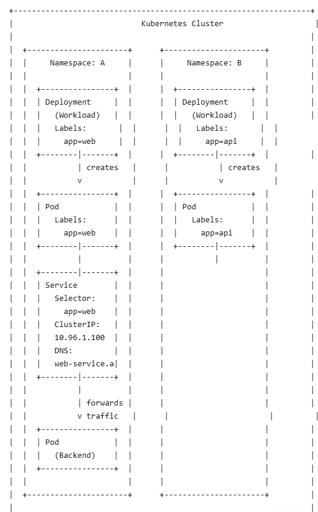{width="3.0833333333333335in" height="4.952891513560805in"}

#### 工作负载 workload

-   无状态服务：Deployment + Service

-   有状态服务：StatefulSet + Headless Service + PVC

-   节点级服务：DaemonSet

-   批处理任务：Job

-   定时任务：CronJob

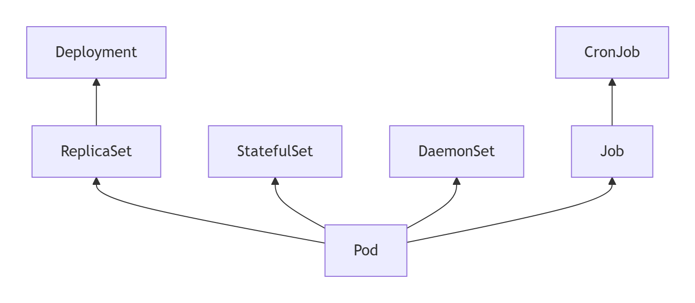{width="5.772222222222222in" height="2.523115704286964in"}

Daemon Set一般用来做日志收集/节点监控等, 就是和守护进程的supervisor功能类似

#### Pod

生命周期状态

-   Pending: API server 已创建 pod，但尚有一个或多个容器镜像未创建或正在下载；

-   Running: pod 内的所有容器已经创建，至少有一个容器处于运行状态或正在重启；

-   Succeeded: pod 内所有容器已退出且不会再重启；

-   Failed: pod 内所有容器已退出，且至少有一个容器退出失败；

-   Unknown: apiserver 无法获取 pod 状态，可能由于网络问题导致。

如果pod一直是pending, 考虑1) 资源紧张2) PVC等创建失败

##### Pod删除

pod的优雅退出时间

endpoint监听删除关联操作

kubelet内部prestop等操作

容器进程收到SIGTERM信号

超过优雅推出时间会再发送SIGKILL

##### Pod重启策略

-   Always: 容器退出后总是重启，默认策略；

-   OnFailure: 容器异常退出时才重启；

-   Never: 容器终止后不重启。

#### 初始化容器的具体逻辑

只执行一次, 执行完就会结束

#### Service

一个工作负载workload由多个pod组成, pod是动态变动的, 可能改变pod的数量, 也可能更新容器版本时, 有pod被删除后重建.

每个pod ip是临时的(也可以配置静态持久化)

service作为workload的一个稳定网络入口, 可以作为服务发现, 负载均衡, 入口的抽象

每个workload创建可以创建多个Service资源对象, yaml中进行配置

#### Endpoint / EndpointSlice

endpoint是传统模式, 新的使用endpointslice

是存储Service实际网络端点信息(维护映射关系), controller根据pod的变更维护更新

数据是存储在etcd的

会收到namespace命名空间的约束

kube-proxy会监听endpointslice的状态数据. 为本node内的关联的pod调整网络规则

#### template

template 是 Deployment 规范 (spec) 中的一个字段, 定义了pod的模版规范(pod的元信息)

不直接定义pod, 而是用template来规范

1.  抽象层级的分离, 定义pod的元信息而不是具体定义pod; deployment作为控制器, 通过元信息模板, \"生产\"出具体的pod

2.  动态创建机制

3.  版本控制/滚动更新

4.  标签选择器关联

5.  资源复用和组合: 不同的workload使用相同的pod定义

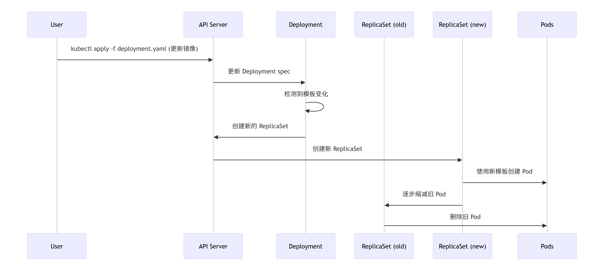{width="5.538888888888889in" height="2.4908825459317585in"}

#### selector 标签匹配(可能有其他名称scalexxx)

selector（选择器）是Kubernetes中用于标识和选择一组资源的机制.它通过标签（Labels）进行匹配，允许您声明式地指定\"哪些资源属于这个集合\".

关键元素:

-   标签 Labels: 键值对（key=value）形式的元数据，附加在资源对象上（如 Pod）

-   选择器Selector:定义匹配标签的条件规则

-   关系: selector 查询带有特定 labels 的资源

#### 探针

三类探针

-   livenessProbe（存活探针）：检测容器是否正常运行，不健康时会重启容器；

-   readinessProbe（就绪探针）：判断容器是否可以接收流量，不健康时Pod会被移出Service；

-   startupProbe（启动探针）：用于避免业务启动缓慢导致的探针失败。

## 书-Kubernetes网络权威指南

### 网络虚拟化

#### network namespace

linux的namespace名字空间作用是隔离内核资源

将文件系统挂载点, 主机名, POSIX进程间通信消息队列, 进程PID数字空间, IP地址, user ID数字空间

分别有Mount namespace,UTS namespace,IPC namespace,PID namespace,network namespace,user namespace

后面都是对network namespace的运用

都是在ip命令里的

netns 后各种操作

虚拟网络设备/物理设备等等的区别

#### veth pair

**题外话**

veth pair的通信和lo的对比

两者都会完整走完协议栈, 在协议栈后, vp会继续到网络设备层, 驱动层(veth驱动)

而后者协议栈后, 判断是lo设备不会到网络设备层, 直接再回到协议栈处理

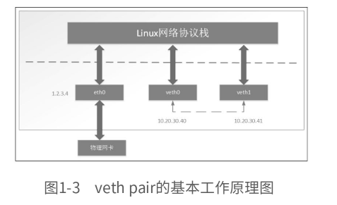{width="4.96875in" height="3.03125in"}

容器经典组网模型: veth pair+brige

如何查看veth pair的连接关系

iflink, ifindex文件

ip link查看

ethtool看设备

#### brige 网桥

ip 创建等等 type bridge

brctl

都是相关命令

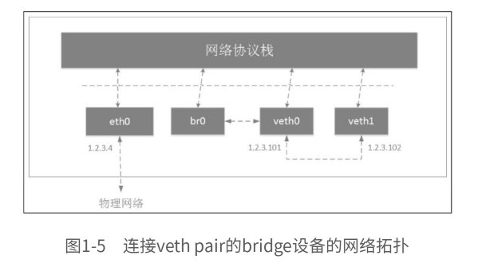{width="5.772222222222222in" height="3.2763867016622923in"}

为什么网桥会拦截veth-\>协议栈的通信

原因是网桥是作为二层交换机的作用, 接管了连接设备的流量

后续由网桥传到协议栈

bridge和veth相连后

-   br0-veth0是双向通道

-   协议栈-veth0变为单通道, 只有协议栈可以发数据给veth0

-   br0的MAC地址变成veth0的MAC地址

veth在去pingveth pair的另一端会失败

因为ARP返回包, 没法会给协议栈, 完全让网桥接管了

所以得把ip配置给网桥而不是和网桥连接的veth

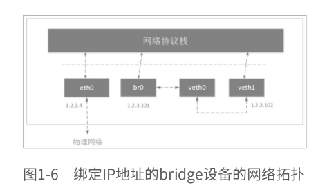{width="4.791666666666667in" height="2.8958333333333335in"}

通过 br0去ping veth1是OK的, 因为ARP回包会被网桥送给协议栈

为了连接外部网关, 文中将物理网卡(eth0)加到网桥(br0)中

这导致网关\--\[eth0\]\--br0\--\[veth0\]\--veth1

\[\]中的这两变成类似网线的存在了

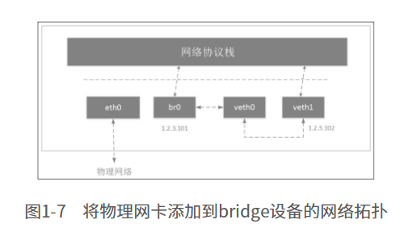{width="5.260416666666667in" height="3.0in"}

这需要eth0是混杂模式, 这太危险了

实际应用

虚拟机, 通过tun/tap(tunnel 通道吗?)和网桥连接

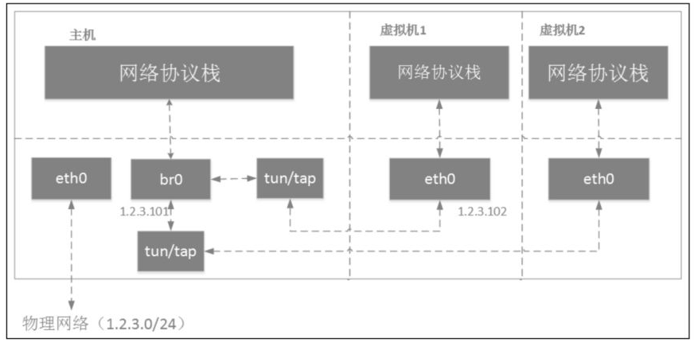{width="5.772222222222222in" height="2.879491469816273in"}

容器, 只使用veth pair

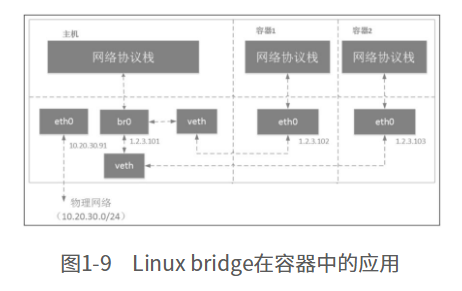{width="4.8125in" height="3.03125in"}

虚拟机中和母机是在同一网段的

但容器一般不会和母机在同一网段

网桥作为容器的网关, 然后母机IP forward功能在通过物理网卡发送出去(eth0)

混杂模式, 监听模式, 之前ARP中间人攻击的时候就用到, 所以开启这个模式的尽量需要可信

网络设备加入网桥后会自动变成混杂模式(promiscuous), 移除后的话会变回来

#### tun/tap

是理解flannel的基础, 这是k8s的一个网络插件

从linux文件系统角度看, 这是用户可以用fd来操作的字符设备

从网络虚拟化角度看, 这是虚拟网卡, 一端连着网络协议栈, 另一端是用户态的程序

反正大概是用户态程序可以直接操作的设备

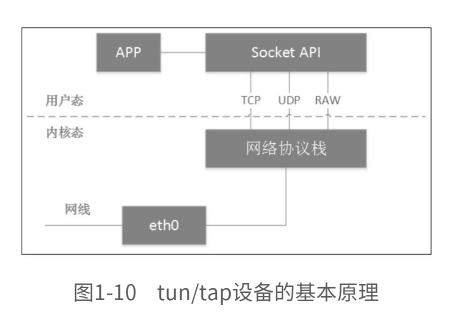{width="4.71875in" height="3.3333333333333335in"}

tun设备的使用

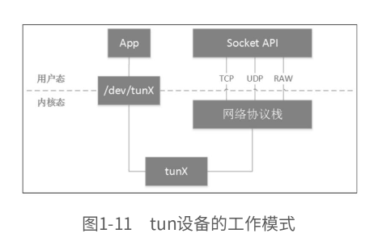{width="4.864583333333333in" height="3.1145833333333335in"}

/dev/tunX这个文件, 就是可以通过用户态操作fd来写数据的, 写入的数据都会发给内核的网络协议栈

tap设备和tun基本相同

区别:

-   tun设备的文件收发是IP包, 只能工作在L3, 无法和物理网卡桥接, 可以通过三层交互(ip_forward)连通

-   tap的/dev/tapX文件是链路层数据包, L2层, 可以直接与物理网卡桥接

tunnel经常用于VPN, 做数据压缩, 加密等

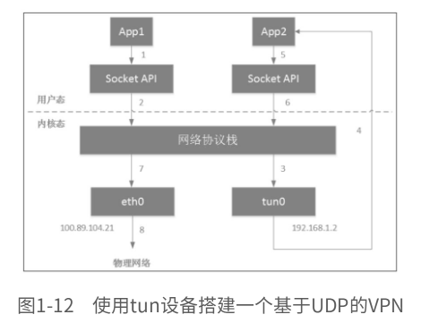{width="4.895833333333333in" height="3.7604166666666665in"}

#### iptables

哼, 我可是做过iptables的编程, 虽然都忘了

iptables底层是netfilter实现

ip层的5个hook

PREROUTING,POSTROUTING,INPUT,OUTPUT,FORWARD

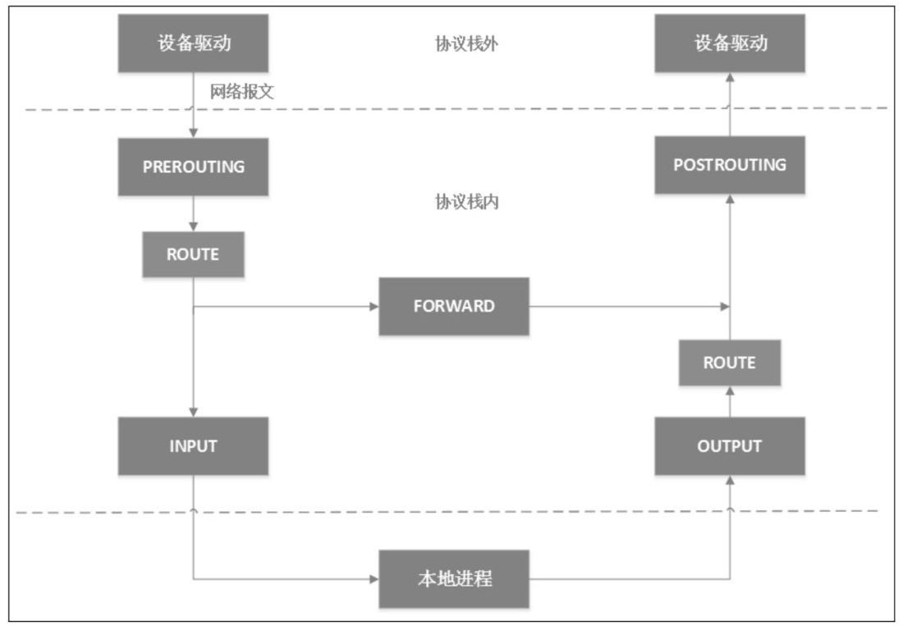{width="5.772222222222222in" height="4.0038232720909885in"}

-   PREROUTING: 网卡收到包, 最先经过的. 可以对包进行DNAT目标地址转换

内核查本地路由表决定是做转发还是给到本地机器

-   FORWARD: 本地当做路由器, 处理转发时, 做包过滤, reject等

-   INPUT: 到本地进程前的

-   OUTPUT: 本地进程发包后进入的, 可以进行路由转发

-   POSTROUTING: 即将离开协议栈, 发送到网络设备, 可以进行SNAT源地址转换,Masq源地址伪装

netfilter

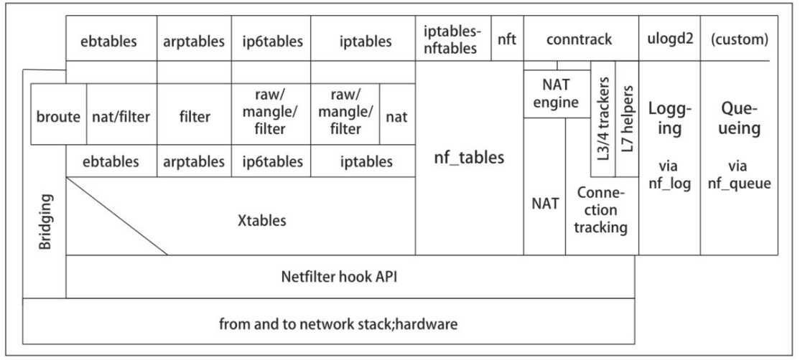{width="5.772222222222222in" height="2.601127515310586in"}

三板斧: table, chain, rule

5张表, 5条链

链对应上面的5个hook

5张表

-   filter表, 过滤放行, 丢弃, 拒绝

-   NAT表, 修改包的DNAT, SNAT

-   mangle表, 修改数据包的IP头

-   raw表, iptables对数据包有连接跟踪机制, raw是用来去除追踪的.(不是很清楚)

-   security表, 新加的, 之前4个表, 包使用SELinux

优先级: raw, mangle, nat, filter, security

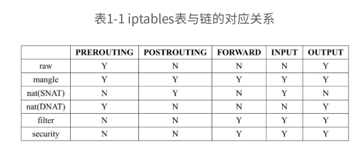{width="5.772222222222222in" height="2.3717541557305335in"}

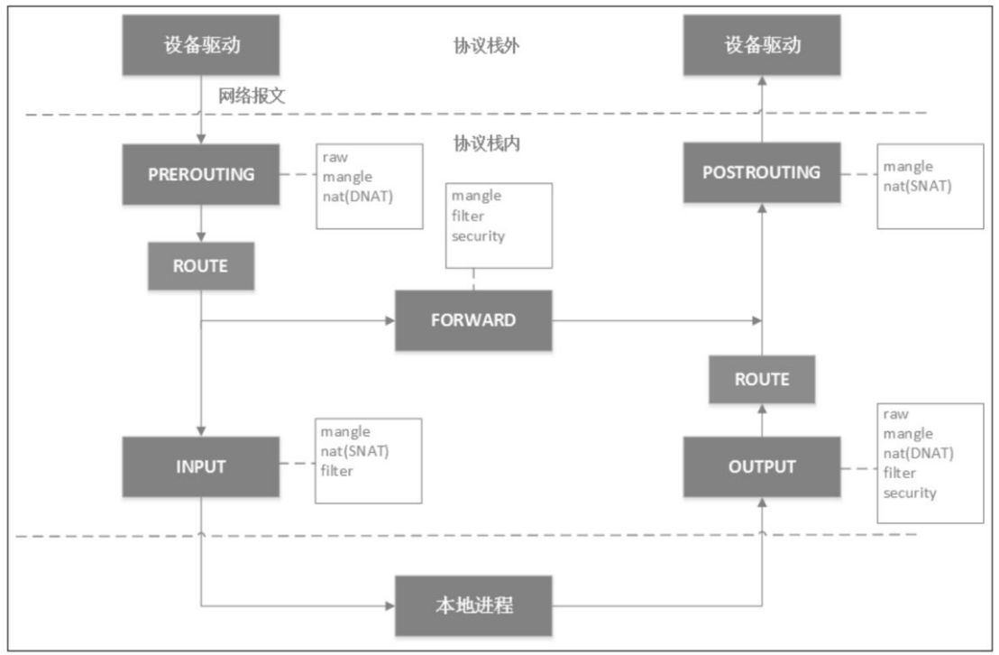{width="5.772222222222222in" height="3.782159886264217in"}

一般来说要用户写的都是匹配条件+动作

#### 隧道 ipip

前面tun设备也称点对点设备, 因为常用来做隧道通信

ip tunnel help可看到ip隧道相关的

-   ipip: IPv4 in IPv4, 用ip报文封装ip报文

-   GRE: 通用路由封装

-   sit: 和ipip类似, 是ipv4封装ipv6

-   ISATAP: 站内自动隧道寻址协议, Intra-Site Automatic Tunnel Addressing Protocol

-   VTI: 虚拟隧道接口 Virtual Tunnel Interface, IPSec隧道技术

Linux L3隧道底层实现都是基于tun设备的

#### 隧道网络代表 VXLAN

Virtual eXtensible LAN 虚拟可扩展的局域网

虚拟化隧道通信, overlay(覆盖网络)技术

通过三层网络单间虚拟的二层网络, what? ip层模拟mac层?

详见RFC7348

3.7内核协议栈原生支持VXLAN

VLAN是在2层中实现的

VXLAN是在3层模拟的(实际是到4层了, 有用到UDP, VXLAN header类似应用层)

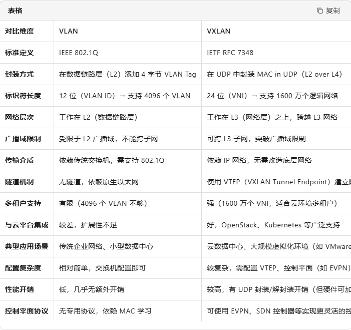{width="5.772222222222222in" height="5.426383420822397in"}

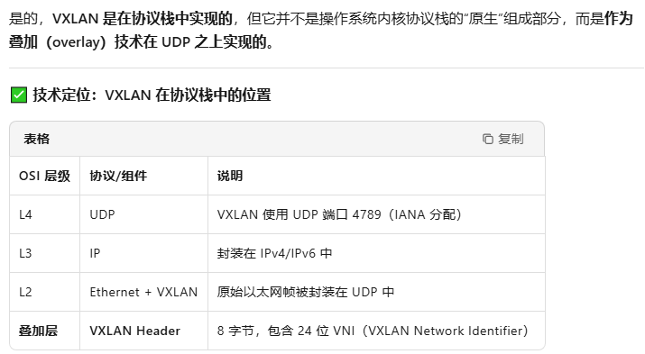{width="5.772222222222222in" height="3.1727045056867893in"}

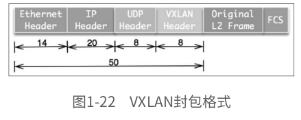{width="4.572916666666667in" height="1.8229166666666667in"}

重要概念

-   VTEP: 网络边缘设备, 进行VXLAN报文处理

-   VNI: VXLAN的标识, 就他的id

-   tunnel: 实际是个虚拟的通道, ip网络可达就能模拟

也是在iproute2工具

ip link add/delete type VXLAN

#### Macvlan

组网定义的时候, 和NAT, Linux Bridge, Open vSwitch都作为工具

macvlan性能相对更好

用来创建虚拟网络接口

5种模式

-   bridge: 类似网桥, 共享父接口

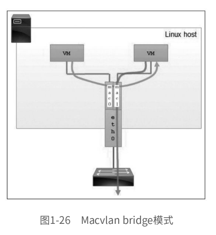{width="4.645833333333333in" height="5.052083333333333in"}

-   VEPA: 默认模式, 虚拟以太网端口聚合

-   Private:

-   Passthru: 只有一个的直通模式

-   Source: 寄生于物理设备, 指定的mac地址上

macvlan和overlay的对比

overlay是全局作用范围的虚拟二层, macvlan只适用本地的虚拟mac处理

IEEE802.11(无线网) 对一个客户端多个MAC地址的情况支持有问题, 子接口无法在无线网卡上通信

引入下一章IPvlan

#### IPvlan

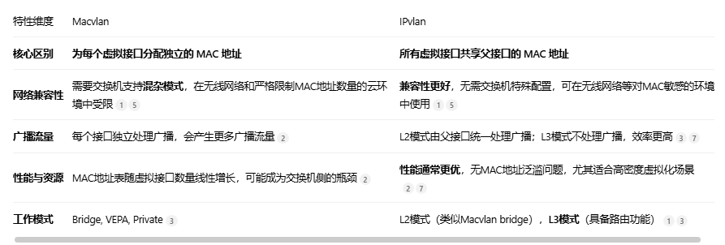{width="5.772222222222222in" height="1.9520844269466318in"}

共享mac地址的原因, DHCP的分配ip场景要注意下

两种模式

-   L2: 类似macvlan的bridge

-   L3: 类似路由器一样, 通过ip分发

### Docker网络模型简介

#### 四大网络模式

##### bridge

通过\--network=bridge指定

也是默认的网络模式

docker安装后会创建docker0的linux网桥

当创建一个容器后, 使用的是网桥模式, 容器的netns的网卡会连接到网桥上

容器网卡以veth pair到母机, 然后另一个的veth连接到br

##### host

共享Docker host的网络栈

和母机的网络完全一样, 不会独立netns

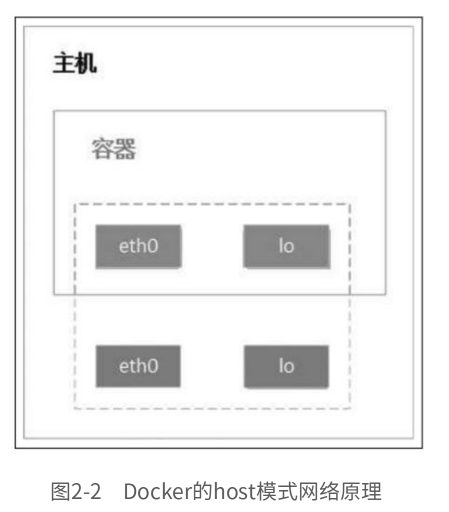{width="4.677083333333333in" height="5.333333333333333in"}

很简单直接, 但是没有隔离, 生产环境不可能使用

##### container

指定某个容器网络, 和他共享netns

##### none

除了lo回路设备, 没有其他网络设备

#### 常用Docker网络技巧

**查看容器IP**

容器外通过docker inspect查看文件

容器内正常使用命令

**端口映射**

-P 不指定映射关系

-p hostport:containerport指定映射关系

**访问外网\
**一般需要两个因素

ip_forward

SNAT/MASQUERADE

**DNS和主机名**

/etc/resolv.conf, /etc/hosts, /etc/hostname

三个文件里面搞

**自定义网络**

基本就是围绕创建的docker0网桥来

#### 容器网络第一个标准CNM

还有必要看吗? 这不都 让CNI给干没了

#### 容器组网挑战

提到了swarm, mesos, k8s

这\....

#### 容器组网方案

-   隧道方案; overlay方案

weave, open vSwitch, flannel

-   路由方案

Calico, Macvlan, Metaswitch

### K8S网络原理与实践

#### K8S网络

网络模型

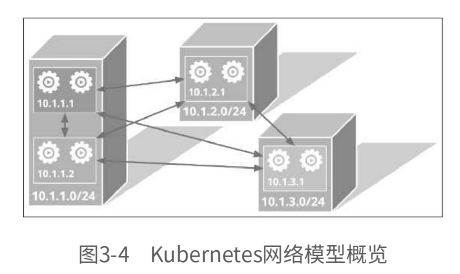{width="4.791666666666667in" height="2.8541666666666665in"}

嗯?啥意思, 这啥模型了

CNI

pod网络配置的标准接口

Service

Ingress

DNS

**k8s网络基础概念**

IP地址分配

Pod出站流量

pod到pod, pod到service, pod到集群外

**k8s网络架构**

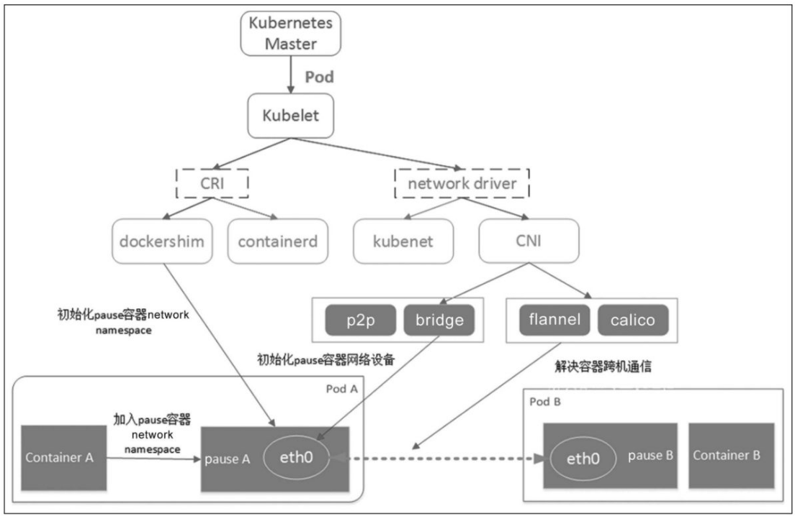{width="5.772222222222222in" height="3.7540354330708663in"}

网络架构? 网络模型?

著名的\"单pod单ip\"

每个pod都有独立的ip

pod内所有容器共享netns

**k8s主机内组网模型**

veth pair + bridge

和之前docker容器的bridge一样

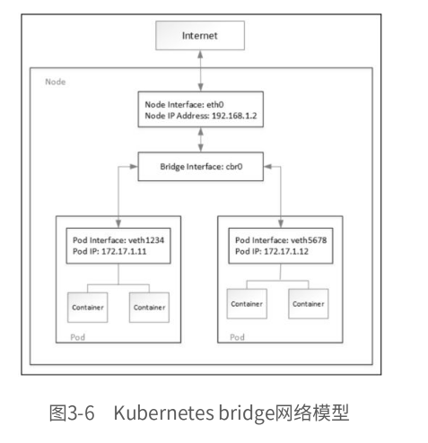{width="4.96875in" height="5.145833333333333in"}

**跨主机组网模型**

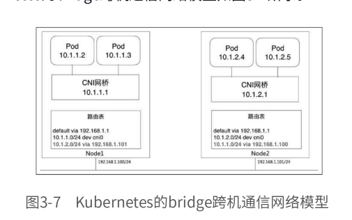{width="5.260416666666667in" height="3.2916666666666665in"}

不同的node之间是bridge+overlay

node/母机内是bridge

node间是overlay

pod容器内的host文件, 和hostname

需要在各自的netns下修改

#### pod的核心: pause容器

集群的node里docker ps会看到pause容器

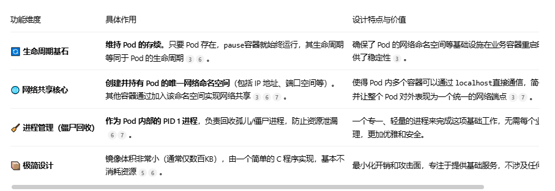{width="5.772222222222222in" height="1.9919575678040244in"}

生命周期=pod生命周期

pod所有容器共享netns

pause作为pod的pid1进程, 回收僵尸进程

主要逻辑除了ns的维护, 就是死循环的pause调用

#### CNI k8s网络

kubenet大部分情况已经不使用了

被Calico, Flannel, Cilium等网络插件取代

\--network-plugin=xxxx

kubenet在bridge插件上拓展的功能

-   使用CNI的host-local IP地址管理, 给pod分配IP, 定期释放已分配未使用的ip

-   为pod的IP配置SNAT规则(MASQUERADE), 对外请求固定一个对外的IP, 访问外网

-   开启网桥的hairpin(回环)和Promisc(混杂)模式; 前者可以让容器通过外部IP访问自己, 后者则是网桥接收所有的包, 可能有后续虚拟设备的地址

-   HostPort的端口映射管理

-   带宽控制

CNI作为网络标准化, 所有底层网络实现都通过CNI的接口组合配置

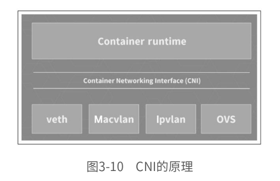{width="4.96875in" height="3.2083333333333335in"}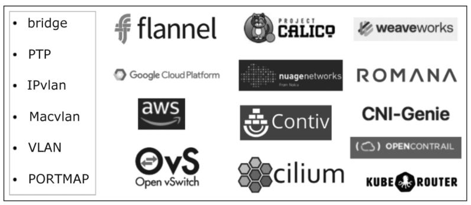{width="5.772222222222222in" height="2.5140594925634296in"}

这些可能有些都旧了

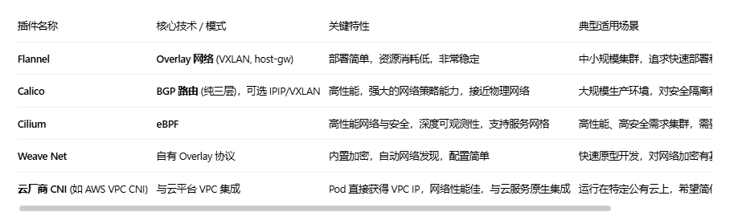{width="5.772222222222222in" height="1.6599857830271216in"}

头三个真是经久不衰

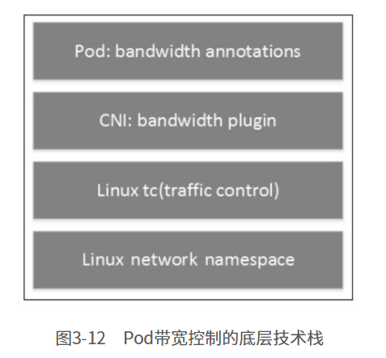{width="4.96875in" height="4.604166666666667in"}

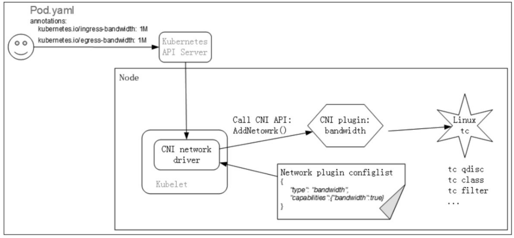{width="5.772222222222222in" height="2.6833038057742784in"}

可以, 很清晰

#### 集群内访问服务 Service

就是为了各种负载均衡, 会话亲和, ip管理等等, 在pod前置抽象出了service层

利用labels selector的匹配进行实现绑定

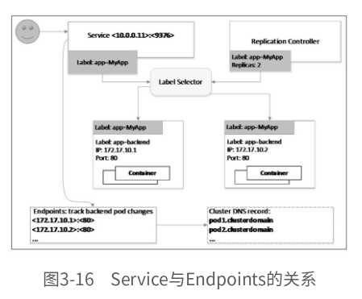{width="4.677083333333333in" height="3.8645833333333335in"}

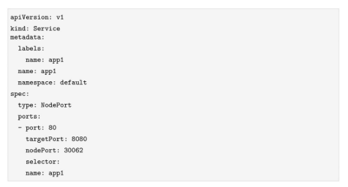{width="5.772222222222222in" height="3.1081200787401575in"}

port: 对外暴露的端口, 外面client访问时访问的端口

targetPort: 实际容器内监听的端口, 从前置过来的数据, 通过kube-proxy到pod的这个端口进入容器

NodePort: k8s提供集群外部访问Service入口的方式(?, 非本k8s内的服务访问吗?)可以通过NodeIP:nodePort来访问Service的入口

Service的类型

-   Cluster IP: 默认类型, 自动分配集群内部可以访问的虚IP

-   Load Balancer: 集群内有kube-proxy管理流量, 但是集群外的无法通过cluster ip进行访问, 外部流量可以访问LB类型service, 可以通过loadbalancesourceranges字段限制可访问网段

-   NodePort: 丐版load balancer, 也可以外部访问, 在每个node上都配置一个真实端口nodeport

**Service服务发现**

启动查API增加依赖, 不好

最早是通过环境变量种进去, 不好

最理想是应用能直接使用服务的名字, 不关系实际的IP地址

headless Service, 无头服务

没有selector

#### 集群外访问服务 Ingress

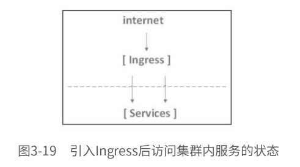{width="5.114583333333333in" height="2.8541666666666665in"}

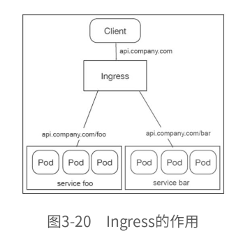{width="3.625in" height="3.5416666666666665in"}

要自己实现Ingress Controller?

简单的非http服务, 直接用nodeport/lb也可以

http的就用ingress

#### 域名访问服务 (DNS?

k8s DNS服务

基本框架: kube-dns, CoreDNS; 非必需的, 通常是插件形式

\--cluster-dns=\<\>

DNS啥的不太会

#### K8S网络策略

默认情况底层网络是全连通的

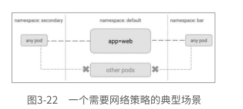{width="5.1875in" height="2.34375in"}

配置网络策略限制访问, 也是通过selector来实现

kind=NetworkPolicy

egress是出站流量

ingress是入站

podSelector是selector指定网络策略生效的pod

policyTypes: 策略类型, 默认是入站

#### 网络故障定位

**IP转发和桥接**

如果tcpdump显示大量重复的syn包, 但是没有ACK

查看ip_forward

sysctl net.ipv4.ip_forward; 0是没开启

通过bridge-netfilter配置iptables应用在linux网桥上, 需要对母机和容器之间的数据包地址做转换, SNAT之类的

查看bridge netfilter是否开启

sysctl net.bridge.bridge-nf-call-ipatbles

如果没有开启, 则

sysctl -w net.bridge.bridge-nf-call-iptables=1

并且持久化到/etc/sysconf.d/10-bridge-nf-call-iptables.conf

**PodCIDR冲突** (Classless Inter-Domain Routing 无类别域间路由)

如果网络插件是使用overlay的可能会出现

子网和母机网络冲突

kubectl get podds -o wide

对比母机的ip范围, 是否有同网段ip冲突

hairpin(自己访问自己)

不是promisc混杂模式的情况

查看Pod ip地址(这里不是故障)

外部可以看yaml定义

docker命令可以使用 inspect

容器里就直接ipp addr

为什么不推荐用SNAT

SNAT导致linux内核丢包的原因在于conntrack的实现, 代码会在postrouting链上被调用两次, 在端口分配和插入conntrack表之间有个时延, 如果有冲突的话会导致丢包

需要在masquerade规则中参数调整解决

### K8S网络实现机制

#### Service实现原理

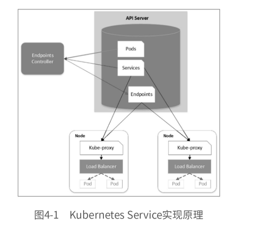{width="5.375in" height="4.78125in"}

涉及组件有Controller Manager, Kube-Proxy

controller的声明式就不用说了

kube-proxy的load balancer模块实现有三种

-   userspace

1.0之前的默认模式, 在用户态转发, 效率不高, 容易丢包; 约等于废弃

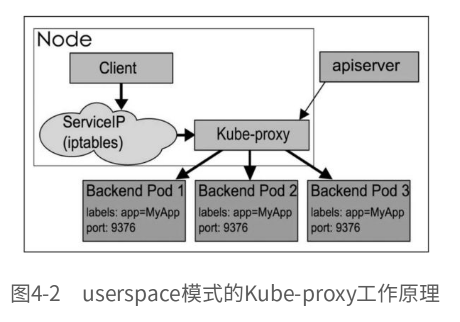{width="4.791666666666667in" height="3.3541666666666665in"}

因为会先进iptables再到用户态空间, 所以带来损耗

需要建立iptables规则, 是因为kube-proxy只监听一个端口, 这个既不是服务的访问端口, 也不是nodeport, 所以需要进行重定向

所以利用iptables的规则进行重定向

-   iptables

1.1加入, 1.2默认替换为iptables; 目前还是

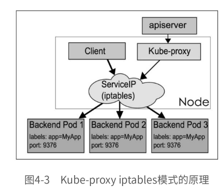{width="4.71875in" height="4.052083333333333in"}

这里就是iptables直接转发到容器内了, 不再经过kube-proxy

利用iptables的DNAT模块进行转换

kube-proxy只是个控制的

-   IPVS

是LVS的负载均衡模块, 也是基于netfilter(iptables也是)但是比iptables性能更强, 更好的扩展

正是因为集群规模的增长, 导致需要更高的性能和扩展性; 毕竟iptables一开始只是为了防火墙设计的, 底层路由表实现是链表结构, 操作耗时很高

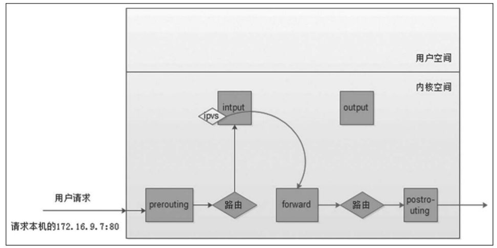{width="5.772222222222222in" height="2.8890955818022745in"}

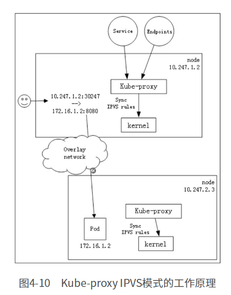{width="4.78125in" height="6.104166666666667in"}

工作原理其实和iptables差不多, 只是实现针对优化了

iptables因为专注于防火墙, 所以每条规则都会进行匹配判断, 命中后再执行

但只是用于转发的话, 那么只要查找是否有可转发的端口就行了, 进行hash后判断, 这样是对于这个场景做了专门优化

iptables的工作流

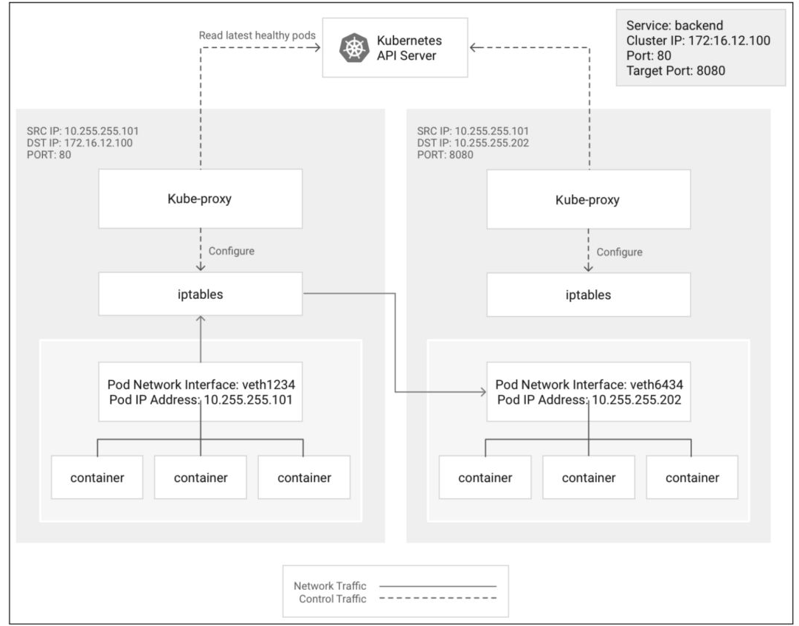{width="5.772222222222222in" height="4.519709098862642in"}

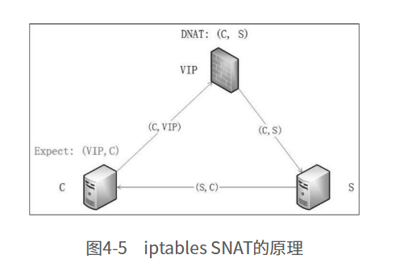{width="5.270833333333333in" height="3.6145833333333335in"}

IPVS三种负载均衡模式:

-   DR Direct Routing: 使用最广泛, 工作在L2层, 通过MAC地址做LB

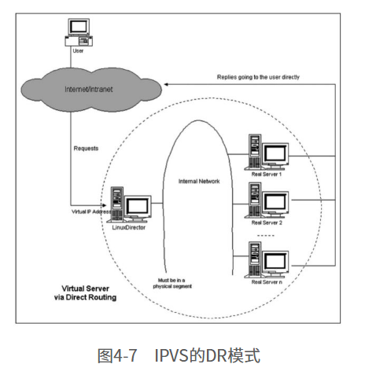{width="4.833333333333333in" height="4.96875in"}

-   tunneling ipip模式: 用ip包封装ip包的隧道模式, 所以是ipip

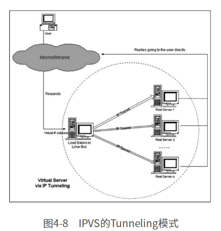{width="4.71875in" height="4.9375in"}

-   NAT Masq模式

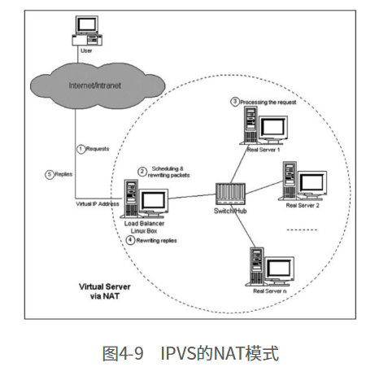{width="4.854166666666667in" height="4.864583333333333in"}

linux内核原生版本IPVS只有DNAT, 没有SNAT; 所以有的公司会自己维护一个fullNAT支持两者的版本

两者性能对比

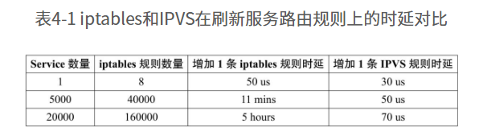{width="5.772222222222222in" height="1.6367541557305336in"}

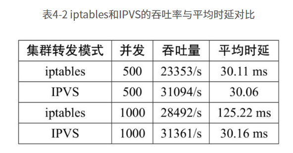{width="5.772222222222222in" height="3.012866360454943in"}

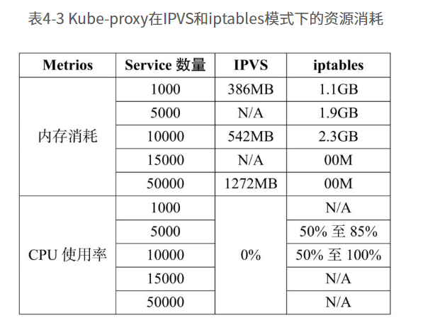{width="5.772222222222222in" height="4.505621172353456in"}

#### DIY一个Ingress Controller

准备三个东西

-   反向代理负载均衡器

-   Ingress Controller

-   Ingress API: 应该是api的服务实现

已有的Ingress Controller:

-   Ingress Controller: nginx官方维护的

-   F5BIG-IP Controller: F5开发的

-   Ingress Kong: api gateway kong的

-   Traefik: 开源http反向代理和lb

-   Voyager: 基于HA proxy

通用框架

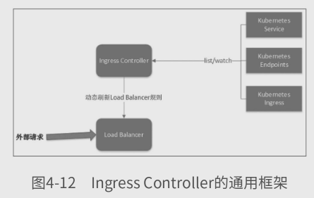{width="4.635416666666667in" height="2.9270833333333335in"}

nginx ingress controller

7层反向代理

4层负载均衡

通过\--tcp-services-configmap, \--udp-services-configmap

你说是DIY, 全写yaml呢?

#### Calico 提供k8s网络策略

和ingress类似, k8s提供network policy的api定义

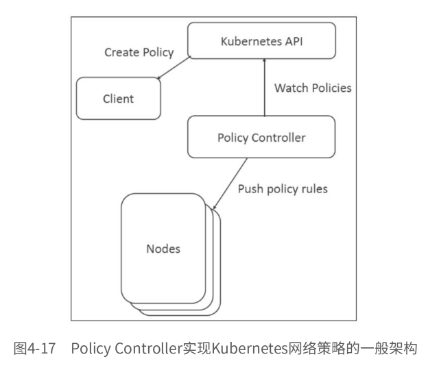{width="5.772222222222222in" height="5.022942913385827in"}

policy controller也是由k8s网络插件提供;

比如: Calico, Cilium, Weave Net, Kube-router, Romana

但flannel没有

安装Calico, 部署完k8s后, 使用add-on机制

kubectl apply -f xxxxxxxx/calico.yaml

### K8S网络插件生态

#### CNI

容器网络接口, k8s的网络标准

1个配置文件, 元信息记录

1个可执行文件, CNI插件本身

6个环境变量, 操作, 目标网络ns, 网卡等

1个命令行参数

实现两个操作 ADD/DEL

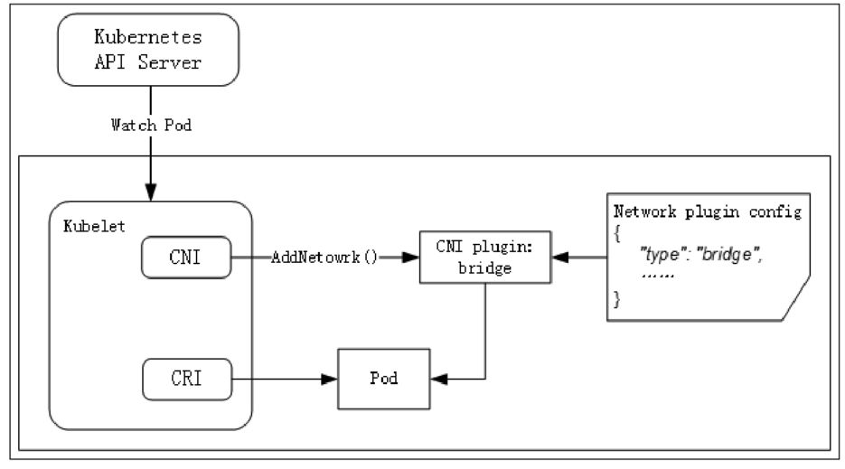{width="5.772222222222222in" height="3.2040463692038497in"}

CRI是container runtime interface

CNI是一套接口标准, 然后插件的可执行文件需要满足接口标准

#### Flannel

解决

-   容器IP地址重复问题

-   容器IP地址路由问题

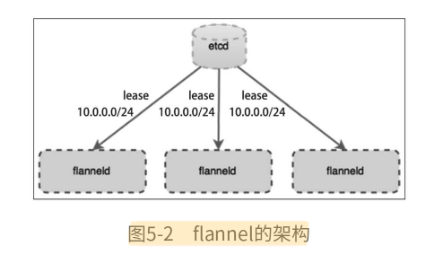{width="5.041666666666667in" height="2.9583333333333335in"}

etcd做路由表之类的协调分配ip/mac等

底层实现有

-   UDP

-   VXLAN

-   Alloc

-   Host-Gateway

-   AWS VPC: 专门L2网络支持

-   GCE路由: 专门L2网络支持

性能最好是Host-Gateway

UDP, VXLAN, HG最常用

**UDP**: tun隧道, 4层包装的隧道, 慢, 少用

**VXLAN**: 3层模拟2层的, (只有一个vxlan网络?)

可以跨三层网络, 对底层网络要求低

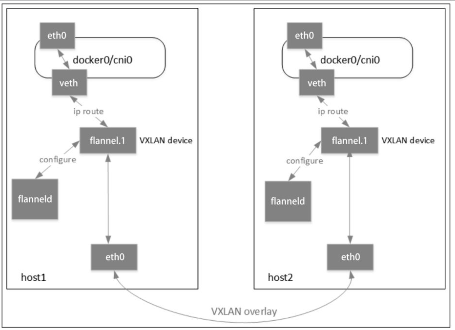{width="5.772222222222222in" height="4.192912292213474in"}

**Host-Gateway**: 纯3层路由, 所以节点需要L2需要时同子网内

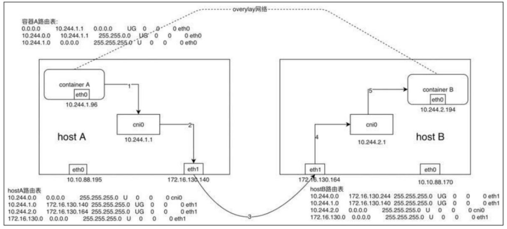{width="5.772222222222222in" height="2.609643482064742in"}

#### 3层网络插件 Calico

基于BGP的纯三层路由

靠BGP同步路由信息

overlay和纯三层路由的区别

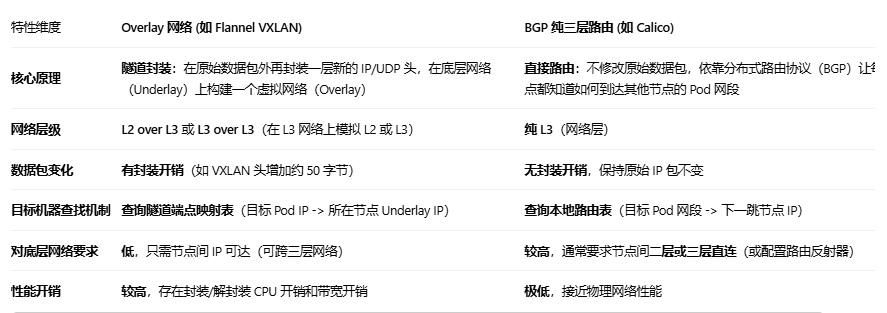{width="5.772222222222222in" height="2.036872265966754in"}

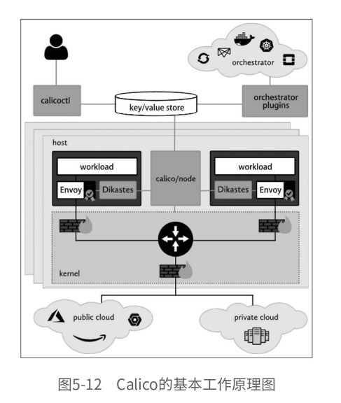{width="5.072916666666667in" height="6.0in"}

kv路由信息存储是在etcd

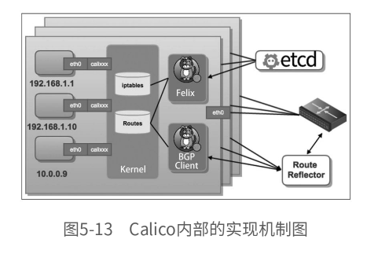{width="4.864583333333333in" height="3.3645833333333335in"}

Felix是一个守护程序 Daemon进程

负责刷新主机路由和ACL规则

-   管理网络接口

-   编写路由

-   编写ACL

-   报告状态

这么看大部分主要工作都在这里了

BGP Client, 每个服务节点上都有, 读取Felix写到内核的路由信息, 并进行分发

BGP Route Reflector(BIRD)

ipip的隧道模式

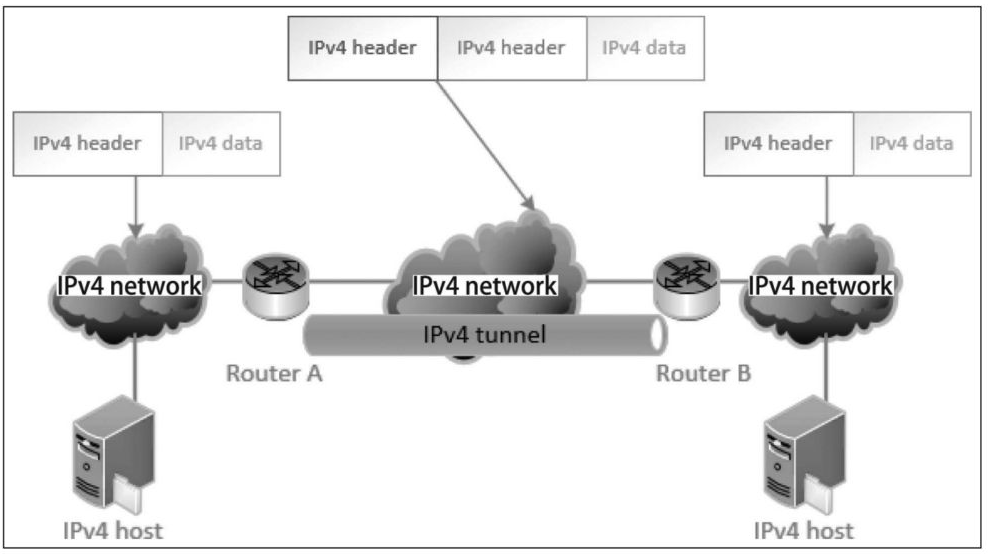{width="5.772222222222222in" height="3.23665135608049in"}

BGP和IGP的区别

IGP 内部网关协议, 只关注AS内部, 小型网络适用

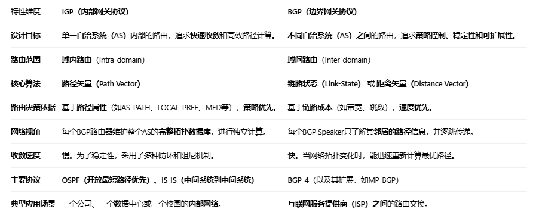{width="5.772222222222222in" height="2.3230457130358704in"}

核心设计思想是Router, 将每个OS的协议栈作为容器的路由器

但同样会收到BGP的限制

#### Weave 支持数据加密的网络插件

CNCF官方的子项目, 功能齐全

去中心化的架构(就是没有什么主网关, 或者主存储), 利用gossip协议做路由的数据同步

每个主机都会安装wRouter(记录和同步数据用)

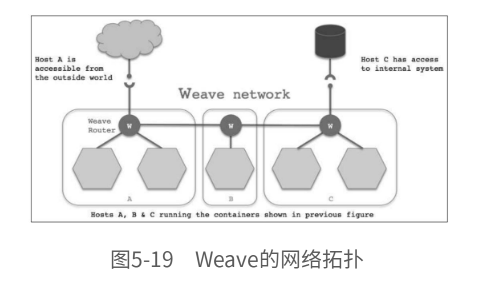{width="5.010416666666667in" height="2.96875in"}

安装

kubectl apply -f xxxxx/weave-kube

实现原理: 也是通过封包是实现L2的overlay

-   sleeve模式, 用户态运行, 性能较差

-   fastpath模式, 内核态

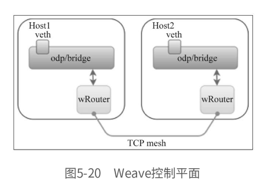{width="4.75in" height="3.28125in"}

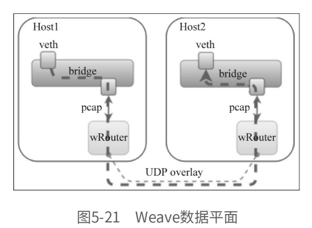{width="4.666666666666667in" height="3.40625in"}

网络隔离只有子网级的隔离

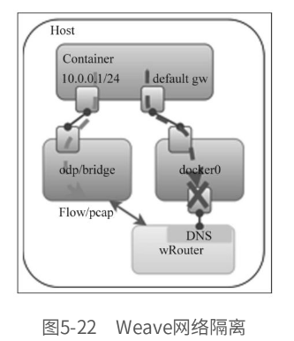{width="3.46875in" height="4.020833333333333in"}

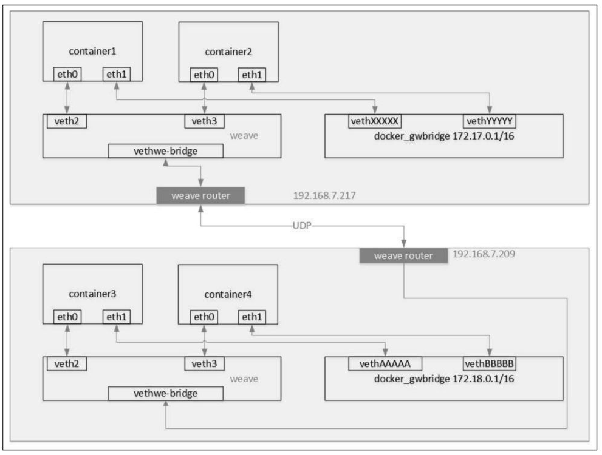{width="5.772222222222222in" height="4.368483158355206in"}

跨主机通信, 靠网桥到母机后的wRouter路由查找下一跳

#### Cilium 安全网络连接

为什么用, **iptables**在微服务时代的限制, 大规模情况下的转发性能的问题

**BPF** (Berkeley Packet Filter)Linux内核中高性能沙箱虚拟机, 让内核变成可编程的

tcpdump也是基于BPF实现的profiling和tracing

Cilium利用BPF进行实现, 将功能注入linux内核中

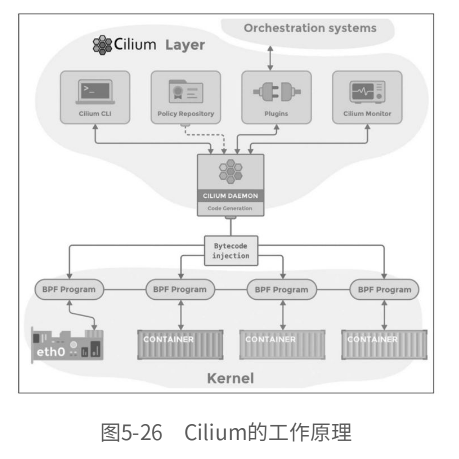{width="4.78125in" height="4.78125in"}

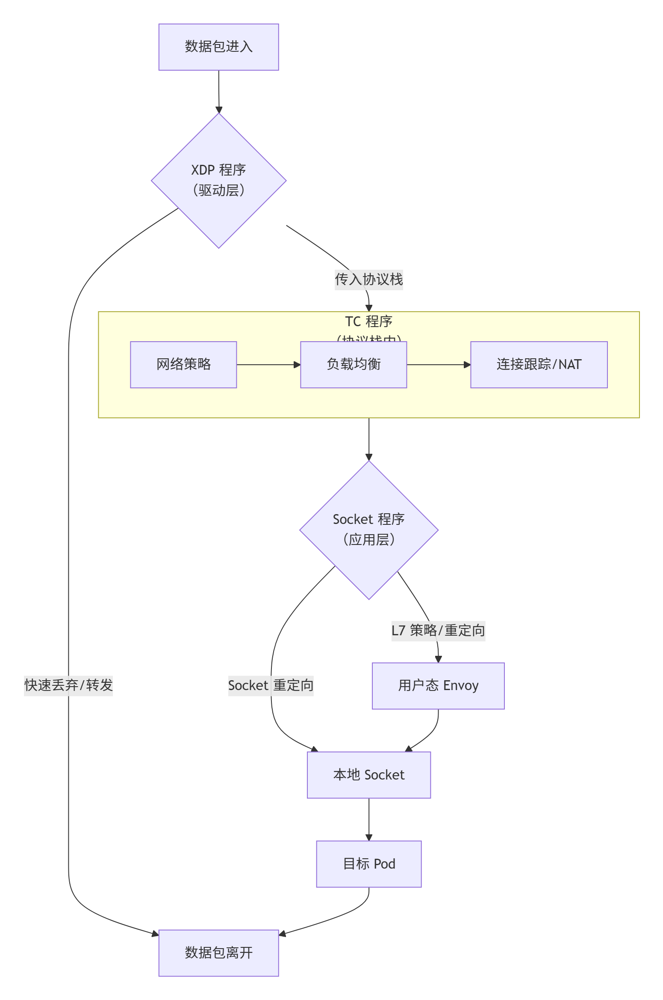{width="5.772222222222222in" height="8.693688757655293in"}

功能:

-   容器的网络连接: overlay, 直接路由都可

-   基于策略的网络安全: 策略配置基于身份, IP/CIDR, API

-   分布式可扩展负载均衡: L3,L4

-   可视化

-   监控

安装为啥不是用apply而是create

kubectl create -f cilium.yaml

#### CNI-Genie

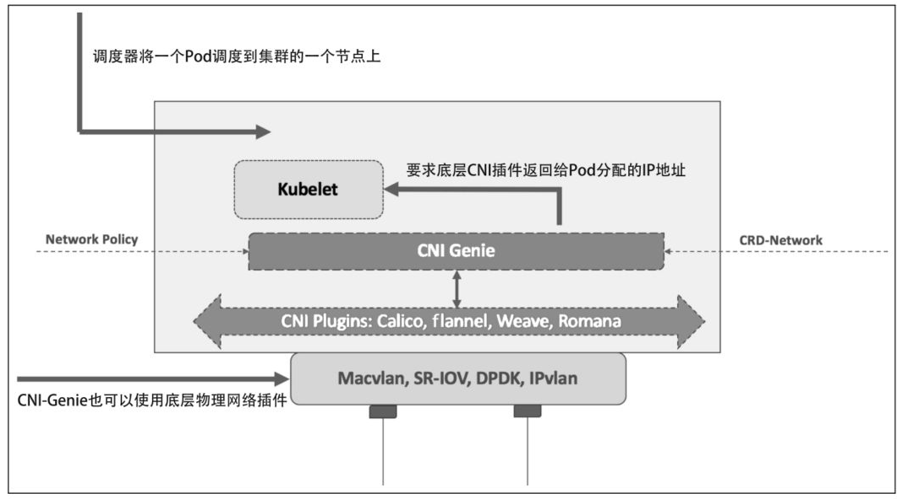{width="5.772222222222222in" height="3.220693350831146in"}

好家伙, 你是网络插件的中间层?

### 服务网格 Service Mesh/Istio

#### Sidecar模式

#### Istio

透明注入

CNI插件

istio-cni-code的deamonset
