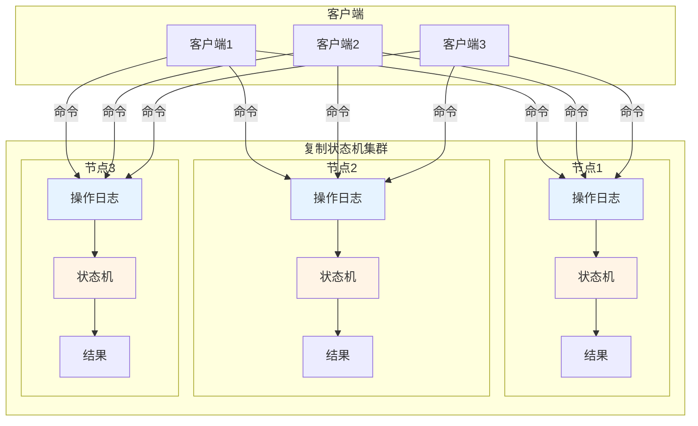
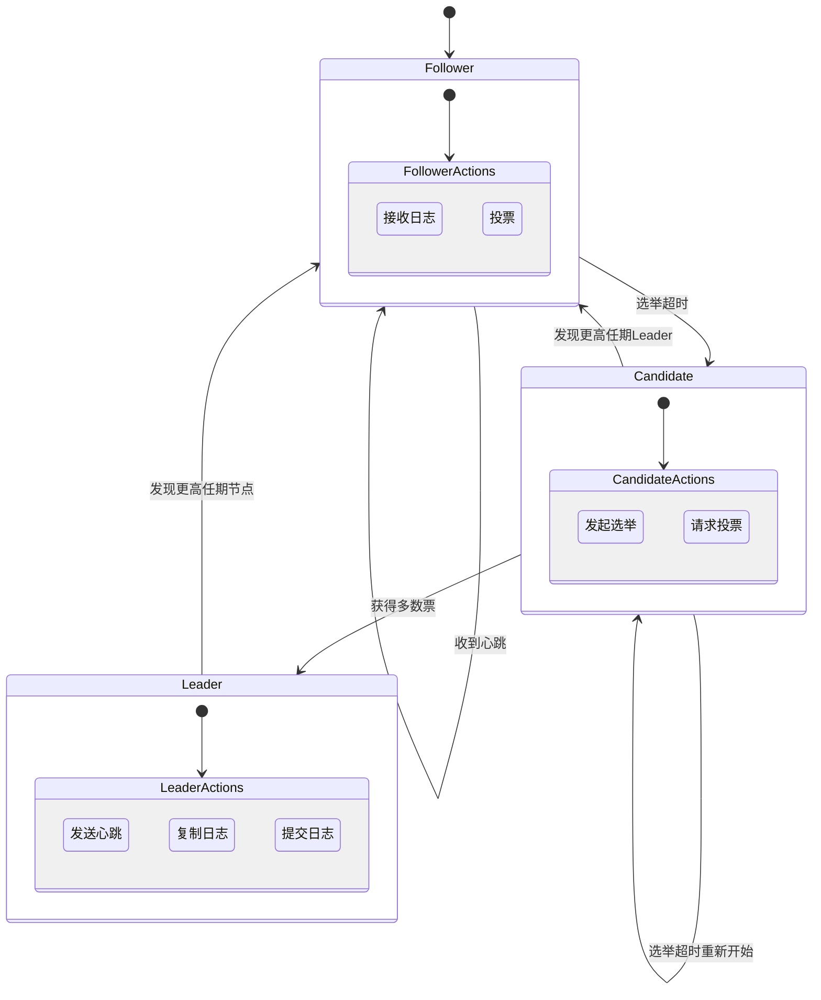
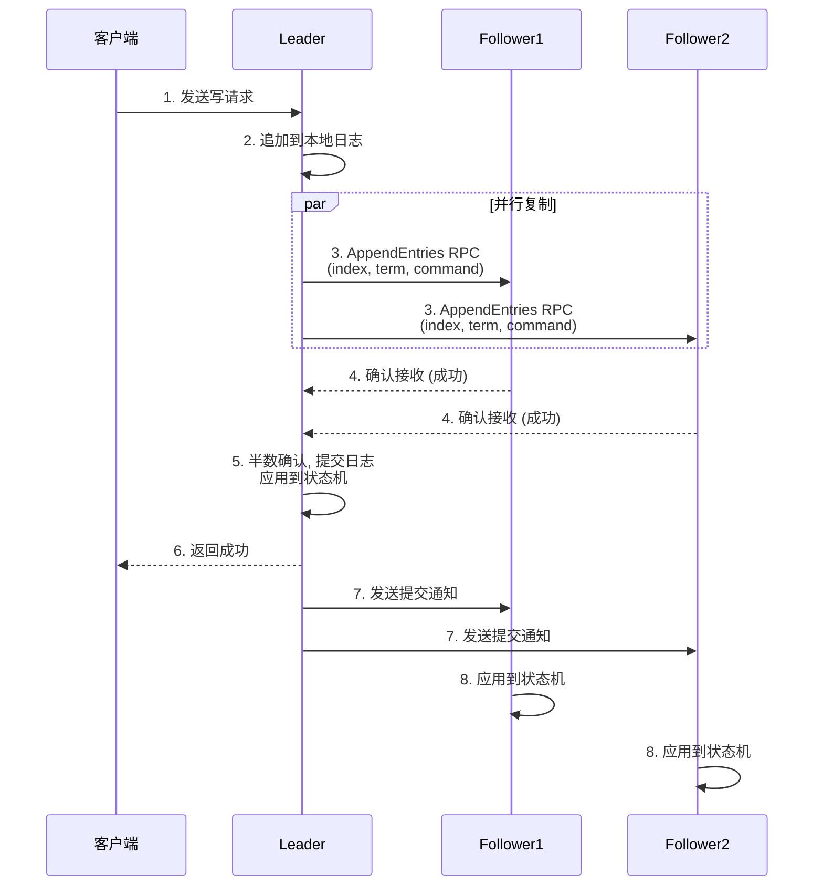
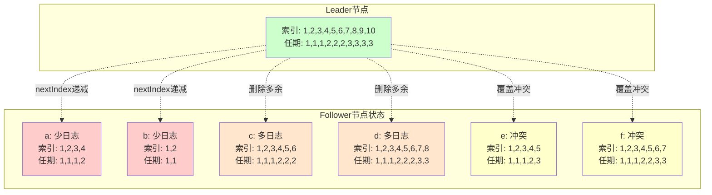
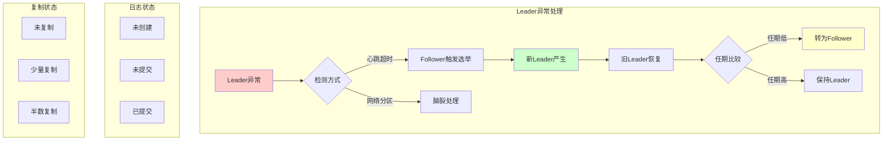
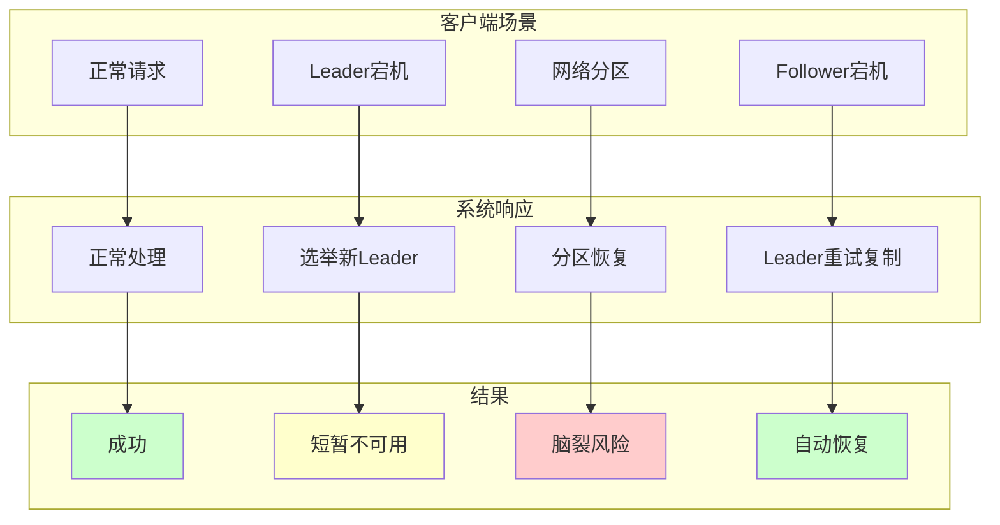
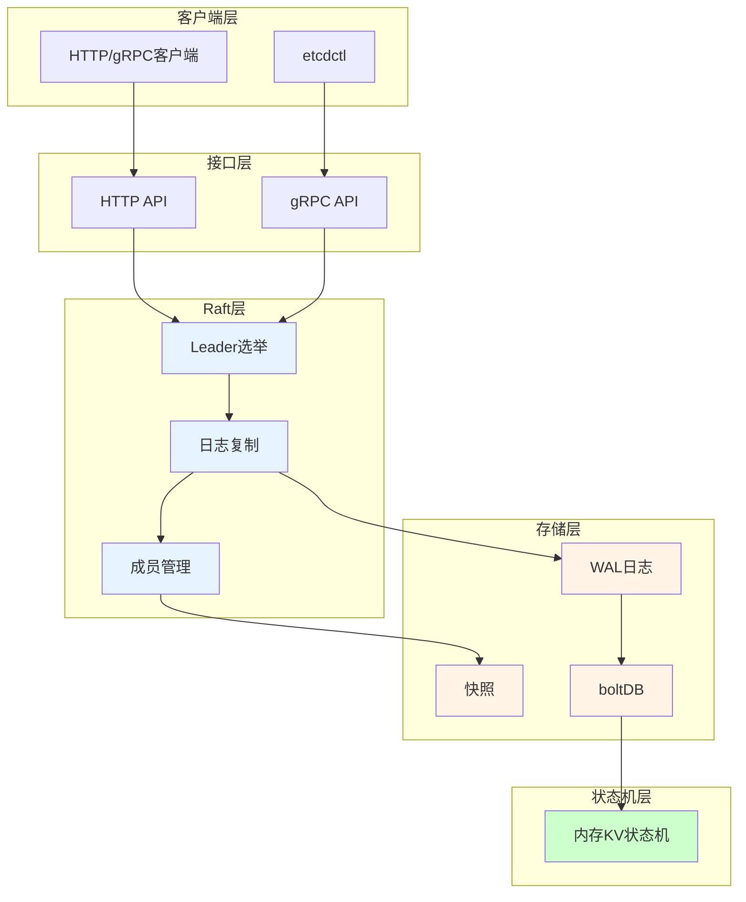

## 书-云原生分布式存储基石:etcd深入解析

### 基础

#### 分布式系统与一致性协议

##### 一致性模型

一致性中, 顺序是关键

**强一致性**, 保证全局正确顺序且有时效性强

**顺序一致性**, 保证全局的正确顺序, 但不保证时效性, 所以排序可能会和强一致性不同, 缺少全局时钟导致的

**因果一致性**, 整体并非全序关系, 只在因果关系上有顺序, 其他比如读操作或者无关的写是未知顺序的, 整体是偏序

因果关系(happened-before)有本地顺序, 异地的读写顺序, 闭包传递(关系的传递性)

**可串行化一致性**: 这个之前没见过, 这个是非常弱的, 没有按时间或者顺序排列界限. 不保证happend-before

但是他又能保证一个顺序, 他可能对排序重新打乱, 最后表现是原子的

**最终一致性**, 弱一致性的特例, 具有收敛性质, 因果一致性算是EC的一个分支

##### 复制状态机

一个分布式的复制状态机系统由多个复制单元组成, 每个复制单元也都是一个状态机, 状态保存在一组状态变量中, 状态机的状态可以且只可以通过外部命令来改变;

\"一组状态变量\"通常基于操作日志来实现;

状态+日志的经典组合, 一个表示当前的状态, 一个保证顺序;

工作原理是 相同的初始状态, 相同的命令, 相同的命令顺序, 那么最后会是相同的状态结果

注意, 执行的命令指令顺序并不一定等于发出/接收顺序



GFS,HDFS,Chubby,ZooKeeper,etcd都是复制状态机实现的

##### 拜占庭故障

拜占庭错误/拜占庭故障: 发出/收到的消息可能是错误的

进程失败错误: 某个消息链路失效

##### FLP不可能性

结论 \"No completely asynchronous consensus protocol can tolerate even a single unannounced process death\"

没有一个完全异步的共识协议可以容忍哪怕一个未通知的进程错误

异步通信场景下任何一致性协议都不能保证

无通知进程错误, 要强于上面的fail-stop failure

异步通信对比同步通信最大区别是没有时钟, 不能时间同步, 不能使用超时, 不能探测失败, 消息可任意延迟, 消息可乱序

实际的一致性协议(paxos,raft)在理论上都是有缺陷的, 最大的问题是理论上存在不可终止性

所以都会需要在工程上做规避

一致性协议两大关键因素

1.  让服务集群作为一个整体对外服务

2.  即使一小部分服务发生故障, 也能正常对外服务

##### 一致性协议

paxos竟然也是lamport创造的. 感觉分布式领域到处都是他

###### Raft

raft是为了当初paxos存在问题创造的, 解决了可理解性, 工程化的问题

使用的方法:

1.  问题分解

-   领袖选举, 确定leader

-   日志复制, 同步状态

-   安全性, 是状态机的安全原则

-   成员关系变化, 集群动态变化

2.  减少状态空间

减少了复杂的节点状态, 消除不确定性(将粒度变更粗了)

-   强领导人, 日志只由leader发给其他服务器, 但是这会有点类似单点问题

-   领袖选举, 随机定时来启动成为候选人

-   成员变化, 调整集群成员关系使用了新的一致性方法-联合一致性

**raft三种状态**

-   leader 类似主节点

-   candidate 缺失主节点的时候, 随机时间值后触发选举时的状态

-   follower 类似从节点



> 图：Raft状态机转换图，展示Leader、Candidate、Follower三种状态及转换条件

任期term也作为逻辑时钟的使用

选举过程这里不赘述了

记住心跳的检测和选举定时器的随机值触发

超半数投票, 投票算上自己

**日志复制**

就是复制状态机的实现

每个日志记录/元组/单元有三个属性: 整数索引log index, 任期号term, 指令command



根据文中描述, 半数复制后才有认为是可被提交状态

那么这里是有复制的分布式事务的处理

这里是每次复制的处理

还有新任期的leader与其他follower的状态不一致如何处理



> 图：Raft日志复制状态不一致处理，展示Leader如何处理各种Follower日志差异

a,b是比leader少的

c,d是比leader多的

e,f 有多也有少

后两种情况一般是节点做过leader, 然后有未提交的日志记录, 且出现过故障, 这种情况是少数的

一般情况都是保持一致的

那么出现冲突的是如何处理的呢, 直接按leader的为准, 覆盖follower的

很粗暴, 但是越直接的越有效

具体操作:

1.  找到第一个日志条目不一致的位置

2.  follower连续删除这个位置后所有日志

3.  leader从该位置重新发送后续日志做复制

上面实现会借助nextIndex来实现, 这个变量表示发送给该follower的下一条日志条目的索引

当follower拒绝时, leader递减重试, 这样会有很多的网络请求

可以用索引当前term的最小索引值, 然后leader做跳跃式遍历, 将O(n)转为O(logn)

详细流程看下书里的日志复制流程, 一共总结7个步骤

注意leader当过半数复制成功后才会改写leader本地的状态机并返回给客户端

解决冲突的问题, 采用强领导人模型, 很直接很简单, 没有什么llw等等冲突解决的手段

有好处也有坏处

为了避免这种情况, 像kafka选举的时候会优先isr的节点

**可用性和时序**

分布式两大敌人: 时钟和网络

是尽量不要去依赖的

broadcastTime广播时间\<\<electionTimeout选举超时\<\<MTBF平均无故障工作时间

利用这些时间量级的差距, 来制定可用的超时时间

**异常情况**

主要两大类, leader异常, candidate/follower异常

非主的异常: leader会无限重试; 有点像2pc(只是他不是全数,而是半数直接提交), 都算是阻塞式分布式事务吧?



主节点的异常比较多情况, 主要看客户端请求, leader节点的日志提交状态(未创建/未提交/已提交)和follower节点的复制情况(未复制/少量复制/半数复制)



bechmark性能评估

### 实战

#### etcd架构简介



接口层

raft层,

存储层, 持久化的KV存储, WAL, 快照管理等

复制状态机层, 内存中状态机保存

##### 数据通道类型

传输的序列化是pb的

-   stream

长连接, 复用连接做数据包的收发; 一般的小包, 心跳, 小量日志复制等

-   pipeline

处理数据量大的消息用的, 像快照复制等, 不维持长连接(使用频率少), 一般会并行发出多个消息

##### raft模块

是类似actor模型的事件循环

网络层的接口请求写到消息盒子中(这个消息盒子是什么概念, 待查)

然后专门的goroutine将消息盒子的数据写到chan(作为一个扇入?)

然后处理goroutine拉取chan的消息进行处理

##### 性能测试

还是benchmark好

测试配置

| 配置项 | 参数值 |
|:-------|:-------|
| 节点数 | 3节点/5节点集群 |
| 实例规格 | 8核16G |
| 网络 | 千兆网络 |
| 存储 | SSD |
| 测试工具 | etcd benchmark |
| 测试场景 | 写操作/读操作/混合操作 |

| 测试指标 | 说明 |
|:---------|:-----|
| 吞吐量 | 每秒操作数 (ops/s) |
| 延迟 | P50/P99 延迟 |
| 一致性 | 线性读 vs 串行读 |
| 集群规模 | 3节点 vs 5节点 |
| 数据大小 | Key/Value大小 |

可串行化读是? 是etcd的一致性配置吗?

下文有说线性读(Linearizable Read)是读请求只读到最新的已经提交的数据, 不会读到旧数据, 那么如果从节点未完全复制, 就不可用

```markdown
| 读类型 | 特点 | 性能 | 一致性 |
|:-------|:-----|:-----|:-------|
| 线性读 | 读取最新已提交数据 | 较低(需Leader确认) | 强一致性 |
| 串行读 | 可能读取旧数据 | 较高 | 弱一致性 |
| 快照读 | 读取特定版本数据 | 中等 | 指定版本一致性 |
```

```markdown
| 集群规模 | 写吞吐(ops/s) | 写延迟(ms) | 读吞吐(ops/s) |
|:---------|:--------------|:-----------|:--------------|
| 3节点 | ~10,000 | 2-5 | ~20,000 |
| 5节点 | ~8,000 | 3-7 | ~18,000 |
```

```markdown
| 场景 | 节点数 | 数据量 | 结果 |
|:-----|:-------|:-------|:-----|
| 正常写入 | 3 | 1KB | 成功, 半数确认 |
| Leader故障 | 3 | 1KB | 自动选举, 短暂中断 |
| 网络分区 | 5 | 1KB | 可能脑裂, 需恢复 |
| 快照恢复 | 3 | 100MB | 从快照恢复, 追赶日志 |
```

#### 开放API

#### 运维与稳定性保证

#### 安全

### 高级

#### 多版本并发控制MVCC

v2是不支持的; v2是纯内存的树结构, 然后持久化是一段时间的内存快照存储到磁盘

v3的修改是将存储放在boltDB, 底层是一个B+树的kv存储

boltDB只使用基础kv存储, 不会使用其他特性(比如索引之类的)

数据的更新删除都是新增版本, 只增不改, 后续在压缩整理碎片

v3逻辑视图是内存kv的词法排序索引; 范围查询很快

物理视图是boltDB

内存中还维护了一个B树索引

key的版本是reversion=(main,sub), main是事务ID, sub是事务内操作id(第几个)

每个key关联keyindex

```mermaid
flowchart LR
    subgraph KI [KeyIndex结构]
        K1[key: /config/app]
        K2[reversion: (main, sub)]
        K3[generations列表]
    end
    
    subgraph RV [Reversion]
        R1[main: 事务ID]
        R2[sub: 操作序号]
    end
    
    subgraph GN [Generation]
        G1[createRevision]
        G2[ver: 版本号]
        G3[modRevisions]
    end
    
    K1 --> K2 --> K3
    K2 --> R1
    K2 --> R2
    K3 --> G1
    K3 --> G2
    K3 --> G3
    
    style K1 fill:#e6f3ff
    style K2 fill:#fff4e6
    style K3 fill:#ccffcc
```

> 图：etcd v3 KeyIndex数据结构，展示key、revision和generation的关系

#### 日志和快照管理

v2是定时利用COW机制, fork进程然后将内存树结构持久化, 类似RDB

v3是WAL持久化, 然后定时WAL压缩

#### 事务和隔离(V3)

etcd的迷你事务

STM软件事务内存

#### Watch机制

v2的watch是一个watch一个tcp连接, 版本限制向前1000个

v3改到grpc实现, 有连接复用, 没有版本限制, 但是需要版本对应日志没有被压缩
