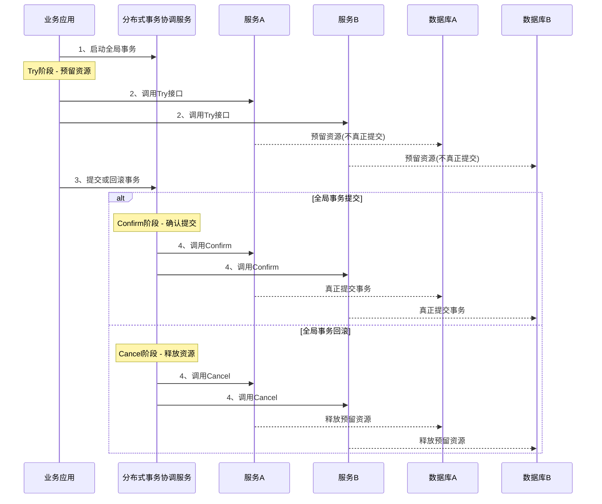
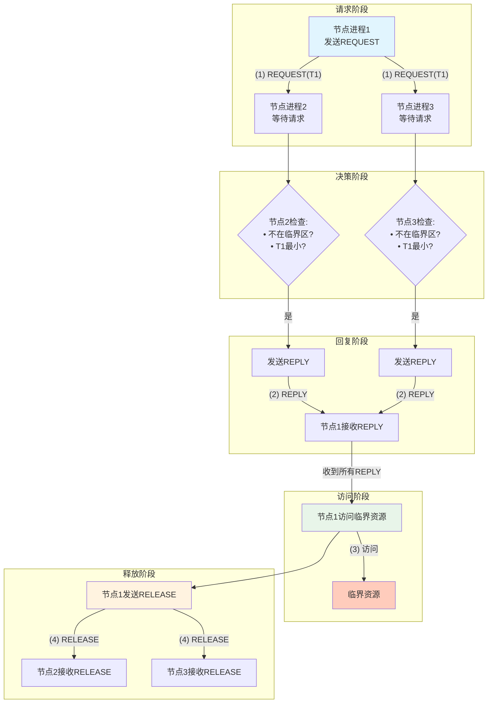

# DK百科不全书-分布式原理

DDIA等非完全的笔记

## 分区

### 如何保证节点均匀

虚拟节点与实际节点n:m的映射, 虚拟节点越多理论越均匀

### 增加/修改节点后数据同步

1)  增量修改 2)停机全量修改; 通过写日志或者全量拷贝原节点数据; 增加数据双写/数据版本

或者参考redis cluster版本的resharding.

注意resharding的数据同步时, 处理的不同层级的对象以及迁移操作上最原子的单位;

如果是一致性hash, 新增的物理节点(实际实例)是最粗粒度, 需要进行搬迁的是虚拟节点(或者说虚拟节点关联的数据), 最原子的搬迁单位根据不同的数据库实现, 可能是KV, 可能是单条记录;

#### 分区方式

分区partitions, 分片sharding等等称呼

为了提供数据的可扩展性

**键值数据分区**

**hash分区**: 不要直接mod N; 固定分区数用的数值要远大于物理分片量, 再做分区号和物理分片的映射, 参考redis cluster的slot和partition; 或者 使用一致性hash

**范围分区**: 可以参考列式存储的块索引范围分块, 是类似的

### 复制

#### 主从副本的存储出现宕机后, 数据一致性的保证

主要问题是在**主从节点的数据落地的同步时序**和**节点间的确认机制**

保证强一致会牺牲时效

保证时效会存在数据丢失(甚至不是最终一致, 但如果节点恢复的话, 可以数据同步恢复)

没错, 这就是**CAP理论**里, 在保证AP时, 如何尽可能保证C的情况

#### MySQL

mysql的主从同步默认是**异步复制**

主节点完成事务(redolog,binlog写盘等), 立刻给客户端返回成功; 此时异步复制,binlog异步复制给从节点, 但如果此时主节点宕机, 会出现数据丢失, 因为主节点没有确认从节点的binlog接收状态

缓解/解决方案:

1.  半同步复制: 至少n个从节点确认

2.  增强半同步复制: 在事务COMMIT之前, binlog落盘后立马推送从节点

3.  组复制: paxos半数节点同意

4.  全同步复制:

#### Redis

同样redis cluster的主从复制也是异步的. redis在自身内存处理完后就会返回成功

可以调整appendfsync级别做缓解 (这个参数只是影响持久化写盘的)

级别: 1)always 2)everysec 3)no

<!-- 原图片: image1.png - Redis主从复制高可用配置 -->
<!-- 已转换为配置说明+架构图 -->

**Redis主从复制高可用关键配置**:

```conf
# 关键一致性控制
min-replicas-to-write 1      # 至少1个实时从节点才可写
min-replicas-max-lag 10      # "实时"定义为延迟 <= 10秒

# 持久化(AOF)
appendonly yes                 # 必须开启AOF
appendfsync everysec           # 每秒fsync一次（推荐平衡点）
auto-aof-rewrite-percentage 100 # AOF重写配置
auto-aof-rewrite-min-size 64mb

# 复制优化
repl-backlog-size 1gb          # 加大复制积压缓冲区
repl-backlog-ttl 3600          # 缓冲区存活时间
client-output-buffer-limit replica 512mb 256mb 60  # 增大复制输出缓冲区
```

**配置逻辑架构**:

```
┌─────────────────────────────────────────────────────────────┐
│                      写入请求处理流程                         │
├─────────────────────────────────────────────────────────────┤
│                                                             │
│   [客户端写入] ──→ {检查从节点状态}                         │
│                         │                                   │
│                         ▼                                   │
│              ┌─────────────────────┐                       │
│              │ min-replicas-to-write│                       │
│              │ 至少1个从节点在线?   │                       │
│              └──────────┬──────────┘                       │
│                         │                                   │
│                    ┌────┴────┐                             │
│                    ▼         ▼                             │
│                  [否]      [是]                            │
│                    │         │                             │
│                    ▼         ▼                             │
│              [拒绝写入]  {检查延迟}                          │
│                            │                               │
│                            ▼                               │
│                 ┌─────────────────────┐                   │
│                 │ min-replicas-max-lag │                   │
│                 │ 从节点延迟<=10秒?    │                   │
│                 └──────────┬──────────┘                   │
│                            │                             │
│                       ┌────┴────┐                         │
│                       ▼         ▼                         │
│                     [否]      [是]                        │
│                       │         │                         │
│                       ▼         ▼                         │
│                 [拒绝写入]  [允许写入] ──→ AOF持久化        │
│                                               ↓            │
│                                        ┌──────────┐       │
│                                        │ 写入缓冲 │       │
│                                        │ 每秒刷盘 │       │
│                                        └──────────┘       │
└─────────────────────────────────────────────────────────────┘
```

## Kafka

同样相似的场景, 不过kafka的副本不是节点维度, 而是partition;

可以根据不同acks的配置和min.isr(in-sync replica)

acks=1 落地立马回应成功

acks=all, 至少有该数量min.isr保证同步

### **主从节点数据复制的方式**

接上一个点的详述:

同步复制: 完全保证一致性, 但是牺牲响应速度

异步复制: 引发上一个点的问题

半同步复制: 类似半数同意

链式复制: 变种

### 读写一致性

read after write

在主从复制的集群中, 使用了读写分离

在数据复制未同步时, 写后读的内容未更新;

引入\"写后读一致性\", 即读写一致性

实现方法:

1.  对自己可修改内容读主节点, 对自身无权修改内容读从节点

2.  如果内容都有可能被修改, 则在数据更新后, 一定时间内从主节点读, 并监控从节点的数据复制进度

3.  客户端发起请求时就带上时间戳, 后续做详细处理

注意: 多地部署的数据延迟问题, 请求最好都路由到主机房主节点做处理

#### 单调读

一致性上, 强一致性\>单调读\>最终一致性

从节点上数据复制完成的时机不一致, 读操作时如果路由到不同的从节点可能导致, 读取数据不一致

#### 前缀一致读

\"Happened-before关系与并发\"

#### 多主节点复制

一般出现在多地数据中心; 当然也不一定, 腾讯云的多地部署还是多地间的主从方式

1.  性能, 多地主节点可以就近处理, 但是需要考虑自增ID类似的**写冲突**问题

2.  数据中心失效的容忍: 某地宕机后, 其他中心的从节点提升主节点

3.  网络失效的容忍: 只能保证最终一致性

其他场景:

离线客户端操作

协作编辑

这类的写冲突的问题就是比较常见了

解决方式:

1.  同步/异步冲突检测: 不管那种都不太好选择

2.  避免冲突: 做类似数据分区写, 全量复制

3.  收敛到一致状态: a)LWW last write win, 可能数据丢失; b)记录所有修改,通知用户解决, 想git那样

4.  自定义冲突解决逻辑: 依赖业务具体逻辑: a)写入时执行, 依赖自定义合并规则;b)读取时执行, 可以用户解决或自动解决

自动冲突解决方案:

1.  CRDT 无冲突的复制数据类型, 双向合并

2.  可合并的持久数据结构, 三项合并(类似git), 增加跟踪变更历史

3.  ot操作转换, google协同编辑的算法

#### 无主节点复制

Dynamo, Cassandra等数据库

### 共识 / 分布式事务

#### 分布式事务

**2PC(二阶段提交):**

**阻塞式原子提交**

prepare准备阶段

commit提交阶段

需要有一个**协调者**, 类似主节点的proxy, 或者是发起请求的客户端

**参与者**准备阶段同意后, 无法撤回, 在接收到commit之前要一直维持状态; 可能会造成锁一直持有; 无法通过超时等撤回, 因为可能会造成不一致(如果可撤回就不是2PC);

**协调者**在commit阶段如果通知参与者失败, 需要一直重试, 无法撤回;可能会存在一直等待

**开弓没有回头箭, 哪怕堵死**

**3PC(三阶段提交):**

**非阻塞式原子提交**

can commit 可行

pre commit 预处理

do commit 确认

因为**不存在完美的故障检测器**, 3pc假定网络延迟是有界的, 节点可以在规定时间内返回(**但实际网络是不可靠的要记住**)

**TCC:**

try 尝试

confirm 确认

cancel 取消

<!-- 原图片: image2.png - TCC分布式事务架构图 -->
<!-- 已转换为Mermaid时序图 -->

**TCC分布式事务流程** (Mermaid时序图):



**TCC三阶段说明**:

| 阶段 | 操作 | 说明 |
|:---|:---|:---|
| **Try** | 预留资源 | 检查业务可行性，锁定资源但不真正提交 |
| **Confirm** | 确认提交 | Try成功且全局事务提交时，真正执行业务 |
| **Cancel** | 取消回滚 | Try成功但全局事务回滚时，释放预留资源 |

confirm, cancel需要保证幂等, 多次confirm只有一次效果

try后的超时操作是依赖**独立的协调器**的超时任务, 回退保证最终一致性, 避免try的锁持有

#### 异构分布式事务实现

<!-- 原图片: image3.png - 四种分布式事务模式对比表 -->
<!-- 已转换为Markdown表格 -->

**四种分布式事务模式对比**:

| 对比维度 | XA模式 | AT模式 | TCC模式 | SAGA模式 |
|:---|:---|:---|:---|:---|
| **一致性** | 强一致 | 弱一致 | 弱一致 | 最终一致 |
| **隔离性** | 完全隔离 | 基于全局锁隔离 | 基于资源预留隔离 | 无隔离 |
| **代码侵入** | 无 | 无 | 有(需实现3个接口) | 有(需编写补偿逻辑) |
| **性能** | 差 | 好 | 非常好 | 非常好 |
| **适用场景** | 传统金融业务<br/>对一致性要求高 | 基于关系型数据库<br/>的大多数分布式事务 | 高性能要求<br/>涉及非关系型数据库 | 长业务流程<br/>跨公司/遗留系统 |

**演进关系**:
```
XA ──→ AT ──→ TCC ──→ SAGA
强一致    最终一致     无隔离
高隔离    轻量锁       高性能
低性能    高性能       有侵入
```

**CAP权衡**: 随着从XA到SAGA的演进，一致性(C)逐渐降低，可用性/性能(A)逐渐提高
<https://cloud.tencent.com/developer/article/2230468>

<https://blog.csdn.net/weixin_43989347/article/details/123954734><https://cloud.tencent.com/developer/article/2048777>

dtm文档:<https://www.dtm.pub/practice/tcc.html>

**XA**

dtm, seata都有

**AT**

seata独有模式

**TCC**

dtm, seata都有

**SAGA**

dtm, seata都有

**二阶段消息**

dtm支持, 参考rocketmq的事务消息

#### 容错共识 / 共识算法满足性质

1.  一致同意/协商一致性: 没有两个节点决定不同(所有状态一致)

2.  完整性/诚实性: 没有节点决定两次

3.  有效性/合法性: 如果节点决定值V, 则V由某个节点所提议

4.  终止/可终止性: 如果节点未崩溃, 则最终一定可以达成决议

#### 共识算法

VSR

Paxos

Raft

Zab

Gossip

### 其他

#### 分布式系统两大敌人

1.  网络

2.  时钟

#### CAP原理认知刷新

这只是针对在**强一致性(C)**和**网络分区故障(P)**时的问题考虑, 比如说: 在出现网络分区故障时, 应该保证强一致性C还是分区可用A.

实际情况中, 强一致性更多是对性能的影响

#### 不同级别的一致性

<https://cloud.tencent.com/developer/article/1015442>

<!-- 原图片: image4.png - 分布式一致性模型层级图 -->
<!-- 已转换为字符画 -->

**分布式一致性模型层级**:

```
┌─────────────────┐    包含    ┌─────────────┐    包含    ┌─────────────┐    包含    ┌─────────────┐
│  线性一致性/    │ ─────────→ │  顺序一致性  │ ─────────→ │  因果一致性  │ ─────────→ │  最终一致性  │
│   强一致性      │            │             │            │             │            │      ↓      │
└─────────────────┘            └─────────────┘            └─────────────┘            │     是      │
                                                                                     ↓      ↓
                                                                              ┌─────────────────┐
                                                                              │   弱一致性模型   │
                                                                              │  ┌───────────┐  │
                                                                              │  │  弱一致性  │←─┘
                                                                              │  │  ↑常见形式是│
                                                                              │  └───────────┘  │
                                                                              └─────────────────┘
```

**一致性强度递减**: 线性一致性 > 顺序一致性 > 因果一致性 > 最终一致性 > 弱一致性

**关键区别**:
- **线性一致性**: 全局全序 + 实时保证 + 原子可见（最强）
- **顺序一致性**: 全局全序，但不保证实时
- **因果一致性**: 偏序关系，仅保证因果相关操作有序
- **最终一致性**: 无实时保证，最终达到一致（最常见）
- **弱一致性**: 最弱，不保证一致性

**强一致性(可线性化,线性一致性; 原子一致性)**:

所有操作可以**原子, 瞬时, 全局顺序**执行

-   全局全序关系

-   实时保证

-   原子可见

**顺序一致性**

所有节点的操作里是相同顺序的(还是**全序**的)

和强一致性不同的是**不保证实时**

**因果一致性**

操作是偏序关系, 对于需要因果关系的(比如同key写), 是有先后/因果关系的, 但其他操作(比如纯读, 独立写)是可并发的, 整体是**偏序集合**

**最终一致性**(弱一致性一种常见表现)

eventually就不详述了, 老生常谈了

-   无顺序保证, 可能冲突(冲突解决)

-   读旧值(单调读, 写后读问题)

-   BASE理论(Basic Available, Soft state, Eventually consistency)

-   容易实现, 性能好

变种:

读写一致性(写后读), 会话一致性(相同会话一致), 单调读一致性(多次读相同), 单调写一致性(写相同位置)

#### 无锁容器 ABA问题

1.  客户端1获取对象A

2.  客户端2修改增加对象B, 后续可能有若干操作(时间问题不会太多), 后续又修改为对象A(非原来对象, 可能是内存对象复用, 而地址相同)

3.  客户端1 CAS修改时, 判断内存相同而修改成功

例子:

如果是无锁队列出队场景, 修改next指针和队首指针时会错误, 因为目前先读取的A的next已经被消费过的了

<!-- 原图片: image5.jpg - 循环队列队首指针更新逻辑图 -->
<!-- 已转换为字符画 -->

**循环队列队首指针更新逻辑**:

```
    队列元素流向（水平）
    =====================
    
    [A] → [B] → [C] → ... → [复用A] → [D]
     ↑                       ↑
     |                       |
    T₁队首                  新元素D
    (初始)                  入队位置
    
    
    队首指针变化（垂直时间轴）
    =========================
    
         ↑ T₁队首 = A  (初始状态)
         |
         ↓ (A出队)
         |
         ↑ T₂队首 = B  (B成为新队首)
         |
         ~ ~ ~ ~ ~ ~  (虚线：时间流逝)
         |
         -- T₃尝试更新队首
         |
         ↓
    ┌─────────────────┐
    │   → 队首 = B    │  ←── 当前实现（错误❌）
    │                 │
    │   实际应该 = D  │  ←── 正确逻辑（✓）
    └─────────────────┘
```

**问题分析**: 当A的位置被复用，D入队后，如果D是新的队首，指针应指向D而非B。这是一个循环队列队首指针更新的边界条件问题。

#### 脑裂

出现的原因: 主要是网络分区(network partition, 没错, 熟悉吧, 就是CAP的P)的错误;将不同的数据中心/机房/机架分裂成独立的子集群

要防止出现独立的多个主节点

**预防**脑裂方式:

1.  共识算法的多数派原则(需要考虑最大故障容忍)

2.  租约机制; 定时续约的逻辑, 超时重新选举, 也是共识里的逻辑

3.  隔离机制; fencing令牌, 过期主节点无法操作新的共识轮次

4.  冗余通信链路, 需要基础设施支持且代价大

5.  仲裁节点; 对于偶数节点集群, 引入其他节点做投票

**补救**脑裂:

1.  自动恢复

```{=html}
<!-- -->
```
1)  检测分区恢复

2)  数据一致性检查(冲突检测); (key, 版本向量)

3)  自动冲突解决: LWW, 时间戳(细粒度, 依赖同步时钟); 数据合并(细粒度); 多数派全覆盖(粗粒度);

4)  状态同步, 广播通知

```{=html}
<!-- -->
```
2.  人工干预

> 类似自动自动恢复的手段, 手动构造全序关系

<!-- 原图片: image6.png - 脑裂处理核心逻辑总结表 -->
<!-- 已转换为Markdown表格 -->

**脑裂处理的核心逻辑**:

| 阶段 | 关键措施 | 目标 |
|:---|:---|:---|
| **预防** | 多数派投票 + 租约机制 + Fencing隔离 | 网络分区后最多只有一个主节点 |
| **检测** | 多路径心跳 + 超时控制 | 快速发现分区 |
| **恢复** | 自动冲突解决 + 人工兜底 | 修复数据一致性 |
| **改进** | 混沌测试 + 配置优化 | 降低未来发生概率 |

**PDCA循环**: 预防 → 检测 → 恢复 → 改进（持续优化）

#### 分布式时钟

物理时钟, 时钟同步NTP

True Time API

逻辑时钟

lamport时间戳

向量时钟

版本向量

#### 分布式互斥算法

1.  集中互斥算法

需要集中的协调器

<!-- 原图片: image7.png - 集中互斥算法示意图 -->
<!-- 已转换为字符画 -->

**集中互斥算法**:

```
                    ┌─────────────┐
                    │   顺序链表   │
                    │ ┌─────────┐ │
    ┌─────────┐ (2) │ │进程1/TS1│ │    ┌─────────┐
    │  协调者  │────→│ │进程2/TS2│ │(3)→│临界资源 │
    └────▲────┘     │ └─────────┘ │    └─────────┘
         │           └─────────────┘
    (1)  │
    ┌────┴────┐
    │         │
┌───┴───┐ ┌───┴───┐
│节点进程1│ │节点进程2│
└───────┘ └───────┘

        图4-1 集中互斥算法示意图
```

**流程说明**:
1. 节点进程向协调者发送临界资源访问请求
2. 协调者将请求按时间戳放入顺序链表
3. 按FIFO顺序依次允许进程访问临界资源

**特点**: 集中式决策、按时间戳排序、避免饥饿

<!-- 原图片: image8.png - 集中互斥算法特点表 -->
<!-- 已转换为Markdown表格 -->

**集中互斥算法**:

| 特性 | 说明 |
|:---|:---|
| **核心原理** | 协调者负责处理节点进程的请求，请求按照排队顺序访问临界资源 |
| **优点** | 实现简单、通信高效 |
| **缺点** | 依赖协调者的可用性 |
| **应用场景** | 在保证协调者可用性的情况下，广泛适用于分布式场景 |

2.  基于许可的互斥算法

每次获取临界资源要向其他节点申请, 下面是lamport算法的图(就是lamport时间戳那个), Richard&Agrawal 算法的优化是在reply阶段, 如果当前有占用不会返回

<!-- 原图片: image9.png - Lamport分布式互斥算法示意图 -->
<!-- 已转换为字符画 -->

**Lamport分布式互斥算法架构图** (Mermaid流程图):



**消息时序流程** (以节点进程1访问临界资源为例):

```
时间 ───────────────────────────────────────────────────────────────►

节点进程1:  │──发送REQUEST(T1)──┤        ├─收到所有REPLY─┤──访问资源──┤─发送RELEASE─┤
            │                    │        │               │            │             │
            ▼                    ▼        ▲               ▼            ▲             ▼
节点进程2:  │◄────REQUEST(T1)────┤──发送REPLY(T2)────►│            │◄──RELEASE───┤
            │                    │        │               │            │             │
            ▼                    ▼        ▲               ▼            ▲             ▼
节点进程3:  │◄────REQUEST(T1)────┤──────────发送REPLY(T3)──────►│            │◄──RELEASE───┤

阶段说明:
  (1) REQUEST: 节点1向节点2、3广播带时间戳T1的请求
  (2) REPLY:   节点2、3比较时间戳，若T1最小则回复REPLY
  (3) 访问:    节点1收到所有REPLY后访问临界资源
  (4) RELEASE: 节点1使用完毕后广播释放消息
```

**Lamport算法核心规则**:

| 规则 | 说明 |
|:---|:---|
| **请求阶段** | 进程Pi向所有其他进程发送带时间戳Ti的REQUEST消息 |
| **决策规则** | 进程Pj收到REQUEST后：若自己不在临界区且请求队列中Ti最小，则立即回复REPLY |
| **进入条件** | Pi收到所有其他进程的REPLY后，方可进入临界区 |
| **释放阶段** | Pi使用完毕后，向所有进程发送RELEASE消息，让它们从队列中删除该请求 |
| **公平性** | 按(Timestamp, ProcessID)字典序排序，确保全序关系 |

**消息复杂度**: 每次访问需要 3(N-1) 条消息（REQUEST + REPLY + RELEASE）

<!-- 原图片: image10.png - 基于许可的互斥算法特点表 -->
<!-- 已转换为Markdown表格 -->

**基于许可的互斥算法**:

| 特性 | 说明 |
|:---|:---|
| **核心原理** | 先征求系统中其他节点进程的意见，得到同意以后方可访问临界资源 |
| **优点** | 可用性高 |
| **缺点** | 通信成本高、复杂度高 |
| **适用场景** | 临界资源使用频率比较低、分布式系统规模相对较小的场景 |

**典型算法**: Lamport算法、Ricart-Agrawala算法(优化版)

3.  令牌环互斥算法

所有节点按环状结构传递令牌

<!-- 原图片: image11.png - 令牌环互斥算法示意图 -->
<!-- 已转换为字符画 -->

**令牌环互斥算法** (图4-4):

```
                    ┌─────────────┐
                    │   进程1     │
                    │  ┌───────┐  │
                    │  │ 令牌  │  │◄─────┐
                    │  └───┬───┘  │      │
                    └──────┼──────┘      │
                           │ (虚线)       │
                           ▼              │
                    ┌─────────────┐      │
                    │  临界资源   │      │
                    └─────────────┘      │
                                           │
    ┌─────────────┐              ┌─────────────┐
    │   进程4     │              │   进程2     │
    │             │◄────────────►│             │
    └─────────────┘              └─────────────┘
                                           │
                                           │
                                    ┌─────────────┐
                                    │   进程3     │
                                    │             │
                                    └─────────────┘

令牌传递方向: 1 → 2 → 3 → 4 → 1 (顺时针环形)

核心规则:
• 只有持有令牌的进程才能访问临界资源
• 使用完资源后，必须将令牌传递给下一个进程
• 令牌在环中单向循环传递，确保互斥访问
```

<!-- 原图片: image12.png - 令牌环互斥算法特点表 -->
<!-- 已转换为Markdown表格 -->

**令牌环互斥算法**:

| 特性 | 说明 |
|:---|:---|
| **核心原理** | 系统中的所有节点进程组成一个环，通过令牌传递的方式，轮流访问临界资源 |
| **优点** | 单个进程通信效率高 |
| **缺点** | 令牌单点故障、环重构复杂、资源使用频率低导致的无用通信 |
| **适用场景** | 分布式系统规模较小、进程对资源访问频率较高的场景 |
