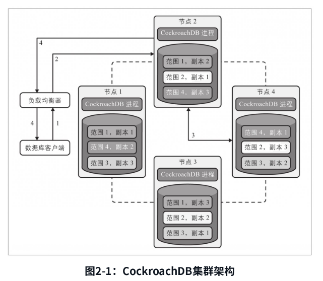
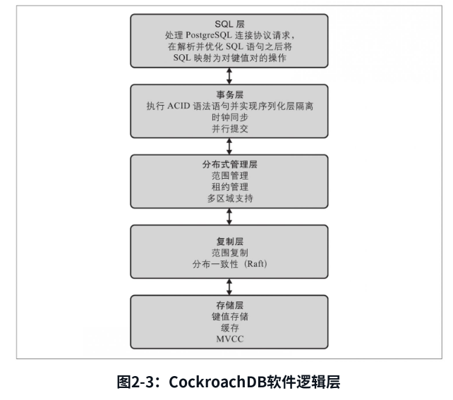
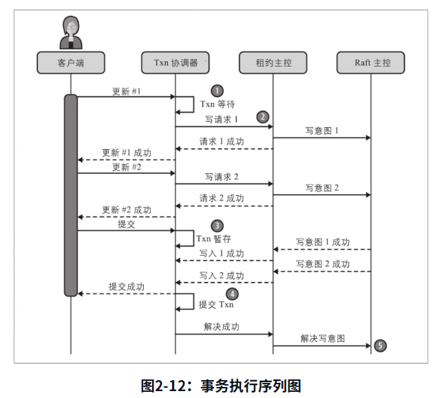
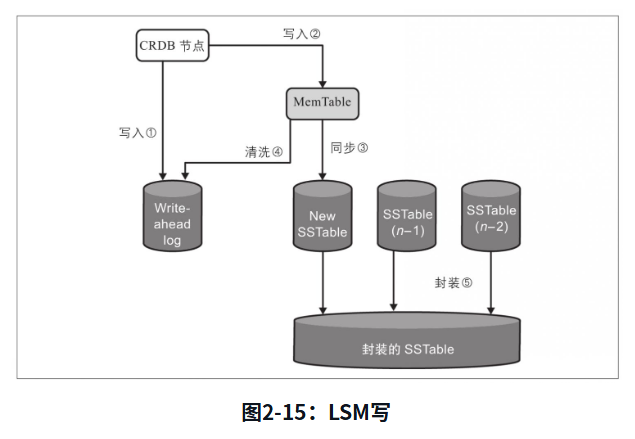
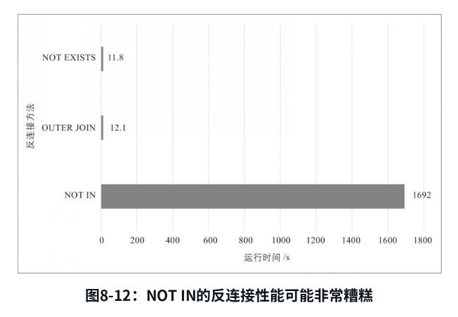
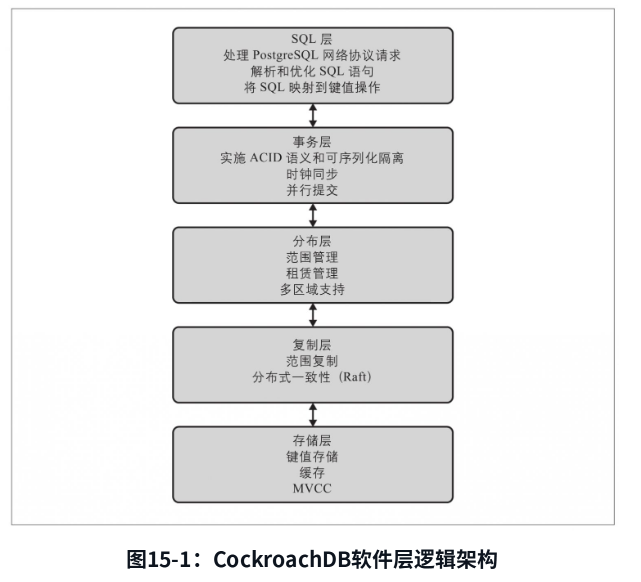

NewSQL目前一般说的都是天然分布式的, 满足关系型的数据库

比如: google spanner, TiDB, CockroachDB

## CockroachDB

### 基础概念/架构设计

**集群架构**

{width="5.772222222222222in" height="5.0248053368328955in"}

**软件栈/逻辑层级图**

{width="5.772222222222222in" height="5.106888670166229in"}

#### SQL层

sql语句处理优化的两个阶段 **扩展** 和 **排序**

newsql为何都是sql转kv存储; 暂时没有解释(后续看看)

列族 基准表是啥

写意图:

租约主控负责写入的临时数据值变更称为写意图(write intent)

#### 事务层

事务记录的状态:

-   挂起

-   转储

-   提交

-   取消

并行提交的优化应该是在3的时候, 减少了直接调用提交, 而是等待写入成功, 减少了一轮网络请求, 但最后还是会有一次提交的

{width="5.772222222222222in" height="5.23842738407699in"}

**同步时钟**

spanner的同步时钟靠原子钟和GPS的true time api解决, 最终会有7ms的偏差, 所以事务都会7ms休眠时间保证时钟准确

但是cockroach没有这种设备, 只是通过NTP来实现同步, 但是NTP的偏差范围是500ms, 这超出单个事务的容忍时间

所以在读操作的做了专门的优化

spanner都是等待写后读, cockroach是会重试读取; 前者保持强一致性, 后者是强还是因果暂时不清楚

#### 分布式管理层

元数据/易失消息的共享使用gossip协议

范围保持大小: \<512MB

#### 复制层

数据副本/数据复制相关逻辑的层级

数据复制是使用raft的? 而分布式管理层的易失消息却是用的gossip

数据复制的常用高可用参考设计:

-   被动活跃: 一个主节点是活跃节点, 数据变更同步到其他被动节点上(主从)

-   主动活跃: 所有节点同时运行, 节点间保证最终一致性(多主, 无主)

cockroach是分布式认同的机制, 多活机制; 类似主动活跃(竟然不是主从)

那么会有写冲突的问题(不过可以通过同步时钟来解决)

**已关闭时间戳和跟随读请求**

#### 存储层

cockroach底层因为还是转KV, 最后也是LSM树存储

使用的是pebbleDB, tidb则是用的rocksDB

{width="5.772222222222222in" height="3.990559930008749in"}

竟然是memtable分裂WAL, 而不是写入请求分裂(当然可能只是图展示, 具体看下实现)

### 应用

#### 模式设计

#### 应用设计

{width="5.772222222222222in" height="4.0016021434820646in"}

### 运维

{width="5.772222222222222in" height="5.240925196850394in"}

灭火定位
