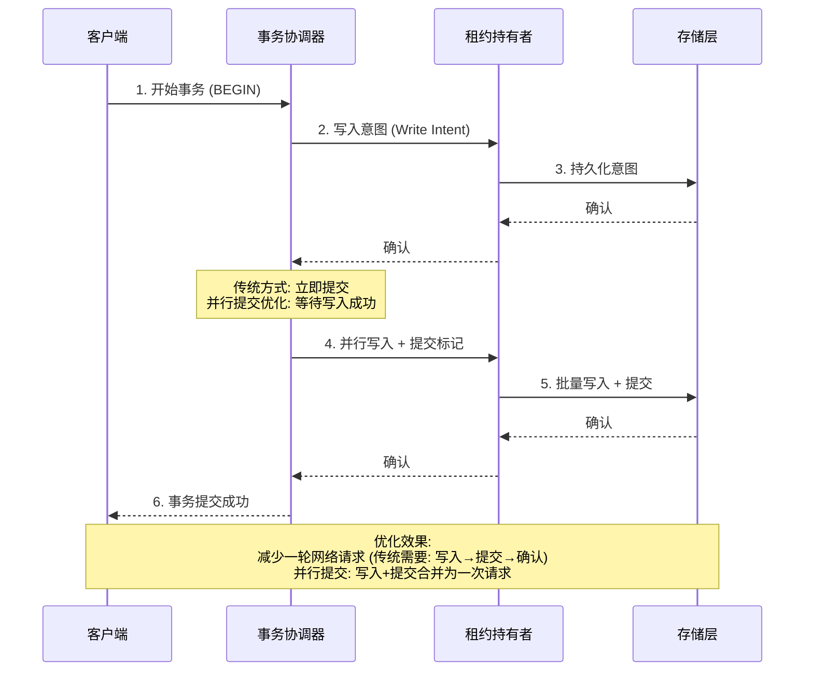

NewSQL目前一般说的都是天然分布式的, 满足关系型的数据库

比如: google spanner, TiDB, CockroachDB

## CockroachDB

### 基础概念/架构设计

**集群架构**

<!-- 原图片: image1.png - CockroachDB集群架构图 -->
<!-- 已转换为字符画 -->

```
┌─────────────────────────────────────────────────────────────────┐
│                        数据库客户端                              │
│                          (应用层)                               │
└─────────────────────────────┬───────────────────────────────────┘
                              │ 1. 发送请求
                              ▼
┌─────────────────────────────────────────────────────────────────┐
│                        负载均衡器 (LB)                          │
│                    接收请求，分发到节点                           │
└─────────────────────────────┬───────────────────────────────────┘
                              │ 2. 路由到节点
                              ▼
┌─────────────────────────────────────────────────────────────────┐
│                     CockroachDB 分布式集群                       │
│  ┌─────────┐      ┌─────────┐      ┌─────────┐      ┌─────────┐│
│  │  节点1  │◄────►│  节点2  │◄────►│  节点3  │◄────►│  节点4  ││
│  │ ┌─────┐ │      │ ┌─────┐ │      │ ┌─────┐ │      │ ┌─────┐ ││
│  │ │范围1│ │      │ │范围1│ │      │ │范围1│ │      │ │范围4│ ││
│  │ │副本1│ │      │ │副本2│ │      │ │副本3│ │      │ │副本1│ ││
│  │ │范围4│ │      │ │范围2│ │      │ │范围2│ │      │ │范围2│ ││
│  │ │副本2│ │      │ │副本1│ │      │ │副本2│ │      │ │副本3│ ││
│  │ │范围3│ │      │ │范围4│ │      │ │范围3│ │      │ │范围3│ ││
│  │ │副本3│ │      │ │副本3│ │      │ │副本1│ │      │ │副本2│ ││
│  │ └─────┘ │      │ └─────┘ │      │ └─────┘ │      │ └─────┘ ││
│  │Cockroach│      │Cockroach│      │Cockroach│      │Cockroach││
│  │DB 进程  │◄────►│DB 进程  │◄──3──►│DB 进程  │      │DB 进程  ││
│  └─────────┘      └─────────┘      └─────────┘      └─────────┘│
│       ▲                  ▲                  ▲                  │
│       └──────────────────┴──────────────────┘                   │
│                   (Raft 共识通信/副本同步)                        │
└─────────────────────────────────────────────────────────────────┘

图2-1：CockroachDB集群架构

数据分布示例:
• 范围1: 副本1(节点1), 副本2(节点2), 副本3(节点3)
• 范围2: 副本1(节点2), 副本2(节点3), 副本3(节点4)
• 范围3: 副本1(节点3), 副本2(节点4), 副本3(节点1)
• 范围4: 副本1(节点4), 副本2(节点1), 副本3(节点2)
```

**软件栈/逻辑层级图**

<!-- 原图片: image2.png - CockroachDB软件逻辑层 -->
<!-- 已转换为字符画 -->

```
┌─────────────────────────────────────────────────────────────────┐
│                          SQL 层                                 │
│  • 处理 PostgreSQL 连接协议请求                                 │
│  • 解析并优化 SQL 语句                                          │
│  • 将 SQL 映射为对键值对的操作                                   │
└─────────────────────────────┬───────────────────────────────────┘
                              │
                              ▼
┌─────────────────────────────────────────────────────────────────┐
│                         事务层                                  │
│  • 执行 ACID 语法语句并实现序列化层隔离                           │
│  • 时钟同步                                                     │
│  • 并行提交                                                     │
└─────────────────────────────┬───────────────────────────────────┘
                              │
                              ▼
┌─────────────────────────────────────────────────────────────────┐
│                       分布式管理层                               │
│  • 范围管理                                                     │
│  • 租约管理                                                     │
│  • 多区域支持                                                   │
└─────────────────────────────┬───────────────────────────────────┘
                              │
                              ▼
┌─────────────────────────────────────────────────────────────────┐
│                         复制层                                  │
│  • 范围复制                                                     │
│  • 分布一致性（Raft）                                           │
└─────────────────────────────┬───────────────────────────────────┘
                              │
                              ▼
┌─────────────────────────────────────────────────────────────────┐
│                         存储层                                  │
│  • 键值存储                                                     │
│  • 缓存                                                         │
│  • MVCC（多版本并发控制）                                        │
└─────────────────────────────────────────────────────────────────┘

图2-3：CockroachDB软件逻辑层
```

#### SQL层

sql语句处理优化的两个阶段 **扩展** 和 **排序**

newsql为何都是sql转kv存储; 暂时没有解释(后续看看)

列族 基准表是啥

写意图:

租约主控负责写入的临时数据值变更称为写意图(write intent)

#### 事务层

事务记录的状态:

-   挂起

-   转储

-   提交

-   取消

并行提交的优化应该是在3的时候, 减少了直接调用提交, 而是等待写入成功, 减少了一轮网络请求, 但最后还是会有一次提交的

<!-- 原图片: image3.png - CockroachDB并行提交事务时序图 -->
<!-- 已转换为Mermaid时序图 -->

**CockroachDB 并行提交事务流程** (Mermaid时序图):



**传统提交 vs 并行提交对比**:

```
传统两阶段提交:                    并行提交优化:
┌─────────┐                      ┌─────────┐
│  写入   │ ──→ 确认              │ 写入+提交 │ ──→ 确认
└────┬────┘                      └────┬────┘
     │                               │
     ▼                               │
┌─────────┐                          │
│  提交   │ ──→ 确认                 │
└────┬────┘                          │
     │                               │
     ▼                               ▼
┌─────────┐                      ┌─────────┐
│  完成   │                      │  完成   │
└─────────┘                      └─────────┘

网络往返次数: 4次                  网络往返次数: 2次
```

**同步时钟**

spanner的同步时钟靠原子钟和GPS的true time api解决, 最终会有7ms的偏差, 所以事务都会7ms休眠时间保证时钟准确

但是cockroach没有这种设备, 只是通过NTP来实现同步, 但是NTP的偏差范围是500ms, 这超出单个事务的容忍时间

所以在读操作的做了专门的优化

spanner都是等待写后读, cockroach是会重试读取; 前者保持强一致性, 后者是强还是因果暂时不清楚

#### 分布式管理层

元数据/易失消息的共享使用gossip协议

范围保持大小: \<512MB

#### 复制层

数据副本/数据复制相关逻辑的层级

数据复制是使用raft的? 而分布式管理层的易失消息却是用的gossip

数据复制的常用高可用参考设计:

-   被动活跃: 一个主节点是活跃节点, 数据变更同步到其他被动节点上(主从)

-   主动活跃: 所有节点同时运行, 节点间保证最终一致性(多主, 无主)

cockroach是分布式认同的机制, 多活机制; 类似主动活跃(竟然不是主从)

那么会有写冲突的问题(不过可以通过同步时钟来解决)

**已关闭时间戳和跟随读请求**

#### 存储层

cockroach底层因为还是转KV, 最后也是LSM树存储

使用的是pebbleDB, tidb则是用的rocksDB

<!-- 原图片: image4.png - LSM树写入流程图 -->
<!-- 已转换为字符画 -->

```
                    ┌─────────┐
                    │ CRDB节点 │
                    └────┬────┘
           ┌───────────┼───────────┐
           │ 写入①     │ 写入②     │
           ↓           ↓           │
      ┌─────────┐   ┌─────────┐    │
      │Write-   │   │MemTable │◄───┘
      │ahead log│   │(内存表) │
      │(WAL)    │   └────┬────┘
      └─────────┘   清洗④│
                         ↓ 同步③
                    ┌─────────┐
                    │New      │
                    │SSTable  │
                    └────┬────┘
                         │
    ┌─────────┐   ┌─────┴─────┐   ┌─────────┐
    │SSTable  │   │           │   │SSTable  │
    │  (n-1)  ├───┤  封装的   ├───┤  (n-2)  │
    └─────────┘   │  SSTable  │   └─────────┘
                  │ (合并后)   │
                  └───────────┘
                       ▲
                       └── 封装⑤ (压缩合并)

流程说明:
① 先写WAL日志(保证持久性)
② 同时写入MemTable(快速写入)
③ MemTable满后刷盘为New SSTable
④ 后台清洗MemTable
⑤ 多个SSTable通过Compaction合并压缩
```

竟然是memtable分裂WAL, 而不是写入请求分裂(当然可能只是图展示, 具体看下实现)

### 应用

#### 模式设计

#### 应用设计

<!-- 原图片: image5.png - NOT IN反连接性能对比图 -->
<!-- 已转换为字符画 -->

```
反连接方法性能对比（运行时间/秒）
═══════════════════════════════════════════════════════════════════

NOT EXISTS  │██ 11.8 秒
            │
OUTER JOIN  │██ 12.1 秒
            │
NOT IN      │███████████████████████████████████████████████████████ 1692 秒
            │
0           └────────────────────────────────────────────────────────►
            0s          500s         1000s         1500s         1800s

结论: NOT IN 的反连接性能非常糟糕
• NOT IN 比 NOT EXISTS 慢约 143 倍 (1692÷11.8)
• NOT IN 比 OUTER JOIN 慢约 140 倍 (1692÷12.1)
• 建议: 避免使用 NOT IN，改用 NOT EXISTS 或 OUTER JOIN

图8-12：NOT IN的反连接性能可能非常糟糕
```

### 运维

<!-- 原图片: image6.png - CockroachDB软件层逻辑架构图 -->
<!-- 已转换为字符画 -->

```
┌─────────────────────────────────────────────────────────────────────┐
│                              SQL 层                                 │
│  • 处理 PostgreSQL 连接协议请求                                     │
│  • 解析并优化 SQL 语句                                              │
│  • 将 SQL 映射为对键值对的操作                                       │
└─────────────────────────────────┬───────────────────────────────────┘
                                  │
                                  ▼
┌─────────────────────────────────┴───────────────────────────────────┐
│                             事务层                                  │
│  • 执行 ACID 语法语句并实现序列化层隔离                               │
│  • 时钟同步                                                         │
│  • 并行提交                                                         │
└─────────────────────────────────┬───────────────────────────────────┘
                                  │
                                  ▼
┌─────────────────────────────────┴───────────────────────────────────┐
│                           分布式管理层                               │
│  • 范围管理                                                         │
│  • 租约管理                                                         │
│  • 多区域支持                                                       │
└─────────────────────────────────┬───────────────────────────────────┘
                                  │
                                  ▼
┌─────────────────────────────────┴───────────────────────────────────┐
│                             复制层                                  │
│  • 范围复制                                                         │
│  • 分布一致性（Raft）                                               │
└─────────────────────────────────┬───────────────────────────────────┘
                                  │
                                  ▼
┌─────────────────────────────────┴───────────────────────────────────┐
│                             存储层                                  │
│  • 键值存储（基于 LSM-Tree）                                        │
│  • 缓存                                                             │
│  • MVCC（多版本并发控制）                                            │
└─────────────────────────────────────────────────────────────────────┘

图15-1：CockroachDB软件层逻辑架构
```

灭火定位
