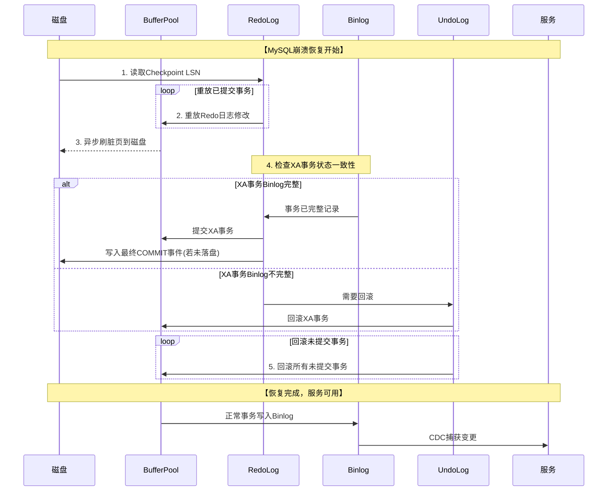
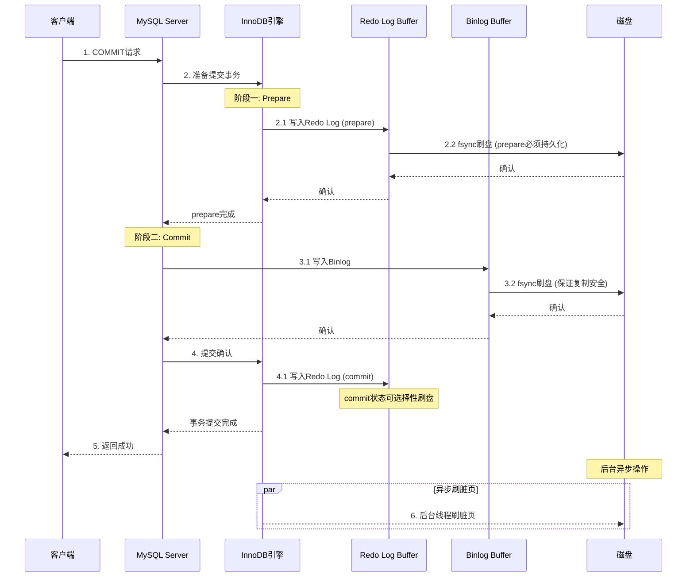

# DK百科不全书-关系型数据库

## 存储

### 大对象存储(单行数据非常大)

> 上面说了PG是通过TOAST, 行内存储指针, 行外存储具体数据.
>
> Mysql旧的非dynamic格式
>
> 行溢出存储, 超长字段是存前缀768字节+20字节的指针, 指针指向专门存储的溢出页
>
> dynamic格式
>
> 只存20字节的指针, 大字段所有数据存在溢出页

### mysql innodb 文件/缓冲区结构

<!-- 原图片: image1.png - MySQL InnoDB I/O架构图 -->
<!-- 已转换为字符画 -->

```
┌─────────────────────────────────────────────────────────────────┐
│  【内存层】                                                      │
│   ┌─────────┐      事务日志写入      ┌─────────┐               │
│   │  缓冲池  │  ──────────────────→ │ 日志缓冲区│               │
│   │(Buffer) │                      │(Log Buf)│               │
│   └────┬────┘                      └────┬────┘               │
└────────┼────────────────────────────────┼───────────────────────┘
         │                                │
┌────────┴────────────────────────────────┴───────────────────────┐
│  【InnoDB I/O 线程层】                                           │
│   ┌────────┐    ┌────────┐    ┌────────┐                      │
│   │写入线程│    │读取线程│    │日志线程│                      │
│   │(Writer)│    │(Reader)│    │(Logger)│                      │
│   └────┬───┘    └────┬───┘    └────┬───┘                      │
└────────┼─────────────┼─────────────┼────────────────────────────┘
         │             │             │
┌────────┴─────────────┴─────────────┴────────────────────────────┐
│  【操作系统缓存层】  ←  操作系统缓存 (OS Cache)                   │
└─────────────────────────────────────────────────────────────────┘
         │             │             │
┌────────┴─────────────┴─────────────┴────────────────────────────┐
│  【文件系统层】                                                  │
│   ┌─────────────────┐      ┌─────────────────┐                  │
│   │     表空间       │      │   循环顺序写入   │                  │
│   │  ┌───────────┐  │  ←───┤                 │                  │
│   │  │双写缓冲区 │  │      │   ┌─────────┐   │                  │
│   │  │(DoubleWrt)│  │      │   │ 事务日志 │   │                  │
│   │  └───────────┘  │      │   │(RedoLog)│   │                  │
│   │  ┌───────────┐  │      │   └─────────┘   │                  │
│   │  │数据、索引 │  │      └─────────────────┘                  │
│   │  │Undo日志等 │  │                                          │
│   │  └───────────┘  │                                          │
│   └─────────────────┘                                          │
└─────────────────────────────────────────────────────────────────┘

数据流向:
• 读路径: 数据文件 → OS缓存 → 读取线程 → 缓冲池
• 写路径: 缓冲池 → 写入线程 → 双写缓冲区 → 数据文件
• 日志路径: 缓冲池 → 日志缓冲区 → 日志线程 → 事务日志文件
```

#### PGSQL的存储结构和索引

pgsql不是**索引组织表**(Index-organized table), 而是**堆表**（Heap-Organized Table）

表原始数据都是按堆存储, 由多个页组成, 页存有**行指针数组**和**元组**(行数据); 每次读取按(page, row)进行查找

针对大对象的行, 有TOAST方案, 就是通过行外存储, 行内存大对象的指针

如果是有声明主键/唯一索引, 会自动创建B树索引

因为扫表是直接扫堆, 索引不需要专门使用B+树进行优化, 而且存储的值堆表的定位指针, 所以大小很小, 不会影响树高

pgsql是**可扩展的索引系统**, 可选索引:

1.  B树: 点查, 范围查

2.  Hash: 点查

3.  GiST

4.  SP-GiST

5.  GIN(倒排索引)

6.  BRIN(块范围索引)

Bloom(布隆过滤器)

## 索引

### 索引失效问题

<!-- 原图片: image2.png - 索引优化建议表 -->
<!-- 已转换为Markdown表格 -->

| 场景 | 优化策略 |
|:---|:---|
| 联合索引失效 | 确保查询条件包含最左字段 |
| 隐式类型转换 | 保持查询值与字段类型一致 |
| 函数/表达式处理索引列 | 改写查询避免计算 |
| LIKE 左模糊匹配 | 改用右模糊匹配或全文索引 |
| OR 条件导致失效 | 使用 UNION 或为所有字段建索引 |
| 覆盖索引未命中 | 仅查询必要字段 |

*表: 总结与优化建议*

### MYSQL索引的数据结构

为什么使用B+树, 优势在哪

1.  叶子节点前后链表指针, 方便遍历

2.  数据集中在叶子节点, B+树节点对应缓存的单位, 做到缓存亲和

3.  非叶子节点只存索引值, 更多索引值代表更多

4.  虽然B+树稳定查询需要logN, B树是1-logN; 但是树高等问题会有少许影响(不多)

5.  范围查询优势, 找到起点后,可以直接链表扫描; B树需要多次回溯查找索引

B+树劣势:

1.  索引值冗余

2.  维护链表关系, 单索引结构内就有类似写放大的问题

#### 索引的选择性

背景: 为了提升索引性能, 将字段前缀的部分作为索引值.

索引的选择性是指，不重复的索引值（也称为基数，cardinality）和数据表的记录总数(＃T)的比值，范围从1/＃T到1之间, 选择性越高则查询效率越高

需要通过不同长度的前缀的频率进行判断

#### 索引合并策略

功能: 将多个单列索引进行组合

背景: 我们都知道都是条件and才会按最左匹配(优化可能重排, 也先不考虑)命中联合索引, 但如果只有单列的索引, 就会按最左匹配到单列索引, 后续条件不会命中;

这个算法有三个情况:

1.  OR条件的结果集取并集

2.  AND条件的结果集取交集

3.  结合1,2的条件

在优化器里进行实现

#### 索引和数据的碎片

行碎片: 数据行存在多个地方的多个片段, 更多的随机访问

行间碎片: 逻辑上顺序的页/行, 在磁盘存储不是顺序存储的

剩余空间碎片: 很多页内剩余大量空间没被利用

### 索引创建技巧

#### 索引列顺序

等值条件最优先

排序条件列

范围条件列

## 性能优化

索引优化主要在索引中

### 慢查询-数据优化

select是否检索了大量不必要的列数据

计算是否引入的无用的列数据

不更新的相同的常量数据, 可以利用缓存

### 慢查询-扫描大量数据

-   使用索引覆盖扫描

-   库表结构变化, 重新整理数据, 精简列

-   重写查询(关注是否复杂结构查询, 子查询, 联表等)

JoIn联表, 8.0后将哈希联接替换 嵌套循环联接

#### 排序优化

mysql没有使用索引的排序结果时(没有命中索引覆盖), 会进行文件排序(filesort)(文件排序不一定用到磁盘, 量小时是全内存的, 只是这么叫)

排序算法:

1.  两次传输排序(旧版本)

2.  单词传输排序(新)

## 分区/复制

### 分实例分库分表(sharding/partition)

分片分区内容看一致性里内容

因为partition还是同一个物理表, 所以做不到分离

切分的时机:

机械硬盘: 约1000万-2000万记录

SSD: \>5000万记录

分表后查询分页问题

1.  查所有分表, 内存中做分页 (慢, 耗资源大, 应该没人会这么做)

2.  禁止随机访问,只可以顺序访问, offset可控, 也可以利用最后数据进行条件排序分页, 每次可以访问N页大小, 返回作为前端缓存

3.  额外维护记录大小缓存(如果多查询条件的话失效, 无法展示所有页), 也可以先展示最新表的总大小, 后续到表临界区, 再进行重新更新, 临界区时需要二次请求查询

4.  直接切换引擎, es等着你

#### 复制步骤

1.  源端记录biglog(写DML, DDL)

2.  replica读源端binlog, 复制到自己的中继日志

3.  replica读取中继日志, 重放在本地

binlog三种格式

基于语句: 会有某些不确定性的SQL(比如非明确条件, 而是排序等根据当时数据状态的SQL)

基于行: 如果记录很大那么biglog大小会很夸张

mix混合模式: 前两者结合

## 事务

### 宕机后redolog在不同阶段恢复后, 如何改写缓存,刷新磁盘和处理CDC

**binlog的写入方式和写入顺序:**

1\. binlog是在**事务提交**时写入的（在 redo log commit 之后, **注意**是事务的commit, 不是2PC的commit）

2\. 每个事务对应一个binlog事件组（**不是每条 SQL 单独写**）

3\. 写入顺序：redo log prepare→ binlog write→ redo log commit(这里的commit是事务commit里2PC的阶段) (顺序是**保证同步, 严格串行**的)

<!-- 原图片: image3.png - MySQL两阶段提交流程图 -->
<!-- 已转换为字符画 -->

```
┌─────────────┐    ┌─────────────┐    ┌─────────────┐    ┌─────────────┐
│ Transaction │    │  Redo Log   │    │   Binlog    │    │    Disk     │
└──────┬──────┘    └──────┬──────┘    └──────┬──────┘    └──────┬──────┘
       │                  │                  │                  │
       │ 1.写入redo log   │                  │                  │
       │   (prepare状态)  │                  │                  │
       │─────────────────>│                  │                  │
       │                  │                  │                  │
       │                  │  fsync redo log  │                  │
       │                  │     (刷盘)       │                  │
       │                  │─────────────────────────────────────>│
       │                  │                  │                  │
       │     2.写入binlog │                  │                  │
       │─────────────────────────────────────>│                  │
       │                  │                  │                  │
       │                  │                  │  fsync binlog    │
       │                  │                  │    (刷盘)        │
       │                  │                  │─────────────────>│
       │                  │                  │                  │
       │ 3.写入redo log   │                  │                  │
       │   (commit状态)   │                  │                  │
       │─────────────────>│                  │                  │
       │                  │                  │                  │
       │                  │ (可选刷盘)       │                  │
       │                  │─────────────────────────────────────>│

核心: 两阶段提交保证 redo log 与 binlog 一致性
• Prepare阶段: redo log写入并刷盘
• Commit阶段: binlog刷盘后, redo log标记commit
```

核心规则: **重放所有已提交的事务修改 + 回滚未提交的事务修改**

1.  事务未提交(状态\[事务: 未提交, redolog:未提交, binlog:未写, buffer pool:已写, 磁盘:未写\])

2.  刚提交事务后宕机, 已提交redolog prepare(状态\[事务: 提交, redolog:prepare未落盘, binlog:未写, buffer pool:已写, 磁盘:未写\])

3.  binlog未刷盘, 已提交事务(状态\[事务: 提交, redolog: prepare, binlog:未写, buffer pool:已写, 磁盘:未写\])

4.  已写binlog, 未提交redolog commit(状态\[事务: 提交, redolog:commit, binlog:已写, buffer pool:已写, 磁盘:未写\])

1,2,3都是回滚

4继续提交

恢复时序

<!-- 原图片: image4.png - MySQL崩溃恢复时序图 -->
<!-- 已转换为Mermaid时序图 -->

**MySQL崩溃恢复流程** (Mermaid时序图):



**崩溃恢复核心逻辑**:
```
┌─────────────────────────────────────────────────────────────┐
│                    MySQL崩溃恢复流程                          │
├─────────────────────────────────────────────────────────────┤
│ 1. 定位恢复点: 读取Checkpoint LSN                            │
│ 2. 前滚(Redo): 重放所有已提交事务的修改                       │
│ 3. 一致性检查: 对比Binlog和RedoLog的XA事务状态                │
│    ├─ Binlog完整 → 提交事务                                  │
│    └─ Binlog不完整 → 回滚事务                                │
│ 4. 回滚(Undo): 撤销所有未提交事务                            │
│ 5. 恢复完成: 服务可用，开始接受新请求                        │
└─────────────────────────────────────────────────────────────┘
```

写时序

<!-- 原图片: image5.png - MySQL事务写入时序图 -->
<!-- 已转换为Mermaid时序图 -->

**MySQL事务写入流程** (Mermaid时序图):



**两阶段提交(2PC)核心逻辑**:
```
┌────────────────────────────────────────────────────────────────┐
│                    MySQL事务两阶段提交                          │
├────────────────────────────────────────────────────────────────┤
│                                                                │
│  【Prepare阶段】                                                │
│   1. InnoDB写入Redo Log (prepare状态)                          │
│   2. 强制刷盘Redo Log (必须持久化)                             │
│   3. 返回prepare成功                                           │
│                                                                │
│  【Commit阶段】                                                 │
│   4. Server写入Binlog                                          │
│   5. 强制刷盘Binlog (保证复制不丢失)                           │
│   6. InnoDB写入Redo Log (commit状态)                           │
│   7. 返回客户端成功                                            │
│                                                                │
│  【后台异步】                                                   │
│   8. 脏页异步刷盘 (不影响事务响应)                             │
│                                                                │
├────────────────────────────────────────────────────────────────┤
│ 关键设计: Binlog作为协调者，保证Redo和Binlog一致性              │
│ 崩溃恢复: 检查Binlog完整性决定提交或回滚                        │
└────────────────────────────────────────────────────────────────┘
```

### ACID隔离级别

题外话: 严格来说一致性是应用层保证的. server层而不是存储引擎层, 为了顺口加进来的.

四个隔离级别:

1.  **读未提交**

实现方式: 几乎无隔离, 直接读取行数据

脏读/脏写, 其他事务未提交修改的数据, 也被会读取.

2.  **读提交**

实现方式:

脏写避免: **行锁,** 写时持有锁可以防止脏写问题, 但是脏读无法使用读锁解决, 因为会严重影响性能

脏读避免: 维持旧值和持锁事务的新值两个版本(**快照**)

引入不可重复读问题, 事务A中有多次读取, 事务执行期间, 有其他事务修改查询值, 导致事务中两次读取数据不一致

3.  **可重复读**

实现方式: **快照级别隔离**

如果是读提交只需要对不同的查询单独创建一个快照, 就是上文解决脏读的办法

**快照级别隔离**是使用**一个**快照运行**整个**事务

pgsql的实现: 生成一个**唯一的,单调递增的事务ID**; 所有写数据都会带上事务ID(用于回滚数据的对比)

所有**创建**和**删除**都会记录事务ID, 更新操作会转换为删除+创建

控制**可见性**规则

1.  事务开始时, 列出所有进行中的事务(**未提交/中止**), 这部分的都为不可见

2.  所有中止的事务修改为不可见

3.  大于当前事务ID的修改(更晚)都为不可见, 即便是提交状态

4.  除了上面3条以外的都是可见的

会有**幻读**的风险; 可以通过间隙锁进行规避. 后续再详述

4.  **可串行化**

最同步的, 最符合标准的, 但因为响应性能问题, 之前都不会选用; 在OLTP场景发现, 事务的操作非常简短, 可串行化执行逐渐变得可考虑

**实现方式**:

1.  单工作线程

2.  两阶段加锁(2PL)

不同锁种类:

防止幻读-**谓词锁**(字段/属性维度)性能不行

索引区间锁(next key lock): 大多使用的实现, 就是行锁+间隙锁的组合

3.  可串行化的快照隔离(SSI)

> **基于过期的条件做决定**: 乐观并发锁的中止条件判断

1)  读取是否作用于一个即将/已过期的MVCC对象 (我的读是否被其他提交过了, 检查其他人)

2)  写入是否影响即将完成的读取 (我的写是否影响其他, 通知其他人)

#### 索引和快照级别隔离实现

**TODO: 具体数据库选用实现需要补充**

快照级别隔离实现支持索引的方法目前有两种

1.  索引直接指向对象所有版本, 然后通过可见性规则过滤

2.  依赖B树的追加/写时复制技术

> 在需要更新时, 不会修改现有页面(buffer-page), 而是创建一个新的修改副本
>
> 每个写入的事务, 都会创建一个新的b树的root, 后续都在新复制快照做修改

#### 不同数据库的隔离级别

**mysql-innodb**

默认是**可重复读**

read view 实现可重复读

next key lock 实现脏读预防

read view实现

5.6是首次select创建快照

8.0后是创建事务时立马创建

利用全局唯一的事务ID和undo log实现版本链上的回滚

下面是next key lock的加锁方式

<!-- 原图片: image6.png - 索引类型与加锁方式对照表 -->
<!-- 已转换为Markdown表格 -->

| 索引类型 | 加锁方式 | 示例（查询 id=10） |
|:---|:---|:---|
| 唯一索引 | 仅加行锁（Record Lock） | 锁定 id=10 单行 |
| 非唯一索引 | 加 Next-Key Lock（行锁 + 间隙锁） | 锁定（前值，10]+（10，后值） |
| 无索引 | 锁全表（所有间隙 + 所有行） | 退化升级为表级锁 |

可串行化是可选的; 不过mysql的实现是**2PL**; 共享/排他锁(行锁, 间隙锁不断升级)

<!-- 原图片: image7.png - 不同场景下的锁行为对比表 -->
<!-- 已转换为Markdown表格 -->

| 操作类型 | 锁类型 | 锁定范围示例（假设数据 id: 5,10,15） |
|:---|:---|:---|
| 等值查询（唯一索引） | 行锁（Record Lock） | 仅锁定 id=10 的行 |
| 等值查询（非唯一索引） | 临键锁（Next-Key Lock） | 锁定区间 (5,10] + (10,15) |
| 范围查询（任何索引） | 临键锁（Next-Key Lock） | 如 WHERE id>5 → 锁定 (5,10], (10,15], (15,+∞) |
| 无索引查询 | 表级锁（所有行 + 所有间隙） | 锁定全表 |

**postgre sql**

9.1版本后支持可串行化

默认级别是**读已提交**

可串行化的实现是**SSI**, 在SI的基础上增加了冲突检测

**冲突依赖图**

跟踪读写依赖

rw-dependency (读后写):事务A读数据-\>事务B写该数据

wr-dependency (写后读):事务A写数据-\>事务B读该数据

ww-dependency (写后写):事务A写数据-\>事务B写该数据

冲突图构建: 以事务为结点构造DAG

环检测: 有环出现说明违反规则, 回滚事务
