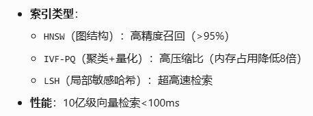
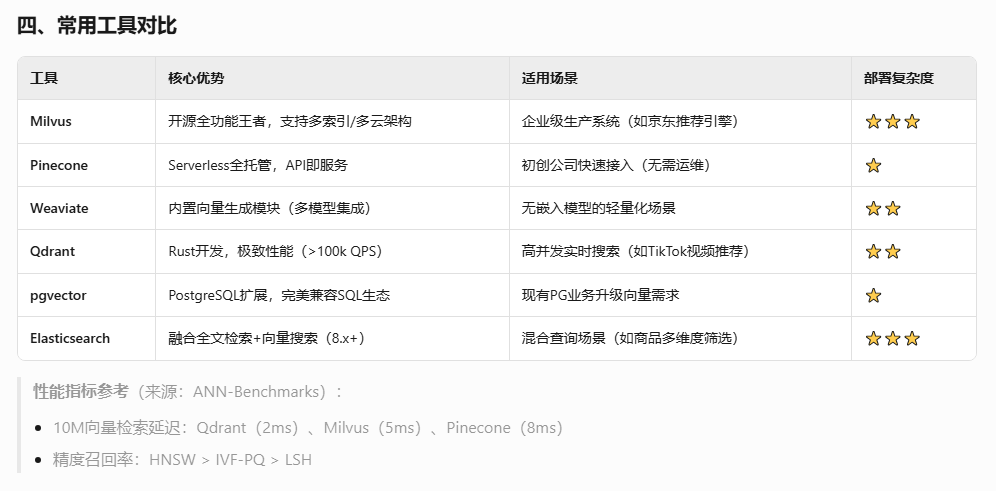
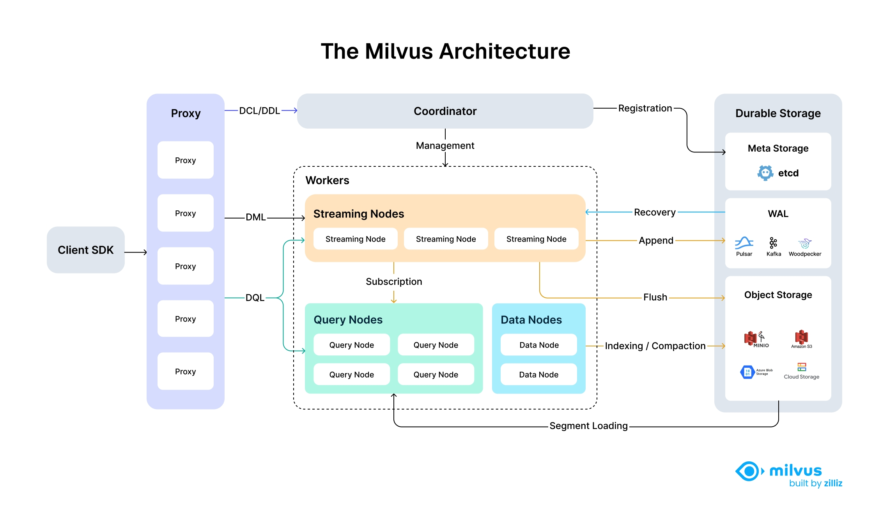

## 通用

### 常见数据库

{width="4.770833333333333in" height="1.7708333333333333in"}

{width="5.772222222222222in" height="2.845543525809274in"}

### 索引结构

**基础:**

1.  Flat Index 全量索引

暴力搜索, 所有向量逐个对比(对比方法比如计算余弦相似度); 100%精度, 但性能慢, 小量级可以

2.  近似最近邻(ANN)

    a.  HNSW(Hierarchical Navigable Small World) 分层可导航小世界图: 多个分层, 查询时从顶到底导航, 顶层稀疏, 底层稠密

    b.  IVF(Inverted File Index) 倒排文件索引: Kmeans聚类, 向量分类后, 只在最近蔟搜索

    c.  PQ(Product Quantization) 产品量化/乘积量化:

    d.  ANNOY(spotify的)

**高级:**

1.  层次化索引: 多层次分层; 适用大规模文档库

2.  图索引: 以知识图谱存储实体关系; 复杂语义, 多跳遍历推理

3.  融合索引: 多种结合(如: IVF+)

**选取方案:**

中小规模+高精度: Flat Index 或者 HNSW

大规模+低资源: IVF / PQ

复杂语义查询: 图索引 / 层次化索引

通用场景: 融合索引(HNSW+BM25)

### 向量匹配算法

1.  基于特征

    a.  BM25

    b.  TF-IDF

    c.  jaccard相似度

2.  基于表征

    a.  词向量: word2vec, Glove

    b.  句向量: BERT, Sentence-Bert

3.  基于交互

    a.  Cross-Encoder, 利用transformer

    b.  ESIM(enhanced LSTM)

4.  近似最近邻(ANN)

    a.  HNSW

    b.  IVF-PQ

    c.  Annoy

距离度量方法

1.  余弦相似度

2.  欧氏距离

3.  内积, 点积, 点乘

4.  汉明距离

## Milvus

架构图

{width="5.772222222222222in" height="3.326622922134733in"}
