## 概念整理

##### 反爬

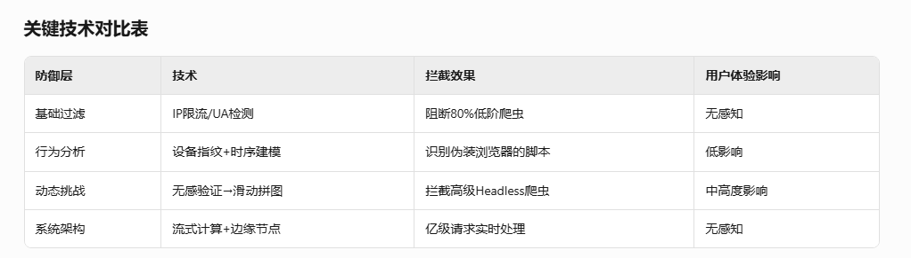{width="5.772222222222222in" height="1.643558617672791in"}

###### 感知

根据数据重要度分级各维度监控/统计, 报表, TOP数据分析

###### 低阶(工具爬取接口)

请求特征:

1.  user-agent检测

2.  ip限流/封禁; 注意dhcp刷新

3.  票据验证; 签名验证

动态渲染:

1.  js渲染

2.  重要混淆, 不展示全文(被动保护)

3.  蜜罐陷阱, 针对全扫描类型的

###### 高阶

1.  多模态设备指纹(硬件参数, 传感器, 点击行为) 如何实现?

2.  行为序列建模(行为时序,行为空间特征,环境特征)

3.  混合模型(低延时实时模型\<100ms, 高精度行为识别离线处置)

多级处置手段

默认无验证

触发风控策略后增加人机验证

##### 身份验证

<https://developer.aliyun.com/article/1584238>

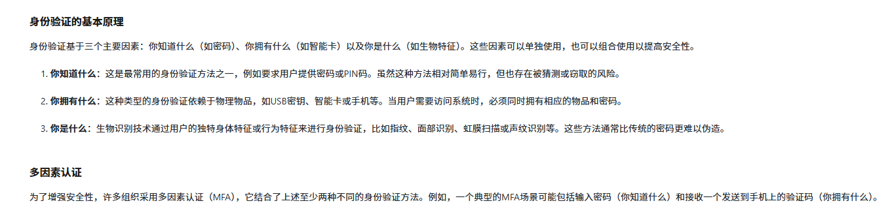{width="5.772222222222222in" height="1.4007370953630796in"}

可以参考《零信任网络》中\"用户安全\"章节, 相关U2F内容

##### hash算法

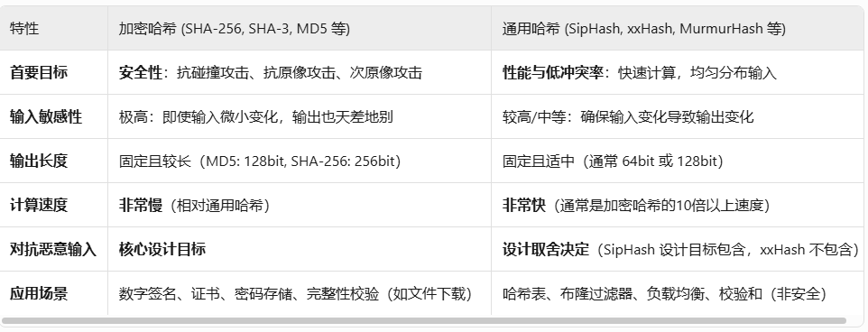{width="5.772222222222222in" height="2.208085083114611in"}

**SipHash(1-2,1-3)** redis, rust使用, 和下面相比稍慢, 防构造冲突, 防hash dos

**AES-NI** 依赖硬件, 但速度快, 安全度高

**MurmurHash** C++, 部分java, DynamoDB分区键 ; 速度快,分布均匀

**xxHash** 早期go, rust FxHash; 极端的快, 但是不抗碰撞

**DJB2** 简单, 但是碰撞率高

**CRC16/CRC32** redis的分片

##### go map使用AES-NI,而不是siphash, murmur的原因

算是在性能和安全性之间取了个中间值

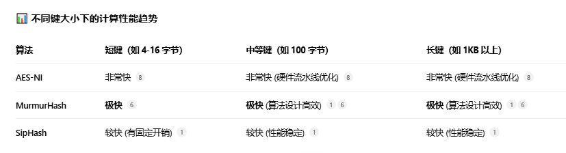{width="5.772222222222222in" height="1.5634558180227471in"}

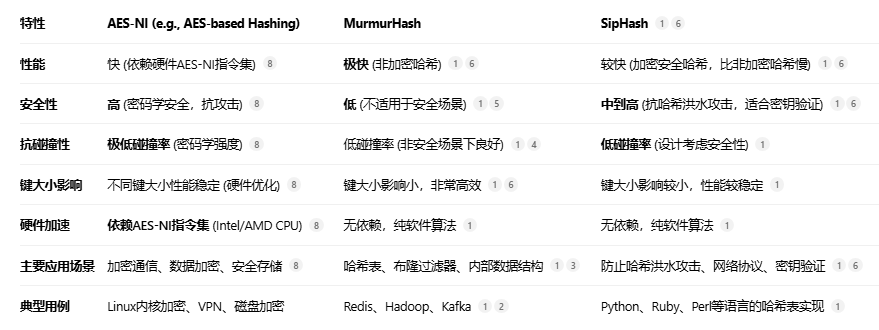{width="5.772222222222222in" height="2.1670461504811898in"}

上面表格不太对, redis的dict是用的siphash的

## 书 - 安全技术运营

### 第一章 什么是安全技术运营

#### 网络威胁简介

**恶意程序**

1.  攻击载荷

发起攻击能建立网络连接的载体, 像是攻击向量的中最前置的手段

例如: 下图的各种方式

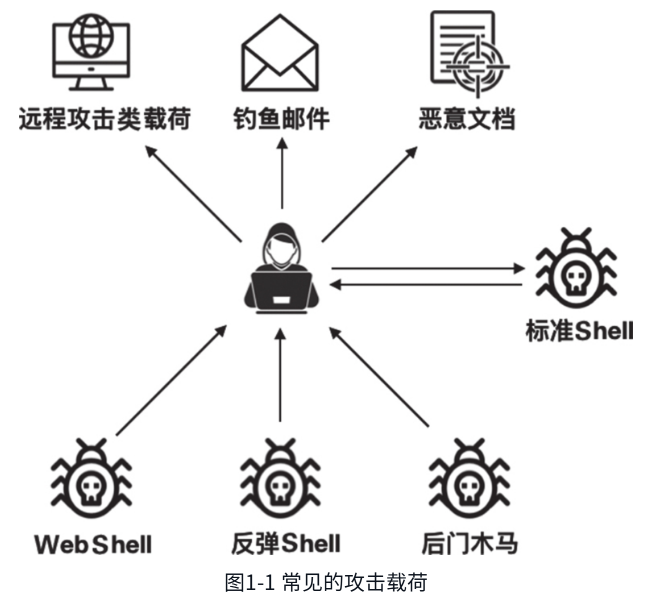{width="5.772222222222222in" height="5.43424978127734in"}

2.  木马

相比前面直接到达你服务器/PC, 通过传递木马文件, 触发攻击; 但要达到传送还是需要前者的建立吧?

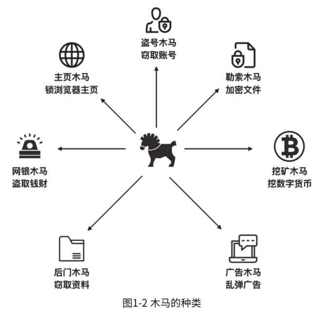{width="5.772222222222222in" height="5.532070209973753in"}

3.  蠕虫

最大特性是: 自我复制, 主动传播;

这种自主性和蔓延性很像爬虫, 一个是拉取信息, 一个传播信息

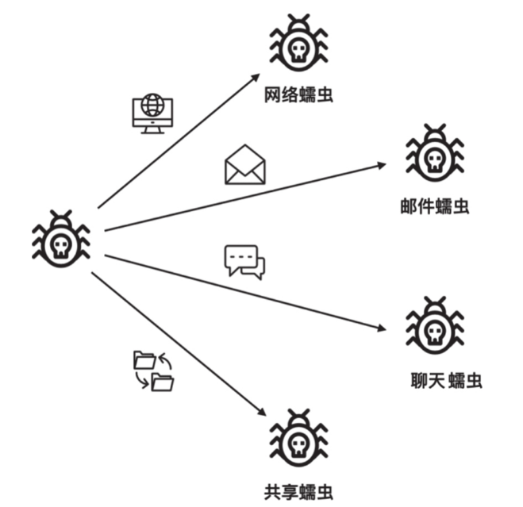{width="5.772222222222222in" height="5.597040682414698in"}

4.  感染型病毒

前面2,3都算是广义的病毒, 狭义的病毒不停留在应用/软件层次

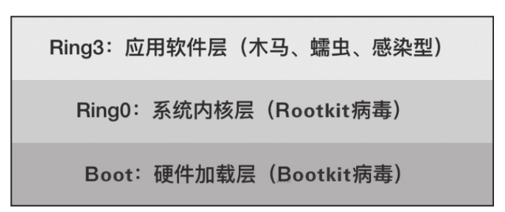{width="5.772222222222222in" height="2.431357174103237in"}

**网络攻击**

1.  僵木蠕毒攻击

2.  DDos

3.  黑客入侵

```{=html}
<!-- -->
```
1)  构建僵尸网络

2)  APT间谍破坏行动

3)  加密数据/文件敲诈

**业务安全攻击**

1.  薅羊毛: 直接获利

2.  占坑: 间接倒卖获利

3.  爬虫: 偷信息倒卖

#### 安全运营简介

**安全运营定义**

发现威胁-\>分析威胁-\>处理威胁\|共享情报

**发展阶段**

1.  样本运营阶段

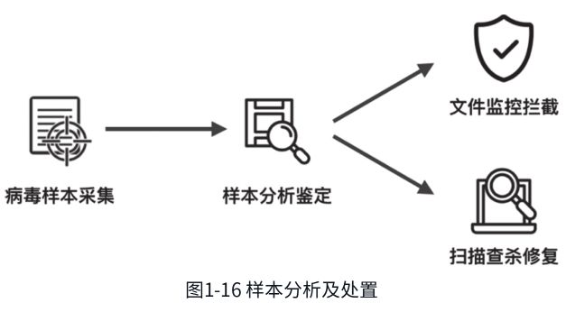{width="5.772222222222222in" height="3.1853094925634298in"}

采集作恶样本, 从具体的作恶到具体防治, 换一招就得再拆一招

依靠文件监控技术, 被动, 且滞后;

2.  行为模式识别阶段

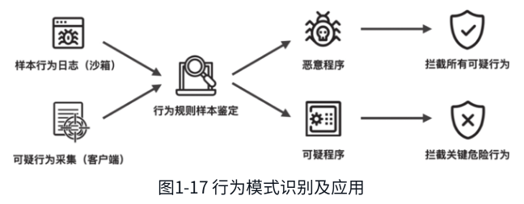{width="5.772222222222222in" height="2.2536603237095365in"}

从具体的文件到抽象的特征, 对危险行为进行拦截

被动, 时效性相对提升, 没有作恶技术里程碑突破前都有效

3.  大数据分析阶段

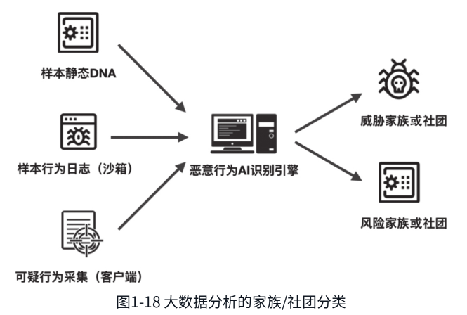{width="5.772222222222222in" height="3.8886548556430447in"}

更多的维度分析, 更快的响应

**恶意程序对抗**

1.  躲避技术

书中列举8种方式, 不赘述了, 主要是都为了隐藏自身和自身特征, 通过可见/混淆/寄生等等方式

2.  破坏技术

针对查杀工具的破坏, 使发现者瘫痪

**云查杀**

只是集中式的信息数据整合/更新, 还是正常的查找匹配手段

**大数据应用**

感知的发展阶段

1.  用户反馈: 滞后且影响面大

2.  规则探知: 容易被对抗绕过

3.  大数据挖掘: 其实还是有很多扩展方向, 提高识别速度和广度
