# 书 - Eric Evans 领域驱动设计

## 第一部分 运用领域模型

### 第一章 消化知识

DDD需要\[某领域专家\]-\[架构师/模型设计\]-\[开发\]

但不同于以前的先建模,再开发;

依旧符合敏捷开发的流程, 不需要一开始就设计完整的模型, 允许**存在错误**并**一直迭代**

但是**千万不要做预先设计**, 就如同优化一样, 不要做没有出现问题的优化, 也不要做没出现需求的设计

抽象, 需要消化特定领域的知识

而领域知识是持续更新变动的, 需要持续学习, 更新;对应模型也是不断更新.

抽象时不局限于实体和值对象, 实体间关系, 交互动作也很重要;

### 第二章 模型语言

熟知的UML (universal model language), 但是太复杂了

主要是为了有一种可以通用描述的语言

#### unbiquitous language

看上去这不是一种具体的语言定义, 而是一些约定熟成的规则 或者 一些具体定义语言的集合

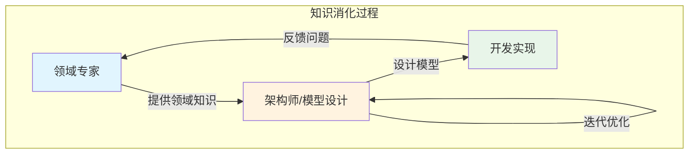

模型不是图(毕竟模型是一种对现实抽象的描述, 而图是具体的表达), 图只是帮助表达和解释模型的工具

文档还是需要持续更新啊!

但是敏捷开发里XP(极限编程)和一众TDD/BDD是只关注可执行代码和他的测试代码

### 第三章 绑定模型和实现

模型的抽象,设计, 不仅要反应实体的关系, 也要帮助实现的推进; 同时代码的实现也要准确反映模型的逻辑

Model Driven Design, emmmm讲的有点抽象, 但基本是上一句话的意思.

## 第二部分 DDD的构造块

构造块啥意思?

### 第四章 分离领域

#### layered architecture 分层架构

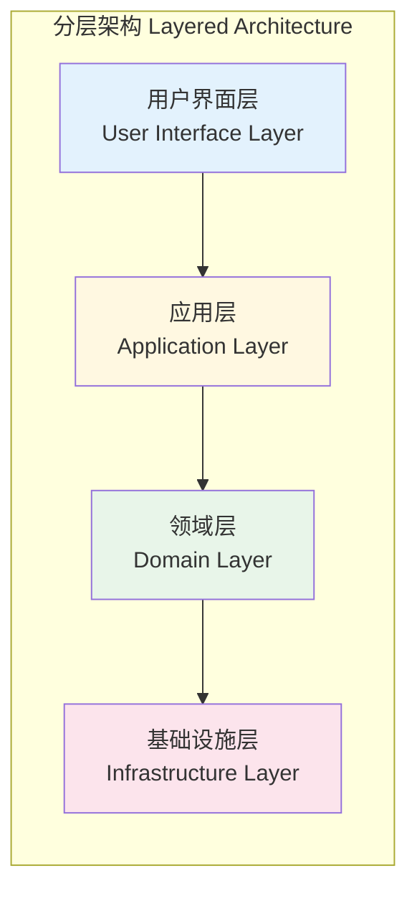

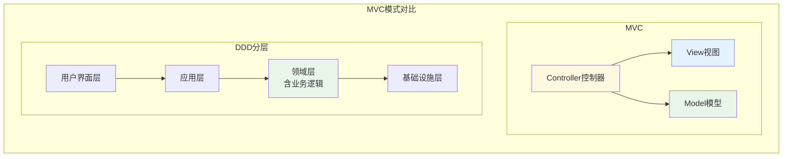

相比于MVC模式

V 对应 用户界面层

M 对应 基础设施层(通常在M中是被透明的) 和 领域层的阉割版(MVC中model是纯数据实体, 而DDD中不仅仅是数据实体, 还有在数据之上的逻辑处理)

C 对应 应用层

#### smart UI \"反模式\"

不懂

### 第五章 软件中所表示的模型

表示模型的3种模型元素模式: ENTITY(REFERENCE OBJECT), VALUE OBJECT, SERVICE

前两者尽量不包含操作/动作, 让service带有前两者+动作(有点像对象)

**关联/关系**

让关联变得更可控

1.  规定一个遍历方向

2.  添加限定符,减少多重关联(?意思是合边吗?)

3.  消除不必要的关联(不关注用上的关联)

**ENTITY**

具体实体,有明确的属性定义;**主要由标识定义的对象**(原文描述)

ENTITY可以是任何事物，只要满足两个条件即可，一是它在整个生命周期中具有连续性，二是它的区别并不是由那些对用户非常重要的属性决定的

比如: 用户, 账号, 设备

**VALUE OBJECT**

用于描述领域的某个方面而本身没有概念标识的对象称为VALUE OBJECT

VALUE OBJECT可以是其他对象的集合

看着像是实体的附属属性集合

比如: 处理事务, 书里举例的地址

**SERVICE**

当对象不是一个事物, 或者其他乱七八糟都会定义为service

SERVICE是作为接口提供的一种操作，它在模型中是独立的，它不像ENTITY和VALUE OBJECT那样具有封装的状态

特征:

1.  与领域概念相关的操作,但不是ENTITY,value object的组成部分

2.  接口由领域模型或其他元素定义

3.  操作是无状态的

在前两者的基础上创建(数据-\>数据+操作)

比如: 动作, 流程的抽象

**MODULE / PACKAGE**

MODULE为人们提供了两种观察模型的方式，一是可以在MODULE中查看细节，而不会被整个模型淹没，二是观察MODULE之间的关系，而不考虑其内部细节。

#### 建模范式

对象范式

领域模型不一定是对象模型, 因为关注的是抽象, 其他编程范式(原型, fp, 命令)也可以实现

4条检验规则

1.  不要和实现范式对抗

2.  不要一味依赖UML

3.  保持怀疑态度

4.  把通用语言作为依靠的基础

好, 很抽象..没一点具体指导啊

### 第六章 领域对象的生命周期

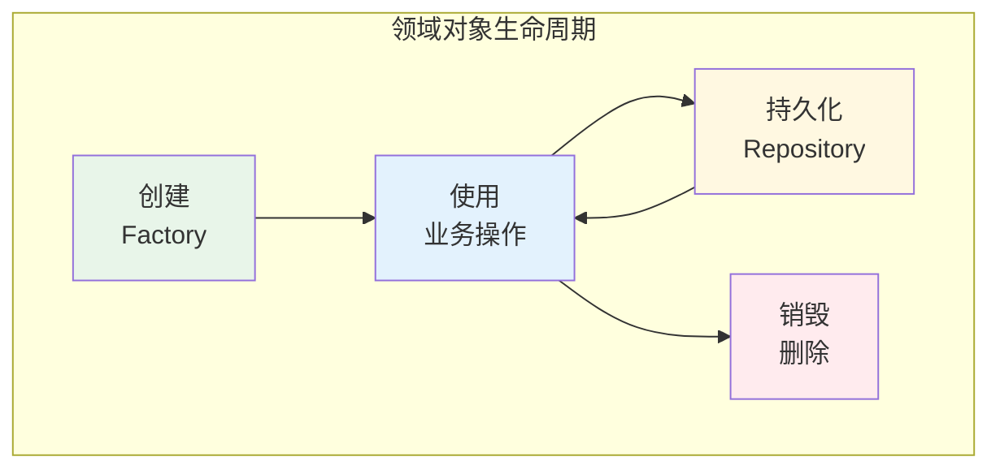

可以理解为状态机变化?

主要挑战:

1.  在整个生命周期中维护完整性

2.  防止模型陷入管理生命周期复杂性造成的困境当中

#### 模式 Aggregate

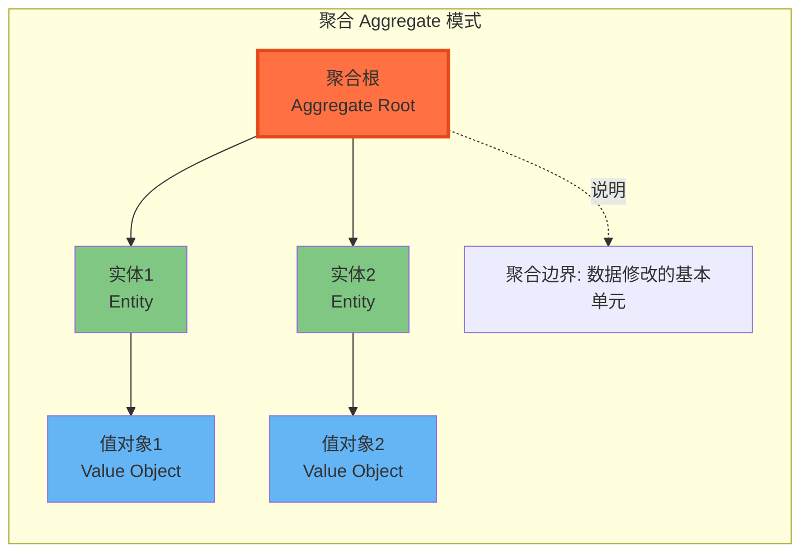

因为对象不是简单单一的, 会有复杂组合;

AGGREGATE就是一组相关对象的集合，我们把它作为数据修改的单元

#### 模式 Factory

类似设计模式里工厂模式,建造者模式

负责处理对象的生命周期开始

#### 模式 Repository

repo是将某种类型的所有对象表示为一个概念集合

repo管理生命周期的中间和结束

怎么理解呢, 比如对象需要作为记录存储在数据库, 而对应数据库的增删改查都是生命周期中间的变动. 最后删除持久化和内存就是结束了

### 第七章 使用语言

(应该说的模式语言)

继续用之前物流运输来举例说明具体设计

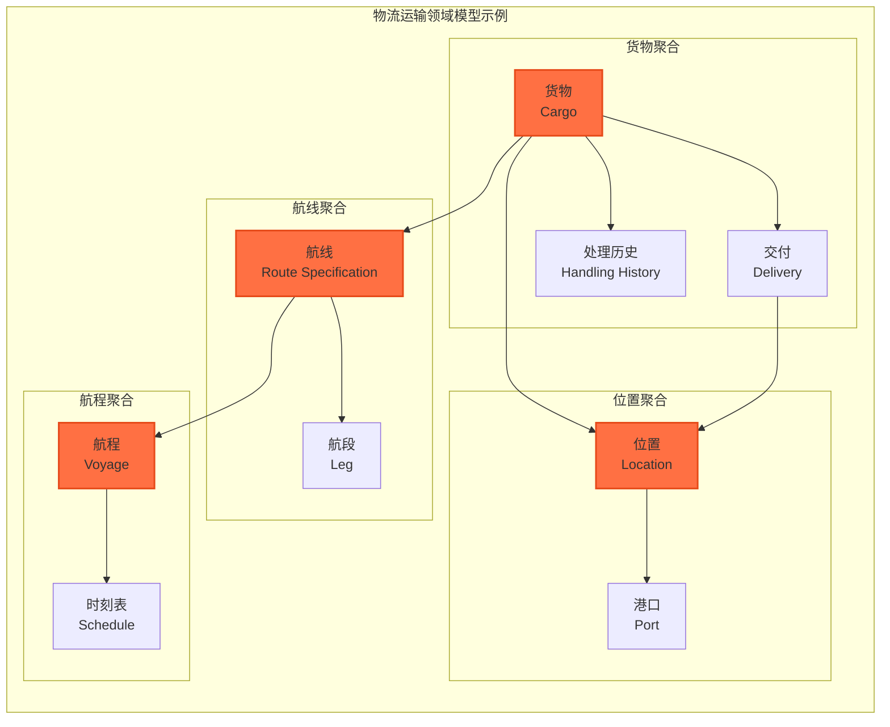

如何界定 entity和value object

这这章基本是围绕这个项目展开讲述处理方式

## 第三部分 通过重构来加深理解

### 第八章 突破

用了银行股份/借贷的模型举例

### 第九章 隐式概念转变为显式概念

多次有提到《重构》和《分析模式》两本书

如何做到概念的挖掘

不同于原来的\"名词即对象\", 还需要深挖名词后续的关系

然后有两个示例, 航线模型 / 利息计算器模型

**隐式概念**感觉像是一些实际实体中存在的属性, 或者是实际需求有需要的, 但是一开始设计不会最明显的目标而导致暂时被忽略了. 再版本不断迭代的过程中

#### 约束

模型中对象/实体的限制, 数据范围的规则等

比如超订策略

对Entity和value object的约束利用specification进行定义

specification

1.  验证对象, 检查是否满足某些需求(数据/权限校验等)

2.  从集合中选择对象(查找满足条件的特定对象)

3.  创建特殊的满足要求的对象(有点像特殊子类型)

### 第十章 柔性设计

supple design 为了使项目随开发工作加速推进, 防止设计老化停止, 需要易于修改

不断发掘**隐式概念**, 再显式表达出来, 然后以此进行迭代循环

防止过度设计

#### 模式 intention-revealing interfaces 释意接口

见名知意的定义; 保持信息隐藏, 封装的意义

#### 模式 side-effect-free function 无副作用函数

将操作宽泛定义为命令和查询; 一个查, 一个改

保持和SRP原则相符, 一个函数不要即干A又干B

不要隐藏带来副作用的操作, 比如暗含修改状态或者中间结果等

但总会有带状态的情况, 那么参考下面一个模式

#### 模式 assertion

无副作用函数处理完简单计算后; 断言模式让你可以处理带状态处理的;

但是封装的函数要限制好固定规则让状态保持是有效状态, 定义好\"不\"变量(比如FSM, 限制状态改变的规则)

限制前臵条件, 声明后臵条件

#### 模式 conceptual contour 概念轮廓

这个和重构比较挂钩, 和边界划分也很挂钩

一开始的模型设计抽象和实现不能完全反映bounded context(限界上下文), 那么就不能显示出概念轮廓, 需要在不断地实际过程中重复的重构, 慢慢使限界上下文变得清晰

#### 模式 standalone class 独立类

质疑所有类的耦合/依赖, 只保留确实需要的依赖, 去除所有不重要的依赖, 保持低耦合的整洁. 提取独立类

#### 模式 closure of operation 操作闭合

\"两个实数相乘，结果仍为实数（实数是所有有理数和所有无理数的集合）​。由于这一点永远成立，因此我们说实数的"乘法运算是闭合的\"

核心思想是: 一个方法的输入和输出都应该是同一类型对象, 至少在同一个概念层次上;

目的应该是为了保持操作观念不进行发散, 保持上下文

你看golang runtime的append等等, 但一般是在value object中体现

#### 声明式设计

代码生成? k8s的声明式编程吗? 后续描述不太一样.

有提到DSL, 更多像是规则引擎

### 第十一章 应用分析模式

详情看看分析模式

### 第十二章 将设计模式应用于模型

**策略模式**

**组合模式**

介绍了两种设计模式如何对应到模型上

还说明了没什么没有flyweight模式(原来这就是享元模式, 这翻译我是没想到的, 但这个模式也不太常用吧)

### 第十三章 通过重构得到更深层的理解

重要的三点

1.  以领域为本

2.  用一种不同的方式来看待事务

3.  始终坚持与领域专家对话

重构的起点: 不一定是代码有多烂, 可能是代码没有符合当前模型的表达, 也是可以做的

团队: 有点老生常谈, 头脑风暴, 发现隐式概念然后再抽象到具体

借鉴先前的经验: 根据别人相似的项目或者书籍的案例用以借鉴, 不要重复劳动

**重构与柔性设计的结合**

重构的时间点: anytime!

## 第四部分 战略设计

三个重要部分

1.  上下文: 限界上下文, 明确边界

2.  精炼: 提炼核心逻辑

3.  大型结构:

### 重点 第十四章 保持模型的完整性

#### bounded context限界上下文模式

有点像分层处理, 整体模型可以划分边界形成内部小模型, 之间再做组合

**这里是定义一个什么东西**

#### continuous integration 持续集成模式

CONTINUOUS INTEGRATION也有两个级别的操作：(1) 模型概念的集成；(2) 实现的集成

最基本的方法是对UBIQUITOUS LANGUAGE多加锤炼

**这里是如何持续优化这个东西**

#### context map上下文映射图模式

用于描述限界上下文的关系的

BOUNDED CONTEXT之间的代码重用是很危险的，应该避免

**这里是描述这个东西之间的关系**

测试context的边界

#### shared kernel 共享内核模式

多个模型间的共享子集

SHARED KERNEL通常是CORE DOMAIN，或是一组GENERIC SUBDOMAIN（通用子领域）​，也可能二者兼有

要么核心功能, 要么基础功能

#### customer/supplier development team 上下游开发团队模式

当上下游团队分隔再两个限界上下文时. 一方对另一方有否决权.会限制开发自由

XP又对此有说法(多人频繁修改有关的, 感觉都和极限编程有关)

如何定义两者的制约关系

#### conformist 追随者模式

当上下游团队, 不是同一个管理者, 而且两者的OKR不一致时, 两者目标不一致而导致无法推进

可能解决途径:

1.  完全放弃对上游的依赖(走向SEPARATE WAY)

2.  如果上游的模型设计难以使用, 还是需要开发自己的模型, 进行接口转换(ANTICORRUPTION LAYER)

3.  如果上游还可以接受, 就是使用本章的追随者模式

我纳闷了, 你的改动他都不支持了, 你还追随个啥?

#### ANTICORRUPTION LAYER 防腐层模式

这个分层架构中的repo层有出现过(数据接入层)

当你依赖的数据无法直接使用时, 可以不先直接替换, 而是通过防腐层做数据清洗转换, 转变成可以用的数据

算是一个隔离层, 转换层?

#### SEPARATE WAY 分离模式

集成总是代价高昂，而有时获益却很小

降低耦合, 不依赖了, 数据和实现直接自治完全独立

#### OPEN HOST SERVICE 开放主机模式

一个子系统被大量系统集成, 不要所有的都去做集成逻辑, 而是定义一个开放协议(你看MCP, otel)

#### PUBLISHED LANGUAGE 公共语言模式

感觉和上面的有点像啊, 都是说通信的问题, 提供标准化接口,就是比如rpc, soap, rest这些

重构后淘汰方式

1.  确定遗留系统的哪个功能可以在一个迭代中被添加到某个新系统中；

2.  确定需要在ANTICORRUPTION LAYER中添加的功能；

3.  实现；

4.  部署；

### 重点 第十五章 战略精炼

领域模型的战略精炼包括以下部分：

1.  帮助所有团队成员掌握系统的总体设计以及各部分如何协调工作；

2.  找到一个具有适度规模的核心模型并把它添加到通用语言中，从而促进沟通；

3.  指导重构；

4.  专注于模型中最有价值的那部分；

5.  指导外包、现成组件的使用以及任务委派。

**core domain 模式**

提取核心领域, 好钢用在刀刃上, 核心领域难点, 让牛逼的人上

**generic subdomain 模式**

看着像公共库, 因为下面描述有已有方案或开源项目的. 算是业务绑定不太强的方面

1.  现成的解决方案

2.  公开的设计/模型(开源)

3.  实现外包出去(牛逼, 我学架构, 你教我外包)

4.  内部实现

**domain vision statement 模式**

领域愿景, 看着就很虚

书里描述也是对核心领域的简短说明

**highlighted core 模式**

高亮核心区域, 让人围绕着做进展(为啥这也能作为一种模式)

**cohesive mechanism 模式**

内聚机制, 将复杂模型改成一个单独的轻量框架; 看着和generic subdomain很像;

两者动机都是一样的, 为了给core domain减负

COHESIVE MECHANISM并不表示领域，它的目的是解决描述性模型所提出来的一些复杂的计算问题

模型提出问题，COHESIVE MECHANISM解决问题

**segregated core 模式**

重构! 分裂!

1.  识别出core的子领域(可以从精炼文档中提取, 你还联动上了)

2.  将相关类移到新的module中

3.  对原有代码进行重构, 修改调用

4.  对新的segregated core module进行重构, 修改对外接口, 内部交互

5.  重复以上工作(这就不用说了吧)

**absract core 模式**

core domain太多细节, 而难以表达整体; 即便是分解成多个小领域, 也是难以表达, 反而更复杂了

于是, 这个方法换了个切割的方向, 不是从技术上把模型切分, 而是增加表达层, 输出简化的视图

**重构的目标和时机**(文中观点和常见的不一样, 看看15.11)

### 第十六章 大型结构

**这章我没咋看**

"大型结构"是一种语言，人们可以用它来从大局上讨论和理解系统

**evolving order 模式**

**system metaphor 模式**

系统隐喻?

**responsibility layer 模式**

和组织架构相似, 按职责分层

**knowledge level 模式**

**plubgable component framework 模式**

### 第十七章 DDD的综合运用

这章吹牛逼的

# 书 - 解构领域驱动设计

### 第一章 软件复杂度

又是将架构比作城市规划;

提到两种能力: 理解能力, 预测能力

**理解能力 = 规模 + 结构**

第一要素=**规模**

需求决定规模; 规模扩张速度依赖于需求的增长速度

**结构**决定了系统的复杂度

结构要与开发/设计团队保持一致

防止无序设计

**预测能力 = 变化;** 防止 **过度设计** 和 **设计不足**

影响复杂度三要素: 规模, 结构, 变化

### 第二章 DDD概览

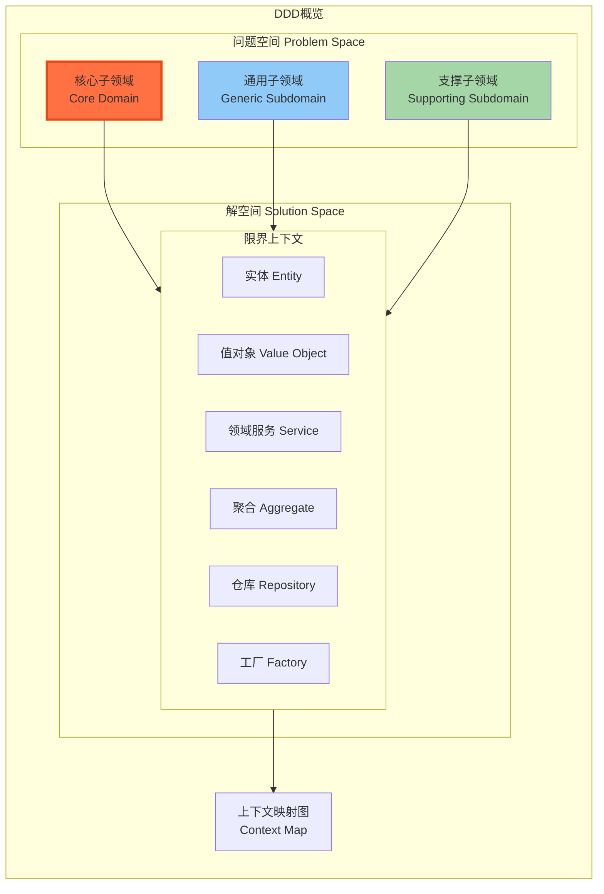

限界上下文可以参考DDD中的十四章

下面表示模型间关系的上下文映射也是十四章的内容

问题空间(现实世界问题) - 解空间(系统实现解决问题)

对抽象问题, 具现化表达, 具现化实现解决方案

也可以说是对现实问题, 抽象成数学模型, 再转化到具体实现的系统

**战略设计:**

划分限界上下文, 以及限界上下文之间的映射关系

**问题空间的分解**

识别出核心子领域(DDD中的core domain), 通用子领域(generic subdomain), 支撑子领域(这没见过, DDD没说)

解空间做对应的架构依赖, 比如限界上下文的映射关系, 维护完整性

**战术设计:**

限界上下文内部的领域建模

这里的可以参考DDD第六章, 领域对象的生命周期三种模式

聚合, 工厂, 仓库

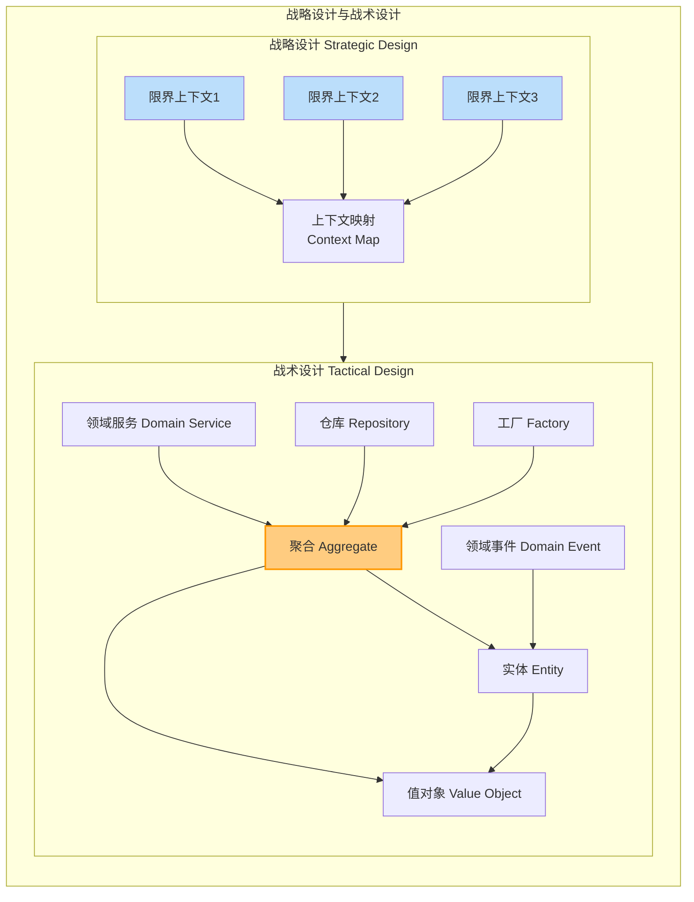

保持清晰的结构

业务需求-\>业务复杂度

系统实现-\>技术复杂度

两者并非独立

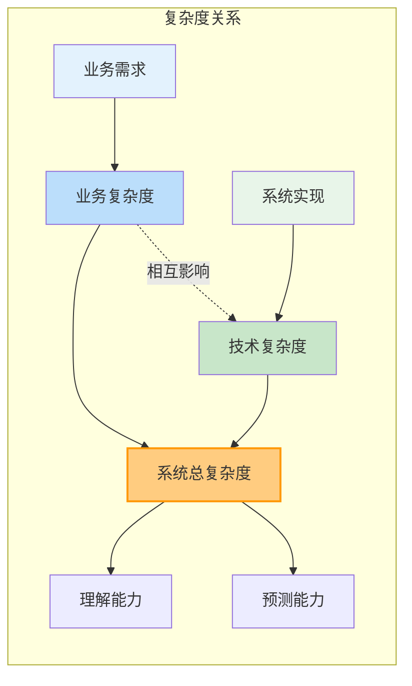

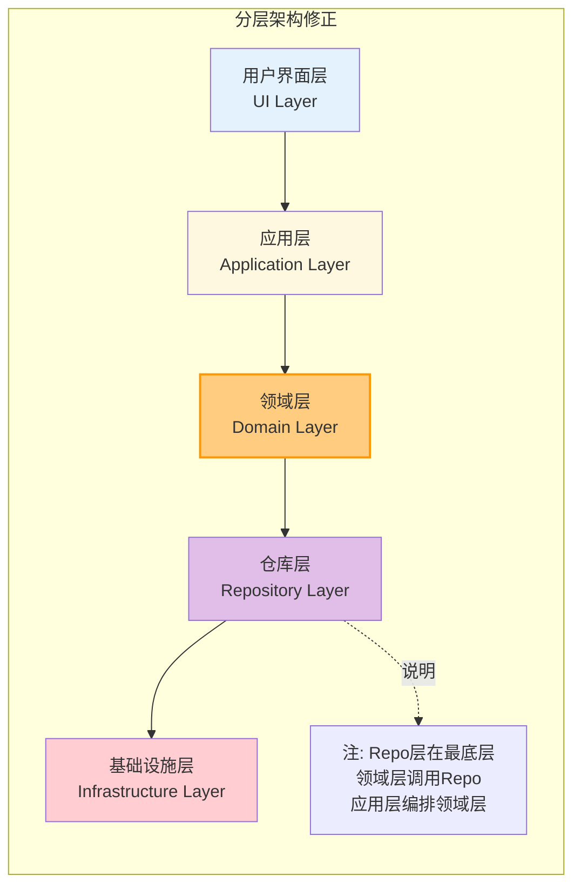

上面这个图不对吧? repo层应该是最底下, 领域层调用, 应用层主要是编排领域层

### 第三章 DDD的统一过程

不要照本宣科, 依葫芦画瓢;

灵活使用思想

**社区增加的新概念:**

支撑子领域(怪不得我前面没看过)

领域事件

事件溯源

CQRS模式

**限界上下文映射也增加了:**

发布者/订阅者模式 (Pub/Sub)

菱形对称架构模式

**领域建模阶段**

角色构造型

服务驱动设计

**不足之处**

因为是作为一个思想指导, 一种方法论的概念; 所以没有具体的执行过程规范, 所以**缺乏规范的统一过程**算是不足之一

具体的需求如何设计映射到模型, 也是一个机器抽象的过程, 有大概的模式指导, 但是没有明确的评判方式; **缺乏匹配的需求分析方法**

在服务划分的层面, 没有明确的模型对应关系, **缺乏规范化的,具有指导意义的架构体系**

服务内如何进行架构编排也没哟明确的方式, 分层架构较为模糊, **缺乏固化的指导方法**

这本书针对上面的问题, 建立了**DDDUP, 领域驱动设计统一过程**

全局分析阶段

架构映射阶段

领域建模阶段

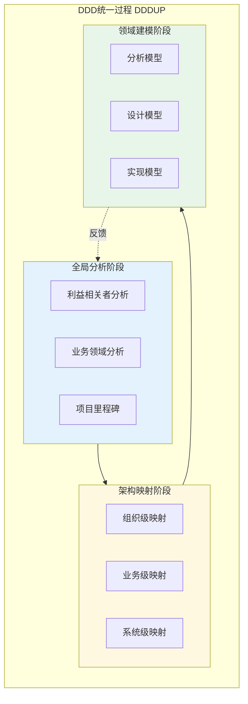

**全局分析阶段**

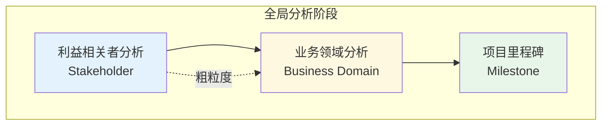

粗粒度的分析

不仅从角色角度做需求分析, 还有业务领域的需求分析, 且还有项目的里程碑点

**架构映射阶段**

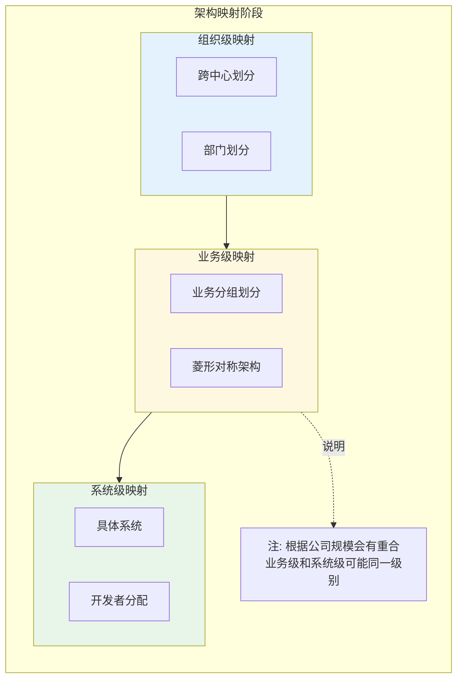

通过组织级映射, 业务级映射, 系统级映射

这三个我觉得我是不一定的, 根据公司规模会有重合的地方

组织级映射一般是跨中心/部门的划分

业务级映射同架构组织内不同分组的划分

系统级映射就到了具体系统的(可能一个开发者, 也可能数个)

但是业务和系统可能是一个级别, 也可能因为复杂业务而有拆分

业务级的限界上下文的内部架构遵循**菱形对称架构模式**; 就是上面个业务级那个

系统级上下文的分层架构:

支撑子领域和通用子领域映射为基础层

~~通用是业务通用逻辑~~

~~支撑是从通用分离出来, 更多是外部工具依赖~~

~~理解有误, 看下面第四章~~

边缘层接近用户体验层

**领域建模阶段**

这三个阶段并不是完全按时间推移而进行的

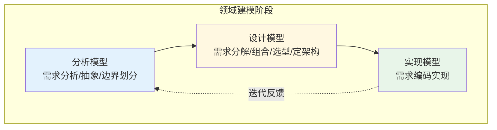

分析模型; 需求分析/抽象/边界划分的阶段

设计模型; 需求分解/组合/选型/定系统架构的阶段

实现模型; 需求编码实现的阶段

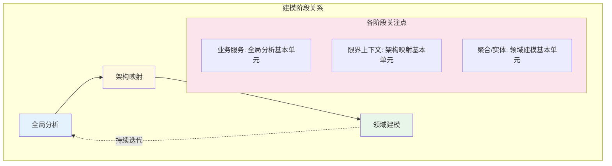

下一篇开始重点讲全局分析

**业务服务是作为全局分析阶段的基本单元**

**架构映射**

**领域建模**

### 第四章 问题空间探索

前面提到的5W模型

6W要素中的前5个要素皆与问题空间需要探索的内容存在对应关系。(6W还有一个hoW)

-   Who：利益相关者

-   Why：系统愿景

-   Where：系统范围

-   When：业务流程

-   What：业务服务

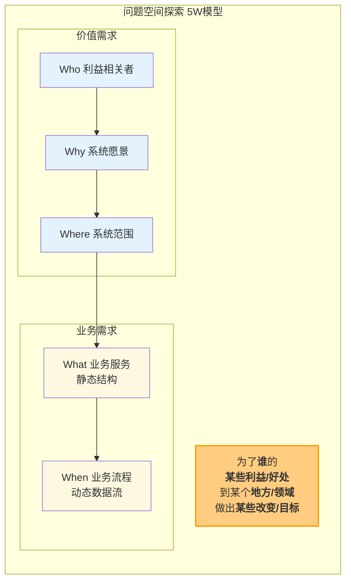

为了**谁**的**某些利益/好处**而到某个地方/领域/业务方向做出**某些改变/目标**

这里前三个W组成了价值需求, 也是有这个业务/需求的基础

而业务需求有动态和静态组成; what=静态的结构; when=系统实际运行后数据流向, 动作交互的过程/流程

核心子领域: 具有不可替代的作用，满足了最重要的利益相关者的价值需求

通用子领域: 业务需求的一部分，但在面向各个领域的业务系统中都能看到，又不可或缺，形成了不具有个性特征的通用功能

支撑子领域: 某个业务服务为另外一些提供了核心价值的业务服务提供支撑，具有辅助价值却又不具有通用意义

我前面的理解可能把通用和支撑弄反了(已修改)

中间举例的了沟通,建模,表达的方式

DDD的事件风暴层次:

-   探索业务全景

-   领域分析建模

### 第五章 价值需求分析

前面的3个W

讨论了既得利益者

愿景方向(业务的发展方向)

系统范围, 保证系统的内聚性和可扩展性

### 第六章 业务需求分析

后两个W

两个关键点: **完整** 和 **边界**

因为这里是限界上下文内的, DDD中就有保证限界上下文完整性的模式方法

而边界的话也是上下文映射关系中需要理清, 划分的

不同业务流程的分类

从特征上:

-   主业务流

-   变体业务流

-   支撑业务流

从发起者看:

-   外部业务流

-   内部业务流

-   管理业务流

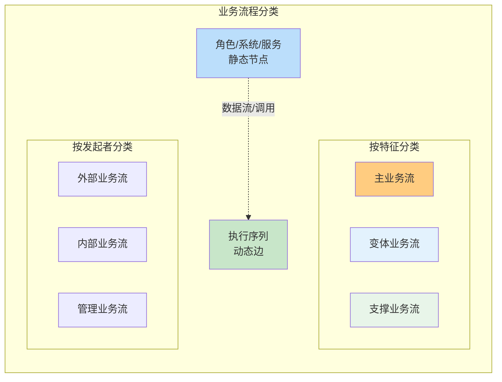

角色, 系统/服务 作为 静态

执行序列 作为 动态

有点像, 静态的座位图的节点, 而每次数据流动/调用作为连接点的边, 而执行序列是其中一条链/路径

**如何表示业务服务**

服务图

利用WHO,WHAT,WHY,WHERE

1作为用户, 2作为服务, 3作为具体调用功能, 4作为边界划分(不显式)

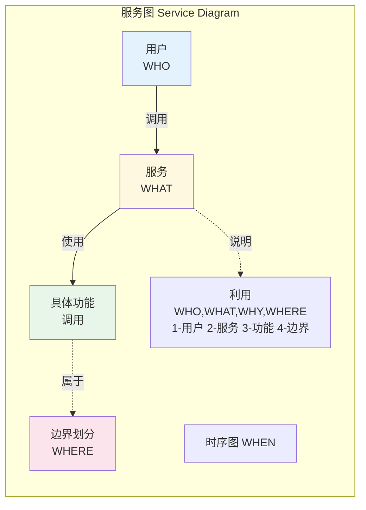

而WHEN则是做时序图表示了

**子领域**

子领域也算是限界上下文内的属性了

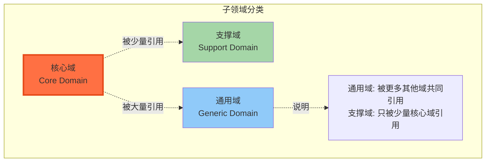

核心域: 系统/业务最核心的资产/实现/服务; 比如你是电商的话, 最核心的就是商品/订单/仓储等系统

通用域和支撑域的界定都就很模糊了, 因为两个都是通用的, 基础的

可能通用域会被更多的其他域共同引用

而支撑域只被少量的核心域引用他特别的能力

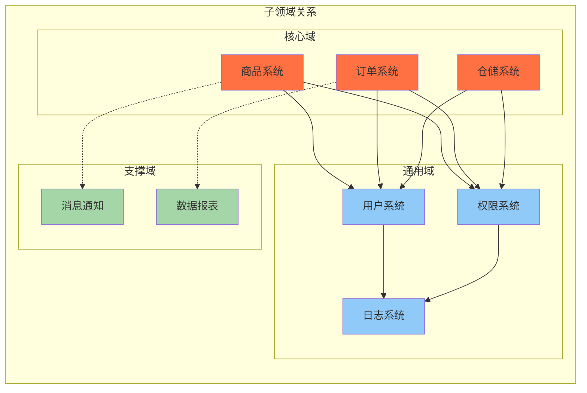

**下面第三部分架构映射, 暂时不做多级标题了**

这里讲的是服务间的关系了

限界上下文是架构映射阶段的基本架构单元

限界上下文会作为一个服务

### 第七章 同构系统

同构系统, 表明两个复杂结构可以互相映射的

就是问题空间 -\> 解空间

-   架构映射的概念层次: 定义的概念(抽象), 设计的模式(具体)

-   架构映射的设计层次: 问题空间的真实逻辑(抽象), 解空间的软件实现(具体)

-   架构映射的管理层次: 组织架构映射

清晰的架构, 可以控制整体软件系统的复杂度

**TOGAF架构开发方法 ADM**

```mermaid
flowchart TD
    subgraph TOGAF_ADM["TOGAF ADM 架构开发方法"]
        direction TB
        
        A[架构愿景<br/>Architecture Vision]
        B[业务架构<br/>Business Architecture]
        C[信息系统架构<br/>Information Systems<br/>Architecture]
        D[技术架构<br/>Technology Architecture]
        E[机会与解决方案<br/>Opportunities & Solutions]
        F[迁移规划<br/>Migration Planning]
        G[实施治理<br/>Implementation Governance]
        H[架构变更管理<br/>Architecture Change<br/>Management]
        
        A --> B
        B --> C
        C --> D
        D --> E
        E --> F
        F --> G
        G --> H
        H -.->|变更驱动| A
        
        %% 业务架构与信息系统架构的关系
        B -.->|共同顺应变化| C
        
        C -.->|说明| Note["限界上下文是软件元素<br/>连接业务架构和应用架构"]
    end
    
    style A fill:#e3f2fd
    style B fill:#fff8e1
    style C fill:#e8f5e9
    style D fill:#fce4ec
    style E fill:#e1bee7
    style F fill:#d1c4e9
    style G fill:#b2dfdb
    style H fill:#ffcc80
```
在上图中, 业务架构需要变动的时候, 需要共同顺应变化的方向; 需要找到一种\"软件元素\"连接起业务架构和应用架构; 没错,**这个软件元素就是限界上下文**;

限界上下文是根据领域知识语境对业务进行的功能分解，体现了独立的业务能力

那么我们要做的是**边界的划分**

**映射关系**

```mermaid
flowchart TD
    subgraph MappingRelationships["映射关系"]
        direction TB
        
        subgraph ProblemSpace["问题空间"]
            PS1[概念层次<br/>抽象定义]
            PS2[设计层次<br/>真实逻辑]
            PS3[管理层次<br/>组织架构]
        end
        
        subgraph SolutionSpace["解空间"]
            SS1[设计模式<br/>具体实现]
            SS2[软件实现<br/>解空间]
        end
        
        %% 同构映射
        PS1 -->|同构映射| SS1
        PS2 -->|同构映射| SS2
        PS3 -->|康威定律| SS2
        
        SS2 -.->|说明| Note["清晰的架构控制整体复杂度"]
    end
    
    style PS1 fill:#e3f2fd
    style PS2 fill:#e3f2fd
    style PS3 fill:#e3f2fd
    style SS1 fill:#e8f5e9
    style SS2 fill:#e8f5e9
```

2PTs规则 这个感觉和管理知识有点关系

就是N=n(n-1)/2 说明随着人数变多, 关系变的复杂

```mermaid
flowchart LR
    subgraph TwoPTs["2PTs规则"]
        direction LR
        
        N[人数 N] --> Formula["N(N-1)/2"]
        Formula --> Relationships[沟通关系数]
        
        %% 示例
        N3["N=3"] --> R3["3关系"]
        N5["N=5"] --> R5["10关系"]
        N10["N=10"] --> R10["45关系"]
        
        Relationships -.->|说明| Note["人数增多, 关系复杂度指数级增长"]
    end
    
    style N fill:#e3f2fd
    style Formula fill:#fff8e1
    style Relationships fill:#ffcc80,stroke:#ff9800,stroke-width:2px
```

康威定律

任何组织在设计一套系统时, 所交付的设计方案都与该组织的 沟通结构保持一致

```mermaid
flowchart TD
    subgraph ConwayLaw["康威定律 Conway's Law"]
        direction TB
        
        subgraph Org["组织架构"]
            O1[部门A]
            O2[部门B]
            O3[部门C]
        end
        
        subgraph System["系统架构"]
            S1[模块A]
            S2[模块B]
            S3[模块C]
        end
        
        %% 映射关系
        O1 -.->|沟通结构| S1
        O2 -.->|沟通结构| S2
        O3 -.->|沟通结构| S3
        
        %% 部门间关系映射到模块间关系
        O1 -.-> O2
        O2 -.-> O3
        S1 -.-> S2
        S2 -.-> S3
        
        Law["任何组织在设计一套系统时<br/>所交付的设计方案都与该组织的<br/>沟通结构保持一致"]
    end
    
    style Org fill:#e3f2fd
    style System fill:#e8f5e9
    style Law fill:#ffcc80,stroke:#ff9800,stroke-width:2px
```

### 第八章 系统上下文

系统上下文来自C4模型, (文章: **可视化架构设计\--C4介绍**)

System Context 系统上下文

Container 容器

Component 组件\
Class 类

划分玩系统上下文之后还需要去寻找系统范围外的关联, 这与伴生系统有关(算是外部的依赖/耦合)

如何确定系统上下文

文中还是利益相关者为起点, 通过愿景(想做什么), 其实就是需求为起点, 延伸动作; 在一系列的动作后可以完成愿景的全部/一部分(如果有拆解); 那么就确定的系统的边界

### 第九章 限界上下文

前面系统上下文更像完成一个大需求目标的服务集合

而限界上下文就是确定到服务了

```mermaid
flowchart TD
    subgraph BoundedContextConcept["限界上下文概念"]
        direction TB
        
        subgraph Characteristics["业务特征"]
            C1[领域模型的知识语境]
            C2[业务能力的纵向切分<br/>垂直切分]
            C3[自治的架构单元]
        end
        
        subgraph SystemContext["系统上下文"]
            SC[大需求目标的<br/>服务集合]
        end
        
        subgraph BoundedContext["限界上下文"]
            BC[确定到具体服务]
        end
        
        SystemContext --> BoundedContext
        
        BC -.->|说明| Note["限界上下文是架构映射的基本单元<br/>也是领域建模的边界"]
    end
    
    style SystemContext fill:#e3f2fd
    style BoundedContext fill:#ffcc80,stroke:#ff9800,stroke-width:2px
    style Characteristics fill:#e8f5e9
```

业务特征:

领域模型的知识语境

业务能力的纵向切分(垂直)

他还是自治的架构单元

```mermaid
flowchart TD
    subgraph ConceptConflicts["概念冲突与上下文"]
        direction TB
        
        subgraph ContextA["上下文A"]
            A1[客户]
            A2[订单]
        end
        
        subgraph ContextB["上下文B"]
            B1[客户]
            B2[合同]
        end
        
        subgraph ContextC["上下文C"]
            C1[用户]
            C2[交易]
        end
        
        %% 概念冲突
        A1 -.->|同名不同义| B1
        A1 -.->|不同名同义| C1
        A2 -.->|同名不同义| C2
        
        B1 -.->|说明| Note["不同上下文内概念可能:<br/>1. 同名不同义<br/>2. 不同名同义<br/>3. 同名同义"]
    end
    
    style ContextA fill:#e3f2fd
    style ContextB fill:#fff8e1
    style ContextC fill:#e8f5e9
```

这些概念冲突, 除了上下文映射关系, 还存在不同上下文内的概念不同

(可以看看Martin Fowler的限界上下文的文章)

模块和限界上下文的区别

前者可能是服务的组件或者共享组件库

而后者是完整的服务, 可以是前者的集合组合而成

限界上下文内模块的共用导致分布式大泥球

这里针对被过多引用的模块, 进行解耦, 不直接静态耦合, 而是通过其他方式进行通信共享

```mermaid
flowchart TD
    subgraph DistributedBigBall["分布式大泥球"]
        direction TB
        
        subgraph Module["共享模块"]
            M1[模块A]
            M2[模块B]
        end
        
        subgraph Service1["服务1"]
            S1A[组件A]
            S1B[组件B]
        end
        
        subgraph Service2["服务2"]
            S2A[组件A]
            S2B[组件B]
        end
        
        subgraph Service3["服务3"]
            S3A[组件A]
            S3B[组件B]
        end
        
        %% 静态耦合
        S1A --> M1
        S1B --> M2
        S2A --> M1
        S2B --> M2
        S3A --> M1
        S3B --> M2
        
        %% 解耦方案
        Solution["解耦方案:<br/>不直接静态耦合<br/>通过通信方式共享"]
        
        M1 -.->|说明| Note["模块被过多引用导致分布式大泥球"]
    end
    
    style Module fill:#ffcc80,stroke:#ff9800,stroke-width:2px
    style Service1 fill:#e3f2fd
    style Service2 fill:#fff8e1
    style Service3 fill:#e8f5e9
```

如何分析业务/工作流设计限界上下文

时间点调用过程

角色的动机, 动向

**知识语境**

**归纳然后寻找相关性**

整理后还需要再看上下文间的亲密度, 考虑是否可以组合

验证原则

1.  正交原则(相关)

2.  单一抽象层次原则(内聚)

3.  奥卡姆剃刀原理(直接)

### 第十章 上下文映射

这章讲到服务间的关系

主要因为业务演进的过程中, 出现上下间模糊的定义, 需要进行重构, 清晰他们之间的边界

DDD十四章中的模式之后, 增加了

-   合作关系模式

-   大泥球模式

-   发布者/订阅者模式

可以整体分类为两类

-   通信集成模式

-   团队协作模式

### 第十一章 服务契约设计

消息契约的类型

命令(写)

查询(读)

事件(这个是相对DDD新增的, 对应事件驱动的模式)

契约就是通信的协议/约定/接口参数结构这类

根据不同的类型:

-   面向资源的服务建模-\>服务资源契约

-   面相行为的服务建模-\>服务行为契约

一个获取数据资源, 一个实现某中愿景的动作

REST风格会相似, REST风格将其抽象成名词(资源), 动词(行为)

```mermaid
flowchart TD
    subgraph MessageContract["消息契约类型"]
        direction TB
        
        subgraph ContractTypes["契约类型"]
            Command[命令 Command<br/>写操作]
            Query[查询 Query<br/>读操作]
            Event[事件 Event<br/>DDD新增]
        end
        
        subgraph Modeling["服务建模"]
            Resource[面向资源<br/>服务资源契约]
            Behavior[面向行为<br/>服务行为契约]
        end
        
        %% 关系
        Command -->|对应| Behavior
        Query -->|对应| Resource
        Event -->|对应| Behavior
        
        %% REST风格
        REST["REST风格:<br/>名词-资源<br/>动词-行为"]
        
        Event -.->|说明| Note["事件驱动: 利用通信方式传递事件<br/>不需要关注调用约束, 各自处理, 完全解耦"]
    end
    
    style Command fill:#ffcc80
    style Query fill:#90caf9
    style Event fill:#a5d6a7
    style REST fill:#e1bee7
```

相对前面的直接调用依赖, 还存在契约的前置后置约束; 事件只是利用通信方式传递事件的发生, 不需要关注调用的约束, 事件循环各自处理, 完全解耦

### 第十二章 领域驱动架构

#### 菱形对称架构

六边形架构(hexagonal architecture)又被称为端口适配器(port and adapter)

```mermaid
flowchart TD
    subgraph Hexagonal["六边形架构 Hexagonal Architecture"]
        direction LR
        
        subgraph DomainHexagon["领域六边形<br/>内部边界"]
            Domain[领域层]
        end
        
        subgraph AppHexagon["应用六边形<br/>外部边界"]
            App[应用层]
            Infra[基础设施]
        end
        
        subgraph Ports["端口 Port"]
            P1[北向端口]
            P2[南向端口]
        end
        
        subgraph Adapters["适配器 Adapter"]
            A1[北向适配器]
            A2[南向适配器]
        end
        
        %% 关系
        Domain --> P1
        Domain --> P2
        P1 --> A1
        P2 --> A2
        A1 --> App
        A2 --> Infra
        
        DomainHexagon -.->|说明| Note["端口适配器模式<br/>内部边界-领域六边形<br/>外部边界-应用六边形"]
    end
    
    style DomainHexagon fill:#ffcc80,stroke:#ff9800,stroke-width:2px
    style AppHexagon fill:#e3f2fd
```

内部边界 / 外部边界

内部-\>领域六边形

外部-\>应用六边形

```mermaid
flowchart TD
    subgraph BoundaryDesign["边界设计"]
        direction TB
        
        subgraph InternalBoundary["内部边界"]
            Domain[领域层<br/>Domain]
            Entities[实体/值对象]
            Services[领域服务]
        end
        
        subgraph ExternalBoundary["外部边界"]
            App[应用层<br/>Application]
            Infra[基础设施层<br/>Infrastructure]
            UI[用户界面层<br/>UI]
        end
        
        subgraph CleanArch["整洁架构原则"]
            Dependency[依赖方向:<br/>外部依赖内部]
        end
        
        %% 依赖关系
        UI --> App
        App --> Domain
        Domain --> Entities
        Domain --> Services
        App --> Infra
        
        Domain -.->|说明| Note["边界划分与整洁架构相似<br/>服务边界设计 + 服务内部结构设计"]
    end
    
    style InternalBoundary fill:#ffcc80,stroke:#ff9800,stroke-width:2px
    style ExternalBoundary fill:#e3f2fd
```

边界的划分和整洁架构还是相似的(我得重看整洁架构之道了)

上面都是服务的边界设计

服务内部结构设计就是大家都有听过的分层架构(ava圈吹的DDD架构取代MVC)

```mermaid
flowchart TD
    subgraph LayeredResponsibilities["分层职责"]
        direction TB
        
        subgraph UserInterface["用户界面层"]
            UI1[用户交互]
            UI2[数据展示]
        end
        
        subgraph Application["应用层"]
            App1[用例编排]
            App2[事务控制]
        end
        
        subgraph Domain["领域层"]
            D1[业务逻辑]
            D2[领域规则]
            D3[领域服务]
        end
        
        subgraph Infrastructure["基础设施层"]
            I1[数据持久化]
            I2[外部服务]
            I3[消息队列]
        end
        
        %% 依赖
        UI1 --> App1
        App1 --> D1
        D1 --> I1
        
        D1 -.->|说明| Note["每层职责清晰分离<br/>上层依赖下层"]
    end
    
    style UserInterface fill:#e3f2fd
    style Application fill:#fff8e1
    style Domain fill:#ffcc80,stroke:#ff9800,stroke-width:2px
    style Infrastructure fill:#e8f5e9
```

每层级的职责

```mermaid
flowchart LR
    subgraph LayeredTradeoff["分层数量权衡"]
        direction LR
        
        TooMany["太多层"] --> Cost["引入过多间接开支<br/>不必要的复杂性"]
        
        TooFew["太少层"] --> Concern["关注点不够分离<br/>系统结构不合理"]
        
        Balance["平衡分层"] --> Optimal["适度抽象<br/>清晰职责"]
        
        Optimal -.->|说明| Note["分层数量需要权衡<br/>避免过度设计和设计不足"]
    end
    
    style TooMany fill:#ffcdd2
    style TooFew fill:#ffcdd2
    style Balance fill:#c8e6c9
    style Optimal fill:#ffcc80,stroke:#ff9800,stroke-width:2px
```

分层数量的权衡

太多, 会有引入过多间接的不必要的开支

太少, 导致关注点不够分离, 进而系统结构不合理

后续就是演进到菱形对称架构

```mermaid
flowchart TD
    subgraph DiamondSymmetry["菱形对称架构"]
        direction TB
        
        subgraph Northbound["北向网关"]
            OHS[开放主机服务<br/>Open Host Service]
            PL[发布语言<br/>Published Language]
        end
        
        subgraph Core["领域核心"]
            Domain[领域层]
            App[应用层]
        end
        
        subgraph Southbound["南向网关"]
            ACL[防腐层<br/>Anti-Corruption Layer]
            Repo[仓库 Repository]
        end
        
        subgraph External["外部"]
            Client[客户端]
            ExternalService[外部服务]
            DB[数据库]
        end
        
        %% 数据流
        Client --> OHS
        OHS --> PL
        PL --> App
        App --> Domain
        Domain --> ACL
        ACL --> ExternalService
        Domain --> Repo
        Repo --> DB
        
        Domain -.->|说明| Note["菱形对称架构演进<br/>引入开放主机服务(北向)<br/>引入防腐层(南向)<br/>引入发布语言"]
    end
    
    style Northbound fill:#e3f2fd
    style Core fill:#ffcc80,stroke:#ff9800,stroke-width:2px
    style Southbound fill:#e8f5e9
```

```mermaid
flowchart TD
    subgraph DiamondSymmetryDetail["菱形对称架构详细"]
        direction TB
        
        subgraph NGateway["北向网关"]
            N1[REST API]
            N2[GraphQL]
            N3[gRPC]
        end
        
        subgraph AppLayer["应用层"]
            AppService[应用服务]
            UseCase[用例]
        end
        
        subgraph DomainLayer["领域层"]
            Agg[聚合]
            Entity[实体]
            VO[值对象]
            DS[领域服务]
        end
        
        subgraph SGateway["南向网关"]
            S1[数据库适配器]
            S2[消息队列适配器]
            S3[外部服务适配器]
        end
        
        %% 依赖关系
        N1 --> AppService
        N2 --> AppService
        N3 --> AppService
        AppService --> UseCase
        UseCase --> DS
        DS --> Agg
        Agg --> Entity
        Agg --> VO
        DS --> S1
        DS --> S2
        DS --> S3
        
        DS -.->|说明| Note["北向-开放主机服务<br/>南向-防腐层<br/>菱形对称架构"]
    end
    
    style NGateway fill:#e3f2fd
    style AppLayer fill:#fff8e1
    style DomainLayer fill:#ffcc80,stroke:#ff9800,stroke-width:2px
    style SGateway fill:#e8f5e9
```

引入开放主机服务(和北向网关一致)

引入防腐层(南向网关的端口的抽象)

引入发布语言(北向网关的服务契约)

菱形对称架构和分层架构的对应

```mermaid
flowchart TB
    subgraph Rhombus["菱形对称架构"]
        direction TB
        N[北向网关<br/>North Gateway]
        App[应用层<br/>Application]
        Domain[领域层<br/>Domain]
        S[南向网关<br/>South Gateway]
        
        N --> App
        App --> Domain
        Domain --> S
    end
    
    subgraph Layered["分层架构"]
        direction TB
        UI[用户界面层<br/>UI Layer]
        App2[应用层<br/>App Layer]
        Domain2[领域层<br/>Domain Layer]
        Infra[基础设施层<br/>Infra Layer]
        
        UI --> App2
        App2 --> Domain2
        Domain2 --> Infra
    end
    
    N -.-> UI
    App -.-> App2
    Domain -.-> Domain2
    S -.-> Infra
    
    style N fill:#e3f2fd
    style App fill:#fff8e1
    style Domain fill:#e8f5e9
    style S fill:#fce4ec
    style UI fill:#e3f2fd
    style App2 fill:#fff8e1
    style Domain2 fill:#e8f5e9
    style Infra fill:#fce4ec
```

上下文映射的模式

下游团队依赖上游团队, 而上游团队回应很少

就会选择遵奉者/追随者模式

如果上游团队的服务足够稳定, 方便复用, 那就是共享内核模式

```mermaid
flowchart LR
    subgraph ContextMap["上下文映射模式"]
        direction TB
        
        subgraph UpstreamCtx["上游上下文"]
            U[上游团队<br/>Upstream Team]
        end
        
        subgraph DownstreamCtx["下游上下文"]
            D[下游团队<br/>Downstream Team]
        end
        
        subgraph Patterns["映射模式"]
            direction TB
            P1[遵奉者模式<br/>Conformist]
            P2[共享内核模式<br/>Shared Kernel]
            P3[客户方/供应方<br/>Customer/Supplier]
        end
        
        U -->|依赖关系| D
        U -.->|模式选择| Patterns
    end
    
    style U fill:#e3f2fd
    style D fill:#fff8e1
    style P1 fill:#e8f5e9
    style P2 fill:#e8f5e9
    style P3 fill:#e8f5e9
```

利用防腐层 + 开放主机服务的模式

一边是独立的服务, 一边是适配公共服务的适配层

```mermaid
flowchart LR
    subgraph Anticorruption["防腐层 + 开放主机服务模式"]
        direction TB
        
        subgraph Local["本地限界上下文"]
            L[本地服务<br/>Local Service]
            ACL[防腐层<br/>Anti-Corruption Layer]
            L --> ACL
        end
        
        subgraph Remote["外部公共服务"]
            R[公共服务<br/>Public Service]
            OHS[开放主机服务<br/>Open Host Service]
            PL[发布语言<br/>Published Language]
            R --> OHS
            OHS --> PL
        end
        
        ACL -->|适配| OHS
    end
    
    style L fill:#e3f2fd
    style ACL fill:#fff8e1
    style R fill:#e8f5e9
    style OHS fill:#fce4ec
    style PL fill:#f3e5f5
```

分离模式

这种就是直接不跟你玩了, 我自己维护一套

```mermaid
flowchart LR
    subgraph Separate["分离模式 Separate Ways"]
        direction TB
        
        subgraph TeamA["团队A"]
            A[限界上下文A<br/>Bounded Context A]
            ModelA[领域模型A<br/>Domain Model A]
            A --> ModelA
        end
        
        subgraph TeamB["团队B"]
            B[限界上下文B<br/>Bounded Context B]
            ModelB[领域模型B<br/>Domain Model B]
            B --> ModelB
        end
        
        TeamA -.-x|无耦合| TeamB
        
        Note1[无依赖关系<br/>独立维护]
        A -.-> Note1
        B -.-> Note1
    end
    
    style A fill:#e3f2fd
    style ModelA fill:#bbdefb
    style B fill:#fff8e1
    style ModelB fill:#ffe082
    style Note fill:#e8f5e9
```

以上三种情况分别对应的是

1.  领域模型依赖(静态领域耦合)

2.  消息契约模型依赖(动态领域耦合)

3.  无模型依赖(无耦合)

**更加动态灵活的模式:**

1.  客户方/供应方模式

2.  发布者/订阅者模式

1我觉得还是和前面的点2相似的

2 的话就是通信方式解耦了, 利用异步的方式通信

**关注点分离啥意思?**

#### DDD架构风格

```mermaid
flowchart TB
    subgraph DDDArch["DDD架构风格总览"]
        direction TB
        
        subgraph Strategic["战略设计"]
            S1[限界上下文<br/>Bounded Context]
            S2[上下文映射<br/>Context Map]
            S3[领域<br/>Domain]
            S4[子域<br/>Subdomain]
        end
        
        subgraph Tactical["战术设计"]
            T1[实体<br/>Entity]
            T2[值对象<br/>Value Object]
            T3[聚合<br/>Aggregate]
            T4[领域服务<br/>Domain Service]
            T5[领域事件<br/>Domain Event]
            T6[仓库<br/>Repository]
            T7[工厂<br/>Factory]
        end
        
        subgraph ArchPattern["架构模式"]
            A1[分层架构<br/>Layered Architecture]
            A2[六边形架构<br/>Hexagonal Architecture]
            A3[菱形对称架构<br/>Rhombus Architecture]
            A4[CQRS]
            A5[事件溯源<br/>Event Sourcing]
        end
        
        Strategic --> Tactical
        Tactical --> ArchPattern
    end
    
    style S1 fill:#e3f2fd
    style S2 fill:#e3f2fd
    style S3 fill:#e3f2fd
    style S4 fill:#e3f2fd
    style T1 fill:#fff8e1
    style T2 fill:#fff8e1
    style T3 fill:#fff8e1
    style T4 fill:#fff8e1
    style T5 fill:#fff8e1
    style T6 fill:#fff8e1
    style T7 fill:#fff8e1
    style A1 fill:#e8f5e9
    style A2 fill:#e8f5e9
    style A3 fill:#e8f5e9
    style A4 fill:#e8f5e9
    style A5 fill:#e8f5e9
```

```mermaid
flowchart TB
    subgraph ArchStyles["DDD架构模式对比"]
        direction LR
        
        subgraph LayeredArch["分层架构"]
            L1[用户界面层]
            L2[应用层]
            L3[领域层]
            L4[基础设施层]
            L1 --> L2 --> L3 --> L4
        end
        
        subgraph Hexagonal["六边形架构"]
            H1[应用核心<br/>Application Core]
            H2[端口<br/>Ports]
            H3[适配器<br/>Adapters]
            H4[外部系统]
            H1 <-->|端口| H2
            H2 <-->|适配| H3
            H3 <-->|调用| H4
        end
        
        subgraph OnionArch["洋葱架构"]
            O1[领域模型<br/>核心]
            O2[领域服务]
            O3[应用服务]
            O4[基础设施]
            O1 --> O2 --> O3 --> O4
        end
    end
    
    style L1 fill:#e3f2fd
    style L2 fill:#bbdefb
    style L3 fill:#90caf9
    style L4 fill:#64b5f6
    style H1 fill:#fff8e1
    style H2 fill:#ffe082
    style H3 fill:#ffd54f
    style H4 fill:#ffca28
    style O1 fill:#e8f5e9
    style O2 fill:#c8e6c9
    style O3 fill:#a5d6a7
    style O4 fill:#81c784
```

下一篇章, 领域建模

从分析, 设计, 实现模型讲(DDD里面这些内容是在更前置的, 这本书是讲第四部分相关, 再讲第三部分)

重点还提了聚合 AGGREGATE (就是关联entity, value object那个) 和 factort, repository有关

### 第十三章 模型驱动设计

模型的设计不是战略层次, 系统间的设计, 而是进入到服务/限界上下文内部进行设计

模型最好的表达: 图形/图表

每一次建模活动都是一次对知识的**提炼和转换**，产出的成果就是各个建模活动的模型

**分析活动(分析模型)**: 观察真实世界的需求(问题空间), 对知识的提炼

**设计活动(设计模型)**: 这一步就很模糊了, **软件设计方法**是什么? 哪些方法, 之前提到的各种模式吗? 利用他去提炼知识, 转换知识的表达

**实现活动(实现模型)**: 编码实现模型设计的抽象, 将具现化到可运行的软件

```mermaid
flowchart LR
    subgraph ModelingProcess["建模活动迭代过程"]
        direction LR
        
        A[分析活动<br/>Analysis] -->|提炼知识| B[设计活动<br/>Design]
        B -->|转换表达| C[实现活动<br/>Implementation]
        C -->|反馈验证| A
        B -->|迭代优化| B
        C -->|迭代优化| C
        
        Note1[观察真实世界需求<br/>问题空间]
        Note2[软件设计方法<br/>提炼知识]
        Note3[编码实现<br/>具现化到软件]
        
        A -.->|问题空间| Note1
        B -.->|设计方法| Note2
        C -.->|实现| Note3
    end
    
    style A fill:#e3f2fd
    style B fill:#fff8e1
    style C fill:#e8f5e9
    style Note1 fill:#f5f5f5
    style Note2 fill:#f5f5f5
    style Note3 fill:#f5f5f5
```

但这种关系并不完全是递进, 这是一个漫长迭代的过程

不同的模型类型:

-   数据模型: 关注数据实体和之间的关系

-   服务模型: 关注客户端的请求, 和服务端的响应

-   领域模型: 业务需求的领域知识的逻辑概念

我觉得他们之间不是互斥的关系, 应该需要互相融合

不过领域模型这个概念确实是模糊的, 抽象的, 哪怕EE,和这本书的作者也没有很好的描述, 只有相关的定义, 特征和具体的例子说明

```mermaid
flowchart TB
    subgraph ModelTypes["不同模型类型对比"]
        direction TB
        
        subgraph DataModelType["数据模型"]
            D1[数据实体<br/>Data Entity]
            D2[关系<br/>Relationship]
            D3[数据表<br/>Data Table]
            D1 --> D2 --> D3
        end
        
        subgraph ServiceModelType["服务模型"]
            S1[客户端请求<br/>Client Request]
            S2[服务端响应<br/>Server Response]
            S3[服务契约<br/>Service Contract]
            S1 --> S2 --> S3
        end
        
        subgraph DomainModelType["领域模型"]
            DM1[业务概念<br/>Business Concept]
            DM2[领域知识<br/>Domain Knowledge]
            DM3[逻辑概念<br/>Logical Concept]
            DM1 --> DM2 --> DM3
        end
        
        Note1[三者不是互斥关系<br/>需要互相融合]
        
        DM1 -.->|融合| Note1
        S1 -.->|融合| Note1
    end
    
    style D1 fill:#e3f2fd
    style D2 fill:#bbdefb
    style D3 fill:#90caf9
    style S1 fill:#fff8e1
    style S2 fill:#ffe082
    style S3 fill:#ffd54f
    style DM1 fill:#e8f5e9
    style DM2 fill:#c8e6c9
    style DM3 fill:#a5d6a7
    style Note fill:#fce4ec
```

```mermaid
flowchart LR
    subgraph ModelRelation["模型关系"]
        direction TB
        
        A[分析模型<br/>Analysis Model] -->|设计转换| B[设计模型<br/>Design Model]
        B -->|编码实现| C[实现模型<br/>Implementation Model]
        C -->|验证反馈| A
        
        Note1[模型不是互斥的<br/>而是相互融合支持]
        
        A -.->|融合| Note1
        C -.->|支持| Note1
    end
    
    style A fill:#e3f2fd
    style B fill:#fff8e1
    style C fill:#e8f5e9
    style Note fill:#f5f5f5
```

### 第十四章 领域分析建模

前面都是定义, 或者模式类型, 终于来点方法指导了

**名词动词法**: 将问题描述记录, 然后划出名词, 动词; 就是识别出对象和对象的动作

这样很大程度上可以确定who,what和why

但是可能会有隐藏的领域概念被遗漏(我觉得被遗漏不是问题, 后续迭代也是需要不断发现隐式概念然后重构的)

**时标架构型**

前面动词只描述了动作的内容, 这里增加对动作发生的时刻/时段, 更细致描述when

**快速建模法**

```mermaid
flowchart TB
    subgraph QuickModeling["快速建模法"]
        direction TB
        
        subgraph Step1["步骤1: 构建名词-动词图"]
            N1[名词作为节点<br/>Nouns as Nodes]
            V1[动词作为边<br/>Verbs as Edges]
            N1 --> V1
        end
        
        subgraph Step2["步骤2: 构建时序图"]
            T1[按时间排序动作<br/>Order Actions by Time]
            T2[识别时序关系<br/>Identify Temporal Relations]
            T1 --> T2
        end
        
        subgraph Step3["步骤3: 归纳抽象"]
            A1[找共性/相似<br/>Find Commonality]
            A2[合并相近概念<br/>Merge Similar Concepts]
            A3[拆分不同领域<br/>Split Different Domains]
            A1 --> A2 --> A3
        end
        
        subgraph Step4["步骤4: 映射限界上下文"]
            M1[映射到限界上下文<br/>Map to Bounded Context]
        end
        
        Step1 --> Step2 --> Step3 --> Step4
    end
    
    style N1 fill:#e3f2fd
    style V1 fill:#bbdefb
    style T1 fill:#fff8e1
    style T2 fill:#ffe082
    style A1 fill:#e8f5e9
    style A2 fill:#c8e6c9
    style A3 fill:#a5d6a7
    style M1 fill:#fce4ec
```

算是改进方案

构建一个图

名词作为节点, 动词作为边

再构建一个时序图

将动作按时间排序

**归纳抽象**这又是难点, 如何点和边, 什么样的需要拆分, 什么样的需要合并;

有修饰的可能是有共性的

但不同动作(边)流入/流出的一个点, 是有可能拆分的, 因为动作可能不是一个领域内的

主要还是要找**共性/相似**

最终要将这些建模映射到限界上下文

领域提炼时的3种情况

1.  名称不同,含义相同的类: 相近概念

2.  名称相同,含义不同的类: 可能是作为不同主体的同样的副属性

3.  名称相同,含义相同的类: 重复定义, 大概率可以合并

(都不同就是不同, 不用多想)

### 第十五章 领域模型设计要素

前面一章是分析阶段, 这里的话到了设计阶段, 就是工程师开始主导了(设计和实现是工程师主导, 架构师辅助)

已经得到分析模型对问题空间/现实世界的业务抽象之后, 这一步就是考虑模型到落地的工程化了

更多的开始考虑分布式系统架构书里的三要素了

**通信方式, 一致性要求, 协调方式**

面对的问题:

1.  领域模型对象如何实现数据的持久化?

2.  领域模型对象的加载以及对象之间的关系如何处理?

3.  领域模型对象在身份上是否存在明确的差别?

4.  领域模型对象彼此之间如何做到弱依赖地完成状态的变更通知?

之前有个战略设计的图

```mermaid
flowchart TB
    subgraph DomainObjLifecycle["领域对象生命周期模式"]
        direction TB
        
        subgraph Elements["构造块元素"]
            E1[实体<br/>Entity]
            E2[值对象<br/>Value Object]
            E3[领域事件<br/>Domain Event]
            E4[领域服务<br/>Domain Service]
        end
        
        subgraph Lifecycle["生命周期模式"]
            L1[聚合<br/>Aggregate]
            L2[工厂<br/>Factory]
            L3[仓库<br/>Repository]
        end
        
        subgraph Problems["解决的问题"]
            P1[问题1: 数据持久化<br/>Repository模式]
            P2[问题2: 对象关系处理<br/>Aggregate模式]
            P3[问题3: 身份差别<br/>Entity vs Value Object]
            P4[问题4: 状态变更通知<br/>Domain Event]
        end
        
        Elements --> Lifecycle
        Lifecycle --> Problems
    end
    
    style E1 fill:#e3f2fd
    style E2 fill:#bbdefb
    style E3 fill:#90caf9
    style E4 fill:#64b5f6
    style L1 fill:#fff8e1
    style L2 fill:#ffe082
    style L3 fill:#ffd54f
    style P1 fill:#e8f5e9
    style P2 fill:#c8e6c9
    style P3 fill:#a5d6a7
    style P4 fill:#81c784
```

右边三个就是对应DDD第六章中领域对象的生命周期三种模式

服务, 事件, 实体, 值对象就是构造块的三元素, 事件是新增的

问题1: repo方式隔离业务领域逻辑, 通过数据进行实现

问题2: agg聚合的方式整合相近属性的实体和值对象, 划分出类的边界

问题3: 实体和值对象作为模型对象的身份区别(其实这里我从DDD开始就不太明白)

问题4: 这里的话没有模式解决, 之前的pub/sub也是限界上下文之间的, 这里是服务内的问题; 但这里还是写了pub/sub的方式, 那就是服务内对象间的pub/sub, 或者用channel;(反正非直接调用通信就好)

实体和值对象的区别

例如以如下格式进行描述

描述实体：这是人

描述分量：它有1米长

描述性质：这是白色

实体: 谓语描述的主语(人, 狗, 车)

值对象: 主体对象的属性(多高, 多重, 颜色)

领域事件: 就是事件驱动里, who发生了状态变化的事

领域服务: 他就是服务, 上面都在这里的

**实体**的三要素:

1.  身份标识(没有id的就不是实体!)

2.  属性(静态的属性特征)

3.  领域行为(动态特征,行为)

行为又分为外部变更状态, 自我状态修改, 其他实体互为协作

建模时, 优先考虑值对象, 当不满足时再上升到实体(防止过度)

他俩的区别:

1.  是否有身份标识

2.  对象的属性值是否会变化, 变化之后是完全不同的对象, 还是原有身份(那还是围绕身份或者说本质)

3.  生命周期的管理, 值对象是没有生命周期的, 作为实体的伴生, 或者是即用即丢的

**值对象**尽量保持不变性, 实体的值对象的数值修改可以看作是替换了新的值对象

值对象也可以拥有领域行为(这让我有点疑惑的, DDD中应该是说行为都留给service, 但确实,实体/类也应该有自己的方法, 不过值竟然也有)

但往往是验证/组合/运算的行为(那说的通了, 都是基础的数值相关操作)

15.3.4值对象的优势这里说的挺好的.

不过你要真的非常细致的去定义值对象类型的话也会非常繁杂, 还是尽量看需求吧

重头戏: **聚合 AGGREGATE**!

OOP中类的关系

-   泛化: 继承/派生, 抽象到具体的反向, 具体到抽象就是泛化

-   关联: 关联关系, 对应关系或者说包含关系, 1:1, 1:n, n:m; 或者说组合(go老熟了)

-   依赖: 算是行为的实现上依赖, 而不是定义上的关联了(上面两个算是定义/属性上的关联, 这里算是行为/方法上的依赖)

```mermaid
flowchart TB
    subgraph OOPRelations["OOP类关系"]
        direction TB
        
        subgraph Generalization["泛化关系"]
            G1[父类<br/>Parent Class]
            G2[子类<br/>Child Class]
            G1 -->|继承/派生| G2
        end
        
        subgraph Association["关联关系"]
            A1[类A<br/>Class A]
            A2[类B<br/>Class B]
            A1 -->|1:1 / 1:n / n:m| A2
        end
        
        subgraph Dependency["依赖关系"]
            D1[类A<br/>Class A]
            D2[类B<br/>Class B]
            D1 -.->|方法参数/返回值| D2
        end
        
        Note1[抽象到具体<br/>泛化]
        Note2[包含/对应关系<br/>组合]
        Note3[行为实现依赖<br/>调用传递]
        
        Generalization -.-> Note1
        Association -.-> Note2
        Dependency -.-> Note3
    end
    
    style G1 fill:#e3f2fd
    style G2 fill:#bbdefb
    style A1 fill:#fff8e1
    style A2 fill:#ffe082
    style D1 fill:#e8f5e9
    style D2 fill:#c8e6c9
    style Note1 fill:#f5f5f5
    style Note2 fill:#f5f5f5
    style Note3 fill:#f5f5f5
```

```mermaid
flowchart LR
    subgraph RelationTypes["关系类型对比"]
        direction TB
        
        R1[泛化关系] --> R2[关联关系] --> R3[依赖关系]
        
        Note1[最强<br/>继承/派生]
        Note2[中等<br/>包含/对应]
        Note3[最弱<br/>行为依赖]
        
        R1 -.-> Note1
        R2 -.-> Note2
        R3 -.-> Note3
    end
    
    style R1 fill:#ffebee
    style R2 fill:#fff8e1
    style R3 fill:#e8f5e9
    style Note1 fill:#ffcdd2
    style Note2 fill:#ffecb3
    style Note3 fill:#c8e6c9
```

```mermaid
flowchart TB
    subgraph AggBoundary["聚合边界划分"]
        direction TB
        
        subgraph BeforeDiv["划分前"]
            B1[对象A] --> B2[对象B]
            B1 --> B3[对象C]
            B2 --> B4[对象D]
            B3 --> B4
            B1 --> B5[对象E]
        end
        
        subgraph AfterDiv["划分后"]
            subgraph Agg1["聚合1"]
                A1[聚合根A]
                A2[对象B]
                A3[对象C]
                A1 --> A2
                A1 --> A3
            end
            
            subgraph Agg2["聚合2"]
                A4[聚合根D]
                A5[对象E]
                A4 --> A5
            end
            
            Agg1 -.->|通过ID引用| Agg2
        end
        
        BeforeDiv -->|边界划分| AfterDiv
        
        Note1[高内聚低耦合<br/>保留对外交互边界]
        AfterDiv -.->|原则| Note1
    end
    
    style B1 fill:#e3f2fd
    style B2 fill:#bbdefb
    style B3 fill:#90caf9
    style B4 fill:#64b5f6
    style B5 fill:#42a5f5
    style A1 fill:#fff8e1
    style A2 fill:#ffe082
    style A3 fill:#ffd54f
    style A4 fill:#e8f5e9
    style A5 fill:#c8e6c9
    style Note fill:#fce4ec
```

对象间的边界划分, 纵使真实世界的逻辑关系是非常复杂的, 但设计模式并不是真实世界的简单映射, 应该对他做出边界划分, 归类;

还是按照高内聚低耦合的原则;

保留对外的交互边界对象, 隐藏内部对象(边界三要素! 信息隐藏! 内聚! 耦合!)

```mermaid
flowchart TB
    subgraph Boundary["边界三要素"]
        direction TB
        
        subgraph InfoHiding["信息隐藏"]
            IH1[内部对象<br/>Internal Objects]
            IH2[对外暴露<br/>Exposed Interface]
            IH1 -.->|隐藏| IH2
        end
        
        subgraph CohesionPrinciple["内聚"]
            C1[相关属性<br/>Related Attributes]
            C2[相关行为<br/>Related Behaviors]
            C1 --> C2
        end
        
        subgraph CouplingPrinciple["耦合"]
            CP1[低耦合<br/>Low Coupling]
            CP2[对外依赖最小化<br/>Minimize Dependencies]
            CP1 --> CP2
        end
        
        Note1[边界划分原则<br/>高内聚低耦合]
        IH2 -.->|原则| Note1
        C2 -.->|原则| Note1
        CP2 -.->|原则| Note1
    end
    
    style IH1 fill:#e3f2fd
    style IH2 fill:#bbdefb
    style C1 fill:#fff8e1
    style C2 fill:#ffe082
    style CP1 fill:#e8f5e9
    style CP2 fill:#c8e6c9
    style Note fill:#fce4ec
```

```mermaid
flowchart TB
    subgraph AggregateDesign["聚合设计原则"]
        direction TB
        
        subgraph IntegrityPrinciple["完整性"]
            I1[业务规则完整<br/>Complete Business Rules]
            I2[数据一致<br/>Data Consistency]
            I1 --> I2
        end
        
        subgraph IndependencePrinciple["独立性"]
            IND1[最小依赖<br/>Minimal Dependencies]
            IND2[自包含<br/>Self-Contained]
            IND1 --> IND2
        end
        
        subgraph InvariantPrinciple["不变量"]
            INV1[数据变化时<br/>When Data Changes]
            INV2[保持一致性规则<br/>Maintain Consistency Rules]
            INV1 --> INV2
        end
        
        subgraph ConsistencyPrinciple["一致性原则"]
            CON1[事务一致性<br/>Transaction Consistency]
            CON2[行为原子性<br/>Behavioral Atomicity]
            CON1 --> CON2
        end
        
        IntegrityPrinciple --> IndependencePrinciple --> InvariantPrinciple --> ConsistencyPrinciple
        
        Note1[AGGREGATE核心原则]
        I2 -.->|核心| Note1
        IND2 -.->|核心| Note1
        INV2 -.->|核心| Note1
        CON2 -.->|核心| Note1
    end
    
    style I1 fill:#e3f2fd
    style I2 fill:#bbdefb
    style IND1 fill:#fff8e1
    style IND2 fill:#ffe082
    style INV1 fill:#e8f5e9
    style INV2 fill:#c8e6c9
    style CON1 fill:#fce4ec
    style CON2 fill:#f8bbd9
    style Note fill:#f5f5f5
```

```mermaid
flowchart TB
    subgraph AggAssociation["聚合关联关系"]
        direction TB
        
        subgraph Composition["组合关系(强)"]
            C1[聚合根A] --> C2[对象B]
            C1 --> C3[对象C]
            Note1[生命周期对齐<br/>A销毁则B/C销毁]
        end
        
        subgraph Reference["引用关系(弱)"]
            R1[聚合根A] --> R2[对象B]
            R3[聚合根C] -.->|ID引用| R2
            Note2[仅存储ID<br/>需要时查询]
        end
        
        subgraph Dependency2["依赖关系"]
            D1[服务A] -.->|调用| D2[聚合B]
            D3[工厂] -.->|创建| D4[聚合C]
            Note3[职责委派<br/>聚合创建]
        end
        
        Composition -.-> Note1
        Reference -.-> Note2
        Dependency2 -.-> Note3
    end
    
    style C1 fill:#ffebee
    style C2 fill:#ffcdd2
    style C3 fill:#ef9a9a
    style R1 fill:#fff8e1
    style R2 fill:#ffe082
    style R3 fill:#ffd54f
    style D1 fill:#e8f5e9
    style D2 fill:#c8e6c9
    style D3 fill:#a5d6a7
    style D4 fill:#81c784
    style Note1 fill:#f5f5f5
    style Note2 fill:#f5f5f5
    style Note3 fill:#f5f5f5
```

```mermaid
flowchart LR
    subgraph LifecycleMgmt["聚合生命周期管理"]
        direction TB
        
        subgraph Creation["创建"]
            F[工厂<br/>Factory]
        end
        
        subgraph Persistence["持久化"]
            R[仓库<br/>Repository]
        end
        
        subgraph Operations["操作"]
            O1[存储<br/>Save]
            O2[更新<br/>Update]
            O3[删除<br/>Delete]
            O4[查询<br/>Find]
        end
        
        F -->|创建对象| R
        R --> O1
        R --> O2
        R --> O3
        R --> O4
        
        Note[工厂创建<br/>仓库存储管理]
        F -.-> Note
        R -.-> Note
    end
    
    style F fill:#e3f2fd
    style R fill:#fff8e1
    style O1 fill:#e8f5e9
    style O2 fill:#c8e6c9
    style O3 fill:#a5d6a7
    style O4 fill:#81c784
    style Note fill:#fce4ec
```

我懂了, 这就是聚合 AGGREGATE!

注意保持聚合的

**完整性(内聚)**

**独立性(耦合)**

**不变量(**在**数据变化**时必须保持的**一致性规则**，涉及聚合成员之间的**内部关系**, 算是保持模型定义完整**)**

**一致性原则(**保证行为上的事务的一致性**)**

文中举例聚合的**关联关系**, 对象A包含对象B时, A需要和B的生命周期对齐的; 不然的话最好只是存B的id, 再去查找B的信息来使用; 但是实际情况上确实有很多会存其他对象的指针; 这种情况下, 需要注意生命周期的对齐, 或者要思考这个指针是否是作为一个寻址/获取数据的ID呢?

**关联更像是组合**

**依赖关系**

耦合度是弱于关联关系的, 可以处在不同的限界上下文, 通过通信来完成依赖关系

依赖关系常见两种形式:

-   职责的委派

-   聚合的创建

**依赖像是调用的传递**

生命周期

聚合生命周期的管理的话, 就引入factory和repository了

工厂创建对象

资源库存储/更新/删除对象

```mermaid
flowchart LR
    subgraph FactoryRepo["工厂与仓库模式"]
        direction TB
        
        subgraph Factory["工厂 Factory"]
            F1[创建对象<br/>Create Object]
            F2[封装复杂创建逻辑<br/>Encapsulate Creation]
            F1 --> F2
        end
        
        subgraph Domain["领域对象"]
            Agg[聚合<br/>Aggregate]
        end
        
        subgraph Repository["仓库 Repository"]
            R1[存储<br/>Save]
            R2[更新<br/>Update]
            R3[删除<br/>Delete]
            R4[查询<br/>Find]
        end
        
        subgraph Storage["存储"]
            DB[(数据库<br/>Database)]
        end
        
        Factory -->|创建| Agg
        Agg -->|持久化| Repository
        Repository -->|操作| DB
        
        Note[工厂负责创建<br/>仓库负责持久化]
        Factory -.-> Note
        Repository -.-> Note
    end
    
    style F1 fill:#e3f2fd
    style F2 fill:#bbdefb
    style Agg fill:#fff8e1
    style R1 fill:#e8f5e9
    style R2 fill:#c8e6c9
    style R3 fill:#a5d6a7
    style R4 fill:#81c784
    style DB fill:#fce4ec
    style Note fill:#f5f5f5
```

repo是作为南向网关的端口(适配器是具体实现, repo是抽象的定义); 但是需要做防腐处理, 不直接做存储数据的返回, 需要按照我们端口的抽象定义做转换

```mermaid
flowchart TB
    subgraph RepoACL["仓库与防腐层"]
        direction TB
        
        subgraph DomainLayer["领域层"]
            D[领域对象<br/>Domain Object]
            Repo[仓库接口<br/>Repository Interface]
            D --> Repo
        end
        
        subgraph ACL["防腐层"]
            Adapter[适配器<br/>Adapter]
            Converter[转换器<br/>Converter]
            Adapter --> Converter
        end
        
        subgraph InfraLayer["基础设施层"]
            Impl[仓库实现<br/>Repository Impl]
            DB[(数据库)]
            Impl --> DB
        end
        
        Repo -->|端口| Adapter
        Converter -->|防腐处理| Impl
        
        Note1[端口: 抽象定义]
        Note2[适配器: 具体实现]
        Note3[转换: 数据格式转换]
        
        Repo -.-> Note1
        Adapter -.-> Note2
        Converter -.-> Note3
    end
    
    style D fill:#e3f2fd
    style Repo fill:#bbdefb
    style Adapter fill:#fff8e1
    style Converter fill:#ffe082
    style Impl fill:#e8f5e9
    style DB fill:#c8e6c9
    style Note1 fill:#f5f5f5
    style Note2 fill:#f5f5f5
    style Note3 fill:#f5f5f5
```

说实话目前真要让go实现这种方式太难了, 现在哪怕真的interface做了抽象层, 那也是实现和interface放在一个module下, 领域层还是会依赖这个module, 虽然确实没有直接依赖具体的结构体, 这个我确实不太分得清; 如果说我在领域层代码用id/枚举/字符串来动态加载具体实现到interface的话, 这样确实解耦了但这可太动态了, 要实现估计需要用reflection;

我所知道的DI依赖注入的框架(google的wire, uber的dig,fx等), wire是静态代码生成, dig是反射的; 静态代码生成的话, 还是会创建依赖,这个避免不了

就是这样, 只是把依赖改到了最外层, 然后创建之后再通过interface传递进去

这个是否有必要我觉得是值得商榷的

**领域服务**

聚合作为领域层的自治单元, 服务作为协调各聚合的作用, 那你不就是应用层的编排/协调了吗?

领域服务并不映射真实世界的领域概念（名词）​，而单纯地体现一种领域行为（动词）​。

很好, 这就是我理解的对动作/会话/任务的抽象; 比如一次交易/一次处理事务等等, 一般抽象是对一个实体, 这里是对一系列复杂的动作组成进行抽象, 管理;

**领域事件**

新概念; 比较像事件驱动模式里的事件; 这种事件的消息是不变的, 非共享状态的;

不管响应式, 声明式都会基于这里的概念

可以再了解下Datomic,Redux,CQRS

### 第十六章 领域设计建模

这一章还是设计相关, 前面说了设计的要素, 这里是设计的方法

#### 角色构造型

根据角色的who/what来作为对象抽象

-   信息持有者

持有且提供信息; 就是聚合边界内的实体和值对象

-   服务提供者

领域服务; 封装没有状态的领域行为(逻辑组合); 多个聚合协同工作(控制编排)

-   构造者

就是factory, 工厂模式

-   协调者

应用服务层, 不做任何的业务处理, 进行领域服务和聚合的协调(调用创建, 顺序等); 也是服务入口边界

-   控制器

领域服务; 进行决策,协调聚合和端口的协作

-   接口

限界上下文的最边界的适配层, 消息契约等

```mermaid
flowchart TB
    subgraph RoleStereotypes["角色构造型"]
        direction TB
        
        subgraph InfoHolderRole["信息持有者"]
            IH[实体/值对象<br/>Entity/Value Object]
        end
        
        subgraph ServiceProviderRole["服务提供者"]
            SP[领域服务<br/>Domain Service]
        end
        
        subgraph ConstructorRole["构造者"]
            C[工厂<br/>Factory]
        end
        
        subgraph CoordinatorRole["协调者"]
            CO[应用服务<br/>Application Service]
        end
        
        subgraph ControllerRole["控制器"]
            CT[领域服务<br/>Domain Service]
        end
        
        subgraph InterfaceRole["接口"]
            IF[适配层<br/>Adapter Layer]
        end
        
        InfoHolderRole --> ServiceProviderRole --> ConstructorRole
        ConstructorRole --> CoordinatorRole --> ControllerRole --> InterfaceRole
        
        Note1[角色构造型<br/>根据who/what抽象]
        IH -.->|角色| Note1
        SP -.->|角色| Note1
        C -.->|角色| Note1
        CO -.->|角色| Note1
        CT -.->|角色| Note1
        IF -.->|角色| Note1
    end
    
    style IH fill:#e3f2fd
    style SP fill:#fff8e1
    style C fill:#e8f5e9
    style CO fill:#fce4ec
    style CT fill:#f3e5f5
    style IF fill:#ffe0b2
    style Note fill:#f5f5f5
```

```mermaid
flowchart TB
    subgraph ServiceDesign["服务驱动设计"]
        direction TB
        
        subgraph AppService["应用服务"]
            AS1[编排领域服务<br/>Orchestrate]
            AS2[事务管理<br/>Transaction]
            AS3[安全控制<br/>Security]
            AS1 --> AS2 --> AS3
        end
        
        subgraph DomainService["领域服务"]
            DS1[跨聚合协调<br/>Cross-Aggregate]
            DS2[领域行为<br/>Domain Behavior]
            DS1 --> DS2
        end
        
        subgraph Aggregates["聚合"]
            Agg1[聚合1]
            Agg2[聚合2]
            Agg3[聚合3]
        end
        
        AppService --> DomainService --> Aggregates
        
        Note[应用服务: 编排<br/>领域服务: 业务逻辑]
        AppService -.-> Note
        DomainService -.-> Note
    end
    
    style AS1 fill:#e3f2fd
    style AS2 fill:#bbdefb
    style AS3 fill:#90caf9
    style DS1 fill:#fff8e1
    style DS2 fill:#ffe082
    style Agg1 fill:#e8f5e9
    style Agg2 fill:#c8e6c9
    style Agg3 fill:#a5d6a7
    style Note fill:#f5f5f5
```

```mermaid
flowchart LR
    subgraph AdapterPattern["适配器模式"]
        direction TB
        
        subgraph Remote["远程服务适配"]
            R1[外部服务接口]
            R2[防腐层适配器]
            R3[领域对象]
            R1 --> R2 --> R3
        end
        
        subgraph Local["应用服务适配"]
            L1[消息契约]
            L2[适配器]
            L3[内部结构]
            L1 --> L2 --> L3
        end
        
        Note1[类似Repo防腐层]
        Note2[分离消息契约]
        
        Remote -.-> Note1
        Local -.-> Note2
    end
    
    style R1 fill:#e3f2fd
    style R2 fill:#bbdefb
    style R3 fill:#90caf9
    style L1 fill:#fff8e1
    style L2 fill:#ffe082
    style L3 fill:#ffd54f
    style Note1 fill:#f5f5f5
    style Note2 fill:#f5f5f5
```

```mermaid
flowchart TB
    subgraph AggregateDesign2["聚合设计流程"]
        direction TB
        
        Step1[理解对象图结构<br/>理解关联/依赖] --> 
        Step2[识别实体/值对象<br/>身份标识] -->
        Step3[找关系薄弱处<br/>边的相似程度] -->
        Step4[尝试边界划分<br/>不清晰则不聚合] -->
        Step5[验证聚合边界<br/>高内聚低耦合]
        
        Note[边多的往往是聚合边界]
        Step3 -.-> Note
        Step4 -.-> Note
    end
    
    style Step1 fill:#e3f2fd
    style Step2 fill:#bbdefb
    style Step3 fill:#90caf9
    style Step4 fill:#64b5f6
    style Step5 fill:#42a5f5
    style Note fill:#fff8e1
```

和远程服务的适配器比较像repo的防腐层

而应用服务的适配器就是自身提供的接口的转换, 分离了内部结构和消息契约的结构

```mermaid
flowchart TB
    subgraph AppServiceAdapter["应用服务适配器"]
        direction TB
        
        subgraph External["外部接口"]
            E1[REST API]
            E2[消息契约]
            E1 --> E2
        end
        
        subgraph Adapter["适配层"]
            A1[请求适配器]
            A2[响应适配器]
            A1 --> A2
        end
        
        subgraph Internal["内部结构"]
            I1[领域对象]
            I2[应用服务]
            I1 --> I2
        end
        
        External --> Adapter --> Internal
        
        Note[分离消息契约<br/>与内部结构]
        External -.-> Note
        Internal -.-> Note
    end
    
    style E1 fill:#e3f2fd
    style E2 fill:#bbdefb
    style A1 fill:#fff8e1
    style A2 fill:#ffe082
    style I1 fill:#e8f5e9
    style I2 fill:#c8e6c9
    style Note fill:#f5f5f5
```

如何设计聚合?!

分筋错骨!

先有对象图的结构, 理解关联, 依赖, 搞清楚每个图节点的属性, 是实体还是值对象(身份标识嘛)

然后找关系最薄弱的地方尝试边界的划分(薄弱不是边少, 而是边的相似程度, 边多的往往是聚合的边界)

如果关联不清晰, 就先不聚合

**关系**

依赖关系(更弱), 关联关系(看下面), 泛化关系(强), 无关系(无)

关联关系: 合成(强), 组合(稍弱), 普通的关联(弱)

不是组合的关系的关联, 一般是强耦合, 不要拆开

```mermaid
flowchart TB
    subgraph RelationStrength["关系强度对比"]
        direction TB
        
        subgraph Strong["强关系"]
            S1[泛化关系<br/>Generalization]
            S2[合成关系<br/>Composition]
        end
        
        subgraph Medium["中等关系"]
            M1[组合关系<br/>Aggregation]
            M2[普通关联<br/>Association]
        end
        
        subgraph Weak["弱关系"]
            W1[依赖关系<br/>Dependency]
            W2[无关系<br/>No Relation]
        end
        
        S1 --> S2 --> M1 --> M2 --> W1 --> W2
        
        Note1[强: 不要拆开]
        Note2[中: 视情况而定]
        Note3[弱: 可独立]
        
        Strong -.-> Note1
        Medium -.-> Note2
        Weak -.-> Note3
    end
    
    style S1 fill:#ffebee
    style S2 fill:#ffcdd2
    style M1 fill:#fff8e1
    style M2 fill:#ffe082
    style W1 fill:#e8f5e9
    style W2 fill:#c8e6c9
    style Note1 fill:#f5f5f5
    style Note2 fill:#f5f5f5
    style Note3 fill:#f5f5f5
```

在聚合边界的处理, 独立性\>完整性

所以小聚合比大聚合要好

完整性-\>边界的合

独立性-\>边界的分

不变量-\>性质的锚

一致性-\>数据流通正确的保证

角色构造型-\>服务驱动设计

```mermaid
flowchart TB
    subgraph TaskDecomposition["职责划分与任务分解"]
        direction TB
        
        subgraph Step1["步骤1: 分目的行为序列"]
            S1[识别业务目的]
            S2[定义行为序列]
            S1 --> S2
        end
        
        subgraph Step2["步骤2: 分解原子动作"]
            S3[识别原子操作]
            S4[分配职责]
            S3 --> S4
        end
        
        subgraph Step3["步骤3: 角色分配"]
            S5[信息持有者]
            S6[服务提供者]
            S7[协调者]
            S8[控制器]
            S5 --> S6 --> S7 --> S8
        end
        
        Step1 --> Step2 --> Step3
        
        Note[从目的到动作<br/>从动作到角色]
        Step1 -.-> Note
        Step2 -.-> Note
        Step3 -.-> Note
    end
    
    style S1 fill:#e3f2fd
    style S2 fill:#bbdefb
    style S3 fill:#fff8e1
    style S4 fill:#ffe082
    style S5 fill:#e8f5e9
    style S6 fill:#c8e6c9
    style S7 fill:#a5d6a7
    style S8 fill:#81c784
    style Note fill:#fce4ec
```

划分职责, 分解任务

先分出某目的的行为序列; 再分解行为序列的原子动作

### 第十七章 领域实现建模

系统, 服务的设计都已经做完了, 指导思想也确定了, 就是到了最后具体化, 实现落地了;

单元测试不包括

-   数据库交互

-   网络通信

-   文件系统调用

-   依赖特定环境(某些配置文件, 其他依赖组件这些)

```mermaid
flowchart TB
    subgraph UnitTest["单元测试范围"]
        direction TB
        
        subgraph Include["包含"]
            I1[业务逻辑]
            I2[领域规则]
            I3[计算逻辑]
        end
        
        subgraph Exclude["不包含"]
            E1[数据库交互]
            E2[网络通信]
            E3[文件系统调用]
            E4[特定环境依赖]
        end
        
        subgraph Mock["使用Mock"]
            M1[Mock数据库]
            M2[Mock网络]
            M3[Mock文件系统]
        end
        
        Include -.->|测试| Exclude
        Exclude -.->|替代| Mock
        
        Note[单元测试隔离外部依赖]
        Include -.-> Note
        Exclude -.-> Note
    end
    
    style I1 fill:#e8f5e9
    style I2 fill:#c8e6c9
    style I3 fill:#a5d6a7
    style E1 fill:#ffebee
    style E2 fill:#ffcdd2
    style E3 fill:#ef9a9a
    style E4 fill:#e57373
    style M1 fill:#fff8e1
    style M2 fill:#ffe082
    style M3 fill:#ffd54f
    style Note fill:#e3f2fd
```

良好的单元测试要遵循**FIRST原则**

fast 快速

isolated 独立

repeatable 可靠重复

self-verifying 自我验证

timely 及时

又讲到TDD, 测试-开发-重构的循环

简单设计的原则:

-   通过所有测试

-   尽可能消除重复

-   尽可能清晰表达

-   更少的代码元素

重要度依次降低

重构三个量化标准:

-   可读性

-   重复性

-   简单性

自我觉得也是按顺序重要度

整个建模设计开发流程

```mermaid
flowchart TB
    subgraph DevProcess["建模设计开发流程"]
        direction TB
        
        subgraph Analysis["分析阶段"]
            A1[需求分析]
            A2[领域分析建模]
            A3[识别名词动词]
            A1 --> A2 --> A3
        end
        
        subgraph Design["设计阶段"]
            D1[领域设计建模]
            D2[角色构造型]
            D3[聚合设计]
            D1 --> D2 --> D3
        end
        
        subgraph Implementation["实现阶段"]
            I1[领域实现建模]
            I2[TDD测试驱动]
            I3[编码实现]
            I1 --> I2 --> I3
        end
        
        subgraph Refactor["重构优化"]
            R1[消除重复]
            R2[提升可读性]
            R3[简化设计]
            R1 --> R2 --> R3
        end
        
        Analysis --> Design --> Implementation --> Refactor
        Refactor -.->|迭代| Analysis
        
        Note[持续迭代优化]
        Analysis -.-> Note
        Design -.-> Note
        Implementation -.-> Note
        Refactor -.-> Note
    end
    
    style A1 fill:#e3f2fd
    style A2 fill:#bbdefb
    style A3 fill:#90caf9
    style D1 fill:#fff8e1
    style D2 fill:#ffe082
    style D3 fill:#ffd54f
    style I1 fill:#e8f5e9
    style I2 fill:#c8e6c9
    style I3 fill:#a5d6a7
    style R1 fill:#fce4ec
    style R2 fill:#f8bbd9
    style R3 fill:#f48fb1
    style Note fill:#f5f5f5
```

下面是第五篇章

融合, 将战略和战术合而为一!(不知道是不是吹水的部分)

### 第十八章 领域驱动设计的战略考量

限界上下文 和 微服务

一般来说是可以对应上的; 但也可以作为单体系统的组件

进程间的通信边界(进程间一般来说不是单机内, 都是走的网络通信, this is 容器时代)

-   数据库共享架构

会有静态耦合, 导致变成一个架构量子

-   零共享架构

微服务最爱, 但是跨领域数据整合什么的会有性能减慢

限界上下文 和 微服务 的关系

-   团队边界: 小团队甚至团对内人员的划分吧, 大团队应该是系统的划分

-   代码模型边界: 代码库/模块什么的

```mermaid
flowchart TB
    subgraph BCMSRelation["限界上下文与微服务"]
        direction TB
        
        subgraph TeamBoundary["团队边界"]
            T1[小团队划分]
            T2[人员职责]
            T1 --> T2
        end
        
        subgraph CodeBoundary["代码模型边界"]
            C1[代码库]
            C2[模块]
            C3[包/命名空间]
            C1 --> C2 --> C3
        end
        
        subgraph ProcessBoundary["进程边界"]
            P1[单体系统组件]
            P2[微服务]
            P3[容器]
            P1 --> P2 --> P3
        end
        
        subgraph DBArch["数据库架构"]
            D1[共享数据库]
            D2[零共享架构]
            D1 --> D2
            
            NoteDB1[静态耦合]
            NoteDB2[性能损耗]
            D1 -.-> NoteDB1
            D2 -.-> NoteDB2
        end
        
        TeamBoundary --> CodeBoundary --> ProcessBoundary --> DBArch
        
        Note[限界上下文映射到微服务]
        TeamBoundary -.-> Note
        CodeBoundary -.-> Note
        ProcessBoundary -.-> Note
    end
    
    style T1 fill:#e3f2fd
    style T2 fill:#bbdefb
    style C1 fill:#fff8e1
    style C2 fill:#ffe082
    style C3 fill:#ffd54f
    style P1 fill:#e8f5e9
    style P2 fill:#c8e6c9
    style P3 fill:#a5d6a7
    style D1 fill:#ffebee
    style D2 fill:#ffcdd2
    style Note fill:#fce4ec
    style NoteDB1 fill:#f5f5f5
    style NoteDB2 fill:#f5f5f5
```

分布式的通信

这和分布式系统架构的\"分布式数据访问\"有相似

通信的方式(协议)

数据的格式(协议)

接口的定义(如果pb的话, 数据和接口一起定义了)

#### CQRS 命令查询职责的分离

Command Query Responsibility Segregation

-   查询操作无副作用, 具有幂等性; 命令操作会修改状态, 其中的新增若不加约束则不具有幂等性

-   查询操作-同步请求, 需要实时返回结果, 往往是BIO; 命令操作可以发起异步请求, 可以不返回结果, NIO,甚至AIO

-   查询结果往往需要面相UI层, 命令操作只是状态变更, 不一定显示操作结果

-   查询操作频率要远高于命令操作, 领域复杂度低于命令操作

CQS command query separation 命令查询分离

```mermaid
flowchart TB
    subgraph CQRS["CQRS 命令查询职责分离"]
        direction TB
        
        subgraph CommandSide["命令端 Command Side"]
            C1[命令<br/>Command]
            C2[修改状态<br/>Modify State]
            C3[异步处理<br/>Async]
            C4[领域事件<br/>Domain Event]
            C1 --> C2 --> C3 --> C4
        end
        
        subgraph QuerySide["查询端 Query Side"]
            Q1[查询<br/>Query]
            Q2[无副作用<br/>No Side Effect]
            Q3[同步请求<br/>Sync]
            Q4[面向UI<br/>UI Oriented]
            Q1 --> Q2 --> Q3 --> Q4
        end
        
        subgraph EventBus["事件总线"]
            EB[事件传播<br/>Event Propagation]
        end
        
        CommandSide --> EventBus --> QuerySide
        
        Note1[命令: 修改状态]
        Note2[查询: 读取状态]
        Note3[通过事件同步]
        
        CommandSide -.-> Note1
        QuerySide -.-> Note2
        EventBus -.-> Note3
    end
    
    style C1 fill:#e3f2fd
    style C2 fill:#bbdefb
    style C3 fill:#90caf9
    style C4 fill:#64b5f6
    style Q1 fill:#fff8e1
    style Q2 fill:#ffe082
    style Q3 fill:#ffd54f
    style Q4 fill:#ffca28
    style EB fill:#e8f5e9
    style Note1 fill:#f5f5f5
    style Note2 fill:#f5f5f5
    style Note3 fill:#f5f5f5
```

```mermaid
flowchart LR
    subgraph CQRSArch["CQRS架构"]
        direction TB
        
        subgraph Client["客户端"]
            CL[用户请求]
        end
        
        subgraph APIGateway["API网关"]
            AG[路由分发]
        end
        
        subgraph CommandModel["命令模型"]
            CM[领域模型]
            CMD[命令处理器]
            CM --> CMD
        end
        
        subgraph QueryModel["查询模型"]
            QM[查询模型]
            QRY[查询处理器]
            QM --> QRY
        end
        
        subgraph DataStore["数据存储"]
            DS1[写数据库]
            DS2[读数据库]
            DS1 -.->|事件同步| DS2
        end
        
        CL --> AG
        AG -->|命令| CommandModel
        AG -->|查询| QueryModel
        CommandModel --> DS1
        QueryModel --> DS2
        
        Note[读写分离<br/>独立扩展]
        CommandModel -.-> Note
        QueryModel -.-> Note
    end
    
    style CL fill:#e3f2fd
    style AG fill:#bbdefb
    style CM fill:#fff8e1
    style CMD fill:#ffe082
    style QM fill:#e8f5e9
    style QRY fill:#c8e6c9
    style DS1 fill:#fce4ec
    style DS2 fill:#f8bbd9
    style Note fill:#f5f5f5
```

事件驱动!

响应式! 声明式! 你看

ACID 刚性事务(一定保证原子一致性)

柔性事务

-   可靠事件模式

```mermaid
flowchart LR
    subgraph ReliableEvent["可靠事件模式"]
        direction TB
        
        subgraph ServiceA["服务A"]
            A1[业务操作]
            A2[写入事件表]
            A3[发布事件]
            A1 --> A2 --> A3
        end
        
        subgraph MessageQueue["消息队列"]
            MQ[事件消息]
        end
        
        subgraph ServiceB["服务B"]
            B1[订阅事件]
            B2[处理事件]
            B3[确认消费]
            B1 --> B2 --> B3
        end
        
        ServiceA --> MessageQueue --> ServiceB
        
        Note1[本地事务保证<br/>业务+事件原子性]
        Note2[可靠投递<br/>至少一次]
        Note3[幂等处理<br/>防止重复]
        
        ServiceA -.-> Note1
        MessageQueue -.-> Note2
        ServiceB -.-> Note3
    end
    
    style A1 fill:#e3f2fd
    style A2 fill:#bbdefb
    style A3 fill:#90caf9
    style MQ fill:#fff8e1
    style B1 fill:#e8f5e9
    style B2 fill:#c8e6c9
    style B3 fill:#a5d6a7
    style Note1 fill:#f5f5f5
    style Note2 fill:#f5f5f5
    style Note3 fill:#f5f5f5
```

-   TCC模式

try-confirm-cancel就不就赘述了, 之后再开个分布式事务的专题吧

```mermaid
flowchart TB
    subgraph TCC["TCC模式 Try-Confirm-Cancel"]
        direction TB
        
        subgraph TryPhase["Try阶段"]
            T1[预留资源]
            T2[执行业务检查]
            T3[锁定资源]
            T1 --> T2 --> T3
        end
        
        subgraph ConfirmPhase["Confirm阶段"]
            C1[确认执行业务]
            C2[提交事务]
            C1 --> C2
        end
        
        subgraph CancelPhase["Cancel阶段"]
            CA1[取消预留]
            CA2[释放资源]
            CA1 --> CA2
        end
        
        TryPhase -->|成功| ConfirmPhase
        TryPhase -->|失败| CancelPhase
        
        Note1[Try: 预留资源]
        Note2[Confirm: 确认提交]
        Note3[Cancel: 回滚释放]
        
        TryPhase -.-> Note1
        ConfirmPhase -.-> Note2
        CancelPhase -.-> Note3
    end
    
    style T1 fill:#e3f2fd
    style T2 fill:#bbdefb
    style T3 fill:#90caf9
    style C1 fill:#e8f5e9
    style C2 fill:#c8e6c9
    style CA1 fill:#ffebee
    style CA2 fill:#ffcdd2
    style Note1 fill:#f5f5f5
    style Note2 fill:#f5f5f5
    style Note3 fill:#f5f5f5
```

-   saga模式

协同式: 所有决策和执行顺序分布在每个参与(没有统一编排); 通过交换事件的方式通信; 核心关键是**事务消息**和事件的**pub/sub模式**

编排式: 所有决策和执行顺序集中在一个编排器, 进行协调调用, 当成完成本地事务

### 第十九章 领域驱动设计的战术考量

统一描述语言\...这一言难尽

**贫血领域模型**

如果一个对象只有setter/getter一定是贫血不健康的, 有病的

好多java的实践库\...我\...用不上啊

### 第二十章 领域驱动设计体系

有提到DDDUP

**DDD的精髓要素**

-   边界(核心, 其实做模型, 抽象, 设计不管什么方法都是要做划分)

-   纪律(对定义的遵守, 不产生不三不四的东西)

**三大纪律**

-   领域专家与开发团队在一起工作

-   领域模型必须遵循统一语言

-   时刻坚守两重分析边界与四重设计边界

**八项注意**

-   问题空间与解空间不要混为一谈

-   一个限界上下文不能由多个特性团队开发

-   跨进程协作通过远程服务，进程内协作通过应用服务

-   保证领域分析模型、领域设计模型与领域实现模型的一致

-   不要将领域模型暴露在网关层之外，共享内核除外

-   先有领域模型，后有数据模型，保证二者的一致

-   聚合的关联关系只能通过聚合根ID引用

-   聚合不能依赖访问外部资源的南向网关

```mermaid
flowchart TB
    subgraph DDDSummary["DDD领域驱动设计体系"]
        direction TB
        
        subgraph Core["核心要素"]
            C1[边界<br/>Boundary]
            C2[纪律<br/>Discipline]
            C1 --> C2
        end
        
        subgraph ThreeRules["三大纪律"]
            R1[领域专家与开发团队在一起]
            R2[领域模型遵循统一语言]
            R3[坚守分析与设计边界]
        end
        
        subgraph EightNotes["八项注意"]
            N1[问题空间与解空间分离]
            N2[一个限界上下文一个团队]
            N3[跨进程用远程服务]
            N4[保证三层模型一致]
            N5[领域模型不暴露在网关外]
            N6[先有领域后有数据模型]
            N7[聚合关联用ID引用]
            N8[聚合不依赖南向网关]
        end
        
        subgraph Strategic["战略设计"]
            S1[限界上下文]
            S2[上下文映射]
            S3[子域划分]
        end
        
        subgraph Tactical["战术设计"]
            T1[实体/值对象]
            T2[聚合/仓库]
            T3[领域服务/事件]
        end
        
        Core --> ThreeRules --> EightNotes
        EightNotes --> Strategic --> Tactical
        
        Note[DDD精髓: 边界+纪律]
        Core -.-> Note
    end
    
    style C1 fill:#e3f2fd
    style C2 fill:#bbdefb
    style R1 fill:#fff8e1
    style R2 fill:#ffe082
    style R3 fill:#ffd54f
    style N1 fill:#e8f5e9
    style N2 fill:#c8e6c9
    style N3 fill:#a5d6a7
    style N4 fill:#81c784
    style N5 fill:#66bb6a
    style N6 fill:#4caf50
    style N7 fill:#43a047
    style N8 fill:#388e3c
    style S1 fill:#fce4ec
    style S2 fill:#f8bbd9
    style S3 fill:#f48fb1
    style T1 fill:#ffe0b2
    style T2 fill:#ffcc80
    style T3 fill:#ffb74d
    style Note fill:#f5f5f5
```
