# 书 - Eric Evans 领域驱动设计

## 第一部分 运用领域模型

### 第一章 消化知识

DDD需要\[某领域专家\]-\[架构师/模型设计\]-\[开发\]

但不同于以前的先建模,再开发;

依旧符合敏捷开发的流程, 不需要一开始就设计完整的模型, 允许**存在错误**并**一直迭代**

但是**千万不要做预先设计**, 就如同优化一样, 不要做没有出现问题的优化, 也不要做没出现需求的设计

抽象, 需要消化特定领域的知识

而领域知识是持续更新变动的, 需要持续学习, 更新;对应模型也是不断更新.

抽象时不局限于实体和值对象, 实体间关系, 交互动作也很重要;

### 第二章 模型语言

熟知的UML (universal model language), 但是太复杂了

主要是为了有一种可以通用描述的语言

#### unbiquitous language

看上去这不是一种具体的语言定义, 而是一些约定熟成的规则 或者 一些具体定义语言的集合

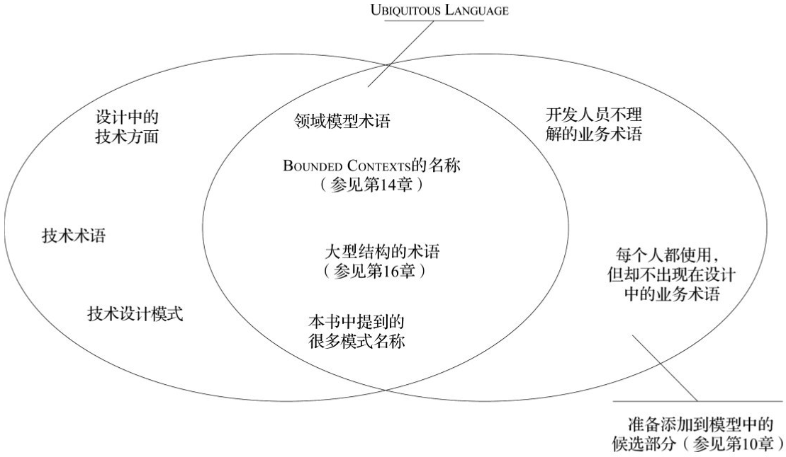{width="3.8409142607174105in" height="2.2373589238845146in"}

模型不是图(毕竟模型是一种对现实抽象的描述, 而图是具体的表达), 图只是帮助表达和解释模型的工具

文档还是需要持续更新啊!

但是敏捷开发里XP(极限编程)和一众TDD/BDD是只关注可执行代码和他的测试代码

### 第三章 绑定模型和实现

模型的抽象,设计, 不仅要反应实体的关系, 也要帮助实现的推进; 同时代码的实现也要准确反映模型的逻辑

Model Driven Design, emmmm讲的有点抽象, 但基本是上一句话的意思.

## 第二部分 DDD的构造块

构造块啥意思?

### 第四章 分离领域

#### layered architecture 分层架构

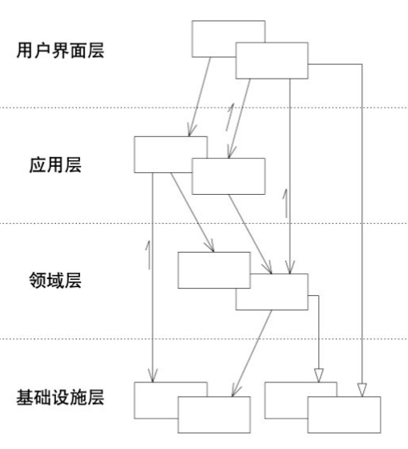{width="3.2948665791776026in" height="3.625in"}

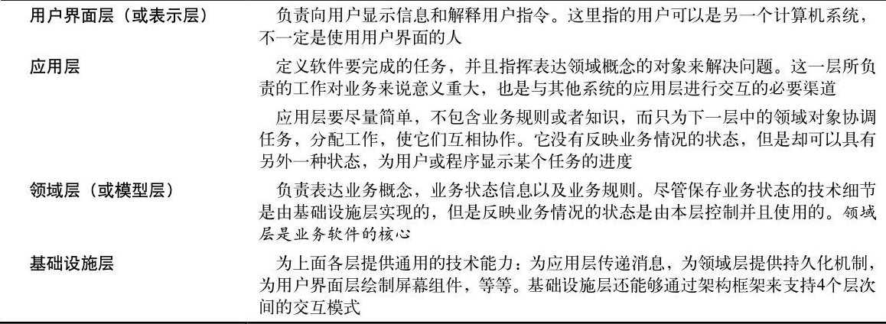{width="5.772222222222222in" height="2.113490813648294in"}

相比于MVC模式

V 对应 用户界面层

M 对应 基础设施层(通常在M中是被透明的) 和 领域层的阉割版(MVC中model是纯数据实体, 而DDD中不仅仅是数据实体, 还有在数据之上的逻辑处理)

C 对应 应用层

#### smart UI \"反模式\"

不懂

### 第五章 软件中所表示的模型

表示模型的3种模型元素模式: ENTITY(REFERENCE OBJECT), VALUE OBJECT, SERVICE

前两者尽量不包含操作/动作, 让service带有前两者+动作(有点像对象)

**关联/关系**

让关联变得更可控

1.  规定一个遍历方向

2.  添加限定符,减少多重关联(?意思是合边吗?)

3.  消除不必要的关联(不关注用上的关联)

**ENTITY**

具体实体,有明确的属性定义;**主要由标识定义的对象**(原文描述)

ENTITY可以是任何事物，只要满足两个条件即可，一是它在整个生命周期中具有连续性，二是它的区别并不是由那些对用户非常重要的属性决定的

比如: 用户, 账号, 设备

**VALUE OBJECT**

用于描述领域的某个方面而本身没有概念标识的对象称为VALUE OBJECT

VALUE OBJECT可以是其他对象的集合

看着像是实体的附属属性集合

比如: 处理事务, 书里举例的地址

**SERVICE**

当对象不是一个事物, 或者其他乱七八糟都会定义为service

SERVICE是作为接口提供的一种操作，它在模型中是独立的，它不像ENTITY和VALUE OBJECT那样具有封装的状态

特征:

1.  与领域概念相关的操作,但不是ENTITY,value object的组成部分

2.  接口由领域模型或其他元素定义

3.  操作是无状态的

在前两者的基础上创建(数据-\>数据+操作)

比如: 动作, 流程的抽象

**MODULE / PACKAGE**

MODULE为人们提供了两种观察模型的方式，一是可以在MODULE中查看细节，而不会被整个模型淹没，二是观察MODULE之间的关系，而不考虑其内部细节。

#### 建模范式

对象范式

领域模型不一定是对象模型, 因为关注的是抽象, 其他编程范式(原型, fp, 命令)也可以实现

4条检验规则

1.  不要和实现范式对抗

2.  不要一味依赖UML

3.  保持怀疑态度

4.  把通用语言作为依靠的基础

好, 很抽象..没一点具体指导啊

### 第六章 领域对象的生命周期

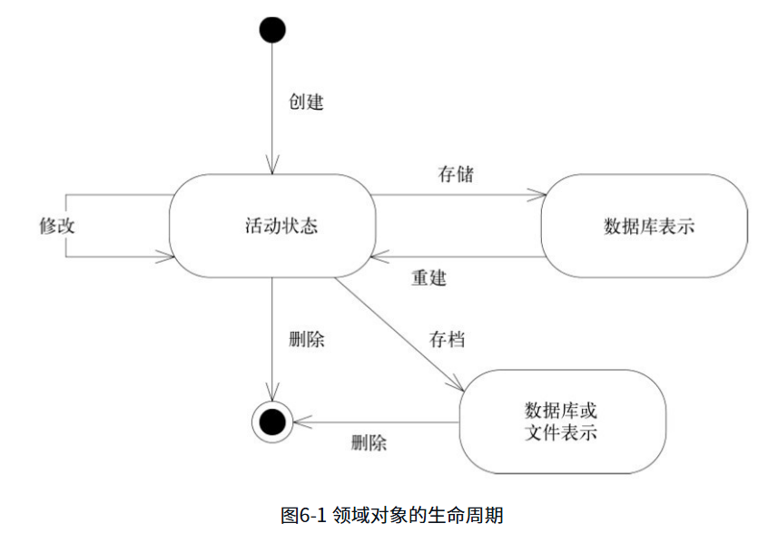{width="3.823880139982502in" height="2.6577329396325458in"}

可以理解为状态机变化?

主要挑战:

1.  在整个生命周期中维护完整性

2.  防止模型陷入管理生命周期复杂性造成的困境当中

#### 模式 Aggregate

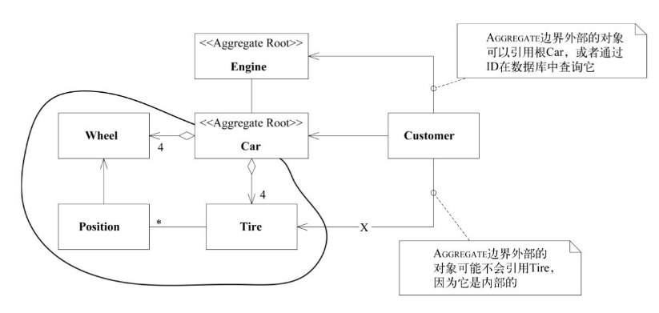{width="5.772222222222222in" height="2.742331583552056in"}

因为对象不是简单单一的, 会有复杂组合;

AGGREGATE就是一组相关对象的集合，我们把它作为数据修改的单元

#### 模式 Factory

类似设计模式里工厂模式,建造者模式

负责处理对象的生命周期开始

#### 模式 Repository

repo是将某种类型的所有对象表示为一个概念集合

repo管理生命周期的中间和结束

怎么理解呢, 比如对象需要作为记录存储在数据库, 而对应数据库的增删改查都是生命周期中间的变动. 最后删除持久化和内存就是结束了

### 第七章 使用语言

(应该说的模式语言)

继续用之前物流运输来举例说明具体设计

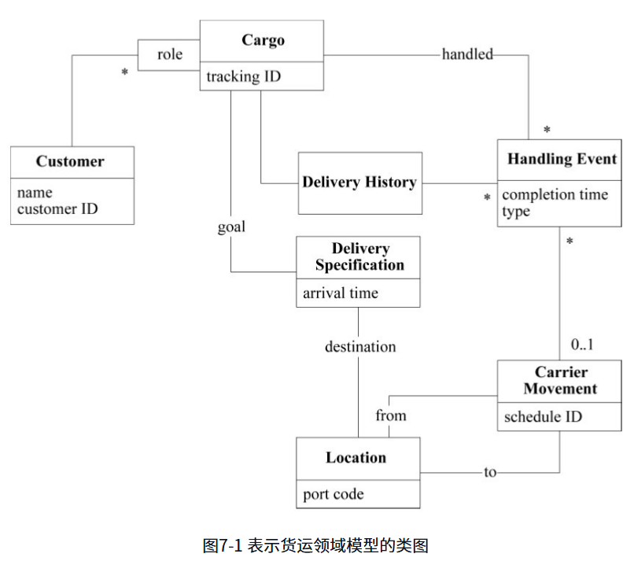{width="5.772222222222222in" height="5.106196412948382in"}

如何界定 entity和value object

这这章基本是围绕这个项目展开讲述处理方式

## 第三部分 通过重构来加深理解

### 第八章 突破

用了银行股份/借贷的模型举例

### 第九章 隐式概念转变为显式概念

多次有提到《重构》和《分析模式》两本书

如何做到概念的挖掘

不同于原来的\"名词即对象\", 还需要深挖名词后续的关系

然后有两个示例, 航线模型 / 利息计算器模型

**隐式概念**感觉像是一些实际实体中存在的属性, 或者是实际需求有需要的, 但是一开始设计不会最明显的目标而导致暂时被忽略了. 再版本不断迭代的过程中

#### 约束

模型中对象/实体的限制, 数据范围的规则等

比如超订策略

对Entity和value object的约束利用specification进行定义

specification

1.  验证对象, 检查是否满足某些需求(数据/权限校验等)

2.  从集合中选择对象(查找满足条件的特定对象)

3.  创建特殊的满足要求的对象(有点像特殊子类型)

### 第十章 柔性设计

supple design 为了使项目随开发工作加速推进, 防止设计老化停止, 需要易于修改

不断发掘**隐式概念**, 再显式表达出来, 然后以此进行迭代循环

防止过度设计

#### 模式 intention-revealing interfaces 释意接口

见名知意的定义; 保持信息隐藏, 封装的意义

#### 模式 side-effect-free function 无副作用函数

将操作宽泛定义为命令和查询; 一个查, 一个改

保持和SRP原则相符, 一个函数不要即干A又干B

不要隐藏带来副作用的操作, 比如暗含修改状态或者中间结果等

但总会有带状态的情况, 那么参考下面一个模式

#### 模式 assertion

无副作用函数处理完简单计算后; 断言模式让你可以处理带状态处理的;

但是封装的函数要限制好固定规则让状态保持是有效状态, 定义好\"不\"变量(比如FSM, 限制状态改变的规则)

限制前臵条件, 声明后臵条件

#### 模式 conceptual contour 概念轮廓

这个和重构比较挂钩, 和边界划分也很挂钩

一开始的模型设计抽象和实现不能完全反映bounded context(限界上下文), 那么就不能显示出概念轮廓, 需要在不断地实际过程中重复的重构, 慢慢使限界上下文变得清晰

#### 模式 standalone class 独立类

质疑所有类的耦合/依赖, 只保留确实需要的依赖, 去除所有不重要的依赖, 保持低耦合的整洁. 提取独立类

#### 模式 closure of operation 操作闭合

\"两个实数相乘，结果仍为实数（实数是所有有理数和所有无理数的集合）​。由于这一点永远成立，因此我们说实数的"乘法运算是闭合的\"

核心思想是: 一个方法的输入和输出都应该是同一类型对象, 至少在同一个概念层次上;

目的应该是为了保持操作观念不进行发散, 保持上下文

你看golang runtime的append等等, 但一般是在value object中体现

#### 声明式设计

代码生成? k8s的声明式编程吗? 后续描述不太一样.

有提到DSL, 更多像是规则引擎

### 第十一章 应用分析模式

详情看看分析模式

### 第十二章 将设计模式应用于模型

**策略模式**

**组合模式**

介绍了两种设计模式如何对应到模型上

还说明了没什么没有flyweight模式(原来这就是享元模式, 这翻译我是没想到的, 但这个模式也不太常用吧)

### 第十三章 通过重构得到更深层的理解

重要的三点

1.  以领域为本

2.  用一种不同的方式来看待事务

3.  始终坚持与领域专家对话

重构的起点: 不一定是代码有多烂, 可能是代码没有符合当前模型的表达, 也是可以做的

团队: 有点老生常谈, 头脑风暴, 发现隐式概念然后再抽象到具体

借鉴先前的经验: 根据别人相似的项目或者书籍的案例用以借鉴, 不要重复劳动

**重构与柔性设计的结合**

重构的时间点: anytime!

## 第四部分 战略设计

三个重要部分

1.  上下文: 限界上下文, 明确边界

2.  精炼: 提炼核心逻辑

3.  大型结构:

### 重点 第十四章 保持模型的完整性

#### bounded context限界上下文模式

有点像分层处理, 整体模型可以划分边界形成内部小模型, 之间再做组合

**这里是定义一个什么东西**

#### continuous integration 持续集成模式

CONTINUOUS INTEGRATION也有两个级别的操作：(1) 模型概念的集成；(2) 实现的集成

最基本的方法是对UBIQUITOUS LANGUAGE多加锤炼

**这里是如何持续优化这个东西**

#### context map上下文映射图模式

用于描述限界上下文的关系的

BOUNDED CONTEXT之间的代码重用是很危险的，应该避免

**这里是描述这个东西之间的关系**

测试context的边界

#### shared kernel 共享内核模式

多个模型间的共享子集

SHARED KERNEL通常是CORE DOMAIN，或是一组GENERIC SUBDOMAIN（通用子领域）​，也可能二者兼有

要么核心功能, 要么基础功能

#### customer/supplier development team 上下游开发团队模式

当上下游团队分隔再两个限界上下文时. 一方对另一方有否决权.会限制开发自由

XP又对此有说法(多人频繁修改有关的, 感觉都和极限编程有关)

如何定义两者的制约关系

#### conformist 追随者模式

当上下游团队, 不是同一个管理者, 而且两者的OKR不一致时, 两者目标不一致而导致无法推进

可能解决途径:

1.  完全放弃对上游的依赖(走向SEPARATE WAY)

2.  如果上游的模型设计难以使用, 还是需要开发自己的模型, 进行接口转换(ANTICORRUPTION LAYER)

3.  如果上游还可以接受, 就是使用本章的追随者模式

我纳闷了, 你的改动他都不支持了, 你还追随个啥?

#### ANTICORRUPTION LAYER 防腐层模式

这个分层架构中的repo层有出现过(数据接入层)

当你依赖的数据无法直接使用时, 可以不先直接替换, 而是通过防腐层做数据清洗转换, 转变成可以用的数据

算是一个隔离层, 转换层?

#### SEPARATE WAY 分离模式

集成总是代价高昂，而有时获益却很小

降低耦合, 不依赖了, 数据和实现直接自治完全独立

#### OPEN HOST SERVICE 开放主机模式

一个子系统被大量系统集成, 不要所有的都去做集成逻辑, 而是定义一个开放协议(你看MCP, otel)

#### PUBLISHED LANGUAGE 公共语言模式

感觉和上面的有点像啊, 都是说通信的问题, 提供标准化接口,就是比如rpc, soap, rest这些

重构后淘汰方式

1.  确定遗留系统的哪个功能可以在一个迭代中被添加到某个新系统中；

2.  确定需要在ANTICORRUPTION LAYER中添加的功能；

3.  实现；

4.  部署；

### 重点 第十五章 战略精炼

领域模型的战略精炼包括以下部分：

1.  帮助所有团队成员掌握系统的总体设计以及各部分如何协调工作；

2.  找到一个具有适度规模的核心模型并把它添加到通用语言中，从而促进沟通；

3.  指导重构；

4.  专注于模型中最有价值的那部分；

5.  指导外包、现成组件的使用以及任务委派。

**core domain 模式**

提取核心领域, 好钢用在刀刃上, 核心领域难点, 让牛逼的人上

**generic subdomain 模式**

看着像公共库, 因为下面描述有已有方案或开源项目的. 算是业务绑定不太强的方面

1.  现成的解决方案

2.  公开的设计/模型(开源)

3.  实现外包出去(牛逼, 我学架构, 你教我外包)

4.  内部实现

**domain vision statement 模式**

领域愿景, 看着就很虚

书里描述也是对核心领域的简短说明

**highlighted core 模式**

高亮核心区域, 让人围绕着做进展(为啥这也能作为一种模式)

**cohesive mechanism 模式**

内聚机制, 将复杂模型改成一个单独的轻量框架; 看着和generic subdomain很像;

两者动机都是一样的, 为了给core domain减负

COHESIVE MECHANISM并不表示领域，它的目的是解决描述性模型所提出来的一些复杂的计算问题

模型提出问题，COHESIVE MECHANISM解决问题

**segregated core 模式**

重构! 分裂!

1.  识别出core的子领域(可以从精炼文档中提取, 你还联动上了)

2.  将相关类移到新的module中

3.  对原有代码进行重构, 修改调用

4.  对新的segregated core module进行重构, 修改对外接口, 内部交互

5.  重复以上工作(这就不用说了吧)

**absract core 模式**

core domain太多细节, 而难以表达整体; 即便是分解成多个小领域, 也是难以表达, 反而更复杂了

于是, 这个方法换了个切割的方向, 不是从技术上把模型切分, 而是增加表达层, 输出简化的视图

**重构的目标和时机**(文中观点和常见的不一样, 看看15.11)

### 第十六章 大型结构

**这章我没咋看**

"大型结构"是一种语言，人们可以用它来从大局上讨论和理解系统

**evolving order 模式**

**system metaphor 模式**

系统隐喻?

**responsibility layer 模式**

和组织架构相似, 按职责分层

**knowledge level 模式**

**plubgable component framework 模式**

### 第十七章 DDD的综合运用

这章吹牛逼的

# 书 - 解构领域驱动设计

### 第一章 软件复杂度

又是将架构比作城市规划;

提到两种能力: 理解能力, 预测能力

**理解能力 = 规模 + 结构**

第一要素=**规模**

需求决定规模; 规模扩张速度依赖于需求的增长速度

**结构**决定了系统的复杂度

结构要与开发/设计团队保持一致

防止无序设计

**预测能力 = 变化;** 防止 **过度设计** 和 **设计不足**

影响复杂度三要素: 规模, 结构, 变化

### 第二章 DDD概览

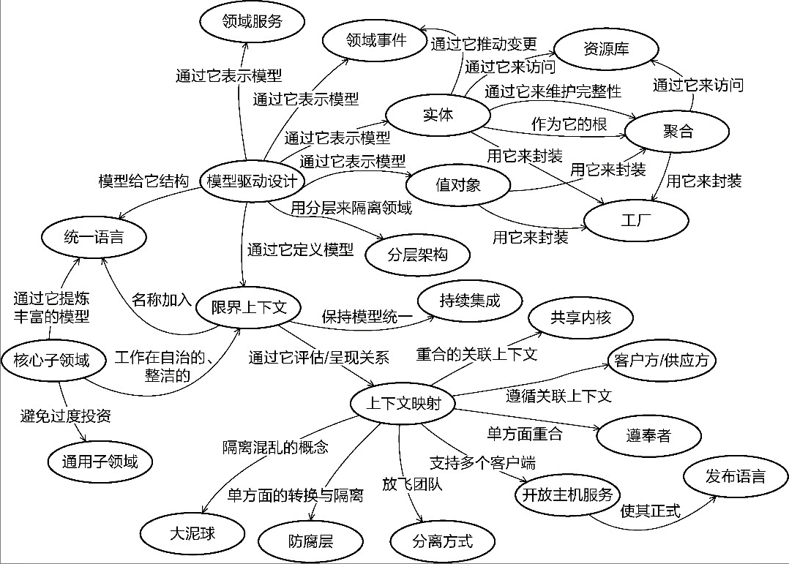{width="5.772222222222222in" height="4.128370516185477in"}

限界上下文可以参考DDD中的十四章

下面表示模型间关系的上下文映射也是十四章的内容

问题空间(现实世界问题) - 解空间(系统实现解决问题)

对抽象问题, 具现化表达, 具现化实现解决方案

也可以说是对现实问题, 抽象成数学模型, 再转化到具体实现的系统

**战略设计:**

划分限界上下文, 以及限界上下文之间的映射关系

**问题空间的分解**

识别出核心子领域(DDD中的core domain), 通用子领域(generic subdomain), 支撑子领域(这没见过, DDD没说)

解空间做对应的架构依赖, 比如限界上下文的映射关系, 维护完整性

**战术设计:**

限界上下文内部的领域建模

这里的可以参考DDD第六章, 领域对象的生命周期三种模式

聚合, 工厂, 仓库

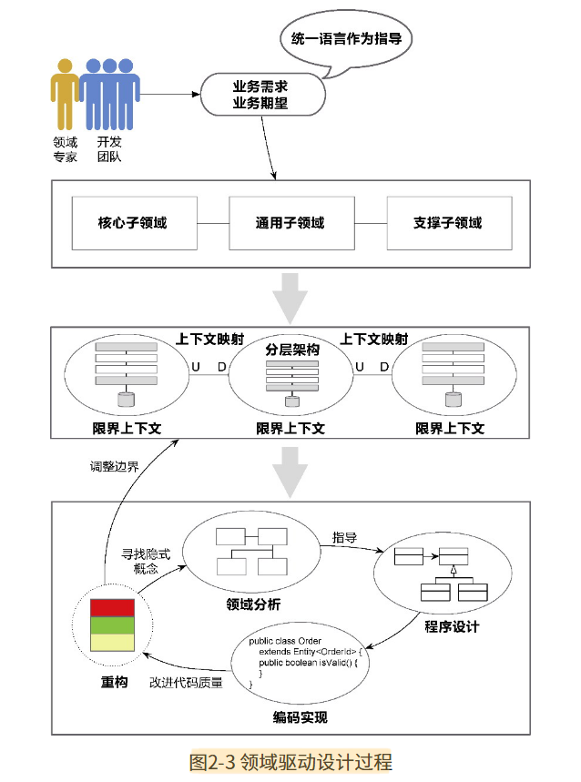{width="5.772222222222222in" height="7.77169072615923in"}

保持清晰的结构

业务需求-\>业务复杂度

系统实现-\>技术复杂度

两者并非独立

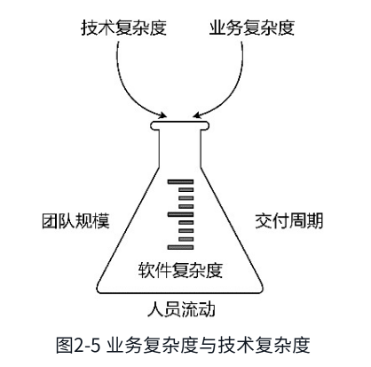{width="4.354166666666667in" height="4.302083333333333in"}

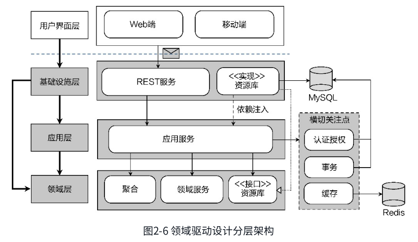{width="5.772222222222222in" height="3.3421708223972004in"}

上面这个图不对吧? repo层应该是最底下, 领域层调用, 应用层主要是编排领域层

### 第三章 DDD的统一过程

不要照本宣科, 依葫芦画瓢;

灵活使用思想

**社区增加的新概念:**

支撑子领域(怪不得我前面没看过)

领域事件

事件溯源

CQRS模式

**限界上下文映射也增加了:**

发布者/订阅者模式 (Pub/Sub)

菱形对称架构模式

**领域建模阶段**

角色构造型

服务驱动设计

**不足之处**

因为是作为一个思想指导, 一种方法论的概念; 所以没有具体的执行过程规范, 所以**缺乏规范的统一过程**算是不足之一

具体的需求如何设计映射到模型, 也是一个机器抽象的过程, 有大概的模式指导, 但是没有明确的评判方式; **缺乏匹配的需求分析方法**

在服务划分的层面, 没有明确的模型对应关系, **缺乏规范化的,具有指导意义的架构体系**

服务内如何进行架构编排也没哟明确的方式, 分层架构较为模糊, **缺乏固化的指导方法**

这本书针对上面的问题, 建立了**DDDUP, 领域驱动设计统一过程**

全局分析阶段

架构映射阶段

领域建模阶段

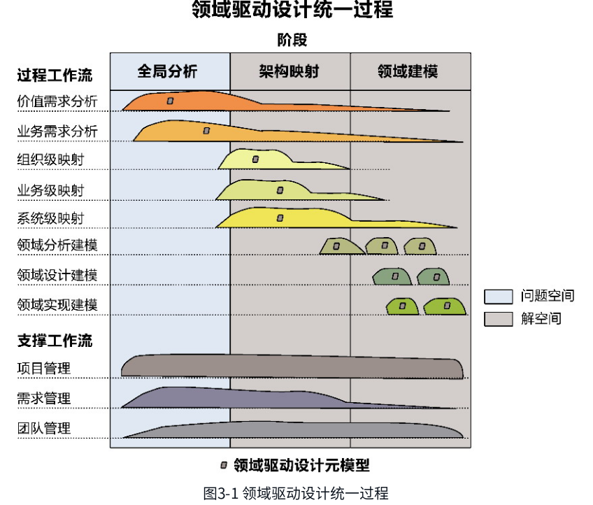{width="5.772222222222222in" height="4.914557086614173in"}

**全局分析阶段**

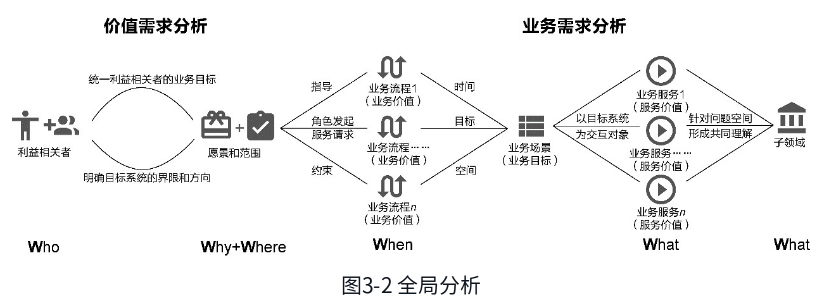{width="5.772222222222222in" height="2.107872922134733in"}

粗粒度的分析

不仅从角色角度做需求分析, 还有业务领域的需求分析, 且还有项目的里程碑点

**架构映射阶段**

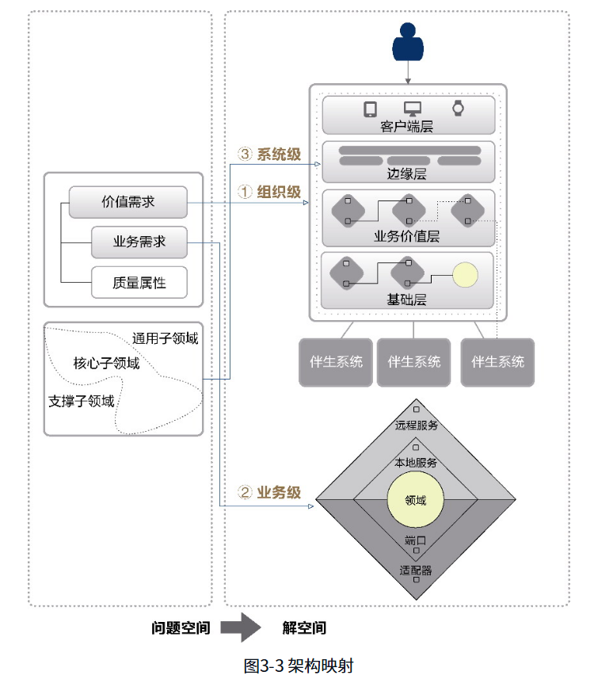{width="5.772222222222222in" height="6.634207130358705in"}

通过组织级映射, 业务级映射, 系统级映射

这三个我觉得我是不一定的, 根据公司规模会有重合的地方

组织级映射一般是跨中心/部门的划分

业务级映射同架构组织内不同分组的划分

系统级映射就到了具体系统的(可能一个开发者, 也可能数个)

但是业务和系统可能是一个级别, 也可能因为复杂业务而有拆分

业务级的限界上下文的内部架构遵循**菱形对称架构模式**; 就是上面个业务级那个

系统级上下文的分层架构:

支撑子领域和通用子领域映射为基础层

~~通用是业务通用逻辑~~

~~支撑是从通用分离出来, 更多是外部工具依赖~~

~~理解有误, 看下面第四章~~

边缘层接近用户体验层

**领域建模阶段**

这三个阶段并不是完全按时间推移而进行的

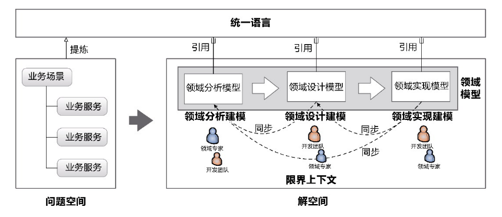{width="5.772222222222222in" height="2.502879483814523in"}

分析模型; 需求分析/抽象/边界划分的阶段

设计模型; 需求分解/组合/选型/定系统架构的阶段

实现模型; 需求编码实现的阶段

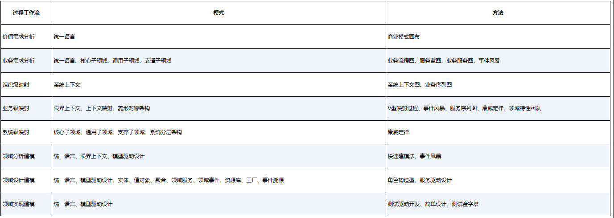{width="5.772222222222222in" height="2.0582141294838143in"}

下一篇开始重点讲全局分析

**业务服务是作为全局分析阶段的基本单元**

**架构映射**

**领域建模**

### 第四章 问题空间探索

前面提到的5W模型

6W要素中的前5个要素皆与问题空间需要探索的内容存在对应关系。(6W还有一个hoW)

-   Who：利益相关者

-   Why：系统愿景

-   Where：系统范围

-   When：业务流程

-   What：业务服务

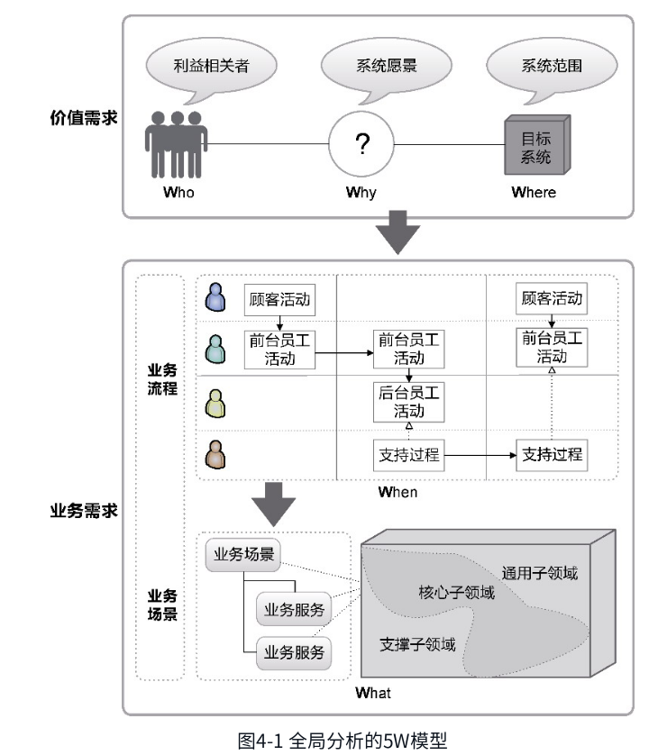{width="5.772222222222222in" height="6.5366513560804895in"}

为了**谁**的**某些利益/好处**而到某个地方/领域/业务方向做出**某些改变/目标**

这里前三个W组成了价值需求, 也是有这个业务/需求的基础

而业务需求有动态和静态组成; what=静态的结构; when=系统实际运行后数据流向, 动作交互的过程/流程

核心子领域: 具有不可替代的作用，满足了最重要的利益相关者的价值需求

通用子领域: 业务需求的一部分，但在面向各个领域的业务系统中都能看到，又不可或缺，形成了不具有个性特征的通用功能

支撑子领域: 某个业务服务为另外一些提供了核心价值的业务服务提供支撑，具有辅助价值却又不具有通用意义

我前面的理解可能把通用和支撑弄反了(已修改)

中间举例的了沟通,建模,表达的方式

DDD的事件风暴层次:

-   探索业务全景

-   领域分析建模

### 第五章 价值需求分析

前面的3个W

讨论了既得利益者

愿景方向(业务的发展方向)

系统范围, 保证系统的内聚性和可扩展性

### 第六章 业务需求分析

后两个W

两个关键点: **完整** 和 **边界**

因为这里是限界上下文内的, DDD中就有保证限界上下文完整性的模式方法

而边界的话也是上下文映射关系中需要理清, 划分的

不同业务流程的分类

从特征上:

-   主业务流

-   变体业务流

-   支撑业务流

从发起者看:

-   外部业务流

-   内部业务流

-   管理业务流

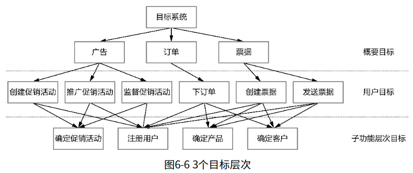{width="5.772222222222222in" height="2.4233442694663165in"}

角色, 系统/服务 作为 静态

执行序列 作为 动态

有点像, 静态的座位图的节点, 而每次数据流动/调用作为连接点的边, 而执行序列是其中一条链/路径

**如何表示业务服务**

服务图

利用WHO,WHAT,WHY,WHERE

1作为用户, 2作为服务, 3作为具体调用功能, 4作为边界划分(不显式)

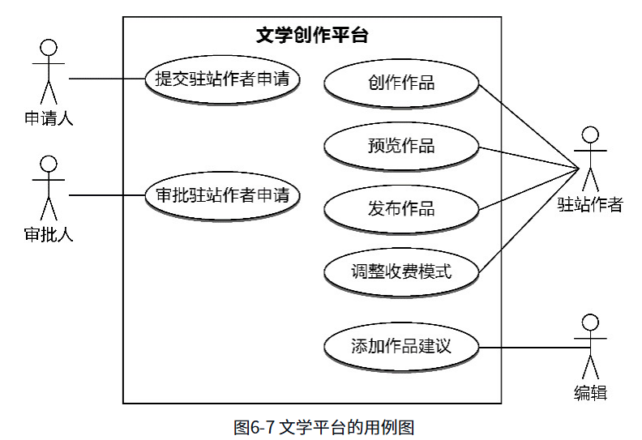{width="5.772222222222222in" height="3.957470472440945in"}

而WHEN则是做时序图表示了

**子领域**

子领域也算是限界上下文内的属性了

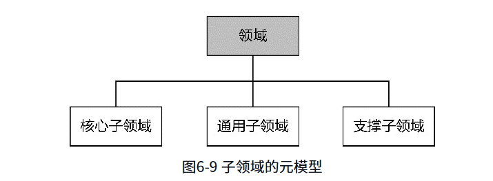{width="5.772222222222222in" height="2.1232086614173227in"}

核心域: 系统/业务最核心的资产/实现/服务; 比如你是电商的话, 最核心的就是商品/订单/仓储等系统

通用域和支撑域的界定都就很模糊了, 因为两个都是通用的, 基础的

可能通用域会被更多的其他域共同引用

而支撑域只被少量的核心域引用他特别的能力

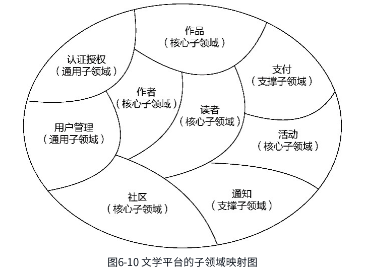{width="5.772222222222222in" height="4.226654636920385in"}

**下面第三部分架构映射, 暂时不做多级标题了**

这里讲的是服务间的关系了

限界上下文是架构映射阶段的基本架构单元

限界上下文会作为一个服务

### 第七章 同构系统

同构系统, 表明两个复杂结构可以互相映射的

就是问题空间 -\> 解空间

-   架构映射的概念层次: 定义的概念(抽象), 设计的模式(具体)

-   架构映射的设计层次: 问题空间的真实逻辑(抽象), 解空间的软件实现(具体)

-   架构映射的管理层次: 组织架构映射

清晰的架构, 可以控制整体软件系统的复杂度

**TOGAF架构开发方法 ADM**

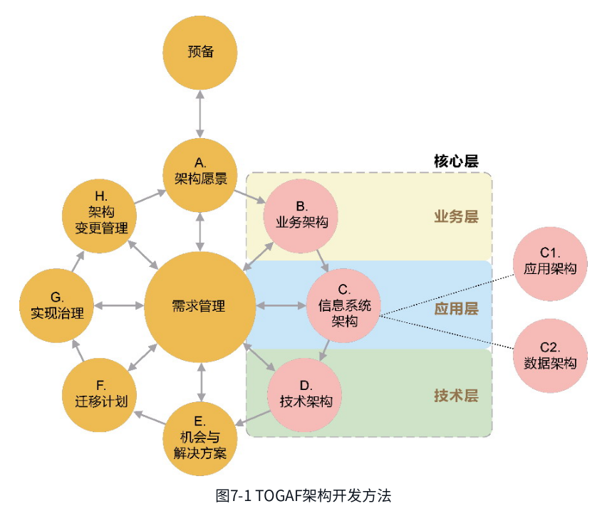{width="5.772222222222222in" height="4.816959755030621in"}\
在上图中, 业务架构需要变动的时候, 需要共同顺应变化的方向; 需要找到一种\"软件元素\"连接起业务架构和应用架构; 没错,**这个软件元素就是限界上下文**;

限界上下文是根据领域知识语境对业务进行的功能分解，体现了独立的业务能力

那么我们要做的是**边界的划分**

**映射关系**

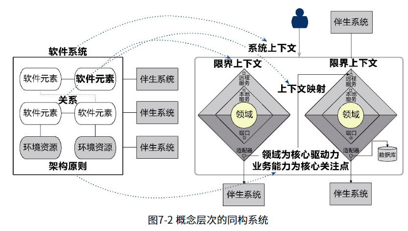{width="5.772222222222222in" height="3.2776246719160107in"}

2PTs规则 这个感觉和管理知识有点关系

就是N=n(n-1)/2 说明随着人数变多, 关系变的复杂

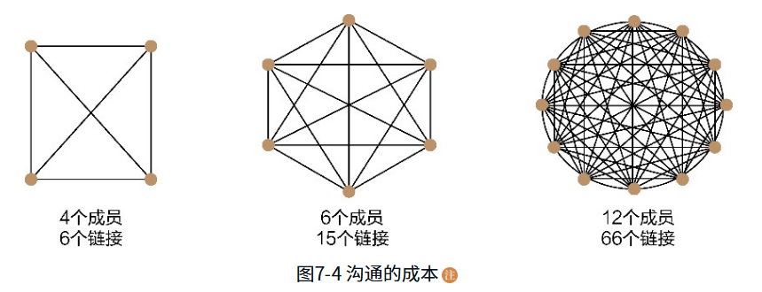{width="5.772222222222222in" height="2.2175010936132984in"}

康威定律

任何组织在设计一套系统时, 所交付的设计方案都与该组织的 沟通结构保持一致

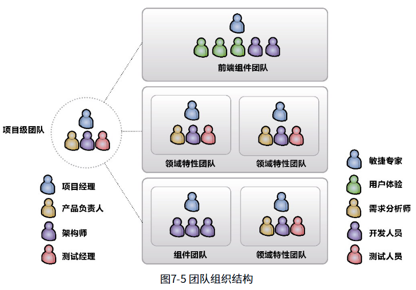{width="5.772222222222222in" height="4.032746062992126in"}

### 第八章 系统上下文

系统上下文来自C4模型, (文章: **可视化架构设计\--C4介绍**)

System Context 系统上下文

Container 容器

Component 组件\
Class 类

划分玩系统上下文之后还需要去寻找系统范围外的关联, 这与伴生系统有关(算是外部的依赖/耦合)

如何确定系统上下文

文中还是利益相关者为起点, 通过愿景(想做什么), 其实就是需求为起点, 延伸动作; 在一系列的动作后可以完成愿景的全部/一部分(如果有拆解); 那么就确定的系统的边界

### 第九章 限界上下文

前面系统上下文更像完成一个大需求目标的服务集合

而限界上下文就是确定到服务了

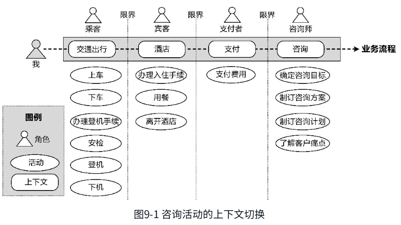{width="5.772222222222222in" height="3.2375568678915134in"}

业务特征:

领域模型的知识语境

业务能力的纵向切分(垂直)

他还是自治的架构单元

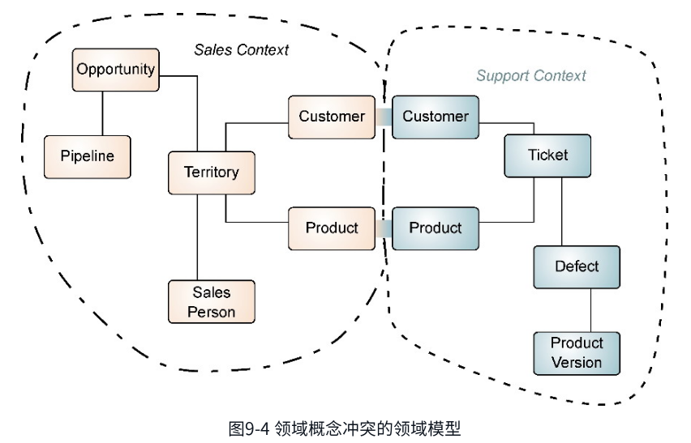{width="5.772222222222222in" height="3.70587489063867in"}

这些概念冲突, 除了上下文映射关系, 还存在不同上下文内的概念不同

(可以看看Martin Fowler的限界上下文的文章)

模块和限界上下文的区别

前者可能是服务的组件或者共享组件库

而后者是完整的服务, 可以是前者的集合组合而成

限界上下文内模块的共用导致分布式大泥球

这里针对被过多引用的模块, 进行解耦, 不直接静态耦合, 而是通过其他方式进行通信共享

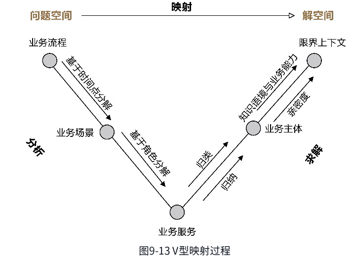{width="5.772222222222222in" height="4.246418416447944in"}

如何分析业务/工作流设计限界上下文

时间点调用过程

角色的动机, 动向

**知识语境**

**归纳然后寻找相关性**

整理后还需要再看上下文间的亲密度, 考虑是否可以组合

验证原则

1.  正交原则(相关)

2.  单一抽象层次原则(内聚)

3.  奥卡姆剃刀原理(直接)

### 第十章 上下文映射

这章讲到服务间的关系

主要因为业务演进的过程中, 出现上下间模糊的定义, 需要进行重构, 清晰他们之间的边界

DDD十四章中的模式之后, 增加了

-   合作关系模式

-   大泥球模式

-   发布者/订阅者模式

可以整体分类为两类

-   通信集成模式

-   团队协作模式

### 第十一章 服务契约设计

消息契约的类型

命令(写)

查询(读)

事件(这个是相对DDD新增的, 对应事件驱动的模式)

契约就是通信的协议/约定/接口参数结构这类

根据不同的类型:

-   面向资源的服务建模-\>服务资源契约

-   面相行为的服务建模-\>服务行为契约

一个获取数据资源, 一个实现某中愿景的动作

REST风格会相似, REST风格将其抽象成名词(资源), 动词(行为)

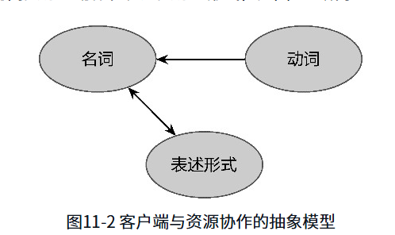{width="5.1875in" height="3.0833333333333335in"}

相对前面的直接调用依赖, 还存在契约的前置后置约束; 事件只是利用通信方式传递事件的发生, 不需要关注调用的约束, 事件循环各自处理, 完全解耦

### 第十二章 领域驱动架构

#### 菱形对称架构

六边形架构(hexagonal architecture)又被称为端口适配器(port and adapter)

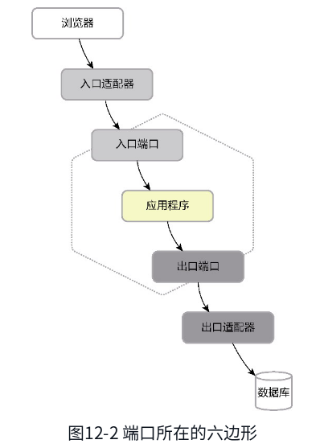{width="1.9270833333333333in" height="3.03125in"}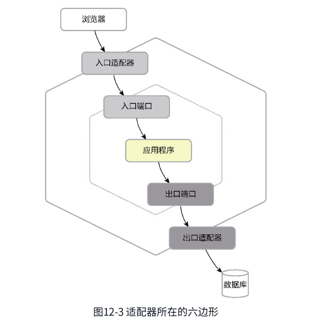{width="2.897222222222222in" height="3.272510936132983in"}

内部边界 / 外部边界

内部-\>领域六边形

外部-\>应用六边形

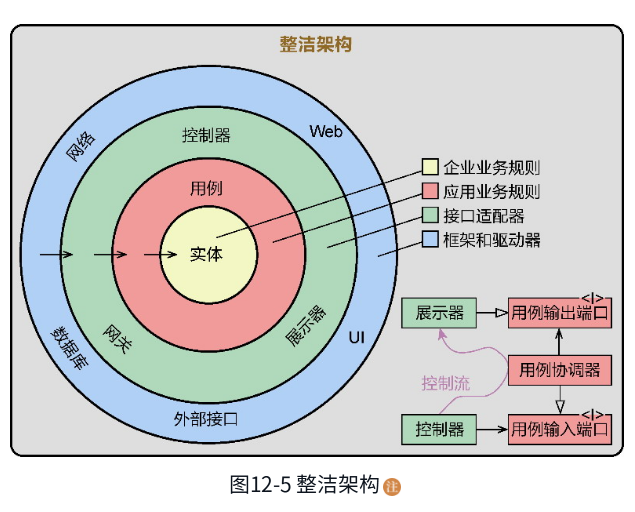{width="5.772222222222222in" height="4.65413823272091in"}

边界的划分和整洁架构还是相似的(我得重看整洁架构之道了)

上面都是服务的边界设计

服务内部结构设计就是大家都有听过的分层架构(ava圈吹的DDD架构取代MVC)

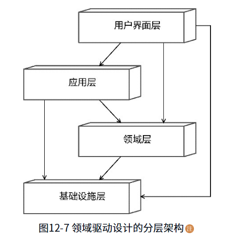{width="4.864583333333333in" height="5.083333333333333in"}

每层级的职责

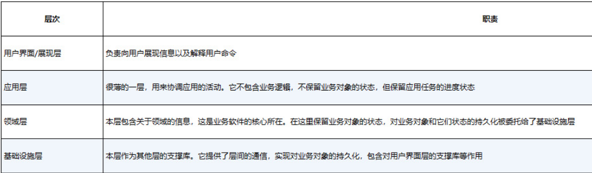{width="5.772222222222222in" height="1.6930336832895887in"}

分层数量的权衡

太多, 会有引入过多间接的不必要的开支

太少, 导致关注点不够分离, 进而系统结构不合理

后续就是演进到菱形对称架构

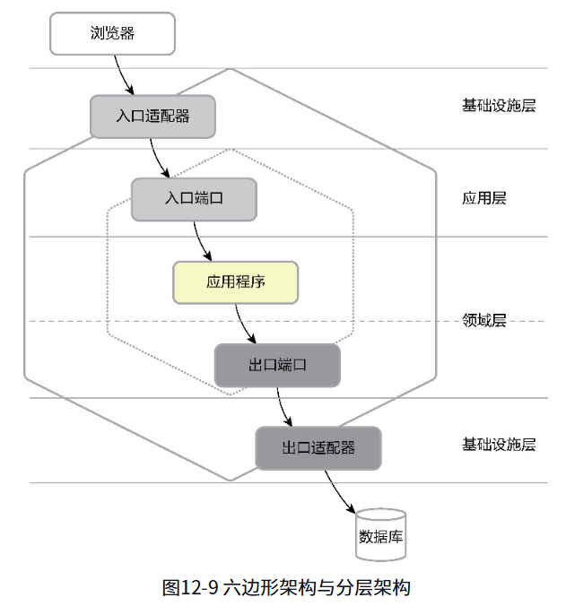{width="5.772222222222222in" height="6.183870297462817in"}

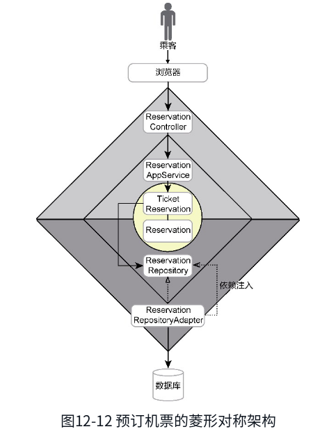{width="4.927083333333333in" height="6.53125in"}

引入开放主机服务(和北向网关一致)

引入防腐层(南向网关的端口的抽象)

引入发布语言(北向网关的服务契约)

菱形对称架构和分层架构的对应

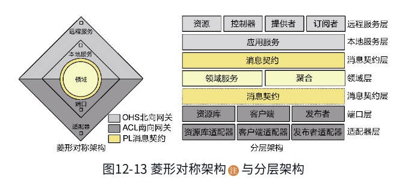{width="5.772222222222222in" height="2.518480971128609in"}

上下文映射的模式

下游团队依赖上游团队, 而上游团队回应很少

就会选择遵奉者/追随者模式

如果上游团队的服务足够稳定, 方便复用, 那就是共享内核模式

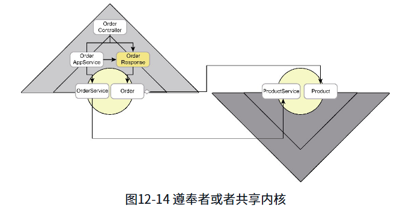{width="5.772222222222222in" height="3.042117235345582in"}

利用防腐层 + 开放主机服务的模式

一边是独立的服务, 一边是适配公共服务的适配层

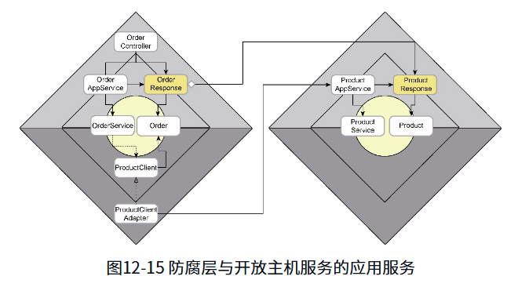{width="5.772222222222222in" height="3.200959098862642in"}

分离模式

这种就是直接不跟你玩了, 我自己维护一套

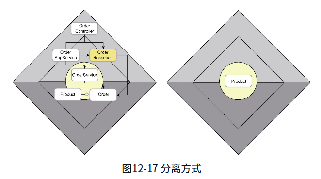{width="5.772222222222222in" height="3.2174475065616797in"}

以上三种情况分别对应的是

1.  领域模型依赖(静态领域耦合)

2.  消息契约模型依赖(动态领域耦合)

3.  无模型依赖(无耦合)

**更加动态灵活的模式:**

1.  客户方/供应方模式

2.  发布者/订阅者模式

1我觉得还是和前面的点2相似的

2 的话就是通信方式解耦了, 利用异步的方式通信

**关注点分离啥意思?**

#### DDD架构风格

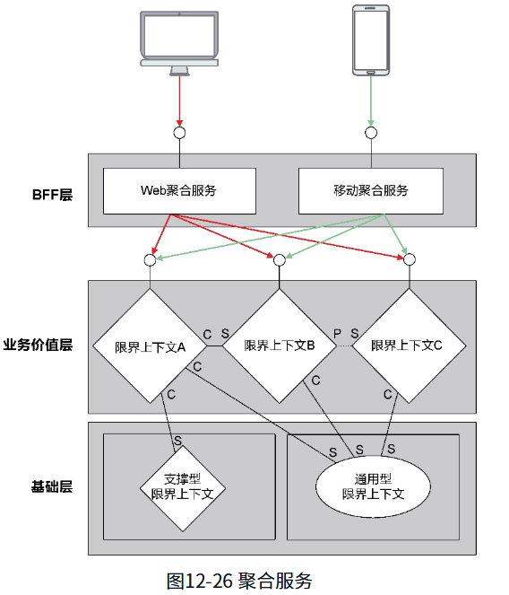{width="5.772222222222222in" height="6.7376465441819775in"}

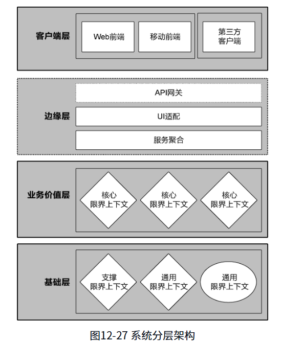{width="5.739583333333333in" height="7.010416666666667in"}

下一篇章, 领域建模

从分析, 设计, 实现模型讲(DDD里面这些内容是在更前置的, 这本书是讲第四部分相关, 再讲第三部分)

重点还提了聚合 AGGREGATE (就是关联entity, value object那个) 和 factort, repository有关

### 第十三章 模型驱动设计

模型的设计不是战略层次, 系统间的设计, 而是进入到服务/限界上下文内部进行设计

模型最好的表达: 图形/图表

每一次建模活动都是一次对知识的**提炼和转换**，产出的成果就是各个建模活动的模型

**分析活动(分析模型)**: 观察真实世界的需求(问题空间), 对知识的提炼

**设计活动(设计模型)**: 这一步就很模糊了, **软件设计方法**是什么? 哪些方法, 之前提到的各种模式吗? 利用他去提炼知识, 转换知识的表达

**实现活动(实现模型)**: 编码实现模型设计的抽象, 将具现化到可运行的软件

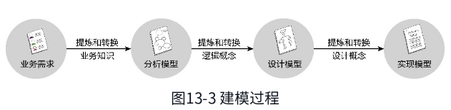{width="5.772222222222222in" height="1.4178991688538933in"}

但这种关系并不完全是递进, 这是一个漫长迭代的过程

不同的模型类型:

-   数据模型: 关注数据实体和之间的关系

-   服务模型: 关注客户端的请求, 和服务端的响应

-   领域模型: 业务需求的领域知识的逻辑概念

我觉得他们之间不是互斥的关系, 应该需要互相融合

不过领域模型这个概念确实是模糊的, 抽象的, 哪怕EE,和这本书的作者也没有很好的描述, 只有相关的定义, 特征和具体的例子说明

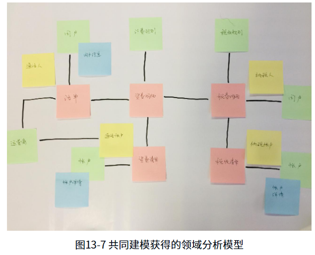{width="5.772222222222222in" height="4.681408573928259in"}

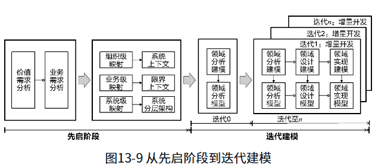{width="5.772222222222222in" height="2.5705139982502185in"}

### 第十四章 领域分析建模

前面都是定义, 或者模式类型, 终于来点方法指导了

**名词动词法**: 将问题描述记录, 然后划出名词, 动词; 就是识别出对象和对象的动作

这样很大程度上可以确定who,what和why

但是可能会有隐藏的领域概念被遗漏(我觉得被遗漏不是问题, 后续迭代也是需要不断发现隐式概念然后重构的)

**时标架构型**

前面动词只描述了动作的内容, 这里增加对动作发生的时刻/时段, 更细致描述when

**快速建模法**

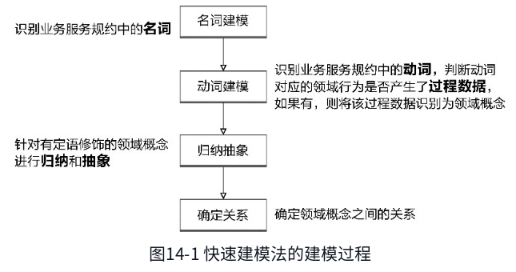{width="5.772222222222222in" height="3.0427220034995623in"}

算是改进方案

构建一个图

名词作为节点, 动词作为边

再构建一个时序图

将动作按时间排序

**归纳抽象**这又是难点, 如何点和边, 什么样的需要拆分, 什么样的需要合并;

有修饰的可能是有共性的

但不同动作(边)流入/流出的一个点, 是有可能拆分的, 因为动作可能不是一个领域内的

主要还是要找**共性/相似**

最终要将这些建模映射到限界上下文

领域提炼时的3种情况

1.  名称不同,含义相同的类: 相近概念

2.  名称相同,含义不同的类: 可能是作为不同主体的同样的副属性

3.  名称相同,含义相同的类: 重复定义, 大概率可以合并

(都不同就是不同, 不用多想)

### 第十五章 领域模型设计要素

前面一章是分析阶段, 这里的话到了设计阶段, 就是工程师开始主导了(设计和实现是工程师主导, 架构师辅助)

已经得到分析模型对问题空间/现实世界的业务抽象之后, 这一步就是考虑模型到落地的工程化了

更多的开始考虑分布式系统架构书里的三要素了

**通信方式, 一致性要求, 协调方式**

面对的问题:

1.  领域模型对象如何实现数据的持久化?

2.  领域模型对象的加载以及对象之间的关系如何处理?

3.  领域模型对象在身份上是否存在明确的差别?

4.  领域模型对象彼此之间如何做到弱依赖地完成状态的变更通知?

之前有个战略设计的图

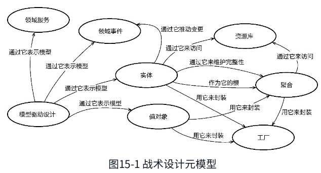{width="5.772222222222222in" height="3.122826990376203in"}

右边三个就是对应DDD第六章中领域对象的生命周期三种模式

服务, 事件, 实体, 值对象就是构造块的三元素, 事件是新增的

问题1: repo方式隔离业务领域逻辑, 通过数据进行实现

问题2: agg聚合的方式整合相近属性的实体和值对象, 划分出类的边界

问题3: 实体和值对象作为模型对象的身份区别(其实这里我从DDD开始就不太明白)

问题4: 这里的话没有模式解决, 之前的pub/sub也是限界上下文之间的, 这里是服务内的问题; 但这里还是写了pub/sub的方式, 那就是服务内对象间的pub/sub, 或者用channel;(反正非直接调用通信就好)

实体和值对象的区别

例如以如下格式进行描述

描述实体：这是人

描述分量：它有1米长

描述性质：这是白色

实体: 谓语描述的主语(人, 狗, 车)

值对象: 主体对象的属性(多高, 多重, 颜色)

领域事件: 就是事件驱动里, who发生了状态变化的事

领域服务: 他就是服务, 上面都在这里的

**实体**的三要素:

1.  身份标识(没有id的就不是实体!)

2.  属性(静态的属性特征)

3.  领域行为(动态特征,行为)

行为又分为外部变更状态, 自我状态修改, 其他实体互为协作

建模时, 优先考虑值对象, 当不满足时再上升到实体(防止过度)

他俩的区别:

1.  是否有身份标识

2.  对象的属性值是否会变化, 变化之后是完全不同的对象, 还是原有身份(那还是围绕身份或者说本质)

3.  生命周期的管理, 值对象是没有生命周期的, 作为实体的伴生, 或者是即用即丢的

**值对象**尽量保持不变性, 实体的值对象的数值修改可以看作是替换了新的值对象

值对象也可以拥有领域行为(这让我有点疑惑的, DDD中应该是说行为都留给service, 但确实,实体/类也应该有自己的方法, 不过值竟然也有)

但往往是验证/组合/运算的行为(那说的通了, 都是基础的数值相关操作)

15.3.4值对象的优势这里说的挺好的.

不过你要真的非常细致的去定义值对象类型的话也会非常繁杂, 还是尽量看需求吧

重头戏: **聚合 AGGREGATE**!

OOP中类的关系

-   泛化: 继承/派生, 抽象到具体的反向, 具体到抽象就是泛化

-   关联: 关联关系, 对应关系或者说包含关系, 1:1, 1:n, n:m; 或者说组合(go老熟了)

-   依赖: 算是行为的实现上依赖, 而不是定义上的关联了(上面两个算是定义/属性上的关联, 这里算是行为/方法上的依赖)

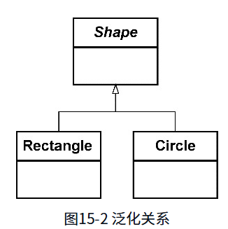{width="3.3958333333333335in" height="3.40625in"}

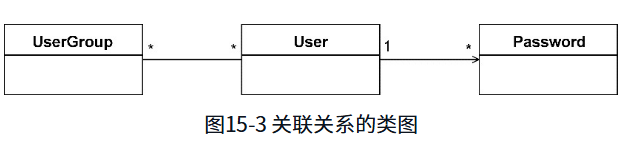{width="5.772222222222222in" height="1.3477810586176728in"}

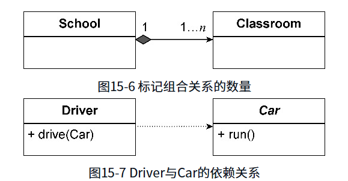{width="5.772222222222222in" height="3.0107272528433944in"}

对象间的边界划分, 纵使真实世界的逻辑关系是非常复杂的, 但设计模式并不是真实世界的简单映射, 应该对他做出边界划分, 归类;

还是按照高内聚低耦合的原则;

保留对外的交互边界对象, 隐藏内部对象(边界三要素! 信息隐藏! 内聚! 耦合!)

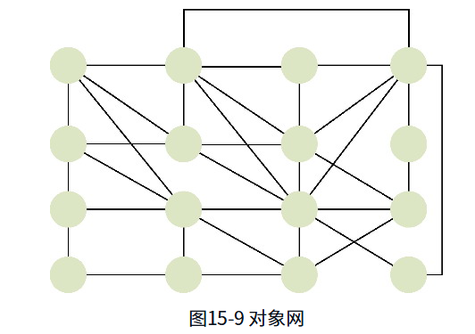{width="5.541666666666667in" height="3.90625in"}

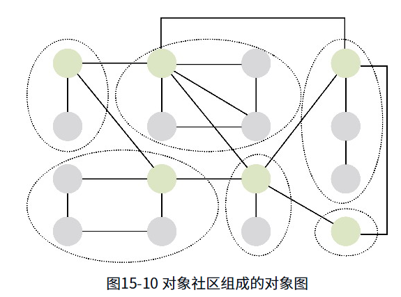{width="5.772222222222222in" height="4.2865026246719165in"}

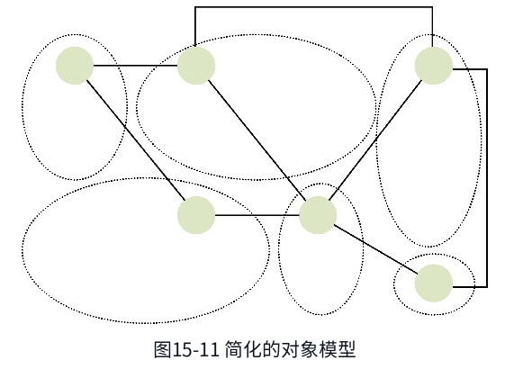{width="5.772222222222222in" height="4.144678477690289in"}

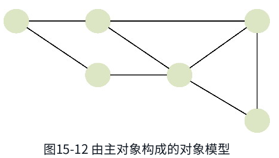{width="4.822916666666667in" height="2.7395833333333335in"}

我懂了, 这就是聚合 AGGREGATE!

注意保持聚合的

**完整性(内聚)**

**独立性(耦合)**

**不变量(**在**数据变化**时必须保持的**一致性规则**，涉及聚合成员之间的**内部关系**, 算是保持模型定义完整**)**

**一致性原则(**保证行为上的事务的一致性**)**

文中举例聚合的**关联关系**, 对象A包含对象B时, A需要和B的生命周期对齐的; 不然的话最好只是存B的id, 再去查找B的信息来使用; 但是实际情况上确实有很多会存其他对象的指针; 这种情况下, 需要注意生命周期的对齐, 或者要思考这个指针是否是作为一个寻址/获取数据的ID呢?

**关联更像是组合**

**依赖关系**

耦合度是弱于关联关系的, 可以处在不同的限界上下文, 通过通信来完成依赖关系

依赖关系常见两种形式:

-   职责的委派

-   聚合的创建

**依赖像是调用的传递**

生命周期

聚合生命周期的管理的话, 就引入factory和repository了

工厂创建对象

资源库存储/更新/删除对象

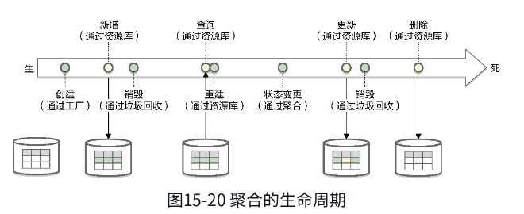{width="5.772222222222222in" height="2.3613637357830273in"}

repo是作为南向网关的端口(适配器是具体实现, repo是抽象的定义); 但是需要做防腐处理, 不直接做存储数据的返回, 需要按照我们端口的抽象定义做转换

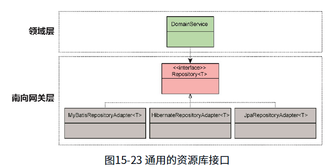{width="5.772222222222222in" height="2.948082895888014in"}

说实话目前真要让go实现这种方式太难了, 现在哪怕真的interface做了抽象层, 那也是实现和interface放在一个module下, 领域层还是会依赖这个module, 虽然确实没有直接依赖具体的结构体, 这个我确实不太分得清; 如果说我在领域层代码用id/枚举/字符串来动态加载具体实现到interface的话, 这样确实解耦了但这可太动态了, 要实现估计需要用reflection;

我所知道的DI依赖注入的框架(google的wire, uber的dig,fx等), wire是静态代码生成, dig是反射的; 静态代码生成的话, 还是会创建依赖,这个避免不了

就是这样, 只是把依赖改到了最外层, 然后创建之后再通过interface传递进去

这个是否有必要我觉得是值得商榷的

**领域服务**

聚合作为领域层的自治单元, 服务作为协调各聚合的作用, 那你不就是应用层的编排/协调了吗?

领域服务并不映射真实世界的领域概念（名词）​，而单纯地体现一种领域行为（动词）​。

很好, 这就是我理解的对动作/会话/任务的抽象; 比如一次交易/一次处理事务等等, 一般抽象是对一个实体, 这里是对一系列复杂的动作组成进行抽象, 管理;

**领域事件**

新概念; 比较像事件驱动模式里的事件; 这种事件的消息是不变的, 非共享状态的;

不管响应式, 声明式都会基于这里的概念

可以再了解下Datomic,Redux,CQRS

### 第十六章 领域设计建模

这一章还是设计相关, 前面说了设计的要素, 这里是设计的方法

#### 角色构造型

根据角色的who/what来作为对象抽象

-   信息持有者

持有且提供信息; 就是聚合边界内的实体和值对象

-   服务提供者

领域服务; 封装没有状态的领域行为(逻辑组合); 多个聚合协同工作(控制编排)

-   构造者

就是factory, 工厂模式

-   协调者

应用服务层, 不做任何的业务处理, 进行领域服务和聚合的协调(调用创建, 顺序等); 也是服务入口边界

-   控制器

领域服务; 进行决策,协调聚合和端口的协作

-   接口

限界上下文的最边界的适配层, 消息契约等

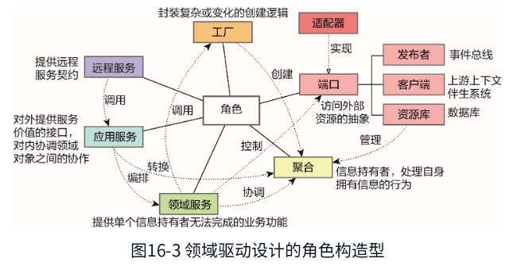{width="5.772222222222222in" height="3.0427220034995623in"}

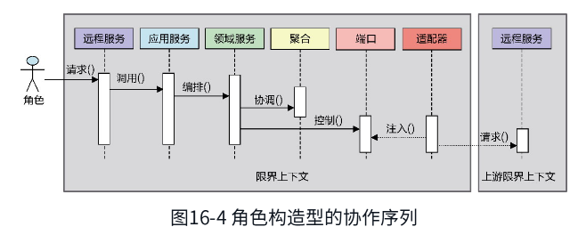{width="5.772222222222222in" height="2.3480227471566053in"}

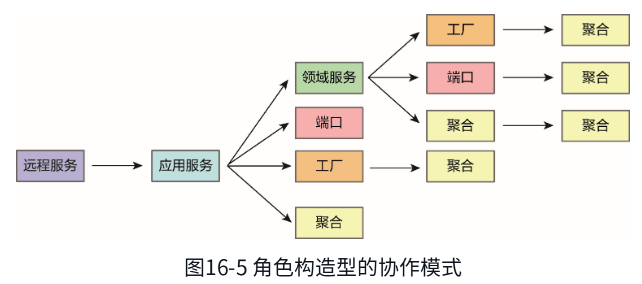{width="5.772222222222222in" height="2.5534437882764656in"}

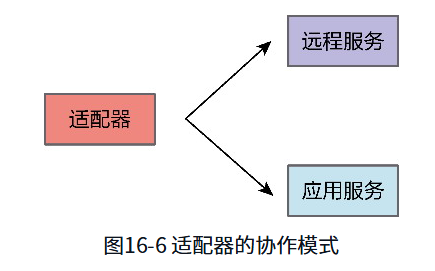{width="4.53125in" height="2.8229166666666665in"}

和远程服务的适配器比较像repo的防腐层

而应用服务的适配器就是自身提供的接口的转换, 分离了内部结构和消息契约的结构

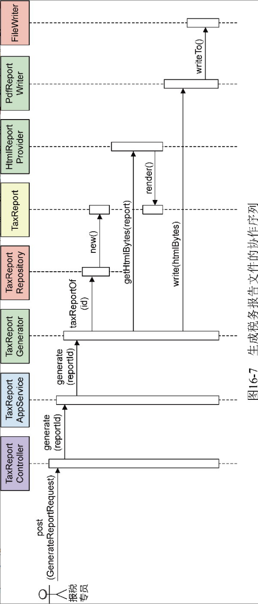{width="2.3229166666666665in" height="5.4375in"}

如何设计聚合?!

分筋错骨!

先有对象图的结构, 理解关联, 依赖, 搞清楚每个图节点的属性, 是实体还是值对象(身份标识嘛)

然后找关系最薄弱的地方尝试边界的划分(薄弱不是边少, 而是边的相似程度, 边多的往往是聚合的边界)

如果关联不清晰, 就先不聚合

**关系**

依赖关系(更弱), 关联关系(看下面), 泛化关系(强), 无关系(无)

关联关系: 合成(强), 组合(稍弱), 普通的关联(弱)

不是组合的关系的关联, 一般是强耦合, 不要拆开

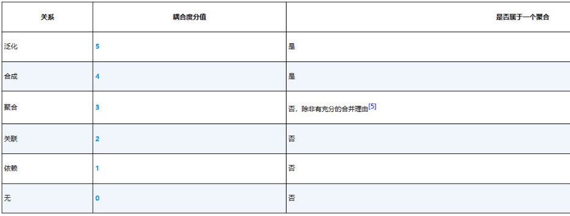{width="5.772222222222222in" height="2.19159230096238in"}

在聚合边界的处理, 独立性\>完整性

所以小聚合比大聚合要好

完整性-\>边界的合

独立性-\>边界的分

不变量-\>性质的锚

一致性-\>数据流通正确的保证

角色构造型-\>服务驱动设计

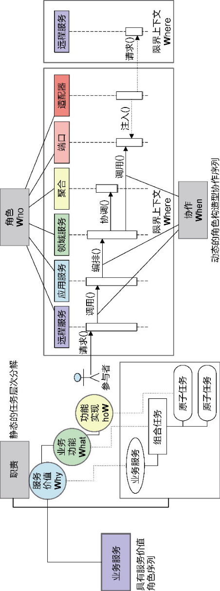{width="2.1145833333333335in" height="6.71875in"}

划分职责, 分解任务

先分出某目的的行为序列; 再分解行为序列的原子动作

### 第十七章 领域实现建模

系统, 服务的设计都已经做完了, 指导思想也确定了, 就是到了最后具体化, 实现落地了;

单元测试不包括

-   数据库交互

-   网络通信

-   文件系统调用

-   依赖特定环境(某些配置文件, 其他依赖组件这些)

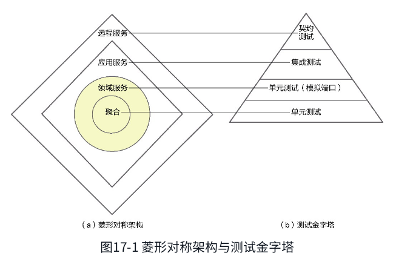{width="5.772222222222222in" height="3.8125174978127734in"}

良好的单元测试要遵循**FIRST原则**

fast 快速

isolated 独立

repeatable 可靠重复

self-verifying 自我验证

timely 及时

又讲到TDD, 测试-开发-重构的循环

简单设计的原则:

-   通过所有测试

-   尽可能消除重复

-   尽可能清晰表达

-   更少的代码元素

重要度依次降低

重构三个量化标准:

-   可读性

-   重复性

-   简单性

自我觉得也是按顺序重要度

整个建模设计开发流程

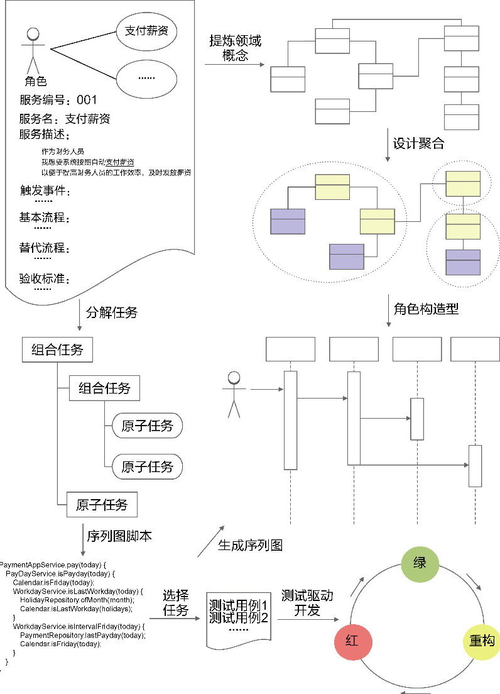{width="5.772222222222222in" height="8.005695538057743in"}

下面是第五篇章

融合, 将战略和战术合而为一!(不知道是不是吹水的部分)

### 第十八章 领域驱动设计的战略考量

限界上下文 和 微服务

一般来说是可以对应上的; 但也可以作为单体系统的组件

进程间的通信边界(进程间一般来说不是单机内, 都是走的网络通信, this is 容器时代)

-   数据库共享架构

会有静态耦合, 导致变成一个架构量子

-   零共享架构

微服务最爱, 但是跨领域数据整合什么的会有性能减慢

限界上下文 和 微服务 的关系

-   团队边界: 小团队甚至团对内人员的划分吧, 大团队应该是系统的划分

-   代码模型边界: 代码库/模块什么的

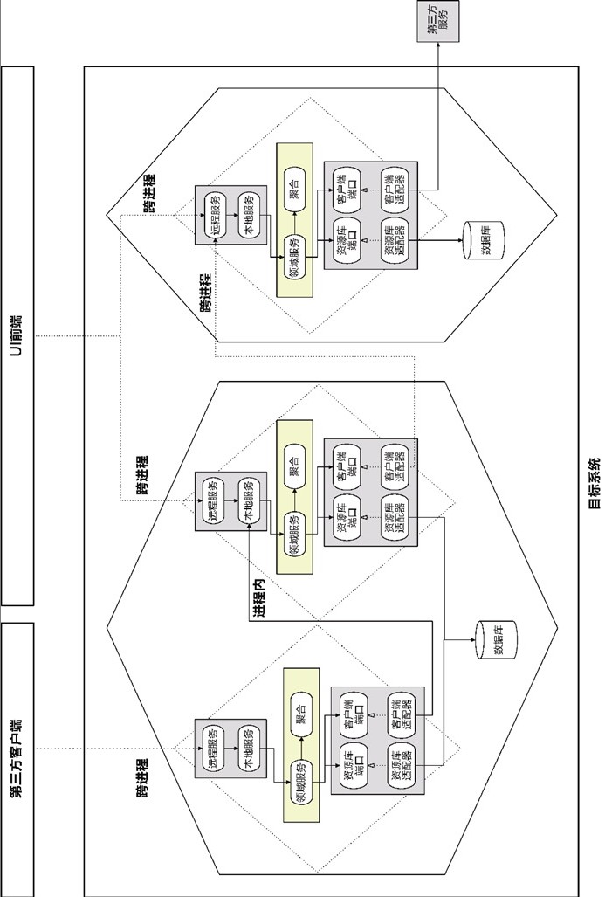{width="4.511805555555555in" height="6.623260061242345in"}

分布式的通信

这和分布式系统架构的\"分布式数据访问\"有相似

通信的方式(协议)

数据的格式(协议)

接口的定义(如果pb的话, 数据和接口一起定义了)

#### CQRS 命令查询职责的分离

Command Query Responsibility Segregation

-   查询操作无副作用, 具有幂等性; 命令操作会修改状态, 其中的新增若不加约束则不具有幂等性

-   查询操作-同步请求, 需要实时返回结果, 往往是BIO; 命令操作可以发起异步请求, 可以不返回结果, NIO,甚至AIO

-   查询结果往往需要面相UI层, 命令操作只是状态变更, 不一定显示操作结果

-   查询操作频率要远高于命令操作, 领域复杂度低于命令操作

CQS command query separation 命令查询分离

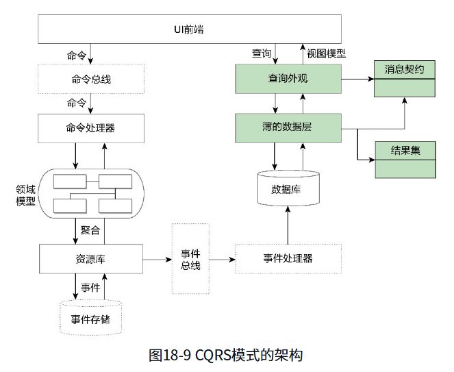{width="5.772222222222222in" height="4.7274759405074365in"}

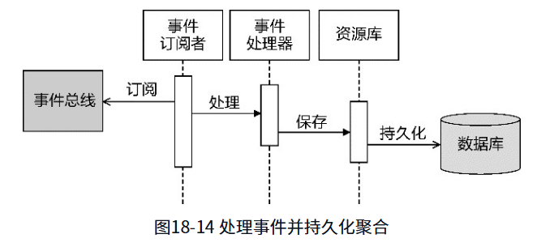{width="5.772222222222222in" height="2.659407261592301in"}

事件驱动!

响应式! 声明式! 你看

ACID 刚性事务(一定保证原子一致性)

柔性事务

-   可靠事件模式

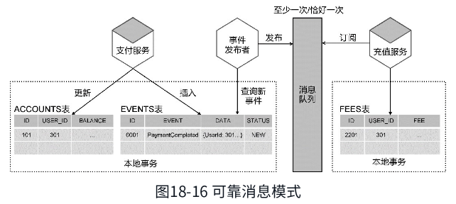{width="5.772222222222222in" height="2.5894083552055993in"}

-   TCC模式

try-confirm-cancel就不就赘述了, 之后再开个分布式事务的专题吧

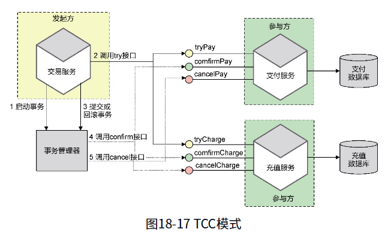{width="5.772222222222222in" height="3.5694269466316713in"}

-   saga模式

协同式: 所有决策和执行顺序分布在每个参与(没有统一编排); 通过交换事件的方式通信; 核心关键是**事务消息**和事件的**pub/sub模式**

编排式: 所有决策和执行顺序集中在一个编排器, 进行协调调用, 当成完成本地事务

### 第十九章 领域驱动设计的战术考量

统一描述语言\...这一言难尽

**贫血领域模型**

如果一个对象只有setter/getter一定是贫血不健康的, 有病的

好多java的实践库\...我\...用不上啊

### 第二十章 领域驱动设计体系

有提到DDDUP

**DDD的精髓要素**

-   边界(核心, 其实做模型, 抽象, 设计不管什么方法都是要做划分)

-   纪律(对定义的遵守, 不产生不三不四的东西)

**三大纪律**

-   领域专家与开发团队在一起工作

-   领域模型必须遵循统一语言

-   时刻坚守两重分析边界与四重设计边界

**八项注意**

-   问题空间与解空间不要混为一谈

-   一个限界上下文不能由多个特性团队开发

-   跨进程协作通过远程服务，进程内协作通过应用服务

-   保证领域分析模型、领域设计模型与领域实现模型的一致

-   不要将领域模型暴露在网关层之外，共享内核除外

-   先有领域模型，后有数据模型，保证二者的一致

-   聚合的关联关系只能通过聚合根ID引用

-   聚合不能依赖访问外部资源的南向网关

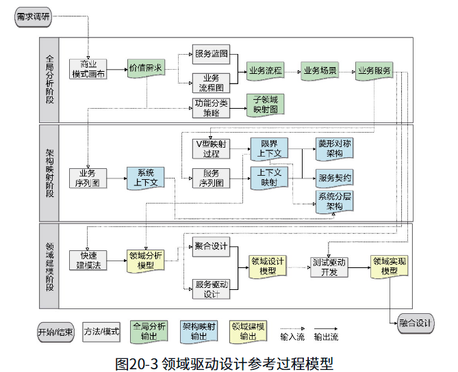{width="5.772222222222222in" height="4.693705161854768in"}
