# 架构思想

主要围绕在**重构/架构设计/软件工程**方面的(epc时的readability和maintainability

架构三个层级:

**代码级（Code Level）**： 设计模式（工厂、策略、单例等）**\"实现\"**

**应用级（Application Level）**： 六边形、洋葱、整洁、清晰架构,关注单个逻辑单元的内部整洁 **\"设计\"**

**系统级（System Level）**： 微服务架构、中台架构、网格架构（Service Mesh）。关注服务治理、编排、事务一致性、负载均衡等"服务间关系" **\"建模/规划\"**

类比城市规划到具体建筑, 也对应DDD里流程: 系统建模-系统设计-系统实现

## 实践方法/评估方式

### 记录架构决策

ADR: 架构决策记录

上下文 context

决策 decision

后果 consequence

对架构师来说, 记录决策是重要的!

### 架构适应度函数

架构适应度函数：它是能够对于某个（或一组）架构特征进行客观的完整性评估的任何机制

1.  任何机制
2.  客观的完整性评估
3.  某个(或一组)架构特征(原子/整体)

**度量工具JDepend**

**找找其他适应度函数的工具**

不要将架构杂糅成**大泥球**

### 服务的特性

集中编排: 一个主要职责是编排工作流的服务

分散协作: 没有编排者的服务, 工作服务协调职责

### 事件风暴

一种开发技术, 协作性的头脑风暴实践, 通过协作来共创领域模型;

由开发人员,领域人员等所有参与, 从各自的领域事件开始(比如XX会做XX事件)

### 拆分模式

这几种模式是为了重构改造时候, 新老架构服务流量并行/切换的部署模式

1.  绞杀者模式: 增加类似网关的拦截层, 转发拆分服务的流量
2.  并行运行模式: 同时运行, 但要注意数据层
3.  功能开关模式: switch切换

### 微服务间通信模式

没什么好说的, 单纯看这个图挺好看的

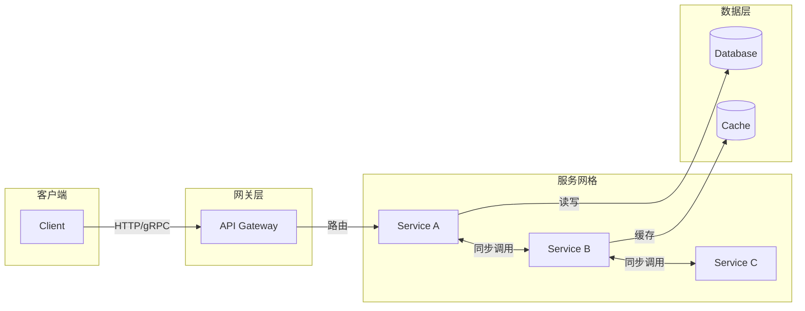

### 设计流程

#### 项目时间角度

1.  背景阶段
2.  设计阶段
3.  实现阶段
4.  发布阶段
5.  迭代阶段

#### 数据流动角度

1.  终端层
2.  网关层
3.  服务层 (多层)
4.  数据层

我的模型抽象描述方法:

数据流图

依赖关系图

时序图

### 缓存结构分层

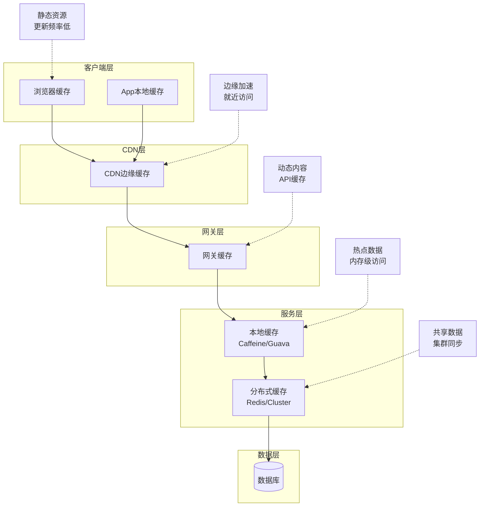

高并发/高性能的优化-请求优化

除了增加缓存, 水平弹性扩展, 更重要的是对于业务的优化, 对数据流的优化

尽量减少不必要的数据传输, 让数据尽量放在请求链路的尽可能前面(且考虑存储性能)

哪些数据可以用来做缓存, 根据**动静分离**, 静态数据更新少甚至无更新, 时效性要求低, 所以越容易前置缓存

### Go工程目录结构 / project layout

<https://go.dev/doc/modules/layout>

<https://github.com/golang-standards/project-layout>

#### 核心目录规范标准

**/cmd**: 存放程序入口。每个二进制文件应在独立的子目录中，如*cmd/app-name/main.go*。

**/internal**: 私有代码库。放置不希望被外部项目引用的包。Go 编译器会强制执行此规则（外包无法导入*internal*内的代码）。

**/pkg**: 公有库代码。可以被其他项目导入使用的功能代码。注意：部分现代实践更倾向于将非 cmd 代码都放入*internal*，仅在需要发布库时才使用 *pkg*。

**/api**: 存放 API 定义文件，如 OpenAPI/Swagger 规范、JSON 模式或 Protocol Buffers 文件。

**/configs**: 存放配置文件模板或默认配置。

**/web**: 存放 Web 相关的静态资源、服务器端模板或单页面应用（SPA）代码。

**/scripts**: 存放编译、安装、分析等管理脚本。

**/build**: 存放打包和持续集成（CI）相关的配置，如 Dockerfile。

### 重点 - internal结构

internal是服务内逻辑的主要代码

调用链上基本是 handler -\> app -\> service / repository -\> repository

分别是与DDD分层架构 / 整洁架构是对应上的

**/app**: 应用层代码, 负责做aggregate相关的聚合(领域逻辑/实体/值对象)工作; 对应DDD中应用层的处理, 最好在这里进行依赖数据/对象的生命周期管理(创建/回收)

**/handler**: 如: 接口代码的桩代码实现函数, http的路由目标等; 一般就是做接口数据结构的转换工作, 鉴权, 参数校验(这两部分可能会放到插件完成, 而不是手动做)

**/services(或者叫domain)**: 对应领域层, entity的实现位置, 高度内聚且尽量不耦合/依赖其他模块的位置, 被app组合以完成复杂的逻辑

**/repository**: 基础设施层, 就是其他外部依赖调用, 如: 数据存储, 消息中间件等等; 目前都不是贫血模型, 所以会依据接口定义有少量的数据转换操作

**!!!!! 注意**

看domain / services 这里, 其中是有respository的子目录, 这里是用来存放外层repository具体实现的抽象层(interface的定义), 为什么interface定义要放在这里而不是在respository呢? 因为用interface就是为了依赖倒置, 但是如果interface和impl放在一个地方, 那么领域还是要import对应的包, 并没有解开这里的静态依赖关系;

那么就有小朋友会问了, \"你领域层是解开依赖了, 可是谁来创建对应的对象给到领域层的对象呢?\", 那当然是就是应用层, 应用层处理AGG相关的逻辑, 他就是用来编排逻辑和管理数据对象的生命周期的!

#### internal详细示例

#### 整体示例

#### 选型建议

**小型项目**：直接在根目录下放置 .go 文件即可，保持简单，避免过度设计。

**大型应用/微服务**：务必使用 /cmd 分离入口，并利用 /internal 保护业务逻辑。

**库文件**：如果你的项目是一个库，建议将导出代码直接放在根目录或 /pkg。

## 设计思想

### 代码级

#### 防御式编程 vs. 契约式设计

### 防御式编程（Defensive Programming）

### 契约式设计（Design by Contract）

两者权衡选择

### 应用级

#### SOLID原则

1.  **SRP simple responsibility principle单一职责原则**

并不是每个模块只做一件事, 而是某个模块只有一个原因被修改, 意思是他对某一种实体/动作的抽象负责;如果是某一个实体那么可能涉及关联多种事情;

2.  **OCP open close principle 开闭原则**

open to add, close to modify, 通过增加代码来新增功能, 而不是修改代码; 主要是保证代码的可拓展

3.  **LSP liskov substitution principle 里氏替换原则**

最初是类继承时, 父类的方法设计的范围问题, 父类应该存在一些子类不会出现的方法, 这意味着父类设计不够纯粹的原初; 参考矩形,长方形,正方形的关系,矩形会有两种边长,而长方形,正方形都是矩形,但正方形继承矩形的话,正方形只有一个边长,定义就有冗余了;

拓展: 现在已变为\"契约式设计\", 核心变成了契约的可替代性,

-   契约化设计: 接口(服务内部抽象接口, 服务对外的接口暴露)作为行为的承诺, 必须严格保证前置条件(入参)和后置条件(输出/返回)

-   无感替换: 只要是依赖某个接口, 后续替换任何实现都能直接替换

-   解耦逻辑与实现: 保证插件化的能力, 新功能的实现, 只改变接口实现, 不会改动调用方补充

补充:

微服务保证要点

1.  契约优先, 保证接口兼容性

语义化版本控制 SemVer, 解释:

版本号: {major大版本}.{minor中版本}.{patch小版本}

小版本: 向下兼容的缺陷修复

中版本: 向下兼容的功能新增

大版本: 不向下兼容的变更

2.  消费者驱动的契约测试 - 自动化测试覆盖

大概就是自动,完整的接口测试

3.  领域语义防腐层

业务规则分叉, 不相交时, 不要强行继承, 而是创建新的服务边界

4.  错误与资源语义一致性

错误区间稳定

5.  数据与资源生命周期超集约束

新版本只能是超集;\
方向只能是: 新增字段, 放宽必填字段的约束;

不能是: 删除字段, 可选改为必填

新增幂等键-\>老客户端不传, 框架给默认值 -\> 前置条件放松-\>兼容,LSP允许

取消幂等键-\>老客户端在传, 新服务端不认 -\> 前置条件收紧-\>不兼容,违反LSP

6.  可观测性即\"运行时里氏验证\"

行为一致性作为SLI, 利用可观测性的能力完成验证

7.  渐进式发布

逐步灰度迁移, 动态控制新旧逻辑流量, 随时可以回滚进度

4.  **ISP interface segregation principle接口隔离原则**

> 接口隔离, 提供给我接口时, 我只需要和我有关的; 就比如:

5.  **DIP dependency inversion principle 依赖反转原则**

我的类的实现尽量不要依赖具体的实现, 而是依赖抽象, go里面的话就是尽量依赖interface, 不仅解决依赖连锁修改的问题, 也方便单测

扩展阅读:

-   [工程目录结构存在问题探讨](https://docs.qq.com/doc/DUEZVQXhkWkhzdUJv)

-   本文\"扁平模块化 vs. 分层结构\"

#### 反对DDD

**易变性**

因为DDD是根据业务具体逻辑的领域进行划分; 忽略实现上的易变性

基于易变性的划分: 可以识别出系统中频繁更改的部分, 而这部分更倾向业务的作为一个服务, 更改更少的倾向基础的作为一个服务边界

这种方法和双模IT有相似

**数据层面**

根据数据敏感程度(有点像华为的绿区,红区)划分区域; 某些数据只在高敏感区域存在, 而其他区域无法直接获取

**技术层面**

根据前端/后端/数据层做水平划分, 然后不同的实现(语言/技术栈)在层级内垂直划分

**组织架构**

不同的中心,不同地域的划分

其实看下来, 这和DDD并不完全冲突, 可以结合一起应用, 重点是找到边界

#### 扁平模块化 vs. 分层结构

### 扁平模块化 (Flat / Functional Grouping)

这种方案主张按功能逻辑拆分包，尽量减少垂直层级，是典型的"务实主义"设计。

**核心特点**

-   **高内聚性**：相关逻辑（数据模型、业务逻辑、持久化代码）高度聚集在一个包内。

-   **低抽象化**：减少接口（interface）的过度定义，代码跳转路径短，实现"所见即所得"。

-   **物理隔离**：模块间边界清晰，常利用 internal 目录防止非必要的外部引用。

**适用项目场景**

-   **非业务系统/基础设施**：如中间件代理（Proxy）、监控 Agent、高性能网关、数据同步工具。

-   **工具类/类库项目**：目标是提供特定功能的 SDK 或 CLI 命令行工具。

-   **初创期微服务**：业务逻辑尚未复杂化，追求极致的交付速度。

**场景适合的原因**

-   **性能损耗小**：非业务系统通常对延迟敏感，扁平结构减少了多层抽象带来的转换损耗。

-   **逻辑相对稳定**：这类系统一旦核心协议或算法确定，极少频繁改动。

-   **审核直观**：在严格的 PR/MR 审核机制下，扁平结构让审核者能直接审视逻辑全貌。

### 分层结构 (Layered / DDD / Clean Architecture)

这种方案通过解耦业务逻辑与外部依赖，形成清晰的垂直依赖关系，强调"领域驱动"。

**核心特点**

-   **解耦性强**：核心业务逻辑（Domain）位于中心，不依赖数据库、API 等底层实现。

-   **高度抽象**：广泛使用接口进行依赖注入，严格遵循"依赖倒置原则"。

-   **结构标准化**：拥有固定的调用链路，如 api -\> application -\> domain -\> infrastructure。

**适用项目场景**

-   **复杂业务系统**：如电商平台、金融支付、ERP 或 OA 审批系统等业务规则错综复杂的项目。

-   **大型团队协作项目**：需要数十人共同维护，且人员流动性较高的项目。

-   **长周期演进系统**：未来可能更换外部组件（如从 MySQL 迁移至 MongoDB）的场景。

**场景适合的原因**

-   **屏蔽业务复杂度**：通过分层防止代码演变为难以维护的"面条代码"。

-   **易于单元测试**：分层架构天然适合 Mock 外部依赖，保障业务核心的稳定性。

-   **强制共识**：大型团队通过标准化的分层规约，降低了个体编程风格差异带来的影响。

### 核心维度对比表

| **维度**   | **扁平模块化 (Go Way)**        | **分层结构 (DDD / Clean)**            |
|:-----------|:-------------------------------|:--------------------------------------|
| 设计核心   | 围绕 功能(Feature) 组织        | 围绕 领域(Domain) 组织                |
| 首要目标   | 简洁、开发速度、运行效率       | 可扩展性、可测试性、解耦              |
| 维护成本   | 初期极低，后期随模块膨胀增加   | 初期较高（模板代码多），后期平稳      |
| 循环依赖   | 目录结构简单，较易处理         | 需谨慎设计，否则易触发 Import Cycle   |
| 推荐语     | 务实派：拒绝过度工程           | 严谨派：追求架构解耦与长期演进        |

### 系统级

#### 微服务边界划分

微服务也是SOA中模块化拆分的一种方式, 和单体服务的组件拆分可以等同

3个关键概念

**信息隐藏**

> 细节信息隐藏在服务/模块/边界内

-   提升开发效率: 模块内独立开发

-   可理解性: 每个模块都是单独的, 整体的

-   灵活性: 模块可以独立更改, 也方便进行模块的替换, 组合

**内聚**

> 最简明的定义: 一起改变的代码应该组织在一起
>
> 同一类事情, 在我们内部就可以处理完, 不需要调用其他模块; 如果一个功能分散在不同的系统上, 那就是低内聚

**耦合**

耦合就是依赖关系和依赖的程度; 如果修改一个服务, 必须要改动另一个服务, 那么就是高耦合的. 如果出现非常高耦合的情况, 那这两个模块应该内部拆分, 再组合构成新的高内聚模块

**模块之间的链接是模块相互之间的作出的假设;** 这句话怎么理解?

**高内聚低耦合的结构是稳定的**

#### 服务弹性

**注意**这里的是可用的弹性, 在资源扩展中的弹性是和承受业务压力上涨的弹性(处理能力的弹性), 两者侧重点不一样

服务弹性也是高可用的重要部分

1.  健壮性

应对预期干扰的能力, 程序的健壮性, 可以处理各种合理/不合理类型的输入

2.  可恢复性

从破坏性事件中恢复(故障崩溃等)

3.  优雅的灵活性

面对未知情况的性能下降, 无法正常运行; 需要可观测性发现

4.  持续适应性

持续测试,迭代后功能保障

# 书-分布式系统架构

## 分而治之

### 耦合

#### 耦合种类

**从程序的角度上**

静态耦合: 架构的组成部分是如何联系起来的, 依赖项, 耦合度, 连接点等(代码依赖, import等); 可以用于整体架构的可靠性分析; 某个模块修改可能直接影响另外的有耦合模块

动态耦合: 架构各部分运行时如何调用, 比如rpc, http等调用; 关注模块间的通信

**从耦合的强度上**

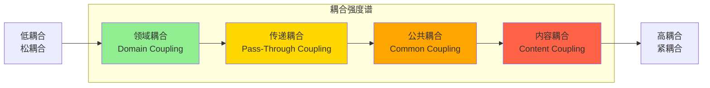

1.  领域耦合

微服务A和微服务B交互, 是因为前者需要后者提供的功能; A已经做好自己该做的事情了, 把自己的结果传递给B, 这样会认为是低耦合的; 因为嘴吃负责判断食物能不能吃, 和初步咀嚼食物; 消化分解吸收就不是他做的事了, 而传递给胃/肠这种依赖是合理的

注意信息隐藏: **仅共享绝对必要的内容，且仅发送所需的最小量数据**

2.  传递耦合 / 流浪耦合

服务A给服务B传递数据, 仅仅因为B下游其他服务需要; 因为有传递依赖的问题, 所以A需要理解B和B的下游的逻辑, 这是不应该的. 比如: 嘴只要处理完给到胃就完事了, 不应该关注胃到肠的逻辑;

如何解决:

1)  增加领域耦合, A直接调下游服务, 但是容易造成功能混乱

2)  逻辑下推, 将依赖数据放到服务B进行创建, A只提供必要数据

3)  数据透传, B不关注透传信息, 只关注自身依赖信息

```{=html}
<!-- -->
```
3.  公共耦合

多个服务使用一组公共数据; 很常见, 因为会有数据共享/公有数据库等(比如: 账号信息等)

问题: 如果数据结构和数据本身的修改, 会影响到多个服务; 还有就是data race数据竞争问题

如果是静态资源, OK, 这种影响很小;

但如果是数据修改, 特别是状态的修改;

1)  可以引入FSM有限状态机进行控制(如果实现呢?);

2)  使用一个服务专门处理某种数据, 其他服务依赖该服务(FSM也可以由他控制)

3)  利用数据库的功能进行包装

```{=html}
<!-- -->
```
4.  内容耦合

> 服务A调用服务B来改变B的数据状态, 比如A调用B的数据库进行修改; 和公共耦合的区别在于权限边界不够清晰, 因为公共耦合可以知道谁是主人, 谁是共用者.
>
> 利用查询状态接口来暴露数据, 用真实存在的动作接口来更新数据

**耦合的实现性质上**

时间耦合: 在有依赖关系时, 描述依赖关系是同步/异步的

**从数据的流向上**

传入耦合: 代码的输入连接, 引用其他组件/模块/函数/类的数量

传出耦合: 输出, 被其他引用的数量

#### 静态耦合 定义 架构量子

**架构量子可以类比DDD中的限界上下文**

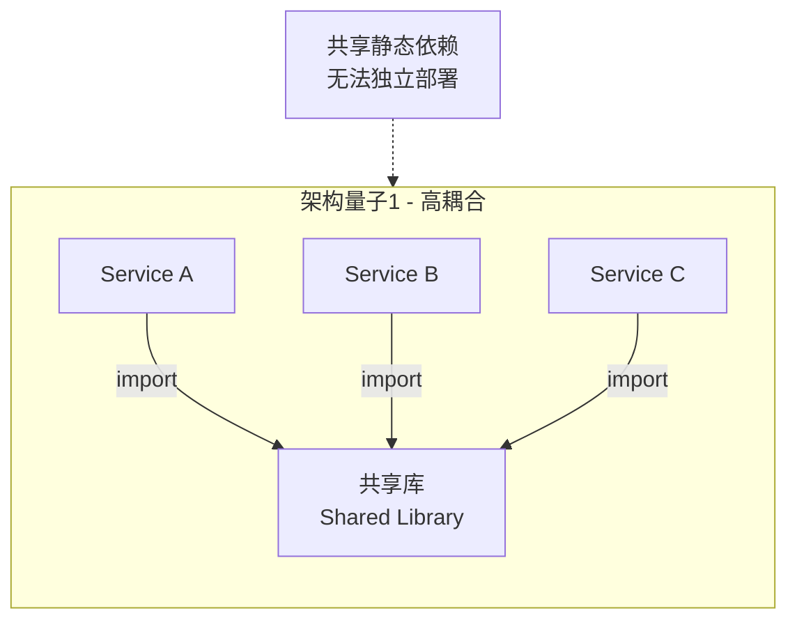

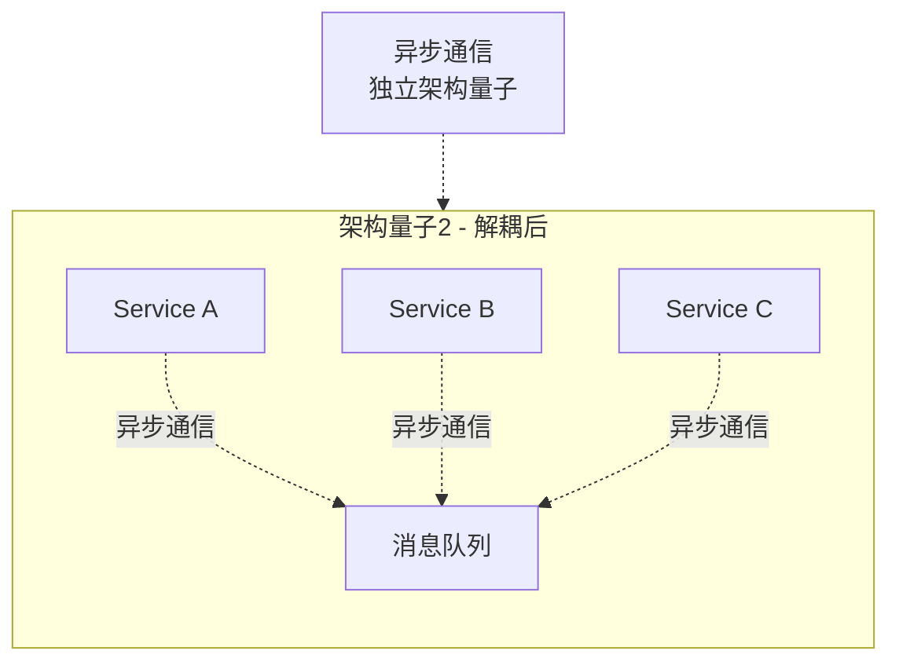

这钟共享依赖的决定上游模块不能独立部署, 所以这种静态依赖决定了这个整体是一个架构量子

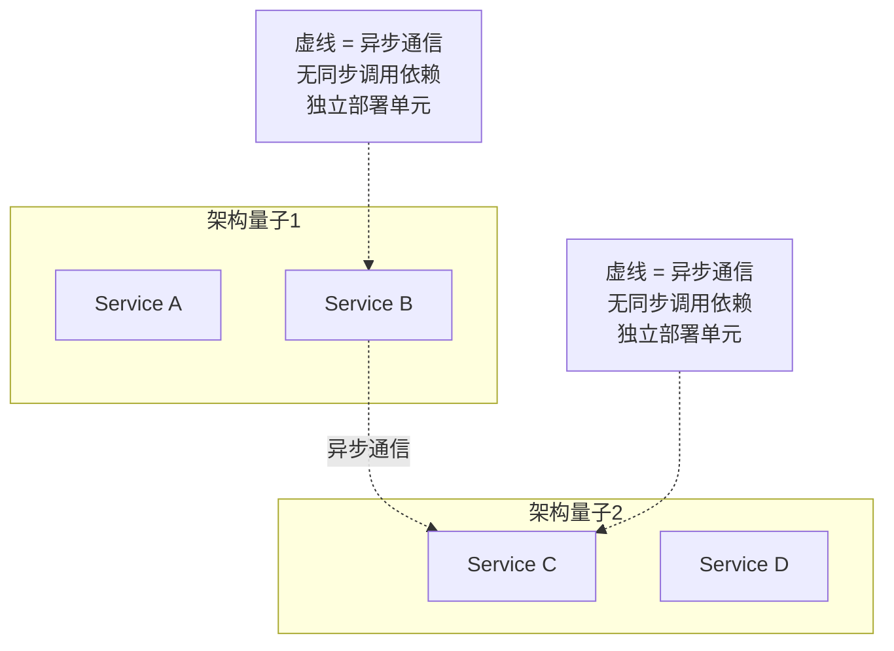

虚线是异步通信, 没有了同步调用依赖的话, 就认为是解耦了的.所以上图认为是两个个独立的架构量子

**注意**分析静态耦合时千万不要忘了对数据层存储的依赖

#### 动态耦合 定义 架构量子

服务的调用被一下三个因素影响:

1.  通信: 同步/异步
2.  一致性: 从原子到顺序到因果到最终
3.  协调: 是需要统一编排还是各自协调

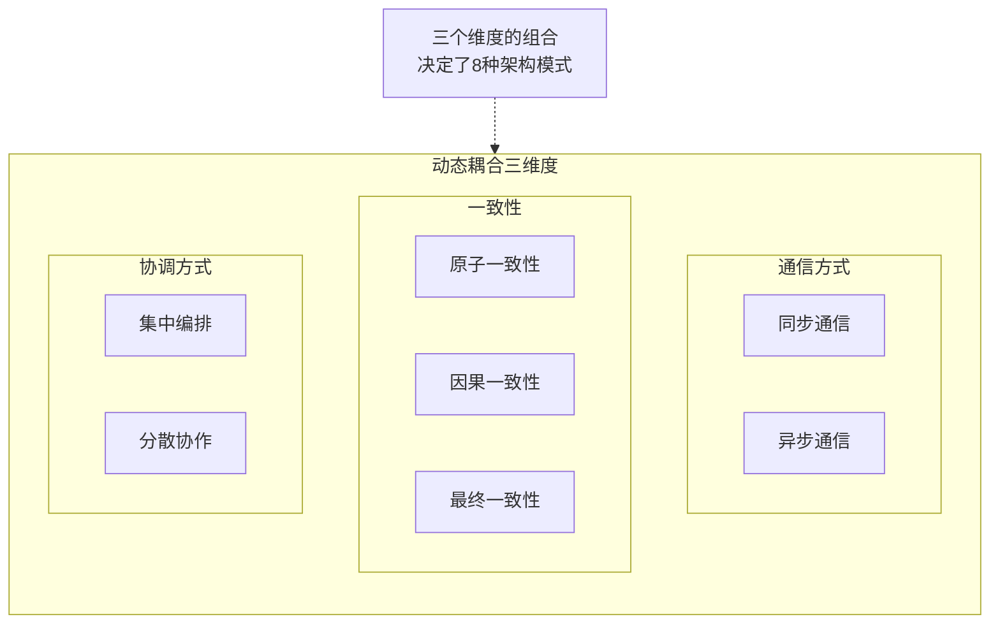
| 模式名称 | 通信 | 一致性 | 协调方式 | 耦合程度 |
|:---|:---:|:---:|:---:|:---:|
| 传统叙事(sao) | 同步 | 原子 | 集中编排 | 非常高 |
| 电话标签(sac) | 同步 | 原子 | 分散协作 | 高 |
| 童话故事(sco) | 同步 | 最终一致 | 集中编排 | 中 |
| 时间旅行(sec) | 同步 | 最终一致 | 分散协作 | 低 |
| 奇幻小说(aao) | 异步 | 原子 | 集中编排 | 高 |
| 恐怖故事(aac) | 异步 | 原子 | 分散协作 | 中 |
| 并行(aeo) | 异步 | 最终一致 | 集中编排 | 低 |
| 优选文集(aec) | 异步 | 最终一致 | 分散协作 | 非常低 |

不是你家整体业务这么复杂呢? 全长不一样? 我是真的服!

### 模块化

#### 简述

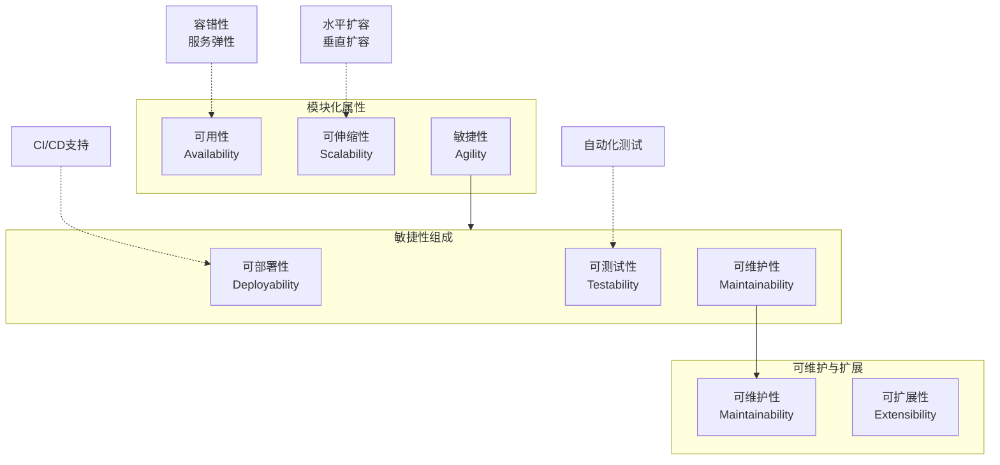

**可用性**: 容错性, 可以参考**服务弹性**

**可伸缩性(scalability)**: 部署的最大可承载容量的伸缩性, 包含纵向扩容和横向扩容, 但是纵向扩容是有限的, 一般都会要求横向的水平扩容

**敏捷性**: 由可部署性, 可测试性, 可维护性组成

**可部署性**: 参考CD, 持续可部署

**可测试性**: 参考CI, 持续可集成中的测试部分(CI还有重构等属性, 但可测试算是占比比较重的)

**可维护性(Maintainability)**: 对系统的代码结构的添加,变更,删除功能的难易度(我觉得是包括了可扩展性的)

**可扩展性(extensibility)**: 和可维护性都是针对代码结构的修改, 这个会更专注于新功能的增加

模块化不一定意味着微服务/分布式架构, 也可以单体组件的模块化

模块化带来的好处: **可伸缩性, 敏捷性**

也不一定, 要是分布式架构的模块化才有可伸缩性的好处.

敏捷性倒是都会得到增长

#### 可维护性

可维护性是指添加、变更或者删除功能的难易程度，也包含系统内部的变更，比如打补丁、服务框架升级、第三方库升级等

$ML = 100\sum_{i=1}^{k}c_i$

ML(0%-100%)是可维护水平, ci是组件的耦合水平

耦合水平这个指标比较多:

-   组件耦合度

-   组件内聚度

-   循环复杂度(圈复杂度! 是你! 好久不见!)

-   组件大小

-   技术/领域划分(如果是重要, 复杂, 难的会更难以维护)

#### 可测试性

可测试性定义为测试的难易度（通常用自动化测试实现）以及测试的完整性

和CI, 自动化测试有很强的共生关系

可测试性是指标, 而CI是实现指标的利器! 当然其他自动化测试手段也是

模块化之后, 可以进行更细化的级别的测试, 模块独立的单元测试; 回归测试, 冒烟测试会更快更便捷

#### 可部署性

可部署性不仅仅关乎部署的难易度，还与部署频率以及部署总体风险有关

这个和CD, 容器化, 容器编排离不开关系

**注意**模块化不一定解决部署的便捷

1.  模块化后还是单体架构
2.  模块化后的分布式架构, 各个模块间强耦合, 导致部署的顺序依赖

特别是2还会比单体更复杂(因为发布更多了), 形成\"分布式大泥球\"(想说屎山就说嘛)

#### 可伸缩性

系统应对业务**逐渐**增长带来的请求上涨, 用户规模上涨的处理承载能力

而弹性是应对流量**激增**, 每日**波峰**的流量处理能力(注意这里的弹性和前文可用性的弹性关注点不一样)

文中说随着服务细分的提升, 弹性更像单个部署单元的纵向承载, 可伸缩性更像部署单元的水平扩展; 但是在实践中, 面对可预见的日常波峰和活动的激增, 也是可以通过提前水平扩容进行防御

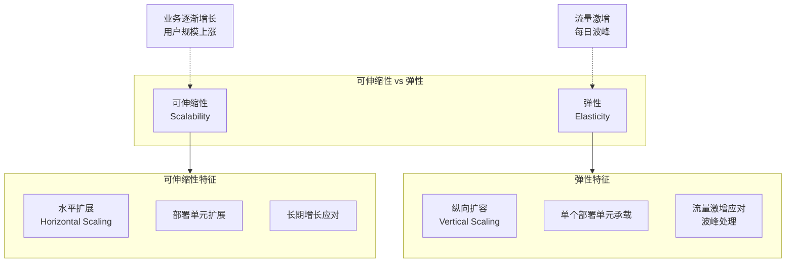

#### 可用性 / 容错性

参考上面的服务弹性

#### 模块分解

模块化, 一般是从一个单体应用进行模块化, 那么如何拆分,分解就是一大难题

大象迁移

确定代码库是否能分解

1)  基于组件分解 2) 战术分叉

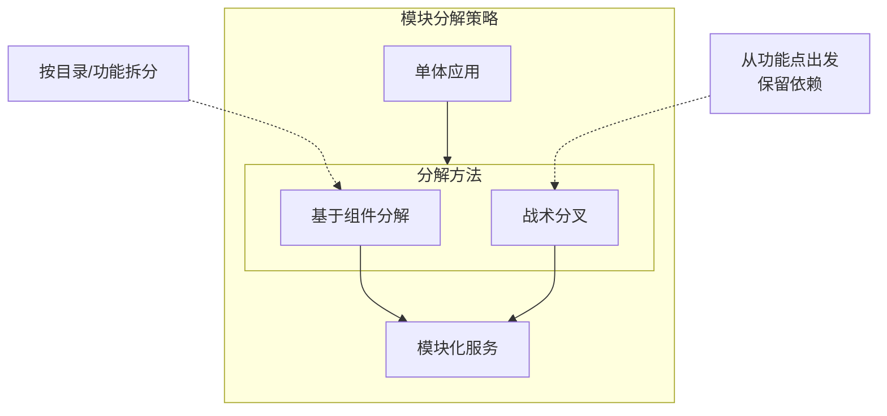

**根据抽象性和不稳定性计算**

抽象性 = 抽象元素数量 / (抽象元素 + 具象元素)

不稳定性 = 传出耦合 / (传出耦合 + 传入耦合)

不稳定性可以理解为易变性, 越低越容易修改

主序列距离 D = \|A+l-1\|

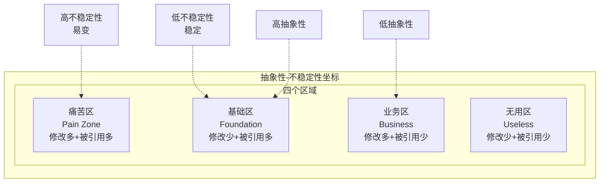

```mermaid
flowchart LR
    subgraph MainSequence["主序列距离"]
        direction TB
        
        subgraph Axes["坐标轴"]
            direction LR
            
            Y[不稳定性 I<br/>Instability]
            X[抽象性 A<br/>Abstractness]
            
            Ideal[理想线<br/>D=0]
            Above[上方<br/>过于抽象]
            Below[下方<br/>过于具体]
        end
    end
    
    Note1[距离理想线越近<br/>设计越好] -.-> Ideal
    Note2[主序列距离 D=\|A+I-1\|] -.-> Axes
```

卧槽, 这和我之前看到的一个坐标轴很像, 也是四个区域的划分;

以\"代码修改的频繁度\"和\"被引用次数\", 后者和不稳定性有点相似

修改多+被引用多-\>痛苦区

修改少+被引用多-\>基础代码

修改多+被引用少-\>业务代码

修改少+被引用少-\>无用代码

#### 基于组件分解

就是将组件拆解成服务, 我觉得有很多角度: 领域, 数据(好像主要这两个了吧)

但是最直观, 先按代码库的目录进行拆解(总不能单体架构还全扁平的代码吧)

1.  识别和调整组件模式

按目录做分割; 如果真有扁平的代码目录, 那先做整合, 不管从前缀还是功能入口; 可以借助静态代码分析工具, 找到组件名称/命名空间; 还可以通过代码/语句/文件的量级, 适应度函数来判断(基本是一些比值量化), 对某些大块的还需要进行细致切分;

**整体拆分**

2.  收集公共领域组件模式

这里应该是拆分后的组件里相似功能的抽象整合

**通用整合**

3.  扁平化组件模式

孤儿类: 在另一个组件的根目录里, 且没有其他关联

找到所有孤儿类的组件, 重新整合成一个

但是看示例, 还有将非孤儿类(有其他依赖)的子组件, 作为独立组件分离出来(可能后续还有优化)

**组件内部拆分/整合**

4.  明确组件依赖项模式

看组件**之间**的传入和传出依赖关系(就是耦合); 用传出/传入的耦合来判断当前系统关联的复杂度, 进而判断这个拆分是不是可行的, 难度的大小, 工作量的大小, 是否需要重构; 有些共享库的依赖, 可以拆分然后融入到另外的组件内

**减少组件, 融入其他组件**

5.  构建组件领域模式

前面将组件拆分,重新设计,整合了之后; 我们一般不会直接把一个组件作为一个服务(当然也有这种情况); 需要做领域上的设计(从DDD来说应该是已经有了模型建模), 寻找限界上下文; 一般有依赖项的要么被依赖的作为共享组件, 要么会放在一个服务内, 要么就是作为基础服务

**领域建模整合**

6.  构建领域服务模式

将重构后可以单独部署的圈定好

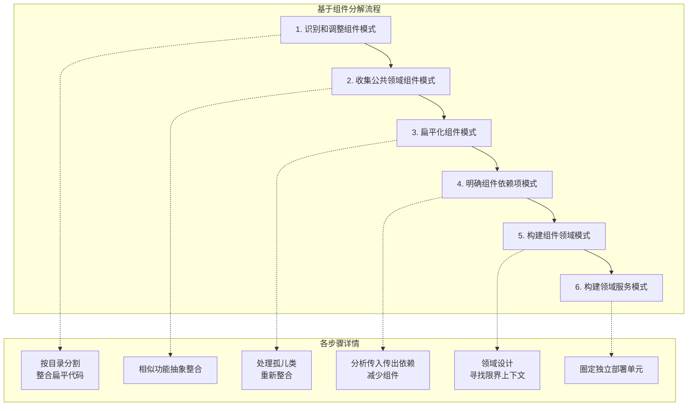

#### 战术分叉

拆解大泥球! 清洗大屎山!

从某一个功能点出发, 保留依赖, 删除其他代码;

这样就可以拆解出一个独立模块; 这样我觉得比较偏向垂直/领域拆分, 后续还可以考虑公共耦合的模块进行水平的拆分

#### 数据的拆分

拆分的驱动因素

1.  变更控制

拆分某个表被影响的服务数量; 毕竟这是修改静态耦合

2.  连接管理

昂贵的数据库连接, 首先建立连接就是一个很耗时的操作, 他可能比一次读/写请求的耗时更高; 而一条连接是半双工的, 一问之后才有一答; 太多服务连接到同一个数据库也会挑战数据库的处理上线

3.  可扩展性(我觉得是可伸缩)

单体架构限制扩展

4.  容错性

单体架构, 单点故障影响所有业务, 没有业务隔离; 至于冗余的话还是可以做到的

5.  架构量子

静态耦合导致架构量子的连接

6.  DB选型优化

并不是所有数据都是存放关系型DB的, 根据实际的使用场景,灵活使用DB

同时带来的问题:

1.  数据关联的约束: FK外键等约束, 因为数据拆分在不同实例后没有了
2.  数据库事务: 会需要升级成分布式异构事务处理

数据域? 五步法? 这是啥?

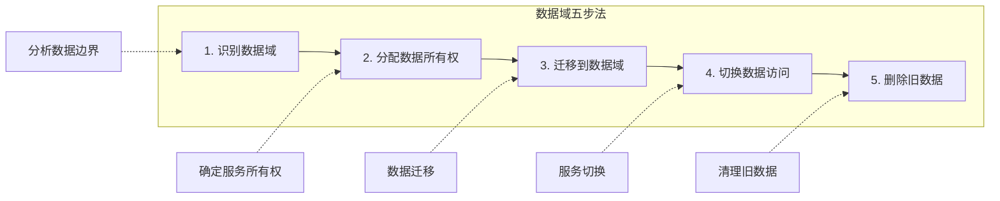

### 服务粒度

卧槽! 牛逼! 在不同服务粒度的视角中, SRP也是有不同的理解, 在更大范围的限界上下文中, 根据SRP得到的单位可以是很宽泛的, 而如果细致到单个模块内, 那么SRP又可以细分到不同类的实现, 那么根据SRP来做服务的拆分, 需要选择一个适合的服务粒度来做判断

#### 简述

分解因素

集成因素

模块化: 标准化单位/尺寸的构建; 划分出单元/单位; **如何拆分**

粒度: 构成一个大单元的众多粒子之一; **拆分得多大**

#### 粒度分解因素

1.  服务范畴及功能

是否做了太多不相干的事情; 保持内聚和整体大小的平衡

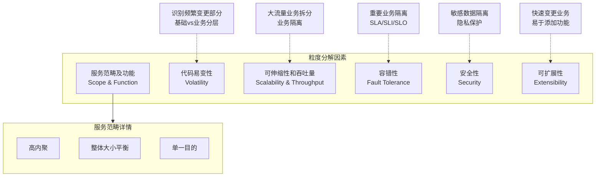

2.  代码易变性

代码修改的频率, 比较反映基础\--业务这种层级的变化

3.  可伸缩性和吞吐量

这个就是看业务入口的流量分布了, 大流量的可以进行拆分, 同时这也可以做到一定的业务隔离

4.  容错性

这里就是要对重要业务的业务隔离了, 某些业务的可用性要求比较高(比如SLI,SLA,SLO等)

5.  安全性

安全性就是从数据角度来分析, 比如个人隐私信息等, 做数据安全的隔离

6.  可扩展性

这个和点2有相似, 代码/业务的拓展, 如果都某个业务发展比较快, 或者变动很频繁, 就需要做分解

#### 粒度集成因素

1.  数据库事务

说是数据库事务, 不如说数据的关联性,一致性,完整性; 如果强关联比较多, 用到事务或者数据关联; 那么不能进行过多的分解, 而是需要集成

2.  工作流和协作

关注服务间的通信, 如果过多的通信导致容错性的下降, 那么也不应该, 前面分解的时候有因为避免服务内某点出问题而做分解, 现在也要避免某个服务被过多依赖/传出耦合, 他出问题后导致其他服务的无法用, 而要将这部分做集成; 还有考虑通信带来的性能和响应速度的问题

3.  共享代码

不能包含业务逻辑的代码, 不能频繁变更; 频繁出现缺陷, 需要版本更新

4.  数据关系

我是觉得和点1相近的

**表7-2：分解驱动因素（拆分服务）**
| 分解驱动因素 | 应用驱动因素的原因 |
|:---|:---|
| 服务范畴及功能 | 高内聚单一目的的服务 |
| 代码易变性 | 敏捷性（减少测试范围，降低部署风险） |
| 可伸缩性和吞吐量 | 降低成本并加快响应能力 |
| 容错性 | 更好的全局运行时间 |
| 安全访问 | 对特定功能更好的安全访问控制 |
| 可扩展性 | 敏捷性（易于添加新功能） |

**表7-3：集成驱动因素（将服务整合）**
| 集成驱动因素 | 应用驱动因素的原因 |
|:---|:---|
| 数据库事务 | 数据完整性和一致性 |
| 工作流和协作 | 容错性、性能和可靠性 |
| 共享代码 | 可维护性 |
| 数据关系 | 数据一致性和正确性 |

## 合而为一

### 复用模式

#### 代码复制

就挺狠的, 将复用的代码, 在每个用到的服务中都复制一份, 但是这样怎么做版本管理\...你还不如利用语言的包版本管理能力, 将代码放一个单独共享库中

好吧, 他也承认这种方法很少会用

#### 共享库

就是前面提到的共享库;

那么做共享库的话, 就要考虑共享库的粒度, 是全局共享,还是保证SRP的共享; 然后就是版本管理的问题

书里提到的: 依赖管理, 变更控制

大概是这两点**谁用了什么**, **我改了什么会影响谁**

粒度的不同, 要么会造成修改爆炸广播所有服务, 要么小共享库爆炸增长刷屏
| 优点 | 缺点 |
|:---|:---|
| 支持版本变更 | 依赖可能难以管理 |
| 基于编译时的共享代码，减少运行时错误 | 代码重复在错杂的代码库里 |
| 代码共享和代码变更方面的良好敏捷性 | 版本弃用可能很困难 |
| | 版本沟通可能很困难 |

#### 共享服务

版本问题同样会有, 不过可以同接口兼容解决, 但是兼容对共享服务自身又是一个负担(逻辑堆积太多); 还有一个重要的问题就是性能, 通过通信实现逻辑总是有损耗的, 在高并发/快响应的场景压力很大; 还有就是新增服务, 必然带来可伸缩性和容错性的挑战
| 优点 | 缺点 |
|:---|:---|
| 对高代码易变性友好 | 版本控制更改可能很困难 |
| 在异构代码库中无代码重复 | 性能受到延迟的影响 |
| 保留限界上下文 | 服务依赖会导致容错性和可用性问题 |
| 无静态代码共享 | 服务依赖会导致可伸缩性和吞吐量问题 |
| | 运行时更改导致风险增加 |

#### side car 和 servicemesh

不是, 这么高级吗

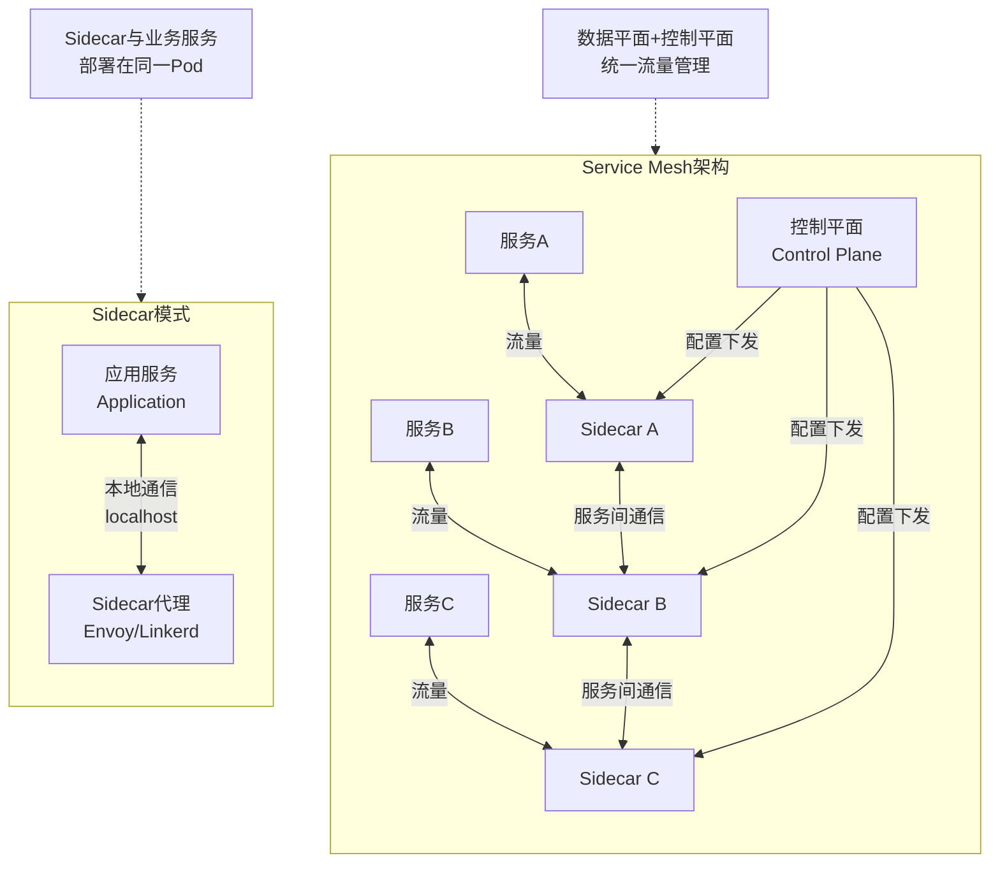

有点帅

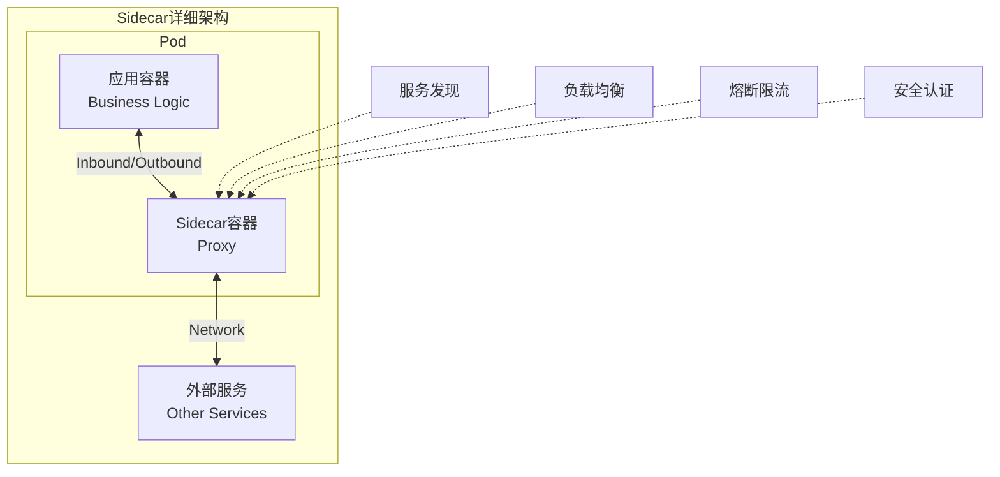

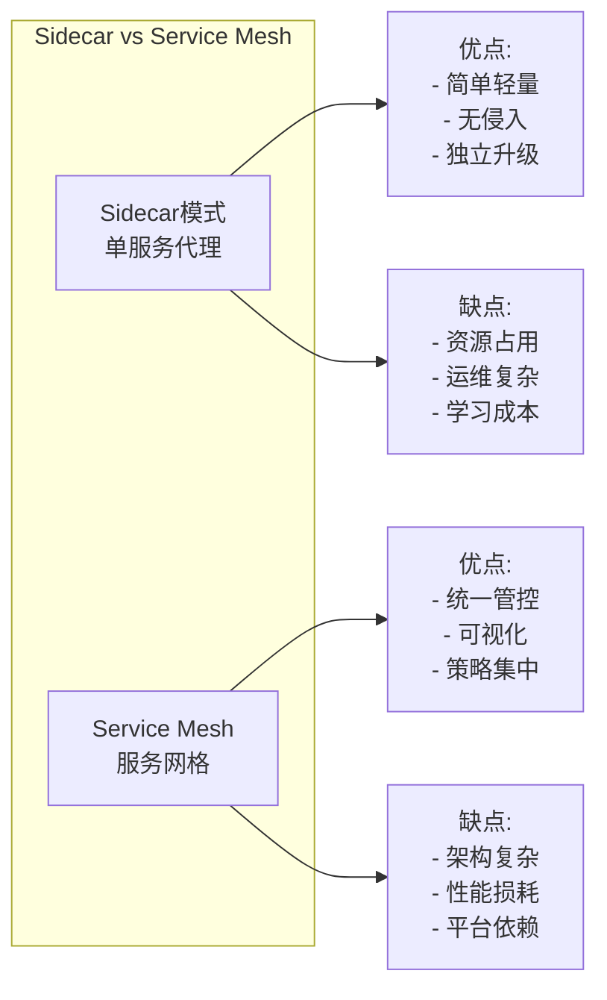

难啊, 需要部署平台的支持, 相对其他方法还是有一定的学习成本, 增加了运维成本

### 数据所有权 和 分布式事务

如何分配所有权, 一般来说就是谁写谁拥有, 只读只共享

所以这里会比较关注写场景

#### 单一所有权

表只是一个服务所有, 一个服务写入

#### 公共所有权(common)

多个服务写入一个相同的表, **但是**一般会有一个专用的服务进行写入, 其他的服务只调用这个服务

#### 共同所有权(joint)

这里就比较变态, 这里是多个服务直接对一个表进行操作;

1)  这种情况一般都会进行拆分, 向单一所有权的方向靠, 然后再做数据的同步;

2)  要不就是数共享数据领域(保持原状);

3)  委托技术, 将所有权放到其中一个服务上, 其他服务通过这个服务来获取数据;

4)  服务整合, 把多个写放到一个服务(又变成1的单一所有了)

#### 分布式事务

ACID 和 BASE; 不赘述了

实现最终一致性的模式

1.  后台同步: 一个写完之后, 同步CDC/消息队列等手段后台修改其他节点数据
2.  基于请求的编排: 一个主节点或者编排器节点, 显示去调用修改接口; 面对错误时的处理会很复杂
3.  基于事件: 通过消息队列发送事件, 让对应服务更新节点

### 分布式数据访问

#### 服务间通信模式

利用rpc或其他调用方式, 获取目标数据

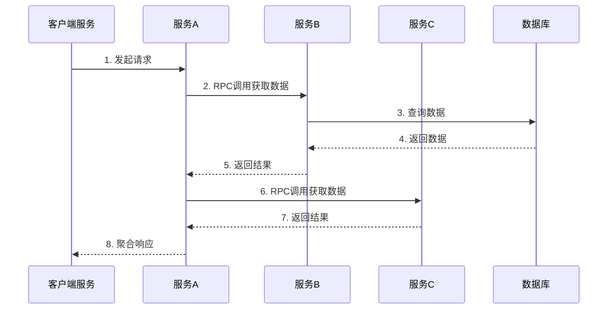

####  列schema复制模式

直接冗余存储, 自身数据就可以满足需求, 不需要依赖外部数据; (但其实局限性比较大, 简单的场景还是可以的), 如果有数据更新的话, 那情况会变得复杂, 因为就是多点的数据更新
| 优点 | 缺点 |
|:---|:---|
| 良好的数据访问性能 | 数据一致性问题 |
| 没有可伸缩性和吞吐量问题 | 数据归属权问题 |
| 没有容错性问题 | 需要数据同步 |
| 没有服务依赖 | |

#### 复制缓存模式

单一内存缓存(本机缓存): 少见

分布式缓存: 利用其他缓存服务实现

一样会有更新的一致性问题

这个感觉更多是为了性能问题而提出的解决方案

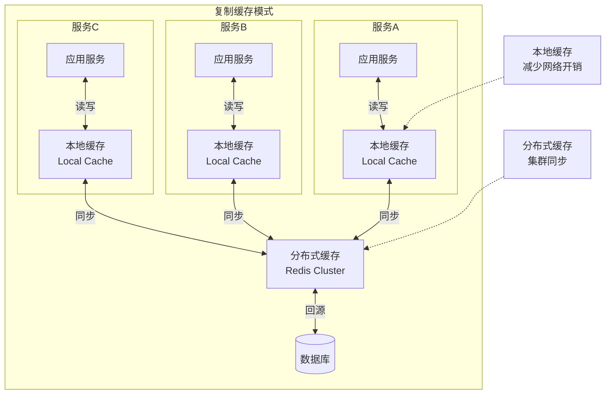

#### 数据领域模式

像DDD的数据领域聚合?

不同服务间共享使用数据

```mermaid
flowchart TB
    subgraph DataDomain["数据领域模式"]
        direction TB
        
        subgraph DomainService["领域数据服务"]
            DS[数据领域服务]
            Data[(领域数据)]
        end
        
        subgraph ServiceA["服务A"]
            A[应用服务A]
        end
        
        subgraph ServiceB["服务B"]
            B[应用服务B]
        end
        
        subgraph ServiceC["服务C"]
            C[应用服务C]
        end
    end
    
    A <-->|数据访问| DS
    B <-->|数据访问| DS
    C <-->|数据访问| DS
    DS <-->|数据管理| Data
    
    Note1[领域数据聚合<br/>统一数据管理] -.-> DS
    Note2[共享数据访问<br/>避免直接耦合] -.-> DomainService
```

### 分布式工作流

#### 集中编排式通信

```mermaid
flowchart TB
    subgraph Orchestration["集中编排式通信"]
        direction TB
        
        Orchestrator[编排器<br/>Orchestrator]
        
        S1[服务A]
        S2[服务B]
        S3[服务C]
        S4[服务D]
    end
    
    Client[客户端] -->|发起请求| Orchestrator
    Orchestrator -->|调用| S1
    Orchestrator -->|调用| S2
    Orchestrator -->|调用| S3
    Orchestrator -->|调用| S4
    
    S1 -->|返回结果| Orchestrator
    S2 -->|返回结果| Orchestrator
    S3 -->|返回结果| Orchestrator
    S4 -->|返回结果| Orchestrator
    
    Orchestrator -->|聚合响应| Client
    
    Note1[统一协调<br/>集中控制] -.-> Orchestrator
    Note2[同步调用<br/>强一致性] -.-> Orchestration
```

```mermaid
sequenceDiagram
    participant Client as 客户端
    participant Orchestrator as 编排器
    participant S1 as 服务A
    participant S2 as 服务B
    participant S3 as 服务C
    
    Client->>Orchestrator: 1. 发起业务流程
    Orchestrator->>S1: 2. 调用服务A
    S1-->>Orchestrator: 3. 返回结果
    Orchestrator->>S2: 4. 调用服务B
    S2-->>Orchestrator: 5. 返回结果
    Orchestrator->>S3: 6. 调用服务C
    S3-->>Orchestrator: 7. 返回结果
    Orchestrator-->>Client: 8. 流程完成
```

#### 分散协作式通信

```mermaid
flowchart TB
    subgraph Choreography["分散协作式通信"]
        direction TB
        
        S1[服务A]
        S2[服务B]
        S3[服务C]
        S4[服务D]
        
        MQ[消息队列<br/>Event Bus]
    end
    
    Client[客户端] -->|发起请求| S1
    S1 -->|发布事件| MQ
    MQ -->|订阅事件| S2
    MQ -->|订阅事件| S3
    S2 -->|发布事件| MQ
    MQ -->|订阅事件| S4
    
    S4 -->|完成通知| Client
    
    Note1[事件驱动<br/>松耦合] -.-> Choreography
    Note2[无中心编排器<br/>各自协调] -.-> Choreography
```

```mermaid
sequenceDiagram
    participant Client as 客户端
    participant S1 as 服务A
    participant MQ as 消息队列
    participant S2 as 服务B
    participant S3 as 服务C
    
    Client->>S1: 1. 发起业务流程
    S1->>MQ: 2. 发布事件A
    MQ->>S2: 3. 消费事件A
    S2->>MQ: 4. 发布事件B
    MQ->>S3: 5. 消费事件B
    S3->>MQ: 6. 发布完成事件
    MQ->>Client: 7. 流程完成通知
```

|**分散协作的状态管理方式**

首问责任人模式(状态维护在第一个服务, 下游的操作需要调用它更新状态)

```mermaid
flowchart LR
    subgraph FirstResponder["首问责任人模式"]
        direction LR
        
        S1[服务A<br/>首问责任人<br/>状态维护者]
        S2[服务B]
        S3[服务C]
        
        State[(状态存储)]
    end
    
    S1 <-->|读写状态| State
    S2 -->|查询状态| S1
    S3 -->|更新状态| S1
    
    Note1[状态集中管理<br/>下游通过首问者获取/更新] -.-> S1
```

无状态分散协作(完全不维护状态, 需要再去实时查询各个服务)

```mermaid
flowchart LR
    subgraph Stateless["无状态分散协作"]
        direction LR
        
        S1[服务A]
        S2[服务B]
        S3[服务C]
    end
    
    S1 -->|实时查询| S2
    S1 -->|实时查询| S3
    S2 -->|实时查询| S3
    
    Note1[无状态维护<br/>实时查询各服务] -.-> Stateless
```

邮戳耦合(在通信交互中保存工作流状态并更新流通)

```mermaid
flowchart LR
    subgraph Stamp["邮戳耦合模式"]
        direction LR
        
        S1[服务A]
        S2[服务B]
        S3[服务C]
    end
    
    S1 -->|消息+状态邮戳| S2
    S2 -->|消息+状态邮戳| S3
    
    Note1[状态随消息传递<br/>邮戳更新流通] -.-> Stamp
```

### 事务SAGA

#### 简述

谁TM教你这么命名的

主要是通信方式(同步/异步), 一致性要求(强一致性/最终一致性), 协作方式(集中/分散)三个维度
| 模式 | 通信 | 一致性 | 协调方式 |
|:---|:---:|:---:|:---:|
| 传统叙事(sao) | 同步 | 原子 | 集中编排 |
| 电话标签(sac) | 同步 | 原子 | 分散协作 |
| 童话故事(sco) | 同步 | 最终一致 | 集中编排 |
| 时间旅行(sec) | 同步 | 最终一致 | 分散协作 |
| 奇幻小说(aao) | 异步 | 原子 | 集中编排 |
| 恐怖故事(aac) | 异步 | 原子 | 分散协作 |
| 并行(aeo) | 异步 | 最终一致 | 集中编排 |
| 优选文集(aec) | 异步 | 最终一致 | 分散协作 |

传统叙事sao: 同步,强一致,集中

电话标签sac: 同步,强一致,分散

童话故事seo: 同步,最终一致,集中

时间旅行sec: 同步,最终一致,分散

奇幻小说aao: 异步,强一致,集中

恐怖故事aac: 异步,强一致,分散

并行aeo: 异步,最终一致,集中

优选文集aec: 异步,最终一致,分散

补偿事务: 干回滚的

#### 传统叙事

为了模仿单体系统, 编排器编排工作流, 管理整体分布式事务(可能异构); 回滚一般会用补偿事务进行实现

```mermaid
sequenceDiagram
    participant Client as 客户端
    participant Orchestrator as 编排器
    participant S1 as 服务A
    participant S2 as 服务B
    participant S3 as 服务C
    
    Client->>Orchestrator: 1. 发起事务
    Orchestrator->>S1: 2. 调用服务A
    S1-->>Orchestrator: 3. 成功
    Orchestrator->>S2: 4. 调用服务B
    S2-->>Orchestrator: 5. 成功
    Orchestrator->>S3: 6. 调用服务C
    S3-->>Orchestrator: 7. 失败
    Orchestrator->>S2: 8. 补偿回滚
    Orchestrator->>S1: 9. 补偿回滚
    Orchestrator-->>Client: 10. 事务失败
    
    Note over Orchestrator: 同步+原子+集中编排<br/>耦合度: 非常高
```

#### 电话标签

没有独立的编排器, 所以每个服务需要承担一部分非自身业务的逻辑; 遇到错误情况的回滚恢复会更复杂

```mermaid
sequenceDiagram
    participant Client as 客户端
    participant S1 as 服务A
    participant S2 as 服务B
    participant S3 as 服务C
    
    Client->>S1: 1. 发起请求
    S1->>S2: 2. 调用服务B
    S2->>S3: 3. 调用服务C
    S3-->>S2: 4. 失败
    S2->>S2: 5. 本地回滚
    S2-->>S1: 6. 失败通知
    S1->>S1: 7. 本地回滚
    S1-->>Client: 8. 失败
    
    Note over S1,S3: 同步+原子+分散协作<br/>耦合度: 高
```

#### 童话故事

和传统叙事相近, 但因为不需要保证强一致性, 所以没有全局事务的控制, 只有各个服务的本地事务; 但我感觉其实相差不多, 因为实现形式是类似的, 而这个全局事务控制不明显; 我觉得即便你没有全局事务的限制, 但遇到错误时, 你还是要进行组织回滚;

```mermaid
sequenceDiagram
    participant Client as 客户端
    participant Orchestrator as 编排器
    participant S1 as 服务A
    participant S2 as 服务B
    participant S3 as 服务C
    
    Client->>Orchestrator: 1. 发起请求
    Orchestrator->>S1: 2. 调用服务A
    S1-->>Orchestrator: 3. 本地事务提交
    Orchestrator->>S2: 4. 调用服务B
    S2-->>Orchestrator: 5. 本地事务提交
    Orchestrator->>S3: 6. 调用服务C
    S3-->>Orchestrator: 7. 失败
    Orchestrator->>S2: 8. 异步补偿
    Orchestrator->>S1: 9. 异步补偿
    Orchestrator-->>Client: 10. 最终一致
    
    Note over Orchestrator: 同步+最终一致+集中编排<br/>耦合度: 中
```

#### 时间旅行

比较像服务级的责任链, 管道式处理; 这其实ec这两更适合异步; 对面复杂场景会很困难

```mermaid
sequenceDiagram
    participant Client as 客户端
    participant S1 as 服务A
    participant S2 as 服务B
    participant S3 as 服务C
    
    Client->>S1: 1. 发起请求
    S1->>S1: 2. 本地事务提交
    S1->>S2: 3. 调用服务B
    S2->>S2: 4. 本地事务提交
    S2->>S3: 5. 调用服务C
    S3->>S3: 6. 本地事务提交
    S3-->>S2: 7. 成功
    S2-->>S1: 8. 成功
    S1-->>Client: 9. 完成
    
    Note over S1,S3: 同步+最终一致+分散协作<br/>耦合度: 低
```

#### 奇幻小说

异步搭配集中和原子, 一看也是不搭的组合, 用牺牲一致性为了性能的手法, 却要维持一致性; 状态同步判断事务进行也会很困难, 就很怪
| 指标 | 评价 |
|:---|:---|
| 通信方式 | 异步 |
| 一致性 | 原子性 |
| 协调方式 | 集中编排 |
| 耦合度 | 高 |
| 复杂度 | 高 |
| 响应性/可用性 | 低 |
| 可伸缩性/弹性 | 低 |

恐怖故事

比前者更难受, 目标是最严厉的, 实现手法是最松散的, 对工程师是最折磨的; 如果ac了最好选择e
| 指标 | 评价 |
|:---|:---|
| 通信方式 | 异步 |
| 一致性 | 原子性 |
| 协调方式 | 分散协作 |
| 耦合度 | 中等 |
| 复杂度 | 非常高 |
| 响应性/可用性 | 低 |
| 可伸缩性/弹性 | 中等 |

#### 并行

很正常很普遍(主要集中编排的都常见)
| 指标 | 评价 |
|:---|:---|
| 通信方式 | 异步 |
| 一致性 | 最终一致性 |
| 协调方式 | 集中编排 |
| 耦合度 | 低 |
| 复杂度 | 低 |
| 响应性/可用性 | 高 |
| 可伸缩性/弹性 | 高 |

#### 优选文集

最松散的结构, 最低耦合, 最大的吞吐; 简单非实时的大批量数据非常适合;
| 指标 | 评价 |
|:---|:---|
| 通信方式 | 异步 |
| 一致性 | 最终一致性 |
| 协调方式 | 分散协作 |
| 耦合度 | 非常低 |
| 复杂度 | 高 |
| 响应性/可用性 | 高 |
| 可伸缩性/弹性 | 非常高 |

### 契约

就是协议, 约定方式等

```mermaid
flowchart TB
    subgraph ContractTypes["契约类型"]
        direction TB
        
        Strict[严格契约<br/>Strict Contract]
        Loose[宽松契约<br/>Loose Contract]
    end
    
    subgraph StrictDetail["严格契约特征"]
        direction TB
        S1[RPC/gRPC]
        S2[Protocol Buffers]
        S3[强类型约束]
        S4[版本化控制]
    end
    
    subgraph LooseDetail["宽松契约特征"]
        direction TB
        L1[REST/HTTP]
        L2[JSON]
        L3[弱类型/动态]
        L4[灵活演进]
    end
    
    Strict --> StrictDetail
    Loose --> LooseDetail
    
    Note1[高保真数据流<br/>构建时验证] -.-> Strict
    Note2[高度解耦<br/>运行时适配] -.-> Loose
```

#### 严格契约

rpc(固定pb)

优点

1.  高保真数据流: 可靠
2.  版本化: 自带版本控制策略, 方便兼容
3.  构建时容易验证: 因为是静态有类型的
4.  更好的文档: 类型方法明确当然就可以方便出文档

缺点

1.  紧密耦合
2.  版本化: 太多的版本也会引入复杂的问题
| 优点 | 缺点 |
|:---|:---|
| 高保真数据流 | 紧密耦合 |
| 版本化 | 版本化 |
| 构建时更容易验证 | |
| 更好的文档 | |

#### 宽松契约

REST(http+json)

优点

1.  高度解耦: 宽松, 易改变(当然也不好管理)
2.  容易演进: 容易改变, 那么演进扩展也会很方便

缺点

1.  契约管理: 越自由越难管理
2.  需要适应度函数: 需要有衡量指标

```mermaid
flowchart LR
    subgraph ContractComparison["严格契约 vs 宽松契约对比"]
        direction LR
        
        subgraph StrictPros["严格契约优点"]
            SP1[高保真数据流]
            SP2[版本化]
            SP3[构建时验证]
            SP4[更好的文档]
        end
        
        subgraph StrictCons["严格契约缺点"]
            SC1[紧密耦合]
            SC2[版本爆炸]
        end
        
        subgraph LoosePros["宽松契约优点"]
            LP1[高度解耦]
            LP2[容易演进]
        end
        
        subgraph LooseCons["宽松契约缺点"]
            LC1[契约管理困难]
            LC2[需要适应度函数]
        end
    end
    
    Strict[严格契约] --> StrictPros
    Strict --> StrictCons
    Loose[宽松契约] --> LoosePros
    Loose --> LooseCons
    
    Note1[gRPC/Protobuf] -.-> Strict
    Note2[REST/JSON] -.-> Loose
```
