# **书-Google系统架构解密-安全-可靠** {#书-google系统架构解密-安全-可靠 .unnumbered}

## **一. 入门资料 / 概论** {#一.-入门资料-概论 .unnumbered}

### **安全性和可靠性的交集**

#### **1.1 可靠性和安全性的权衡:** {#可靠性和安全性的权衡 .unnumbered}

-   冗余: 这不用赘述

-   事件管理:

可靠性事件(服务出问题: 宕机, 配置错误等)和安全事件(被攻击了: 入侵, DDoS, 恶意爬虫等); 前者要求快速定位解决, 多方合作, 后者要求限制参与人数, 按需共享, 尽量减少暴露可能

#### **1.2 机密性 完整性 可用性** {#机密性-完整性-可用性 .unnumbered}

安全系统三要素: CIA\[Confidentiality​,Integrity, Availability\]

机密性: 敏感信息的保密

完整性: 保证数据完整可靠正确

可用性: 服务可用, 可靠性要求, 同时也是承受得住拒绝服务的攻击

#### **1.3 可靠性和安全性的共性** {#可靠性和安全性的共性 .unnumbered}

两个作为系统的突出属性, 关乎危机存亡的; 需要尽早完善, 并且在整个系统的生命周期中持续关注/测试

##### **1.3.1 隐形** {#隐形 .unnumbered}

安全和可用是隐形, 平时不会注意到的.

而不被注意到才是最成功的; 因为当别人提及安全和可用的时候, 就是系统出问题的时候了;

##### **1.3.2 评估** {#评估 .unnumbered}

因为要实现绝对可靠或者绝对安全是不切实际的. 要保证两者任一的绝对, 那成本将会是无限的; 比如:

保证系统一直可用, 且故障瞬时解决; 那么就会投入大量的机器和人力;

保证系统完全安全, 那近乎全量的日志/流水记录分析, 投入会比系统整体业务还要大;

所以需要评估好需要保证的等级;

比如可靠性栈里有错误预算(详情看Google另一本书《SRE:Google运维解密》

##### **1.3.3 简洁性** {#简洁性 .unnumbered}

keep it simple\~(我的笔记更简洁)

##### **1.3.4 演变** {#演变 .unnumbered}

书接上回, 不管你如何保持简洁, 简单; 但是系统的扩展, 组件/系统/依赖的升级, 环境的变化, 还是会带来很多新的挑战;

不经意的小变动, 日积月累的复杂堆积, 0-day漏洞的出现, 都会带来影响

##### **1.3.5 弹性** {#弹性 .unnumbered}

这里的意思是柔性, 适应性, 不会出问题就直接噶的意思; 不是伸缩性之类的

可靠性会分域

**安全会有纵深防御, 独立故障域**, **最小特权原则**

##### **1.3.6 从设计到生产** {#从设计到生产 .unnumbered}

都是从系统结构, 生产/开发流程; 全空间, 全时间都要考虑覆盖到的

##### **1.3.7 调查系统 和 日志** {#调查系统-和-日志 .unnumbered}

前面的种种都是围绕在设计原则和实现方法上

而调查系统和日志(比如遥测Telemetry)的可观测性工程也是很重要的

##### **1.3.8 危机响应** {#危机响应 .unnumbered}

安全+后台, 双重电话, 打到你爽, \"喂\~线上有问题哦\~黑产在攻击哦\~\"

##### **1.3.9 恢复** {#恢复 .unnumbered}

安全性/可靠性有损时都是一个不健康状态, 当然目的就是为了把

### **了解攻击者**

这里主要针对会破坏系统的人

#### **2.1 攻击者动机** {#攻击者动机 .unnumbered}

不重要

#### **2.2 攻击画像** {#攻击画像 .unnumbered}

说实话, 也不重要

在内部人员的内部风险威胁模型可以一看

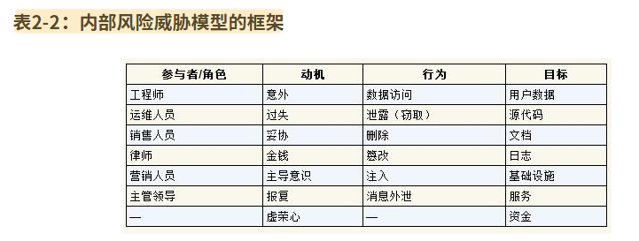{width="5.770833333333333in" height="2.1770833333333335in"}

详情可以看《威胁建模》

#### **2.3 攻击者方法论** {#攻击者方法论 .unnumbered}

##### **2.3.1 威胁情报** {#威胁情报 .unnumbered}

知己知彼

-   书面报告: 可以做参考的文档

-   失陷指标: 有限的结构化信息

-   恶意软件报告

##### **2.3.2 网络杀伤链** {#网络杀伤链 .unnumbered}

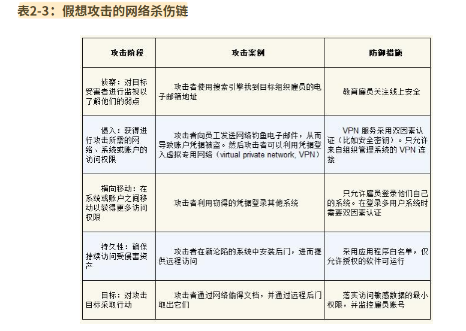{width="5.770833333333333in" height="4.104166666666667in"}

##### **2.3.3 TTP** {#ttp .unnumbered}

技术、战术和过程（Techniques, Tactics, and Procedures）

-   战术: 攻击者意图/目标

-   技术: 实现目标的具体方法, 攻击向量

-   过程: 技术方法的使用/实现步骤

#### **2.4 风险评估注意事项** {#风险评估注意事项 .unnumbered}

-   在被攻击前, 没人知道自己会被攻击(看近期快手)

-   攻击手段并一定是复杂的, 可能简单手段也会成功

-   不要低估攻击者

-   归因是很难的, 很多人不知道自己怎么死的

-   攻击者可能不会受到法律制裁

## **二. 设计系统** {#二.-设计系统 .unnumbered}

### **示例: 安全代理**

#### **3.1 生产环境的安全代理** {#生产环境的安全代理 .unnumbered}

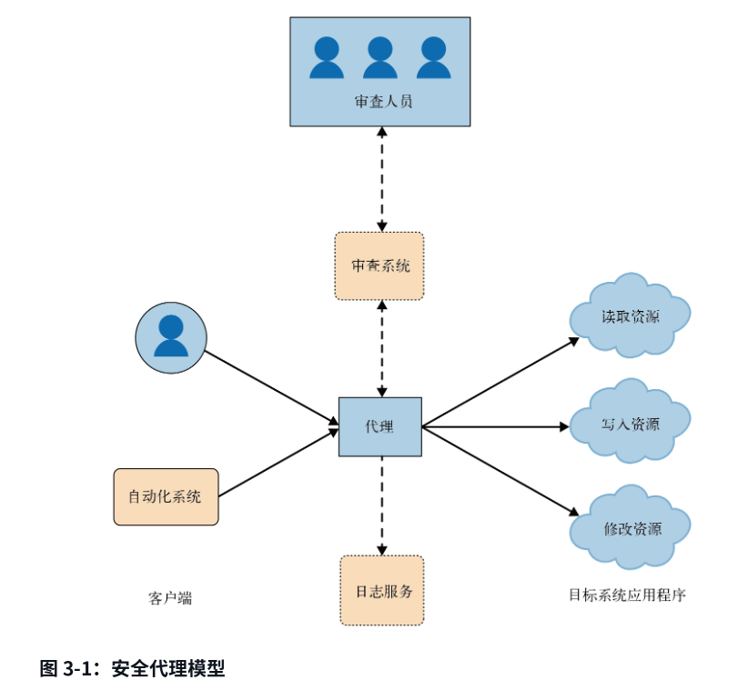{width="5.770833333333333in" height="5.322916666666667in"}

像对服务器/数据库等做操作, 需要到对应的服务器终端上操作, 哪怕最小特权原则限制了账号的权限, 还是会存在很大的风险; 而google的ZTP(Zero Touch Production, 零接触生产) 就是通过服务代理这些命令操作; 通俗说: 就是自己做了服务将命令行的操作包装了一下, 这样可以做ACL, 审计, 日志记录等等自定义的操作

#### **3.2 Google工具代理** {#google工具代理 .unnumbered}

和前面的处理思想是差不多, 只是这里是CLI工具

### **设计中的权衡**

#### **4.1 设计目标和要求** {#设计目标和要求 .unnumbered}

##### **4.1.1 特性需求** {#特性需求 .unnumbered}

就是功能需求, 特性需求与可靠,安全在某种角度上是处于对立面的, 但又是共同发展构建的;

有提到**关键需求**, 一个产品大部分流量都是集中某些关键需求上(哪里都可以套的二八原则)

##### **4.1.2 非功能性需求** {#非功能性需求 .unnumbered}

这类是安全, 可靠等保证服务质量的需求; 和特性需求的关系管理可以参考下可靠性工程中错误预算的处理方式

##### **4.1.3 功能与涌现特性** {#功能与涌现特性 .unnumbered}

特性需求, 文档-实现-测试验证; 做的事情是确定性的, 可验证的

文中归为\"**线性特性**\"

而可靠和安全的特性不是只围绕一个功能的实现, 所以在功能层面上涉及到多个领域, 也会在不同基础设施之间有关联, 文中归为\"**涌现特性**\"

##### **4.14 Google设计文档模板** {#google设计文档模板 .unnumbered}

-   可扩展性

-   冗余和可靠性

-   依赖的注意事项

-   数据完整性

-   SLA要求(非2b是否只要关注SLI/SLO的栈)

-   安全和隐私考虑

#### **4.2 需求平衡** {#需求平衡 .unnumbered}

使用了\"支付系统\"的案例讲解.

主要是敏感数据的处理, 和第三方服务的信任问题

#### **4.3 处理紧张局势和统一目标** {#处理紧张局势和统一目标 .unnumbered}

这就是前文说到的, 对立面的问题;

此处案例是\"微服务和Google Web应用程序框架\"

-   动静态一致性检查

-   组件间的隔离约束检查

-   自动化操作手脚架, CI等

框架完成都是在可靠性团队和安全团队合作下完成

#### **4.4 初始速度和持续速度** {#初始速度和持续速度 .unnumbered}

安全/可靠会减慢功能的速度

都是围绕着对什么时候开始考虑安全性和可靠性的扯皮

### **最小特权设计**

**最小特权原则**是指,用户应该只拥有完成任务所需的最低权限,不管访问是来自人还是来自系统

权限放的越小, 风险也会随之降低

\-- 希望不是一种战略

保持警惕

#### **5.1 概念和术语** {#概念和术语 .unnumbered}

-   最小特权

-   零信任网络

-   零接触 ( ZTP, ZTN 基本就是通过做一个系统/服务来包装代理 )

#### **5.2 基于风险的访问分类** {#基于风险的访问分类 .unnumbered}

任何降低风险的策略都是需要权衡的

因为降低风险意味着成本的增加(各方面的, 人力, 便利度, 机器等等)

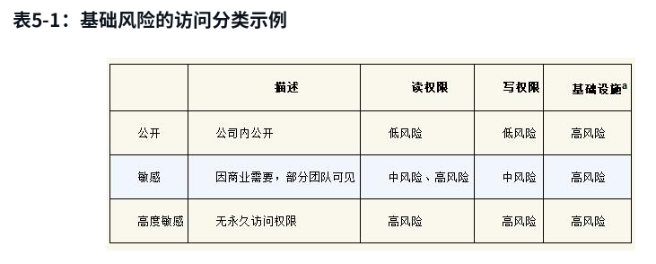{width="5.770833333333333in" height="2.3125in"}

#### **5.3 最佳实践** {#最佳实践 .unnumbered}

案例来了

##### **5.3.1 API功能最小化** {#api功能最小化 .unnumbered}

其实根据LSP, ISP也应该这样

POSIX, SSH的样例

##### **5.3.2 Breakglass机制** {#breakglass机制 .unnumbered}

例如紧急上线这种, 遇到紧急情况, 直接绕过所有限制直接拿到最高权限; 只在救火时候用到; 且要加以限制和严格审计

后面还有详述

##### **5.3.3 审计** {#审计 .unnumbered}

Google两大类审计:

-   审计确保遵循最佳实践的做法

-   审计确认安全违规事件

还说了下结构化论证/结构化数据和审计日志相关的; (我觉得这部分会和可观测性有关, 因为要审计那就要全面完整的数据, 而可观测性也是为了全面完整实时的数据, 后者也有提到结构化日志)

##### **5.3.4 测试和最小特权** {#测试和最小特权 .unnumbered}

合理测试是任何一个设计精良的系统的基础属性

-   **针对**最小特权进行测试

-   **使用**最小特权进行测试

##### **5.3.5 诊断被拒绝的访问** {#诊断被拒绝的访问 .unnumbered}

面对三种拒绝访问

-   合理拒绝, 运行正常

-   合理拒绝, 但可以有临时访问权限

-   不合理拒绝

##### **5.3.6 优雅失败和Breakglass** {#优雅失败和breakglass .unnumbered}

breakglass使用准则

-   严格限制, 只有SRE团队有权

-   零信任网络里只有特定范围可以

-   监测所有的使用情况

-   定期测试, 保证可用

#### **5.4 案例: 配置分发** {#案例-配置分发 .unnumbered}

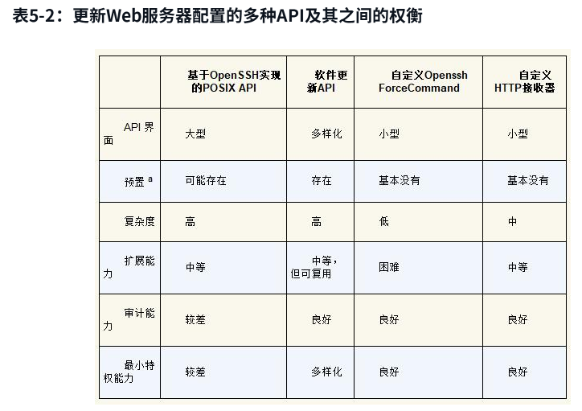{width="5.770833333333333in" height="4.072916666666667in"}

#### **5.5 认证和授权决策的策略框架** {#认证和授权决策的策略框架 .unnumbered}

认证: 验证用户或进程的身份

授权: 评估来自特定认证方的请求是否应该被允许

认证身份复杂性层次:

-   简单: 参数标识

比如: /api/get?username=admin

-   相对复杂: 共享密钥

比如: WPA2-PSK, HTTP cookie

-   更复杂: 混合加密和证书的方案

例如: TLS1.3, OAuth

##### **5.5.1 使用高级授权控件** {#使用高级授权控件 .unnumbered}

多因素授权(MFA)

多方授权(MPA)

一个是把验证链路方式变多

一个是审批的人变多

都是让多个因素兜底保证可靠安全

##### **5.5.2 投入广泛使用的授权框架** {#投入广泛使用的授权框架 .unnumbered}

使用公共库来完成对应的工作逻辑, 这是肯定. 因为都是通用组件

##### **5.5.3 避免潜在的陷阱** {#避免潜在的陷阱 .unnumbered}

设计授权策略语言? 我天, 这种DSL还是尽量通用一点, 可以直接使用吧.

#### **5.6 高级控制** {#高级控制 .unnumbered}

##### **5.6.1 MPA** {#mpa .unnumbered}

MPA通常应用于大范围的访问控制, 比如: 访问权限的审批,

\"广义的 MPA 可以作为一种有价值的 Breakglass 机制\" 这话怎么讲?

潜在陷阱, 审批人员需要有充足的上下文才可以做出正确的审批决定

##### **5.6.2 3FA** {#fa .unnumbered}

MPA通常有个关键弱点, 审批方都是在同一个工作站内, 相同/相似的环境容易被全部攻破

要降低单平台受侵害导致授权被破坏的风险:

-   至少维护两个平台

-   在两个平台上都可以批准请求

-   至少加固一个平台

看着太苛刻了, 成本非常高

根据后文描述, 这里的平台应该不是两套授权后台? 而是授权的客户端平台

注意: 3FA和2FA(MFA)不是一类的. 更像MPA的增强

##### **5.6.3 业务依据** {#业务依据 .unnumbered}

审批单的相关上下文, 不仅仅是\"谁\"申请\"什么\"权限, 而要把关联的业务背景相关都关联, 让审核人员确认是否必要

甚至可以完成自动审批

##### **5.6.4 临时访问** {#临时访问 .unnumbered}

比如sudo等\...临时获取高权限

##### **5.6.5 代理** {#代理 .unnumbered}

比如前文的ZTP, 通过包装操作代理转发, 代理服务中可以做很多限制/验证功能

#### **5.7 权衡和冲突** {#权衡和冲突 .unnumbered}

##### **5.7.1 增加安全复杂性** {#增加安全复杂性 .unnumbered}

pass

##### **5.7.2 对合作商及公司文化的影响** {#对合作商及公司文化的影响 .unnumbered}

什么玩意?pass

##### **5.7.3 影响安全性的质量数据和系统** {#影响安全性的质量数据和系统 .unnumbered}

作为最小特权基础的零信任环境中，每个安全决策都取决于两件事：

-   执行的策略

-   请求的上下文

类比一下, 就像之前在线策略的方式, 参数+画像-\>场景策略

##### **5.7.4 对用户工作效率的影响** {#对用户工作效率的影响 .unnumbered}

复杂的授权/验证必要会带来体验的降低

##### **5.7.5 对开发复杂性的影响** {#对开发复杂性的影响 .unnumbered}

pass

### **面向易理解性的设计**

易理解性的定义:

让相关技术背景的人员能够准确且自信地解释一下两点:

-   系统运行时的行为

-   系统的不变性约束条件, 包括安全性和可用性

#### **6.1 为什么易理解性很重要** {#为什么易理解性很重要 .unnumbered}

-   降低安全漏洞或弹性故障的可能性

-   促进有效的事件响应

-   增强对于系统安全态势的断言的信心

关于系统安全性的断言通常用不变量来表示

**不变量(invariant)**指系统所有可能的行为必须具备的属性,他是一种长期会遵守的规则/准则;

##### **6.1.1 系统不变量** {#系统不变量 .unnumbered}

**系统不变量**是一个永真的属性，无论系统环境运行状况正常与否

不变量=系统负责确保的期望属性

样例:

-   只有通过身份认证和响应授权的用户才能访问系统的持久化数据存储

-   后端在预定时间内未能响应, 前端会有优雅降级来响应

-   一个系统之从一组特定系统接收RPC请求, 并且将RPC发送到一组特定系统

所以不变量就类似期望行为, SLO这种的观念

##### **6.1.2 分析不变量** {#分析不变量 .unnumbered}

分析攻击者的可能攻击向量; 利用现有信息证明可靠(有点变态)

##### **6.1.3 心智模型** {#心智模型 .unnumbered}

心智模型是指工程师理解一个复杂系统时, 主动构建的\"局部抽象\"

#### **6.2 设计易理解的系统** {#设计易理解的系统 .unnumbered}

##### **6.2.1 复杂性和易理解性** {#复杂性和易理解性 .unnumbered}

易理解性的主要对立面是不受管理的复杂性

现代的系统形式和规模(分布式, 微服务), 系统的众多功能必然的带来了一定的复杂性

##### **6.2.2 分解复杂性** {#分解复杂性 .unnumbered}

通过组件的心智模型搭建, 再到组件间的, 整个系统的理解

##### **6.2.3 集中负责安全性和可靠性需求** {#集中负责安全性和可靠性需求 .unnumbered}

pass

#### **6.3 系统架构** {#系统架构 .unnumbered}

将系统分层和组件化是管理复杂性的关键工具

拆分子问题易于理解

系统不免会有外部依赖rpc,api等

##### **6.3.1 易于理解的接口规范** {#易于理解的接口规范 .unnumbered}

针对外部接口的约束

-   结构化接口

-   一致的对象模型

-   幂等操作

优先选用解释空间更少的窄接口 (更结构化

优先选用实施通用对象模型的接口

注意幂等运算

##### **6.3.2 易于理解的身份、认证和访问控制** {#易于理解的身份认证和访问控制 .unnumbered}

**身份**, 是与实体相关联的一组属性或标识符, **凭证**可以用来确定特定实体的身份

比如: 简单密码, X.509证书, OAuth2令牌

身份属性对安全和可靠都是**有利**的

-   易于理解的身份标识

-   坚决抵制伪造

-   具有不可重用的身份标识

这几个特点说的就很\"谁不知道呢\"

案例: Google 生产系统的身份模型

对管理员, 机器, 工作负载, 用户; 从不同角色, 到不同层级上的实体进行建模

**身份认证和传输安全**, 是复杂的学科, 和密码学关联非常大, 和分组/序列, 公钥, 签名, hash等等都有关系;

**访问控制(ACL)**, 注意不同位置+不同身份的效果

##### **6.3.3 安全边界** {#安全边界 .unnumbered}

系统的可信计算基础(TCB): 当正确运行时足以确保实时安全策略的一组组件(硬件, 软件, 人类等)

如果这个基础不能保证, 就一定会违反安全策略;

TCB和其他部分的接口就是安全边界; 这里是比较模糊的概念, 并不是具体的网络接口/API等

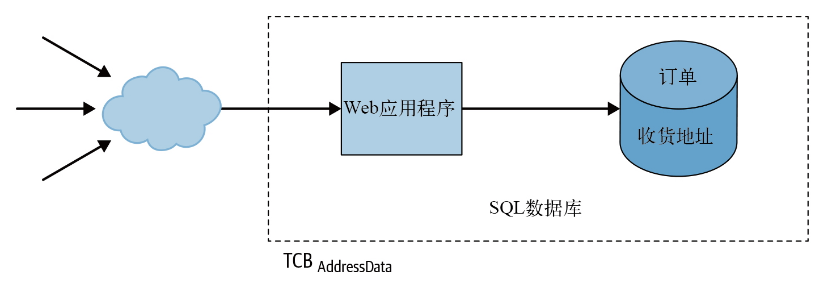{width="5.770833333333333in" height="1.9791666666666667in"}

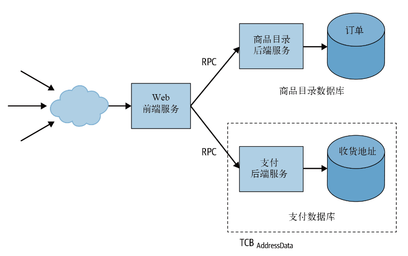{width="5.770833333333333in" height="3.6145833333333335in"}

**安全边界和威胁模型**

边界要做鉴权认证等;

用户上下文是重要依据

\"浏览器基于同源策略的规则限制跨源的内容和代码之间的访问\", 也是一种隔离保护

**TCB和易理解性**

TCB通常是独立的故障域

记得\"书-分布式系统架构\"里, 就有提到的\"根据数据安全划分边界\"; 也是一种易于理解/拆分的手段;

#### **6.4 软件设计** {#软件设计 .unnumbered}

##### **6.4.1 使用应用程序框架满足服务需求** {#使用应用程序框架满足服务需求 .unnumbered}

就是说利用通用的框架/手脚架, 减少重复劳动

##### **6.4.2 理解复杂的数据流** {#理解复杂的数据流 .unnumbered}

许多安全属性依赖数据流的属性值断言(发现错误数据)

断言的话, 像之前pb的插件validate, 尽早做有效检查

还有orm的类似检验

##### **6.4.3 考虑API的可用性** {#考虑api的可用性 .unnumbered}

对外部依赖API, 要考虑引入他的, 他带来的对可靠/安全的威胁; 如果依赖的API失效, 应该如何保证自身系统的正常;

###  **适应变化的设计**

唯一不变的就是变化本身

#### **7.1 安全变更的类型** {#安全变更的类型 .unnumbered}

-   响应安全事件的变更(事故驱动)

-   针对新发现的漏洞而进行响应的变更(漏洞报告, 公共安全问题)

-   产品/功能变更(理论上占比最大)

-   改善安全态势而内部驱动的变更(内部目标)

-   外部驱动的变更(监管/法律要求)

#### **7.2 变更中的设计** {#变更中的设计 .unnumbered}

变更应该有以下特征

-   逐步迭代

-   存档可查

-   经过测试

-   隔离(版本控制)

-   质量验证(和测试算同门)

-   阶段式(主要是交付/发布)

#### **7.3 让发布更容易的架构决策** {#让发布更容易的架构决策 .unnumbered}

主要是领域划分

-   让依赖项保持最新并频繁重建

避免漏洞

-   使用自动化测试

-   使用容器

-   使用微服务

#### **7.4 不同的变更: 不同的速度与不同的时间线** {#不同的变更-不同的速度与不同的时间线 .unnumbered}

不同的变更会影响速度的因素:

-   严重程度

-   依赖的系统和团队

-   敏感度

-   截止日期

案例:

-   短期变更: 0day漏洞

0day需要快速响应, 紧急发布

-   中期变更: 改善安全态势

主要是内部发起的安全升级, 按部就班不会很紧急

-   长期变更: 外部需求

这类需求都是全范围整体替换, 周期很长, 比如: HTTPS使用率, 全面上云, 替换加密模块等等

#### **7.5 难点: 计划调整** {#难点-计划调整 .unnumbered}

频繁被利用的漏洞-\>导致加速

变更出现体验问题, 问题不严重-\>变缓

其实就是正负反馈的问题

#### **7.6 案例 - 不断扩大的范围: 心脏滴血漏洞** {#案例---不断扩大的范围-心脏滴血漏洞 .unnumbered}

2011年12月, OpenSSL未被识别的缺陷, 可导致服务器或客户端能够访问另一台服务器或客户端的 64KB 私有内存数据(卧槽, 逆天)

### **弹性设计**

弹性的定义: 系统抵御攻击和承受异常情况（给系统带来压力并影响可靠性的场景）的能力

#### **8.1 弹性设计原则** {#弹性设计原则 .unnumbered}

-   每一层都具备弹性的状态

-   确定每项功能的优先级及其成本

-   按照明确的边界定义划分系统

-   利用部分区域冗余防止局部故障

-   尽可能自动执行弹性措施, 缩短反应时间

-   定期验证有效

#### **8.2 纵深防御** {#纵深防御 .unnumbered}

##### **8.2.1 特洛伊木马** {#特洛伊木马 .unnumbered}

缺少纵深防御被一锅端

抽象为4个阶段

-   威胁建模 和 漏洞发现

-   部署

-   执行

-   攻破

##### **8.2.2 GAE分析** {#gae分析 .unnumbered}

GAE当时的进程隔离, 不过按现在的情况, 都是容器技术了

#### **8.3 控制降级** {#控制降级 .unnumbered}

出问题时利用优雅降级来保证安全/可靠

关注如何做到可控; 考虑因素:

-   区分故障成本

计算资源, 用户体验, 缓解速度

-   部署响应机制

    -   返回错误-\>降低负载

    -   将响应延迟到接近截止时间-\>限制客户端(就是我返回错误也不立刻给你, 先让你等一会, 避免立马给你错误, 你又重新狂按, 天才)

围绕降低负载, 限流, 自动响应

-   负责任的自动化

失效安全 - 失效暴涨

不要让自动化系统进行**大规模**(单个服务所有请求) 或者 大范围(所有服务器)的无监督策略变更, 很危险

#### **8.4 控制爆炸半径** {#控制爆炸半径 .unnumbered}

爆炸半径, 故障域等

可以参考一下领域划分, 数据级别分区, 网络分区等等

-   角色分离(领域)

-   位置分离(数据层级, 服务地域等)

-   时间分离(票据隔离)

#### **8.5 故障域和冗余** {#故障域和冗余 .unnumbered}

系统分解成独立的故障域, 划分是亘久不变的; 每个域内的资源要有冗余可替换, 和定期备份

-   故障域

功能隔离, 数据隔离, 和前面说的差不多

-   组件类型

大容量组件(承载大部分流量的, 比如QQ消息), 高可用组件(少依赖, 不停机不出障碍, 稳定), 低依赖组件(更高一级, 最少依赖)

-   控制冗余

故障转移策略

冲突陷阱: 高可用服务因为安全修复问题需要发布, 还有另外两个冲突问题, 可以看看原文

#### **8.6 持续验证** {#持续验证 .unnumbered}

-   关键区域

最小特权、易理解性、适应性和易恢复性

-   验证实践

注入预期的行为变化

将紧急组件作为正常工作流的一部分

无法经请求时拆分

允许超额使用, 但防止自满

测算密钥轮换周期

#### **8.7 案例: 着手点** {#案例-着手点 .unnumbered}

重点在成本

### **面向恢复性的设计**

#### **9.1 要恢复什么** {#要恢复什么 .unnumbered}

-   随机错误: 硬件错误, 拜占庭故障, 数据中心级别的(地震, 停电)

-   意外错误: 人为操作

-   软件错误: 设计缺陷, 0day等

-   恶意行为: 黑客攻击

#### **9.2 恢复机制的设计原则** {#恢复机制的设计原则 .unnumbered}

-   面向快速恢复的设计

这种设计不在于架构, 更多是在于CI/CD, 可观测的自动化上

-   限制对外部观念的依赖

分布式系统两大敌人啊, 网络和时钟

-   回滚所代表的安全性和可靠性的权衡

又是新旧版本, 变动和不变动对两者的影响

-   显式吊销机制

在面对入侵时, 主动关闭某些功能, 这个比降级要严重多了

-   了解精确到字节的预期状态

系统的状态包括系统执行其所需功能时涉及的全部必要信息

我觉得可观测性和服务逻辑清晰都很影响

-   面向测试和持续验证的设计

测试和CI/CD, 这里不详细列举了

#### **9.3 紧急访问** {#紧急访问 .unnumbered}

这种情况是非常基础设施考虑的,出现在极端例子中

Google 的远程访问策略主要是将独立关键服务分散部署到位于不同地点的机架上

-   **访问控制**

做凭证校验,ACL或者零信任

-   **通信**

应急通讯渠道,都是大崩溃的手段

-   **响应人员的习惯**

#### **9.4 预期外的收益** {#预期外的收益 .unnumbered}

过

### **缓解拒绝服务攻击**

#### **10.1 攻守双方的策略** {#攻守双方的策略 .unnumbered}

-   攻方: Dos, DDos, 流量放大攻击

-   守方: 成本对抗

#### **10.2 面向防御的设计** {#面向防御的设计 .unnumbered}

-   具有防御能力的架构

共用基础设施中共用防御能力, 容错,负载均衡等, flood

任播技术anycast, 一个ip通知不同后端响应

-   使服务具备防护能力

缓存代理, 过滤不需要的api请求, 缩小出口带宽(回包大小)

#### **10.3 缓解攻击** {#缓解攻击 .unnumbered}

-   监控与告警: 可观测性的守护

-   优雅降级: 服务降级保护核心业务

-   DoS防护系统:

检测, 响应; 动态拦截ip(门神)

-   有策略的响应

对于无意义请求过滤

#### 10.4 应对源于服务本身的\"攻击\" {#应对源于服务本身的攻击 .unnumbered}

-   用户行为

非运营活动的自发流量高峰

-   客户端重试行为

服务出现延迟后,重试导致雪崩;

常态策略: 客户端随机等待

故障事故策略: 最大延迟返回

## 三. 实现系统 {#三.-实现系统 .unnumbered}

### 案例: 设计,实现,维护公共CA

这一章讲了google出现对CA的需求,然后在如何实现,到自主研发,到如何实现,推广\...

#### 受信任的公共CA的背景

讲了为什么会做CA的背景; CA做什么的, https相关的加密的需求出现, 使用其他CA有一系列的安全/可靠问题

#### 为什么需要受信任的公共CA

早期google使用第三方CA的问题:

-   第三方依赖

-   自动化需求

-   成本

#### 自建还是购买CA

两者都能让服务部署在自己的环境上

选择自建的理由:

-   透明度和有效性

-   集成能力

-   灵活性

#### 设计,开发和维护过程中的考虑

为了CA的安全, 设计的三层体系结构

-   证书申请解析

-   注册机构的功能

-   证书签名

双信任空间架构(不懂, 不懂CA是真的不懂)

为了保证简洁性引入完备的测试, 为了安全性使用容器环境

-   编程语言的选择: Go和C++, 保证内存安全和原有技术栈

-   复杂与简明: 一开始没有实现CA标准全部功能, 只实现常用和内部使用的功能

-   保护第三方和开源组件: 使用发现漏洞时提交issue

-   测试: fixit加固

-   CA密钥材料的弹性: 防止密钥失窃或无用; 材料离线保存+多层物理保护, 每层访问需要2FA

-   数据验证: 防止证书签发错误

### 编写代码

#### 框架级安全和可靠性保证措施

-   列举使用框架的好处, 已有的手脚架+插件自带许多已有的基础能力

-   rpc框架的通信保证(grpc? 他没说, 但看描述像是)

#### 常见安全漏洞

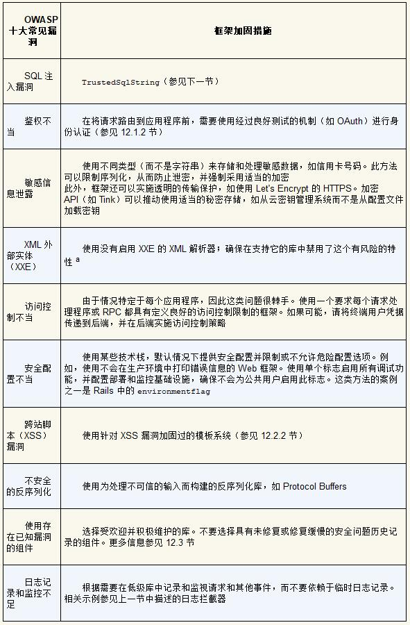{width="5.772222222222222in" height="8.790185914260718in"}

其实没必要截图, 这个可以直接去OWASP(Open Web Application Security Project)上面看,

#### 评估和构建框架的经验

-   用于常见任务的简单,安全,可靠的库: 一步步,由简入繁

-   部署策略: 类型安全保证代码质量

### 代码测试

#### 单元测试

java的JUnit, C++的GoogleTest,Golang的go2xunit,python的unittest

我目测,这些工具有点落后了

-   有效的单测

-   单测的时机: 越早越好

-   单测的影响

我简单说两句吧, 现在有AI, 你只要架构设计正确, 那么就是一句话的事情

#### 13.2 集成测试 {#集成测试 .unnumbered}

集成测试超越了独立单元和抽象的范畴，用真实的实现替换了虚假或残缺的抽象模拟，如数据库或网络服务等

单测是可以mock的, 只测类级别的逻辑;

但集成测试就是类似联调时机的, 对服务响应的测试

#### 13.3 动态程序分析 {#动态程序分析 .unnumbered}

运行环境的动态分析/检测等

Google Sanitizer(没用过)

#### 13.4 模糊测试 {#模糊测试 .unnumbered}

模糊测试作为前面测试的补充, 长周期, 随机测试(app客户端很常见)

看go-fuzz引擎的

#### 13.5 静态程序分析 {#静态程序分析 .unnumbered}

代码测试覆盖率, 代码正确性等静态扫描; 比如像啄木鸟, 或者现在让AI看代码(烧token)

更基础的就是各种linter

依赖AST, 程序的控制流图CFG

### 部署代码

#### 概念和术语

软件供应链

版本控制VCS, 持续集成CI, 持续交付CD

这本书感觉有点年头了. 现在已经是十分普遍的概念

#### 威胁建模

三种攻击者类型

-   无意间犯错的内部人士

-   试图越权的恶意内部人员

-   入侵内部人员的外部攻击者

零信任, 可观测性, 主动发现等等

#### 最佳实践

-   强制代码审查

-   依赖自动化

-   验证工件

#### 基于威胁建模做安全加固

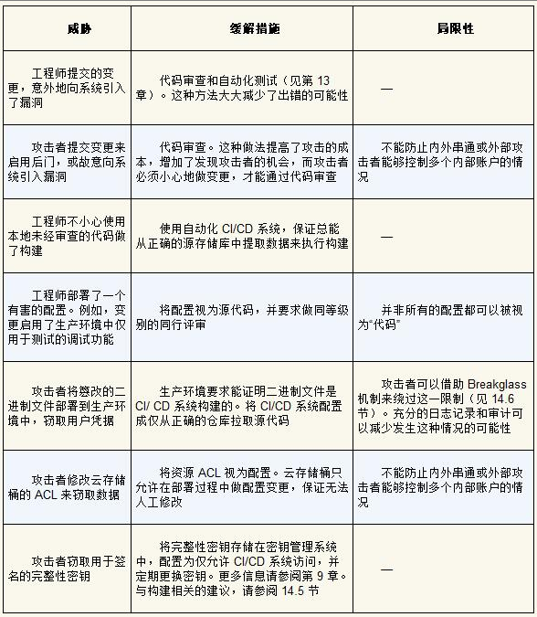{width="5.772222222222222in" height="6.626275153105862in"}

#### 高级缓解策略

围绕着可执行文件和构建

-   二进制文件来源:

-   基于来源的部署策略

-   可验证的构建

-   部署阻塞点: k8s的主节点做管控

-   部署后验证

#### 实用建议

-   一步步推进

-   提供可操作的错误信息

-   确保来源信息明确

-   创建明确的策略

-   引入breakglass机制

#### 基于威胁建模部署安全措施

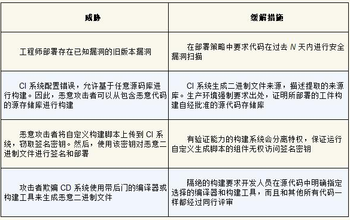{width="5.772222222222222in" height="3.621205161854768in"}

### 调查系统

#### 从调试到调查

**案例: 临时文件**

大量小文件创建累计导致的问题

排查创建来源

内存用处

缓存变化

复现错误

**调试技巧**

了解系统的工作原理, 有条理的进行: 收集数据, 推测原因并验证

-   常见错误和罕见错误会有相同表征

-   数据损坏和校验和

-   流出时间做调试和调查

-   记录你的观察和预期

-   了解系统的正常情况

-   复现缺陷

-   隔离问题

-   注意相关性与因果性

-   用真实数据验证假设

-   重读文档

-   实践

**当陷入困境时**

-   提高可观测性

-   休息一下

-   清理代码

-   删除旧系统

-   出错时停止

-   完善访问,授权的控制机制

**协同调试**

重大问题, 多人一起调试, 在一个会议室里, 一个操作员, 其他观察员众策群力, 指挥操作; 避免疲劳, 定时切换操作员

**安全调查与系统调试的差异**

找非预期行为 和 找不正常的预期行为

马与斑马; 普遍的功能缺陷和少见的恶意行为

#### 收集恰当,有用的日志

本章日志是结构化,带时间戳的记录

-   日志不可变(不可篡改)

-   考虑隐私要素 (记录深度, 保留周期, 访问和审计控制, 数据匿名化或假名化, 加密)

-   确定保留那些安全相关的日志

操作系统日志, 主机agent, 反病毒软件, 应用程序日志, 云日志, 清点资产, 基于网络的日志记录和检测

-   日记记录成本, 可观测性的一大问题, 采集维度,精度导致的成本爆炸, \"存不起\"

#### 可靠,安全的调试访问

-   可靠性: 日志记录是可能造成系统故障的原因之一, 磁盘消耗和IO

-   安全性: 日志泄露问题

## 四. 维护系统 {#四.-维护系统 .unnumbered}

### 防灾规划

#### 灾难的定义

-   自然灾害

-   基础设施灾害

-   依赖服务崩溃

-   未预见的服务降级

-   未发现的发布攻击者

-   未授权的敏感数据泄露

-   0day的安全漏洞

#### 动态灾难响应策略

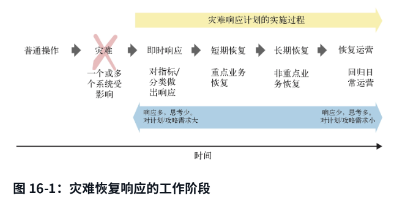{width="5.772222222222222in" height="2.9488517060367454in"}

#### 灾难风险分析

项目确定时, 对出现问题的预知影响面

直觉性的运维情况评估

正式的风险评估方法

#### 建立事件响应团队

事件响应 IR *Incident Response*

有几种方式

-   成立全职IR团队

-   在当前工作职责上, 员工新增IR职责

-   IR工作外包第三方

后续就是如何组建团队, 团队角色分布, 处理事务章程流程, 对事件等级定义, 可靠性栈的定义, 响应计划等

#### 在事件发生钱预先安排系统和人员

安全/可靠要防范于未然

系统准备, 执行的培训, 流程和程序的制定

#### 测试系统和响应计划

审计自动化系统, 桌面演练, 生产环境的测试响应, 红队演习, 评估响应

#### google案例

描述全球影响的测试案例, 具体哪些内容, 遇到的问题和解决方案

行业级漏洞的响应案例, 发现问题-响应处理-事后措施

### 危机管理

#### 是否存在危机

**事件分诊**

-   误报

-   容易纠正的问题(偶然成功的入侵)

-   复杂切有潜在破坏性的问题(针对性,可持续的入侵)

**入侵与缺陷**

两者都可能造成巨大损失. 但响应人员不同

#### 指挥事件

-   先别慌张

-   开展响应

-   拉起团队

-   OpSec 运营安全: 危机管理的上下文中指可以让响应活动秘密进行的做法(信息同步, 但只是响应团队和上级同步)

-   不一定符合程序: 比起正确的决策,需要更快找到可能的最佳决策(不一定是)

-   调查过程: 现场保留,取证

#### 控制事件

-   并行处理时间, IR指挥全局对不同模块让不同负责人收集信息,并汇总

-   移交, 在团队长时间运作后, 保存调查结果,相关上下文,初步结论, 然后转交后续接手团队, 连轴转

-   士气, 就是让你休息

-   沟通, 保证团队内信息同步

-   整合回顾, 对各方面的调查报告做阶段性的结论, 是否可以推测缩小范围, 是否缺失关键信息, 是否有初步结论

### 恢复和善后

#### 恢复调度

调查团队→问题定位

问题转交→恢复团队

#### 恢复时间线

恢复的方案和时间线,里程碑

#### 恢复计划

-   确定范围

-   过程影响因素

-   检查清单

#### 启动恢复

-   隔离资产

-   系统恢复/软件升级

-   数据过滤

-   恢复数据

-   更换凭证/密钥

#### 恢复之后

复盘记录所有时间节点, 操作; 总结和现状各阶段对比, 找出优化方案, 列入未来计划

#### 示例

云应用被入侵,大规模钓鱼攻击,针对性黑客攻击的事例中

具体的IR响应, 具体的IC工作示例

## 五. 组织与文化 {#五.-组织与文化 .unnumbered}

### 案例研究: Chrome安全团队

介绍了chrome安全团队的发展历程

主要职责, 发展愿景, 主要业务保证点, 设计纵深防御机制, 保持透明开源吸引社区参与

### 理解角色和责任

构建系统是一个过程，提高安全性和可靠性的过程依赖于人

会有两个重要问题

-   谁为组织的安全性和可靠性负责

-   如何将安全性和可靠性融入组织中

#### 谁为组织的安全性和可靠性负责

-   专家作用

-   了解普及

-   

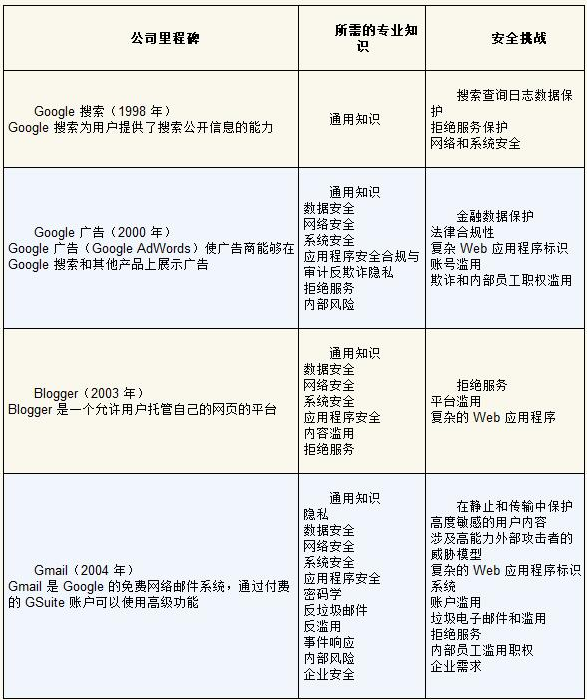{width="5.772222222222222in" height="6.883398950131234in"}

#### 将安全性整合到组织中

部门组织嵌入安全人员和安全团队

案例: google嵌入式安全

特殊团队: 蓝队和红队(攻防演练)

外部研究者激励

### 建立安全可靠的文化

评审文化, 意识普及

面对安全可靠要yes and, 不要no but

# **书-演进式架构** {#书-演进式架构 .unnumbered}

## **一. 机制** {#一.-机制 .unnumbered}

### **演进软件架构** {#演进软件架构 .unnumbered}

对比了下

演进, 应急, 持续等等概念, 就是吹水章节

### **适应度函数** {#适应度函数 .unnumbered}

架构对实际需求的适合程度的量化指标

会从多个角度来评判

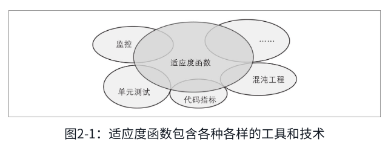{width="5.770833333333333in" height="2.09375in"}

-   监控/可观测性

-   代码指标

-   混沌工程

-   架构测试框架

-   安全扫描

**适应度函数分类**

-   范围分类, 原子与整体

单个服务的上下文, 或者整体系统

-   节奏分类, 触发式, 持续式, 时间式

触发式更多单测这样正确性评判

持续性会像性能测试等

上面两者占据大部分

时间式更像增量更新变动触发?

-   结果分类, 静态, 动态

-   调用方式分类, 自动, 手动

-   响应方式分类, 预设式, 应急式

-   覆盖范围分类, 领域特定

### **实现增量变更** {#实现增量变更 .unnumbered}

### **自动化架构治理** {#自动化架构治理 .unnumbered}

## **结构** {#结构 .unnumbered}

## **影响** {#影响 .unnumbered}
