## 一般问题

##### 如何保证at least once

消息不丢失，但可能重复

生产者: 同步写入模式, 失败重试

消费者: 同步模式, 保证处理成功后更新偏移量

##### exactly once

不丢失, 不重复

保证上面相同的同时, 利用唯一ID进行幂等处理

##### mostly once

## RocketMQ

### 设计理念

还是以topic为主的pub/sub

NameServer是自主实现元数据管理, 没用zk(zookeeper的臭名远扬啊)

I/O存储机制, 持久化文件分组, 组内文件固定大小(没啥新奇的)

多了个**消息过滤**的功能, 难道是有标签选择器之类的做过滤? 后续看详情

关注下**消息重试机制**(是通过offset或者其他机制吗)

**定时消息**(没记错的话, 他是时间轮实现的)

### NameServer 路由中心

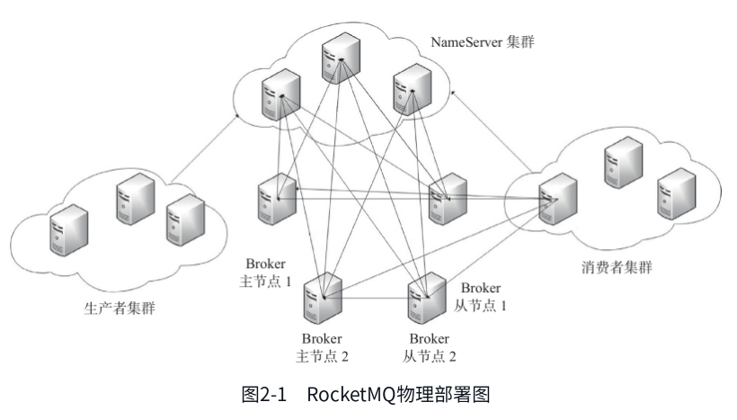{width="5.772222222222222in" height="3.287351268591426in"}

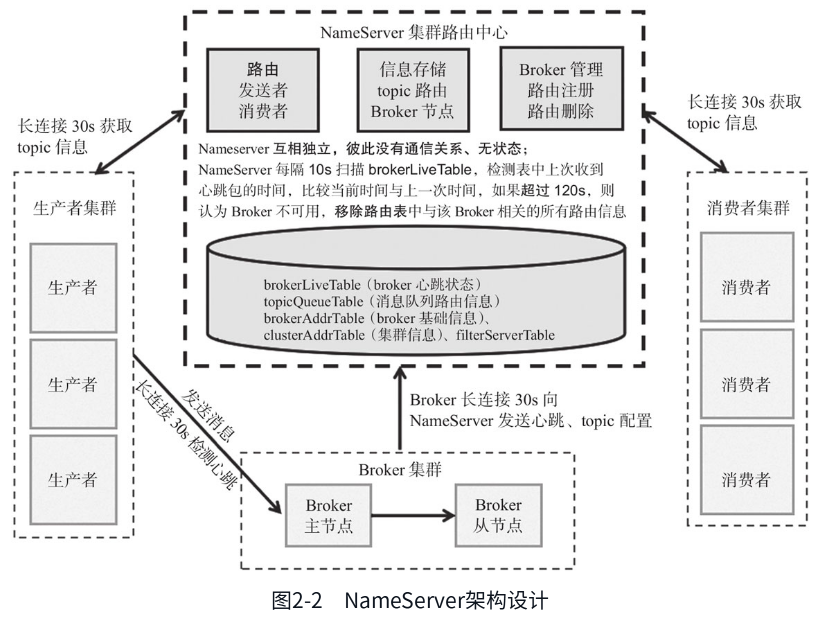{width="5.772222222222222in" height="4.3484536307961505in"}

很普遍的服务发现的结构/架构

ns和每个broker保持长连接, 10s间隔检测心跳(**扫心跳表**), 如果检测到broker宕机则从路由注册表移除, 但不会马上通知生产者or消费者

每10s扫表, 如果时间差\>120s判断不可用, 超时

生成者/消费者每30s拉取topic信息(如果失效后出现失败会立马刷新吗?)

broker每30s上报一次心跳和topic配置

业务线程池管理是Netty的(其他一些启动的java细节不看了)

内存的存储是hashmap的(毕竟元信息数据不多, 一个集群的broker顶多不超过100个)

#### 路由注册

启动时对所有ns发送心跳, 后续就是30s逻辑

ns收到心跳包, 会更新内存的map

nslist是通过rpc获取的(那应该有初始配置地址或者默认DNS之类的)

ns的更新也是上锁改内存的

#### 路由删除

30s周期扫描之后, 判断120s差值超时了

上写锁, 更新

### 消息发送

支持3种, sync, async, one way

考虑的问题

1.  如何进行负载

2.  如何实现高可用(可靠性, 服务弹性, 数据持久化, 数据复制基本就这几类吧)

3.  如何实现一致性(你说副本间一致? 还是生产者消费者之间的一致?)

#### topic

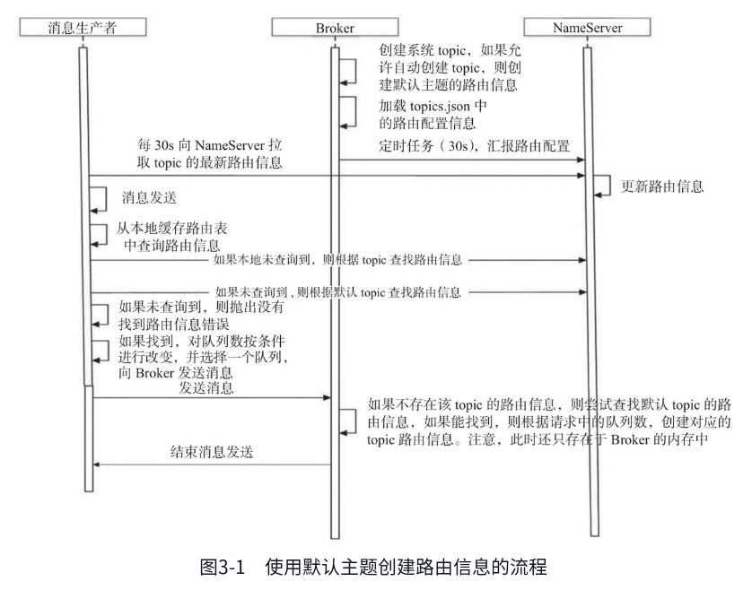{width="5.772222222222222in" height="4.532365485564305in"}

生产者发送前需要向ns获取topic的路由信息

且每30s遍历自身生产的topic, 向ns查询最新的路由信息

#### 高可用设计

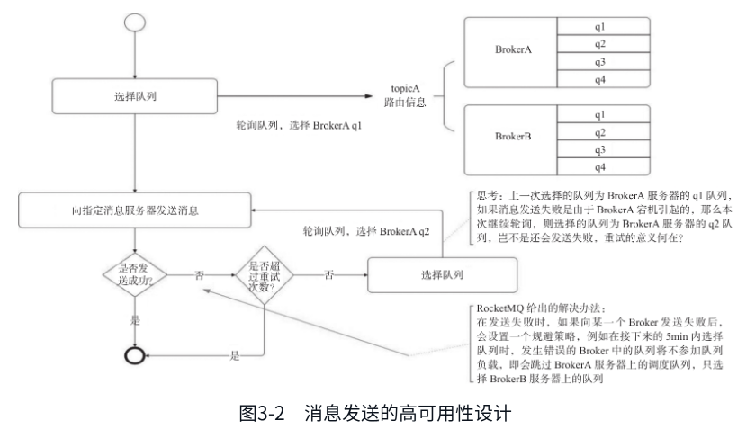{width="5.772222222222222in" height="3.386833989501312in"}

1.  消息发送重试机制

默认会重试两次

2.  故障规避机制

因为发送到broker遇到失败的, 近期重试会进行规避(那么需要记录失败状态)

消息生产/消费整体流程:

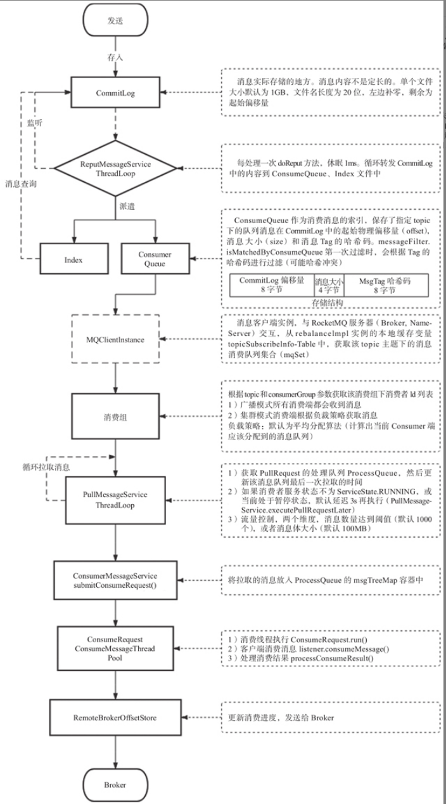{width="4.574305555555555in" height="9.042392825896762in"}

生产者-\>broker-写commit log\<-事件loop监听-\>Index; -\>consumer queue-\>消费者客户端-\>buffer\<-监听loop循环拉取-\>消费处理-\>消费确认-\>broker更新offset

#### 消息格式

拓展属性

tags: 用于过滤(我就说标签selector吧)

keys: 消息的键, 检索用

waitStorMsgOK: 就是sync/async的配置

#### 消息发送(sdk端)

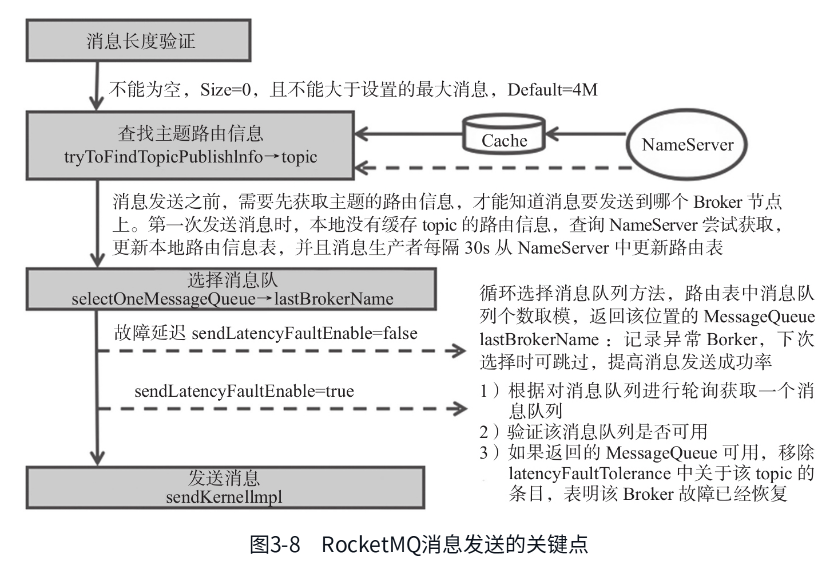{width="5.772222222222222in" height="3.9359208223972004in"}

**同步发送**

各类检查(broker权限, topic可用, 配置等, 队列)

重试/死信队列

ACK确认就开始下一个

**异步发送**

会有并发控制限制, 但我觉得单条通信应该也不会非常大, 避免网络阻塞/包重试过慢等

**单向发送**

我发我的, 不用你回ACK(熟悉的sendonly), 有可能会丢数据

整合batch的批量发送, 也会有长度限制

### 消息存储

#### 文件结构

commit log: 消息的存储, 所有主题的msg都存在一个文件中

ConsumeQueue: msg消费队列, msg先存在commit log, 再异步转发到consume queue

index: 消息索引, 维护key和offset的对应关系

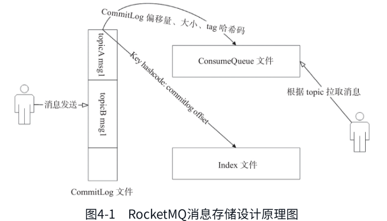{width="5.772222222222222in" height="3.308468941382327in"}

持久化文件的组织方式/存储格式

也是为了追求磁盘的顺序写, 所以是append的, 不修改的

全部主题都写一个文件, 每条消息有一个消息物理偏移量

每个commit log用起始的偏移量作为文件名, 二分快速定位文件位置, 相减得到文件内的物理位置

和kafka比较不一样的就是

统一的文件存储, kafka是topic分目录, partition分目录, 内部段文件分开存储的(kafka如果太多topic落地, 有可能顺序写的优势降级的)

同时kafka也没有后续消费队列, 是直接从文件顺序取消息

也没有索引相关的结构

consume queue的文件结构

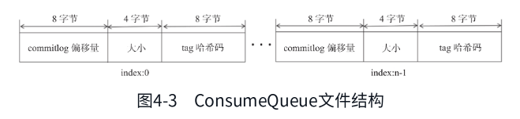{width="5.772222222222222in" height="1.3313779527559055in"}

index文件结构

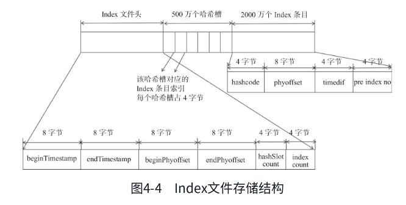{width="5.772222222222222in" height="2.9207786526684165in"}

消费的运行逻辑

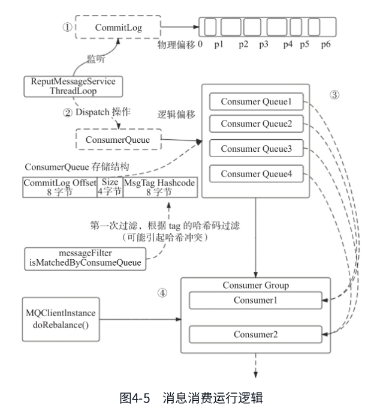{width="5.772222222222222in" height="6.191026902887139in"}

#### 刷盘逻辑

通过JDK NIO的内存映射实现(不是mmap, fwrite什么的吗)

同步刷盘: 组提交, 也不是来一条刷一条, 而是短时间内批次统一刷

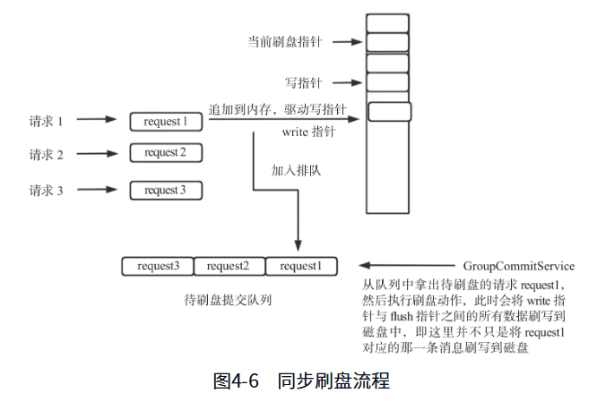{width="5.772222222222222in" height="3.891482939632546in"}

异步刷盘: 性能考虑, 500ms定时刷盘

#### transientStorePoolEnable机制

内存级别的读写分离机制, 为了降低pagecache的压力的. (不太清楚)

一个短暂存储池;

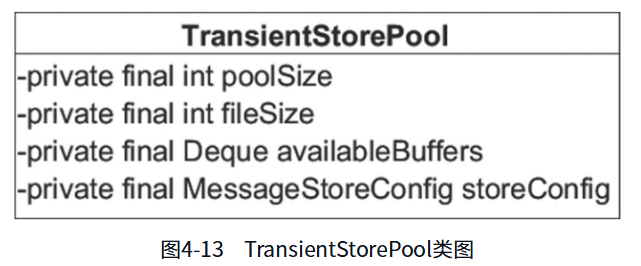{width="5.772222222222222in" height="2.395336832895888in"}

类里面, 池大小, 文件大小, 双头队列和配置

有点像缓存的中间存储

#### 文件恢复机制

consumequeue文件恢复根据最后一条完整偏移量和当前最大偏移对比判断

#### checkpoint文件

记录commitlog, consumequeue, index文件的刷盘时间点, 固定大小

#### 过期文件删除机制

默认72h没有写的文件, 认为过期, 可以通过配置修改

fileReservedTime: 文件保留时间

deletePhysicFilesInterval: 删除文件间隔时间

destroyMapedFileIntervalForcibly: 删除时发现被占用中止后的等待时间

#### 同步双写

给其他broker, replica数据复制的逻辑

旧逻辑:

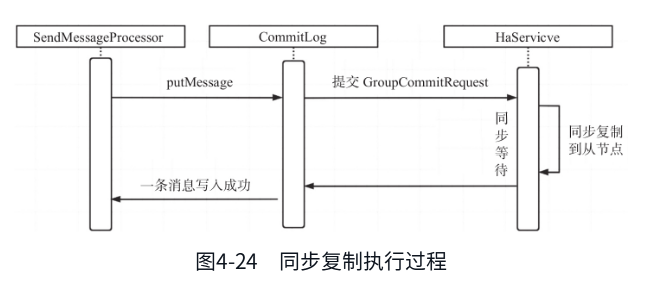{width="5.772222222222222in" height="2.5703729221347333in"}

新逻辑:

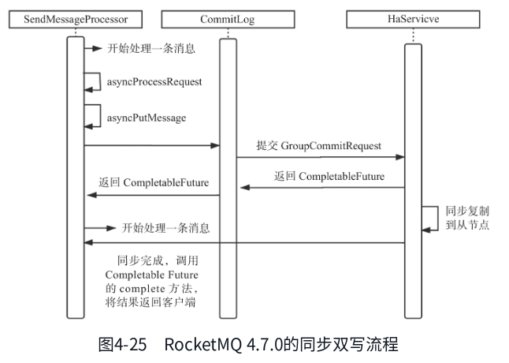{width="5.772222222222222in" height="4.110251531058617in"}

用async了

### 消息消费

topic会对应有多个queue(类似kafka的partition)

消费组有集群模式和广播模式

集群是正常的一条msg消费一次

广播是一条msg消费组内所有消费者都会收到一次

#### 负载机制和重平衡

只针对集群模式(广播不存在负载, 所有都请求)

平衡算法: AVG, AVG_BY_CIRCLE

#### 并发消费模型

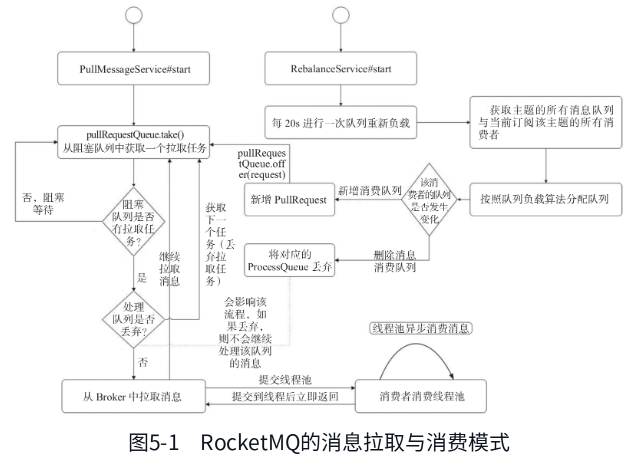{width="5.772222222222222in" height="4.3268799212598426in"}

消费进度反馈

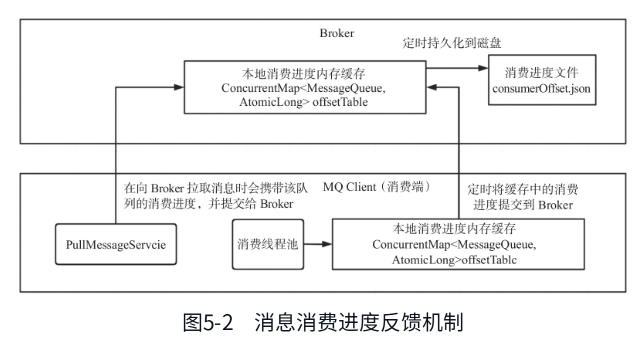{width="5.772222222222222in" height="3.1558409886264216in"}

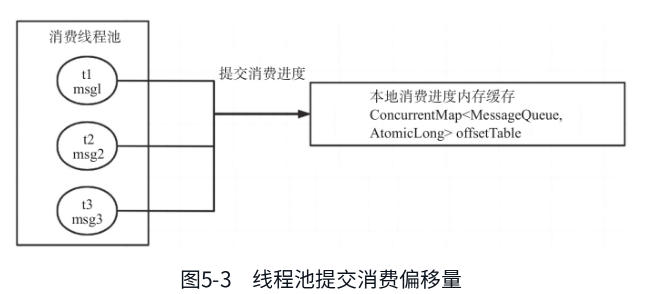{width="5.772222222222222in" height="2.631059711286089in"}

消费者端, 每5s提交所有的队列消息偏移量到broker

broker先放内存, 每5s持久化

拉取消息时也会提交偏移量

#### 消息拉取流程

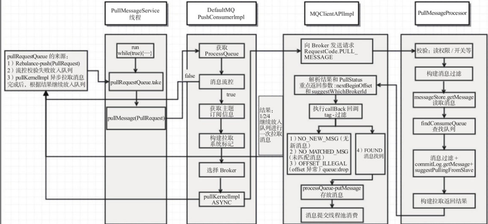{width="5.772222222222222in" height="2.6589391951006123in"}

推模式不是真的服务器推

而是主动发起拉取, 消息未到达消费队列的时候会长轮询或者挂起(看配置)

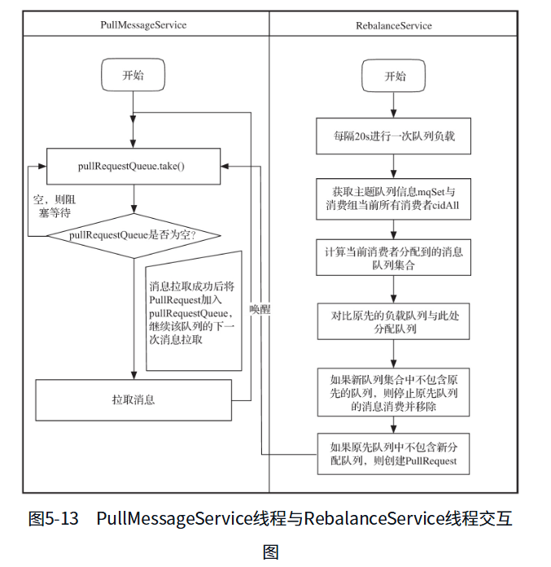{width="5.772222222222222in" height="5.942746062992126in"}

批量拉取最多32

广播模式因为是消费独立的, 所以按消费者为单位存储状态

集群模式按消费者组存储, 且考虑多个消费者间的同步关系

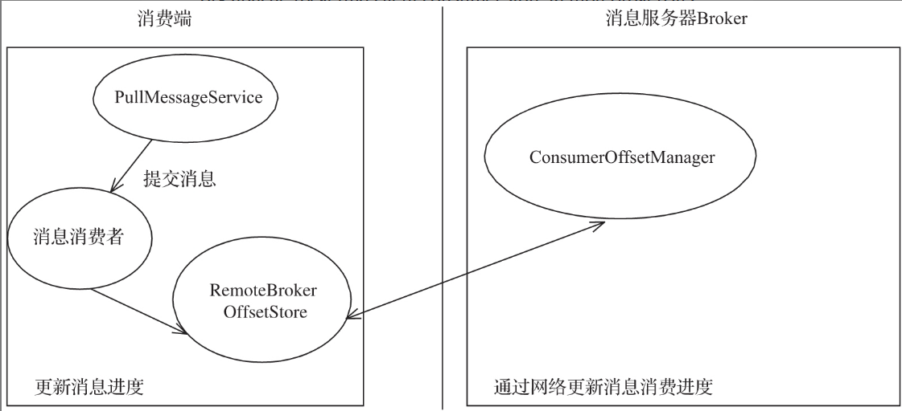{width="5.772222222222222in" height="2.636375765529309in"}

更新偏移量是以消息队列消费的未处理的最小偏移量更新

更大的已处理也不会更新到

存在问题: 某个小偏移量因为死锁一直卡住

拉取流量控制措施: 处理队列最大最小偏移量差值的配置

#### 定时消息机制

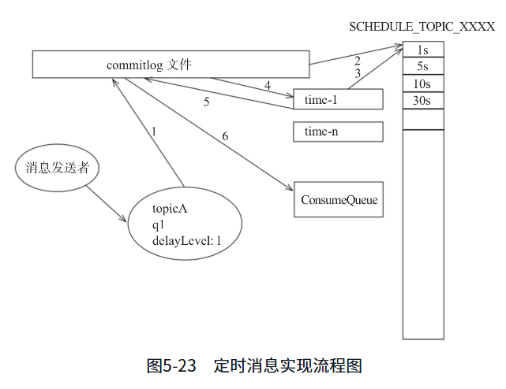{width="5.772222222222222in" height="4.448483158355206in"}

没有支持任意精度的定时调度

是分等级的延时

#### 消息过滤机制

TAG模式

SQL92模式

#### 顺序消息

配置单队列的topic

### 主从机制

#### 同步原理

#### 读写分离

#### 元数据同步

#### 主从切换

raft

## Kafka

以4.0为准
