## 一般问题

##### 如何保证at least once

消息不丢失，但可能重复

生产者: 同步写入模式, 失败重试

消费者: 同步模式, 保证处理成功后更新偏移量

##### exactly once

不丢失, 不重复

保证上面相同的同时, 利用唯一ID进行幂等处理

##### mostly once

## RocketMQ

### 设计理念

还是以topic为主的pub/sub

NameServer是自主实现元数据管理, 没用zk(zookeeper的臭名远扬啊)

I/O存储机制, 持久化文件分组, 组内文件固定大小(没啥新奇的)

多了个**消息过滤**的功能, 难道是有标签选择器之类的做过滤? 后续看详情

关注下**消息重试机制**(是通过offset或者其他机制吗)

**定时消息**(没记错的话, 他是时间轮实现的)

### NameServer 路由中心

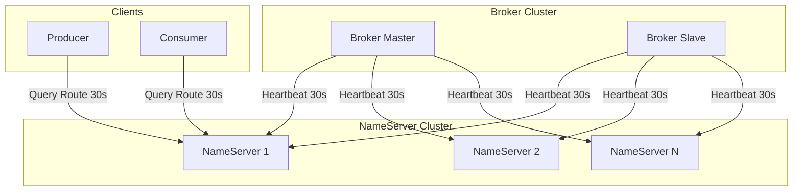
```mermaid
flowchart TB
    subgraph NSCluster["NameServer Cluster"]
        NS1[NameServer 1]
        NS2[NameServer 2]
        NS3[NameServer N]
    end
    
    subgraph BrokerCluster["Broker Cluster"]
        B1[Broker Master]
        B2[Broker Slave]
    end
    
    subgraph Client["Clients"]
        P[Producer]
        C[Consumer]
    end
    
    B1 -->|Heartbeat 30s| NS1
    B1 -->|Heartbeat 30s| NS2
    B1 -->|Heartbeat 30s| NS3
    B2 -->|Heartbeat 30s| NS1
    B2 -->|Heartbeat 30s| NS2
    B2 -->|Heartbeat 30s| NS3
    
    P -->|Query Route 30s| NS1
    C -->|Query Route 30s| NS1
```

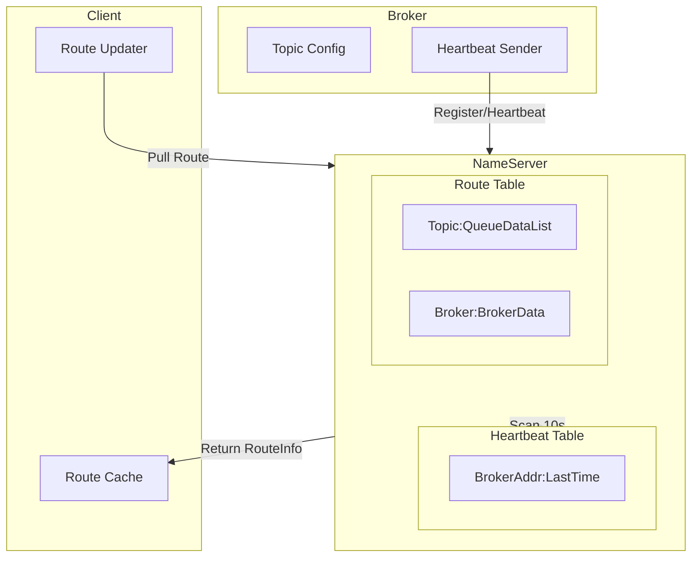
```mermaid
flowchart TB
    subgraph NS["NameServer"]
        subgraph HeartbeatTable["Heartbeat Table"]
            HT1[BrokerAddr:LastTime]
        end
        subgraph RouteTable["Route Table"]
            RT1[Topic:QueueDataList]
            RT2[Broker:BrokerData]
        end
    end
    
    subgraph Broker["Broker"]
        B1[Topic Config]
        B2[Heartbeat Sender]
    end
    
    subgraph Client["Client"]
        C1[Route Cache]
        C2[Route Updater]
    end
    
    B2 -->|Register/Heartbeat| NS
    NS -->|Scan 10s| HeartbeatTable
    C2 -->|Pull Route| NS
    NS -->|Return RouteInfo| C1
```

很普遍的服务发现的结构/架构

ns和每个broker保持长连接, 10s间隔检测心跳(**扫心跳表**), 如果检测到broker宕机则从路由注册表移除, 但不会马上通知生产者or消费者

每10s扫表, 如果时间差\>120s判断不可用, 超时

生成者/消费者每30s拉取topic信息(如果失效后出现失败会立马刷新吗?)

broker每30s上报一次心跳和topic配置

业务线程池管理是Netty的(其他一些启动的java细节不看了)

内存的存储是hashmap的(毕竟元信息数据不多, 一个集群的broker顶多不超过100个)

#### 路由注册

启动时对所有ns发送心跳, 后续就是30s逻辑

ns收到心跳包, 会更新内存的map

nslist是通过rpc获取的(那应该有初始配置地址或者默认DNS之类的)

ns的更新也是上锁改内存的

#### 路由删除

30s周期扫描之后, 判断120s差值超时了

上写锁, 更新

### 消息发送

支持3种, sync, async, one way

考虑的问题

1.  如何进行负载

2.  如何实现高可用(可靠性, 服务弹性, 数据持久化, 数据复制基本就这几类吧)

3.  如何实现一致性(你说副本间一致? 还是生产者消费者之间的一致?)

#### topic

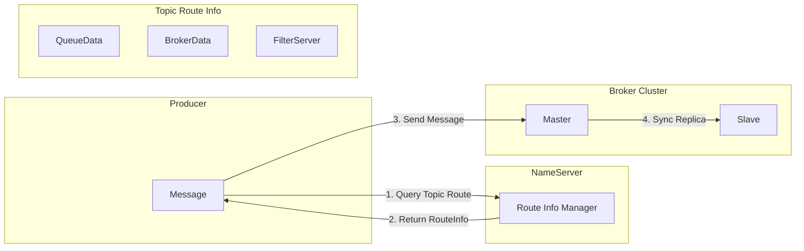
```mermaid
flowchart LR
    subgraph Producer["Producer"]
        P1[Message]
    end
    
    subgraph NameServer["NameServer"]
        NS1[Route Info Manager]
    end
    
    subgraph TopicRoute["Topic Route Info"]
        TR1[QueueData]
        TR2[BrokerData]
        TR3[FilterServer]
    end
    
    subgraph Broker["Broker Cluster"]
        BM[Master]
        BS[Slave]
    end
    
    P1 -->|1. Query Topic Route| NS1
    NS1 -->|2. Return RouteInfo| P1
    P1 -->|3. Send Message| BM
    BM -->|4. Sync Replica| BS
```

生产者发送前需要向ns获取topic的路由信息

且每30s遍历自身生产的topic, 向ns查询最新的路由信息

#### 高可用设计

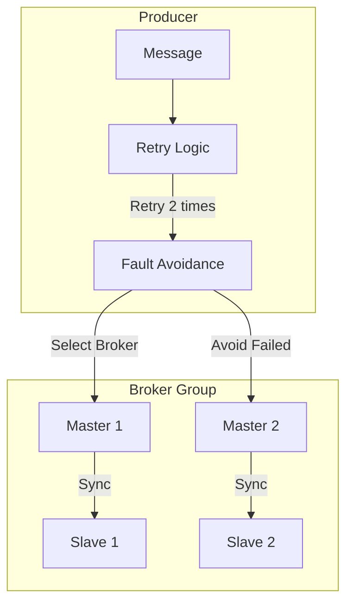
```mermaid
flowchart TB
    subgraph Producer["Producer"]
        P1[Message]
        P2[Retry Logic]
        P3[Fault Avoidance]
    end
    
    subgraph BrokerGroup["Broker Group"]
        BM1[Master 1]
        BS1[Slave 1]
        BM2[Master 2]
        BS2[Slave 2]
    end
    
    P1 --> P2
    P2 -->|Retry 2 times| P3
    P3 -->|Select Broker| BM1
    P3 -->|Avoid Failed| BM2
    BM1 -->|Sync| BS1
    BM2 -->|Sync| BS2
```

1.  消息发送重试机制

默认会重试两次

2.  故障规避机制

因为发送到broker遇到失败的, 近期重试会进行规避(那么需要记录失败状态)

消息生产/消费整体流程:

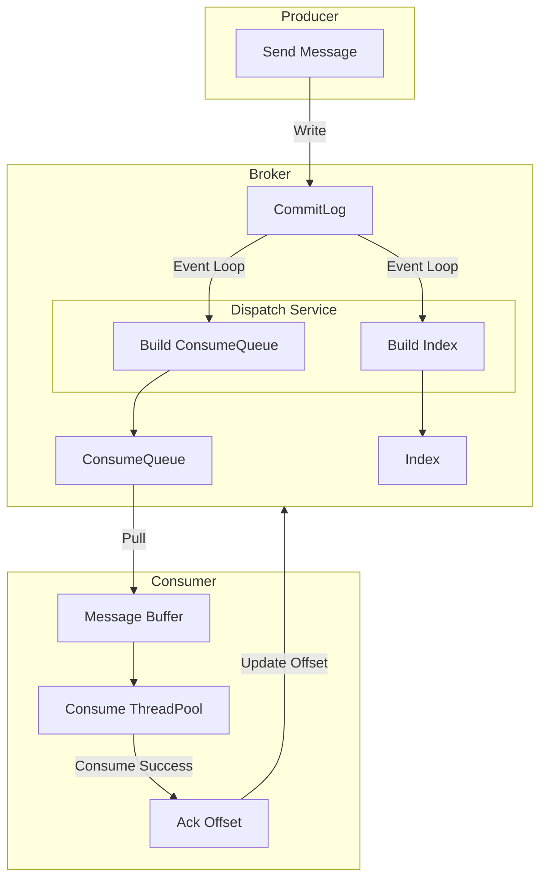
```mermaid
flowchart TB
    subgraph Producer["Producer"]
        P1[Send Message]
    end
    
    subgraph Broker["Broker"]
        CL[CommitLog]
        CQ[ConsumeQueue]
        IDX[Index]
        
        subgraph Dispatch["Dispatch Service"]
            D1[Build ConsumeQueue]
            D2[Build Index]
        end
    end
    
    subgraph Consumer["Consumer"]
        CB[Message Buffer]
        CP[Consume ThreadPool]
        CA[Ack Offset]
    end
    
    P1 -->|Write| CL
    CL -->|Event Loop| D1
    CL -->|Event Loop| D2
    D1 --> CQ
    D2 --> IDX
    CQ -->|Pull| CB
    CB --> CP
    CP -->|Consume Success| CA
    CA -->|Update Offset| Broker
```

生产者-\>broker-写commit log\<-事件loop监听-\>Index; -\>consumer queue-\>消费者客户端-\>buffer\<-监听loop循环拉取-\>消费处理-\>消费确认-\>broker更新offset

#### 消息格式

拓展属性

tags: 用于过滤(我就说标签selector吧)

keys: 消息的键, 检索用

waitStorMsgOK: 就是sync/async的配置

#### 消息发送(sdk端)

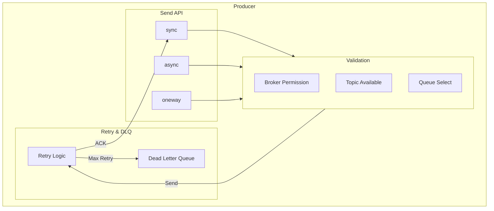
```mermaid
flowchart TB
    subgraph Producer["Producer"]
        subgraph SendAPI["Send API"]
            SA1[sync]
            SA2[async]
            SA3[oneway]
        end
        
        subgraph Check["Validation"]
            C1[Broker Permission]
            C2[Topic Available]
            C3[Queue Select]
        end
        
        subgraph Retry["Retry & DLQ"]
            R1[Retry Logic]
            R2[Dead Letter Queue]
        end
    end
    
    SA1 --> Check
    SA2 --> Check
    SA3 --> Check
    Check -->|Send| R1
    R1 -->|Max Retry| R2
    R1 -->|ACK| SA1
```

**同步发送**

各类检查(broker权限, topic可用, 配置等, 队列)

重试/死信队列

ACK确认就开始下一个

**异步发送**

会有并发控制限制, 但我觉得单条通信应该也不会非常大, 避免网络阻塞/包重试过慢等

**单向发送**

我发我的, 不用你回ACK(熟悉的sendonly), 有可能会丢数据

整合batch的批量发送, 也会有长度限制

### 消息存储

#### 文件结构

commit log: 消息的存储, 所有主题的msg都存在一个文件中

ConsumeQueue: msg消费队列, msg先存在commit log, 再异步转发到consume queue

index: 消息索引, 维护key和offset的对应关系

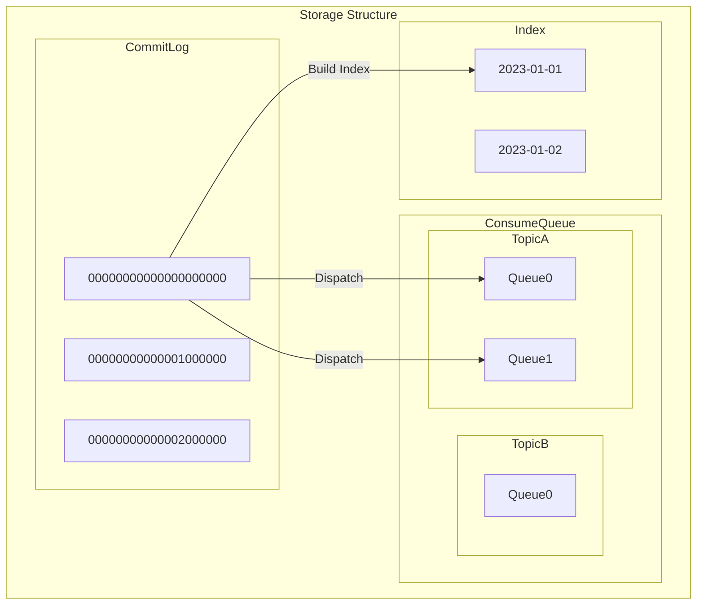
```mermaid
flowchart TB
    subgraph Storage["Storage Structure"]
        subgraph CommitLog["CommitLog"]
            CL1[00000000000000000000]
            CL2[00000000000001000000]
            CL3[00000000000002000000]
        end
        
        subgraph ConsumeQueueDir["ConsumeQueue"]
            subgraph TopicA["TopicA"]
                TAQ0[Queue0]
                TAQ1[Queue1]
            end
            subgraph TopicB["TopicB"]
                TBQ0[Queue0]
            end
        end
        
        subgraph IndexDir["Index"]
            IDX1[2023-01-01]
            IDX2[2023-01-02]
        end
    end
    
    CL1 -->|Dispatch| TAQ0
    CL1 -->|Dispatch| TAQ1
    CL1 -->|Build Index| IDX1
```

持久化文件的组织方式/存储格式

也是为了追求磁盘的顺序写, 所以是append的, 不修改的

全部主题都写一个文件, 每条消息有一个消息物理偏移量

每个commit log用起始的偏移量作为文件名, 二分快速定位文件位置, 相减得到文件内的物理位置

和kafka比较不一样的就是

统一的文件存储, kafka是topic分目录, partition分目录, 内部段文件分开存储的(kafka如果太多topic落地, 有可能顺序写的优势降级的)

同时kafka也没有后续消费队列, 是直接从文件顺序取消息

也没有索引相关的结构

consume queue的文件结构

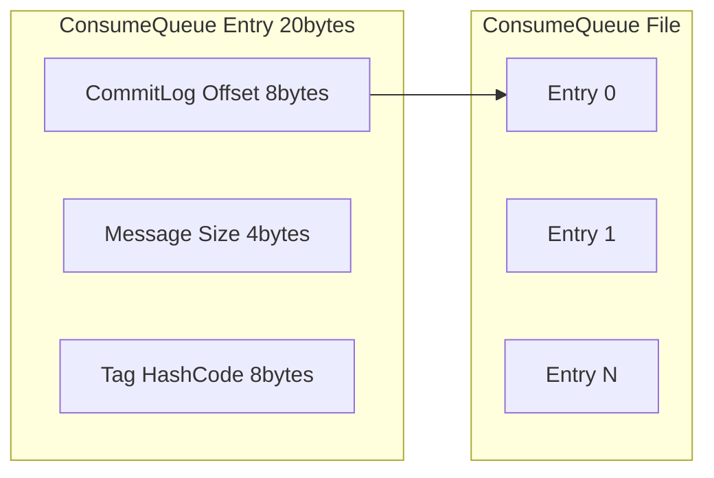
```mermaid
flowchart LR
    subgraph CQEntry["ConsumeQueue Entry 20bytes"]
        E1[CommitLog Offset 8bytes]
        E2[Message Size 4bytes]
        E3[Tag HashCode 8bytes]
    end
    
    subgraph File["ConsumeQueue File"]
        F1[Entry 0]
        F2[Entry 1]
        F3[Entry N]
    end
    
    E1 --> F1
```

index文件结构

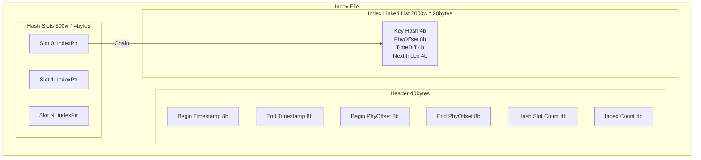
```mermaid
flowchart TB
    subgraph IndexFile["Index File"]
        subgraph Header["Header 40bytes"]
            H1[Begin Timestamp 8b]
            H2[End Timestamp 8b]
            H3[Begin PhyOffset 8b]
            H4[End PhyOffset 8b]
            H5[Hash Slot Count 4b]
            H6[Index Count 4b]
        end
        
        subgraph Slots["Hash Slots 500w * 4bytes"]
            S1[Slot 0: IndexPtr]
            S2[Slot 1: IndexPtr]
            S3[Slot N: IndexPtr]
        end
        
        subgraph IndexList["Index Linked List 2000w * 20bytes"]
            I1["Key Hash 4b<br>PhyOffset 8b<br>TimeDiff 4b<br>Next Index 4b"]
        end
    end
    
    S1 -->|Chain| I1
```

消费的运行逻辑

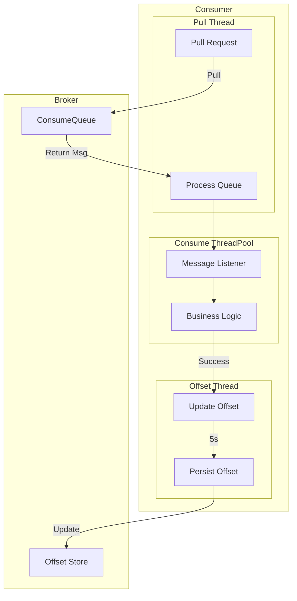
```mermaid
flowchart TB
    subgraph Consumer["Consumer"]
        subgraph PullThread["Pull Thread"]
            PT1[Pull Request]
            PT2[Process Queue]
        end
        
        subgraph ConsumeThread["Consume ThreadPool"]
            CT1[Message Listener]
            CT2[Business Logic]
        end
        
        subgraph OffsetThread["Offset Thread"]
            OT1[Update Offset]
            OT2[Persist Offset]
        end
    end
    
    subgraph Broker["Broker"]
        B1[ConsumeQueue]
        B2[Offset Store]
    end
    
    PT1 -->|Pull| B1
    B1 -->|Return Msg| PT2
    PT2 --> CT1
    CT1 --> CT2
    CT2 -->|Success| OT1
    OT1 -->|5s| OT2
    OT2 -->|Update| B2
```

#### 刷盘逻辑

通过JDK NIO的内存映射实现(不是mmap, fwrite什么的吗)

同步刷盘: 组提交, 也不是来一条刷一条, 而是短时间内批次统一刷

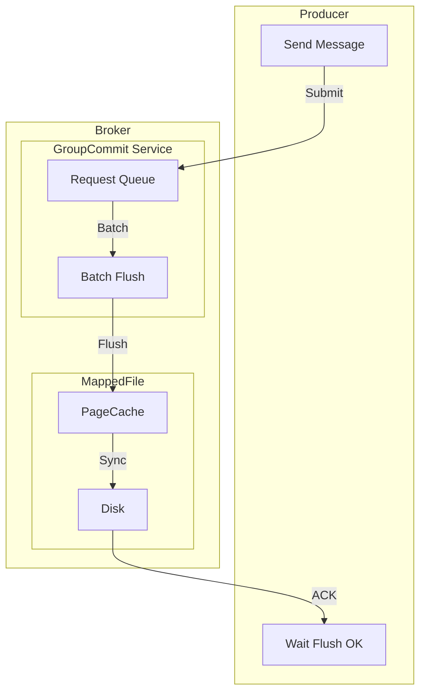
```mermaid
flowchart TB
    subgraph Producer["Producer"]
        P1[Send Message]
        P2[Wait Flush OK]
    end
    
    subgraph Broker["Broker"]
        subgraph GroupCommit["GroupCommit Service"]
            GC1[Request Queue]
            GC2[Batch Flush]
        end
        
        subgraph MappedFile["MappedFile"]
            MF1[PageCache]
            MF2[Disk]
        end
    end
    
    P1 -->|Submit| GC1
    GC1 -->|Batch| GC2
    GC2 -->|Flush| MF1
    MF1 -->|Sync| MF2
    MF2 -->|ACK| P2
```

异步刷盘: 性能考虑, 500ms定时刷盘

#### transientStorePoolEnable机制

内存级别的读写分离机制, 为了降低pagecache的压力的. (不太清楚)

一个短暂存储池;

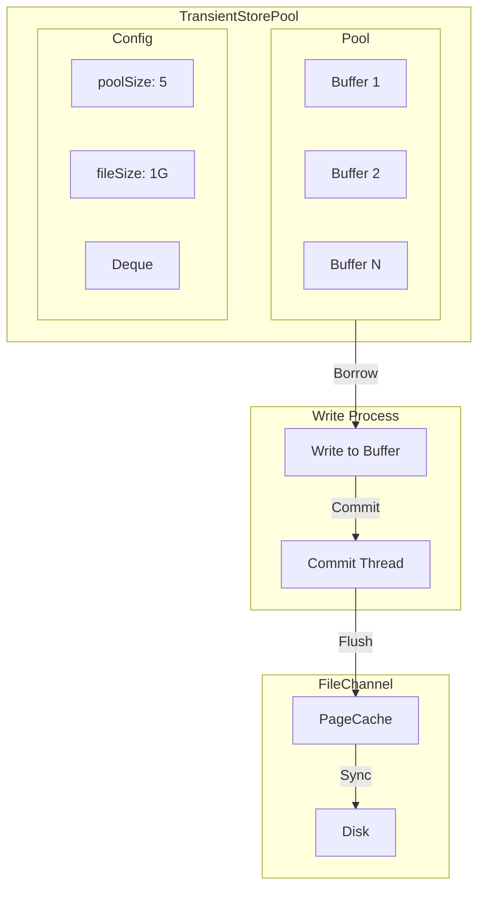
```mermaid
flowchart TB
    subgraph TransientStore["TransientStorePool"]
        subgraph Pool["Pool"]
            P1[Buffer 1]
            P2[Buffer 2]
            P3[Buffer N]
        end
        
        subgraph Config["Config"]
            C1[poolSize: 5]
            C2[fileSize: 1G]
            C3[Deque<Buffer>]
        end
    end
    
    subgraph WriteProcess["Write Process"]
        WP1[Write to Buffer]
        WP2[Commit Thread]
    end
    
    subgraph FileChannel["FileChannel"]
        FC1[PageCache]
        FC2[Disk]
    end
    
    Pool -->|Borrow| WP1
    WP1 -->|Commit| WP2
    WP2 -->|Flush| FC1
    FC1 -->|Sync| FC2
```

类里面, 池大小, 文件大小, 双头队列和配置

有点像缓存的中间存储

#### 文件恢复机制

consumequeue文件恢复根据最后一条完整偏移量和当前最大偏移对比判断

#### checkpoint文件

记录commitlog, consumequeue, index文件的刷盘时间点, 固定大小

#### 过期文件删除机制

默认72h没有写的文件, 认为过期, 可以通过配置修改

fileReservedTime: 文件保留时间

deletePhysicFilesInterval: 删除文件间隔时间

destroyMapedFileIntervalForcibly: 删除时发现被占用中止后的等待时间

#### 同步双写

给其他broker, replica数据复制的逻辑

旧逻辑:

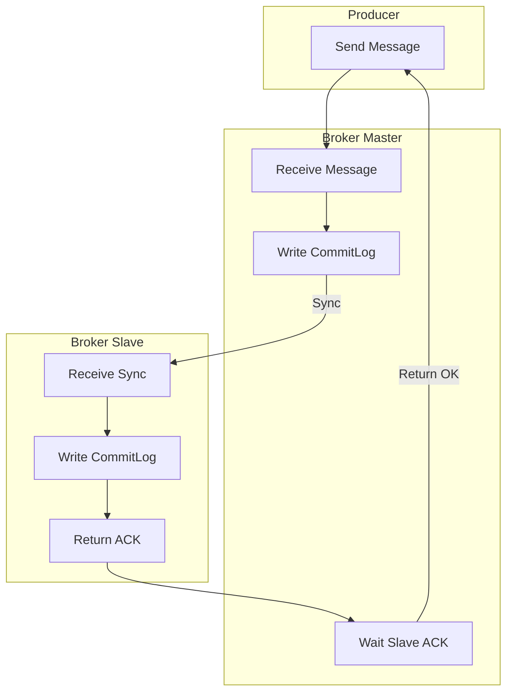
```mermaid
flowchart TB
    subgraph Producer["Producer"]
        P1[Send Message]
    end
    
    subgraph Master["Broker Master"]
        M1[Receive Message]
        M2[Write CommitLog]
        M3[Wait Slave ACK]
    end
    
    subgraph Slave["Broker Slave"]
        S1[Receive Sync]
        S2[Write CommitLog]
        S3[Return ACK]
    end
    
    P1 --> M1
    M1 --> M2
    M2 -->|Sync| S1
    S1 --> S2
    S2 --> S3
    S3 --> M3
    M3 -->|Return OK| P1
```

新逻辑:

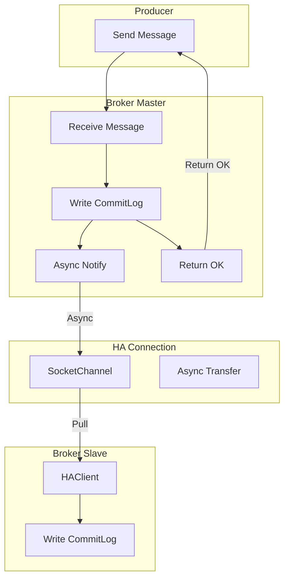
```mermaid
flowchart TB
    subgraph Producer["Producer"]
        P1[Send Message]
    end
    
    subgraph Master["Broker Master"]
        M1[Receive Message]
        M2[Write CommitLog]
        M3[Async Notify]
        M4[Return OK]
    end
    
    subgraph Slave["Broker Slave"]
        S1[HAClient]
        S2[Write CommitLog]
    end
    
    subgraph HAConnection["HA Connection"]
        HA1[SocketChannel]
        HA2[Async Transfer]
    end
    
    P1 --> M1
    M1 --> M2
    M2 --> M3
    M3 -->|Async| HA1
    HA1 -->|Pull| S1
    S1 --> S2
    M2 --> M4
    M4 -->|Return OK| P1
```

用async了

### 消息消费

topic会对应有多个queue(类似kafka的partition)

消费组有集群模式和广播模式

集群是正常的一条msg消费一次

广播是一条msg消费组内所有消费者都会收到一次

#### 负载机制和重平衡

只针对集群模式(广播不存在负载, 所有都请求)

平衡算法: AVG, AVG_BY_CIRCLE

#### 并发消费模型

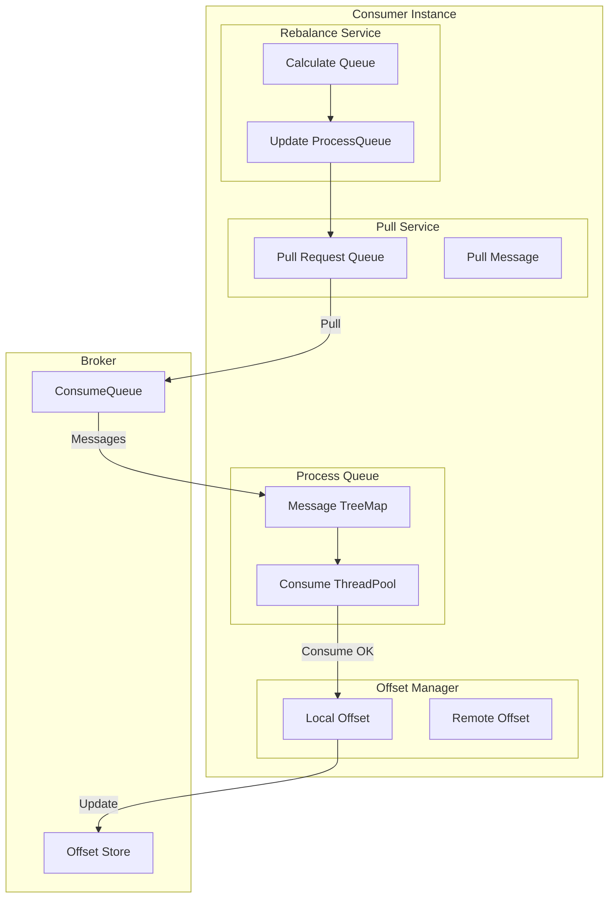
```mermaid
flowchart TB
    subgraph Consumer["Consumer Instance"]
        subgraph Rebalance["Rebalance Service"]
            R1[Calculate Queue]
            R2[Update ProcessQueue]
        end
        
        subgraph PullService["Pull Service"]
            PS1[Pull Request Queue]
            PS2[Pull Message]
        end
        
        subgraph ProcessQueue["Process Queue"]
            PQ1[Message TreeMap]
            PQ2[Consume ThreadPool]
        end
        
        subgraph OffsetManager["Offset Manager"]
            OM1[Local Offset]
            OM2[Remote Offset]
        end
    end
    
    subgraph Broker["Broker"]
        B1[ConsumeQueue]
        B2[Offset Store]
    end
    
    R1 --> R2
    R2 --> PS1
    PS1 -->|Pull| B1
    B1 -->|Messages| PQ1
    PQ1 --> PQ2
    PQ2 -->|Consume OK| OM1
    OM1 -->|Update| B2
```

消费进度反馈

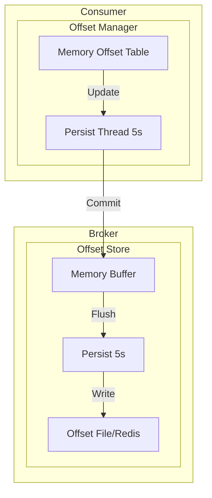
```mermaid
flowchart TB
    subgraph Consumer["Consumer"]
        subgraph OffsetManager["Offset Manager"]
            OM1[Memory Offset Table]
            OM2[Persist Thread 5s]
        end
    end
    
    subgraph Broker["Broker"]
        subgraph OffsetStore["Offset Store"]
            OS1[Memory Buffer]
            OS2[Persist 5s]
            OS3[Offset File/Redis]
        end
    end
    
    OM1 -->|Update| OM2
    OM2 -->|Commit| OS1
    OS1 -->|Flush| OS2
    OS2 -->|Write| OS3
```

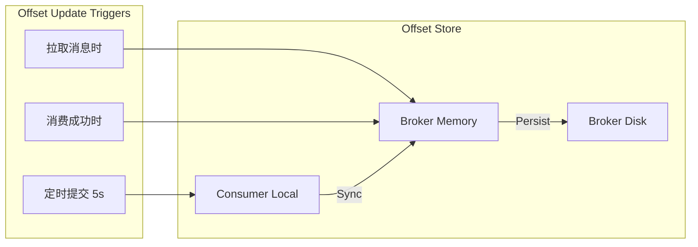
```mermaid
flowchart LR
    subgraph OffsetUpdate["Offset Update Triggers"]
        T1[定时提交 5s]
        T2[拉取消息时]
        T3[消费成功时]
    end
    
    subgraph OffsetStore["Offset Store"]
        S1[Consumer Local]
        S2[Broker Memory]
        S3[Broker Disk]
    end
    
    T1 --> S1
    T2 --> S2
    T3 --> S2
    S1 -->|Sync| S2
    S2 -->|Persist| S3
```

消费者端, 每5s提交所有的队列消息偏移量到broker

broker先放内存, 每5s持久化

拉取消息时也会提交偏移量

#### 消息拉取流程

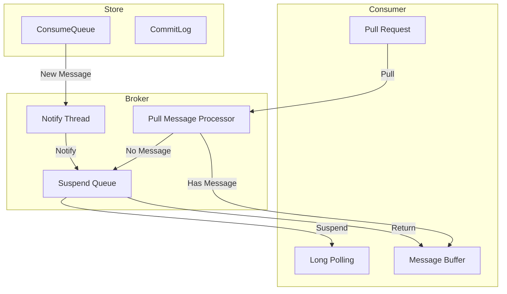
```mermaid
flowchart TB
    subgraph Consumer["Consumer"]
        C1[Pull Request]
        C2[Long Polling]
        C3[Message Buffer]
    end
    
    subgraph Broker["Broker"]
        B1[Pull Message Processor]
        B2[Suspend Queue]
        B3[Notify Thread]
    end
    
    subgraph Store["Store"]
        S1[ConsumeQueue]
        S2[CommitLog]
    end
    
    C1 -->|Pull| B1
    B1 -->|No Message| B2
    B2 -->|Suspend| C2
    S1 -->|New Message| B3
    B3 -->|Notify| B2
    B2 -->|Return| C3
    B1 -->|Has Message| C3
```

推模式不是真的服务器推

而是主动发起拉取, 消息未到达消费队列的时候会长轮询或者挂起(看配置)

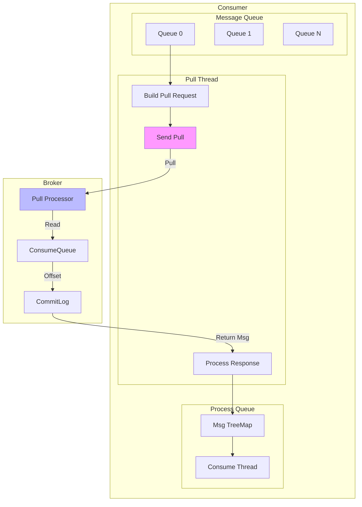
```mermaid
flowchart TB
    subgraph Consumer["Consumer"]
        subgraph PullThread["Pull Thread"]
            PT1[Build Pull Request]
            PT2[Send Pull]
            PT3[Process Response]
        end
        
        subgraph MessageQueue["Message Queue"]
            MQ1[Queue 0]
            MQ2[Queue 1]
            MQ3[Queue N]
        end
        
        subgraph ProcessQueue["Process Queue"]
            PQ1[Msg TreeMap]
            PQ2[Consume Thread]
        end
    end
    
    subgraph Broker["Broker"]
        B1[Pull Processor]
        B2[ConsumeQueue]
        B3[CommitLog]
    end
    
    MQ1 --> PT1
    PT1 --> PT2
    PT2 -->|Pull| B1
    B1 -->|Read| B2
    B2 -->|Offset| B3
    B3 -->|Return Msg| PT3
    PT3 --> PQ1
    PQ1 --> PQ2
    
    style PT2 fill:#f9f
    style B1 fill:#bbf
```

批量拉取最多32

广播模式因为是消费独立的, 所以按消费者为单位存储状态

集群模式按消费者组存储, 且考虑多个消费者间的同步关系

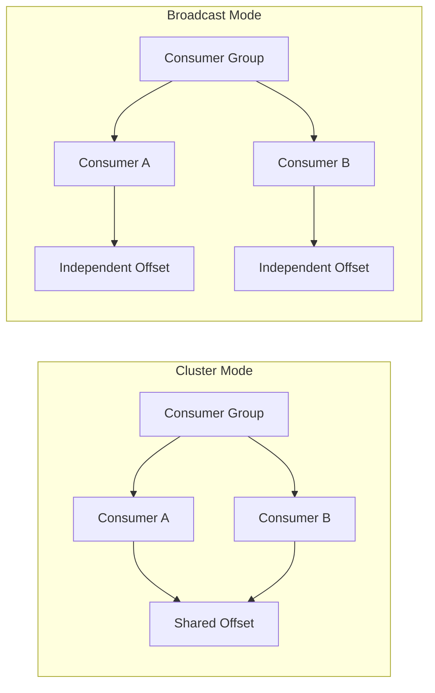
```mermaid
flowchart LR
    subgraph Cluster["Cluster Mode"]
        C1[Consumer Group]
        C2[Consumer A]
        C3[Consumer B]
        C4[Shared Offset]
    end
    
    subgraph Broadcast["Broadcast Mode"]
        B1[Consumer Group]
        B2[Consumer A]
        B3[Consumer B]
        B4[Independent Offset]
        B5[Independent Offset]
    end
    
    C1 --> C2
    C1 --> C3
    C2 --> C4
    C3 --> C4
    
    B1 --> B2
    B1 --> B3
    B2 --> B4
    B3 --> B5
```

更新偏移量是以消息队列消费的未处理的最小偏移量更新

更大的已处理也不会更新到

存在问题: 某个小偏移量因为死锁一直卡住

拉取流量控制措施: 处理队列最大最小偏移量差值的配置

#### 定时消息机制

```mermaid
flowchart TB
    subgraph Producer["Producer"]
        P1[Send Delay Message]
        P2[Delay Level: 1s 5s 10s ... 2h]
    end
    
    subgraph Broker["Broker"]
        subgraph CommitLog["CommitLog"]
            CL1[Store Delay Message]
        end
        
        subgraph ScheduleService["Schedule Service"]
            SS1[Timer Wheel]
            SS2[Deliver Thread]
        end
        
        subgraph ConsumeQueue["ConsumeQueue"]
            CQ1[Delay Queue Level 1]
            CQ2[Delay Queue Level 2]
            CQ3[Delay Queue Level N]
        end
        
        subgraph TargetQueue["Target Topic Queue"]
            TQ1[Real Consume Queue]
        end
    end
    
    P1 --> P2
    P2 --> CL1
    CL1 -->|Dispatch| CQ1
    CQ1 --> SS1
    SS1 -->|Timeout| SS2
    SS2 -->|Rewrite| CL1
    CL1 -->|Dispatch| TQ1
```

没有支持任意精度的定时调度

是分等级的延时

#### 消息过滤机制

TAG模式

SQL92模式

#### 顺序消息

配置单队列的topic

### 主从机制

raft

## Kafka

以4.0为准
