### golang

[DK百科不全书-Golang](https://docs.qq.com/doc/DUFJCeEZabURiRVRn?no_promotion=1)

### redis

### 热点key发现
| 方法 | 适用场景 | 优点 | 缺点 |
|:---|:---|:---|:---|
| INFO/CLUSTER 命令 | 快速初步检查 | 无需额外工具 | 数据粒度粗 |
| --hotkeys | 精确识别热点键 | 官方支持 | 需 Redis 4.0+，影响性能 |
| Prometheus + Grafana | 长期监控和告警 | 实时可视化 | 需部署监控系统 |
| APM 工具 | 代码级问题定位 | 关联应用逻辑 | 依赖应用集成 |
| 自定义脚本 | 灵活定制统计逻辑 | 可适配业务需求 | 开发成本高 |

### 缓存击穿/缓存穿透/缓存雪崩

击穿: 访问缓存无命中导致每次都需要访问db;

1.  空key缓存
2.  bloom filter

穿透: 热key访问在缓存超时的时候,大量访问db;

1.  热key不过期
2.  key未命中更新逻辑进行分布式锁

雪崩: 同批次key过期时间相同, 导致同一时间大量访问db

1.  key过期时间增加随机量
2.  多级缓存(成本高)
3.  更新加锁排队平峰

### 集群模式
| 环境类型 | 内存规格 | 部署方案 | 关键要点 |
|:---|:---|:---|:---|
| 小型环境 | <16GB | Sentinel模式：3节点（1主2从）+ 3哨兵 | 配置简单，资源要求低 |
| 中型环境 | 16-64GB | Redis Cluster：6节点（3主3从） | 垂直扩展节点内存 |
| 大型环境 | >64GB | Redis Cluster：N主N从（N≥8） | 分片策略：①按业务功能划分 ②避免大key（超过100KB） |
| 部署方式 | 数据量 | 高可用 | 自动分片 | 复杂度 |
|:---|:---|:---:|:---:|:---|
| 单节点 | <1GB | ❌ | ❌ | 低 |
| 主从复制 | <10GB | ✅ | ❌ | 中 |
| Redis Sentinel | <50GB | ✅ | ❌ | 中高 |
| Redis Cluster | >50GB | ✅ | ✅ | 高 |

**Redis Cluster vs Proxy方案**
| 特性 | Redis Cluster | Codis/Twemproxy |
|:---|:---|:---|
| 架构 | 去中心化 | 中心代理 |
| 扩容速度 | 秒级 | 分钟级 |
| 一致性模型 | 最终一致性 | 强一致性 |
| 跨区部署 | 支持 | 需额外组件 |
| 协议兼容性 | 原生协议 | 扩展协议 |
| 语言支持 | 主流SDK全支持 | 需定制客户端 |

**Redis Cluster vs 哨兵模式**
| 维度 | Cluster | Sentinel |
|:---|:---|:---|
| 数据规模 | TB级 | GB级 |
| 读写扩展 | 支持 | 有限 |
| 故障恢复 | 1-2秒 | 10-30秒 |
| 运维复杂度 | 高 | 低 |
| 迁移成本 | 高 | 低 |
| 分片感知 | 客户端自动 | 手动 |
| 问题 | 现象 | 解决方案 |
|:---|:---|:---|
| 热key | 单个槽位QPS过高 | 使用HashTag分散访问，增加本地缓存 |
| 大key | 操作阻塞 | 拆分大键值，禁止使用超过1MB的key |
| 跨槽事务 | MULTI执行失败 | 使用Lua脚本+HashTag保证同槽操作 |
| 槽位不均 | 节点负载不平衡 | 手动迁移热点槽，调整键值分布 |
| 节点通信延迟 | CLUSTERDOWN错误 | 优化网络架构，确保带宽充足 |

大部分适用cluster模式

### 集群模式分片选择

分片大小: 分片太大, 启动慢, 数据同步慢.

分片数量: 分片数量高会导致同步请求更复杂, 分片数量有上限影响扩容; 分片数量多对应slot会下降, 可能出现数据倾斜.

### 删除大key

1.  对于hash/zset等类型, 分批量扫描子key删除, 减少规模后再del
2.  4.0版本后使用UNLINK, 会异步后台线程删除key

### redis增加分片时数据迁移细节

分片如何划分slots?

看配置, 可以手动, 也有自动分配

后续数据同步是如何实现的, 在面对大key时会怎么处理(大key阻塞)?

resharding时按slot做迁移, 最小原子单位是key

迁移的速率/超时时间是可选的

迁移key时会对key进行DUMP操作

遇到大key时redis cluster**没有**自动拆分的逻辑; 4.0后会有异步后台线程处理迁移, 但是单个key的逻辑是一样的.

我们应该主动拆解大Key, 或者迁移前对大key做删除屏蔽(需要备份)

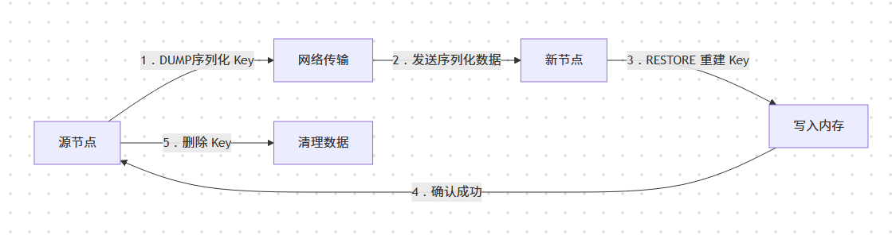{width="5.772222222222222in" height="1.5268788276465441in"}

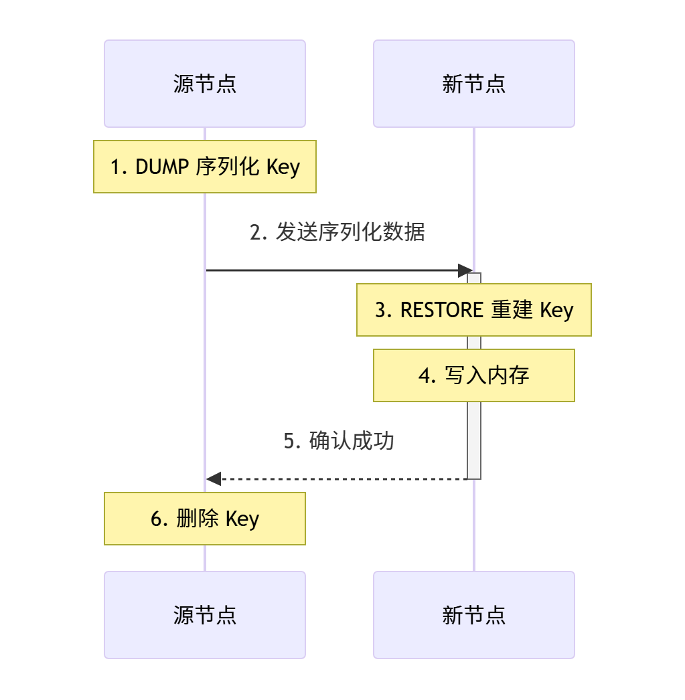{width="5.772222222222222in" height="5.901998031496063in"}

搬迁状态的key是只读的, 写请求会拒绝;

搬迁中/已搬迁完成的key, 读请求会返回重定向

未搬迁的key正常处理

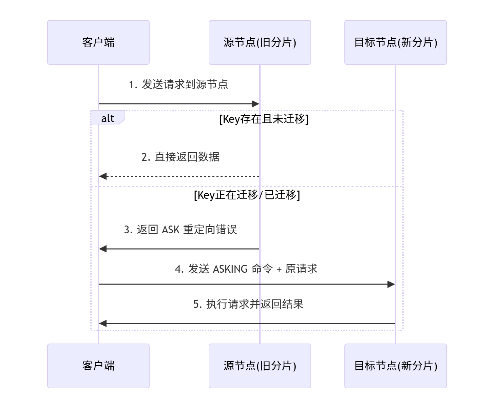{width="5.772222222222222in" height="4.781112204724409in"}

### 整体架构模型

<https://www.cnblogs.com/shijingxiang/articles/5369224.html>

单线程(也不是完全单线程, 还有异步线程处理AOF等逻辑)

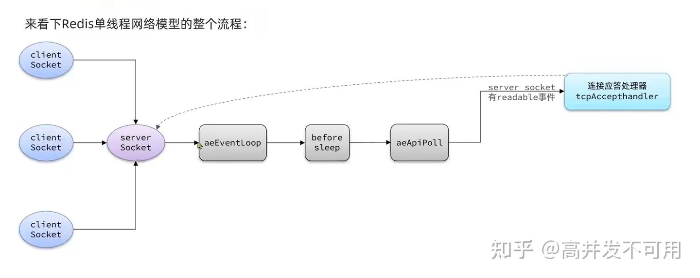{width="5.772222222222222in" height="2.3008716097987754in"}

新连接事件

6.0后多线程

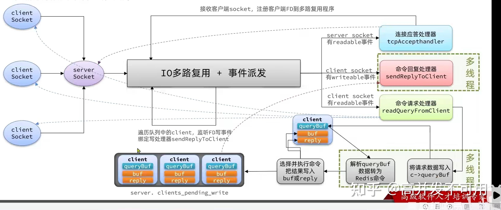{width="5.772222222222222in" height="2.430627734033246in"}

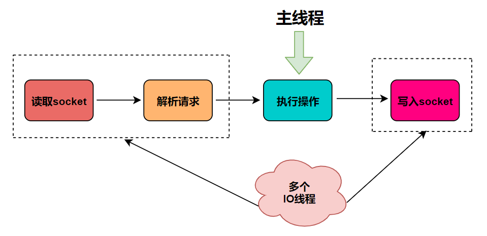{width="5.772222222222222in" height="2.7988353018372703in"}

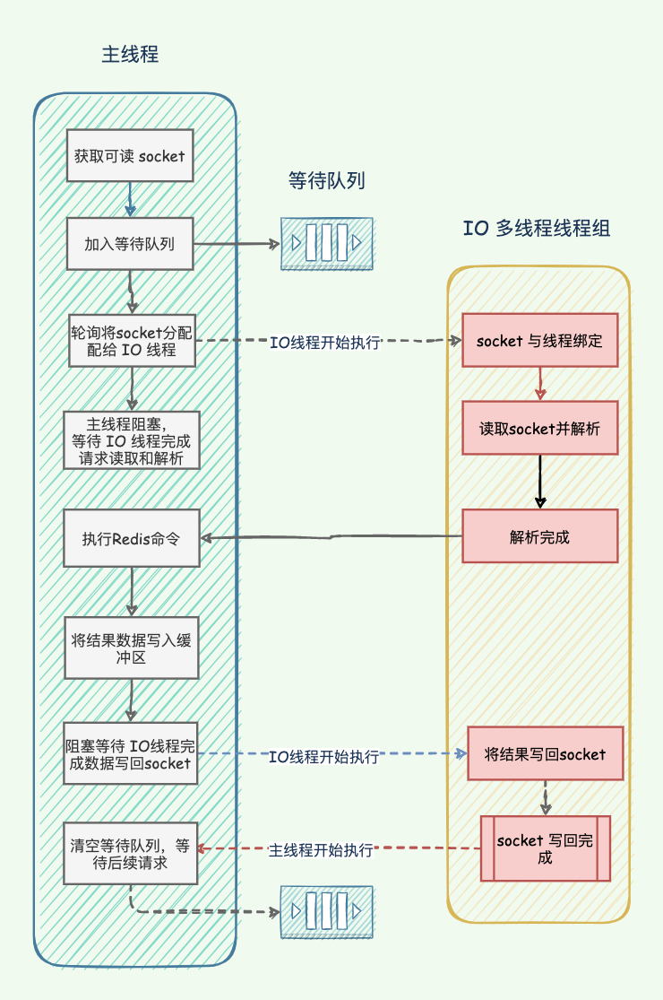{width="5.772222222222222in" height="8.697334864391951in"}

启动看initServer

网络模型相关都是ae开头的

### 基本的底层结构实现

**SDS(string)**

sds.h / sds.c

所有字符串的实现, 就是动态字符串的实现

**LinkedList(双端链表)**

adlist.h / adlist.c

List的底层实现之一 / **3.2**后没用了, quicklist替换

双向遍历 / 带长度状态计数器

**ZipList(压缩列表)**

新版本已被ListPack替换

连续内存 / 压缩空间 / 有连锁更新问题

**Dict(字典/hash表)**

全局键空间, hash表, 集合都是使用

siphash(1-2) 哈希算法

渐进式rehash(细粒度滚动更新)

hash chain链式哈希解决冲突(hash bucket) + 头插

**Skiplist(跳表)**

server.h / t_zset.c

zset的实现

多层索引(不同跨度层次的下一跳) / 分值排序

**Intset(整数集合)**

intset.h / intset.c

小set使用

纯整数集合

自动升级 / 有序存储 / 不能降级

就是个纯数组, 连续空间, 因为固定类型, 所以可以随机访问

SET用的时候, 是插入排序的方式写入, 然后二分查找

**QuickList(快速列表)**

quicklist.h / quicklist.c

<https://blog.csdn.net/joeyhhhhh/article/details/147384794>

3.2新版list的实现

双端链表+ziplist(7.0后listpack)

节点压缩(**LZF**)\[LZF压缩算法在lzf.h/lzf.c, 还没看\]

控制节点最大容量 (node里的fill, 配置是list-max-listpack-size)

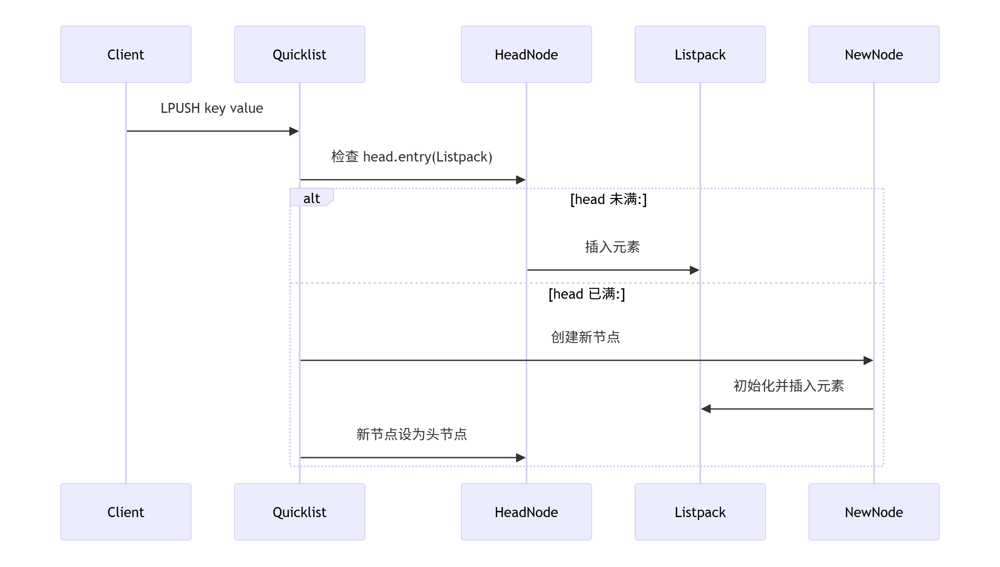{width="5.772222222222222in" height="3.2747703412073492in"}

**Rax(基数树)**

rax.h / rax.c

steam, 字典序, slot管理都会用到

radix adative tree, 是个前缀树的变种, 会有压缩节点

(如何抉择是否压缩?)

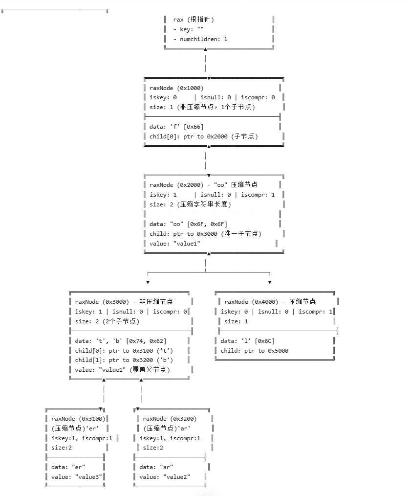{width="4.157638888888889in" height="5.012896981627296in"}

**Listpack(紧凑列表)**

listpack.h / listpack.c

7.0后替代ziplist

stream/quicklist/hash/zset都有用

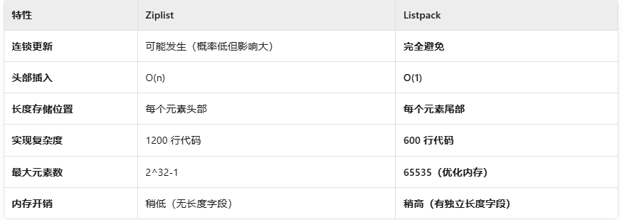{width="5.772222222222222in" height="2.040751312335958in"}

listpackEntry 实体结构 和ziplist差不多
| 编码类型 | 元素数据 | 元素总长度 |
|:---|:---|:---|
| (1-5 bytes) | (variable) | (1-5 bytes) |

编码类型: 可以通过数字状态定位到大小

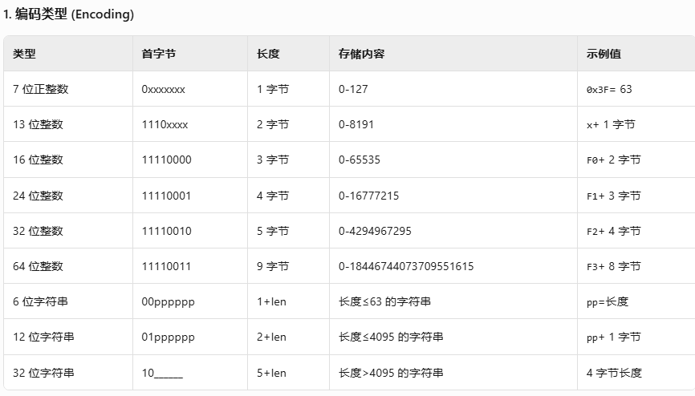{width="5.772222222222222in" height="3.2926990376202974in"}

元素数据{lval / sval + slen两用}

元素总长度: backlen后向长度, 用于倒序遍历; 靠这个避免了连锁更新

**Stream(流结构)**

stream.h

和rax结合, 暂时不看

### 基本数据类型

+--------------+--------------------------------+---------------------------+
| 数据类型     | 底层结构                       | 转换条件（典型配置）      |
+--------------+--------------------------------+---------------------------+
| 字符串       | SDS                            | 始终使用                  |
|              |                                |                           |
| String       |                                |                           |
+--------------+--------------------------------+---------------------------+
| 列表         | 3.2前: ziplist / 双端链表      | 默认实现                  |
|              |                                |                           |
| List         | 3.2: Quicklist(ziplist)        |                           |
|              |                                |                           |
|              | 7.0 Quicklist(listpack)        |                           |
+--------------+--------------------------------+---------------------------+
| 哈希         | Listpack（小）/ Dict（大）     | hash-max-listpack-entries |
|              |                                |                           |
| Hash         |                                |                           |
+--------------+--------------------------------+---------------------------+
| 集合         | Intset（小）/ Dict（大）       | set-max-intset-entries    |
|              |                                |                           |
| Set          |                                |                           |
+--------------+--------------------------------+---------------------------+
| 有序集合     | Listpack（小）/ Skiplist（大） | zset-max-listpack-entries |
|              |                                |                           |
| Zset         |                                |                           |
+--------------+--------------------------------+---------------------------+
| 流           | Rax + Listpack                 | 固定实现                  |
|              |                                |                           |
| Streaming    |                                |                           |
+--------------+--------------------------------+---------------------------+
| HyperLogLog  | 稀疏：SDS；稠密：6位编码数组   | hll-sparse-max-bytes      |
+--------------+--------------------------------+---------------------------+

***\-\-\-\-- 8.0 redis stack搬迁过来的 modules中实现 \-\-\--***

**Vector Set(向量集合)**

modules/vector-sets/

基于HNSW(图索引)的高维向量索引

和redis search有关

**Json Doc(原生json)**

modules/redisjson

json文档存储, 利用rax实现

**Time Series(时间序列)**

modules/redistimemseries

暂时不看

**概率数据结构**

bloom filter

top-K

t-digest

### redis的dict为什么不使用go map/swisstable的结构设计

redis的dict, key对应的单元dictEntry是对应**单个key**以及**元素**和冲突解决的链式hash的**冲突元素**

而go map, swisstable等, 是分层的桶处理, key hash先定位到桶, 桶内内存紧凑, 再算偏移量定位到**具体的key**和**元素**, 冲突解决是**根据桶为单位**做溢出桶

另外总结下其他AI结论:

桶结构的优点:

1.  内存紧凑, 空间利用率高, 内存分配的碎片少, 但是使用的碎片可能高
2.  缓存友好, 以桶为单位且内存连续

劣势:

1.  极端情况溢出桶, 可能会造成浪费
2.  扩容rehash时, 桶内元素可能会分配到不同的桶, 增加复杂度
3.  go map中专门优化过, 所以桶内连续值是固定类型大小, 但redis value基本是指针所以内存紧凑的优势不大
4.  修改操作可能会慢, 但感觉计算差不多

redis指针链式

1.  修改更高效, 更少的计算(其实可以忽略不计)
2.  使用碎片少, 但是分配的内存碎片可能高

### redis 二级索引

8.0新增在**JSON**, **hash**类型上可以使用

-   全文搜索

-   GEO

-   vector向量相似性+标量过滤的混合查询

其他如果是hash / zset的二级索引, 情况有点不同

更多的可能是要用多个索引值组合

比如: zset多个值的构造单个值进行排序

### redis各个\"复制\"\"迁移\"相关命令

实例级

migrate 将\>=1个key从一个实例迁移到另一个实例

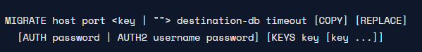{width="5.772222222222222in" height="0.713096019247594in"}

cluster的增加分片 slot迁移

**细节可以前面详述**

1.  准备目标节点

新节点 cluster addslots 777

2.  设置迁移状态

> 源节点: cluster setslot 777 MIGRATING dst-node-id 设置状态
>
> 目标节点: cluster setslot 777 IMPORTING src-node-id

3.  实际搬迁阶段

> cluster getkeysinslot 777 10(cnt) 获取所有/N值的key
>
> MIGRATE命令, 一个一个进行搬迁

4.  最后状态切换

> 所有节点 cluster setslot 777 dst-node-id

replica复制

从节点上: REPLICAOF master_ip master_port

复制流程:

1.  主节点生成repl-backlog-size;生成RDB快照, 无盘复制到从节点;
2.  从节点加载RDB
3.  追赶完数据后,增量同步续传repl_backlog
4.  增量数据同步完后, 就是正常从节点复制内容的同步

### dict的渐进式hash

关注入口dictRehash

扩容触发条件:

1.  hash表大小=0
2.  使用key\>hash表大小
3.  负载因子超过安全阈值(没看怎么算的)

调用入口的逻辑:

1.  主动触发: 定时任务主动推进(redis的cron事件), 时间控制dictRehashMicroseconds, 强制完整rehash(一般RDB加载后会触发, 加载时推进全局扩容)
2.  被动触发: 查插删时, 会调用_dictBucketRehash, \_dictRehashStep, \_dictRehashStepIfNeeded等

### 关系型数据库(mysql/\...)

[DK百科不全书-关系型数据库](https://docs.qq.com/doc/DUFJRUnJURXdDQ3dr?no_promotion=1)

### 向量数据库

[DK百科不全书-向量数据库](https://docs.qq.com/doc/DUEdJSGZmcHBETGJm?no_promotion=1)

### 列式存储 / 宽列存储

### 细分种类

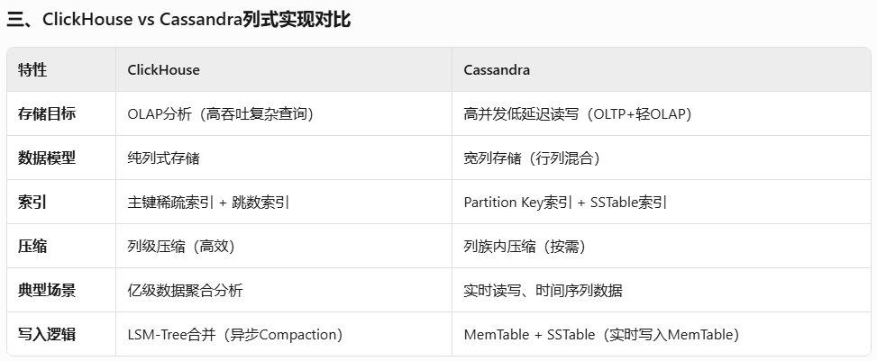{width="5.772222222222222in" height="2.378891076115486in"}

<https://blog.csdn.net/qq407155634/article/details/147105587>

<https://www.cnblogs.com/abclife/p/18467878>

<https://developer.aliyun.com/article/1635884>

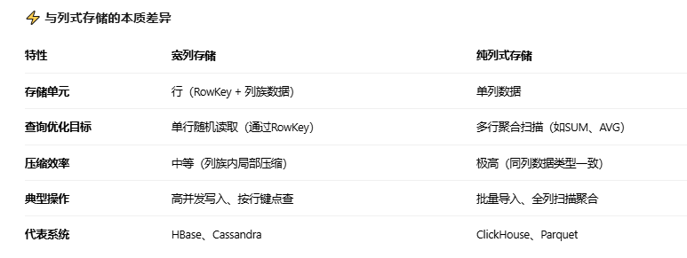{width="5.772222222222222in" height="2.1729844706911634in"}

{width="5.772222222222222in" height="2.4617858705161857in"}

虽然名字很像, 但其实不是非常相近的东西

**纯列式存储**

完全按每列顺序存储;

适用于统计等场景, 频繁读其中某个字段

**宽列存储**

宽列更像一个属性可动态的KV行存; 列式功能通过额外列式索引; 跟文档型可能更像一点

行列混合, 可能会以数列结合一起为一个单位存储

例子:

逻辑表:

  ----------------- ----------------- ----------------- -----------------
                    A                 B                 C

  1                 aa                bb                cc

  2                 aaa               bbb               ccc

  3                 aaaa              bbbb              cccc
  ----------------- ----------------- ----------------- -----------------

行存:

\[1:aa,bb,cc;2:aaa,bbb,ccc;3:aaaa,bbbb,cccc\]

列存:

\[1:aa;2:aaa;3:aaaa\]

\[1:bb;2:bbb;3:bbbb\]

\[1:cc;2:ccc;3:cccc\]

宽列:

会有不同形式, 比如行存+列族 或者 全列族(列族+纯列)

\[1:aa,bb;2:aaa,bbb;3:aaaa,bbbb\]

\[1:cc;2:ccc;3:ccc\]

根据上面的描述和其他宽列存储的实现, 宽列更像一个行键-数据kv存储, v类型与doc相似的

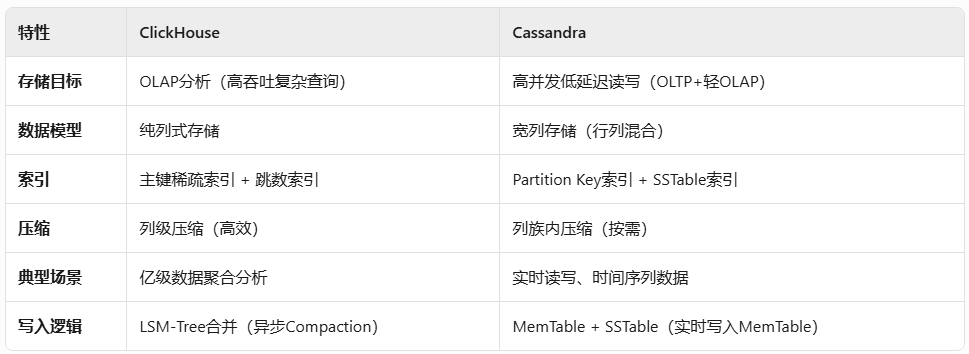{width="5.772222222222222in" height="2.1087379702537183in"}

### 底层数据结构

列式存储是相同列连续的, 然后分块存储, 块内有序

clickhouse: merge tree

cassandra: memtable + sstable

**SSTable:** sorted string table, 块内kv存储, 严格按key序列排序, 只增不改, 可以相邻合并; 如果一个块内对同一个key多次写, 会有多条相同key的记录, 且按照操作序列号倒序排序, 新写在前

**LSM树:** 可以以sstable作为基本单位(主流使用),

其他可以使用B+树子页,纯日志结构,列式存储块

上面两个概念可以看下DDIA

**列数据块**:

{width="5.772222222222222in" height="1.1950765529308836in"}

**大部分列式存储是隐式行标识, 宽列存储是显式行标识, 但不一定**

隐式行标识(Parquet/ORC), 数据全部都是某列字段的数据, 可以排序也可以无排序; 行标识通过块的偏移量获取;

显式行标识(HBase/Big table, StaRocks)

hbase所有列按行键顺序存储, 不过hbase是宽列存储的

### 纯列式存储 不同列使用不同排序如何行重组

1.  依赖显式行标识

> 相当于增加行键字段

2.  增加位置映射表

增加键映射表, 排序后的偏移量-\>最初偏移量

3.  视图复制

某列的排序使用完整的视图, 相当于一个排序一个完整视图

4.  倒排索引

### 时序数据库

{width="5.772222222222222in" height="2.0837478127734035in"}

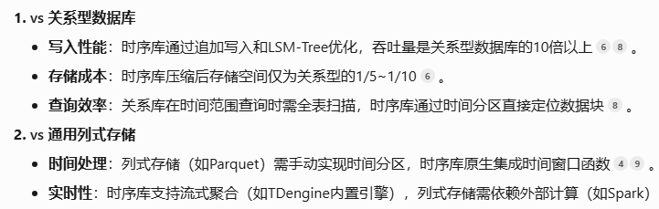{width="5.772222222222222in" height="1.8333409886264218in"}

### 存储结构

时序数据库的时间分片是少不了的

**TSDB**

固定时间窗口分片的块存储, 每块包含:

chunks: 压缩后时序数据

index: 倒排索引文件, 记录时序序列和数据位置的映射

meta.json: 记录元信息, (时间范围, 样本数量等)

tombstones: 软删除标记

压缩机制: 时间戳是**delta编码**, 样本**变长编码(ZiGZag + Simple8b)**(压缩方法后续可以详谈)

内存+WAL方式写入

**InfluxDB**

**TSM存储引擎**; 时间分片+行列分离的方式

TSM文件组成

**数据区**: 行列混合存储+列式存储, 多个block连续组成

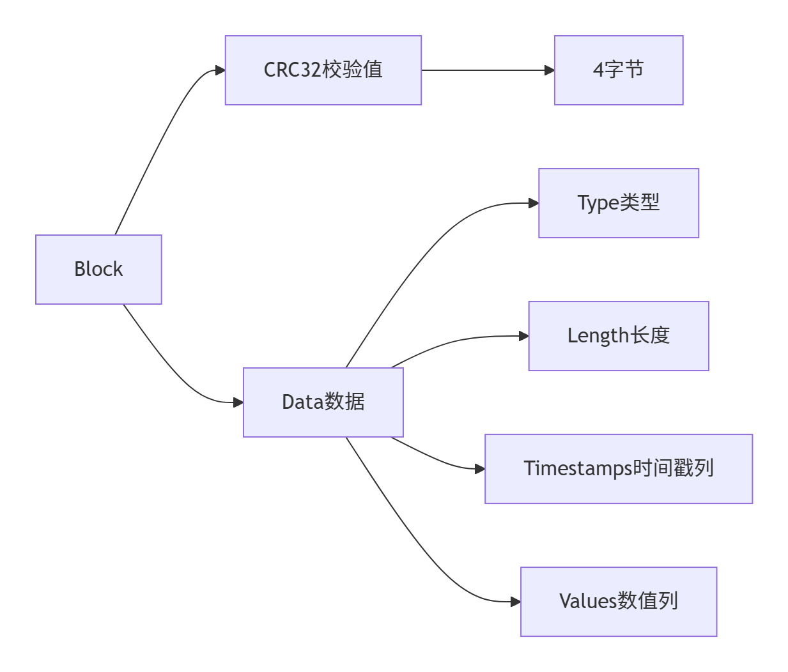{width="3.251388888888889in" height="2.774096675415573in"}

一个block存着同TimeSeriesKey+同field的数据

block内时间戳和数值分别列存

行列混合的意思就是, 文件级, 每个block存着相同的行数据(行级), block内不同字段是列存(连续字段a, 再连续字段b)(列级)

**索引区**: 内存维护SeriesKey -\> 数据块位置

分片机制 shard!

ShardGroup(某时间段) - Shard(时间段内的存储单位)

数据按时间分区

单个shard对应一个TSM文件(最大2GB), 超限会分裂

### 分布式数据库 / NewSQL

[DK百科全书-NewSQL](https://docs.qq.com/doc/DUEFNSGhScGZMTWtD)

强一致性, 高可用, 分布式部署; 性能快于共识服务, 但会低于redis那种BASE类的

Google spanner

TiDB

YugabyteDB

CockroachDB

### 消息队列/消息中间件

[DK百科不全书-消息中间件](https://docs.qq.com/doc/DUGh0Y3dBTGNoTHNN)

### 规则引擎

### 模式

> 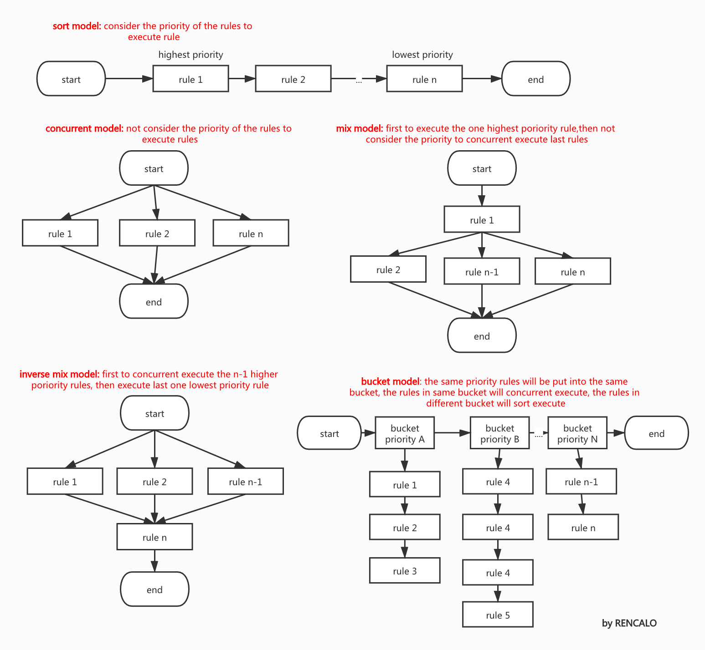{width="5.538888888888889in" height="5.112820428696413in"}

### 系统/容器/性能

### 多线程性能基准

不安全读写，内存屏障，原子变量, 互斥锁, 自旋锁的性能基准

简单共享计数的场景, 互斥区很短

**不安全直接读写**为100%(只作为基准); 约5000万/秒(每一次计算20ns)

**内存屏障, 原子变量,自旋锁**性能相近, 80%多

**互斥锁**: 简单场景不适合互斥锁, 只有\<40%的性能; (复杂共享互斥场景才是互斥锁的应用场景, 这里性能弱正常)

### 内存屏障

纯兴趣, 基本没人问的, 自己看吧, 不过下面链接没有实际实现

<https://cloud.tencent.com/developer/information/linux%E5%86%85%E6%A0%B8%E4%B8%AD%E7%9A%84%E5%86%85%E5%AD%98%E5%B1%8F%E9%9A%9C-video>

### 分布式系统/一致性

[DK百科不全书-分布式原理](https://docs.qq.com/doc/DUEVrWlB2T0RTSVN1?no_promotion=1)

### 架构思想

[DK百科不全书-分布式系统架构](https://docs.qq.com/doc/DUFFOaktScHNJakhU?no_promotion=1)

#### DDD 领域驱动设计

[DK百科不全书-DDD领域驱动设计](https://docs.qq.com/doc/DUGxOckZrQ3ppTFJC)

### 场景应用

### 电商活动库存 / 影院占座

需要保证共享变量的写的线性一致性

方案1: 预先修改库存, 再进行后续逻辑

预先修改可以用redis/etcd,

redis单机保证顺序, 但是存在节点宕机, 复制节点异步复制数据追赶不一致的问题; etcd共识服务保证数据一致性, 但是可能性能不如前者

问题1: 修改库存后, 后续逻辑未进行成功, 需要修改库存; 如果是应用崩溃,服务宕机等需要有其他服务进行定时扫描进行数据恢复; 修改库存前先创建事务或者说动作会话的记录, 以便数据恢复

方案2:

多服务-event loop/多线程处理

每个服务预申请一定量的库存, 目的是减少分布式服务的共享资源获取

服务内部可以用利用event loop, 或者原子变量进行数据的同步处理

问题1:同样有服务宕机的问题, 需要有其他watch dog, supervisor之类的服务 保证数据的恢复

#### APM监控平台

### 告警处理

告警处理流程

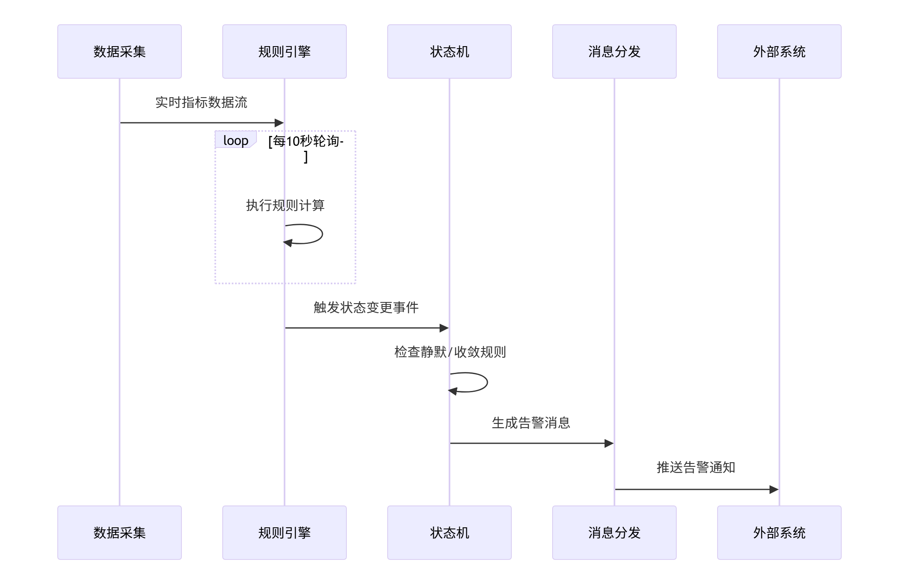{width="5.772222222222222in" height="3.759887357830271in"}

规则引擎触发时间, 状态机服务event driven

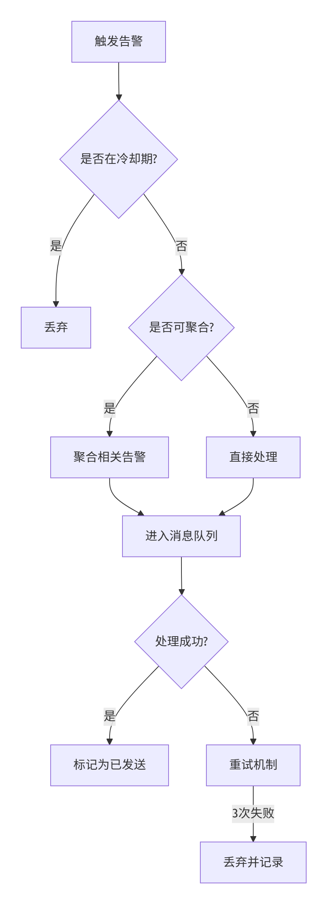{width="4.032905730533684in" height="11.110305118110237in"}

状态机变化

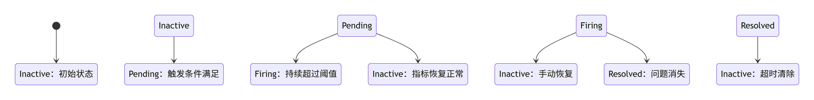{width="5.772222222222222in" height="0.7105446194225722in"}

消息分发

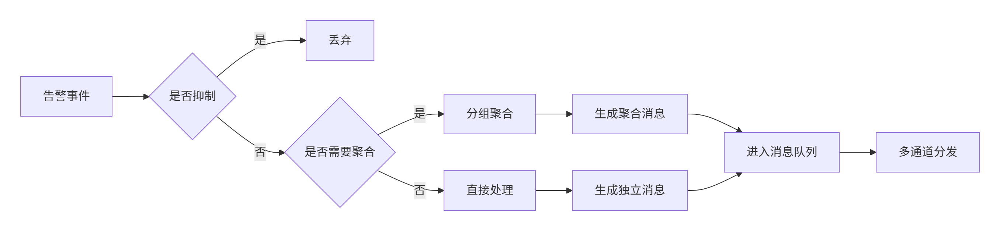{width="5.772222222222222in" height="1.3366360454943131in"}

**存储**

状态存储: redis/etcd(热)

历史版本存储: 关系型db(冷)

#### 服务发现

架构

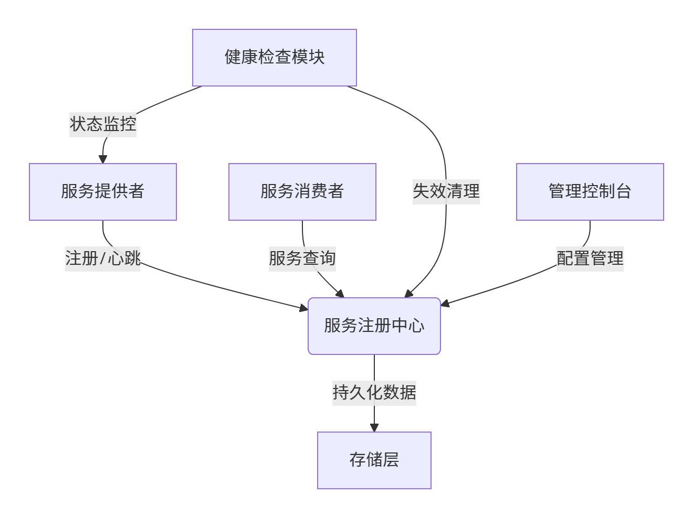{width="3.2930555555555556in" height="2.464802055993001in"}

### 已有服务发现

看大多的服务发现都有相似之处, 1)共识服务,2)状态管理; 这也和配置中心十分相似, 服务发现,服务注册就是特化的配置管理中心, 只是修改服务的不是管理端修改发布, 而是服务自注册时修改; 有点像一般配置中心的读写倒过来了

-   zookeeper

存储信息的分层命名空间, 服务A接入创建临时节点, zk保持节点监控; 存储信息放着服务A的具体信息; 同样也可以用作配置管理中心

-   consul

也差不多

-   etcd & k8s

### 网络 (协议相关)

### 实时协议对比

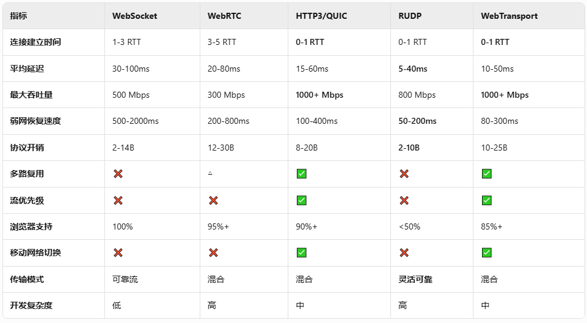{width="5.772222222222222in" height="3.1756178915135607in"}

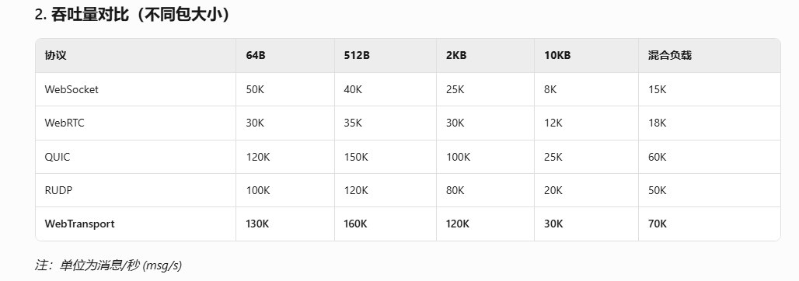{width="5.772222222222222in" height="2.0326312335958003in"}

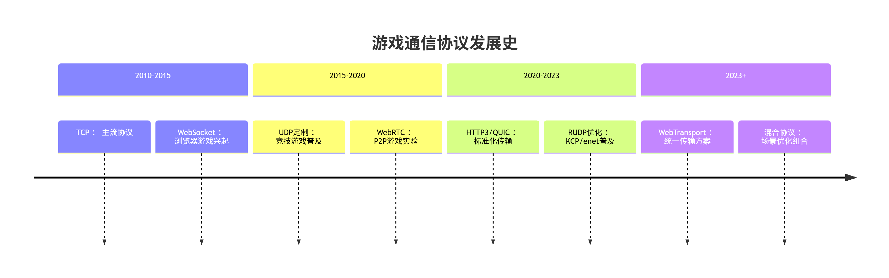{width="5.772222222222222in" height="1.810521653543307in"}

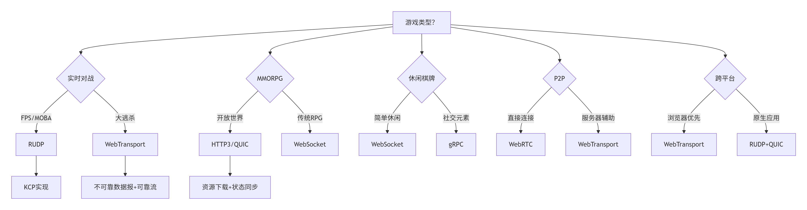{width="5.772222222222222in" height="1.503105861767279in"}

其他选择:

1.  MQTT
2.  gRPC
3.  RSocket
4.  Aeron
5.  CoAP

### HTTP

1.0: 单TCP连接, 一个请求完了再下一个, 每个请求创建一个TCP连接

1.1: 单域名多TCP连接, 仍然有队头阻塞, keepalive复用连接, 只是保持tcp连接一段时间, 用于下次请求复用, 不是真正的长连接

2.0: 单TCP连接 多路复用, 可以并发处理多个请求, 无队头阻塞, 减少TCP连接数, 存在RTT多的问题, 弱网恢复会有问题; TCP滑动窗口的丢包仍然会队头阻塞, 受限于TCP的阻塞

3.0: UDP包, 0RTT, 内含tls, tls 1RTT; 流独立;

### 高可用

#### 可靠性

[DK百科不全书-可靠性](https://docs.qq.com/doc/DUHJzcmdYS0R4Wmhs?no_promotion=1)

#### 可观测性

[DK百科不全书-可观测性](https://docs.qq.com/doc/DUGdCUW96eHdGaW5w)

#### 一般问题

### 指标
| 指标 | 计算方式 | 目标值 | 说明 |
|:---|:---|:---|:---|
| 可用率 | (可用时间/总时间) × 100% | ≥99.99%（四个九） | 年停机时间≤52分钟 |
| 请求成功率 | (成功请求数/总请求数) × 100% | ≥99.9% | 反映服务处理能力 |
| 平均恢复时间(MTTR) | 总故障恢复时间/故障次数 | 分钟级（如≤5分钟） | 故障恢复速度 |
| 故障率 | 单位时间故障次数 | 趋近于0 | 系统稳定性 |

**性能与可靠性指标**

- **响应时间**：P95/P99延迟（如≤200ms），过高可能预示潜在风险
- **吞吐量**：单位时间处理请求数（QPS），衡量扩展能力
- **并发能力**：最大并行处理请求数，体现资源利用率

### 实现手段

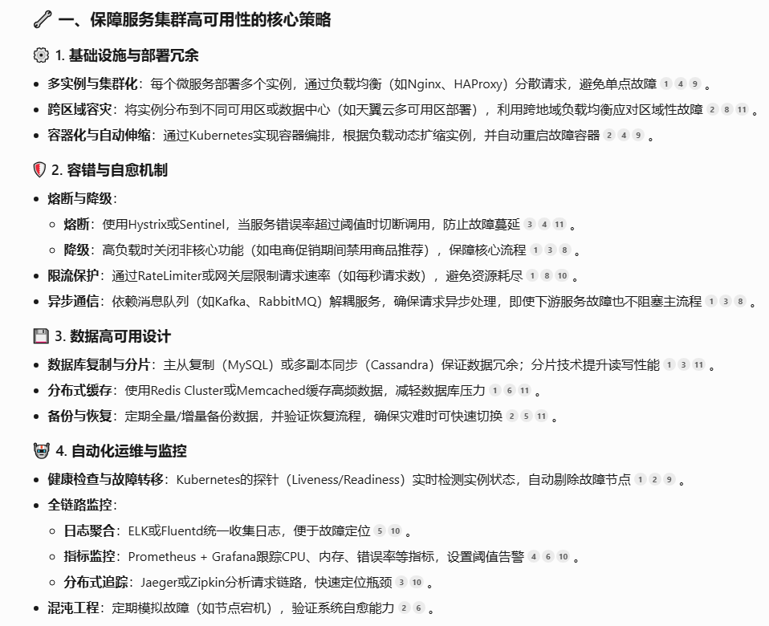{width="5.772222222222222in" height="4.699721128608924in"}

高可用的处理分两个阶段:

1.  主动发现问题(可观测性的完备)
2.  出现问题后的快恢复(多层次的服务冗余)

在上述2情况中, 如果是非宕机的情况, 存在资源紧张无法快速扩容时, 使用弃车保帅的做法, **熔断和降级**, 这需要侵入到具体的业务场景.

### 高可用手段

数据复制以外的

  ------------------------------ -------------------------------- -------------------------------------------------------- --------------------------------------------------------------------------------
  手段                           核心理念                         核心作用                                                 典型应用场景

  数据复制 (Replication)         创建多个数据副本                 提供数据冗余，防止数据丢失                               几乎所有分布式存储系统的基础 (e.g., Kafka Replicas, Cassandra Replication)

  分布式事务/共识 (Paxos/Raft)   在分布式节点间达成一致           保证复制操作的强一致性，实现安全的主节点选举和故障转移   集群 Leader 选举，复制日志一致性 (e.g., Zookeeper, etcd, TiKV)

  高可用架构模式                 定义访问和故障转移逻辑           实现服务快速恢复 (Failover)，均衡负载                    主备 (Redis Sentinel)，多主 (Cassandra, DynamoDB), 基于 Raft 的主动复制 (etcd)

  WAL (Write-Ahead Log)          先记录日志，再更改内存状态       确保内存状态的崩溃一致性，操作可重放                     数据库事务日志 (MySQL redo log), 状态机复制 (Raft log), Kafka Partition Log

  快照 (Snapshot)                定期保存完整状态镜像             大幅加快恢复速度 ，允许清理旧日志                        Raft 快照，Kafka Streams State Snapshots, LevelDB SSTables

  数据分片 (Sharding)            水平分割大状态                   隔离故障域 ，支持状态规模扩展，降低单个点故障影响范围    大规模分布式数据库 (MongoDB, TiDB), 分布式缓存 (Redis Cluster)

  CRDTs                          设计可无冲突合并的数据结构       免协调冲突解决，适合最终一致性和高分区容忍场景           分布式协同编辑，去中心化计数器和集合，AP 模式的分布式系统

  幂等操作                       同一操作执行一次或多次结果相同   允许安全的重试操作，是实现可靠消息处理的基础             微服务中的 API 设计，消息队列消费 (确保 Exactly-Once 语义的基石)

  断路器 (Circuit Breaker)       监控失败率并进行熔断             隔离下游故障，防止级联崩溃，提高系统稳定性               微服务间调用依赖防护，数据库连接池过载保护

  客户端重试/退避                客户端智能重试请求               容忍暂时性故障，避免"惊群效应"淹没正在恢复的服务         任何涉及远程调用的客户端库
  ------------------------------ -------------------------------- -------------------------------------------------------- --------------------------------------------------------------------------------

#### 服务降级

#### 服务限流

#### 服务熔断

### 高并发/高性能

### I/O种类

阻塞IO

非阻塞IO

IO多路复用

信号IO

AIO (io_uring)

就不用解释了吧, 太基础了

### IO多路复用

**select**

将fd集合传给select, **线性扫描**是否就绪, 返回后**再遍历**

每次都要将集合参数用户态调用到内核态, 大小限制1024个fd

**poll**

还是**线性扫描, 集合参数复制, 返回再遍历**

改进了数量限制

**epoll**

三个函数控制: 创建, 注册, 监听

fd存放内核态, 红黑树结构, 直接返回结果集

有边缘触发和水平触发模式

### 磁盘操作的文件IO(多路复用/AIO对比)

**多路复用**

epoll是针对网络IO的, 数据的可读可写就绪等通知, 而且直接操作的都是内存, 协议栈再去做对应的操作; 而文件IO需要有磁盘-\>内存的操作, 是需要操作fd进行同步阻塞的

**AIO io_uring**

aio操作fd是真正异步的操作, 读取磁盘到内存, 是内核态里进行, 用户不需要等待, 在完成的时候, 会调用回调函数通知

io_uring实现

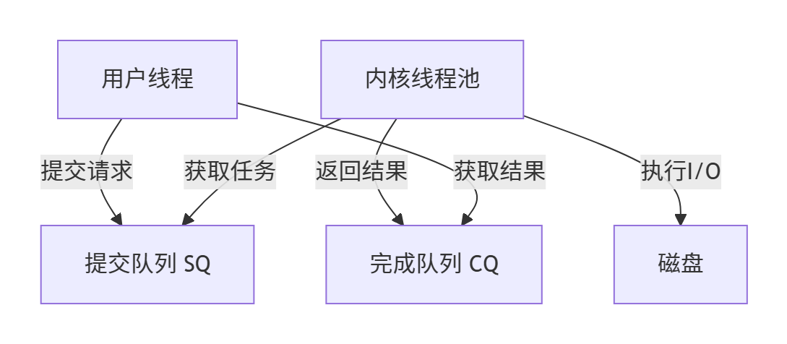{width="5.772222222222222in" height="2.523028215223097in"}

两个队列都是环形空间无锁队列

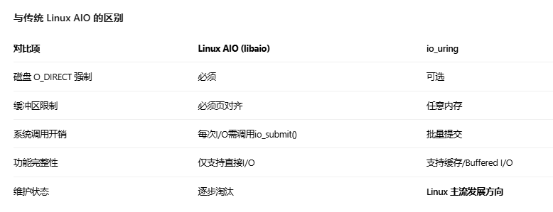{width="5.772222222222222in" height="2.2183737970253716in"}

**默认加载**是放到内核态内存空间, 回调时在复制会用户态空间; 适用于通用场景, 有不可避免的内存复制

{width="5.772222222222222in" height="1.075265748031496in"}

**zero copy优化**, DMA到用户态内存空间(O_DIRECT); 可以省去复制开销, 直接写用户态内存空间; 但是代价: 缓冲区必须内存对齐, 没有了页缓存(系统的磁盘缓存), IO大小需要扇区对齐, 因为DMA数据映射的特性

{width="3.115972222222222in" height="0.9301410761154856in"}

{width="3.11625656167979in" height="0.8559011373578302in"}

**内核旁路**; 用户线程轮询硬件状态, 绕过内核页缓存和中断; 需要NVMe SSD等设备

{width="3.9805555555555556in" height="0.9817508748906387in"}

### 不同的网络模型对比

golang可自动脑补替换线程为G协程

1.  单线程Accept

> 纯玩具

2.  单线程Accept + 多线程业务读写

> 经典永流传

3.  单线程IO多路复用

> 实际还是一个执行, redis都多线程IO读写, 单线程主业务loop了.

4.  单线程IO多路复用 + 多线程业务池

如果返回的写IO还是在前置线程的话, 并发还是很低, 如果读写在业务线程的话, 和2区别不大

5.  单线程IO复用(listener)+多线程IO复用

> 只是2+3的结合版, 4的IO优化版

6.  单线程IO复用(listener)+多线程IO复用+多线程业务池

> 很复杂啊, 很强大, 但是也有瓶颈限制, 层级太多, 瓶颈排查也麻烦

### 问题排查 量级上涨 导致响应耗时增加

全局资源抢占导致阻塞(锁, 资源池)

单机内系统资源耗尽

量级上涨导致的性能下降原因还是归根于资源的耗尽!

可能是程序内的共用变量资源, 可能是容器的系统资源, 也可能是下游依赖的存储资源

### 安全

[DK百科不全书-安全](https://docs.qq.com/doc/DUFdha1dmZFJZc3Jm?no_promotion=1&is_blank_or_template=blank)

### AI

[DK百科不全书-AI应用](https://docs.qq.com/doc/DUFJRWHVtV0h5endr?no_promotion=1)

### K8S

[DK百科不全书-K8S](https://docs.qq.com/doc/DUE5RWHFnRUpBS3dh?no_promotion=1)

### 面试

#### 项目后续优化

1.  特征分类, 减少请求链接
2.  引擎修改网络模型, 限制执行单位, 方便控制
3.  引擎执行单元粒度更细分, 方便复用
