#### 协程 / 调度

##### 竞态同步问题(多协程竞争, 无锁同步)

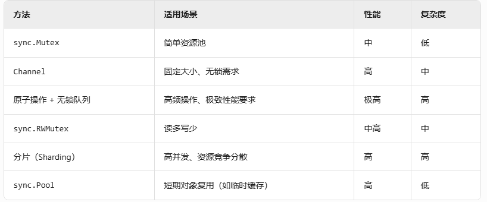{width="5.233333333333333in" height="2.1752241907261594in"}

##### GMP什么时候会发生调度

就是何时调用了schedule

1.  主动挂起(主动退出调度) ; 主动调用gosched

2.  系统阻塞 park

3.  M小于P时, 防止饥饿主动退出; (抢占式调度) preempt

4.  系统监控 sysmon

5.  gc, stw时会停止所有, 之后再触发调度

再详细多讲两句:

发起调度是需要通过mcall(schedule), 将用户栈切换到系统栈g0后进行的. mcall是汇编实现的函数(看stubs.go的定义和对应.a实现); 保证寄存器的切换时只有一个, 且切换到g0系统栈后, 调度会锁定sched的全局锁, 保证每次只有一个P进行调度.

为什么需要切换到g0系统栈呢? 因为调度的runtime信息对外不可视, 用户栈无法访问.

再多说一句, 调度完成后, 会通过gogo函数切换到用户栈

##### 栈空间大小

goroutine大小默认是2k, 当栈空间不足时会复制扩容

**栈会在以下情况增长：**

1.  函数调用深度增加

2.  局部大对象分配

3.  编译器检测到栈空间不足

**最大栈大小限制**

-   64位系统：1GB

-   32位系统：250MB

##### G发生系统调用后的变化

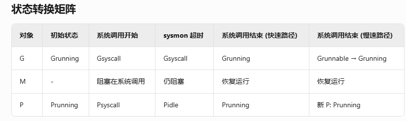{width="5.772222222222222in" height="1.721907261592301in"}

具体实现关注runtime中proc.go, runtime2.go; 汇编实现的上下文切换在stubs.go(主要是gogo, mcall)

G状态变化相关函数看: go\*\*\*

goready

gopark\*\*

gosched等

##### 系统调用后GMP变化, handoff逻辑

因为系统调用需要依赖系统线程, 和阻塞不同, g和p都会改变状态为_Gsyscall,\_Psyscall状态, 目前三者保持绑定, 当sysmon判断gm syscall超时时, 会触发p解绑, p变为_Pidle等待调度, 这时候g执行完系统调用后需要重新绑定p, 或者是进队列

sysmon的retake逻辑

1.  长时间的系统调用

全局G队列为空, 有spinning自旋的MP, 系统调用时间\<10ms; 满足任一会跳过retake逻辑

2.  长时间的goroutine

运行超过20ms的G会进行preempt(抢占)

##### acquirem 调用后禁止抢占

在gc和各类调度函数里都会看到, getg后获取对应的m, 并对locks++(因为是线程内属性所以是线程安全的)

在调用releasem之前不会被抢占

##### 系统线程的清除 sched.midle

startm创建时会先mget, 从休眠队列获取, 如果没有的话会通过newm来创建

清除逻辑不在sysmon中, 就是不是后台离线清除的.

调度的时候findrunnable中也没有直接清除m的逻辑, 只有是否开启自旋和进入空闲线程队列的

这个函数是调度寻找是否有可调度的G, 如果没有的时候, 在2\*自旋线程 \< GOMAXPROCS - pidle时开启worksteeling逻辑; 还是没有G调度的话, 走后续逻辑在sched.needspinning\>0时会开启自旋

查看代码和mexit, mdestroy有关的只有mstart0, 而mstart0-\>schedule-\>execute时是不会返回的. 所以无法走到mexit的逻辑, 那么是存在可能线程泄露的情况

{width="5.772222222222222in" height="1.378619860017498in"}

目前所有即便是系统一些清除逻辑, 也是不符合逻辑的, 因为midle没有任何逻辑去做对应的清除, 而mget只会做指针判空, 不会对线程是否还存在做判断; **所以结论是调度器创建的线程,不会对已创建的线程销毁, 除非进程退出**

##### ready 和 goready的关系

两者都是会将goroutine的状态变为runnable;

ready是在系统栈调用, 而goready是用户栈调用; goready中也会通过systemstack调用ready进行实现

ready中会调用wakep尝试获取调度

##### go挂起

简单来说：gopark 是"主动休息"，preemptpark 是"被强制打断"，suspendG 是"管理员直接关停"------三者分别应对不同层级的暂停需求，共同保障 Go 并发的健壮性和响应性。

AI好总结啊

还有preemptone(sysmon)/preemptall(gc/stw)

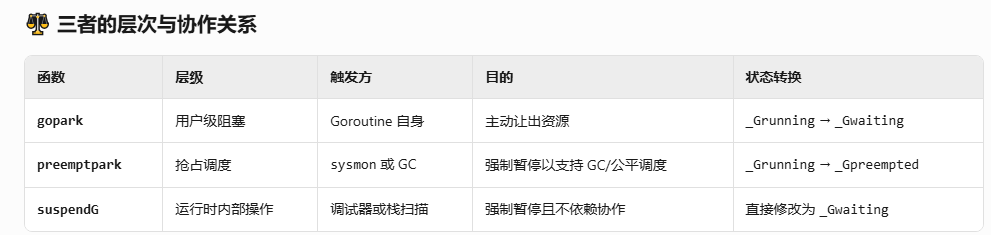{width="5.772222222222222in" height="1.3687915573053369in"}

还有一个问题可以关注一下, preemptpark改G状态到_Gpreempted后不会修改,在suspendG才有对应的转waiting逻辑

##### GOMAXPROCS 没有适配cgroup限制导致容器Throttle

在1.25后会自动适配cgroup限制

之前的话, 需要做出对应的限制, 不然的话, 过多P会导致更多的系统线程被调度

更多的调度会导致cgroup限制时间的耗尽, 出现Throttle现象, 导致请求在单位时间内么有处理完, 而出现跨时间单位的耗时增加

##### mcall,gogo,systemstack区别

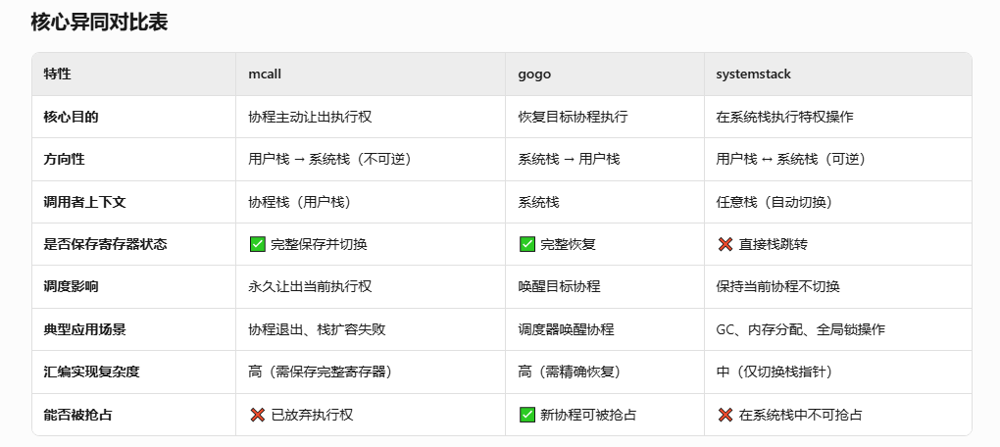{width="5.772222222222222in" height="2.5805227471566052in"}

##### 系统栈和协程栈区别

**不同点**

1\. 所属实体和用途

-   系统栈（System Stack） ：每个操作系统线程（M）有一个系统栈，也称为g0栈。

    -   用于运行Go运行时的底层操作，如调度器代码、垃圾回收的STW阶段、栈扩容处理等。

    -   用于处理需要在不可抢占的环境中运行的关键操作。

-   用户协程栈（Goroutine Stack） ：每个goroutine（G）有一个用户栈。

    -   用于执行普通用户代码（即goroutine的函数调用）。

    -   用于并发执行任务，每个goroutine的执行上下文独立。

2\. 大小和管理

-   系统栈 ：固定大小，在创建操作系统线程时分配，通常较大（在Linux上默认为2MB）。

    -   由操作系统线程创建时分配（例如通过pthread_create分配），不会动态增长。

    -   不参与Go的内存分配器管理。

-   用户协程栈 ：动态增长，初始大小为2KB（对于新建的goroutine），可以按需扩容（每次翻倍），最大可达1GB。

    -   由Go的内存分配器管理，当栈空间不足时，运行时会在堆上重新分配更大的栈，并复制旧数据。

    -   使用分段栈或连续栈（当前实现为连续栈）的策略，确保高效扩展。

3\. 并发安全与抢占

-   系统栈 ：在系统栈上运行的代码是 不可抢占 的（除非主动让出）。

    -   执行关键代码时不会被调度器挂起或抢占。

    -   通常用于运行需要原子性完成的运行时操作（如全局状态修改）。

-   用户协程栈 ：用户代码是 可抢占 的，调度器可以在安全点（如函数调用、循环检查）中断用户goroutine的执行。

    -   通过协作式抢占（早期）或基于信号的抢占（现代Go版本）实现，保证公平调度。

4\. 访问权限和范围

-   系统栈 ：可以无限制地访问运行时的内部数据结构（如mheap、全局变量等）。

    -   在GC的STW阶段或内存分配期间，可以安全操作全局堆状态。

-   用户协程栈 ：只能访问与其goroutine相关的数据，不能随意操作运行时的全局状态。

    -   访问全局状态需要通过安全接口（如通过systemstack切换栈），防止并发冲突。

5\. 切换机制

-   系统栈 ：通过runtime.systemstack(f func())函数切换到系统栈执行。这个函数会修改SP寄存器以切换到系统栈（g0栈），然后调用函数f。

    -   执行完毕后自动切换回原来的协程栈。

用户协程栈 ：由Go调度器通过mcall、gogo等汇编函数进行切换。上下文切换涉及保存和恢复寄存器和栈指针。

#### GC

##### Greentea GC

**主要点**: 处理单位从对象变成了mspan(比如drain, GCMarkWorker等)

更好利用CPU缓存, 减少碎片处理的问题

**对比**:

  ------------------ ------------------------------- -----------------------------------
  **维度**           **传统 GC (Go 1.24 及之前)**    **Green Tea GC (Go 1.25 实验性)**

  **队列基本单元**   单个对象指针 (Object Pointer)   内存块 (**mspan**)

  **扫描策略**       随机访问堆内存 (Graph Flood)    基于空间的批处理 (Memory-aware)

  **工作分配**       逐个对象分发，竞争激烈          按 span 分发，粒度更粗，减少同步

  **主要收益**       低延迟但 CPU 浪费严重           显著降低 GC CPU 开销 (10-40%)
  ------------------ ------------------------------- -----------------------------------

##### 三色GC的实现含义

白色: 未标记, 未进标记工作队列(gcMarkWorker从这里取工作任务)

灰色: 已标记, 在标记工作队列

黑色: 已标记, 未在标记工作队列(说明已经遍历标记完了)

##### mgc实现

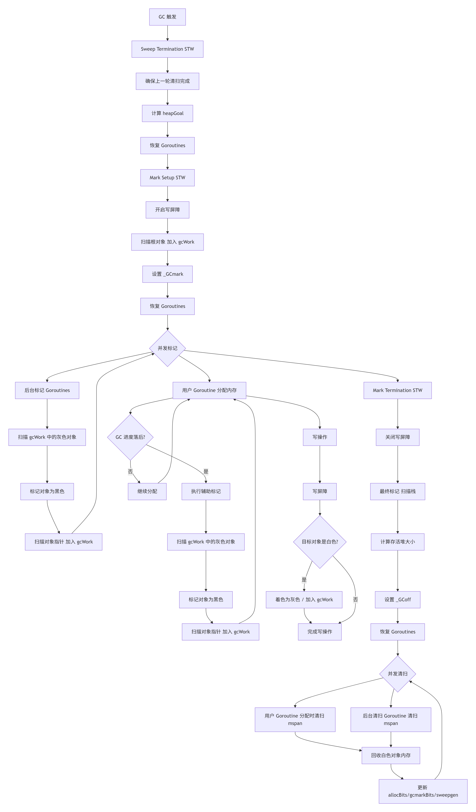{width="5.772222222222222in" height="9.83824912510936in"}

**关联结构体**

内存相关

mheap

mcache

mspan

协程相关

g: GMP的G, gc stw需要暂停协程运行

p: GMP的P, gc stw需要暂停协程对应的调度

gc运行状态相关

gcenable: g0 main时启动后台的sweep和scavenge

gcphase: 枚举值, \_GCoff, \_GCmark, \_GCmarktermination; sweep阶段对应off状态

gcTrigger: 触发gc的启动器, 内存占比/定时/当前gc循环的计数

gcController todo

###### **gc mark**

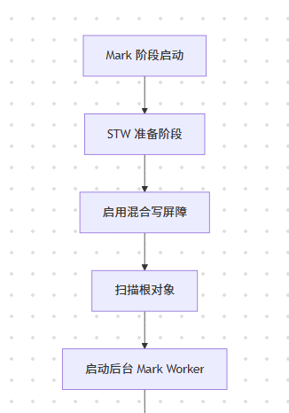{width="2.6161034558180227in" height="3.7395833333333335in"}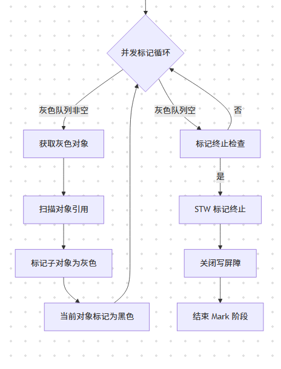{width="3.0873020559930007in" height="4.052083333333333in"}

图中缺少的内容:

1.  启动写屏障后会开启mutator assist(辅助标记)

调用链:

GC\--\>gcStart\--\>gcBgMarkStartWorkers -go func创建-\>gcBgMarkWorker(并发标记的工作线程)\--\>gcDrain\*\--\>gcDrain\--\>markroot(标记初始根节点)

gcStart中, 占用gc和world信号量后, 等待所有P的cache刷新, 启动后台标记worker(核数个), 重置标记参数, 用前面的信号量stw,等待清理工作(sweep, pool), gcController,gcCPULimiter启动, 修改gc阶段枚举(这里会**修改写屏障标记**), 一些prepare状态初始化, stw恢复, 释放信号量; 基本上gcstart的周期结束, 退出去之后还会有个gcWaitOnMark等待mark结束

根对象标记:

多个协程的gcMarkWorker调用gcDrain, gcDrain中顺序:

markroot将根对象 白-\>灰

scanobject 将 灰-\>黑

###### 根对象

1.  全局变量引用

2.  goroutine栈引用

3.  寄存器指针

4.  runtime的数据结构

mmap的堆外内存引用堆内存不会作为gc的根对象，这种引用有野指针风险，可以使用显示注册规避runtime.Pinner

###### gc sweep

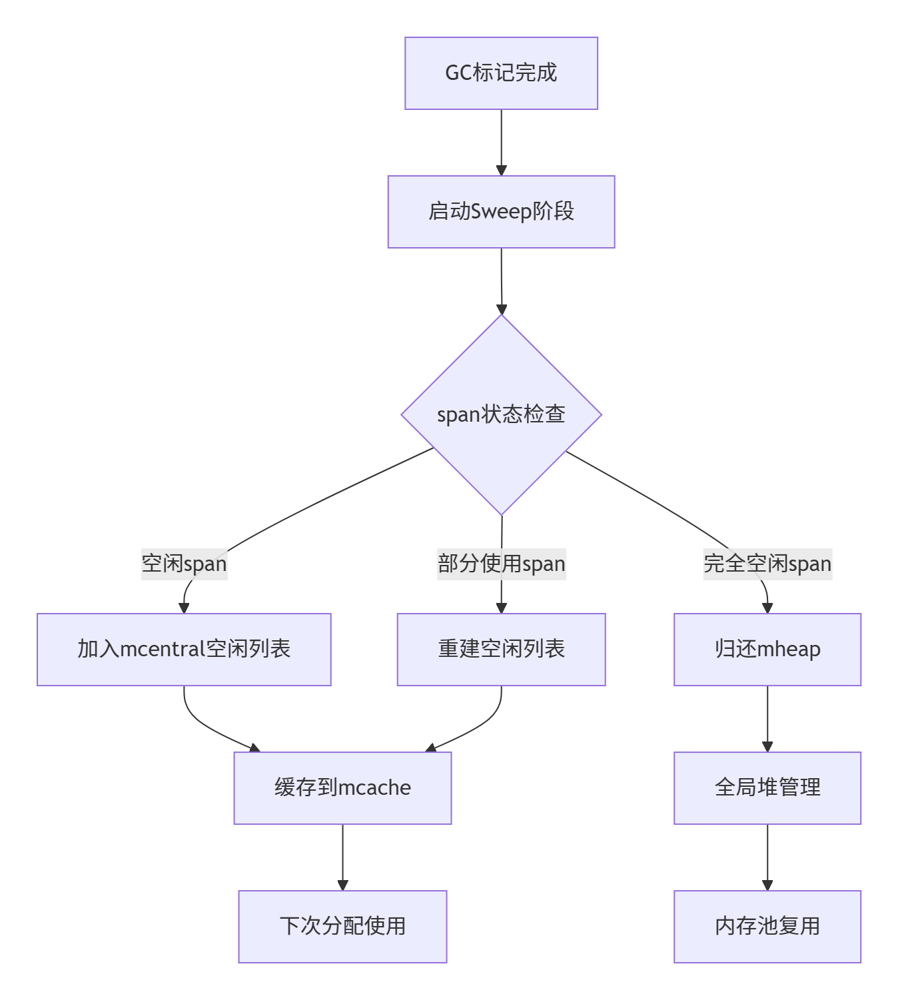{width="5.772222222222222in" height="6.427377515310586in"}

sweep在默认情况下是通过bgsweep进行的, 这个协程是在g0的main中的gcenable启动

如果有主动调用runtime.GC的话, 也会辅助清除(会判断GC轮次)

##### gc中的辅助标记

gcAssistAlloc 内存分配时辅助GC, 使负债转正

gcAssistBytes 记录负债值

负债值 = **本次分配内存大小** × **全局负载因子** （assistWorkPerByte）

全局负载因子由**gcController**动态计算

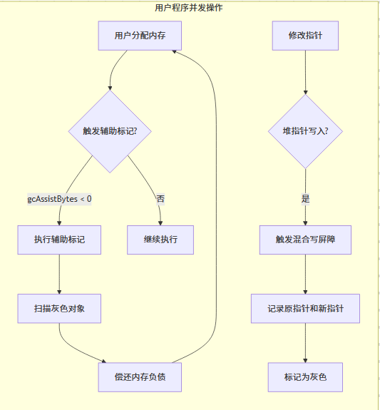{width="5.552083333333333in" height="5.989583333333333in"}

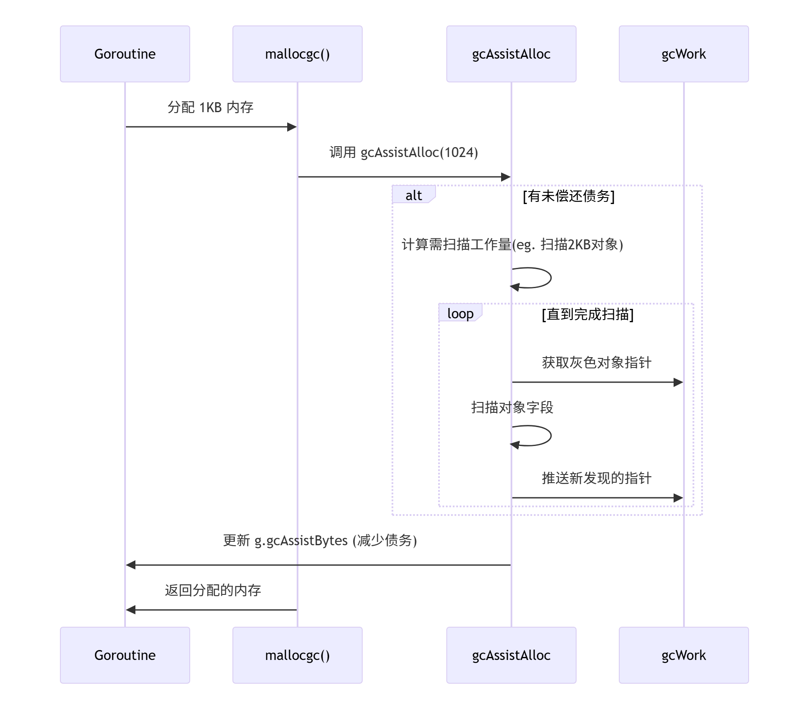{width="5.772222222222222in" height="5.064540682414698in"}

##### stw实现

signal广播抢占和全局sema通知

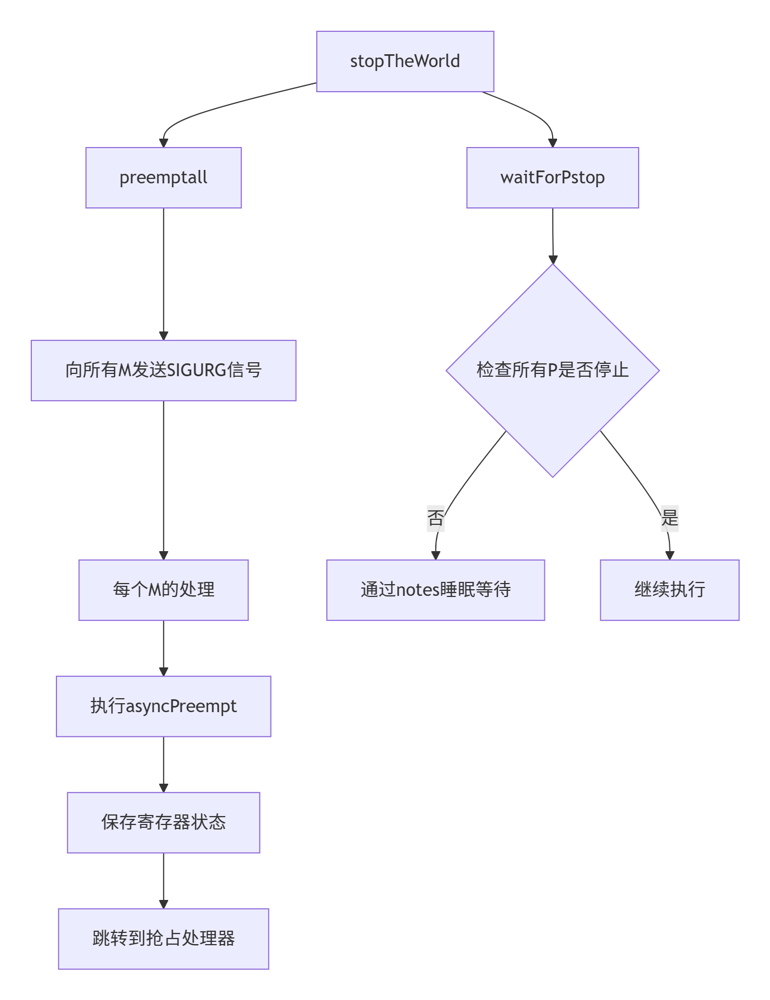{width="2.7965343394575677in" height="3.660213254593176in"}

###### semacquire实现

对应非阻塞的cansemacquire和释放的semarelease

gc对应会有gcsema和worldsema两个的占用

gcsema是保证gc串行化一个时间只有一个gc的同步锁

worldsema是保证stw全局抢占唯一的同步锁

##### safe point

safe point是抢占中的暂停点

**协作式抢占**

在函数调用，循环分支检查点时会有判断是否抢占挂起，在编译时插入runtime·morestack_noctxt检查逻辑

存在问题：无函数调用，无循环检查时会失效

**信号式抢占**（1.14后新增）

利用sigurg信号实现

初始化initsig会注册所有信号处理，对应信号handler会调用doSigPreempt最后到preemptpark处理抢占挂起的逻辑

##### 写屏障

**Dijkstra 插入写屏障**

on-the-fly GC论文中提到的;

将被修改的指针**指向的新目标对象**标记为**灰色**（将其加入标记队列）

**不关注**被修改的指针的状态, 无论你原本是什么颜色

**Yuasa 删除写屏障**

在覆盖（删除）指针**之前的目标对象**（也就是指针原来指向的对象）时，将被覆盖的指针**原来指向的对象**标记为**灰色**（将其加入标记队列）。

**混合写屏障（Hybrid Write Barrier）**

将上面两者组合,

保证黑色对象永远不会指向白色对象

写屏障只作用于堆对象引用, 栈对象不会处理; 但是栈对象引用堆对象是适用的, 因为目标是被增加引用, 或者被删除引用的对象(TODO: ? 待验证, 需要看源码确认)

#### 其他

##### golang string截取的浅拷贝可能造成内存泄露

当一个长string, 在被s\[:n\]截取后浅拷贝作为其他容器的存储; 原本长string的底层结构不会被释放; 在使用时要注意copy深拷贝避免不必要的占用

##### Unit Test活用fake object

创建假结构体包含接口的interface类型, 再复写结构的假方法, 方便测试

##### 类型别名 / 类型定义 和 方法集合

大部分情况下一样, 方法集合这里不同, 别名还是原本类型, 但定义是一个新类型不继承原有方法集合, interface的定义除外

像使用heap的时候, 如果定义别名就无法写方法, 因为方法类型要求同一个包, 所以要使用定义

##### 功能选项模式 / function option

就是定义Option接口, withXXXX返回Option, 传可变参, Option是接受某类然后修改特定值类似setter的, 在trpc/其他框架都有看到这类实现

这个设计牛逼

##### goroutine 并发设计模式(退出模式)

1.  分离模式

    a.  一次性任务, go func()执行完就完了

    b.  常驻后台任务, 一般会for{select{}}监听chan数据

2.  Join模式

    a.  单个等待退出

    b.  获取结果的等待退出

    c.  多个等待退出

    d.  支持超时的等待退出

    e.  notify and wait; 通知并等待退出

3.  管道模式

    a.  扇出模式: 一个chan多个g抢, 这种最好整个buf, 不然等待等死你

    b.  扇入模式: 就是切片chan再批量消费

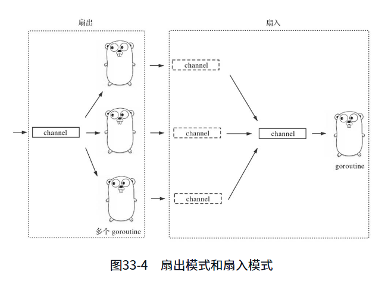{width="5.772222222222222in" height="4.187517497812774in"}

问题来了, 如何实现多个获取结果的等待退出?如果创建g的函数返回一个返回结果的chan, 我有未知数个chan, 也没发显式写select监听呀? 当然非阻塞轮询肯定是可以的, 如何更优雅? 可以链式pipeline(我牛逼)

看**go精进之路1的33.2**, 有很多实现

#### 数据结构

##### string

reflect.StringHeader 可以自己看, 没啥特别的

都是只读, 而且不可修改. 即便用unsafe.Pointer也会出现SIGBUS的信号报错

##### channel实现

关键结构

hchan: chan的结构, 有mutex, 计数, buf, recvq/sendq的等待队列

sudog: 表示一个阻塞的队列操作(写/读), 包含阻塞的G

关键函数

**chansend**

检查为空(永阻塞, 不然throw

队列上锁

检查是否关闭(panic)

检查等待读队列, 走send

检查buf是否有空间, 有直接写buf

不然检查非阻塞

创建sudog, 进队, gopark

**chanrecv**

检查为空(永阻塞

队列上锁

检查队列是否关闭

关闭: 检查是否有buf, 没buf返回空值,false

没关闭: 检查是否有等待写队列, 有则走recv, 先处理阻塞

**T1**(关闭+有buf), (未关闭+无等待)

判断有buf: 返回buf

**T2**(无buf)(无等待); 接下来是要处理自己sudog等待

如果是非阻塞, 直接返回

创建sudog, 进队, gopark

##### channel的实现和select的异同

参照chan.go,select.go

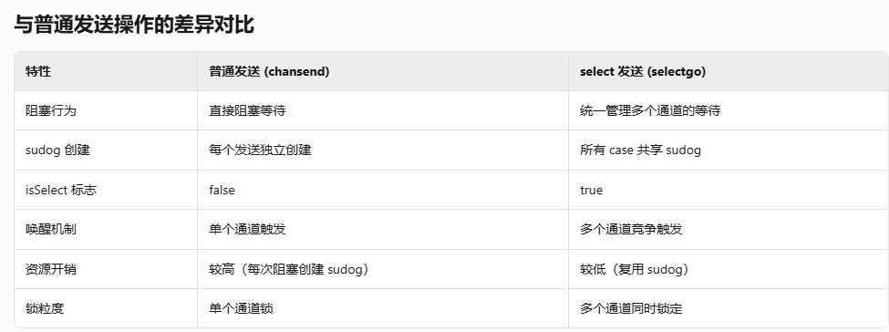{width="5.772222222222222in" height="2.1549628171478563in"}

##### map

1.24后新增swiss_table(rust map同款, 可以看google的论文)

只讨论旧的

关键结构

hmap: map的header

count: kv技术

flags: map状态标识位(hashwriting等)

B: 桶数量的对数(大小=2\^B)

hash0: 哈希种子, uint32, rand()

noverflow: 溢出桶近似数量

buckets: hash桶, 对应bmap; 主要存储的结构

oldbuckets: 旧桶, 扩容时有用

nevacuate: 迁移进度计数器

clearseq: 清除序号(?)

extra: mapextra, 辅助管理溢出桶的

bmap: map的桶结构, 但是代码中没有完全展示所有字段

因为编译器会对map中kv的类型做出优化生成

最后是tophash, 连续的key, 连续的values, 溢出指针(指向溢出桶)

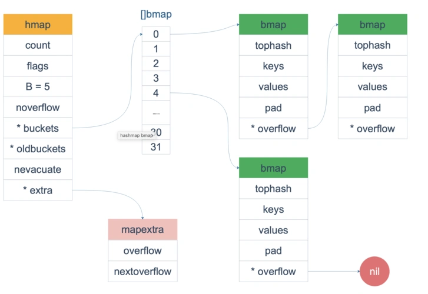{width="5.772222222222222in" height="3.9698917322834646in"}

扩容相关:

触发在mapassign时, 判断1)负载因子\>6.5; 2)溢出桶数量过多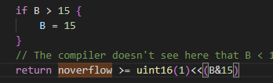{width="3.625in" height="1.1041666666666667in"}

负载高进行增量扩容, 容量\*2, 因为保证是2\^x(方便hash后的与操作, 保证0x001000, 可以直接& 0x000111)

溢出桶过多进行等量扩容, 容量大小不变, 重建后搬迁

growing 是否扩容状态

growWork 扩容操作, 每次最多两个搬迁

evacute 搬迁桶操作

###### map写入逻辑顺序

1.  计算哈希值: AES-NI, AES-based的Ahash, 硬件加速计算, map创建时还有个随机种子

2.  定位桶: 哈希值低位 & mask(容量大小-1), 确定桶位置(hash低位随机性\<高位)

3.  桶内位置:

    a.  桶内结构: tophash+key+val

    b.  检查tophash (emptyRest 后空可插, emptyOne后续未知 继续遍历, =当前值 初步匹配), 都没有就前往溢出桶

    c.  tophash匹配后, 判断key不同则解决碰撞继续遍历tophash

    d.  找到key或是新增: 偏移量写val值

4.  判断触发扩容(扩容条件在上面)

###### map 渐进式扩容

主力迁移逻辑

mapassign/mapdelete的时候(写时), 判断当前是growing状态, 会growWork最多搬迁两个(evacuate); 而且第一个搬迁必定是搬迁当前key算出来的旧桶; 这样可以确保后续读新key不会在旧桶查找

读操作不触发迁移

mapaccess1里会判断是否迁移中, 桶是否搬迁了(evacuated), 桶未搬迁则查旧桶

##### sync.map

关键结构

Map

mu 互斥锁, 写时用

read 只读map, readOnly{m: map本体, map\[any\]\*entry, amended: miss标记}

dirty 写map

misses 只读未命中计数

entry 包装了很多原子操作的函数

p atomic.Pointer\[any\] 实际value的指针

写操作 Store-\>Swap

1.  先检查readOnly是否有key, 尝试CAS更新, 直接自旋CAS

2.  上锁!

    a.  double check readOnly是否有key

    b.  readOnly无, dirty无: 新建kv, 刷新amended

    c.  readOnly无, dirty有: 刷新kv

    d.  readOnly有: 如果有删除标记, 则刷新read的entry回去, 后续做更新操作

读操作

1.  检查readonly

2.  key不存在, amended为true: (慢读路径)

    a.  上锁!

    b.  double check key

    c.  走脏读, miss计数, miss计数超过dirty大小会直接替换readonly

3.  key存在, 快读路径, 直接返回

##### 实现可重入锁

包装一下mutex, 结构增加两原子变量一个记录groutineID, 一个记录计数

groutineID可以从堆栈信息中获取

##### select实现

主要看在select.go中的selectgo函数

会有两个序列切片, pollorder, lockorder记录着scase(select每个队列项的sudog)的index; 两个都是随机序列

用pollorder顺序检查是否有就绪的channel; 有则处理完返回

否则进入写等待队列, 然后park挂起

cas修改状态后开始遍历

当被唤醒后根据lockorder检查就绪, 找到则处理逻辑, 未找到则处理出队等待队列

#### 内存

##### 内存管理

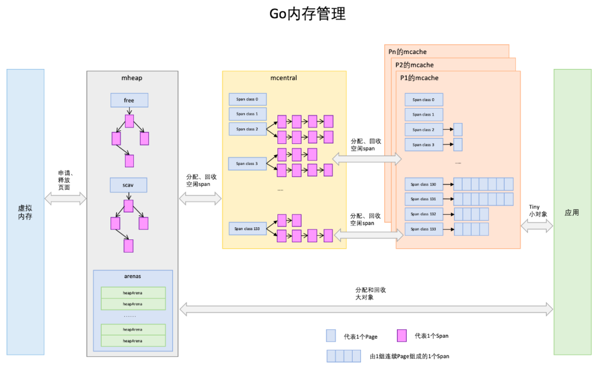{width="5.772222222222222in" height="3.5648818897637797in"}

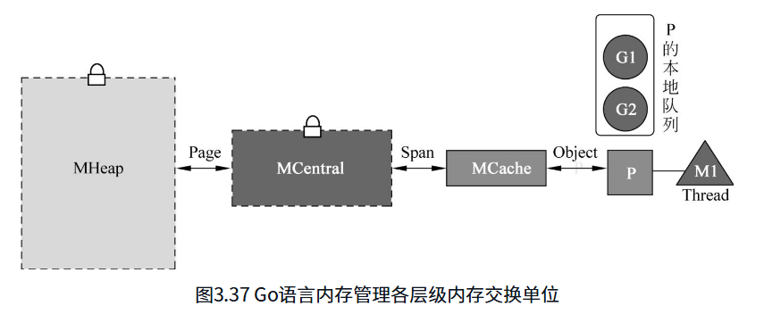{width="5.772222222222222in" height="2.3763998250218723in"}

主要四大结构

mheap: 最大的分配池, 还有arena相关

mcentral: 不会直接使用, 而是分配到mcache中, 分配时要加锁

mspan: 具体内存分配单位, 包含若干个内存页

mcache: 和P绑定的cache

##### mspan

默认大小: 8KB

小对象(\<=32KB), 有67种固定大小类型(mcache内的数组)

{width="5.772222222222222in" height="1.6184547244094487in"}

大对象(\>32KB), 大小完全动态, n\*内存页

##### mcache

mcache有67个spanclass, 分别代表8B-32KB的67个不同等级

P申请内存直接从mcache申请(小对象时, \<=32KB)

如果某个等级的mspan耗尽了, mcache会**申请新的mspan**, 并**归还旧的**(因为我们只操作申请, 旧的不能申请就没用了, 清除和访问不归我们管, 清除有GC, 访问是直接访问地址没有关系)

每个等级的mspan不同, 可申请的数量就是mspan大小/等级大小

**Tiny空间**

专门针对极小对象的共用, 避免bool等类型直接占用一个8B

我们极小对象的拼好饭!

##### mcentral

之前理解mcentral成一个统一概念了(这也没错), 其实每一个spanclass都有一个mcentral管理器

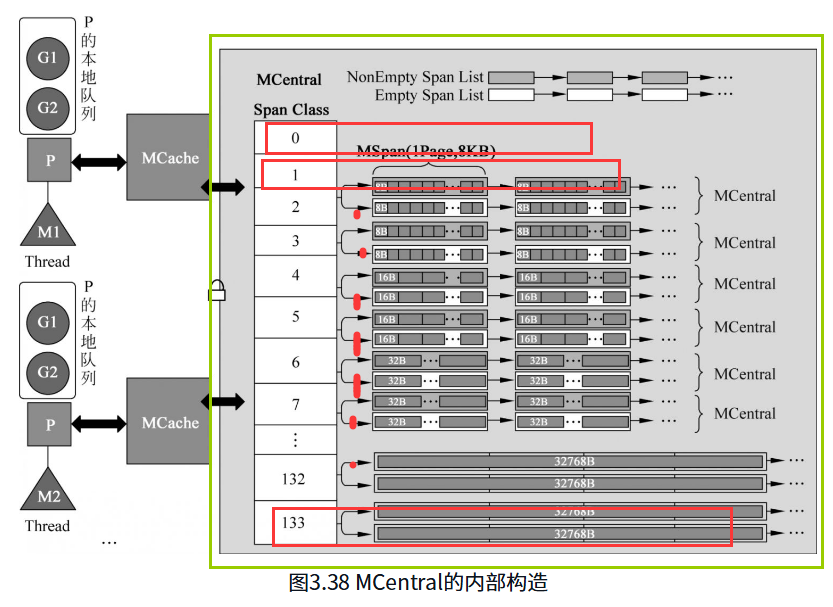{width="5.772222222222222in" height="4.206169072615923in"}

nonempty span list: 可用空间非空, 说明还可以申请, 在mcache不够用时要申请, 会从这里取

empty span list: 可用空间为空, 就是已经耗尽了, mcache用完归还时, 就会放回这里

新版本(1.12引入1.16实装)替换成

partial span set: 至少有一个是空间的, 改进点: 会标记GC已清理和未清理的

full span set: 和前面empty性质一样

无锁lock free 单生产单消费SPSC的环状数组(无锁结构呀可以学一下你的CAS)

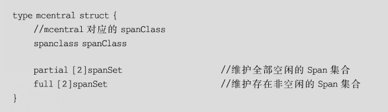{width="5.772222222222222in" height="1.665573053368329in"}

有两个是因为gc sweep相关, 已扫描/未扫描(需要看源码确认下)

##### mheap

被mcentral调用, 没了就会向mheap申请, 如果mheap不够就向系统申请

**而且!mcentral在实现上是在mheap里的**, 只是概念分层了

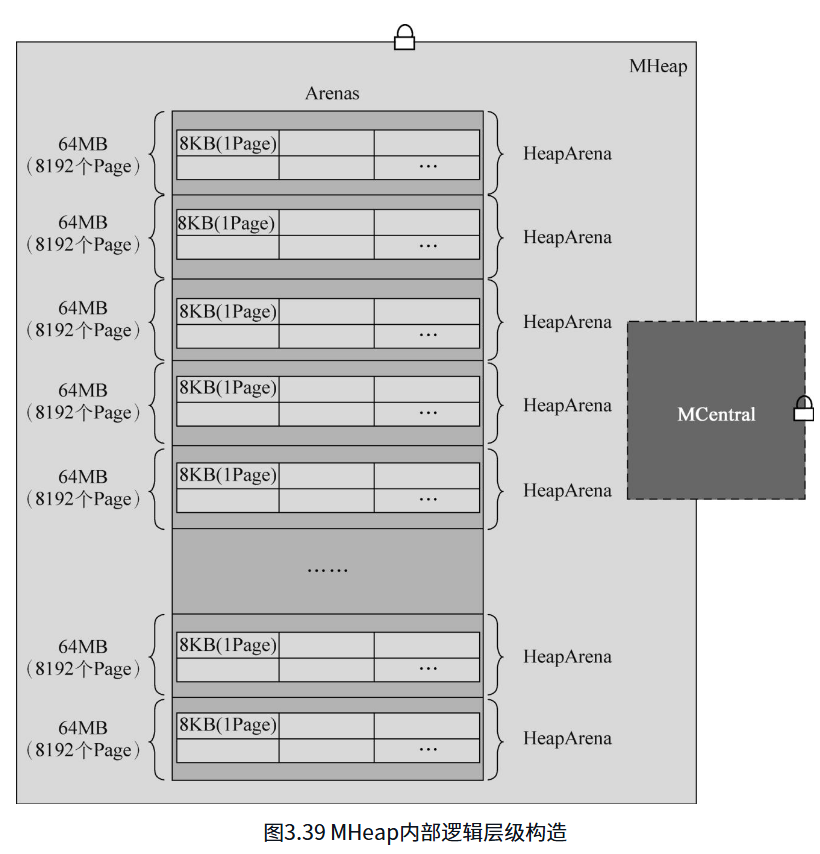{width="5.772222222222222in" height="6.0115583989501316in"}

相当于mcentral有多个spanclass锁, 而mheap就一把大锁

mheap直接管理页(不是mspan, 他来分配mspan的, mspan拿哪些页得看他的)

**HeapArena**

页由一个个arena管理, 有多个arena

每个都有一个bitmap标记使用情况

64位系统一个有64MB大小

**超过32KB的大对象内存分配**

mcache,mcentral都不满足, 直接对话mheap, arena里直接分配page

#### 调试 pprof trace

##### pprof/火焰图如何区分gc过程

~~gc相关都是runtime, 可以从名称去区分~~(有点存疑,见下面解释)

GC触发的三种方式:

1.  定时

2.  内存占比定量

3.  主动触发(主动调用GC函数, 可看runtime/mgc.go)

但是runtime线程(bgSweep), goroutine堆栈无法观测到; **但是**, goroutine的状态是带有GC状态的, 可以进行判断(参考runtime2.go的枚举)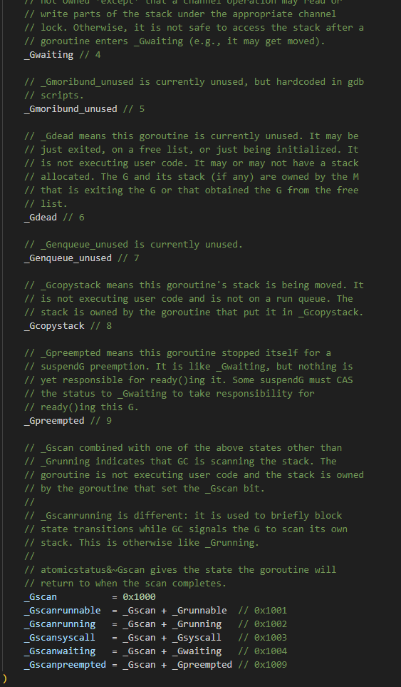{width="4.170576334208224in" height="7.1336843832021in"}

其他看GC轮次相关内容:

heap会通过runtime.ReadMemStats获取

runtime/metrics包内可获取(也是ReadMemStats实现), 具体sample参数看doc.go内注释

ReadMemStats的实现在runtime/mstat.go中

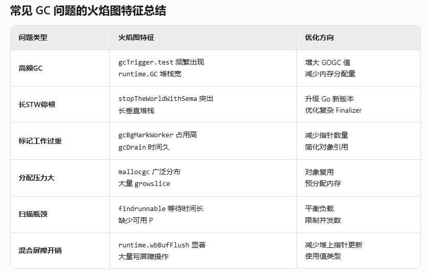{width="5.772222222222222in" height="3.6713538932633423in"}

##### pprof 读取的是哪里的数据

不管http的pprof还是cmd的都是在runtime的内一些数据的.

allocs / heap: 内存相关

cmdline: 启动命令行

groutine / full goroutine: 协程相关

block: 阻塞相关

mutex: 锁相关

profile: cpu信息

symbol: 变量符号, 一般不看

threadcreate: 系统线程

trace: 执行轨迹

###### 内存状态 runtime.MemStats

runtime/mstats.go

读的时候会stw, 然后用systeamstack用系统栈获取统计

###### CPU状态

##### cmd的Fetch, http里的Profile

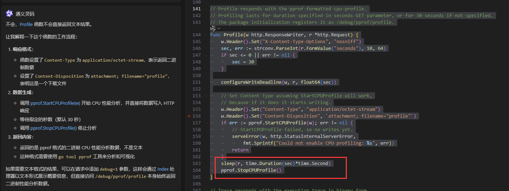{width="5.772222222222222in" height="2.171165791776028in"}

不会直接返回文本结果, 而是一个文件下载(看代码里的steam)

内容是hex要工具查看

需要go tool pprof \[对应的执行文件\] \[生成的profile\]

##### trace 读取的是哪里的数据
