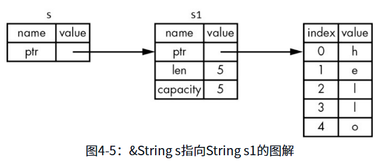
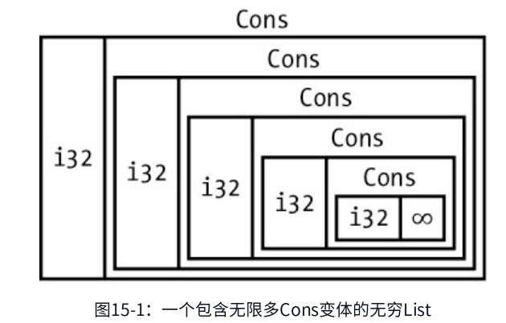
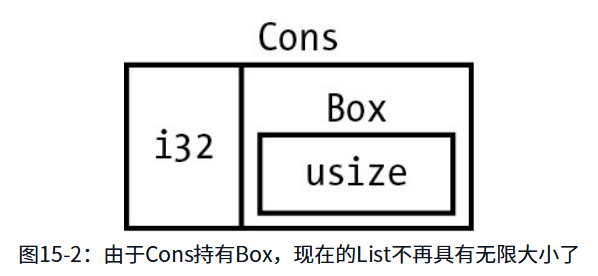
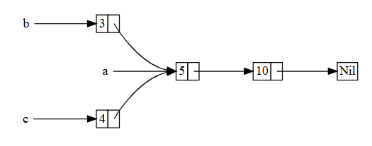

# 基础

### 基本概念

#### 常量

-   不能mut

-   名称一般是大写蛇型

-   右值一定是编译时可确定的值, 函数返回不行

**定义位置**

任何作用域都可以声明

#### 变量

**定义位置**

只能在语句块{}内部, 模块级(全局)不能声明

!!! 不是所有语句块都行, 只有

-   函数体

-   闭包体

-   块表达式

#### 隐藏 / 遮蔽

上节变量第二个let就是变量隐藏

####  数据类型

**基本类型:** 基本栈内分配内存

**复合类型:**

元组 tuple 定长非同类型, 单元元组()

数组 定长同类型

#### 语句 / 表达式

#### 控制循环

### 所有权

有点像unique_ptr

#### 字符串类型 String

可变,可增长=\>堆存放

string和go一样也是ptr, len, cap

字符字面量 str

#### 内存与分配

复制只是堆地址的复制, 不会深拷贝;

但和浅拷贝不同的是, 这更像Move, move之后右值就销毁了

只有基础类型会\"深度拷贝\", 因为他们深拷贝和浅拷贝是一样的

元组内所有元素都是基础类型那也是一样;

其他都是move

#### 所有权与函数

传递给函数后, 变量也是move

#### 返回值与作用域

函数返回发生所有权转移

#### 引用与借用

当需要调用某个函数计算我的变量时, 如果后续再要用到的话, 需要将变量和计算结果都作为函数返回, 这样太麻烦了\...

传递**引用**&s, 不会回收所有权

{width="5.772222222222222in" height="2.4738090551181102in"}

类似指针咯

通过引用传参的方式也被称为**借用**

借用的参数不可以修改, 所以是类似只读指针

#### 可变引用

但是和不可变/可变的变量一样, 也有可变引用

一个变量，同一时间只能有一个可变引用

不可以可变引用+多个不可变引用

可以多个不可变引用

多个作用域可以有多个可变引用

不可变引用的生命周期在最后一次使用，所以在使用后可以创建可变引用（编译器判断，控制生命周期）

#### 悬垂引用

指针指向位置已弃用，被分配给其他使用

#### 切片类型 slice

字符切片

字符串字面量就是静态代码的切片

### 结构体

#### 结构体

单元结构体

无法直接打印,也没相关语法糖的

#### 方法

impl关键字 → 给结构体Rectangle创建语句块

语句块内所有内容都会关联到Rectangle类型

所有吗? 试试变量? → 不行, 变量定义不行

为啥呢?

只能放\"类型成员\" (函数, 关联常量, 关联类型, 产生函数的宏)

不能放\"局部语句\" (let, 控制语句, 表达式等)

方法和字段可以同名

### 枚举与模式匹配

#### 定义枚举

V4, V6 在定义里的分支称为**枚举变体(variant)**

下面的v4,v6将变体变成变量, 才是**枚举值**

#### Option

option空值可判断, 不像其他传指针导致空指针问题

#### 控制流结构 match

类似switch

上面都是用的枚举变体, 除此之外还有:

-   字面量 & 常量

```{=html}
<!-- -->
```
-   变量名称

```{=html}
<!-- -->
```
-   通配符 & 占位

```{=html}
<!-- -->
```
-   元组 & 数组

```{=html}
<!-- -->
```
-   结构体 / 元组结构体 / newtype

```{=html}
<!-- -->
```
-   枚举变体

-   引用与解引用

-   范围(数字和char

-   守卫guard

-   宏展开

几乎let左边可以的都能写进match

**match要穷举所有可能性**, 或者通配

#### 简单控制流 if let

### 包 / 单元包 / 模块

**包 package** cargo的对应单位, 类似go module的级别

**单元包/箱 crate** 生成代码库/可执行文件的树状模块 ( 工程单位 ), go没有这一层级, module包含该功能

**模块 module** **/** **use 关键字** 控制文件,目录, 只由mod控制, 不强制绑定文件/目录; 和go工程内的目录package类似

**路径 path** 导入包的路径, use xx::xx,go就是import \"xxx\"

#### 包 / 单元包(箱)

crate分两种

-   二进制: 打包可执行文件; src/main.rs

-   库: 导入库; 没有main函数; src/lib.rs

可以两个同时拥有

#### 定义模块控制作用域和私有性

箱开始于根节点(main.rs)

声明模块 / 子模块

使用的模块内容, 路径 ::相连, 也可以直接use某模块内所有

默认私有, 声明公共

super 相对路径, 指明父作用域

结构体的公开和属性的可见不是一致的,而是独立配置

枚举只要可见的话, 所有变体都可见

#### use 关键字

**as 关键字** 换名字

**使用外部包**

cargo.toml中增加依赖

多个use 改列表

通配符

#### mod拆分成不同文件

另一种风格

### 通用集合类型

-   vector 动态数组

-   字符串 string

-   哈希映射 hashmap; 另一种数据结构 映射(map)的特殊实现

#### 动态数组 vector

读取vector元素

有借用的情况

遍历

枚举存储多种类型的值

销毁动态数组时, 其中元素也销毁

还是什么时候出作用域, 生命周期结束;

#### 字符串String

**定义**:

核心部分只有一种字符串类型\--字符串切片str, 通常是借用形式(&str)出现

标准库里有String类型, 是可增长, 可变, 自持有, 基于UTF8编码的字符串类型

一般来说, 都是指这两种类型, 一个在核心, 一个在标准库

**初始化 / 创建**

**插入 / 拼接**

**索引**

不能用单个索引

三个概念: 字节, 标量值, 字形簇

还有一个不能通过索引来获取字符的原因是, 操作并非常数时间, rust会遍历从头到索引为止, 确定合法字符

**遍历**

#### 哈希映射 hashmap

**创建 / 初始化**

类型所有k, 所有v内部要一致,

**读**

**写 和 所有权**

哈哈哈, 提到了一下, 他的hash是用siphash(我知道哦)

### 错误处理

也是两大类: 可恢复错误 不可恢复错误

#### 不可恢复错误 和 panic!

panic发生时, 默认开始栈展开

栈展开主要是调用链pop, 然后做析构drop, 顺便再拿到traceback

触发panic!的情况

-   前面说到的越界访问vec

-   空容器取元素: [slice::first]{.underline}、[last]{.underline}、[swap_remove(0)]{.underline}、[Vec::pop().unwrap()]{.underline}、[Option::unwrap()]{.underline}/[expect()]{.underline}

-   除以0,取余0

-   debug模式的溢出

-   通道发送/接收失败

-   互斥锁

-   线程join失败

-   \"零成本\"分配失败 ( 不懂

#### 可恢复错误 和 Result

**match 错误结果**

match返回一个表达式, 可以let赋值, 也可以不用

**?运算符**

使用了?运算符的函数一定要返回:

-   Result

-   Option

-   其他实现了FromResidual的类型

#### 要不要使用panic!

是像java, python一样抛出异常再捕获

还是像C/C++,golang一样处理错误, 重大异常使用panic抛出

按照定义, 应该还是后者;

只有影响到整个系统, 让系统不可用的情况才使用panic

### 泛型 trait 和 生命周期

泛型可以参考golang的泛型, C++模板

trait可以参考golang的interface(加强版)

生命周期之前有提到, 和作用域, 借用等有关

#### 泛型 和 抽象封装

##### 定义

**函数泛型**

**结构体定义泛型**

**枚举定义泛型**

**方法中定义**

**泛型 性能问题**

不像其他反射机制, 没有很多运行时损耗, 与具体类型差不多

编译时,进行单态化, 参考C++ template, golang1.18泛型

#### trait 定义共享行为

trait 与其他语言中常被称为接口(interface)的功能类似，trait功能会更扩展

**定义trait**

**类型实现trait**

**默认实现**

**孤儿规则**

Rust 中用于限制 [impl]{.underline} 实现位置的重要规则，目的是防止 trait 实现的冲突和混乱，确保代码的一致性和可预测性

  -----------------------------------------------------------------------------------
  情况                      示例                        是否合法
  ------------------------- --------------------------- -----------------------------
  ① 本地 trait + 任意类型   impl MyTrait for String     ✅ 合法

  ② 任意 trait + 本地类型   impl Display for MyStruct   ✅ 合法

  ③ 本地 trait + 本地类型   impl MyTrait for MyStruct   ✅ 合法

  ④ 外部 trait + 外部类型   impl Display for String     ❌ **非法**（孤儿规则禁止）
  -----------------------------------------------------------------------------------

##### **trait 参数**

语法糖, trait约束

使用+来指定多个约束

where从句, 简化trait约束

##### trait 返回值

13章有依赖trait的闭包和迭代器

##### trait约束 实现方法

看下面的new, 区分**关联函数**和**方法**

+------------------+-----------------------------------+--------------------+-------------------------+
| 类型             | 定义                              | 调用方式           | 第一个参数              |
+==================+===================================+====================+=========================+
| **关联函数**     | impl 块中**没有** self 参数的函数 | StructName::func() | 无                      |
|                  |                                   |                    |                         |
| 也叫**静态方法** |                                   |                    |                         |
+------------------+-----------------------------------+--------------------+-------------------------+
| **方法**         | impl 块中**有** self 参数的函数   | instance.method()  | 有 self/&self/&mut self |
+------------------+-----------------------------------+--------------------+-------------------------+

**覆盖实现**

如果类型T 实现了Trait A, 就自动实现Trait B

**trait组合**

#### 生命周期 保证 引用的有效性

##### 悬垂引用

##### 函数中的泛型生命周期

##### 生命周期标注语法

**函数签名**

**[\"入长出短\"]{.underline}**：输入引用的生命周期要**[足够长]{.underline}**，输出引用的生命周期要**[受限于]{.underline}**标注。

##### 结构体定义

##### 生命周期省略

每次做重复声明太麻烦, 后续优化语法, 可以推导的省略方式

函数/方法参数的生命周期→输入生命周期

返回值的生命周期→输出生命周期

省略规则:

1.  每一个引用参数都会拥有自己的生命周期参数

2.  当只存在一个输入生命周期参数时, 这个生命周期会被赋给所有的输出生命周期参数

3.  当有多个输入生命周期参数, 其中一个是&self或者&mut self, self的生命周期会被赋给所有输出生命周期参数

##### 方法定义中的生命周期

##### 静态生命周期

特殊生命周期&\'static

就是全局有效, 和整个程序的生命周期相同

#### 同时使用泛型+trait+生命周期

有点猛哦

### 自动化测试

#### 如何编写测试函数

##### 测试函数的构成

3个部分:

-   准备所需的数据或状态

-   调用需要测试的代码

-   断言运行结果

和其他语言都是一样的.

示例:

自动生成代码

成功/失败的展示.省略了

**assert_eq！和assert_ne！**

就是左值, 右值; 等于, 不等于; (是否有gt之类的?)

上面的assert, 在后续都可以跟参数, 都会一起放到format!宏里打印出来

**should_panic**

Result\<T,E\>做返回, 不panic

#### 控制测试运行

并行 / 串行

显示输出

#### 测试的组织结构

**单元测试**

== 以mod形式在文件内就地测试

测试模块 和 #\[cfg(test)\]

我不明白的是, 社区为什么会对私有函数的测试有争议. 我对我有所有权的东西测试还能争议了? 我做白盒测试不行? 一定就得到接口做测试吗?

**集成测试**

== 在tests目录和src目录并列

tests下每个目录都是独立的单元包

不需要#\[cfg(test)\]标记模型

但是函数#\[test\]还是要的

文件→目录的模块, 不再视为集成测试文件, 测试输出就不会有打印

main.rs的二进制无法创建集成测试

只有lib.rs的代码包(库箱 library crate)可以集成测试

但是一般会main.rs只写简单逻辑, 然后调用lib.rs里的逻辑, 就可以对lib.rs做测试了

**文档测试**

### 构建CLI!

这章实现rg(grep的modern替代)

**命令行参数**

**读取文件**

\...

省略这里, 没啥好说的

**dyn 关键字**

### 迭代器 与 闭包

#### 闭包

定义: **[可以捕获其环境中变量的匿名函数]{.underline}**

定义都是一样, 但是声明方式会有不同;

go因为是第一公民, c++则是函数指针; rust定义:

闭包会自动渐进式实现一种两种或全部三种FN系列的trait

-   FnOnce：可以被调用一次的闭包；所有闭包都至少会实现这个trait；

-   FnMut (这个Mut是multi吧？可多次调用）：没有对借用进行任何操作

-   Fn：适用于那些不会移除捕获的值，也不会修改捕获的值的闭包

#### 迭代器

消耗迭代器(iterator)的方法

生成其他迭代器的方法

这里补充一下跟迭代器有关的 filter、map 和 reduce。

  ---------------------------------------------------------------------------------
  方法           输入           输出           惰性求值              作用
  -------------- -------------- -------------- --------------------- --------------
  filter         迭代器         **迭代器**     ✅ 是                 过滤

  map            迭代器         **迭代器**     ✅ 是                 映射

  reduce/fold    迭代器         **单个值**     ❌ 否（消费迭代器）   聚合
  ---------------------------------------------------------------------------------

#### 改进I/O

迭代器是Rust中一种零开销抽象，不会在运行时增加额外的开销

在使用迭代器的时候，编译器知道会进行多少次的迭代的话，在编译期间会进行展开循环

### Cargo 和 crates.io

#### 编译优化和发布配置

opt-level表示不同的编译优化等级。取值范围是\[0,3\]

#### 发布包到crates.io

需要补充文档注释，还会区分一些特殊的区域：

-   panics

-   errors

-   safety

用文档注释做测试

使用 pub use 导出合适的公共API

在 Cargo.toml 文件中补充包的元信息

#### Cargo 工作空间 Workspace

Cargo 工作空间是 **[Cargo 提供的多包管理机制]{.underline}** ，管理多个相关的crate 箱

（可以类比go后续加的workspace）

如何创建cargo工作空间

根目录创建工作空间的toml后

#### Cargo 安装二进制文件

（这个我还是试过的，跟go install global差不多）

### 智能指针

会将存储的空间放在堆上，String、Vec\<T\>就算作智能指针。

通常会使用结构体(struct)来实现智能指针，会实现Deref和Drop这两个trait

标准库最为常见的几种智能指针:

-   Box\<T\>: 可用于在堆上分配值

-   Rc\<T\>: 允许多重所有权的引用记数类型

-   Ref\<T\>和RefMut\<T\>: 通过RefCell\<T\>访问，是一种可以在运行时而不是编译时执行借用规则的类型

后面会有介绍使用内部可变性模式，将不可变的类型暴露出能改变自己内部值的API

**智能指针和引用的关系：**

虽然都是存放的内存地址，作为一个指针的存在，用于数据访问。

但是所有权(move)的特点不同。

引用只是借用数据，不会拥有所有权，但是智能指针像 box 之类的会拥有唯一所有权。

对所有权的影响：

  --------------------------------------------------------------------------------
  智能指针             所有权模式     可变性         线程安全       检查时机
  -------------------- -------------- -------------- -------------- --------------
  Box\<T\>             单一所有       可变/不可变    是             编译期

  Rc\<T\>              共享所有       不可变         否             编译期

  RefCell\<T\>         单一所有       内部可变       否             运行期

  Rc\<RefCell\<T\>\>   共享所有       内部可变       否             运行期

  Arc\<T\>             共享所有       不可变         是             编译期

  Arc\<Mutex\<T\>\>    共享所有       锁定可变       是             运行期
  --------------------------------------------------------------------------------

#### Box\<T\> 堆空间 （普通指针

用box定义递归类型

在FP中相当常见的数据类型，链接列表。

{width="5.772222222222222in" height="3.692389545056868in"}

{width="5.772222222222222in" height="2.6641021434820646in"}

#### Deref trait 智能指针视作常规引用

**使用**

**定义**

**函数和方法的隐式解引用转换**

解引用转换(deref coercion)可以将某个实现了Deref trait的类型的引用转换为另一个类型的引用。

比如，解引用转换可以将&String转换为&str，

因为String实现了Deref trait来返回&str

**解引用转换与可变性**

解引用转换规则：

1.  当出现T：Deref\<Target=U\>时，允许&T转换为&U。

2.  当出现T：DerefMut\<Target=U\>时，允许&mut T转换为&mut U。

3.  当出现T：Deref\<Target=U\>时，允许&mut T转换为&U。

前两种情况没有变换

但是第三种情况会将可变引用自动转变成不可变引用。

#### 借助Drop trait在清理时运行代码

（主动Drop，std::mem::Drop）

#### Rc\<T\> 计数指针

{width="5.46875in" height="2.15625in"}

被多个引用时

rc是引用记数的

#### RefCell\<T\> 内部可变性模式

内部可变性是Rust的设计模式之一，允许你在只持有不可变引用的前提下对数据进行修改

用到内部可变性模式的类型：RefCell\<T\>

其他还有Mutex/RwLock，Atomic

基本不会直接使用 unsafe，除了像嵌入式开发这种。

RefCell\<T\>并没有完全绕开借用规则，虽然通过了编译阶段的规则检查，但是违反了借用规则，会得到panic！

**工作原理**

不可变引用和可变引用分别是使用 & 和 &mut。

对于 RefCell来说，是使用 borrow和 borrow mut 方法来实现类似的功能。

borrow → Ref\<T\>

borrow_mut → RefMut\<T\>

会记录当前有多少个活跃的Ref\<T\>和RefMut\<T\>

然后利用技术，在任何给定的时间里，它只允许你拥有多个不可变借用或一个可变借用。

如果违背了这些规则的时候，会触发 panic

**结合Rc和RefCell实现多重所有权的可变数据**

#### Weak\<T\> 循环引用会造成内存泄漏 

**创建**

使用Weak\<T\>代替Rc\<T\>避免循环引用

Weak → Rc 增加弱引用计数 weak_count

Rc → Rc 增加强引用计数 strong_count

为什么要upgrade

### 并发编程

#### 线程

**spawn创建**

**join等待**

**move闭包**

通过move闭包获取环境中捕获的值的所有权

#### **消息传递**

channel（你也叫channel）

mpsc是"多生产者，单消费者"(multiple producer, single consumer)的英文缩写

一搜发现还真有spsc, spmc, mpmc

有个兼容所有模式的明星库：**crossbeam**

这里send和recv也可能会阻塞

写：

channel是无界队列，永不阻塞

sync_channel有界缓冲区，满时阻塞

读：

recv无数据时阻塞

try_recv不阻塞

recv返回Err表示关闭

#### **共享状态**

mutex

mutex没有办法被多线程直接给获取所有权

使用rc的计数指针的话，但rc是非线程安全的

说要使用arc，这个是线程安全的rc

之所以要保留非线程安全的，是因为性能

refcell和mutex

#### Send Sync trait

send和sync的 trait来实现线程安全的写跟读

### 面向对象的特性

封装相关的特性

类型系统和继承

多态和trait

案例

### 模式 与 匹配

#### 可以模式匹配的地方

#### **可失败性 \| 可证伪性**

4.let是不可失败的；

但是2.if let是可失败的；没有匹配成功不会进入后续的逻辑

#### **模式的语法**

**match guard 匹配守卫**

就是match分支后面增加if条件语句

**\@绑定**

### 高级特性

（好家伙，全高级）

#### Unsafe 不安全rust

-   解引用裸指针

-   不安全的函数、方法

-   访问、修改可变静态变量

-   不安全trait

-   访问联合体字段

#### 高级trait

#### 高级类型

#### 高级函数、闭包

#### 宏

### 实践

### 官网新增：异步编程
