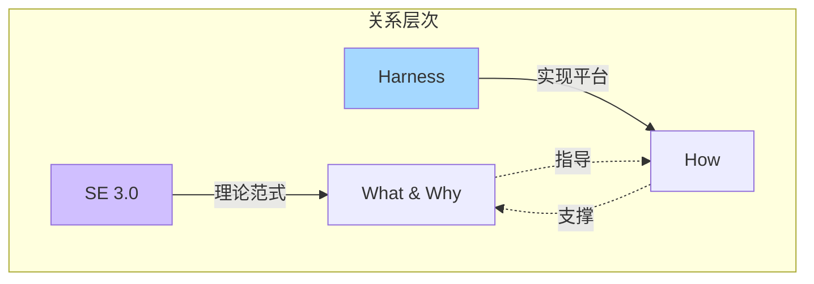
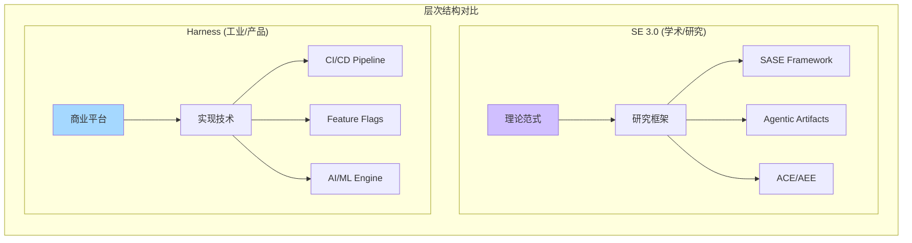
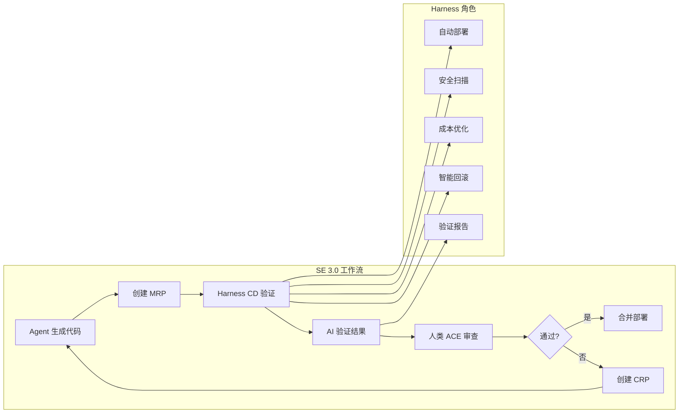
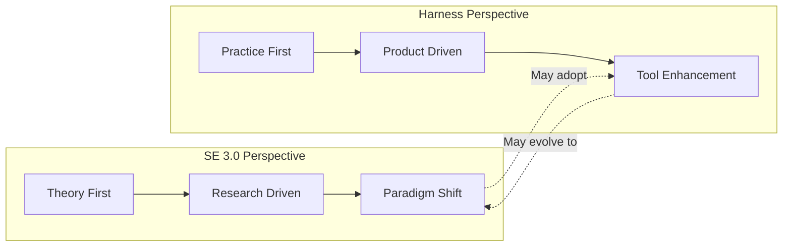
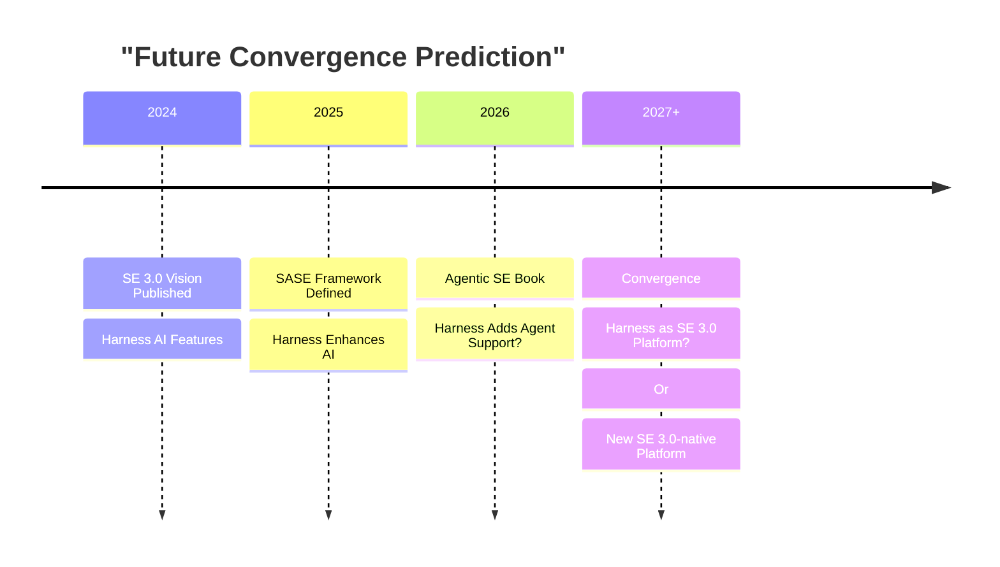

# Harness Platform 与 SE 3.0 关系深度分析

> 探索 Harness Engineering 与 Software Engineering 3.0 的关系、异同与交集

---

## 一、Harness 的双重含义

### 1.1 Harness 作为 DevOps 平台公司

**Harness.io** 是一家现代 DevOps 平台公司，提供以下核心产品：

| 产品模块 | 功能描述 |
|---------|---------|
| **Continuous Integration (CI)** | 自动化构建和测试 |
| **Continuous Delivery/Deployment (CD)** | 自动化部署和发布 |
| **Feature Flags** | 功能开关管理 |
| **Chaos Engineering** | 混沌工程，系统韧性测试 |
| **Cloud Cost Management** | 云成本管理和优化 |
| **Security Testing Orchestration** | 安全测试编排 (STO) |
| **AI/ML 驱动的自动化** | 智能验证、自动回滚、异常检测 |

### 1.2 Harness 作为动词/概念

**"To harness"** = 驾驭、利用、控制

在软件工程语境中：
- **Harnessing AI capabilities** (驾驭 AI 能力)
- **Harnessing automation** (利用自动化)
- **Harnessing cloud resources** (驾驭云资源)
- **Harnessing data** (利用数据驱动决策)

---

## 二、Harness 与 SE 3.0 的关系类型

### 2.1 关系定性：范式 vs 实现



**核心关系**: 
- **不是包含关系**
- **不是竞争关系**  
- **是 "范式-实现" 的互补关系**

### 2.2 交集分析

```mermaid
venn
    title "Harness vs SE 3.0 Overlap Analysis"
    "SE 3.0" 100
    "Harness" 60
    "Intersection" 40
```

#### 高度重叠领域 (🔴)

| 领域 | SE 3.0 概念 | Harness 功能 |
|------|------------|-------------|
| **部署自动化** | Runtime.next | Continuous Delivery |
| **AI 驱动** | Teammate.next | AI/ML 验证引擎 |
| **SLA 感知** | SLA-aware execution | Continuous Verification |

#### 部分重叠领域 (🟡)

| 领域 | SE 3.0 概念 | Harness 功能 |
|------|------------|-------------|
| **意图中心** | Intent-centric development | Pipeline as Code |
| **可观测性** | Trust Engineering | Monitoring & Verification |
| **成本控制** | Resource optimization | Cloud Cost Management |

#### 无直接交集 (🟢)

| SE 3.0 独有 | Harness 不涉及 |
|------------|---------------|
| ACE/AEE 双重工作台 | - |
| Agentic Artifacts (MRP, CRP) | - |
| AI Teammates 协作模型 | - |
| SASE 框架 | - |

---

## 三、核心差异对比

### 3.1 层次差异



### 3.2 详细对比表

| 维度 | SE 3.0 | Harness Platform |
|------|--------|------------------|
| **本质** | 学术研究范式 | 商业软件产品 |
| **目标** | 定义新范式、解决根本问题 | 提供工程解决方案 |
| **范围** | 全软件工程生命周期 | DevOps/CD 领域 |
| **Agent 角色** | 核心概念 (AI Teammates) | 增强功能 (AI 验证) |
| **创新点** | SASE 框架、双重工作台 | AI 驱动的部署自动化 |
| **意图中心** | 理论基础 | Pipeline as Code |
| **Artifact** | MRP, CRP, Mission Brief | Pipeline Config, Flags |
| **协作模型** | Human-AI symbiosis | Human uses AI tool |
| **可扩展性** | 开放研究、持续演进 | 产品功能迭代 |
| **目标用户** | 研究人员、架构师 | 工程师、DevOps 团队 |

### 3.3 技术栈映射

```
SE 3.0 Technology Stack          Harness Platform Mapping
─────────────────────────        ─────────────────────────
Teammate.next            ──────► AI/ML Engine (部分)
IDE.next                 ──────► IDE Plugins
Compiler.next            ──────► ─ (不直接涉及)
Runtime.next             ──────► CD + Feature Flags
ACE (Command Env)        ──────► Dashboard (部分)
AEE (Execution Env)      ──────► ─ (不适用)
Agentic Artifacts        ──────► Pipeline Configs
```

---

## 四、融合可能性分析

### 4.1 Harness 如何支持 SE 3.0 实践



### 4.2 互补价值

| SE 3.0 需求 | Harness 提供 | 补充价值 |
|------------|-------------|---------|
| **自动化验证** | CI/CD Pipeline | 快速反馈循环 |
| **SLA 保证** | Continuous Verification | 运行时质量保证 |
| **成本控制** | Cloud Cost Management | 资源优化建议 |
| **安全集成** | Security Testing Orchestration | 左移安全 |
| **混沌测试** | Chaos Engineering | 系统韧性验证 |
| **功能管理** | Feature Flags | 渐进式发布 |

---

## 五、视角差异分析

### 5.1 SE 3.0 视角：从理论出发

```
问题: 如何解决 AI 辅助开发的认知过载?
    ↓
方案: AI-Native 范式 + Intent-centric 开发
    ↓
框架: SASE + ACE/AEE + Agentic Artifacts
    ↓
实现: 需要新的工具支持 (可能包括 Harness-like 平台)
```

### 5.2 Harness 视角：从实践出发

```
问题: 如何优化 DevOps/CD 流程?
    ↓
方案: AI/ML 驱动的自动化
    ↓
产品: CI/CD + Feature Flags + Cost Management
    ↓
演进: 可能向 SE 3.0 概念靠拢
```

### 5.3 视角对比图



---

## 六、未来演进预测

### 6.1 可能的融合方向



### 6.2 两种演进路径

#### 路径 A: Harness 向 SE 3.0 演进

```
Harness Today
    ↓
Add Agent Collaboration Features
    ↓
Support Agentic Artifacts
    ↓
Implement ACE/AEE Concepts
    ↓
Harness as SE 3.0 Platform
```

#### 路径 B: 新的 SE 3.0-native 平台出现

```
SE 3.0 Research
    ↓
Open Source Implementation
    ↓
New Platform (SE 3.0-native)
    ↓
Integrates with Harness for CD
    ↓
Best-of-breed Ecosystem
```

---

## 七、结论

### 7.1 关系总结

```
┌─────────────────────────────────────────────────────────────┐
│                  关系类型：互补而非包含                       │
├─────────────────────────────────────────────────────────────┤
│                                                             │
│   SE 3.0 = 理论范式 (What & Why)                            │
│   └── 回答 "AI-native 开发应该是什么样的?"                   │
│                                                             │
│   Harness = 实现平台之一 (How)                               │
│   └── 回答 "如何在 DevOps 中实现 AI 驱动?"                   │
│                                                             │
│   交集：DevOps/CD 领域的 AI 驱动自动化                       │
│   差异：SE 3.0 更广泛 (Agent 协作), Harness 更聚焦 (交付)    │
│                                                             │
│   未来可能性：                                               │
│   1. Harness 演进为 SE 3.0 支持平台                          │
│   2. 新的 SE 3.0-native 平台出现                             │
│   3. 两者形成互补生态系统                                    │
│                                                             │
└─────────────────────────────────────────────────────────────┘
```

### 7.2 关键洞察

1. **SE 3.0 是学术定义的新范式**，Harness 是工业界的 DevOps 平台
2. **两者在 CI/CD 和 AI 自动化领域有显著交集**
3. **Harness 可以作为 SE 3.0 中 Runtime.next 的一种实现**
4. **SE 3.0 的 ACE/AEE 概念超越了 Harness 当前的产品边界**
5. **未来可能是融合而非替代**：Harness 可能成为 SE 3.0 生态的一部分

### 7.3 对实践者的建议

| 角色 | 建议 |
|------|------|
| **研究人员** | 关注 SE 3.0 理论框架，Harness 可作为实验平台 |
| **架构师** | 采用 SE 3.0 范式指导设计，Harness 实现 CD 部分 |
| **工程师** | 使用 Harness 提升 DevOps 效率，关注 SE 3.0 演进 |
| **决策者** | Harness 是今天的解决方案，SE 3.0 是明天的方向 |

---

## 参考文档

1. Hassan et al. (2024). Towards AI-Native Software Engineering (SE 3.0)
2. Harness.io Official Documentation
3. Agentic Software Engineering Book (Hassan, 2026)

---

*分析生成时间: 2025年*
*分类: Software Engineering / DevOps / AI-Native Development*
