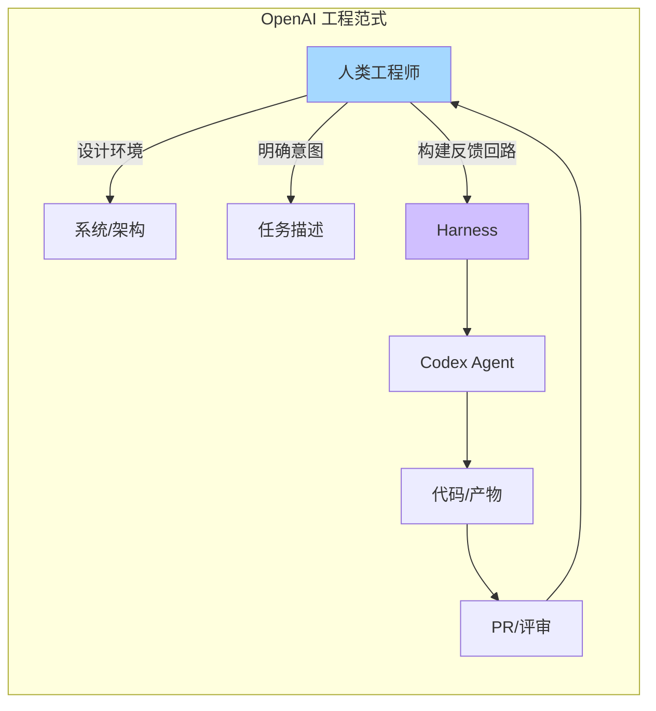
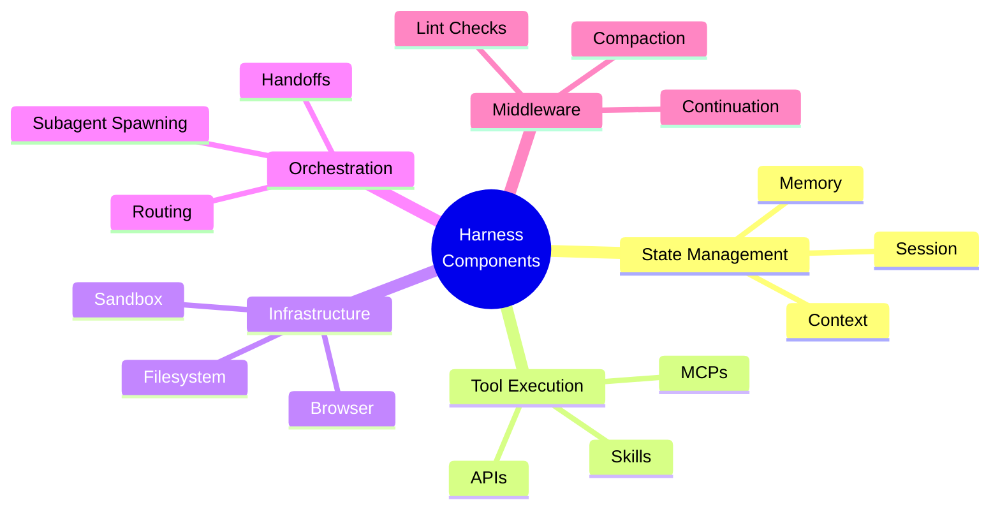
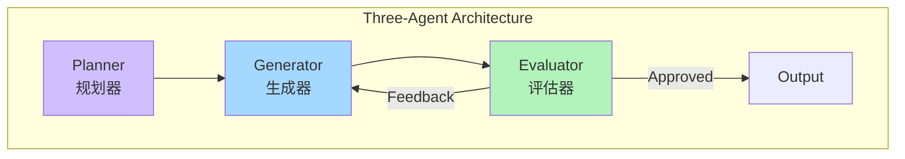
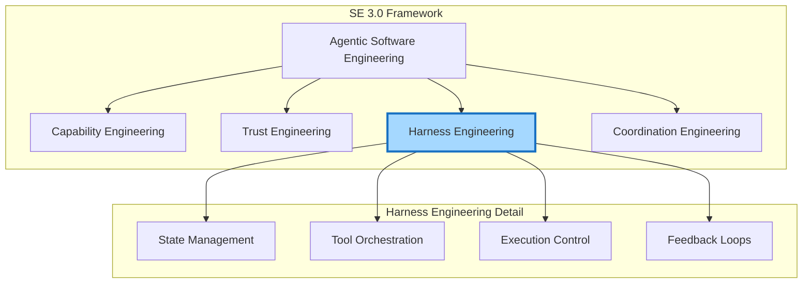

# Harness Engineering 深度总结

> 基于 OpenAI、Anthropic、LangChain 2026 年最新文章
> 
> 核心洞察：Harness Engineering 是 AI Agent 时代的核心工程学科

---

## 一、Harness 的定义

### 1.1 LangChain 的简洁定义

```
Agent = Model + Harness

Harness = 除模型本身外的所有代码、配置和执行逻辑
```

**核心观点**: "If you're not the model, you're the harness."

### 1.2 Harness 包含什么

| 组件 | 说明 |
|------|------|
| **System Prompts** | 系统提示词 |
| **Tools, Skills, MCPs** | 工具及其描述 |
| **Infrastructure** | 文件系统、沙盒、浏览器等基础设施 |
| **Orchestration Logic** | 编排逻辑（子 Agent 生成、交接、模型路由） |
| **Hooks/Middleware** | 确定性执行的钩子/中间件（压缩、延续、检查） |

### 1.3 为什么需要 Harness

模型本身只能接收和输出文本，无法：
- 维护跨交互的持久状态
- 执行代码
- 访问实时知识
- 设置环境和安装包

**这些都是 Harness 层面的功能。**

---

## 二、Harness Engineering 的核心原则

### 2.1 OpenAI: "人类掌舵。智能体执行。"



**关键转变**：
- 工程师的主要工作不再是编写代码
- 而是设计环境、明确意图、构建反馈回路
- 让 Codex 能够可靠地工作

### 2.2 Anthropic: "Harnesses encode assumptions"

```
核心洞察：Harnesses encode assumptions that go stale as models improve.

Harness 编码了关于"模型不能做什么"的假设。
但这些假设会随着模型改进而过时。
```

**例子**：
- Claude Sonnet 4.5 有"上下文焦虑"（context anxiety）
- 在上下文限制接近时会过早结束任务
- 解决方案：在 Harness 中添加上下文重置
- 但 Claude Opus 4.5 已经没有这个问题
- 重置变成了死代码（dead weight）

### 2.3 关键原则总结

| 原则 | 来源 | 含义 |
|------|------|------|
| **人类掌舵** | OpenAI | 人类设计系统，Agent 执行 |
| **假设会过时** | Anthropic | Harness 需要随模型演进 |
| **模型 + 框架** | LangChain | Agent = 智能 + 控制 |
| **大脑与手分离** | Anthropic | 解耦智能与执行 |

---

## 三、Harness 的核心组件

### 3.1 LangChain 的 Harness 解剖



### 3.2 Anthropic 的三 Agent 架构



**创新点**：
- 借鉴 GANs（生成对抗网络）思想
- Generator 生成，Evaluator 评估
- 将主观判断（"这个设计好吗？"）转化为可评分的标准

### 3.3 OpenAI 的代码仓库即记录系统

```
传统方法: AGENTS.md (大文档)
    ❌ 情境是稀缺资源
    ❌ 过多指导无效
    ❌ 立即腐烂
    ❌ 难以验证

OpenAI 方法: 代码仓库作为地图
    ✅ 模块化文档
    ✅ 代码即文档
    ✅ 可机械检查
    ✅ 版本控制
```

---

## 四、Harness Engineering 实践

### 4.1 OpenAI 的实践经验

**项目规模**：
- 2025 年 8 月开始
- 3 名工程师 → 7 名工程师
- 约 100 万行代码
- 约 1,500 个 PR
- 每位工程师每天 3.5 个 PR

**关键实践**：

1. **深度优先工作方式**
   - 拆解大目标为小模块
   - 提示 Agent 构建模块
   - 使用模块解锁复杂任务

2. **提高应用程序可读性**
   - 让 UI、日志、指标对 Codex 直接可读
   - Chrome DevTools 协议接入
   - DOM 快照、截图、导航技能

3. **可观测性**
   - 临时本地可观测性堆栈
   - LogQL 查询日志
   - 独立版本运行，完成后删除

### 4.2 Anthropic 的 Managed Agents

**核心理念**：Decoupling the brain from the hands

```
虚拟化 Agent 组件：
- Session: 发生的所有事情的追加日志
- Harness: 调用 Claude 的循环
- Tools: Agent 可以调用的能力
- Artifacts: 跨 Session 传递上下文
```

**稳定性设计**：
- 接口保持稳定
- Harness 实现可以变化
- 类似操作系统虚拟化硬件

### 4.3 Harness 设计模式

| 模式 | 描述 | 来源 |
|------|------|------|
| **Planning** | 分解任务、跟踪进度 | LangChain |
| **Delegation** | 生成子 Agent 并行工作 | LangChain |
| **Evaluation** | 生成器 + 评估器 | Anthropic |
| **Context Reset** | 管理长上下文 | Anthropic |
| **Artifact Handoff** | 跨 Session 传递上下文 | Anthropic |
| **App Readability** | 让应用对 Agent 可读 | OpenAI |

---

## 五、Harness Engineering 与 SE 3.0 的关系

### 5.1 关系定位



### 5.2 Harness Engineering 在 SE 3.0 中的角色

| SE 3.0 组件 | Harness Engineering 贡献 |
|------------|-------------------------|
| **Teammate.next** | 定义 Agent 如何被驾驭 |
| **IDE.next** | Harness 集成到开发环境 |
| **Compiler.next** | Harness 控制代码生成 |
| **Runtime.next** | Harness 管理执行 |
| **ACE** | Harness 支持人类监督 |
| **AEE** | Harness 约束 Agent 行为 |
| **Agentic Artifacts** | Harness 管理 Artifact 流转 |

### 5.3 关键洞察

**Harness Engineering 是 SE 3.0 的实现层**：
- SE 3.0 提供理论框架（SASE、ACE/AEE）
- Harness Engineering 提供具体实现方法
- 两者是理论与实践的关系

**Harness 是 Agent 的"操作系统"**：
- 类似 OS 虚拟化硬件
- Harness 虚拟化 Agent 能力
- 提供稳定接口，隐藏实现细节

---

## 六、Harness Engineering 最佳实践

### 6.1 设计原则

1. **假设会过时**
   - 模型能力快速提升
   - 今天的限制明天可能消失
   - 设计可演进的 Harness

2. **人类掌舵，Agent 执行**
   - 人类设计系统和意图
   - Agent 负责实现细节
   - 清晰的反馈回路

3. **代码仓库即记录系统**
   - 避免大文档（AGENTS.md）
   - 模块化、可验证的文档
   - 版本控制一切

4. **提高可读性**
   - 让应用对 Agent 可读
   - 可观测性工具集成
   - 独立测试环境

### 6.2 反模式

| 反模式 | 问题 | 解决方案 |
|--------|------|---------|
| **大文档** | 情境溢出、难以维护 | 模块化文档 |
| **硬编码假设** | 随模型改进过时 | 可配置、可检测 |
| **人工 QA 瓶颈** | 人类注意力有限 | 自动化验证 |
| **紧耦合** | 难以演进 | 解耦大脑与手 |

---

## 七、未来展望

### 7.1 Harness 的演进方向

```
当前: Harness 编码模型限制
    ↓
未来: Harness 提供能力边界
    ↓
愿景: Harness 成为 Agent 操作系统
```

### 7.2 与 SE 3.0 的融合

- **Managed Agents** 模式将成为标准
- **三 Agent 架构** 推广到更多场景
- **Artifact 驱动** 的开发流程
- **代码仓库即记录系统** 成为最佳实践

---

## 八、总结

### 8.1 核心定义

**Harness Engineering** 是设计和实现 Agent 运行环境的工程学科：
- 提供 Agent 所需的基础设施
- 管理 Agent 的状态和上下文
- 控制 Agent 的行为边界
- 建立人机协作的反馈回路

### 8.2 关键公式

```
Agent = Model + Harness

Harness = State + Tools + Infrastructure + Orchestration + Middleware

SE 3.0 = Theory (SASE, ACE/AEE)
Harness Engineering = Implementation
```

### 8.3 关键洞察

1. **Harness 编码的假设会过时** — 需要持续演进
2. **人类掌舵，Agent 执行** — 新的工程范式
3. **Agent = Model + Harness** — 清晰的边界定义
4. **解耦大脑与手** — 稳定的接口，灵活的实现
5. **代码仓库即记录系统** — 可验证的文档

---

## 参考文章

1. **OpenAI** (2026-02-11). "工程技术：在智能体优先的世界中利用 Codex"
   - https://openai.com/zh-Hans-CN/index/harness-engineering/

2. **Anthropic** (2026). "Scaling Managed Agents: Decoupling the brain from the hands"
   - https://www.anthropic.com/engineering/managed-agents

3. **Anthropic** (2026-03-24). "Harness design for long-running application development"
   - https://www.anthropic.com/engineering/harness-design-long-running-apps

4. **LangChain** (2026-03-10). "The Anatomy of an Agent Harness"
   - https://www.langchain.com/blog/the-anatomy-of-an-agent-harness

---

*文档生成时间: 2026年*
*分类: AI Agent / Software Engineering / SE 3.0*
