# Software Engineering 3.0 (SE 3.0) 深度总结

> 基于 Ahmed E. Hassan 研究团队的正式学术论文
> 
> 核心文献:
> 1. "Towards AI-Native Software Engineering (SE 3.0): A Vision and a Challenge Roadmap" (arXiv:2410.06107, 2024)
> 2. "The Rise of AI Teammates in Software Engineering (SE) 3.0" (arXiv:2507.15003, 2025)
> 3. "Agentic Software Engineering: Foundational Pillars and a Research Roadmap" (arXiv:2509.06216, 2025)
> 4. "Agentic Software Engineering: Building Trustworthy Software with Stochastic Teammates at Unprecedented Scale" (Book, 2026)

---

## 一、从 SE 2.0 到 SE 3.0 的范式转变

### SE 2.0: AI-Assisted Software Engineering

**核心特征:**
- AI Coding Assistants (GitHub Copilot, Claude Code, Cursor)
- Task-driven, code-centric workflows
- Human remains at the center of code-creation loop
- High cognitive overload on developers

**局限性:**
- 开发者必须持续分解问题、提示 AI、评估建议、调试失败
- 模型训练依赖大量非结构化互联网数据，计算和环境成本巨大
- 前端模型缺乏深度理解和推理软件工程原则的能力

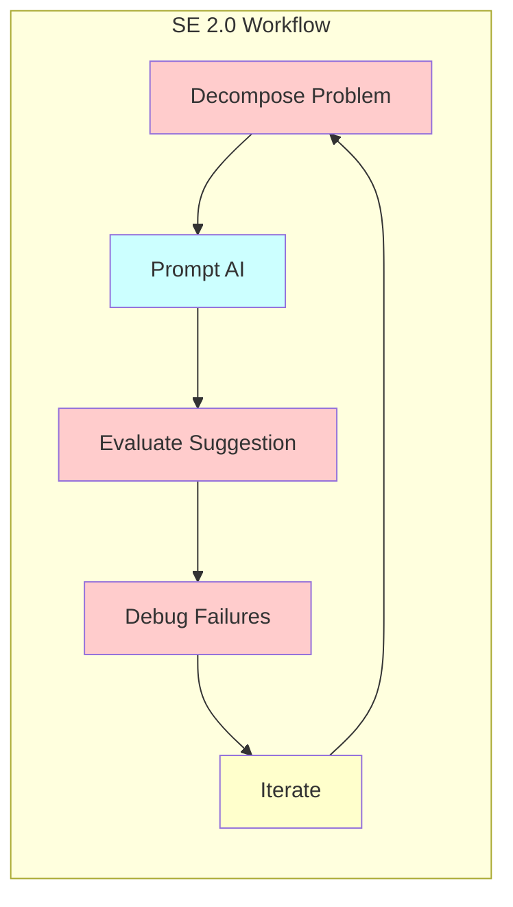

---

### SE 3.0: AI-Native / Agentic Software Engineering

**核心特征:**
- **Intent-centric**: 以意图为中心的开发
- **Conversation-oriented**: 对话式开发
- **AI Teammates**: AI 作为队友而非工具
- **Symbiotic collaboration**: 人机共生协作

**关键转变:**
- 从 "AI-assisted" 到 "AI-native"
- 从 "task-driven copilots" 到 "intelligent collaborators"
- 从 "code-centric" 到 "intent-centric"

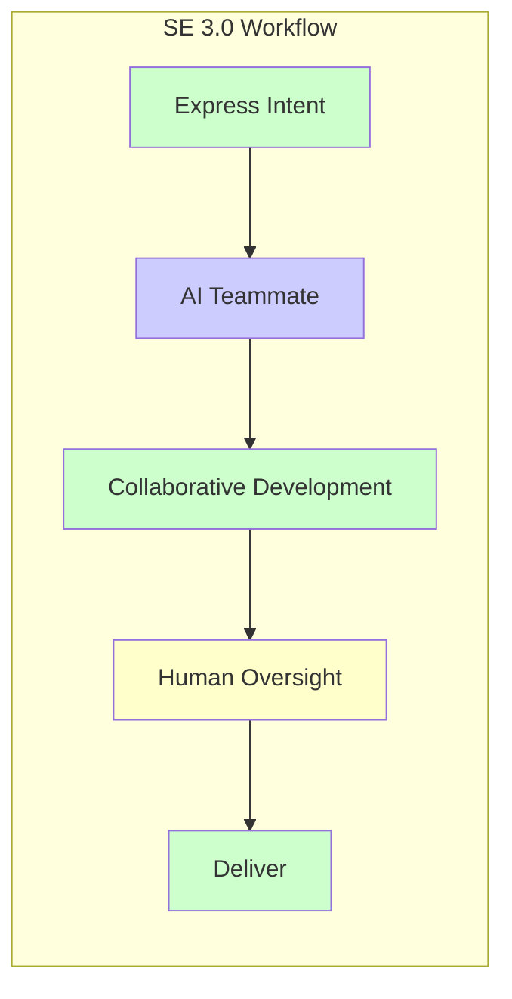

---

## 二、SE 3.0 技术栈 (Technology Stack)

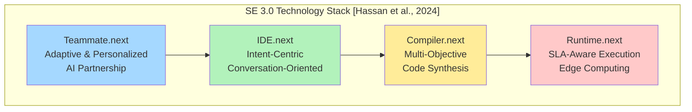

### 2.1 Teammate.next
- 自适应和个性化的 AI 伙伴关系
- 深度理解软件工程原则
- 能够进行推理和意图理解

### 2.2 IDE.next
- 意图中心的对话式开发环境
- 超越传统的代码编辑器
- 支持自然语言交互

### 2.3 Compiler.next
- 多目标代码合成
- 不仅生成代码，还考虑性能、安全性、可维护性
- 知识驱动的模型

### 2.4 Runtime.next
- SLA 感知的执行环境
- 边缘计算支持
- 动态优化和自适应

---

## 三、SASE 框架: Structured Agentic Software Engineering

### 3.1 SE 的双重性 (Duality)

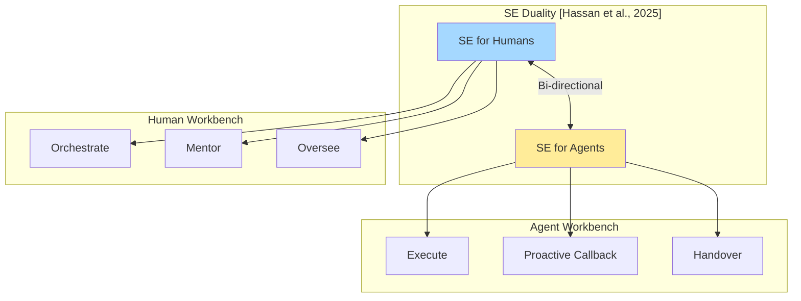

### 3.2 双重工作台 (Dual Workbenches)

#### ACE: Agent Command Environment (人类工作台)
- **Command Center**: 人类编排、指导、监督 Agent 团队
- **Inbox Management**: 管理 Agent 生成的事件
  - MRPs (Merge-Readiness Packs)
  - CRPs (Consultation Request Packs)
- **Mentorship**: 结构化指导 Agent

#### AEE: Agent Execution Environment (Agent 工作台)
- **Task Execution**: Agent 执行复杂任务
- **Proactive Human Callback**: 面对复杂权衡或模糊性时主动调用人类
- **Handover Support**: 支持任务交接

### 3.3 SE 四大支柱的重新想象

| 支柱 | SE 2.0 | SE 3.0 (ACE) | SE 3.0 (AEE) |
|------|--------|--------------|--------------|
| **Actors** | Human developers | Human orchestrators | AI Agents |
| **Processes** | Traditional SDLC | Mentorship, Oversight | Autonomous execution |
| **Tools** | IDE, CI/CD | ACE Dashboard | Agent workbench |
| **Artifacts** | Code, Docs | MRPs, CRPs | Resolution Records |

---

## 四、Agentic Artifacts (结构化制品)

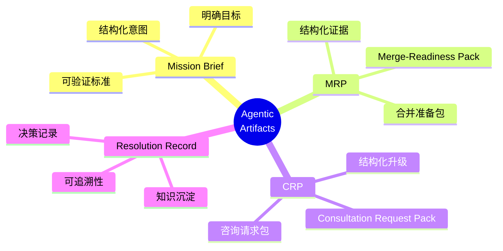

### 4.1 Mission Brief (任务简报)
- **Structured Intent**: 将模糊的意图转化为明确的、可验证的目标
- **Exit Criteria**: 定义完成标准
- **Constraints**: 明确约束条件

### 4.2 MRP (Merge-Readiness Pack)
- **Structured Evidence**: 结构化的合并准备证据
- **Test Results**: 测试结果汇总
- **Review Summary**: 代码审查总结
- **Risk Assessment**: 风险评估

### 4.3 CRP (Consultation Request Pack)
- **Structured Escalation**: 结构化的升级请求
- **Trade-off Analysis**: 权衡分析
- **Options**: 可选方案
- **Recommendation**: Agent 的建议

### 4.4 Resolution Record
- **Decision Documentation**: 决策文档化
- **Rationale**: 决策理由
- **Learning**: 经验学习

---

## 五、AIDev 数据集: 实证研究发现

### 5.1 数据集规模

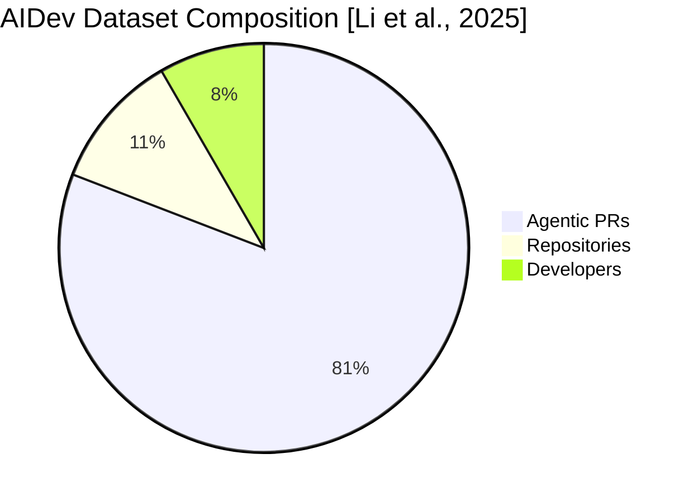

### 5.2 五大自主 Agent

| Agent | 特点 |
|-------|------|
| **OpenAI Codex** | OpenAI 的编码 Agent |
| **Devin** | Cognition Labs 的全自主 Agent |
| **GitHub Copilot** | GitHub 的 AI 编程助手 |
| **Cursor** | 基于 IDE 的 AI 编辑器 |
| **Claude Code** | Anthropic 的编码 Agent |

### 5.3 关键发现

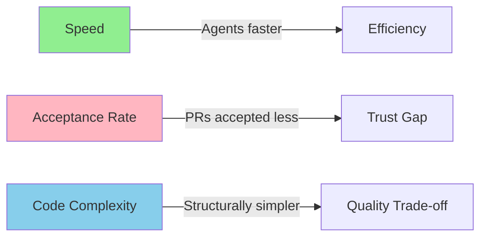

1. **速度优势**: Agent 提交代码的速度远超人类
   - 一个开发者在 3 天内提交的 Agentic PR 数量相当于之前 3 年手动提交的数量

2. **接受率差距**: Agent 的 PR 接受率低于人类
   - 揭示了 benchmark 性能与实际信任之间的鸿沟

3. **代码复杂度**: Agent 生成的代码结构更简单
   - 通过传统代码复杂度指标量化

4. **信任挑战**: 需要建立新的信任机制
   - 从 "能否工作" 到 "是否可信"

---

## 六、从 Vibe Coding 到 Agentic SE

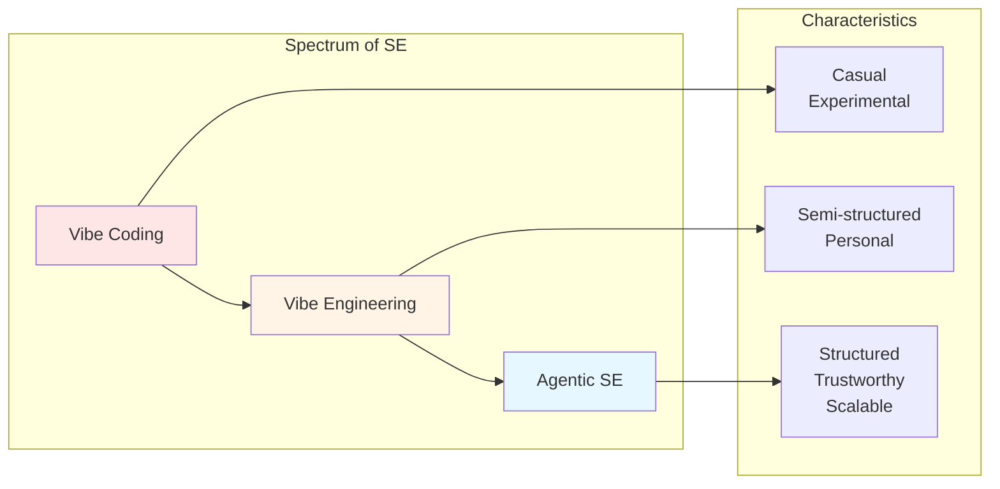

### 6.1 Vibe Coding
- 随意、实验性的编码方式
- 个人使用，不适用于生产环境
- "Just vibe it" 的态度

### 6.2 Vibe Engineering
- 半结构化的工程实践
- 个人或小团队使用
- 开始考虑可维护性

### 6.3 Agentic SE
- 完全结构化的工程学科
- 可信赖、可扩展
- 企业级应用

---

## 七、三大工程学科

### 7.1 Trust Engineering (信任工程)

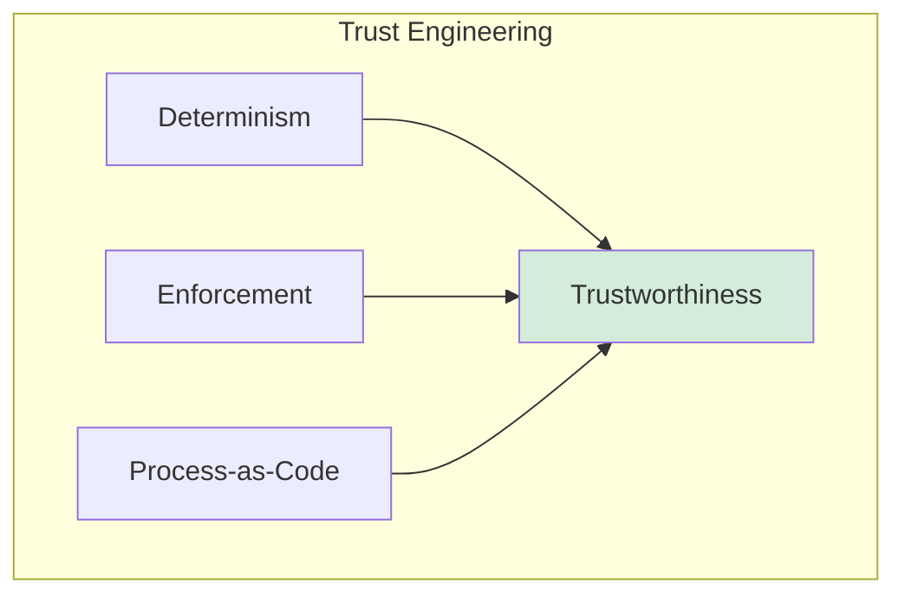

- **Determinism**: 确定性保证
- **Enforcement**: 规则执行
- **Process-as-Code**: 流程即代码

### 7.2 Capability Engineering (能力工程)
- 定义 Agent 的能力边界
- 能力评估和度量
- 持续能力改进

### 7.3 Coordination Engineering (协调工程)
- 多 Agent 协调
- 人机协作模式
- 任务分配和调度

---

## 八、研究路线图与挑战

### 8.1 关键挑战

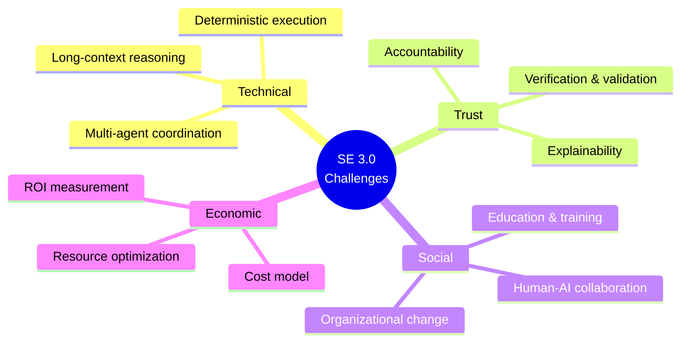

### 8.2 研究机会

1. **Benchmarking**: 建立新的评估基准
   - 超越 SWE-bench 的真实世界评估
   - 信任度量和预测

2. **Agent Readiness**: Agent 就绪度评估
   - 代码库适应性分析
   - 任务复杂度评估

3. **Collaboration Modeling**: 协作建模
   - 人机交互模式
   - 团队动态研究

4. **AI Governance**: AI 治理
   - 政策和规范
   - 伦理和安全

---

## 九、对软件工程教育的影响

### 9.1 新技能要求

| 传统技能 | SE 3.0 新技能 |
|----------|---------------|
| 编程语言精通 | 意图表达和验证 |
| 算法设计 | Agent 编排和监督 |
| 调试能力 | 信任工程 |
| 代码审查 | Artifact 审查 |

### 9.2 教育转变

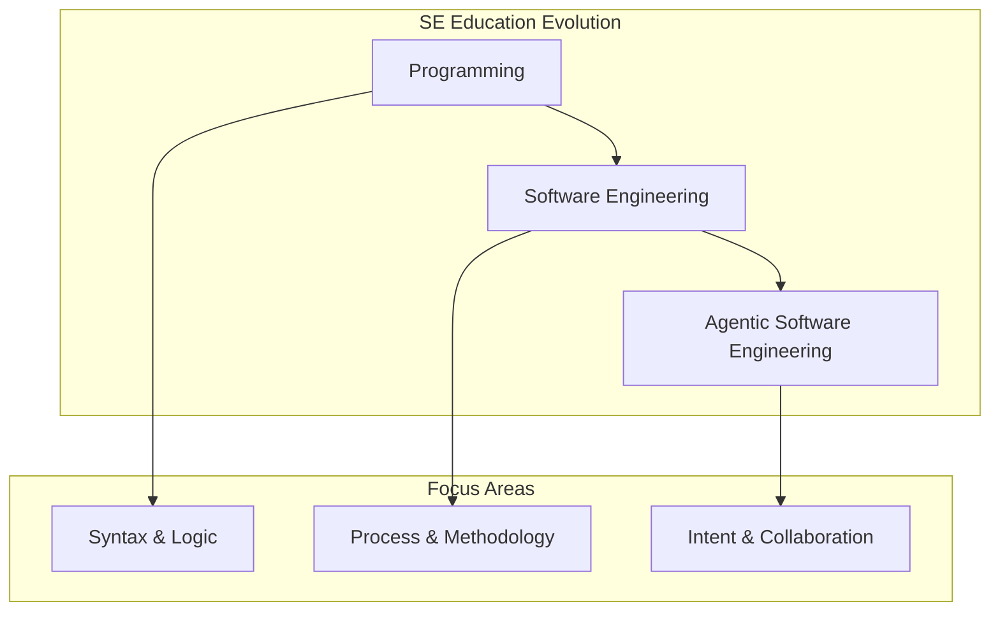

---

## 十、总结与展望

### 10.1 核心观点

1. **SE 3.0 不是终点，而是新起点**
   - 从 "AI-assisted" 到 "AI-native" 的根本转变
   - 人机共生的新范式

2. **结构化是关键**
   - SASE 框架提供结构化方法
   - Agentic Artifacts 作为新的工程层

3. **信任是核心挑战**
   - 技术能力与实际信任之间的差距
   - 需要新的信任工程学科

4. **实证研究的重要性**
   - AIDev 数据集提供真实世界证据
   - 从理论到实践的桥梁

### 10.2 未来展望

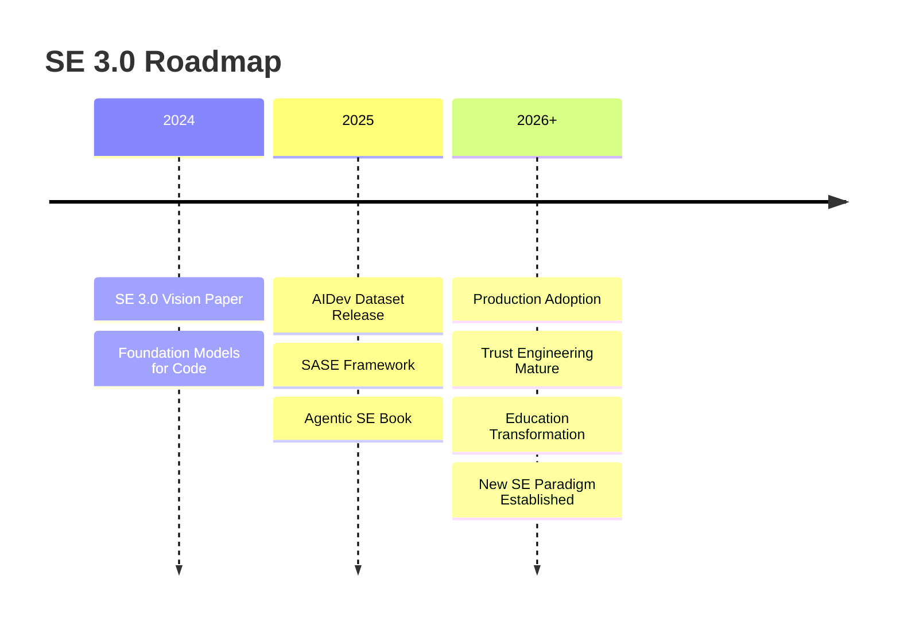

---

## 参考文献

1. Hassan, A. E., Oliva, G. A., Lin, D., Chen, B., & Jiang, Z. M. (2024). Towards AI-Native Software Engineering (SE 3.0): A Vision and a Challenge Roadmap. arXiv:2410.06107.

2. Li, H., Zhang, H., & Hassan, A. E. (2025). The Rise of AI Teammates in Software Engineering (SE) 3.0: How Autonomous Coding Agents Are Reshaping Software Engineering. arXiv:2507.15003.

3. Hassan, A. E., Li, H., Lin, D., Adams, B., Chen, T. H., Kashiwa, Y., & Qiu, D. (2025). Agentic Software Engineering: Foundational Pillars and a Research Roadmap. arXiv:2509.06216.

4. Hassan, A. E. (2026). Agentic Software Engineering: Building Trustworthy Software with Stochastic Teammates at Unprecedented Scale. Book, v0.5a.

---

*文档基于 Ahmed E. Hassan 研究团队的正式学术论文生成*
*分类: Software Engineering / AI / Agentic Systems*
