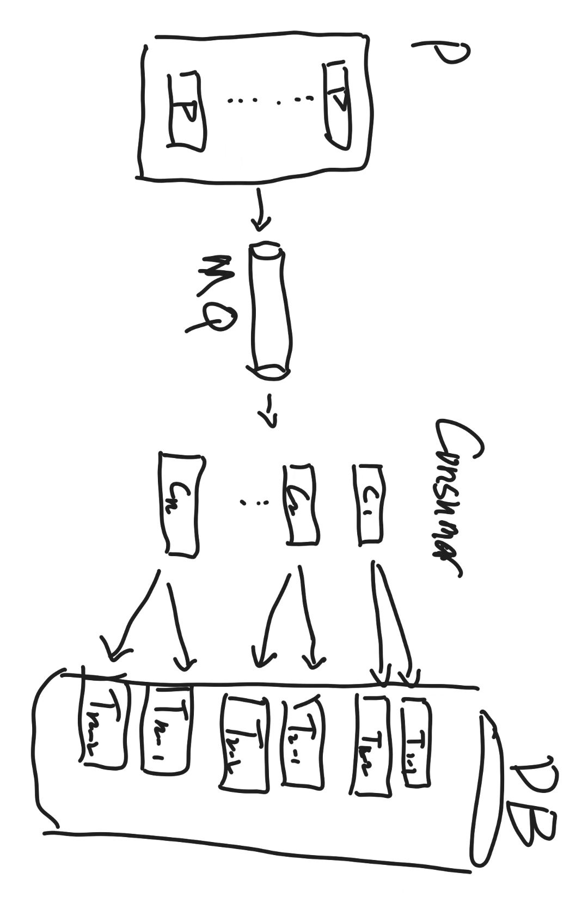

## 背景

消费者服务查询数据库键是否存在, 如果不存在则新插入, 如果存在则更新;

因为使用了分区插件无法进行批量写

无更新数据时, 速率: 2000/s; 有更新数据时, 速率下降到300/s

## 问题归因分析

1.  mysql连接是否复用

2.  每次查询数据库键是否必要, 额外的请求, 操作会带来消耗; 在mysql连接里半双工通信, 每条连接需要等待上条连接的结果返回

3.  分区插件导致无法批量写, 每次写操作对应一次请求, 多次网络请求等待响应是否带来影响

4.  更新时速率下降是否有锁占用带来的资源等待

5.  消费方式是否有影响, \[批量消费X\]-\>\[同步阻塞等待数据更新结果\]-\>\[下次消费\]; X的量级是否会对速度有影响, 问题关联到是获取数据与数据库更新的匹配速度;

## 优化方法&引入问题

优化:

1.  连接使用sdk维护应该有连接池维护, 保持连接数\>=分区数

2.  如果判断的key是唯一的, 尝试使用insert on dupilcate key update; 减少一次查询的请求, 在插入唯一键时做判断

3.  舍弃分区插件,应用自身维护分区逻辑,每次批量消费后, 分区到对应的buffer区进行批量插入/更新

4.  对于该服务的数据库会话使用RC级别, 有更新使用gap lock时, 其他插入/更新操作的锁等待

5.  未试验确定消费量级大小的影响暂不进行修改

引入问题:

1.  连接数数量需要考虑到数据库最大连接使用量; 可查询mysql的max_connections; 消费者数量\*单体连接量+其他读取连接量; 理论上**没有影响**;

2.  要求判断的key是唯一值, 需要是主键或者unique index; 键特性是非空, 且当前建有索引, 所以理论上**不会有问题引入**;

3.  舍弃分区插件, 增加代码复杂度和后期的维护成本, 需要维护分区逻辑和数据分表对应; **可以接受**;

4.  仅消费者服务的连接会话修改隔离级别, 理论上只影响该服务的写入时上锁逻辑; 如果其他服务不会对数据进行写, 只有读操作的话, 不会影响其他服务; 隔离级别下降不会升级锁等待逻辑, 无死锁可能引入; 理论上**没有影响**;

## 总结

设表分区量=N

消费者服务的连接池保持N+1

连接的会话配置隔离等级=RC

将写入操作, 改成INSERT \... ON DUPILCATE KEY UPDATE;

在代码处进行分区逻辑, 待写buffer\[N\], 进行同key过滤, 只保留最新时间戳的数据; 每次消费对N个buffer进行写入刷新;

## 展望

1.  消息队列消费速率与数据库存储比值实验, 探索消费量级对整体速率的影响

2.  增加本地缓存; 理论上数据库写入速度\<消息队列消费速度, 将消费数据缓存在内存, 在多轮消费后批量写入(不是对速度极限要求下不建议, 会造成数据丢失, 分区情况下对数据offset校验较为复杂)

3.  消息队列分区和数据库分区对应

{width="3.03125in" height="4.885416666666667in"}
