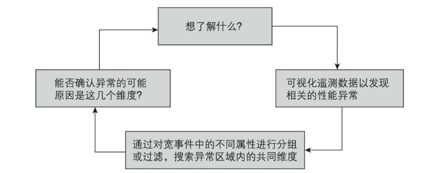
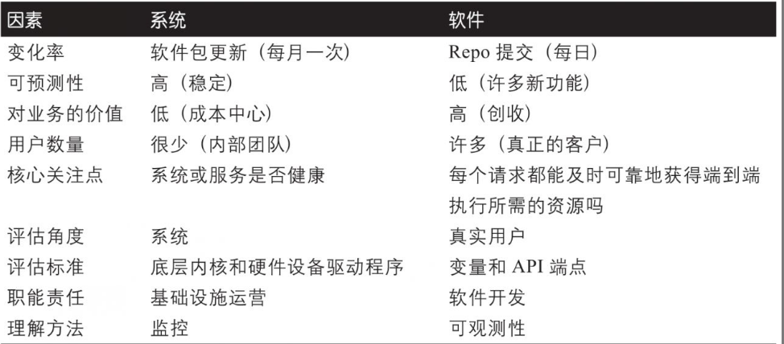
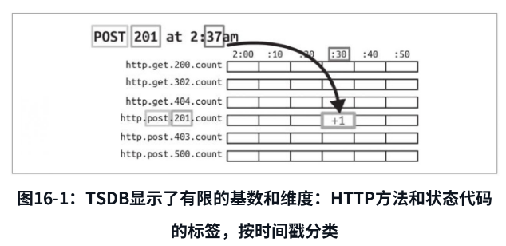
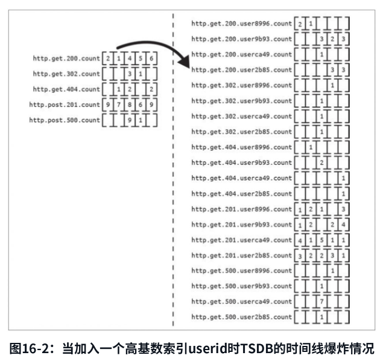

## 可观测性的路径

### 什么是可观测性

#### 定义

observability "可观测性"一词是由工程师鲁道夫·E.卡尔曼(Rudolf E.Kálmán)在1960年创造的

**可以根据系统的外部输出信息推断出系统内部状态的好坏**

如何应用到软件系统中:

1.  了解应用内部的运行情况

2.  了解应用可能得所有状态(包括之前没见过, 未预测到的状态)

3.  通过观测和使用外部工具了解内部运行情况和系统状态

4.  理解内部状态对系统的影响意义, 而不是用新的自定义代码来定义某个状态

以上的比较概念型, 不是具体实现手段

**另外一个观点:**

可观测性没有任何特殊含义, 只是遥测(telemetry)的同义词, 和监控没有区别;

可观测性 = 指标metrics + 日志log + 链路trace

**基数的概念**: 一个集合中唯一值的数量; 基数越小, 说明集合内这个维度有很多重复值, 基数越大, 说明集合内很多都是唯一值;

高基数可以准确定位, 但不方便统计, 需要聚合为低基数

**维度的概念**: 基数是指value的唯一性, 而维度就是数据key的数量;

越多的维度就可以越详细的定位; 比如: ​"所有502错误请求都发生在过去半小时，发生在主机foo上"

被动发现-\>主动发现(怎么做呢, 没说)

第一部分纯在扯蛋啊, 一点干货没有

## 可观测化基础

### 结构化事件 可观测性构建块

结构化事件: 这个应该是MELT的E吧? 描述像是每次请求所有的信息记录

他的观点是以事件为构建块

然后举证:

1.  metric指标的局限性: 因为维度和基数的限制, 虽然可以不断增加指标来完善, 但是困难

2.  日志的局限性: 非结构化的内容, 最初目的是方便人阅读; 优化成固定schema的结构化日志, 但这时候是作为事件的一部分了

成熟探针的生成的事件有300-400个维度(哪来这么多)

要求支持高基数维度的查询(之前007/伽利略就是不行的)

事件还要任意宽的动态schema

### 将事件拼接成链路(trace)

除了trace_id, 链路中每次调用还有span概念, 然后就各维度的属性

简单的做, 可以根据span的父子关系产生瀑布图

后续第10章会说更多做法

还有注意哪些字段可以放到span内

**探针**的硬编码实现: 其实探针就是你逻辑执行的检查点收集当时的属性数据, 然后组合成结构化日志做上报(那就是事件了)

### OTel探针

#### Otel的组成

-   API: 应该是上报端的接口, 让你可以自定义探针

-   SDK: 上报数据的客户端组件了

-   tracer: SDK中跟踪进程/服务活跃span的, 修改某个请求在这个服务的状态上下文等

-   meter: SDK中负责跟踪进程/服务的可用指标, 维护指标状态的

-   上下文传播: SDK中, 从context还原事件数据的逻辑

-   exporter: 看描述是序列化器和发消息的逻辑

-   collector: 接收sdk发送的otel数据的(默认是OTLP格式), 处理数据并转发到其他处理服务

#### 自动化探针

这是应该的, 对于常见rpc, http接口, 数据库访问等自动采集, 因为都是标准协议所以不需要重复写

go中是通过拦截器模式实现的探针(没有装饰器语法糖的悲哀)

**自定义探针**

**创建span**

**添加自定义字段**

**自定义process-wide metrics**

otel的metrics增加键值

**数据导出到监控后端**

默认是发送到本地sidecar端口, 也可以自定义如何发送

支持通过Otel collector代理转发, 也可以直接导出到后端处理

### 通过事件分析实现可观测性

{width="5.772222222222222in" height="2.273307086614173in"}

1.  得到了什么反馈(告警, 其他反馈等)

2.  验证反馈是否属实

3.  搜索其他有影响的维度; 维度中是否键值的数值异常, 其他维度是否有异常, 同比环比对比数据和反馈时间点对比

4.  如果可以定位到异常点, 就OK, 不行的话, 继续回到3, 从更多维度, 键值, 不同的时间片对比;

### 可观测性和监控的融合

但是我觉得可观测性也是包含了指标的, 那么也有监控的属性

文中表示, 可观测性适合应用程序/服务, 监控适合系统

比如容器的指标监控, 你很难去划定事件进行收集, 因为如果按系统的事件来的话, 太多你不想要的信息了

而应用程序可以根据接口的调用/被调用进行时间的划分

{width="5.772222222222222in" height="2.5364588801399823in"}

### 可观测性驱动开发

**可观测性左移**

左移说的是开发周期的左移咯, 在设计, 编码阶段就开始引入

### 使用SLO提高可靠性

**SLO**

服务级别目标, 几个9!

**SLI**

服务级别指标, 一般有两种, 基于时间的测量(时间片内, 某条件的P99,Pxx的百分位数), 基于事件的测量(滚动窗口内, 满足条件的事件比例)

一个关注百分比的数值, 一个关注满足数值的占比

传统的监控告警, 基于已知的未知进行配置告警, 有以下问题:

1.  告警疲劳, 某些噪声告警导致开发人员忽视了真正的问题

2.  无法反应真正影响用户体验的问题

因为系统的复杂度的上升, 单一或者少量的指标的静态阈值不能完全反映出问题;

这不代表我们不需要前面的东西, 而是要增加更多维度的识别能力

**更多维度, 更异构**

虽然简单的静态阈值不行, 依旧是强力武器, 根据设定的SLO, 制定组合的阈值条件

## 大规模可观测性

### 可观测性的数据存储

所以当初监控指标为限制维度内的基数; 就是因为时序数据库内按维度所有基数相乘的作为时序值的存储key

{width="5.772222222222222in" height="2.80417104111986in"}

高基数维度引起爆炸

{width="5.772222222222222in" height="5.481338582677165in"}

那么监控指标的存储在保留时序数据库的情况下, 如何存储结构化事件/trace呢?

NoSQL中, MongoDB可以存储traceid对应span列表, spanid存储动态schema的结构化事件

问题来了, 存储没问题, 但是因为需要对任意的维度的基数做查询, 你如果没有全部的索引, 那么速度会**非常慢**

那么宽列存储也会适合吧, 毕竟特征: 写多, append only, 不更新, 点查

利用SSTable, LSM树;

后续书中有提到: canssandra, es/open search, scyllaDB, InfluxDB(他也是时序); 但这些都不是为了链路跟踪做的存储

Granfana Tempo是一个较新的按链路跟踪数据设计的

还提到了列式存储(纯列), click house, druid, 但是这类无法做到动态schema吧? 如果结构化事件固定的话倒是可以

arcticDB也是专门用于性能剖析的, 也是列式存储

google的dapper方案

honeycomb的列式数据存储

基础的存储, 监控指标方面利用分层存储, 存储细粒度中间结果, 然后再做其他的聚合计算; 基础存储保证点查; 不同维度和时间片出中间结果时可以并行计算

### 精准采样

大部分的事件span都是正常的, 这些不会关注, 而是要关注失败, 异常, 错误的;

但是我们一般没有办法用普遍的方式去识别到; 还是会侵入业务逻辑

1.  概率采样()

2.  近期流量采样

3.  事件内容采样

4.  键和历史相结合

5.  动态采样

6.  对链路追踪采样
